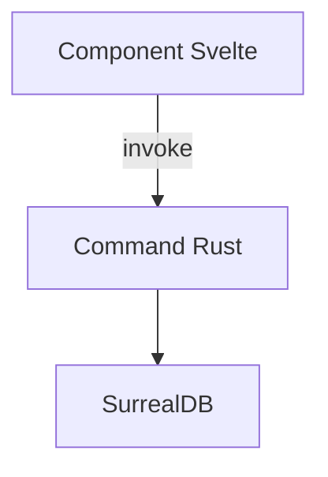

# Workflow de Planification Zileo-Chat-3

**Stack**: SvelteKit 2.49.0 + Svelte 5.43.14 | Rust 1.91.1 + Tauri 2.9.4 | SurrealDB 2.3.10

## Objectif

Créer un plan technique détaillé et actionnable pour `$ARGUMENTS` SANS implémentation de code. Produire une spécification complète permettant l'implémentation ultérieure.

---

## Configuration Projet

```
PROJECT_ROOT: (working directory)
SPEC_OUTPUT: docs/specs
DOCS_DIR: docs
SRC_FRONTEND: src
SRC_BACKEND: src-tauri
TYPES_DIR: src/types (alias: $types)
TAURI_CONFIG: src-tauri/tauri.conf.json
```

**IMPORTANT - TypeScript Imports**:
- Always use `$types` alias: `import type { X } from '$types/module'`
- Never use `$lib/types` (does not exist)

---

## Principes

- **SINCÉRITÉ**: Évaluation honnête de faisabilité et risques
- **RIGUEUR**: Analyse complète avant proposition
- **PATTERNS**: Identifier et réutiliser patterns existants
- **ZERO CODE**: Aucune implémentation, focus planification/architecture
- **PARALLEL DISCOVERY**: Task agents en parallèle pour exploration efficace

---

## Workflow

### Phase 1: Discovery Parallèle

Lancer Task agents en **parallèle** (même message, multiples appels):

**Agent 1 - Architecture Svelte/Rust**:
```
Explore architecture pour identifier:
- Organisation Svelte (routes, components, stores, lib)
- Commands Tauri (src-tauri/src/commands/)
- Communication IPC (invoke patterns)
- Points d'extension naturels
Output: Rapport avec fichiers clés et patterns
```

**Agent 2 - Features Similaires**:
```
Cherche fonctionnalités similaires:
- Composants Svelte réutilisables
- Commands Rust existantes
- Patterns state management (stores Svelte)
- Queries SurrealDB similaires
Output: Liste features avec paths et patterns réutilisables
```

**Agent 3 - Types & Contracts**:
```
Analyse types et contrats:
- Interfaces TypeScript (src/types/)
- Structs Rust (src-tauri/src/)
- Commands Tauri (signatures)
- Schémas SurrealDB si applicable
Output: Inventaire types + proposition nouveaux types (spec uniquement)
```

**Agent 4 - Dépendances & Intégration**:
```
Analyse dépendances:
- package.json (frontend)
- Cargo.toml (backend)
- Points d'intégration Tauri IPC
- Bibliothèques existantes réutilisables
Output: Carte dépendances et intégration
```

### Phase 2: Architecture & Design

Basé sur discovery, proposer:

1. **Structure Fichiers**
   - Frontend: Routes SvelteKit, composants, stores, types
   - Backend: Commands Rust, modules, models
   - Database: Schémas SurrealDB si nécessaire

2. **Flux de Données** (diagramme Mermaid)
   ```mermaid
   graph LR
       UI[Svelte Component] -->|invoke| IPC[Tauri IPC]
       IPC --> CMD[Rust Command]
       CMD --> DB[SurrealDB]
       DB --> CMD
       CMD --> IPC
       IPC --> UI
   ```

3. **Spécification Composants**
   Pour chaque composant:
   - **Frontend**: Props TypeScript, events, stores utilisés
   - **Backend**: Signature command, structs, error handling
   - **Database**: Queries, tables, relations

4. **Types et Contrats**
   ```typescript
   // Definition: src/types/feature.ts
   export interface FeatureData { ... }

   // Import (components/stores): use $types alias
   import type { FeatureData } from '$types/feature';

   // Backend: src-tauri/src/models/feature.rs
   #[derive(Serialize, Deserialize)]
   struct FeatureData { ... }
   ```

### Phase 3: Plan d'Implémentation

Séquencer en phases atomiques:

**Phase N: [Nom]**
- **Objectif**: Description claire
- **Tâches**:
  1. Frontend: Fichier + Action (Créer/Modifier)
  2. Backend: Fichier + Action
  3. Types: Synchronisation TypeScript/Rust
  4. Database: Migrations si nécessaire
- **Dépendances**: Phase précédente ou Aucune
- **Livrable**: Résultat testable
- **Validation**: Critères mesurables

### Phase 4: Estimation & Risques

**Estimation par phase**:
- Facteurs de réduction (code réutilisable, patterns établis)
- Facteurs d'augmentation (nouveau pattern, complexité technique)
- Temps estimé avec justification

**Risques identifiés**:
| Risque | Probabilité | Impact | Mitigation | Plan B |
|--------|-------------|--------|------------|--------|
| [Nom]  | Faible/Moyenne/Haute | Faible/Moyen/Critique | [Stratégie] | [Alternative] |

Catégories:
- Technique (IPC Tauri, async Rust, réactivité Svelte)
- Dépendances (crates Rust, packages npm)
- Database (schémas SurrealDB, migrations)
- Sécurité (CSP Tauri, validation inputs)

---

## Format Spécification Output

Créer dans `docs/specs/YYYY-MM-DD_spec-<nom>.md`:

```markdown
# Spécification - [Feature]

## Métadonnées
- Date: YYYY-MM-DD
- Stack: Svelte 5.43 + Rust 1.91 + Tauri 2.9 + SurrealDB 2.3
- Complexité: [simple|medium|complex|critical]

## Contexte
**Demande**: $ARGUMENTS
**Objectif**: [Description]
**Périmètre**: Inclus [...] | Exclus [...]
**Critères Succès**:
- [ ] Critère 1
- [ ] Critère 2

## État Actuel

### Architecture Existante
[Diagramme Mermaid actuel]

### Patterns Identifiés
- **Pattern 1**: [Usage] - Fichiers: `path/to/file`
- **Pattern 2**: ...

### Code Réutilisable
- Frontend: `src/...` - [Description]
- Backend: `src-tauri/src/...` - [Description]

## Architecture Proposée

### Diagramme


### Composants

#### Frontend: [Nom Component]
- **Path**: `src/routes/...` ou `src/lib/components/...`
- **Type**: [Nouveau|Modification]
- **Props/Events**:
```typescript
interface Props {
  data: DataType;
}
```
- **Stores**: Utilise `$storeState` de `src/lib/stores/...`
- **Invokes**: Appelle command `command_name`

#### Backend: [Nom Command]
- **Path**: `src-tauri/src/commands/...`
- **Signature**:
```rust
#[tauri::command]
async fn command_name(
    param: String,
    state: State<'_, AppState>
) -> Result<ReturnType, String> { ... }
```
- **Database**: Queries SurrealDB via `state.db`
- **Error Handling**: [Stratégie]

#### Database: [Table]
- **Schema SurrealDB**:
```surql
DEFINE TABLE feature_table;
DEFINE FIELD name ON feature_table TYPE string;
```

### Types Synchronisés

**Definition** (`src/types/feature.ts`):
```typescript
export interface FeatureData {
  id: string;
  name: string;
}
```

**Import Pattern** (components/stores):
```typescript
import type { FeatureData } from '$types/feature';  // ALWAYS use $types alias
```

**Backend** (`src-tauri/src/models/feature.rs`):
```rust
#[derive(Serialize, Deserialize, Clone)]
pub struct FeatureData {
    pub id: String,
    pub name: String,
}
```

## Plan d'Implémentation

### Phase 1: [Nom]
**Objectif**: [...]

**Tâches**:
1. **Frontend**: Créer `src/routes/...+page.svelte`
   - Component Svelte avec props
   - Appel Tauri `invoke('command_name')`

2. **Backend**: Créer `src-tauri/src/commands/feature.rs`
   - Command Rust avec signature
   - Enregistrer dans `main.rs`

3. **Types**: Synchroniser interfaces
   - TypeScript: `src/types/feature.ts`
   - Rust: `src-tauri/src/models/feature.rs`

**Validation**:
- [ ] Frontend affiche données
- [ ] Backend retourne résultats
- [ ] Types synchronisés

### Phase 2: ...
[...]

## Estimation

| Phase | Frontend | Backend | Database | Tests | Total |
|-------|----------|---------|----------|-------|-------|
| 1     | Xh       | Yh      | Zh       | Th    | Nh    |
| 2     | ...      | ...     | ...      | ...   | ...   |

**Facteurs**:
- Réutilisation: -X%
- Patterns établis: -Y%
- Nouvelle complexité: +Z%

## Analyse Risques

[Table risques avec mitigation]

## Tests

### Frontend (Vitest)
- Component tests avec `@testing-library/svelte`
- Mock Tauri `invoke`

### Backend (Rust)
- Unit tests avec `#[cfg(test)]`
- Integration tests SurrealDB

### E2E (Playwright)
- Parcours utilisateur critiques

## Considérations

### Performance
- Réactivité Svelte ($: statements)
- Async Rust (tokio)
- Queries SurrealDB optimisées

### Sécurité
- Validation inputs (frontend + backend)
- Tauri allowlist (commands autorisés)
- CSP dans tauri.conf.json

### Tauri Spécifique
- IPC sérialisation (serde)
- State management (AppState)
- Window management si nécessaire

## Dépendances

### Frontend (package.json)
| Package | Version | Raison |
|---------|---------|--------|
| [nom]   | ^X.Y.Z  | [...]  |

### Backend (Cargo.toml)
| Crate | Version | Features | Raison |
|-------|---------|----------|--------|
| [nom] | X.Y.Z   | [...]    | [...]  |

## Prochaines Étapes

### Validation
- [ ] Architecture approuvée
- [ ] Dépendances validées
- [ ] Questions résolues

### Implémentation
1. Commencer Phase 1
2. Checkpoint après chaque phase
3. Tests continus

## Références
- Architecture: @docs/TECH_STACK.md
- Code analysé: [Paths fichiers]
- Patterns: [Références]
```

---

## Checklist Final

Avant sauvegarde:

- [ ] Discovery complète (Task agents parallèles)
- [ ] Architecture existante documentée (Svelte+Rust+Tauri)
- [ ] Solution proposée avec diagrammes Mermaid
- [ ] Composants spécifiés (Frontend Svelte + Backend Rust)
- [ ] Types TypeScript/Rust synchronisés (spécifiés, pas implémentés)
- [ ] Phases séquencées avec tâches détaillées
- [ ] Estimation justifiée par phase
- [ ] Risques identifiés avec mitigation
- [ ] Considérations Tauri (IPC, state, sécurité)
- [ ] Considérations SurrealDB si applicable
- [ ] Tests (Vitest frontend, Rust backend, E2E Playwright)
- [ ] AUCUN code implémenté (spec uniquement)
- [ ] Spec sauvegardée dans `docs/specs/`
- [ ] Serena memory si complexité élevée

---

## Outils MCP

### Task (Exploration)
- Lancer 4 agents en parallèle pour discovery
- Prompts auto-contenus avec output expectations

### Sequential (Analyse complexe)
- Architecture multi-composants Svelte/Rust
- Design système avec Tauri IPC
- Analyse faisabilité technique

### Serena (Exploration symbolique)
- `get_symbols_overview()`: Structure fichiers
- `find_symbol()`: Localiser composants/commands
- `search_for_pattern()`: Patterns similaires
- `list_memories()` / `write_memory()`: Contexte session

### Context7 (Patterns officiels)
- Documentation Svelte/SvelteKit
- Patterns Tauri (IPC, commands, state)
- Best practices Rust async/serde
- SurrealDB queries

---

## Exécution

**Phase 0**: Validation
1. Analyser `$ARGUMENTS`
2. Git status (optionnel)
3. Déterminer complexité (simple/medium/complex/critical)

**Phase 1**: Discovery (parallèle - 4 Task agents)
- Architecture Svelte/Rust
- Features similaires
- Types & contracts
- Dépendances

**Phase 2**: Architecture
- Structure fichiers (frontend/backend/db)
- Flux données (diagramme)
- Spécification composants
- Types synchronisés

**Phase 3**: Plan
- Phases atomiques
- Tâches détaillées
- Validation par phase

**Phase 4**: Estimation & Risques
- Estimation justifiée
- Risques avec mitigation
- Tests stratégie

**Phase 5**: Documentation
- Créer spec complète
- Sauvegarder dans `docs/specs/`
- Serena memory si nécessaire

---

**RAPPEL**: AUCUNE implémentation de code. Focus 100% sur planification, architecture et spécification actionnable.
