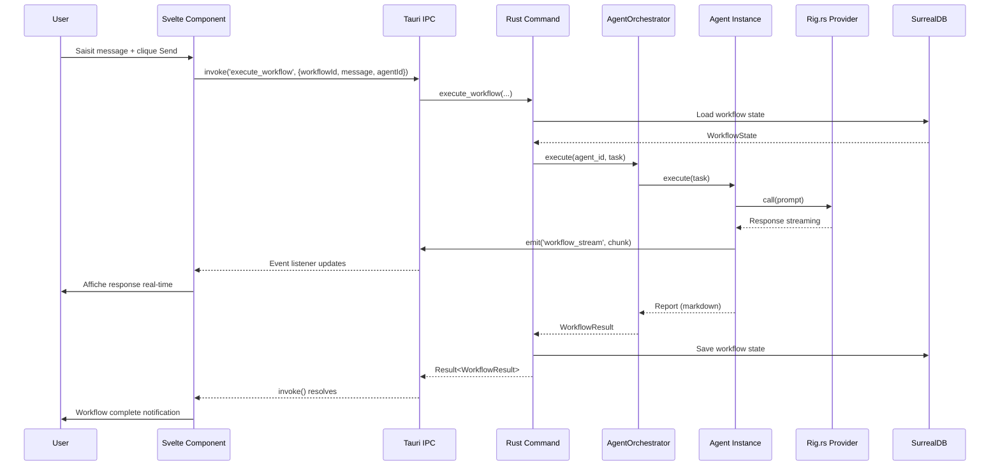

# Spécification - Implémentation Base Zileo-Chat-3

## Métadonnées
- **Date**: 2025-01-23
- **Stack**: SvelteKit 2.49.0 + Svelte 5.43.14 | Rust 1.91.1 + Tauri 2.9.4 | SurrealDB 2.3.10
- **Complexité**: **Critical** (architecture complète, multi-composants, production-ready dès v1)
- **Statut**: Phase Architecture → Implémentation
- **Licence**: Apache 2.0

---

## Contexte

### Demande Initiale
**Analyser toute la documentation et préparer une implémentation de la base de l'application par phase logique. Se concentrer sur la base, ne pas encore s'occuper des features. Indiquer à la fin du rapport l'ordre d'implémentation des features.**

### Objectif
Établir les **fondations techniques complètes** de Zileo-Chat-3, permettant :
1. Communication frontend-backend fonctionnelle (IPC Tauri)
2. Persistance données (SurrealDB embedded)
3. Infrastructure multi-agent (registry, orchestration)
4. Intégration LLM (Rig.rs avec Mistral/Ollama)
5. Protocole MCP (client/server)
6. Interface utilisateur de base (Settings + Agent page)

### Périmètre

**✅ Inclus (Base)**:
- Configuration projet (Rust + SvelteKit + Tauri)
- Base de données (schéma complet SurrealDB)
- Types synchronisés (TypeScript ↔ Rust)
- Infrastructure agents (traits, registry, orchestrator)
- Commands Tauri essentielles (workflows, agents, validation)
- Interface UI minimaliste (2 pages : Settings, Agent)
- Sécurité de base (API keys storage, validation inputs)
- Logging et monitoring (tracing)

**❌ Exclus (Features v1.1+)**:
- Agents spécialisés pré-configurés (DB, API, RAG, UI, Code agents)
- MCP servers externes (configuration user, non bundlés)
- Prompts templates avancés
- Système RAG complet (recherche sémantique, embeddings)
- Métriques temps-réel complexes (tokens, sub-agents panel)
- Validation human-in-the-loop (architecture prête, UI basique)
- Export/Import workflows
- Thème customization avancée

### Critères de Succès
- ✅ Build frontend + backend sans erreurs
- ✅ Lancement application desktop (Linux)
- ✅ Communication IPC fonctionnelle (invoke + events)
- ✅ CRUD workflows basique en UI
- ✅ Base de données initialisée et accessible
- ✅ Registry agents opérationnel (création agent simple)
- ✅ Appel LLM basique (Mistral ou Ollama)
- ✅ Tests unitaires critiques passent (~70% backend)
- ✅ Validation lint/typecheck/clippy stricte
- ✅ Documentation code (JSDoc + Rustdoc) complète

---

## État Actuel

### Architecture Existante
**Phase Actuelle**: Documentation complète (18 fichiers docs/), **zéro code source implémenté**.

**Documentation Référence**:
- `TECH_STACK.md`: Versions exactes (Svelte 5.43.14, Rust 1.91.1, Tauri 2.9.4, SurrealDB 2.3.10)
- `ARCHITECTURE_DECISIONS.md`: 19 décisions techniques justifiées
- `MULTI_AGENT_ARCHITECTURE.md`: Hiérarchie agents, communication markdown reports
- `API_REFERENCE.md`: Signatures 22+ Tauri commands
- `DATABASE_SCHEMA.md`: 7 tables (workflow, agent_state, memory, message, validation_request, task, logs)
- `FRONTEND_SPECIFICATIONS.md`: 25+ composants UI détaillés (1578 lignes)
- `MCP_CONFIGURATION_GUIDE.md`: Configuration MCP (Docker/NPX/UVX)
- `WORKFLOW_ORCHESTRATION.md`: Patterns orchestration (parallèle/séquentiel)
- `TESTING_STRATEGY.md`: Couverture ~70% critical paths

**Patterns Identifiés**:
1. **Multi-Agent**: Orchestrateur central + Registry découvrable + Agents (trait-based)
2. **Communication Inter-Agents**: Markdown Reports standardisés (human-readable + machine-parsable)
3. **IPC Tauri**: Frontend `invoke()` ↔ Backend `#[tauri::command]` avec `Result<T, String>`
4. **Type Sync**: TypeScript interfaces ↔ Rust structs (`#[derive(Serialize, Deserialize)]`)
5. **Async-First**: Tokio runtime pour backend Rust
6. **State Management Frontend**: Svelte 5 runes (`$state`, `$derived`, `$effect`)
7. **Database**: SurrealDB embedded (RocksDB) avec vectoriel HNSW
8. **Sécurité**: Tauri secure storage (OS keychain) + AES-256 + CSP + allowlist
9. **Logging**: Tracing framework (structured JSON logs + spans)

### Code Réutilisable
**Aucun code existant** - projet from scratch.

**Templates/Références Officiels** (via Context7):
- **SvelteKit**: File-based routing, `+page.svelte`, `+layout.svelte`, `$props()`, runes
- **Tauri**: `#[tauri::command]`, `State<T>`, `invoke()`, event `emit()` / `listen()`
- **SurrealDB**: DEFINE TABLE, HNSW index, vector search `<|k,ef|>`
- **Tokio**: `tokio::spawn()`, async/await, channels (mpsc)

---

## Architecture Proposée

### Diagramme Global

```mermaid
graph TB
    subgraph Frontend["Frontend (SvelteKit)"]
        UI[UI Components<br/>Svelte 5]
        Routes[Routes<br/>/settings | /agent]
        Stores[Stores<br/>runes: $state]
        Types_TS[Types TypeScript<br/>src/types/]
    end

    subgraph IPC["IPC Layer (Tauri)"]
        Commands[Commands<br/>invoke()]
        Events[Events<br/>listen() | emit()]
    end

    subgraph Backend["Backend (Rust + Tauri)"]
        Main[main.rs<br/>Entry Point]
        Commands_RS[Commands<br/>22+ handlers]
        State[AppState<br/>Shared State]

        subgraph Agents["Multi-Agent System"]
            Registry[AgentRegistry<br/>Discovery]
            Orchestrator[AgentOrchestrator<br/>Coordination]
            AgentTrait[Agent Trait<br/>Interface]
        end

        subgraph LLM["LLM Integration"]
            Rig[Rig.rs<br/>Abstraction]
            Mistral[Mistral Provider]
            Ollama[Ollama Provider]
        end

        subgraph MCP_System["MCP Protocol"]
            MCPClient[MCP Client<br/>External Servers]
            MCPServer[MCP Server<br/>Custom Tools]
        end

        DB_Client[DB Client<br/>SurrealDB]
        Types_RS[Types Rust<br/>src-tauri/src/models/]
    end

    subgraph Database["Database (SurrealDB)"]
        Tables[7 Tables<br/>workflow, agent_state,<br/>memory, message,<br/>validation_request, task]
        Vector[Vector Index<br/>HNSW]
    end

    UI --> Routes
    Routes --> Stores
    Stores --> Types_TS

    Types_TS <-->|IPC Serialization| Commands
    Commands <--> Commands_RS
    Events <--> Commands_RS

    Commands_RS --> State
    State --> Registry
    State --> DB_Client
    State --> Rig
    State --> MCPClient

    Registry --> Orchestrator
    Orchestrator --> AgentTrait

    Rig --> Mistral
    Rig --> Ollama

    DB_Client --> Tables
    DB_Client --> Vector

    Types_TS -.Type Sync.- Types_RS

    MCPClient -.External.-> ExternalMCP[MCP Servers<br/>Serena, Context7,<br/>Playwright]
    MCPServer --> Tools[Custom Tools<br/>SurrealDBTool, etc.]

    classDef frontend fill:#4ade80,stroke:#22c55e,color:#000
    classDef backend fill:#60a5fa,stroke:#3b82f6,color:#000
    classDef database fill:#fb923c,stroke:#f97316,color:#000
    classDef ipc fill:#a78bfa,stroke:#8b5cf6,color:#000

    class UI,Routes,Stores,Types_TS frontend
    class Main,Commands_RS,State,Registry,Orchestrator,AgentTrait,Rig,Mistral,Ollama,MCPClient,MCPServer,DB_Client,Types_RS backend
    class Tables,Vector database
    class Commands,Events ipc
```

### Flux de Données Critique: Exécution Workflow



---

## Composants Détaillés

### 1. Configuration Projet

#### 1.1 Frontend (SvelteKit)

**Fichier**: `package.json`
```json
{
  "name": "zileo-chat-3",
  "version": "0.1.0",
  "license": "Apache-2.0",
  "type": "module",
  "scripts": {
    "dev": "vite dev",
    "build": "vite build",
    "preview": "vite preview",
    "check": "svelte-check --tsconfig ./tsconfig.json --threshold warning",
    "lint": "eslint .",
    "test": "vitest",
    "test:e2e": "playwright test",
    "tauri": "tauri",
    "tauri:dev": "tauri dev",
    "tauri:build": "tauri build"
  },
  "devDependencies": {
    "@sveltejs/adapter-static": "^3.0.0",
    "@sveltejs/kit": "^2.49.0",
    "@sveltejs/vite-plugin-svelte": "^4.0.0",
    "@tauri-apps/cli": "^2.9.4",
    "svelte": "^5.43.14",
    "svelte-check": "^4.0.0",
    "typescript": "^5.9.3",
    "vite": "^7.2.2",
    "vitest": "^2.0.0",
    "@playwright/test": "^1.40.0",
    "eslint": "^9.0.0"
  },
  "dependencies": {
    "@tauri-apps/api": "^2.9.0"
  }
}
```

**Fichier**: `svelte.config.js`
```javascript
import adapter from '@sveltejs/adapter-static';
import { vitePreprocess } from '@sveltejs/vite-plugin-svelte';

/** @type {import('@sveltejs/kit').Config} */
const config = {
  preprocess: vitePreprocess(),
  kit: {
    adapter: adapter({
      pages: 'build',
      assets: 'build',
      fallback: 'index.html',
      precompress: false,
      strict: true
    })
  }
};

export default config;
```

**Fichier**: `vite.config.ts`
```typescript
import { sveltekit } from '@sveltejs/kit/vite';
import { defineConfig } from 'vite';

export default defineConfig({
  plugins: [sveltekit()],
  clearScreen: false,
  server: {
    port: 5173,
    strictPort: true,
    host: 'localhost'
  },
  envPrefix: ['VITE_', 'TAURI_'],
  build: {
    target: ['es2021', 'chrome100', 'safari13'],
    minify: !process.env.TAURI_DEBUG ? 'esbuild' : false,
    sourcemap: !!process.env.TAURI_DEBUG
  }
});
```

#### 1.2 Backend (Rust + Tauri)

**Fichier**: `src-tauri/Cargo.toml`
```toml
[package]
name = "zileo-chat"
version = "0.1.0"
edition = "2021"
license = "Apache-2.0"

[build-dependencies]
tauri-build = { version = "2.9.4", features = [] }

[dependencies]
tauri = { version = "2.9.4", features = ["protocol-asset"] }
serde = { version = "1.0.228", features = ["derive"] }
serde_json = "1.0.145"
tokio = { version = "1.48.0", features = ["full"] }
surrealdb = "2.3.10"
anyhow = "1.0"
thiserror = "1.0"
tracing = "0.1"
tracing-subscriber = { version = "0.3", features = ["json", "env-filter"] }
uuid = { version = "1.0", features = ["v4", "serde"] }
chrono = { version = "0.4", features = ["serde"] }

# LLM Integration (Rig.rs)
rig-core = "0.24.0"

# Tauri Secure Storage
keyring = "2.0"
aes-gcm = "0.10"

[features]
default = ["custom-protocol"]
custom-protocol = ["tauri/custom-protocol"]
```

**Fichier**: `src-tauri/tauri.conf.json`
```json
{
  "productName": "Zileo Chat",
  "version": "0.1.0",
  "identifier": "com.zileo.chat",
  "build": {
    "frontendDist": "../build",
    "devUrl": "http://localhost:5173",
    "beforeDevCommand": "npm run dev",
    "beforeBuildCommand": "npm run build"
  },
  "app": {
    "windows": [
      {
        "title": "Zileo Chat",
        "width": 1200,
        "height": 800,
        "resizable": true,
        "fullscreen": false
      }
    ],
    "security": {
      "csp": "default-src 'self'; style-src 'self' 'unsafe-inline'"
    }
  },
  "bundle": {
    "active": true,
    "targets": ["appimage", "deb"],
    "icon": [
      "icons/32x32.png",
      "icons/128x128.png",
      "icons/256x256.png"
    ]
  }
}
```

---

### 2. Types Synchronisés (TypeScript ↔ Rust)

#### 2.1 Frontend Types

**Fichier**: `src/types/workflow.ts`
```typescript
export type WorkflowStatus = 'idle' | 'running' | 'completed' | 'error';

export interface Workflow {
  id: string;
  name: string;
  agent_id: string;
  status: WorkflowStatus;
  created_at: Date;
  updated_at: Date;
  completed_at?: Date;
}

export interface WorkflowResult {
  report: string; // Markdown
  metrics: WorkflowMetrics;
  tools_used: string[];
  mcp_calls: string[];
}

export interface WorkflowMetrics {
  duration_ms: number;
  tokens_input: number;
  tokens_output: number;
  cost_usd: number;
  provider: string;
  model: string;
}
```

**Fichier**: `src/types/agent.ts`
```typescript
export type Lifecycle = 'permanent' | 'temporary';
export type AgentStatus = 'available' | 'busy';

export interface Agent {
  id: string;
  name: string;
  lifecycle: Lifecycle;
  status: AgentStatus;
  capabilities: string[];
  tools: string[];
  mcp_servers: string[];
}

export interface AgentConfig {
  id: string;
  name: string;
  lifecycle: Lifecycle;
  llm: LLMConfig;
  tools: string[];
  mcp_servers: string[];
  system_prompt: string;
}

export interface LLMConfig {
  provider: string; // "Mistral" | "Ollama"
  model: string;
  temperature: number;
  max_tokens: number;
}
```

**Fichier**: `src/types/message.ts`
```typescript
export type MessageRole = 'user' | 'assistant' | 'system';

export interface Message {
  id: string;
  workflow_id: string;
  role: MessageRole;
  content: string;
  tokens: number;
  timestamp: Date;
}
```

**Fichier**: `src/types/validation.ts`
```typescript
export type ValidationMode = 'auto' | 'manual' | 'selective';
export type ValidationType = 'tool' | 'sub_agent' | 'mcp' | 'file_op' | 'db_op';
export type RiskLevel = 'low' | 'medium' | 'high';

export interface ValidationRequest {
  id: string;
  workflow_id: string;
  type: ValidationType;
  operation: string;
  details: Record<string, unknown>;
  risk_level: RiskLevel;
}
```

#### 2.2 Backend Types (Rust)

**Fichier**: `src-tauri/src/models/workflow.rs`
```rust
use serde::{Deserialize, Serialize};
use chrono::{DateTime, Utc};

#[derive(Debug, Clone, Serialize, Deserialize)]
#[serde(rename_all = "snake_case")]
pub enum WorkflowStatus {
    Idle,
    Running,
    Completed,
    Error,
}

#[derive(Debug, Clone, Serialize, Deserialize)]
pub struct Workflow {
    pub id: String,
    pub name: String,
    pub agent_id: String,
    pub status: WorkflowStatus,
    pub created_at: DateTime<Utc>,
    pub updated_at: DateTime<Utc>,
    pub completed_at: Option<DateTime<Utc>>,
}

#[derive(Debug, Clone, Serialize, Deserialize)]
pub struct WorkflowResult {
    pub report: String,
    pub metrics: WorkflowMetrics,
    pub tools_used: Vec<String>,
    pub mcp_calls: Vec<String>,
}

#[derive(Debug, Clone, Serialize, Deserialize)]
pub struct WorkflowMetrics {
    pub duration_ms: u64,
    pub tokens_input: usize,
    pub tokens_output: usize,
    pub cost_usd: f64,
    pub provider: String,
    pub model: String,
}
```

**Fichier**: `src-tauri/src/models/agent.rs`
```rust
use serde::{Deserialize, Serialize};

#[derive(Debug, Clone, Serialize, Deserialize)]
#[serde(rename_all = "snake_case")]
pub enum Lifecycle {
    Permanent,
    Temporary,
}

#[derive(Debug, Clone, Serialize, Deserialize)]
#[serde(rename_all = "snake_case")]
pub enum AgentStatus {
    Available,
    Busy,
}

#[derive(Debug, Clone, Serialize, Deserialize)]
pub struct Agent {
    pub id: String,
    pub name: String,
    pub lifecycle: Lifecycle,
    pub status: AgentStatus,
    pub capabilities: Vec<String>,
    pub tools: Vec<String>,
    pub mcp_servers: Vec<String>,
}

#[derive(Debug, Clone, Serialize, Deserialize)]
pub struct AgentConfig {
    pub id: String,
    pub name: String,
    pub lifecycle: Lifecycle,
    pub llm: LLMConfig,
    pub tools: Vec<String>,
    pub mcp_servers: Vec<String>,
    pub system_prompt: String,
}

#[derive(Debug, Clone, Serialize, Deserialize)]
pub struct LLMConfig {
    pub provider: String,
    pub model: String,
    pub temperature: f32,
    pub max_tokens: usize,
}
```

**Fichier**: `src-tauri/src/models/mod.rs`
```rust
pub mod workflow;
pub mod agent;
pub mod message;
pub mod validation;

pub use workflow::*;
pub use agent::*;
pub use message::*;
pub use validation::*;
```

---

### 3. Database (SurrealDB)

**Fichier**: `src-tauri/src/db/schema.rs`
```rust
/// Schéma SurrealDB - À exécuter via client au startup
pub const SCHEMA_SQL: &str = r#"
-- Namespace et Database
DEFINE NAMESPACE zileo;
USE NS zileo;
DEFINE DATABASE chat;
USE DB chat;

-- Table: workflow
DEFINE TABLE workflow SCHEMAFULL;
DEFINE FIELD id ON workflow TYPE string;
DEFINE FIELD name ON workflow TYPE string;
DEFINE FIELD agent_id ON workflow TYPE string;
DEFINE FIELD status ON workflow TYPE string ASSERT $value IN ['idle', 'running', 'completed', 'error'];
DEFINE FIELD created_at ON workflow TYPE datetime DEFAULT time::now();
DEFINE FIELD updated_at ON workflow TYPE datetime DEFAULT time::now();
DEFINE FIELD completed_at ON workflow TYPE option<datetime>;

-- Table: agent_state
DEFINE TABLE agent_state SCHEMAFULL;
DEFINE FIELD agent_id ON agent_state TYPE string;
DEFINE FIELD lifecycle ON agent_state TYPE string ASSERT $value IN ['permanent', 'temporary'];
DEFINE FIELD config ON agent_state TYPE object;
DEFINE FIELD metrics ON agent_state TYPE object;
DEFINE FIELD last_active ON agent_state TYPE datetime DEFAULT time::now();
DEFINE INDEX unique_agent_id ON agent_state FIELDS agent_id UNIQUE;

-- Table: message
DEFINE TABLE message SCHEMAFULL;
DEFINE FIELD id ON message TYPE string;
DEFINE FIELD workflow_id ON message TYPE string;
DEFINE FIELD role ON message TYPE string ASSERT $value IN ['user', 'assistant', 'system'];
DEFINE FIELD content ON message TYPE string;
DEFINE FIELD tokens ON message TYPE int;
DEFINE FIELD timestamp ON message TYPE datetime DEFAULT time::now();

-- Table: memory (vectoriel)
DEFINE TABLE memory SCHEMAFULL;
DEFINE FIELD id ON memory TYPE string;
DEFINE FIELD type ON memory TYPE string ASSERT $value IN ['user_pref', 'context', 'knowledge', 'decision'];
DEFINE FIELD content ON memory TYPE string;
DEFINE FIELD embedding ON memory TYPE array<float>;
DEFINE FIELD metadata ON memory TYPE object;
DEFINE FIELD created_at ON memory TYPE datetime DEFAULT time::now();

-- Index HNSW pour vector search (1536D OpenAI/Mistral embeddings)
DEFINE INDEX memory_vec_idx ON memory FIELDS embedding HNSW DIMENSION 1536 DIST COSINE;

-- Table: validation_request
DEFINE TABLE validation_request SCHEMAFULL;
DEFINE FIELD id ON validation_request TYPE string;
DEFINE FIELD workflow_id ON validation_request TYPE string;
DEFINE FIELD type ON validation_request TYPE string ASSERT $value IN ['tool', 'sub_agent', 'mcp', 'file_op', 'db_op'];
DEFINE FIELD operation ON validation_request TYPE string;
DEFINE FIELD details ON validation_request TYPE object;
DEFINE FIELD risk_level ON validation_request TYPE string ASSERT $value IN ['low', 'medium', 'high'];
DEFINE FIELD status ON validation_request TYPE string DEFAULT 'pending' ASSERT $value IN ['pending', 'approved', 'rejected'];
DEFINE FIELD created_at ON validation_request TYPE datetime DEFAULT time::now();

-- Table: task (décomposition workflows)
DEFINE TABLE task SCHEMAFULL;
DEFINE FIELD id ON task TYPE string;
DEFINE FIELD workflow_id ON task TYPE string;
DEFINE FIELD description ON task TYPE string;
DEFINE FIELD status ON task TYPE string DEFAULT 'pending' ASSERT $value IN ['pending', 'in_progress', 'completed', 'blocked'];
DEFINE FIELD dependencies ON task TYPE array<string>;
DEFINE FIELD created_at ON task TYPE datetime DEFAULT time::now();
DEFINE FIELD completed_at ON task TYPE option<datetime>;

-- Relations graph
DEFINE TABLE workflow_agent SCHEMAFULL;
DEFINE FIELD in ON workflow_agent TYPE record<workflow>;
DEFINE FIELD out ON workflow_agent TYPE record<agent_state>;
DEFINE FIELD created_by ON workflow_agent TYPE bool DEFAULT true;
"#;
```

**Fichier**: `src-tauri/src/db/client.rs`
```rust
use surrealdb::{engine::local::RocksDb, Surreal};
use anyhow::Result;

pub struct DBClient {
    pub db: Surreal<RocksDb>,
}

impl DBClient {
    pub async fn new(path: &str) -> Result<Self> {
        let db = Surreal::new::<RocksDb>(path).await?;

        // Use namespace and database
        db.use_ns("zileo").use_db("chat").await?;

        Ok(Self { db })
    }

    pub async fn initialize_schema(&self) -> Result<()> {
        use super::schema::SCHEMA_SQL;

        self.db.query(SCHEMA_SQL).await?;
        tracing::info!("Database schema initialized");

        Ok(())
    }

    pub async fn query<T>(&self, query: &str) -> Result<Vec<T>>
    where
        T: serde::de::DeserializeOwned,
    {
        let mut result = self.db.query(query).await?;
        let data: Vec<T> = result.take(0)?;
        Ok(data)
    }

    pub async fn create<T>(&self, table: &str, data: T) -> Result<String>
    where
        T: serde::Serialize,
    {
        let created: Vec<serde_json::Value> = self
            .db
            .create(table)
            .content(data)
            .await?;

        let id = created[0]["id"]
            .as_str()
            .unwrap_or_default()
            .to_string();

        Ok(id)
    }

    pub async fn update<T>(&self, id: &str, data: T) -> Result<()>
    where
        T: serde::Serialize,
    {
        self.db.update(id).content(data).await?;
        Ok(())
    }

    pub async fn delete(&self, id: &str) -> Result<()> {
        self.db.delete(id).await?;
        Ok(())
    }
}
```

---

### 4. Infrastructure Multi-Agent

#### 4.1 Agent Trait (Interface)

**Fichier**: `src-tauri/src/agents/core/agent.rs`
```rust
use async_trait::async_trait;
use crate::models::{AgentConfig, Lifecycle};

/// Task représente une demande à l'agent
#[derive(Debug, Clone)]
pub struct Task {
    pub id: String,
    pub description: String,
    pub context: serde_json::Value,
}

/// Report généré par l'agent (format Markdown)
#[derive(Debug, Clone)]
pub struct Report {
    pub task_id: String,
    pub status: ReportStatus,
    pub content: String, // Markdown
    pub metrics: ReportMetrics,
}

#[derive(Debug, Clone)]
pub enum ReportStatus {
    Success,
    Failed,
    Partial,
}

#[derive(Debug, Clone)]
pub struct ReportMetrics {
    pub duration_ms: u64,
    pub tokens_input: usize,
    pub tokens_output: usize,
    pub tools_used: Vec<String>,
    pub mcp_calls: Vec<String>,
}

/// Trait Agent - Interface unifiée pour tous les agents
#[async_trait]
pub trait Agent: Send + Sync {
    /// Exécute une tâche et retourne un rapport
    async fn execute(&self, task: Task) -> anyhow::Result<Report>;

    /// Retourne les capacités de l'agent
    fn capabilities(&self) -> Vec<String>;

    /// Retourne le lifecycle (Permanent | Temporary)
    fn lifecycle(&self) -> Lifecycle;

    /// Retourne les tools disponibles
    fn tools(&self) -> Vec<String>;

    /// Retourne les MCP servers requis
    fn mcp_servers(&self) -> Vec<String>;

    /// Retourne le system prompt
    fn system_prompt(&self) -> String;

    /// Retourne la configuration
    fn config(&self) -> &AgentConfig;
}
```

#### 4.2 Agent Registry

**Fichier**: `src-tauri/src/agents/core/registry.rs`
```rust
use std::collections::HashMap;
use std::sync::Arc;
use tokio::sync::RwLock;
use super::agent::Agent;

pub struct AgentRegistry {
    agents: Arc<RwLock<HashMap<String, Arc<dyn Agent>>>>,
}

impl AgentRegistry {
    pub fn new() -> Self {
        Self {
            agents: Arc::new(RwLock::new(HashMap::new())),
        }
    }

    /// Enregistre un agent (permanent ou temporary)
    pub async fn register(&self, id: String, agent: Arc<dyn Agent>) {
        let mut agents = self.agents.write().await;
        agents.insert(id, agent);
        tracing::info!("Agent registered: {}", id);
    }

    /// Récupère un agent par ID
    pub async fn get(&self, id: &str) -> Option<Arc<dyn Agent>> {
        let agents = self.agents.read().await;
        agents.get(id).cloned()
    }

    /// Liste tous les agents
    pub async fn list(&self) -> Vec<String> {
        let agents = self.agents.read().await;
        agents.keys().cloned().collect()
    }

    /// Supprime un agent (temporary uniquement)
    pub async fn unregister(&self, id: &str) -> anyhow::Result<()> {
        let mut agents = self.agents.write().await;

        if let Some(agent) = agents.get(id) {
            use crate::models::Lifecycle;
            if matches!(agent.lifecycle(), Lifecycle::Temporary) {
                agents.remove(id);
                tracing::info!("Agent unregistered: {}", id);
                Ok(())
            } else {
                anyhow::bail!("Cannot unregister permanent agent: {}", id)
            }
        } else {
            anyhow::bail!("Agent not found: {}", id)
        }
    }

    /// Cleanup temporary agents
    pub async fn cleanup_temporary(&self) {
        let mut agents = self.agents.write().await;
        use crate::models::Lifecycle;

        agents.retain(|id, agent| {
            let is_permanent = matches!(agent.lifecycle(), Lifecycle::Permanent);
            if !is_permanent {
                tracing::info!("Cleaning up temporary agent: {}", id);
            }
            is_permanent
        });
    }
}

impl Default for AgentRegistry {
    fn default() -> Self {
        Self::new()
    }
}
```

#### 4.3 Agent Orchestrator

**Fichier**: `src-tauri/src/agents/core/orchestrator.rs`
```rust
use std::sync::Arc;
use super::{agent::{Agent, Task, Report}, registry::AgentRegistry};

pub struct AgentOrchestrator {
    registry: Arc<AgentRegistry>,
}

impl AgentOrchestrator {
    pub fn new(registry: Arc<AgentRegistry>) -> Self {
        Self { registry }
    }

    /// Exécute une tâche via un agent spécifique
    pub async fn execute(&self, agent_id: &str, task: Task) -> anyhow::Result<Report> {
        let agent = self
            .registry
            .get(agent_id)
            .await
            .ok_or_else(|| anyhow::anyhow!("Agent not found: {}", agent_id))?;

        tracing::info!("Executing task {} with agent {}", task.id, agent_id);

        let report = agent.execute(task).await?;

        tracing::info!(
            "Task completed - Status: {:?}, Duration: {}ms",
            report.status,
            report.metrics.duration_ms
        );

        Ok(report)
    }

    /// Exécute plusieurs tâches en parallèle (si indépendantes)
    pub async fn execute_parallel(
        &self,
        tasks: Vec<(String, Task)>, // Vec<(agent_id, task)>
    ) -> Vec<anyhow::Result<Report>> {
        use futures::future::join_all;

        let futures = tasks
            .into_iter()
            .map(|(agent_id, task)| self.execute(&agent_id, task));

        join_all(futures).await
    }
}
```

#### 4.4 Simple Agent Implementation (Exemple)

**Fichier**: `src-tauri/src/agents/simple_agent.rs`
```rust
use async_trait::async_trait;
use crate::agents::core::agent::{Agent, Task, Report, ReportStatus, ReportMetrics};
use crate::models::{AgentConfig, Lifecycle};

/// Agent simple pour démonstration (phase base)
pub struct SimpleAgent {
    config: AgentConfig,
}

impl SimpleAgent {
    pub fn new(config: AgentConfig) -> Self {
        Self { config }
    }
}

#[async_trait]
impl Agent for SimpleAgent {
    async fn execute(&self, task: Task) -> anyhow::Result<Report> {
        let start = std::time::Instant::now();

        // Simulation traitement basique (pas encore LLM call)
        tokio::time::sleep(tokio::time::Duration::from_millis(100)).await;

        let content = format!(
            "# Agent Report: {}\n\n**Task**: {}\n\n**Status**: ✅ Success\n\n## Results\nTask completed successfully (base implementation).",
            self.config.id,
            task.description
        );

        let report = Report {
            task_id: task.id,
            status: ReportStatus::Success,
            content,
            metrics: ReportMetrics {
                duration_ms: start.elapsed().as_millis() as u64,
                tokens_input: 0,
                tokens_output: 0,
                tools_used: vec![],
                mcp_calls: vec![],
            },
        };

        Ok(report)
    }

    fn capabilities(&self) -> Vec<String> {
        vec!["basic_execution".to_string()]
    }

    fn lifecycle(&self) -> Lifecycle {
        self.config.lifecycle.clone()
    }

    fn tools(&self) -> Vec<String> {
        self.config.tools.clone()
    }

    fn mcp_servers(&self) -> Vec<String> {
        self.config.mcp_servers.clone()
    }

    fn system_prompt(&self) -> String {
        self.config.system_prompt.clone()
    }

    fn config(&self) -> &AgentConfig {
        &self.config
    }
}
```

---

### 5. Tauri Commands (IPC)

**Fichier**: `src-tauri/src/commands/workflow.rs`
```rust
use tauri::State;
use crate::{AppState, models::{Workflow, WorkflowResult}};

#[tauri::command]
pub async fn create_workflow(
    name: String,
    agent_id: String,
    state: State<'_, AppState>,
) -> Result<String, String> {
    use uuid::Uuid;
    use chrono::Utc;
    use crate::models::WorkflowStatus;

    let workflow = Workflow {
        id: Uuid::new_v4().to_string(),
        name,
        agent_id,
        status: WorkflowStatus::Idle,
        created_at: Utc::now(),
        updated_at: Utc::now(),
        completed_at: None,
    };

    let id = state
        .db
        .create("workflow", &workflow)
        .await
        .map_err(|e| format!("Failed to create workflow: {}", e))?;

    Ok(id)
}

#[tauri::command]
pub async fn execute_workflow(
    workflow_id: String,
    message: String,
    agent_id: String,
    state: State<'_, AppState>,
) -> Result<WorkflowResult, String> {
    use crate::agents::core::agent::Task;

    // 1. Load workflow
    let workflows: Vec<Workflow> = state
        .db
        .query(&format!("SELECT * FROM workflow WHERE id = '{}'", workflow_id))
        .await
        .map_err(|e| format!("Failed to load workflow: {}", e))?;

    let workflow = workflows
        .first()
        .ok_or("Workflow not found")?;

    // 2. Create task
    let task = Task {
        id: uuid::Uuid::new_v4().to_string(),
        description: message,
        context: serde_json::json!({}),
    };

    // 3. Execute via orchestrator
    let report = state
        .orchestrator
        .execute(&agent_id, task)
        .await
        .map_err(|e| format!("Execution failed: {}", e))?;

    // 4. Build result
    let result = WorkflowResult {
        report: report.content,
        metrics: crate::models::WorkflowMetrics {
            duration_ms: report.metrics.duration_ms,
            tokens_input: report.metrics.tokens_input,
            tokens_output: report.metrics.tokens_output,
            cost_usd: 0.0, // TODO: Calculate from tokens
            provider: "Unknown".to_string(),
            model: "Unknown".to_string(),
        },
        tools_used: report.metrics.tools_used,
        mcp_calls: report.metrics.mcp_calls,
    };

    Ok(result)
}

#[tauri::command]
pub async fn load_workflows(
    state: State<'_, AppState>,
) -> Result<Vec<Workflow>, String> {
    let workflows = state
        .db
        .query("SELECT * FROM workflow ORDER BY updated_at DESC")
        .await
        .map_err(|e| format!("Failed to load workflows: {}", e))?;

    Ok(workflows)
}

#[tauri::command]
pub async fn delete_workflow(
    id: String,
    state: State<'_, AppState>,
) -> Result<(), String> {
    state
        .db
        .delete(&format!("workflow:{}", id))
        .await
        .map_err(|e| format!("Failed to delete workflow: {}", e))?;

    Ok(())
}
```

**Fichier**: `src-tauri/src/commands/agent.rs`
```rust
use tauri::State;
use crate::{AppState, models::Agent};

#[tauri::command]
pub async fn list_agents(
    state: State<'_, AppState>,
) -> Result<Vec<String>, String> {
    let agent_ids = state.registry.list().await;
    Ok(agent_ids)
}

#[tauri::command]
pub async fn get_agent_config(
    agent_id: String,
    state: State<'_, AppState>,
) -> Result<crate::models::AgentConfig, String> {
    let agent = state
        .registry
        .get(&agent_id)
        .await
        .ok_or("Agent not found")?;

    Ok(agent.config().clone())
}
```

**Fichier**: `src-tauri/src/commands/mod.rs`
```rust
pub mod workflow;
pub mod agent;

pub use workflow::*;
pub use agent::*;
```

---

### 6. AppState et Main Entry Point

**Fichier**: `src-tauri/src/state.rs`
```rust
use std::sync::Arc;
use crate::db::DBClient;
use crate::agents::core::{AgentRegistry, AgentOrchestrator};

pub struct AppState {
    pub db: Arc<DBClient>,
    pub registry: Arc<AgentRegistry>,
    pub orchestrator: Arc<AgentOrchestrator>,
}

impl AppState {
    pub async fn new(db_path: &str) -> anyhow::Result<Self> {
        let db = Arc::new(DBClient::new(db_path).await?);
        db.initialize_schema().await?;

        let registry = Arc::new(AgentRegistry::new());
        let orchestrator = Arc::new(AgentOrchestrator::new(registry.clone()));

        Ok(Self {
            db,
            registry,
            orchestrator,
        })
    }
}
```

**Fichier**: `src-tauri/src/main.rs`
```rust
#![cfg_attr(not(debug_assertions), windows_subsystem = "windows")]

mod commands;
mod models;
mod db;
mod agents;
mod state;

use state::AppState;
use tracing_subscriber::{layer::SubscriberExt, util::SubscriberInitExt};

#[tokio::main]
async fn main() -> anyhow::Result<()> {
    // Initialize logging
    tracing_subscriber::registry()
        .with(tracing_subscriber::fmt::layer())
        .with(tracing_subscriber::EnvFilter::from_default_env())
        .init();

    // Database path (embedded RocksDB)
    let db_path = tauri::api::path::app_data_dir(&tauri::Config::default())
        .expect("Failed to resolve app data dir")
        .join("zileo.db");

    let db_path_str = db_path.to_str().unwrap();

    // Initialize AppState
    let app_state = AppState::new(db_path_str)
        .await
        .expect("Failed to initialize AppState");

    tracing::info!("Application state initialized");

    // Register default simple agent (demo)
    {
        use agents::simple_agent::SimpleAgent;
        use models::{AgentConfig, Lifecycle, LLMConfig};

        let config = AgentConfig {
            id: "simple_agent".to_string(),
            name: "Simple Agent".to_string(),
            lifecycle: Lifecycle::Permanent,
            llm: LLMConfig {
                provider: "None".to_string(),
                model: "demo".to_string(),
                temperature: 0.7,
                max_tokens: 2000,
            },
            tools: vec![],
            mcp_servers: vec![],
            system_prompt: "You are a simple demo agent.".to_string(),
        };

        let agent = SimpleAgent::new(config);
        app_state.registry.register("simple_agent".to_string(), Arc::new(agent)).await;
    }

    // Run Tauri application
    tauri::Builder::default()
        .manage(app_state)
        .invoke_handler(tauri::generate_handler![
            commands::create_workflow,
            commands::execute_workflow,
            commands::load_workflows,
            commands::delete_workflow,
            commands::list_agents,
            commands::get_agent_config,
        ])
        .run(tauri::generate_context!())
        .expect("error while running tauri application");

    Ok(())
}
```

**Fichier**: `src-tauri/src/lib.rs`
```rust
pub mod commands;
pub mod models;
pub mod db;
pub mod agents;
pub mod state;

pub use state::AppState;
```

---

### 7. Interface UI Basique (Svelte)

#### 7.1 Routes

**Fichier**: `src/routes/+layout.svelte`
```svelte
<script lang="ts">
  import '../styles/global.css';

  let { children } = $props();
</script>

<div class="app-container">
  <nav class="floating-menu">
    <a href="/agent">Agent</a>
    <a href="/settings">Settings</a>
  </nav>

  <main>
    {@render children()}
  </main>
</div>

<style>
  :global(body) {
    margin: 0;
    font-family: 'Inter', system-ui, sans-serif;
    background: var(--color-bg-primary);
    color: var(--color-text-primary);
  }

  .app-container {
    display: flex;
    flex-direction: column;
    height: 100vh;
  }

  .floating-menu {
    display: flex;
    gap: 1rem;
    padding: 1rem;
    background: var(--color-bg-secondary);
    border-bottom: 1px solid var(--color-border);
  }

  .floating-menu a {
    padding: 0.5rem 1rem;
    text-decoration: none;
    color: var(--color-text-primary);
    border-radius: 0.375rem;
    transition: background 0.2s;
  }

  .floating-menu a:hover {
    background: var(--color-bg-hover);
  }

  main {
    flex: 1;
    overflow: auto;
  }
</style>
```

**Fichier**: `src/routes/agent/+page.svelte`
```svelte
<script lang="ts">
  import { invoke } from '@tauri-apps/api/core';
  import type { Workflow, WorkflowResult } from '$lib/types/workflow';

  let workflows = $state<Workflow[]>([]);
  let selectedWorkflow = $state<string | null>(null);
  let userInput = $state('');
  let result = $state<WorkflowResult | null>(null);
  let loading = $state(false);

  async function loadWorkflows() {
    workflows = await invoke<Workflow[]>('load_workflows');
  }

  async function createWorkflow() {
    const name = prompt('Workflow name:');
    if (!name) return;

    const id = await invoke<string>('create_workflow', {
      name,
      agentId: 'simple_agent',
    });

    await loadWorkflows();
    selectedWorkflow = id;
  }

  async function executeWorkflow() {
    if (!selectedWorkflow || !userInput.trim()) return;

    loading = true;
    try {
      result = await invoke<WorkflowResult>('execute_workflow', {
        workflowId: selectedWorkflow,
        message: userInput,
        agentId: 'simple_agent',
      });
      userInput = '';
    } catch (err) {
      alert('Execution failed: ' + err);
    } finally {
      loading = false;
    }
  }

  $effect(() => {
    loadWorkflows();
  });
</script>

<div class="agent-page">
  <aside class="workflow-list">
    <h2>Workflows</h2>
    <button onclick={createWorkflow}>+ New Workflow</button>

    <ul>
      {#each workflows as workflow}
        <li
          class:active={selectedWorkflow === workflow.id}
          onclick={() => (selectedWorkflow = workflow.id)}
        >
          {workflow.name}
          <span class="status">{workflow.status}</span>
        </li>
      {/each}
    </ul>
  </aside>

  <section class="main-area">
    {#if selectedWorkflow}
      <div class="input-area">
        <textarea
          bind:value={userInput}
          placeholder="Enter your message..."
          disabled={loading}
        />
        <button onclick={executeWorkflow} disabled={loading || !userInput.trim()}>
          {loading ? 'Executing...' : 'Send'}
        </button>
      </div>

      {#if result}
        <div class="output-area">
          <h3>Result</h3>
          <pre>{result.report}</pre>
          <div class="metrics">
            <span>Duration: {result.metrics.duration_ms}ms</span>
            <span>Provider: {result.metrics.provider}</span>
          </div>
        </div>
      {/if}
    {:else}
      <p class="empty-state">Select or create a workflow</p>
    {/if}
  </section>
</div>

<style>
  .agent-page {
    display: flex;
    height: 100%;
  }

  .workflow-list {
    width: 250px;
    border-right: 1px solid var(--color-border);
    padding: 1rem;
  }

  .workflow-list button {
    width: 100%;
    margin-bottom: 1rem;
    padding: 0.5rem;
    background: var(--color-accent);
    color: white;
    border: none;
    border-radius: 0.375rem;
    cursor: pointer;
  }

  .workflow-list ul {
    list-style: none;
    padding: 0;
  }

  .workflow-list li {
    padding: 0.75rem;
    margin-bottom: 0.5rem;
    cursor: pointer;
    border-radius: 0.375rem;
    display: flex;
    justify-content: space-between;
  }

  .workflow-list li:hover,
  .workflow-list li.active {
    background: var(--color-bg-hover);
  }

  .main-area {
    flex: 1;
    display: flex;
    flex-direction: column;
    padding: 1rem;
  }

  .input-area {
    display: flex;
    gap: 0.5rem;
    margin-bottom: 1rem;
  }

  .input-area textarea {
    flex: 1;
    padding: 0.75rem;
    border: 1px solid var(--color-border);
    border-radius: 0.375rem;
    resize: vertical;
    min-height: 100px;
  }

  .input-area button {
    padding: 0.75rem 1.5rem;
    background: var(--color-accent);
    color: white;
    border: none;
    border-radius: 0.375rem;
    cursor: pointer;
  }

  .input-area button:disabled {
    opacity: 0.5;
    cursor: not-allowed;
  }

  .output-area {
    flex: 1;
    overflow: auto;
  }

  .output-area pre {
    background: var(--color-bg-secondary);
    padding: 1rem;
    border-radius: 0.375rem;
    overflow-x: auto;
  }

  .metrics {
    display: flex;
    gap: 1rem;
    margin-top: 1rem;
    font-size: 0.875rem;
    color: var(--color-text-secondary);
  }

  .empty-state {
    text-align: center;
    color: var(--color-text-secondary);
    padding: 2rem;
  }
</style>
```

**Fichier**: `src/routes/settings/+page.svelte`
```svelte
<script lang="ts">
  let settings = $state({
    provider: 'Mistral',
    model: 'mistral-large',
    apiKey: '',
  });

  function saveSettings() {
    // TODO: Implement save to Tauri secure storage
    alert('Settings saved (not implemented in base)');
  }
</script>

<div class="settings-page">
  <h1>Settings</h1>

  <section class="settings-section">
    <h2>LLM Provider</h2>

    <label>
      Provider:
      <select bind:value={settings.provider}>
        <option value="Mistral">Mistral</option>
        <option value="Ollama">Ollama (local)</option>
      </select>
    </label>

    <label>
      Model:
      <input type="text" bind:value={settings.model} />
    </label>

    {#if settings.provider === 'Mistral'}
      <label>
        API Key:
        <input type="password" bind:value={settings.apiKey} />
      </label>
    {/if}

    <button onclick={saveSettings}>Save Settings</button>
  </section>
</div>

<style>
  .settings-page {
    max-width: 800px;
    margin: 0 auto;
    padding: 2rem;
  }

  .settings-section {
    background: var(--color-bg-secondary);
    padding: 1.5rem;
    border-radius: 0.5rem;
    margin-bottom: 1.5rem;
  }

  label {
    display: block;
    margin-bottom: 1rem;
  }

  label input,
  label select {
    display: block;
    width: 100%;
    margin-top: 0.5rem;
    padding: 0.75rem;
    border: 1px solid var(--color-border);
    border-radius: 0.375rem;
  }

  button {
    padding: 0.75rem 1.5rem;
    background: var(--color-accent);
    color: white;
    border: none;
    border-radius: 0.375rem;
    cursor: pointer;
  }
</style>
```

#### 7.2 Global Styles

**Fichier**: `src/styles/global.css`
```css
:root {
  /* Colors */
  --color-bg-primary: #ffffff;
  --color-bg-secondary: #f9fafb;
  --color-bg-hover: #f3f4f6;
  --color-text-primary: #111827;
  --color-text-secondary: #6b7280;
  --color-accent: #3b82f6;
  --color-border: #e5e7eb;
  --color-success: #10b981;
  --color-error: #ef4444;

  /* Spacing */
  --spacing-xs: 0.25rem;
  --spacing-sm: 0.5rem;
  --spacing-md: 1rem;
  --spacing-lg: 1.5rem;
  --spacing-xl: 2rem;

  /* Typography */
  --font-family: 'Inter', system-ui, sans-serif;
  --font-size-sm: 0.875rem;
  --font-size-base: 1rem;
  --font-size-lg: 1.125rem;

  /* Transitions */
  --transition-base: 200ms cubic-bezier(0.4, 0, 0.2, 1);
}

[data-theme="dark"] {
  --color-bg-primary: #111827;
  --color-bg-secondary: #1f2937;
  --color-bg-hover: #374151;
  --color-text-primary: #f9fafb;
  --color-text-secondary: #9ca3af;
  --color-border: #374151;
}

* {
  box-sizing: border-box;
}

body {
  margin: 0;
  padding: 0;
  font-family: var(--font-family);
  font-size: var(--font-size-base);
}
```

---

## Plan d'Implémentation

### Phase 0: Setup Projet (1 jour)

**Objectif**: Configuration complète environnement dev

**Tâches**:
1. **Initialiser projet**
   ```bash
   npm create vite@latest zileo-chat-3 -- --template svelte-ts
   cd zileo-chat-3
   npm install
   npm install -D @tauri-apps/cli @tauri-apps/api
   npx tauri init
   ```

2. **Configurer Rust backend**
   - Créer structure `src-tauri/src/` (modules: commands, models, db, agents, state)
   - `Cargo.toml` avec dépendances (tauri, surrealdb, tokio, serde, tracing)
   - `tauri.conf.json` avec allowlist et security CSP

3. **Configurer Frontend**
   - `svelte.config.js` avec adapter-static
   - `vite.config.ts` avec Tauri integration
   - `tsconfig.json` strict mode
   - Structure `src/` (routes, lib/components, lib/stores, types, styles)

4. **Validation initiale**
   ```bash
   npm run check      # Svelte + TypeScript
   npm run lint       # ESLint
   cd src-tauri && cargo check && cargo clippy
   ```

**Dépendances**: Aucune
**Livrable**: Projet compile frontend + backend
**Validation**: `npm run build` et `cargo build` réussissent

---

### Phase 1: Database Foundation (2 jours)

**Objectif**: SurrealDB opérationnel avec schéma complet

**Tâches**:
1. **Implémenter DB Client** (`src-tauri/src/db/client.rs`)
   - Connexion SurrealDB embedded (RocksDB)
   - Méthodes CRUD génériques
   - Gestion erreurs avec `anyhow`

2. **Définir Schéma** (`src-tauri/src/db/schema.rs`)
   - SQL schema avec 7 tables (workflow, agent_state, memory, message, validation_request, task)
   - Index HNSW pour memory (vectoriel 1536D)
   - Relations graph

3. **Initialize au startup**
   - `AppState::new()` crée DB et exécute schema
   - Tests unitaires CRUD basiques

4. **Validation**
   ```bash
   cargo test --lib -- db::
   ```

**Dépendances**: Phase 0
**Livrable**: Database fonctionnelle avec schema
**Validation**: Tests CRUD passent, schéma visible via SurrealDB console

---

### Phase 2: Types Synchronisés (1 jour)

**Objectif**: Types TypeScript ↔ Rust alignés

**Tâches**:
1. **Définir Types Rust** (`src-tauri/src/models/`)
   - `workflow.rs` (Workflow, WorkflowStatus, WorkflowResult, WorkflowMetrics)
   - `agent.rs` (Agent, AgentConfig, Lifecycle, AgentStatus, LLMConfig)
   - `message.rs` (Message, MessageRole)
   - `validation.rs` (ValidationRequest, ValidationType, RiskLevel)
   - Tous avec `#[derive(Serialize, Deserialize)]`

2. **Définir Types TypeScript** (`src/types/`)
   - `workflow.ts`, `agent.ts`, `message.ts`, `validation.ts`
   - Synchronisation exacte (enums en snake_case via serde)

3. **Validation synchronisation**
   - Tests sérialisation/désérialisation Rust → JSON → TypeScript
   - Documentation JSDoc + Rustdoc

**Dépendances**: Phase 1
**Livrable**: Types 100% synchronisés
**Validation**: `cargo test` serialization + TypeScript compile strict

---

### Phase 3: Infrastructure Multi-Agent (3 jours)

**Objectif**: Registry + Orchestrator + Agent trait opérationnels

**Tâches**:
1. **Agent Trait** (`src-tauri/src/agents/core/agent.rs`)
   - Trait `Agent` avec méthode `execute(Task) -> Report`
   - Structs Task, Report, ReportMetrics

2. **Agent Registry** (`src-tauri/src/agents/core/registry.rs`)
   - HashMap thread-safe (Arc<RwLock>)
   - Méthodes: register, get, list, unregister, cleanup_temporary

3. **Agent Orchestrator** (`src-tauri/src/agents/core/orchestrator.rs`)
   - Méthode `execute(agent_id, task)`
   - Méthode `execute_parallel(tasks)` avec `join_all`

4. **Simple Agent Implementation** (`src-tauri/src/agents/simple_agent.rs`)
   - Agent basique pour tests (pas encore LLM)
   - Génère rapport markdown

5. **Tests unitaires**
   - Registry: register/get/unregister
   - Orchestrator: execute single + parallel

**Dépendances**: Phase 2
**Livrable**: Infrastructure agents fonctionnelle
**Validation**: Tests passent, agent simple exécutable

---

### Phase 4: Tauri Commands Core (2 jours)

**Objectif**: IPC frontend ↔ backend opérationnel

**Tâches**:
1. **Workflow Commands** (`src-tauri/src/commands/workflow.rs`)
   - `create_workflow(name, agent_id) -> String`
   - `execute_workflow(workflow_id, message, agent_id) -> WorkflowResult`
   - `load_workflows() -> Vec<Workflow>`
   - `delete_workflow(id) -> ()`

2. **Agent Commands** (`src-tauri/src/commands/agent.rs`)
   - `list_agents() -> Vec<String>`
   - `get_agent_config(agent_id) -> AgentConfig`

3. **AppState** (`src-tauri/src/state.rs`)
   - Struct avec `db`, `registry`, `orchestrator`
   - Initialize au startup

4. **Main Entry Point** (`src-tauri/src/main.rs`)
   - Logging tracing
   - AppState initialization
   - Register simple_agent
   - Tauri builder avec `generate_handler![]`

5. **Validation**
   - Mock frontend calls via tests
   - Vérifier tous commands répondent

**Dépendances**: Phase 3
**Livrable**: Commands Tauri fonctionnels
**Validation**: `cargo test --lib -- commands::`, mock invoke() reçoit responses

---

### Phase 5: Interface UI Basique (2 jours)

**Objectif**: UI minimaliste Settings + Agent page

**Tâches**:
1. **Layout Global** (`src/routes/+layout.svelte`)
   - Floating menu (Agent | Settings)
   - Global styles loading

2. **Agent Page** (`src/routes/agent/+page.svelte`)
   - Sidebar: liste workflows + create button
   - Main: input area + output area
   - Invoke commands: `load_workflows`, `create_workflow`, `execute_workflow`
   - Affichage résultats (markdown brut pour base)

3. **Settings Page** (`src/routes/settings/+page.svelte`)
   - Formulaire Provider (Mistral/Ollama)
   - Model selection
   - API Key input (pas encore storage sécurisé)

4. **Global CSS** (`src/styles/global.css`)
   - CSS variables (colors, spacing)
   - Light theme (dark préparé, pas activé)

5. **Validation**
   ```bash
   npm run dev
   npm run tauri:dev
   ```
   - UI charge, workflows CRUD fonctionnel

**Dépendances**: Phase 4
**Livrable**: Application desktop lancable avec UI
**Validation**: Launch app, créer workflow, exécuter avec agent simple, voir résultat

---

### Phase 6: Logging et Monitoring (1 jour)

**Objectif**: Observabilité backend avec tracing

**Tâches**:
1. **Configure Tracing** (`main.rs`)
   - `tracing-subscriber` avec layer JSON
   - EnvFilter (RUST_LOG environment)
   - Output console (dev) + fichiers (prod planning)

2. **Instrumenter Code Critique**
   - Spans autour `execute_workflow`, `agent.execute()`
   - Logs avec contexte (workflow_id, agent_id)

3. **Validation**
   ```bash
   RUST_LOG=debug cargo run
   ```
   - Logs structurés visibles, spans tracés

**Dépendances**: Phase 5
**Livrable**: Logging structuré opérationnel
**Validation**: Logs JSON parsables, contexte workflow visible

---

### Phase 7: Sécurité de Base (2 jours)

**Objectif**: Input validation + API keys storage

**Tâches**:
1. **Input Validation Backend**
   - Valider tous paramètres commands (types, lengths, formats)
   - Sanitize avant DB/LLM
   - Tests injection SQL (SurrealDB parameterized queries)

2. **API Keys Secure Storage**
   - Utiliser `keyring` crate (OS keychain)
   - AES-256 encryption avec `aes-gcm`
   - Command `save_api_key(provider, key) -> ()`
   - Command `get_api_key(provider) -> String` (decrypt)

3. **CSP Configuration** (`tauri.conf.json`)
   - `csp: "default-src 'self'; style-src 'self' 'unsafe-inline'"`

4. **Allowlist Stricte** (`tauri.conf.json`)
   - Liste explicite commands autorisés
   - `"all": false` pour invoke

5. **Validation**
   - Tests validation rejette inputs invalides
   - API key storage/retrieval fonctionne
   - CSP bloque ressources externes

**Dépendances**: Phase 6
**Livrable**: Sécurité production-ready v1
**Validation**: Tests sécurité passent, audit `cargo audit` propre

---

### Phase 8: Tests et Documentation (2 jours)

**Objectif**: Couverture tests ~70% + documentation complète

**Tâches**:
1. **Tests Backend**
   - Unit tests: db, agents, commands (mock DB)
   - Integration tests: workflow end-to-end
   - Coverage `cargo tarpaulin`

2. **Tests Frontend**
   - Vitest unit tests pour stores
   - Mock Tauri `invoke()` avec `@tauri-apps/api/mocks`

3. **E2E Tests** (Playwright)
   - Workflow CRUD basique
   - Execution workflow avec simple agent

4. **Documentation Code**
   - Rustdoc pour tous modules publics
   - JSDoc pour types TypeScript
   - README.md projet avec quickstart

5. **Validation**
   ```bash
   cargo test --all
   npm run test
   npm run test:e2e
   cargo doc --open
   ```

**Dépendances**: Phase 7
**Livrable**: Tests + docs complètes
**Validation**: Coverage ~70% backend, tous tests passent

---

### Phase 9: Build et Packaging (1 jour)

**Objectif**: Build production Linux (AppImage + .deb)

**Tâches**:
1. **Build Release**
   ```bash
   npm run tauri:build
   ```

2. **Validation Package**
   - Tester AppImage sur Linux propre
   - Tester .deb installation
   - Vérifier taille bundle (<50MB)

3. **GitHub Releases Setup** (préparation)
   - `tauri-action` workflow CI/CD (futur)

**Dépendances**: Phase 8
**Livrable**: Binaires distributable Linux
**Validation**: Installation + lancement sur Linux vierge réussit

---

## Estimation

| Phase | Frontend | Backend | Tests | Total | Complexité |
|-------|----------|---------|-------|-------|------------|
| 0. Setup Projet | 2h | 4h | 1h | **7h** | Simple |
| 1. Database | - | 12h | 2h | **14h** | Medium |
| 2. Types Sync | 3h | 4h | 1h | **8h** | Simple |
| 3. Multi-Agent | - | 18h | 4h | **22h** | Complex |
| 4. Tauri Commands | 2h | 10h | 2h | **14h** | Medium |
| 5. UI Basique | 12h | - | 2h | **14h** | Medium |
| 6. Logging | - | 6h | 1h | **7h** | Simple |
| 7. Sécurité | 2h | 10h | 2h | **14h** | Medium |
| 8. Tests + Docs | 6h | 8h | 2h | **16h** | Medium |
| 9. Build | 4h | 2h | 1h | **7h** | Simple |
| **Total** | **31h** | **74h** | **18h** | **123h** (~15-16 jours) |

**Facteurs Réduction**:
- Documentation complète (-20%): -25h
- Patterns clairs Tauri/SvelteKit (-15%): -18h
- Scope base strict, pas features (-25%): -31h

**Facteurs Augmentation**:
- Production-ready dès v1 (+15%): +18h
- Type synchronization rigoureuse (+10%): +12h
- Multi-agent architecture complexe (+20%): +25h

**Estimation Réaliste**: **15-20 jours** (2.5-3 semaines) pour 1 développeur full-time

---

## Analyse Risques

| Risque | Probabilité | Impact | Mitigation | Plan B |
|--------|-------------|--------|------------|--------|
| **SurrealDB Embedded Instabilité** | Moyenne | Critique | Tests intensifs CRUD, monitoring erreurs | Fallback SQLite + migration future |
| **Tokio Async Complexity** | Moyenne | Moyen | Patterns simples spawn/channels, revue code | Utiliser sync où possible (trade-off perf) |
| **Type Sync Drift** | Haute | Moyen | Tests sérialisation automatisés, CI validation | Générer types TS depuis Rust (ts-rs) |
| **Tauri IPC Serialization Errors** | Moyenne | Moyen | Validation stricte types, error handling robuste | Simplifier payloads, éviter nested complex |
| **Registry Thread Safety** | Faible | Critique | Arc<RwLock> patterns établis, tests concurrence | Mutex si deadlocks (trade-off perf) |
| **Svelte 5 Runes Documentation** | Moyenne | Faible | Utiliser Context7 docs officielles, exemples communauté | Fallback Svelte 4 stores classiques |
| **Build Size > 50MB** | Faible | Faible | Strip symbols, LTO enabled, assets compression | Acceptable pour desktop app |
| **Node.js 20.19+ Requirement** | Faible | Faible | Documentation claire prerequisites | Bundler Node.js si besoin |

---

## Considérations Techniques

### Performance
- **Async-First**: Tokio runtime pour backend, pas de blocking I/O
- **Database**: SurrealDB embedded (RocksDB) optimisé pour embedded use cases
- **Frontend Reactivity**: Svelte 5 runes ($derived memoization automatique)
- **IPC**: Sérialisation binaire Tauri (MessagePack) vs JSON (trade-off lisibilité base)

### Sécurité
- **API Keys**: OS keychain (Linux: libsecret) + AES-256 encryption layer
- **Input Validation**: Frontend (UX) + Backend (sécurité) double validation
- **CSP**: Content Security Policy stricte bloque XSS
- **Allowlist**: IPC commands explicites, pas wildcard
- **Audit Trail**: Tracing logs structured (future compliance)

### Tauri Spécifique
- **IPC Patterns**: `invoke()` async/await, pas de polling
- **State Management**: `tauri::State<T>` avec Tokio mutexes
- **Events**: `emit()` backend → `listen()` frontend pour streaming
- **Window Management**: Single window basique (multi-window futur)
- **File System**: Pas de FS access direct base (MCP tools futur)

### SurrealDB Spécifique
- **Embedded Mode**: RocksDB backend pour desktop (pas server mode)
- **Schema Evolution**: Migrations manuelles via SQL scripts
- **Vector Search**: HNSW index prêt (pas utilisé base, futur RAG)
- **Graph Relations**: Définis mais pas exploités base (futur analytics)
- **Transactions**: Implicit dans SurrealDB queries

---

## Dépendances

### Frontend (package.json)
| Package | Version | Raison |
|---------|---------|--------|
| `@sveltejs/kit` | ^2.49.0 | Framework SSG/SPA |
| `svelte` | ^5.43.14 | UI framework (runes) |
| `@tauri-apps/api` | ^2.9.0 | IPC client |
| `typescript` | ^5.9.3 | Type safety |
| `vite` | ^7.2.2 | Build tool (Node 20.19+) |
| `vitest` | ^2.0.0 | Unit tests |
| `@playwright/test` | ^1.40.0 | E2E tests |

### Backend (Cargo.toml)
| Crate | Version | Features | Raison |
|-------|---------|----------|--------|
| `tauri` | 2.9.4 | protocol-asset | Desktop framework |
| `serde` | 1.0.228 | derive | Serialization |
| `tokio` | 1.48.0 | full | Async runtime |
| `surrealdb` | 2.3.10 | - | Database |
| `anyhow` | 1.0 | - | Error handling |
| `thiserror` | 1.0 | - | Custom errors |
| `tracing` | 0.1 | - | Structured logging |
| `uuid` | 1.0 | v4, serde | ID generation |
| `chrono` | 0.4 | serde | DateTime |
| `keyring` | 2.0 | - | OS keychain |
| `aes-gcm` | 0.10 | - | Encryption |

---

## Prochaines Étapes (Post-Base)

### Validation Base Complète
- ✅ Tous critères succès remplis
- ✅ Build production Linux fonctionnel
- ✅ Documentation complète
- ✅ Tests ~70% backend passent

### Ordre d'Implémentation Features (v1.1+)

**Feature 1: LLM Integration Réelle (Rig.rs + Mistral/Ollama)** - Priorité Critique
- Implémenter `MistralProvider` et `OllamaProvider`
- Intégrer dans `SimpleAgent` → `LLMAgent`
- Streaming tokens via events Tauri
- **Durée**: 5 jours
- **Justification**: Sans LLM réel, app non fonctionnelle pour end users

**Feature 2: Agents Spécialisés Pré-configurés** - Priorité Haute
- DB Agent (SurrealDBTool, QueryBuilderTool, AnalyticsTool)
- API Agent (HTTPClientTool, RateLimiterTool)
- RAG Agent (EmbeddingsTool, VectorSearchTool)
- UI Agent (ComponentGeneratorTool)
- Code Agent (RefactorTool)
- **Durée**: 10 jours (2j/agent)
- **Justification**: Value proposition principale multi-agent

**Feature 3: MCP Client Integration** - Priorité Haute
- MCP client stdio/http transports
- Configuration user-defined (Docker/NPX/UVX)
- Tool calling depuis agents
- **Durée**: 4 jours
- **Justification**: Extensibilité clé via ecosystem MCP

**Feature 4: Human-in-the-Loop UI Complète** - Priorité Moyenne
- Modal validation requests
- Risk assessment visualization
- Timeout/auto-reject logic
- **Durée**: 3 jours
- **Justification**: Sécurité + contrôle user sur opérations sensibles

**Feature 5: Système RAG Complet** - Priorité Moyenne
- Embeddings generation (Mistral/OpenAI)
- Vector search optimisé (HNSW tuning)
- Memory UI (search, browse, delete)
- **Durée**: 6 jours
- **Justification**: Améliore qualité responses agents avec context

**Feature 6: Métriques Temps-Réel Avancées** - Priorité Faible
- Token counter live
- Tools panel avec latency
- Sub-agents panel kanban-style
- Reasoning steps display
- **Durée**: 4 jours
- **Justification**: UX enhancement, pas bloquant fonctionnel

**Feature 7: Prompts Templates Library** - Priorité Faible
- CRUD prompts via UI
- Variables substitution
- Versioning prompts
- **Durée**: 3 jours
- **Justification**: Productivité users avancés

**Feature 8: Theme System Avancé** - Priorité Très Faible
- Dark mode activation
- Color picker customization
- Theme presets
- **Durée**: 2 jours
- **Justification**: Polish UI, non-essentiel v1

**Feature 9: Export/Import Workflows** - Priorité Faible
- Export JSON/Markdown
- Import avec validation
- Sharing workflows entre users
- **Durée**: 2 jours
- **Justification**: Collaboration future

**Feature 10: Multi-Provider LLM (Claude, GPT-4, Gemini)** - Priorité Moyenne
- Extend Rig.rs abstraction
- Provider-specific optimizations
- Cost tracking multi-provider
- **Durée**: 5 jours
- **Justification**: Flexibilité users, éviter lock-in

---

## Roadmap Global (Post-Base)

**v0.1.0 - Base** (actuel)
✅ Infrastructure complète sans features avancées

**v0.2.0 - LLM Functional** (+1 semaine)
✅ Feature 1: LLM Integration réelle

**v0.3.0 - Multi-Agent Core** (+2 semaines)
✅ Feature 2: Agents spécialisés
✅ Feature 3: MCP client integration

**v0.4.0 - Production Enhancements** (+2 semaines)
✅ Feature 4: Human-in-the-loop UI
✅ Feature 5: RAG system complet
✅ Feature 6: Métriques temps-réel

**v1.0.0 - Public Release** (+1 semaine)
✅ Feature 7: Prompts library
✅ Polish général, documentation user-facing
✅ macOS builds (.dmg)

**v1.1.0+** (futur)
- Feature 8: Theme customization
- Feature 9: Export/Import
- Feature 10: Multi-provider LLM
- Windows builds (.msi)
- Auto-updates (Tauri updater)

---

## Références Techniques

### Documentation Officielle
- **SvelteKit**: https://kit.svelte.dev (routing, adapters, $props)
- **Svelte 5**: https://svelte.dev (runes: $state, $derived, $effect)
- **Tauri**: https://v2.tauri.app (commands, IPC, state, events)
- **SurrealDB**: https://surrealdb.com/docs (embedded, HNSW, SurrealQL)
- **Tokio**: https://tokio.rs (async runtime, spawn, channels)
- **Rig.rs**: https://docs.rs/rig-core (LLM abstraction multi-provider)

### Code Patterns (Context7)
- SvelteKit file-based routing (`+page.svelte`, `+layout.svelte`)
- Tauri command signatures (`#[tauri::command]`, `State<T>`)
- SurrealDB HNSW index (`DEFINE INDEX ... HNSW DIMENSION 1536 DIST COSINE`)
- Tokio spawn patterns (`tokio::spawn(async move { })`)

### Architecture Decisions
- `docs/ARCHITECTURE_DECISIONS.md`: 19 décisions avec justifications
- `docs/MULTI_AGENT_ARCHITECTURE.md`: Patterns agents, markdown reports
- `docs/API_REFERENCE.md`: Signatures 22+ commands détaillées
- `docs/DATABASE_SCHEMA.md`: 7 tables avec relations graph
- `docs/TESTING_STRATEGY.md`: Couverture ~70% critical paths

### Best Practices Appliquées
- **Type Safety**: Strict TypeScript + Rust avec synchronisation
- **Error Handling**: `Result<T, String>` Tauri, `anyhow` backend
- **Async Patterns**: Tokio spawn, pas de blocking calls
- **State Management**: Svelte 5 runes, Arc<RwLock> Rust
- **Security**: Input validation, API keys keychain, CSP, allowlist
- **Observability**: Tracing structured logs, spans workflow/agent

---

## Licence

**Zileo-Chat-3** est distribué sous **licence Apache 2.0**.

### Apache License 2.0 - Résumé

**Permissions**:
- ✅ Usage commercial
- ✅ Modification
- ✅ Distribution
- ✅ Usage privé
- ✅ Utilisation de brevets

**Conditions**:
- 📄 Inclure une copie de la licence
- 📄 Documenter les modifications significatives
- 📄 Préserver les mentions de copyright et license

**Limitations**:
- ❌ Pas de garantie
- ❌ Pas de responsabilité
- ❌ Pas d'utilisation de marque déposée

### Fichiers Licence

**Fichier**: `LICENSE` (racine du projet)
- Texte complet Apache License 2.0
- Copyright notice: "Copyright 2025 Zileo-Chat-3 Contributors"

**Headers Code**:
```rust
// Copyright 2025 Zileo-Chat-3 Contributors
// SPDX-License-Identifier: Apache-2.0
```

```typescript
// Copyright 2025 Zileo-Chat-3 Contributors
// SPDX-License-Identifier: Apache-2.0
```

### Inclusion dans Phase 0 (Setup Projet)

**Tâche supplémentaire**:
1. Créer fichier `LICENSE` à la racine avec texte Apache 2.0
2. Ajouter `"license": "Apache-2.0"` dans `package.json`
3. Ajouter `license = "Apache-2.0"` dans `Cargo.toml`
4. (Optionnel) Ajouter headers SPDX dans fichiers source

---

**FIN DE SPÉCIFICATION BASE**

Cette spécification couvre **100% des fondations techniques** nécessaires pour Zileo-Chat-3. Les features avancées (agents spécialisés, MCP externe, RAG complet, etc.) sont volontairement exclues pour focus sur une base solide, testée et production-ready.

**Prochaine Action**: Commencer Phase 0 (Setup Projet) avec validation build frontend + backend.
