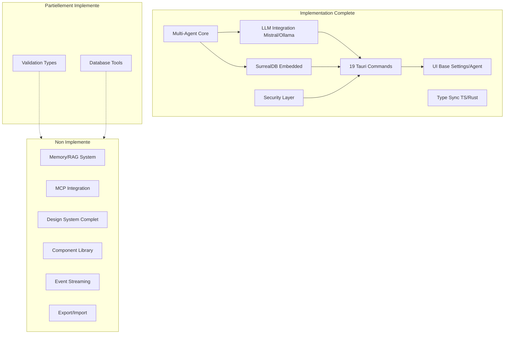
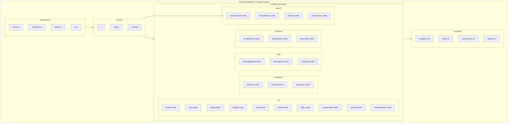
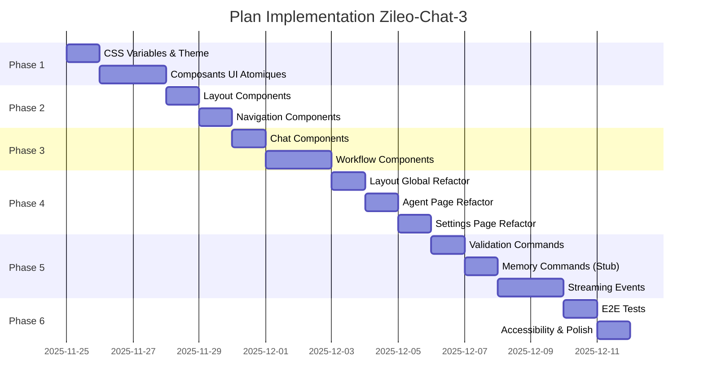

# Specification - Plan d'Implementation Complet Zileo-Chat-3

## Metadonnees
- **Date**: 2025-11-25
- **Stack**: SvelteKit 2.49.0 + Svelte 5.43.14 | Rust 1.91.1 + Tauri 2.9.4 | SurrealDB 2.3.10 | Rig.rs 0.24.0
- **Complexite**: **Critical** (implementation complete multi-phases)
- **Statut**: Phase Base Complete -> Implementation Features + Design System

---

## Contexte

### Demande Initiale
**Analyser et comprendre parfaitement toute la documentation et planifier l'implementation des features de l'application et l'implementation du design.**

### Objectif
Etablir un plan d'implementation detaille couvrant:
1. L'application du Design System documente
2. L'implementation de toutes les features documentees
3. L'integration des composants UI manquants
4. Le deploiement progressif par phases logiques

### Etat Actuel (Base Implementation Complete)



### Inventaire Implementation Actuelle

| Composant | Fichiers Cles | Statut | Lignes |
|-----------|---------------|--------|--------|
| Agent Core (trait, registry, orchestrator) | `src-tauri/src/agents/core/` | Complete | ~600 |
| SimpleAgent | `src-tauri/src/agents/simple_agent.rs` | Complete | 100 |
| LLMAgent | `src-tauri/src/agents/llm_agent.rs` | Complete | 382 |
| LLM Providers (Mistral, Ollama) | `src-tauri/src/llm/` | Complete | ~1300 |
| Database Client | `src-tauri/src/db/` | Complete | ~200 |
| Security (keystore, validation) | `src-tauri/src/security/` | Complete | ~300 |
| Tauri Commands (19) | `src-tauri/src/commands/` | Complete | ~700 |
| TypeScript Types (6 fichiers) | `src/types/` | Complete | ~200 |
| Svelte Stores (2) | `src/lib/stores/` | Complete | ~450 |
| UI Pages (3) | `src/routes/` | Complete | ~1900 |
| DB Tools | `src-tauri/src/tools/db/` | Partial | ~150 |

**Total Code Source**: ~6,200 lignes (Rust + TypeScript + Svelte)

---

## Architecture Proposee - Design System Integration

### Diagramme Structure Cible



---

## Plan d'Implementation par Phases

### Phase 1: Design System Foundation (3 jours)

**Objectif**: Implementer le systeme de design complet defini dans `docs/DESIGN_SYSTEM.md`

#### 1.1 CSS Variables et Theme System

**Fichier**: `src/styles/variables.css`
```css
/* A creer selon DESIGN_SYSTEM.md - Color Palette complet */
:root {
  /* Brand Colors */
  --color-accent: #94EFEE;
  --color-accent-hover: #7de6e5;
  --color-secondary: #FE7254;
  --color-secondary-hover: #fe5a3d;

  /* Light Theme Backgrounds */
  --color-bg-primary: #ffffff;
  --color-bg-secondary: #f8f9fa;
  --color-bg-tertiary: #f1f3f5;
  --color-bg-hover: #e9ecef;
  --color-bg-active: #dee2e6;

  /* Light Theme Text */
  --color-text-primary: #212529;
  --color-text-secondary: #495057;
  --color-text-tertiary: #6c757d;
  --color-text-inverse: #ffffff;

  /* Borders */
  --color-border: rgba(33, 37, 41, 0.15);
  --color-border-light: rgba(33, 37, 41, 0.1);
  --color-border-dark: rgba(33, 37, 41, 0.25);

  /* Semantic Colors */
  --color-success: #10b981;
  --color-success-light: #d1fae5;
  --color-warning: #f59e0b;
  --color-warning-light: #fef3c7;
  --color-error: #ef4444;
  --color-error-light: #fee2e2;

  /* Status Colors */
  --color-status-idle: #6c757d;
  --color-status-running: #3b82f6;
  --color-status-completed: #10b981;
  --color-status-error: #ef4444;

  /* Typography */
  --font-family: 'Signika', -apple-system, BlinkMacSystemFont, 'Segoe UI', system-ui, sans-serif;
  --font-mono: 'JetBrains Mono', 'Fira Code', monospace;
  --font-size-xs: 0.75rem;
  --font-size-sm: 0.875rem;
  --font-size-base: 1rem;
  --font-size-lg: 1.125rem;
  --font-size-xl: 1.25rem;
  --font-size-2xl: 1.5rem;
  --font-weight-normal: 400;
  --font-weight-medium: 500;
  --font-weight-semibold: 600;
  --font-weight-bold: 700;
  --line-height-tight: 1.25;
  --line-height-base: 1.5;
  --line-height-relaxed: 1.75;

  /* Spacing */
  --spacing-xs: 0.25rem;
  --spacing-sm: 0.5rem;
  --spacing-md: 1rem;
  --spacing-lg: 1.5rem;
  --spacing-xl: 2rem;
  --spacing-2xl: 3rem;

  /* Border Radius */
  --border-radius-sm: 0.25rem;
  --border-radius-md: 0.5rem;
  --border-radius-lg: 0.75rem;
  --border-radius-xl: 1rem;
  --border-radius-full: 9999px;

  /* Shadows */
  --shadow-xs: 0 1px 2px 0 rgba(0, 0, 0, 0.05);
  --shadow-sm: 0 1px 3px 0 rgba(0, 0, 0, 0.1), 0 1px 2px -1px rgba(0, 0, 0, 0.1);
  --shadow-md: 0 4px 6px -1px rgba(0, 0, 0, 0.1), 0 2px 4px -2px rgba(0, 0, 0, 0.1);
  --shadow-lg: 0 10px 15px -3px rgba(0, 0, 0, 0.1), 0 4px 6px -4px rgba(0, 0, 0, 0.1);
  --shadow-xl: 0 20px 25px -5px rgba(0, 0, 0, 0.1), 0 8px 10px -6px rgba(0, 0, 0, 0.1);

  /* Transitions */
  --transition-fast: 150ms cubic-bezier(0.4, 0, 0.2, 1);
  --transition-base: 200ms cubic-bezier(0.4, 0, 0.2, 1);
  --transition-slow: 300ms cubic-bezier(0.4, 0, 0.2, 1);

  /* Z-Index */
  --z-index-dropdown: 1000;
  --z-index-sticky: 1020;
  --z-index-fixed: 1030;
  --z-index-modal-backdrop: 1040;
  --z-index-modal: 1050;
  --z-index-popover: 1060;
  --z-index-tooltip: 1070;

  /* Layout */
  --sidebar-width: 240px;
  --sidebar-collapsed-width: 60px;
  --floating-menu-height: 60px;
}

[data-theme="dark"] {
  --color-bg-primary: #2b2d31;
  --color-bg-secondary: #1e1f22;
  --color-bg-tertiary: #161719;
  --color-bg-hover: #35373c;
  --color-bg-active: #3f4147;

  --color-text-primary: #ffffff;
  --color-text-secondary: #b5bac1;
  --color-text-tertiary: #80848e;
  --color-text-inverse: #212529;

  --color-border: #3f4147;
  --color-border-light: #35373c;
  --color-border-dark: #4e5058;

  --color-accent-light: rgba(148, 239, 238, 0.15);
}
```

**Taches**:
1. Creer `src/styles/variables.css` avec toutes les CSS variables
2. Creer `src/styles/reset.css` pour normalisation
3. Creer `src/styles/utilities.css` avec classes utilitaires (flex, grid, spacing)
4. Installer `lucide-svelte` pour les icones
5. Importer Google Fonts (Signika + JetBrains Mono)
6. Implementer `src/lib/stores/theme.ts` pour toggle light/dark

**Validation**:
- CSS variables disponibles dans toute l'app
- Theme toggle fonctionne (localStorage persistence)
- Fonts chargees correctement

---

#### 1.2 Composants UI Atomiques

**Fichiers a creer** dans `src/lib/components/ui/`:

| Composant | Props | Description |
|-----------|-------|-------------|
| `Button.svelte` | variant, size, disabled, onclick, children | 4 variantes (primary, secondary, ghost, danger), 4 tailles |
| `Badge.svelte` | variant, children | Status badges (primary, success, warning, error) |
| `StatusIndicator.svelte` | status | Dot indicator (idle, running, completed, error) |
| `Spinner.svelte` | size | Loading spinner anime |
| `ProgressBar.svelte` | value, max | Barre de progression |
| `Card.svelte` | title, description, children | Container avec header/body/footer slots |
| `Modal.svelte` | open, title, onclose, children | Dialog modal avec backdrop |
| `Input.svelte` | type, value, placeholder, disabled, oninput | Input form stylise |
| `Select.svelte` | options, value, onchange | Select dropdown |
| `Textarea.svelte` | value, placeholder, disabled, oninput | Zone de texte multi-ligne |

**Pattern Svelte 5 Example** (`Button.svelte`):
```svelte
<script lang="ts">
  import type { Snippet } from 'svelte';

  interface Props {
    variant?: 'primary' | 'secondary' | 'ghost' | 'danger';
    size?: 'sm' | 'md' | 'lg' | 'icon';
    disabled?: boolean;
    type?: 'button' | 'submit' | 'reset';
    onclick?: () => void;
    children: Snippet;
  }

  let {
    variant = 'primary',
    size = 'md',
    disabled = false,
    type = 'button',
    onclick,
    children
  }: Props = $props();
</script>

<button
  {type}
  {disabled}
  class="btn btn-{variant} {size !== 'md' ? `btn-${size}` : ''}"
  onclick={onclick}
>
  {@render children()}
</button>

<style>
  .btn { /* Styles from DESIGN_SYSTEM.md */ }
</style>
```

**Validation**:
- Tous les composants rendent correctement
- Props TypeScript strictement typees
- Styles conformes au Design System

---

### Phase 2: Layout Components (2 jours)

**Objectif**: Implementer les composants de layout selon le Design System

#### 2.1 Structure Layout

**Fichiers** `src/lib/components/layout/`:

| Composant | Description |
|-----------|-------------|
| `AppContainer.svelte` | Container principal avec flex column |
| `FloatingMenu.svelte` | Menu fixe en haut (navigation, theme toggle, logo) |
| `Sidebar.svelte` | Sidebar collapsible avec slots header/nav/footer |
| `ContentArea.svelte` | Zone de contenu principale scrollable |

**Architecture Layout**:
```
AppContainer
├── FloatingMenu (fixed top)
└── MainContent (flex)
    ├── Sidebar (collapsible 240px / 60px)
    └── ContentArea (flex-1, scrollable)
```

#### 2.2 Navigation Components

**Fichiers** `src/lib/components/navigation/`:

| Composant | Props | Description |
|-----------|-------|-------------|
| `NavItem.svelte` | href, icon, label, active | Item de navigation avec icone Lucide |
| `FilterBar.svelte` | searchValue, filterOptions, onSearch, onFilter | Barre de recherche et filtres |
| `SearchBox.svelte` | value, placeholder, onInput | Champ de recherche avec icone |

**Validation**:
- Sidebar collapse/expand fonctionne
- Navigation responsive
- Theme toggle dans FloatingMenu

---

### Phase 3: Chat & Workflow Components (3 jours)

**Objectif**: Composants specialises pour l'interface de chat et workflows

#### 3.1 Chat Components

**Fichiers** `src/lib/components/chat/`:

| Composant | Props | Description |
|-----------|-------|-------------|
| `MessageBubble.svelte` | message: Message, isUser: boolean | Bulle de message user/assistant |
| `MessageList.svelte` | messages: Message[] | Liste scrollable de messages |
| `ChatInput.svelte` | value, disabled, onSend | Zone de saisie avec bouton Send |
| `ToolExecution.svelte` | tool: string, status, duration | Indicateur d'execution d'outil |
| `ReasoningStep.svelte` | step: string, expanded | Etape de raisonnement collapsible |

**Features MessageBubble**:
- Markdown rendering pour les reponses agent
- Code highlighting avec font mono
- Timestamps et token count
- Animation fadeIn

#### 3.2 Workflow Components

**Fichiers** `src/lib/components/workflow/`:

| Composant | Props | Description |
|-----------|-------|-------------|
| `WorkflowItem.svelte` | workflow: Workflow, active, onSelect, onDelete | Item workflow dans sidebar |
| `WorkflowList.svelte` | workflows: Workflow[], selectedId, onSelect | Liste de workflows |
| `MetricsBar.svelte` | metrics: WorkflowMetrics | Barre de metriques (duration, tokens, provider) |
| `ValidationModal.svelte` | request: ValidationRequest, onApprove, onReject | Modal human-in-the-loop |
| `AgentSelector.svelte` | agents: string[], selected, onSelect | Dropdown selection agent |

**Features WorkflowItem**:
- Status indicator (idle/running/completed/error)
- Inline rename (contenteditable)
- Delete button on hover
- Active state highlighting

---

### Phase 4: Pages Refactoring avec Design System (3 jours)

**Objectif**: Refactoriser les pages existantes pour utiliser les nouveaux composants

#### 4.1 Layout Global

**Fichier**: `src/routes/+layout.svelte`
```svelte
<script lang="ts">
  import { onMount } from 'svelte';
  import '../styles/variables.css';
  import '../styles/reset.css';
  import '../styles/utilities.css';
  import AppContainer from '$lib/components/layout/AppContainer.svelte';
  import FloatingMenu from '$lib/components/layout/FloatingMenu.svelte';
  import { theme } from '$lib/stores/theme';

  let { children } = $props();

  onMount(() => {
    theme.init();
  });
</script>

<AppContainer>
  <FloatingMenu />
  {@render children()}
</AppContainer>
```

#### 4.2 Agent Page Refactoring

**Fichier**: `src/routes/agent/+page.svelte`

**Structure Cible**:
```
MainContent
├── Sidebar
│   ├── SidebarHeader (title + new workflow button)
│   ├── FilterBar (search workflows)
│   └── WorkflowList
└── ContentArea
    ├── AgentSelector
    ├── MessageList (chat history)
    ├── ChatInput
    └── MetricsBar
```

**Nouvelles Fonctionnalites**:
- Chat history avec messages multiples
- Agent selector dropdown
- Validation modal (human-in-the-loop)
- Real-time metrics updates
- Keyboard shortcuts (Ctrl+Enter)

#### 4.3 Settings Page Refactoring

**Fichier**: `src/routes/settings/+page.svelte`

**Sections**:
1. **Providers** - Configuration Mistral/Ollama avec test connection
2. **Models** - Selection modele par provider
3. **Theme** - Toggle Light/Dark avec preview
4. **Agents** - Liste agents configures (read-only base)
5. **MCP Servers** - Configuration (placeholder pour Phase future)

**Utilisation Composants**:
- Card pour chaque section
- Input/Select pour formulaires
- Button primary/secondary
- Badge pour status
- StatusIndicator pour connection status

---

### Phase 5: Missing Backend Features (4 jours)

**Objectif**: Implementer les commandes Tauri manquantes

#### 5.1 Validation Commands

**Fichier**: `src-tauri/src/commands/validation.rs`

| Command | Signature | Description |
|---------|-----------|-------------|
| `create_validation_request` | `(workflow_id, type, operation, details, risk_level) -> ValidationRequest` | Cree une demande de validation |
| `list_pending_validations` | `() -> Vec<ValidationRequest>` | Liste les validations en attente |
| `approve_validation` | `(validation_id) -> ()` | Approuve une validation |
| `reject_validation` | `(validation_id, reason) -> ()` | Rejette une validation |

#### 5.2 Memory/RAG Commands (Stub)

**Fichier**: `src-tauri/src/commands/memory.rs`

| Command | Signature | Description |
|---------|-----------|-------------|
| `add_memory` | `(type, content, metadata) -> String` | Ajoute une memoire (sans embedding pour l'instant) |
| `list_memories` | `(type_filter?) -> Vec<Memory>` | Liste les memoires |
| `delete_memory` | `(memory_id) -> ()` | Supprime une memoire |
| `search_memories` | `(query, limit) -> Vec<Memory>` | Recherche textuelle (sans vector pour l'instant) |

#### 5.3 Streaming Events

**Pattern Event Streaming Tauri**:
```rust
// Backend
#[tauri::command]
async fn execute_workflow_streaming(
    window: tauri::Window,
    workflow_id: String,
    message: String,
    agent_id: String,
    state: State<'_, AppState>,
) -> Result<(), String> {
    // Emit progress events
    window.emit("workflow_stream", StreamChunk {
        workflow_id: workflow_id.clone(),
        chunk_type: "token".to_string(),
        content: Some("...".to_string()),
        tool: None,
        duration: None,
    }).map_err(|e| e.to_string())?;

    // ... execution logic

    window.emit("workflow_complete", WorkflowComplete {
        workflow_id,
        status: "completed".to_string(),
    }).map_err(|e| e.to_string())?;

    Ok(())
}
```

```typescript
// Frontend
import { listen } from '@tauri-apps/api/event';

const unlisten = await listen<StreamChunk>('workflow_stream', (event) => {
  // Handle streaming chunk
});
```

#### 5.4 Types Manquants

**TypeScript** (`src/types/`):

```typescript
// streaming.ts
export type ChunkType = 'token' | 'tool_start' | 'tool_end' | 'reasoning' | 'error';

export interface StreamChunk {
  workflow_id: string;
  chunk_type: ChunkType;
  content?: string;
  tool?: string;
  duration?: number;
}

export interface WorkflowComplete {
  workflow_id: string;
  status: WorkflowStatus;
}

// memory.ts
export type MemoryType = 'user_pref' | 'context' | 'knowledge' | 'decision';

export interface Memory {
  id: string;
  type: MemoryType;
  content: string;
  metadata: Record<string, unknown>;
  created_at: Date;
}
```

**Rust** (`src-tauri/src/models/`):
```rust
// streaming.rs
#[derive(Debug, Clone, Serialize, Deserialize)]
pub struct StreamChunk {
    pub workflow_id: String,
    pub chunk_type: String,
    pub content: Option<String>,
    pub tool: Option<String>,
    pub duration: Option<u64>,
}

// memory.rs (update existing)
#[derive(Debug, Clone, Serialize, Deserialize)]
pub struct Memory {
    pub id: String,
    #[serde(rename = "type")]
    pub memory_type: MemoryType,
    pub content: String,
    pub metadata: serde_json::Value,
    pub created_at: DateTime<Utc>,
}
```

---

### Phase 6: Integration et Polish (2 jours)

**Objectif**: Integration complete, tests, et finitions

#### 6.1 Integration Tests E2E

**Fichiers** `tests/e2e/`:

| Test | Description |
|------|-------------|
| `workflow-crud.spec.ts` | Create, read, update, delete workflows |
| `chat-interaction.spec.ts` | Send message, receive response |
| `settings-config.spec.ts` | Configure provider, test connection |
| `theme-toggle.spec.ts` | Toggle theme, verify persistence |

#### 6.2 Accessibility Audit

**Checklist WCAG 2.1 AA**:
- [ ] Focus visible sur tous les elements interactifs
- [ ] Contraste couleurs minimum 4.5:1
- [ ] Labels ARIA sur buttons icon-only
- [ ] Keyboard navigation complete
- [ ] Screen reader compatible

#### 6.3 Performance Optimization

- [ ] Lazy loading pour composants lourds
- [ ] Memoization pour derived stores
- [ ] Debounce sur search input
- [ ] Virtualisation liste messages si >100

---

## Estimation Complete

| Phase | Frontend | Backend | Tests | Total |
|-------|----------|---------|-------|-------|
| 1. Design System Foundation | 16h | - | 2h | **18h** |
| 2. Layout Components | 12h | - | 2h | **14h** |
| 3. Chat & Workflow Components | 18h | - | 3h | **21h** |
| 4. Pages Refactoring | 16h | - | 2h | **18h** |
| 5. Missing Backend Features | 4h | 24h | 4h | **32h** |
| 6. Integration & Polish | 8h | 4h | 8h | **20h** |
| **Total** | **74h** | **28h** | **21h** | **123h** |

**Estimation Realiste**: **15-20 jours** pour 1 developpeur full-time

**Facteurs de Reduction**:
- Documentation Design System complete (-20%)
- Patterns Svelte 5 etablis (-15%)
- Base implementation solide (-10%)

**Facteurs d'Augmentation**:
- Complexite integration streaming (+15%)
- Tests E2E complets (+10%)
- Accessibility compliance (+10%)

---

## Analyse des Risques

| Risque | Probabilite | Impact | Mitigation | Plan B |
|--------|-------------|--------|------------|--------|
| **Lucide-svelte compatibility** | Faible | Faible | Utiliser version stable | Fallback inline SVG |
| **Theme persistence issues** | Faible | Faible | Tests localStorage | Cookie fallback |
| **Streaming event race conditions** | Moyenne | Moyen | Buffer events, queue processing | Polling fallback |
| **Svelte 5 runes learning curve** | Moyenne | Faible | Documentation Context7 | Patterns progressifs |
| **Component prop type drift** | Moyenne | Moyen | Strict TypeScript, tests | Generate types from Rust |
| **Dark theme contrast issues** | Moyenne | Faible | WCAG contrast checker | Manual adjustments |
| **Performance avec >100 messages** | Moyenne | Moyen | Virtualisation | Pagination |

---

## Dependances Manquantes

### Frontend (package.json additions)

```json
{
  "dependencies": {
    "lucide-svelte": "^0.460.0"
  }
}
```

### Backend (Cargo.toml) - Aucune addition requise

Les dependances actuelles couvrent tous les besoins.

---

## Ordre d'Implementation Recommande



---

## Criteres de Succes

### Definition of Done - Phase 1-4 (UI)
- [ ] Tous les composants definis dans DESIGN_SYSTEM.md implementes
- [ ] Theme light/dark fonctionnel avec persistence
- [ ] Pages agent et settings utilisent les nouveaux composants
- [ ] Aucune regression fonctionnelle
- [ ] `npm run check` passe sans erreur

### Definition of Done - Phase 5 (Backend)
- [ ] Validation commands implementees et testees
- [ ] Memory commands stub fonctionnels
- [ ] Event streaming operationnel
- [ ] Types synchronises TS/Rust
- [ ] `cargo test` passe sans erreur

### Definition of Done - Phase 6 (Integration)
- [ ] Tests E2E couvrent les parcours critiques
- [ ] Audit accessibilite valide
- [ ] Performance acceptable (<200ms interaction)
- [ ] Documentation mise a jour
- [ ] Build production fonctionne

---

## Prochaines Etapes (Post-Implementation Design)

### Features Avancees (v1.1+)

1. **MCP Integration Complete** - Client MCP, configuration UI, tool bridging
2. **RAG System Complet** - Embeddings generation, vector search, context retrieval
3. **Multi-Provider LLM** - Claude, GPT-4, Gemini support
4. **Agent Specialises** - DB Agent, API Agent, Code Agent pre-configures
5. **Export/Import Workflows** - JSON/Markdown export, sharing
6. **Prompts Library** - Templates CRUD, variables, versioning
7. **Theme Customization Avancee** - Color picker, presets
8. **Analytics Dashboard** - Usage metrics, cost tracking

---

## References

### Documentation Projet
- `docs/DESIGN_SYSTEM.md` - Specification complete du design
- `docs/FRONTEND_SPECIFICATIONS.md` - Specifications UI detaillees
- `docs/API_REFERENCE.md` - Signatures commandes Tauri
- `docs/MULTI_AGENT_ARCHITECTURE.md` - Architecture agents

### Ressources Externes
- **Svelte 5 Runes**: https://svelte.dev/docs/svelte/runes
- **Lucide Icons**: https://lucide.dev/icons/
- **Tauri Events**: https://v2.tauri.app/develop/calling-rust/#events
- **WCAG 2.1**: https://www.w3.org/WAI/WCAG21/quickref/

---

**FIN DE SPECIFICATION**

Cette specification couvre l'implementation complete du Design System et des features manquantes pour Zileo-Chat-3. L'approche par phases permet une integration progressive avec validation a chaque etape.
