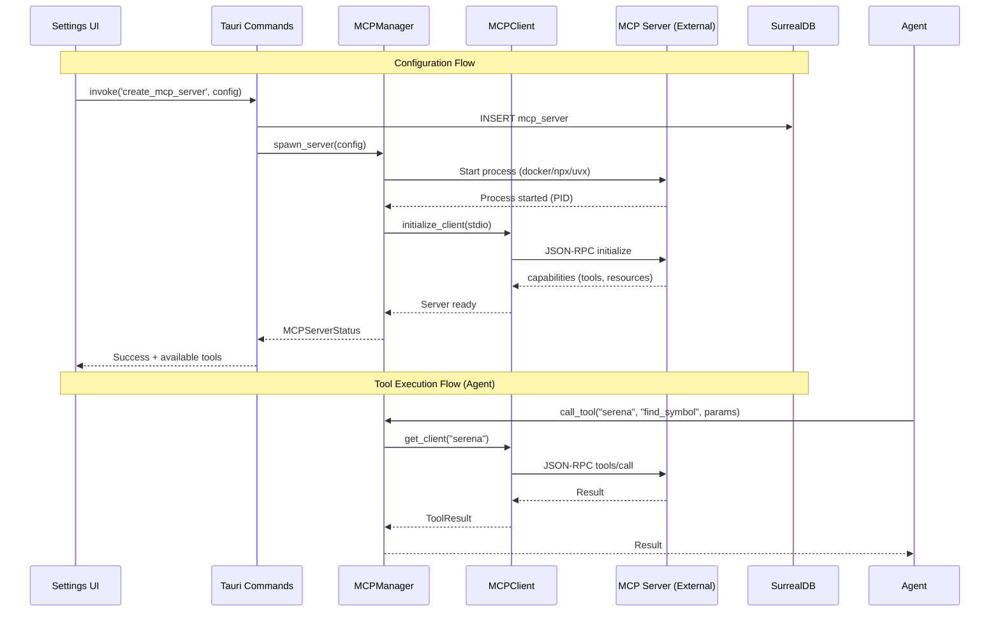

# Specification - MCP Integration

## Metadata
- Date: 2025-11-25
- Stack: Svelte 5.43 + Rust 1.91 + Tauri 2.9 + SurrealDB 2.3
- Complexity: **complex**
- Priority: **High**
- Estimated Effort: 50-70 development hours
- Documentation Reference: `docs/MCP_CONFIGURATION_GUIDE.md`

## Context

**Request**: Implement MCP (Model Context Protocol) integration as defined in `MCP_CONFIGURATION_GUIDE.md`

**Objective**: Enable Zileo-Chat-3 to:
1. Configure and manage external MCP servers (NPX, UVX, Docker)
2. Act as MCP client to consume tools from external servers
3. Provide a user-friendly configuration UI in Settings
4. Integrate MCP tool calls into agent workflow execution

**Scope**:
- **Included**:
  - MCP Client implementation (consume external servers)
  - Server configuration UI (Settings page)
  - Server lifecycle management (spawn, kill, restart)
  - Tool discovery and execution
  - JSON-RPC 2.0 protocol over stdio transport
  - Database persistence for MCP server configs
- **Excluded**:
  - MCP Server mode (exposing internal tools) - Future phase
  - OAuth 2.1 authentication - Future phase
  - Streamable HTTP transport - Future phase (stdio first)
  - WebSocket transport - Future phase
  - MCP Inspector debugging tool - Future phase

**Success Criteria**:
- [ ] User can add/edit/delete MCP server configurations in Settings UI
- [ ] User can test MCP server connections
- [ ] MCP servers spawn on application startup
- [ ] Agents can invoke MCP tools during workflow execution
- [ ] MCP tool calls are logged and visible in workflow results
- [ ] Graceful handling of server failures (timeout, crash)

---

## Current State Analysis

### Architecture Existing

```
Current Flow (No MCP):
┌─────────────────────┐
│ Svelte Frontend     │
└─────────┬───────────┘
          │ Tauri IPC
          ↓
┌─────────────────────┐
│ Rust Backend        │
│ - 34 Tauri commands │
│ - Agent system      │
│ - LLM providers     │
└─────────┬───────────┘
          │
          ↓
┌─────────────────────┐
│ SurrealDB           │
└─────────────────────┘
```

### Patterns Identified

**1. LLM Provider Configuration Pattern** (reusable for MCP):
- `src-tauri/src/llm/manager.rs` - ProviderManager with Arc<RwLock<Config>>
- `src-tauri/src/commands/llm.rs` - 7 Tauri commands for configuration
- `src/routes/settings/+page.svelte` - Card-based provider UI

**2. Secure Storage Pattern** (reusable for MCP credentials):
- `src-tauri/src/security/keystore.rs` - OS keychain + AES-256-GCM
- `src-tauri/src/commands/security.rs` - API key CRUD operations

**3. AppState Pattern** (extend for MCP):
- `src-tauri/src/state.rs` - Shared state with Arc<T>
- Thread-safe access via State<'_, AppState>

**4. Streaming/Events Pattern** (reusable for MCP status):
- `src-tauri/src/commands/streaming.rs` - Window event emission
- `src/types/streaming.ts` - StreamChunk types

### Code Reusable

**Frontend**:
- `src/lib/components/ui/` - All UI components (Card, Button, Input, Select, Modal, StatusIndicator)
- `src/routes/settings/+page.svelte` - Settings page structure (add new section)
- `src/lib/stores/theme.ts` - Store pattern for MCP state

**Backend**:
- `src-tauri/src/security/keystore.rs` - Secure credential storage
- `src-tauri/src/security/validation.rs` - Input validation utilities
- `src-tauri/src/db/client.rs` - Database CRUD operations pattern

### Current MCP Implementation Status

| Component | Status | Location |
|-----------|--------|----------|
| MCP types in Agent | Partial | `src-tauri/src/models/agent.rs:38,55` (`mcp_servers: Vec<String>`) |
| MCP validation type | Partial | `src-tauri/src/db/schema.rs:52` (type exists, no handler) |
| MCP module | Not Created | Needs: `src-tauri/src/mcp/` |
| MCP commands | Not Created | Needs: `src-tauri/src/commands/mcp.rs` |
| MCP UI | Not Created | Needs: Settings page section |
| MCP types (TS) | Not Created | Needs: `src/types/mcp.ts` |

---

## Architecture Proposed

### Target Flow

```
Target Flow (With MCP):
┌─────────────────────┐
│ Svelte Frontend     │
│ - MCP Config UI     │
└─────────┬───────────┘
          │ Tauri IPC
          ↓
┌─────────────────────────────────────────┐
│ Rust Backend                            │
│ ┌─────────────────────────────────────┐ │
│ │ MCP Module (NEW)                    │ │
│ │ - MCPManager (registry + lifecycle) │ │
│ │ - MCPClient (JSON-RPC over stdio)   │ │
│ │ - MCPServerHandle (process control) │ │
│ └─────────────────────────────────────┘ │
│                                         │
│ ┌─────────────────────────────────────┐ │
│ │ Agent System (ENHANCED)             │ │
│ │ - Execute MCP tools via MCPClient   │ │
│ └─────────────────────────────────────┘ │
└─────────────────┬───────────────────────┘
                  │
    ┌─────────────┼─────────────┐
    ↓             ↓             ↓
┌───────┐   ┌──────────┐   ┌──────────┐
│SurrealDB│ │MCP Server│   │MCP Server│
│        │  │(Docker)  │   │(NPX/UVX) │
└───────┘   └──────────┘   └──────────┘
```

### Detailed Component Flow



---

## Proposed File Structure

### Backend (Rust)

```
src-tauri/src/
├── mcp/                          # NEW MODULE
│   ├── mod.rs                    # Module exports
│   ├── manager.rs                # MCPManager (registry + lifecycle)
│   ├── client.rs                 # MCPClient (JSON-RPC communication)
│   ├── server_handle.rs          # MCPServerHandle (process control)
│   ├── protocol.rs               # JSON-RPC 2.0 types
│   └── error.rs                  # MCP-specific errors
│
├── commands/
│   └── mcp.rs                    # NEW: Tauri commands for MCP
│
├── models/
│   └── mcp.rs                    # NEW: MCP data models
│
├── db/
│   └── schema.rs                 # MODIFY: Add mcp_server table
│
├── state.rs                      # MODIFY: Add MCPManager to AppState
└── main.rs                       # MODIFY: Register MCP commands
```

### Frontend (Svelte/TypeScript)

```
src/
├── types/
│   └── mcp.ts                    # NEW: MCP TypeScript types
│
├── lib/
│   ├── stores/
│   │   └── mcp.ts                # NEW: MCP state store
│   │
│   └── components/
│       └── mcp/                  # NEW: MCP components
│           ├── MCPServerCard.svelte
│           ├── MCPServerForm.svelte
│           └── MCPServerTester.svelte
│
└── routes/
    └── settings/
        └── +page.svelte          # MODIFY: Add MCP section
```

---

## Type Definitions

### TypeScript (`src/types/mcp.ts`)

```typescript
// Import pattern: import type { MCPServer } from '$types/mcp';

export type MCPDeploymentMethod = 'docker' | 'npx' | 'uvx';

export interface MCPServerConfig {
  id: string;
  name: string;
  enabled: boolean;
  command: MCPDeploymentMethod;
  args: string[];
  env: Record<string, string>;
  description?: string;
}

export interface MCPServer extends MCPServerConfig {
  status: MCPServerStatus;
  tools: MCPTool[];
  resources: MCPResource[];
  created_at: string;
  updated_at: string;
}

export type MCPServerStatus =
  | 'stopped'
  | 'starting'
  | 'running'
  | 'error'
  | 'disconnected';

export interface MCPTool {
  name: string;
  description: string;
  input_schema: Record<string, unknown>;
}

export interface MCPResource {
  uri: string;
  name: string;
  description?: string;
  mime_type?: string;
}

export interface MCPTestResult {
  success: boolean;
  message: string;
  tools: MCPTool[];
  resources: MCPResource[];
  latency_ms: number;
}

export interface MCPToolCallRequest {
  server_name: string;
  tool_name: string;
  arguments: Record<string, unknown>;
}

export interface MCPToolCallResult {
  success: boolean;
  content: unknown;
  error?: string;
  duration_ms: number;
}
```

### Rust Models (`src-tauri/src/models/mcp.rs`)

```rust
use serde::{Deserialize, Serialize};
use std::collections::HashMap;

#[derive(Debug, Clone, Serialize, Deserialize, PartialEq)]
#[serde(rename_all = "lowercase")]
pub enum MCPDeploymentMethod {
    Docker,
    Npx,
    Uvx,
}

#[derive(Debug, Clone, Serialize, Deserialize)]
pub struct MCPServerConfig {
    pub id: String,
    pub name: String,
    pub enabled: bool,
    pub command: MCPDeploymentMethod,
    pub args: Vec<String>,
    pub env: HashMap<String, String>,
    #[serde(skip_serializing_if = "Option::is_none")]
    pub description: Option<String>,
}

#[derive(Debug, Clone, Serialize, Deserialize, PartialEq)]
#[serde(rename_all = "lowercase")]
pub enum MCPServerStatus {
    Stopped,
    Starting,
    Running,
    Error,
    Disconnected,
}

#[derive(Debug, Clone, Serialize, Deserialize)]
pub struct MCPTool {
    pub name: String,
    pub description: String,
    pub input_schema: serde_json::Value,
}

#[derive(Debug, Clone, Serialize, Deserialize)]
pub struct MCPResource {
    pub uri: String,
    pub name: String,
    #[serde(skip_serializing_if = "Option::is_none")]
    pub description: Option<String>,
    #[serde(skip_serializing_if = "Option::is_none")]
    pub mime_type: Option<String>,
}

#[derive(Debug, Clone, Serialize, Deserialize)]
pub struct MCPServer {
    #[serde(flatten)]
    pub config: MCPServerConfig,
    pub status: MCPServerStatus,
    pub tools: Vec<MCPTool>,
    pub resources: Vec<MCPResource>,
    pub created_at: String,
    pub updated_at: String,
}

#[derive(Debug, Clone, Serialize, Deserialize)]
pub struct MCPTestResult {
    pub success: bool,
    pub message: String,
    pub tools: Vec<MCPTool>,
    pub resources: Vec<MCPResource>,
    pub latency_ms: u64,
}

#[derive(Debug, Clone, Serialize, Deserialize)]
pub struct MCPToolCallRequest {
    pub server_name: String,
    pub tool_name: String,
    pub arguments: serde_json::Value,
}

#[derive(Debug, Clone, Serialize, Deserialize)]
pub struct MCPToolCallResult {
    pub success: bool,
    pub content: serde_json::Value,
    #[serde(skip_serializing_if = "Option::is_none")]
    pub error: Option<String>,
    pub duration_ms: u64,
}
```

### JSON-RPC Protocol Types (`src-tauri/src/mcp/protocol.rs`)

```rust
use serde::{Deserialize, Serialize};
use serde_json::Value;

/// JSON-RPC 2.0 Request
#[derive(Debug, Clone, Serialize, Deserialize)]
pub struct JsonRpcRequest {
    pub jsonrpc: String,  // Always "2.0"
    pub method: String,
    #[serde(skip_serializing_if = "Option::is_none")]
    pub params: Option<Value>,
    pub id: JsonRpcId,
}

/// JSON-RPC 2.0 Response
#[derive(Debug, Clone, Serialize, Deserialize)]
pub struct JsonRpcResponse {
    pub jsonrpc: String,
    #[serde(skip_serializing_if = "Option::is_none")]
    pub result: Option<Value>,
    #[serde(skip_serializing_if = "Option::is_none")]
    pub error: Option<JsonRpcError>,
    pub id: JsonRpcId,
}

#[derive(Debug, Clone, Serialize, Deserialize)]
#[serde(untagged)]
pub enum JsonRpcId {
    Number(i64),
    String(String),
    Null,
}

#[derive(Debug, Clone, Serialize, Deserialize)]
pub struct JsonRpcError {
    pub code: i32,
    pub message: String,
    #[serde(skip_serializing_if = "Option::is_none")]
    pub data: Option<Value>,
}

// MCP-specific message types
#[derive(Debug, Clone, Serialize, Deserialize)]
pub struct MCPInitializeParams {
    pub protocol_version: String,  // "2025-06-18"
    pub capabilities: MCPClientCapabilities,
    pub client_info: MCPClientInfo,
}

#[derive(Debug, Clone, Serialize, Deserialize)]
pub struct MCPClientCapabilities {
    pub roots: Option<RootsCapability>,
    pub sampling: Option<SamplingCapability>,
}

#[derive(Debug, Clone, Serialize, Deserialize)]
pub struct MCPClientInfo {
    pub name: String,
    pub version: String,
}

#[derive(Debug, Clone, Serialize, Deserialize)]
pub struct MCPInitializeResult {
    pub protocol_version: String,
    pub capabilities: MCPServerCapabilities,
    pub server_info: MCPServerInfo,
}

#[derive(Debug, Clone, Serialize, Deserialize)]
pub struct MCPServerCapabilities {
    pub tools: Option<ToolsCapability>,
    pub resources: Option<ResourcesCapability>,
    pub prompts: Option<PromptsCapability>,
}

#[derive(Debug, Clone, Serialize, Deserialize)]
pub struct ToolsCapability {
    pub list_changed: Option<bool>,
}

#[derive(Debug, Clone, Serialize, Deserialize)]
pub struct ResourcesCapability {
    pub subscribe: Option<bool>,
    pub list_changed: Option<bool>,
}

// Tool call types
#[derive(Debug, Clone, Serialize, Deserialize)]
pub struct MCPToolCallParams {
    pub name: String,
    pub arguments: Value,
}

#[derive(Debug, Clone, Serialize, Deserialize)]
pub struct MCPToolCallResponse {
    pub content: Vec<MCPContent>,
    #[serde(skip_serializing_if = "Option::is_none")]
    pub is_error: Option<bool>,
}

#[derive(Debug, Clone, Serialize, Deserialize)]
#[serde(tag = "type")]
pub enum MCPContent {
    #[serde(rename = "text")]
    Text { text: String },
    #[serde(rename = "image")]
    Image { data: String, mime_type: String },
    #[serde(rename = "resource")]
    Resource { resource: MCPResourceContent },
}
```

---

## Database Schema

### SurrealDB Table Definition

Add to `src-tauri/src/db/schema.rs`:

```sql
-- MCP Server Configuration Table
DEFINE TABLE mcp_server SCHEMAFULL;
DEFINE FIELD id ON mcp_server TYPE string;
DEFINE FIELD name ON mcp_server TYPE string;
DEFINE FIELD enabled ON mcp_server TYPE bool DEFAULT true;
DEFINE FIELD command ON mcp_server TYPE string
    ASSERT $value IN ['docker', 'npx', 'uvx'];
DEFINE FIELD args ON mcp_server TYPE array<string>;
DEFINE FIELD env ON mcp_server TYPE object;
DEFINE FIELD description ON mcp_server TYPE option<string>;
DEFINE FIELD created_at ON mcp_server TYPE datetime DEFAULT time::now();
DEFINE FIELD updated_at ON mcp_server TYPE datetime DEFAULT time::now();
DEFINE INDEX unique_mcp_id ON mcp_server FIELDS id UNIQUE;
DEFINE INDEX unique_mcp_name ON mcp_server FIELDS name UNIQUE;

-- MCP Tool Call Log Table (for audit and debugging)
DEFINE TABLE mcp_call_log SCHEMAFULL;
DEFINE FIELD id ON mcp_call_log TYPE string;
DEFINE FIELD workflow_id ON mcp_call_log TYPE option<string>;
DEFINE FIELD server_name ON mcp_call_log TYPE string;
DEFINE FIELD tool_name ON mcp_call_log TYPE string;
DEFINE FIELD params ON mcp_call_log TYPE object;
DEFINE FIELD result ON mcp_call_log TYPE object;
DEFINE FIELD success ON mcp_call_log TYPE bool;
DEFINE FIELD duration_ms ON mcp_call_log TYPE int;
DEFINE FIELD timestamp ON mcp_call_log TYPE datetime DEFAULT time::now();
DEFINE INDEX mcp_call_workflow ON mcp_call_log FIELDS workflow_id;
DEFINE INDEX mcp_call_server ON mcp_call_log FIELDS server_name;
```

---

## Tauri Commands Specification

### MCP Commands (`src-tauri/src/commands/mcp.rs`)

```rust
// 1. List all MCP servers
#[tauri::command]
pub async fn list_mcp_servers(
    state: State<'_, AppState>
) -> Result<Vec<MCPServer>, String>;

// 2. Get single MCP server
#[tauri::command]
pub async fn get_mcp_server(
    id: String,
    state: State<'_, AppState>
) -> Result<MCPServer, String>;

// 3. Create MCP server
#[tauri::command]
pub async fn create_mcp_server(
    config: MCPServerConfig,
    state: State<'_, AppState>
) -> Result<MCPServer, String>;

// 4. Update MCP server
#[tauri::command]
pub async fn update_mcp_server(
    id: String,
    config: MCPServerConfig,
    state: State<'_, AppState>
) -> Result<MCPServer, String>;

// 5. Delete MCP server
#[tauri::command]
pub async fn delete_mcp_server(
    id: String,
    state: State<'_, AppState>
) -> Result<(), String>;

// 6. Test MCP server connection
#[tauri::command]
pub async fn test_mcp_server(
    config: MCPServerConfig,
    state: State<'_, AppState>
) -> Result<MCPTestResult, String>;

// 7. Start MCP server
#[tauri::command]
pub async fn start_mcp_server(
    id: String,
    state: State<'_, AppState>
) -> Result<MCPServer, String>;

// 8. Stop MCP server
#[tauri::command]
pub async fn stop_mcp_server(
    id: String,
    state: State<'_, AppState>
) -> Result<MCPServer, String>;

// 9. Call MCP tool
#[tauri::command]
pub async fn call_mcp_tool(
    request: MCPToolCallRequest,
    state: State<'_, AppState>
) -> Result<MCPToolCallResult, String>;

// 10. List available tools from server
#[tauri::command]
pub async fn list_mcp_tools(
    server_name: String,
    state: State<'_, AppState>
) -> Result<Vec<MCPTool>, String>;
```

---

## Implementation Plan

### Phase 1: Backend Foundation (12-16 hours)

**Objective**: Establish MCP module structure and database persistence

**Tasks**:

1. **Create MCP Models** (`src-tauri/src/models/mcp.rs`)
   - Type: New file
   - All struct/enum definitions from specification above
   - Serde serialization for IPC

2. **Create MCP Error Types** (`src-tauri/src/mcp/error.rs`)
   - Type: New file
   - MCPError enum with variants: ConnectionFailed, ProtocolError, ToolNotFound, Timeout, ProcessFailed

3. **Create JSON-RPC Protocol** (`src-tauri/src/mcp/protocol.rs`)
   - Type: New file
   - JSON-RPC 2.0 request/response types
   - MCP-specific message types

4. **Update Database Schema** (`src-tauri/src/db/schema.rs`)
   - Type: Modify existing
   - Add `mcp_server` table definition
   - Add `mcp_call_log` table definition

5. **Create MCP Module** (`src-tauri/src/mcp/mod.rs`)
   - Type: New file
   - Export submodules

6. **Register in lib.rs** (`src-tauri/src/lib.rs`)
   - Type: Modify existing
   - Add `pub mod mcp;`

**Validation**:
- [ ] `cargo check` passes
- [ ] Database schema executes without errors
- [ ] Types serialize/deserialize correctly

---

### Phase 2: MCP Client Implementation (16-20 hours)

**Objective**: Implement MCP client with process spawning and JSON-RPC communication

**Tasks**:

1. **Create MCPServerHandle** (`src-tauri/src/mcp/server_handle.rs`)
   - Type: New file
   - Process spawning (docker, npx, uvx)
   - stdin/stdout management
   - Process lifecycle (spawn, kill, restart)

```rust
pub struct MCPServerHandle {
    config: MCPServerConfig,
    child: Option<Child>,
    stdin: Option<ChildStdin>,
    stdout_reader: Option<BufReader<ChildStdout>>,
    status: MCPServerStatus,
    tools: Vec<MCPTool>,
    resources: Vec<MCPResource>,
}

impl MCPServerHandle {
    pub async fn spawn(config: MCPServerConfig) -> Result<Self, MCPError>;
    pub async fn kill(&mut self) -> Result<(), MCPError>;
    pub async fn send_request(&mut self, request: JsonRpcRequest) -> Result<JsonRpcResponse, MCPError>;
    pub async fn initialize(&mut self) -> Result<MCPInitializeResult, MCPError>;
    pub async fn list_tools(&mut self) -> Result<Vec<MCPTool>, MCPError>;
    pub async fn call_tool(&mut self, name: &str, args: Value) -> Result<MCPToolCallResponse, MCPError>;
}
```

2. **Create MCPClient** (`src-tauri/src/mcp/client.rs`)
   - Type: New file
   - JSON-RPC message handling
   - Request ID tracking
   - Response parsing

3. **Create MCPManager** (`src-tauri/src/mcp/manager.rs`)
   - Type: New file
   - Server registry (HashMap<String, MCPServerHandle>)
   - Lifecycle management
   - Tool routing

```rust
pub struct MCPManager {
    servers: Arc<RwLock<HashMap<String, MCPServerHandle>>>,
    db: Arc<DBClient>,
}

impl MCPManager {
    pub async fn new(db: Arc<DBClient>) -> Result<Self, MCPError>;
    pub async fn load_from_db(&self) -> Result<(), MCPError>;
    pub async fn spawn_server(&self, config: MCPServerConfig) -> Result<MCPServer, MCPError>;
    pub async fn stop_server(&self, name: &str) -> Result<(), MCPError>;
    pub async fn get_server(&self, name: &str) -> Option<MCPServer>;
    pub async fn list_servers(&self) -> Vec<MCPServer>;
    pub async fn call_tool(&self, server: &str, tool: &str, args: Value) -> Result<MCPToolCallResult, MCPError>;
}
```

4. **Update AppState** (`src-tauri/src/state.rs`)
   - Type: Modify existing
   - Add `pub mcp_manager: Arc<MCPManager>`

5. **Initialize MCP in main.rs** (`src-tauri/src/main.rs`)
   - Type: Modify existing
   - Create MCPManager instance
   - Load servers from database on startup

**Validation**:
- [ ] Can spawn a test MCP server process
- [ ] JSON-RPC messages send/receive correctly
- [ ] Server lifecycle works (start/stop)
- [ ] Tools discovered after initialization

---

### Phase 3: Tauri Commands (8-10 hours)

**Objective**: Expose MCP functionality to frontend via Tauri IPC

**Tasks**:

1. **Create MCP Commands** (`src-tauri/src/commands/mcp.rs`)
   - Type: New file
   - All 10 commands from specification

2. **Register Commands** (`src-tauri/src/main.rs`)
   - Type: Modify existing
   - Add to `tauri::generate_handler![]`

3. **Add Input Validation** (`src-tauri/src/security/validation.rs`)
   - Type: Modify existing
   - `validate_mcp_server_name()`
   - `validate_mcp_command()`
   - `validate_mcp_args()`

**Validation**:
- [ ] All commands callable from frontend
- [ ] Error messages clear and actionable
- [ ] Input validation prevents injection

---

### Phase 4: Frontend Types and Store (6-8 hours)

**Objective**: TypeScript types and state management for MCP

**Tasks**:

1. **Create MCP Types** (`src/types/mcp.ts`)
   - Type: New file
   - All TypeScript interfaces from specification

2. **Update Types Index** (`src/types/index.ts`)
   - Type: Modify existing
   - Export MCP types

3. **Create MCP Store** (`src/lib/stores/mcp.ts`)
   - Type: New file
   - Server list state
   - Loading/error states
   - CRUD operations with invoke

```typescript
// src/lib/stores/mcp.ts
import { writable, derived } from 'svelte/store';
import { invoke } from '@tauri-apps/api/core';
import type { MCPServer, MCPServerConfig, MCPTestResult } from '$types/mcp';

function createMCPStore() {
    const { subscribe, set, update } = writable<{
        servers: MCPServer[];
        loading: boolean;
        error: string | null;
    }>({
        servers: [],
        loading: false,
        error: null
    });

    return {
        subscribe,
        load: async () => { /* ... */ },
        create: async (config: MCPServerConfig) => { /* ... */ },
        update: async (id: string, config: MCPServerConfig) => { /* ... */ },
        delete: async (id: string) => { /* ... */ },
        test: async (config: MCPServerConfig): Promise<MCPTestResult> => { /* ... */ },
        start: async (id: string) => { /* ... */ },
        stop: async (id: string) => { /* ... */ },
    };
}

export const mcpStore = createMCPStore();
```

4. **Update Stores Index** (`src/lib/stores/index.ts`)
   - Type: Modify existing
   - Export MCP store

**Validation**:
- [ ] Types compile without errors
- [ ] Store operations work correctly
- [ ] State updates reactively

---

### Phase 5: Frontend UI Components (12-16 hours)

**Objective**: Build MCP configuration UI for Settings page

**Tasks**:

1. **Create MCPServerCard** (`src/lib/components/mcp/MCPServerCard.svelte`)
   - Type: New file
   - Display server name, method, status
   - Actions: Edit, Test, Start/Stop, Delete

2. **Create MCPServerForm** (`src/lib/components/mcp/MCPServerForm.svelte`)
   - Type: New file
   - Name input (validated)
   - Command select (docker/npx/uvx)
   - Args textarea (JSON array)
   - Env key-value editor
   - Description textarea

3. **Create MCPServerTester** (`src/lib/components/mcp/MCPServerTester.svelte`)
   - Type: New file
   - Test button with loading state
   - Status display (success/error)
   - Available tools list
   - Latency display

4. **Create Component Index** (`src/lib/components/mcp/index.ts`)
   - Type: New file
   - Export all MCP components

5. **Update Settings Page** (`src/routes/settings/+page.svelte`)
   - Type: Modify existing
   - Add MCP Servers section
   - Server list with cards
   - Add Server button
   - Modal for add/edit

**UI Layout**:

```
┌─────────────────────────────────────────────┐
│ Settings                                    │
├─────────────────────────────────────────────┤
│ [Providers] [Models] [MCP Servers] [Theme]  │
├─────────────────────────────────────────────┤
│                                             │
│  MCP Servers                                │
│  ┌────────────────────────────────────────┐ │
│  │ serena                     [Running]   │ │
│  │ docker run -i serena:latest            │ │
│  │ Tools: 5  Resources: 2                 │ │
│  │ [Edit] [Test] [Stop] [Delete]          │ │
│  └────────────────────────────────────────┘ │
│                                             │
│  ┌────────────────────────────────────────┐ │
│  │ context7                   [Stopped]   │ │
│  │ npx -y @context7/mcp                   │ │
│  │ Tools: 3  Resources: 0                 │ │
│  │ [Edit] [Test] [Start] [Delete]         │ │
│  └────────────────────────────────────────┘ │
│                                             │
│  [+ Add MCP Server]                         │
│                                             │
└─────────────────────────────────────────────┘
```

**Validation**:
- [ ] All components render correctly
- [ ] Form validation works
- [ ] CRUD operations functional
- [ ] Status indicators update reactively

---

### Phase 6: Agent Integration (8-12 hours)

**Objective**: Enable agents to call MCP tools during workflow execution

**Tasks**:

1. **Update Agent Trait** (`src-tauri/src/agents/core/agent.rs`)
   - Type: Modify existing
   - Add MCP tool calling capability

2. **Update Agent Execution** (`src-tauri/src/agents/specialized/llm_agent.rs`)
   - Type: Modify existing
   - Integrate MCP tool calls in execution loop

3. **Update WorkflowResult** (`src-tauri/src/models/workflow.rs`)
   - Type: Modify existing
   - Populate `mcp_calls` field with actual calls

4. **Update Orchestrator** (`src-tauri/src/agents/core/orchestrator.rs`)
   - Type: Modify existing
   - Pass MCPManager reference to agents

5. **Log MCP Calls** (`src-tauri/src/commands/mcp.rs`)
   - Type: Modify existing
   - Insert call logs to `mcp_call_log` table

**Validation**:
- [ ] Agent can call MCP tools
- [ ] Tool results flow back to agent
- [ ] MCP calls logged correctly
- [ ] Workflow results show MCP calls

---

## Estimation

| Phase | Frontend | Backend | Tests | Total |
|-------|----------|---------|-------|-------|
| Phase 1: Foundation | 0h | 12h | 2h | 14h |
| Phase 2: MCP Client | 0h | 18h | 4h | 22h |
| Phase 3: Commands | 0h | 8h | 2h | 10h |
| Phase 4: TS Types | 6h | 0h | 1h | 7h |
| Phase 5: UI | 14h | 0h | 2h | 16h |
| Phase 6: Integration | 2h | 10h | 3h | 15h |
| **Total** | **22h** | **48h** | **14h** | **84h** |

**Factors**:
- Complexity increase: +20% (new protocol, subprocess management)
- Pattern reuse: -15% (LLM provider pattern, existing UI components)
- Testing overhead: +10% (protocol compliance, edge cases)

**Realistic Estimate**: 50-70 development hours

---

## Risks Analysis

| Risk | Probability | Impact | Mitigation | Plan B |
|------|-------------|--------|------------|--------|
| MCP SDK unavailable | Medium | High | Use JSON-RPC directly without official SDK | Build minimal protocol layer manually |
| Process spawning issues (permissions) | Medium | Medium | Test on all target OS early | Fallback to Docker-only mode |
| JSON-RPC protocol errors | Low | Medium | Comprehensive protocol tests | Add detailed error logging |
| Server startup timeout | Medium | Low | Configurable timeout (default 30s) | Allow manual retry |
| Environment variable leaks | Low | Critical | Never log env values, use keystore for secrets | Security audit before release |
| Memory leaks (zombie processes) | Medium | Medium | Proper cleanup on app exit, process monitoring | Add watchdog timer |

---

## Security Considerations

### Input Validation

```rust
// Server name: alphanumeric + underscore, max 64 chars
pub fn validate_mcp_server_name(name: &str) -> Result<String, ValidationError> {
    if name.len() > 64 {
        return Err(ValidationError::TooLong("server name", 64));
    }
    if !name.chars().all(|c| c.is_alphanumeric() || c == '_' || c == '-') {
        return Err(ValidationError::InvalidFormat("server name"));
    }
    Ok(name.to_string())
}

// Command: must be in allowlist
pub fn validate_mcp_command(cmd: &str) -> Result<MCPDeploymentMethod, ValidationError> {
    match cmd {
        "docker" => Ok(MCPDeploymentMethod::Docker),
        "npx" => Ok(MCPDeploymentMethod::Npx),
        "uvx" => Ok(MCPDeploymentMethod::Uvx),
        _ => Err(ValidationError::InvalidValue("command", cmd)),
    }
}
```

### Credential Storage

- MCP server credentials stored via keystore (OS keychain + AES-256)
- Environment variables use `${VAR}` syntax, resolved at spawn time
- Never log credential values

### Process Isolation

- Docker: recommended for production (network=none, read-only, cap-drop=ALL)
- NPX/UVX: development only, audit packages
- Timeout all operations (default: 30s)

---

## Testing Strategy

### Unit Tests (Rust)

```rust
#[cfg(test)]
mod tests {
    use super::*;

    #[test]
    fn test_json_rpc_request_serialization() {
        let request = JsonRpcRequest {
            jsonrpc: "2.0".to_string(),
            method: "tools/list".to_string(),
            params: None,
            id: JsonRpcId::Number(1),
        };
        let json = serde_json::to_string(&request).unwrap();
        assert!(json.contains("\"jsonrpc\":\"2.0\""));
    }

    #[test]
    fn test_mcp_server_config_validation() {
        let config = MCPServerConfig {
            id: "test".to_string(),
            name: "test_server".to_string(),
            enabled: true,
            command: MCPDeploymentMethod::Docker,
            args: vec!["run".to_string(), "-i".to_string()],
            env: HashMap::new(),
            description: None,
        };
        assert!(validate_mcp_server_config(&config).is_ok());
    }
}
```

### Integration Tests

```rust
#[tokio::test]
async fn test_mcp_server_lifecycle() {
    // Requires: docker installed, test MCP server image
    let config = MCPServerConfig { /* ... */ };
    let mut handle = MCPServerHandle::spawn(config).await.unwrap();

    // Initialize
    let result = handle.initialize().await.unwrap();
    assert_eq!(result.protocol_version, "2025-06-18");

    // List tools
    let tools = handle.list_tools().await.unwrap();
    assert!(!tools.is_empty());

    // Cleanup
    handle.kill().await.unwrap();
}
```

### E2E Tests (Playwright)

```typescript
test('MCP server configuration', async ({ page }) => {
    await page.goto('/settings');
    await page.click('[data-testid="mcp-tab"]');

    // Add server
    await page.click('[data-testid="add-mcp-server"]');
    await page.fill('[data-testid="server-name"]', 'test_server');
    await page.selectOption('[data-testid="server-command"]', 'docker');
    await page.click('[data-testid="save-server"]');

    // Verify added
    await expect(page.locator('[data-testid="server-card-test_server"]')).toBeVisible();

    // Test connection
    await page.click('[data-testid="test-server-test_server"]');
    await expect(page.locator('[data-testid="test-result"]')).toContainText('Success');
});
```

---

## Dependencies

### Backend (Cargo.toml)

| Crate | Version | Features | Reason |
|-------|---------|----------|--------|
| tokio | 1.48.0 | process, io-util | Process spawning, async IO |
| serde_json | 1.0.145 | (default) | JSON-RPC serialization |
| uuid | 1.0 | v4 | Request ID generation |
| tracing | 0.1 | (default) | MCP operation logging |

**Note**: No additional crates required. All dependencies already present in project.

### Frontend (package.json)

No additional packages required. Using existing:
- `@tauri-apps/api` - IPC communication
- Svelte 5 - Components

---

## Tauri Configuration

Update `src-tauri/tauri.conf.json` for shell execution:

```json
{
  "app": {
    "security": {
      "csp": "default-src 'self'"
    }
  },
  "plugins": {
    "shell": {
      "open": false,
      "scope": [
        {
          "name": "docker",
          "cmd": "docker",
          "args": true
        },
        {
          "name": "npx",
          "cmd": "npx",
          "args": true
        },
        {
          "name": "uvx",
          "cmd": "uvx",
          "args": true
        }
      ]
    }
  }
}
```

---

## Next Steps

### Validation
- [ ] Architecture approved
- [ ] Dependencies validated (no new crates needed)
- [ ] Security review completed
- [ ] Test strategy approved

### Implementation Order
1. Phase 1: Backend Foundation
2. Phase 2: MCP Client (can be tested with mock server)
3. Phase 3: Tauri Commands
4. Phase 4: Frontend Types (parallel with Phase 3)
5. Phase 5: UI Components
6. Phase 6: Agent Integration

### Checkpoints
- After Phase 2: Demo MCP server connection
- After Phase 5: Demo full CRUD in UI
- After Phase 6: Demo agent using MCP tool

---

## References

- Project Guidelines: `CLAUDE.md`
- MCP Protocol Spec: https://modelcontextprotocol.io/specification/2025-06-18
- MCP Configuration Guide: `docs/MCP_CONFIGURATION_GUIDE.md`
- MCP Architecture Decision: `docs/MCP_ARCHITECTURE_DECISION.md`
- LLM Provider Pattern: `src-tauri/src/llm/manager.rs`
- Security Pattern: `src-tauri/src/security/keystore.rs`
- Feature Inventory: `docs/specs/2025-11-25_spec-placeholders-removal-and-features-inventory.md`
