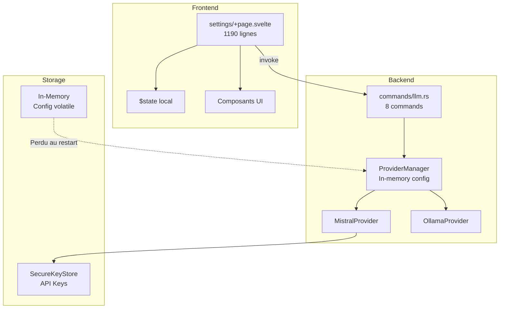
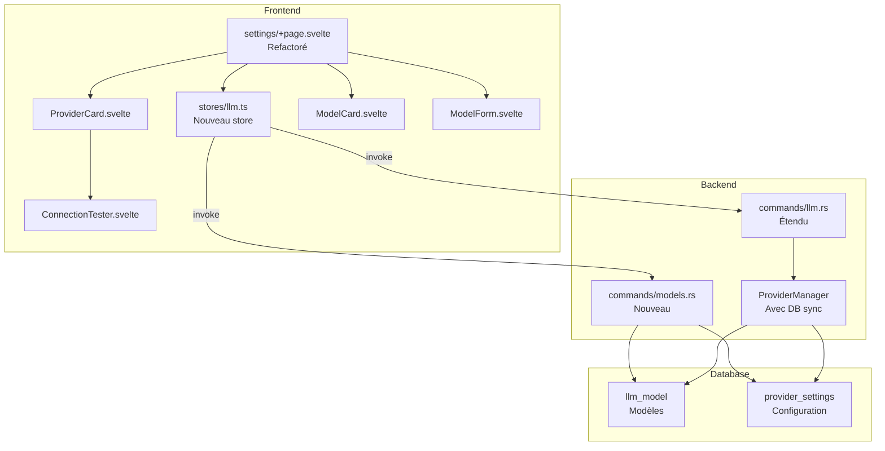
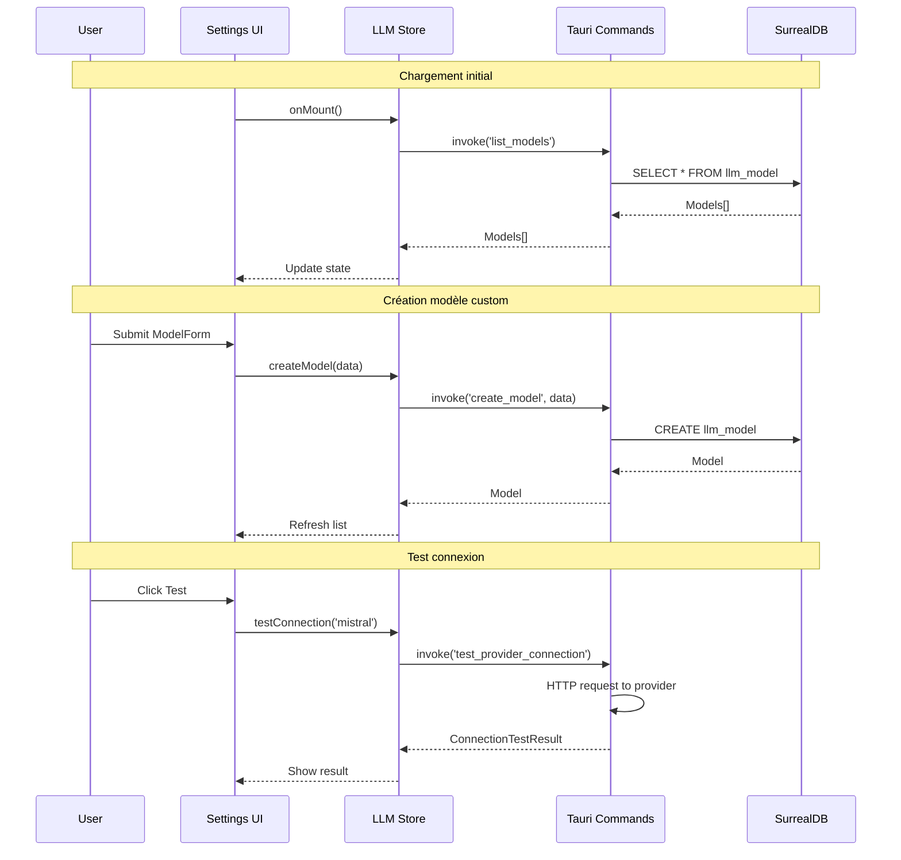

# Spécification - Refactoring Settings Providers/Models avec CRUD

## Métadonnées
- **Date**: 2025-11-25
- **Stack**: Svelte 5.43 + Rust 1.91 + Tauri 2.9 + SurrealDB 2.3
- **Complexité**: Complex
- **Providers concernés**: Mistral + Ollama (Phase 1)

## Contexte

### Demande
Refactorer la section Settings pour les providers et modèles LLM avec:
- CRUD pour modèles personnalisés
- Test de connexion pour chaque provider
- Persistance de la configuration

### Objectif
Permettre aux utilisateurs de:
1. Visualiser et configurer les providers LLM (Mistral/Ollama)
2. Gérer une liste de modèles (builtin + custom)
3. Créer, modifier, supprimer des modèles personnalisés
4. Tester la connexion à chaque provider
5. Sélectionner le modèle par défaut par provider

### Périmètre
**Inclus**:
- CRUD complet pour modèles custom
- Test connexion Mistral + Ollama
- Persistance DB des modèles et configuration
- Store LLM centralisé
- Composants UI réutilisables

**Exclus**:
- Providers futurs (Claude, GPT, Gemini)
- OAuth/authentification avancée
- Import/export de configuration
- Pricing/billing tracking

### Critères de Succès
- [ ] Modèles custom persistés en DB après redémarrage
- [ ] Test connexion fonctionnel pour Mistral et Ollama
- [ ] UI responsive avec feedback utilisateur
- [ ] Validation des inputs (frontend + backend)
- [ ] Types synchronisés TypeScript/Rust
- [ ] Tests unitaires backend (>70% coverage)

---

## État Actuel

### Architecture Existante



### Fichiers Clés Actuels

| Fichier | Rôle | Lignes |
|---------|------|--------|
| `src/routes/settings/+page.svelte` | Page settings monolithique | 1190 |
| `src/types/llm.ts` | Types LLM TypeScript | 95 |
| `src-tauri/src/commands/llm.rs` | Commands Tauri LLM | 275 |
| `src-tauri/src/llm/manager.rs` | ProviderManager | 450 |
| `src-tauri/src/llm/provider.rs` | Trait LLMProvider | 232 |

### Patterns Identifiés

**Pattern MCP Store** (référence):
- Pure functions pour state updates
- Async actions séparées pour Tauri IPC
- Selectors pour données dérivées

**Pattern Provider Card**:
- Card avec header (icon, nom, badge status)
- Body avec configuration
- Footer avec actions

**Pattern Formulaire Validation**:
- State `errors` pour messages d'erreur
- Validation synchrone avant submit
- Feedback toast success/error

### Limitations Actuelles

1. **Configuration volatile**: ProviderManager state perdu au restart
2. **Modèles hardcodés**: MISTRAL_MODELS et OLLAMA_MODELS sont des constantes
3. **Pas de store LLM**: State local au composant settings
4. **Test connexion partiel**: Seulement `test_ollama_connection` existe
5. **Pas de CRUD modèles**: Impossible d'ajouter/modifier des modèles

---

## Architecture Proposée

### Diagramme Global



### Flux de Données



---

## Spécification Types

### TypeScript (`src/types/llm.ts`)

```typescript
// === Types existants (garder) ===
export type ProviderType = 'mistral' | 'ollama';

export interface LLMResponse { /* ... existant ... */ }
export interface ProviderStatus { /* ... existant ... */ }
export interface LLMConfigResponse { /* ... existant ... */ }

// === Nouveaux types ===

/**
 * Modèle LLM (builtin ou custom)
 */
export interface LLMModel {
  id: string;
  provider: ProviderType;
  name: string;
  api_name: string;
  context_window: number;
  max_output_tokens: number;
  temperature_default: number;
  is_builtin: boolean;
  created_at: string;
  updated_at: string;
}

/**
 * Données pour création de modèle
 */
export interface CreateModelRequest {
  provider: ProviderType;
  name: string;
  api_name: string;
  context_window: number;
  max_output_tokens: number;
  temperature_default?: number;
}

/**
 * Données pour mise à jour de modèle
 */
export interface UpdateModelRequest {
  name?: string;
  api_name?: string;
  context_window?: number;
  max_output_tokens?: number;
  temperature_default?: number;
}

/**
 * Configuration d'un provider
 */
export interface ProviderSettings {
  provider: ProviderType;
  enabled: boolean;
  default_model_id: string | null;
  api_key_configured: boolean;
  base_url: string | null;
  updated_at: string;
}

/**
 * Résultat de test de connexion
 */
export interface ConnectionTestResult {
  provider: ProviderType;
  success: boolean;
  latency_ms: number | null;
  error_message: string | null;
  model_tested: string | null;
}

/**
 * État du store LLM
 */
export interface LLMState {
  providers: {
    mistral: ProviderSettings | null;
    ollama: ProviderSettings | null;
  };
  models: LLMModel[];
  activeProvider: ProviderType | null;
  loading: boolean;
  error: string | null;
  testingProvider: ProviderType | null;
}
```

### Rust (`src-tauri/src/models/llm_models.rs`)

```rust
use chrono::{DateTime, Utc};
use serde::{Deserialize, Serialize};

/// Type de provider LLM
#[derive(Debug, Clone, Copy, PartialEq, Eq, Serialize, Deserialize)]
#[serde(rename_all = "snake_case")]
pub enum ProviderType {
    Mistral,
    Ollama,
}

/// Modèle LLM (builtin ou custom)
#[derive(Debug, Clone, Serialize, Deserialize)]
pub struct LLMModel {
    pub id: String,
    pub provider: ProviderType,
    pub name: String,
    pub api_name: String,
    pub context_window: usize,
    pub max_output_tokens: usize,
    pub temperature_default: f32,
    pub is_builtin: bool,
    pub created_at: DateTime<Utc>,
    pub updated_at: DateTime<Utc>,
}

/// Requête de création de modèle
#[derive(Debug, Clone, Deserialize)]
pub struct CreateModelRequest {
    pub provider: ProviderType,
    pub name: String,
    pub api_name: String,
    pub context_window: usize,
    pub max_output_tokens: usize,
    #[serde(default = "default_temperature")]
    pub temperature_default: f32,
}

fn default_temperature() -> f32 {
    0.7
}

/// Requête de mise à jour de modèle
#[derive(Debug, Clone, Deserialize)]
pub struct UpdateModelRequest {
    pub name: Option<String>,
    pub api_name: Option<String>,
    pub context_window: Option<usize>,
    pub max_output_tokens: Option<usize>,
    pub temperature_default: Option<f32>,
}

/// Configuration d'un provider
#[derive(Debug, Clone, Serialize, Deserialize)]
pub struct ProviderSettings {
    pub provider: ProviderType,
    pub enabled: bool,
    pub default_model_id: Option<String>,
    pub api_key_configured: bool,
    #[serde(skip_serializing_if = "Option::is_none")]
    pub base_url: Option<String>,
    pub updated_at: DateTime<Utc>,
}

/// Résultat de test de connexion
#[derive(Debug, Clone, Serialize)]
pub struct ConnectionTestResult {
    pub provider: ProviderType,
    pub success: bool,
    pub latency_ms: Option<u64>,
    pub error_message: Option<String>,
    pub model_tested: Option<String>,
}
```

---

## Spécification Database

### Schema SurrealDB

```sql
-- =============================================
-- Table: llm_model
-- Stocke les modèles LLM (builtin + custom)
-- =============================================
DEFINE TABLE llm_model SCHEMAFULL;

DEFINE FIELD id ON llm_model TYPE string;
DEFINE FIELD provider ON llm_model TYPE string
    ASSERT $value IN ['mistral', 'ollama'];
DEFINE FIELD name ON llm_model TYPE string
    ASSERT string::len($value) > 0 AND string::len($value) <= 64;
DEFINE FIELD api_name ON llm_model TYPE string
    ASSERT string::len($value) > 0 AND string::len($value) <= 128;
DEFINE FIELD context_window ON llm_model TYPE int
    ASSERT $value >= 1024 AND $value <= 2000000;
DEFINE FIELD max_output_tokens ON llm_model TYPE int
    ASSERT $value >= 256 AND $value <= 128000;
DEFINE FIELD temperature_default ON llm_model TYPE float
    ASSERT $value >= 0.0 AND $value <= 2.0
    DEFAULT 0.7;
DEFINE FIELD is_builtin ON llm_model TYPE bool DEFAULT false;
DEFINE FIELD created_at ON llm_model TYPE datetime DEFAULT time::now();
DEFINE FIELD updated_at ON llm_model TYPE datetime DEFAULT time::now();

DEFINE INDEX unique_model_id ON llm_model FIELDS id UNIQUE;
DEFINE INDEX model_provider_idx ON llm_model FIELDS provider;
DEFINE INDEX model_api_name_idx ON llm_model FIELDS provider, api_name UNIQUE;

-- =============================================
-- Table: provider_settings
-- Configuration par provider
-- =============================================
DEFINE TABLE provider_settings SCHEMAFULL;

DEFINE FIELD provider ON provider_settings TYPE string
    ASSERT $value IN ['mistral', 'ollama'];
DEFINE FIELD enabled ON provider_settings TYPE bool DEFAULT true;
DEFINE FIELD default_model_id ON provider_settings TYPE option<string>;
DEFINE FIELD base_url ON provider_settings TYPE option<string>;
DEFINE FIELD updated_at ON provider_settings TYPE datetime DEFAULT time::now();

DEFINE INDEX unique_provider ON provider_settings FIELDS provider UNIQUE;
```

### Seed Data (Modèles Builtin)

```rust
// Mistral models (7)
const MISTRAL_BUILTIN_MODELS: &[(&str, &str, usize, usize)] = &[
    ("mistral-large-latest", "Mistral Large", 128_000, 8192),
    ("mistral-medium-latest", "Mistral Medium", 32_000, 8192),
    ("mistral-small-latest", "Mistral Small", 32_000, 8192),
    ("open-mistral-7b", "Open Mistral 7B", 32_000, 4096),
    ("open-mixtral-8x7b", "Open Mixtral 8x7B", 32_000, 4096),
    ("open-mixtral-8x22b", "Open Mixtral 8x22B", 64_000, 4096),
    ("codestral-latest", "Codestral", 256_000, 8192),
];

// Ollama models (9)
const OLLAMA_BUILTIN_MODELS: &[(&str, &str, usize, usize)] = &[
    ("llama3.2", "Llama 3.2", 128_000, 4096),
    ("llama3.1", "Llama 3.1", 128_000, 4096),
    ("llama3", "Llama 3", 8_000, 4096),
    ("mistral", "Mistral (Ollama)", 32_000, 4096),
    ("mixtral", "Mixtral (Ollama)", 32_000, 4096),
    ("codellama", "Code Llama", 16_000, 4096),
    ("phi3", "Phi-3", 4_000, 2048),
    ("gemma2", "Gemma 2", 8_000, 4096),
    ("qwen2.5", "Qwen 2.5", 32_000, 4096),
];
```

---

## Spécification Backend Commands

### Fichier: `src-tauri/src/commands/models.rs` (Nouveau)

```rust
// === CRUD Models ===

#[tauri::command]
pub async fn list_models(
    provider: Option<String>,
    state: State<'_, AppState>
) -> Result<Vec<LLMModel>, String>;

#[tauri::command]
pub async fn get_model(
    id: String,
    state: State<'_, AppState>
) -> Result<LLMModel, String>;

#[tauri::command]
pub async fn create_model(
    data: CreateModelRequest,
    state: State<'_, AppState>
) -> Result<LLMModel, String>;

#[tauri::command]
pub async fn update_model(
    id: String,
    data: UpdateModelRequest,
    state: State<'_, AppState>
) -> Result<LLMModel, String>;

#[tauri::command]
pub async fn delete_model(
    id: String,
    state: State<'_, AppState>
) -> Result<bool, String>;

// === Provider Settings ===

#[tauri::command]
pub async fn get_provider_settings(
    provider: String,
    state: State<'_, AppState>
) -> Result<ProviderSettings, String>;

#[tauri::command]
pub async fn update_provider_settings(
    provider: String,
    enabled: Option<bool>,
    default_model_id: Option<String>,
    base_url: Option<String>,
    state: State<'_, AppState>
) -> Result<ProviderSettings, String>;

// === Connection Test ===

#[tauri::command]
pub async fn test_provider_connection(
    provider: String,
    state: State<'_, AppState>
) -> Result<ConnectionTestResult, String>;

// === Seed ===

#[tauri::command]
pub async fn seed_builtin_models(
    state: State<'_, AppState>
) -> Result<usize, String>;
```

### Règles de Validation

| Command | Règle |
|---------|-------|
| `create_model` | name: 1-64 chars, api_name: unique per provider |
| `update_model` | Si is_builtin=true, seulement temperature_default modifiable |
| `delete_model` | Refuse si is_builtin=true |
| `test_provider_connection` | Timeout 10s, retry 0 |

### Extension: `src-tauri/src/commands/llm.rs`

```rust
// Ajouter test connexion Mistral
#[tauri::command]
pub async fn test_mistral_connection(
    state: State<'_, AppState>
) -> Result<bool, String> {
    // Simple completion test avec prompt minimal
    // Timeout 10s
}
```

---

## Spécification Frontend

### Store: `src/lib/stores/llm.ts` (Nouveau)

```typescript
import { invoke } from '@tauri-apps/api/core';
import type {
  LLMState,
  LLMModel,
  CreateModelRequest,
  UpdateModelRequest,
  ProviderSettings,
  ConnectionTestResult,
  ProviderType
} from '$types/llm';

// === Initial State ===
export function createInitialLLMState(): LLMState {
  return {
    providers: { mistral: null, ollama: null },
    models: [],
    activeProvider: null,
    loading: false,
    error: null,
    testingProvider: null
  };
}

// === Pure State Updaters ===
export function setLLMLoading(state: LLMState, loading: boolean): LLMState;
export function setLLMError(state: LLMState, error: string | null): LLMState;
export function setModels(state: LLMState, models: LLMModel[]): LLMState;
export function addModel(state: LLMState, model: LLMModel): LLMState;
export function updateModelInState(state: LLMState, id: string, model: LLMModel): LLMState;
export function removeModel(state: LLMState, id: string): LLMState;
export function setProviderSettings(state: LLMState, provider: ProviderType, settings: ProviderSettings): LLMState;
export function setTestingProvider(state: LLMState, provider: ProviderType | null): LLMState;

// === Selectors ===
export function getModelsByProvider(state: LLMState, provider: ProviderType): LLMModel[];
export function getBuiltinModels(state: LLMState): LLMModel[];
export function getCustomModels(state: LLMState): LLMModel[];
export function getModelById(state: LLMState, id: string): LLMModel | undefined;

// === Async Actions (Tauri IPC) ===
export async function loadModels(provider?: ProviderType): Promise<LLMModel[]>;
export async function createModel(data: CreateModelRequest): Promise<LLMModel>;
export async function updateModel(id: string, data: UpdateModelRequest): Promise<LLMModel>;
export async function deleteModel(id: string): Promise<boolean>;
export async function loadProviderSettings(provider: ProviderType): Promise<ProviderSettings>;
export async function updateProviderSettings(/* ... */): Promise<ProviderSettings>;
export async function testConnection(provider: ProviderType): Promise<ConnectionTestResult>;
```

### Composant: `ProviderCard.svelte`

```svelte
<script lang="ts">
  import { Card, Badge, Button, StatusIndicator } from '$lib/components/ui';
  import ConnectionTester from './ConnectionTester.svelte';
  import type { ProviderSettings, ProviderType } from '$types/llm';
  import type { Snippet, Component } from 'svelte';

  interface Props {
    provider: ProviderType;
    settings: ProviderSettings | null;
    isActive: boolean;
    hasApiKey: boolean;
    icon: Component;
    onSelect: () => void;
    onConfigure: () => void;
  }

  let { provider, settings, isActive, hasApiKey, icon: Icon, onSelect, onConfigure }: Props = $props();
</script>

<Card>
  {#snippet header()}
    <div class="provider-header">
      <div class="provider-info">
        <Icon size={24} />
        <div>
          <h3 class="provider-name">{provider}</h3>
          <p class="provider-type">
            {provider === 'mistral' ? 'Cloud API' : 'Local Server'}
          </p>
        </div>
      </div>
      <Badge variant={isActive ? 'success' : settings?.enabled ? 'primary' : 'warning'}>
        {isActive ? 'Active' : settings?.enabled ? 'Available' : 'Disabled'}
      </Badge>
    </div>
  {/snippet}

  {#snippet body()}
    <div class="provider-details">
      {#if hasApiKey || provider === 'ollama'}
        <div class="status-row">
          <StatusIndicator status="completed" size="sm" />
          <span>{provider === 'mistral' ? 'API Key Configured' : 'Server Available'}</span>
        </div>
      {:else}
        <div class="status-row">
          <StatusIndicator status="error" size="sm" />
          <span>Not Configured</span>
        </div>
      {/if}

      {#if settings?.default_model_id}
        <div class="info-row">
          <span class="label">Default Model:</span>
          <span class="value">{settings.default_model_id}</span>
        </div>
      {/if}

      <ConnectionTester {provider} />
    </div>
  {/snippet}

  {#snippet footer()}
    <div class="provider-actions">
      <Button variant="ghost" size="sm" onclick={onConfigure}>
        Configure
      </Button>
      <Button
        variant={isActive ? 'ghost' : 'primary'}
        size="sm"
        onclick={onSelect}
        disabled={!settings?.enabled}
      >
        {isActive ? 'Selected' : 'Select'}
      </Button>
    </div>
  {/snippet}
</Card>
```

### Composant: `ModelCard.svelte`

```svelte
<script lang="ts">
  import { Card, Badge, Button } from '$lib/components/ui';
  import type { LLMModel } from '$types/llm';

  interface Props {
    model: LLMModel;
    isDefault: boolean;
    onEdit?: () => void;
    onDelete?: () => void;
    onSetDefault?: () => void;
  }

  let { model, isDefault, onEdit, onDelete, onSetDefault }: Props = $props();
</script>

<Card>
  {#snippet header()}
    <div class="model-header">
      <div class="model-info">
        <h4 class="model-name">{model.name}</h4>
        <code class="model-api-name">{model.api_name}</code>
      </div>
      <div class="model-badges">
        {#if model.is_builtin}
          <Badge variant="primary">Builtin</Badge>
        {:else}
          <Badge variant="success">Custom</Badge>
        {/if}
        {#if isDefault}
          <Badge variant="warning">Default</Badge>
        {/if}
      </div>
    </div>
  {/snippet}

  {#snippet body()}
    <div class="model-specs">
      <div class="spec-item">
        <span class="spec-label">Context Window</span>
        <span class="spec-value">{model.context_window.toLocaleString()} tokens</span>
      </div>
      <div class="spec-item">
        <span class="spec-label">Max Output</span>
        <span class="spec-value">{model.max_output_tokens.toLocaleString()} tokens</span>
      </div>
      <div class="spec-item">
        <span class="spec-label">Temperature</span>
        <span class="spec-value">{model.temperature_default}</span>
      </div>
    </div>
  {/snippet}

  {#snippet footer()}
    <div class="model-actions">
      {#if !isDefault}
        <Button variant="ghost" size="sm" onclick={onSetDefault}>
          Set Default
        </Button>
      {/if}
      {#if !model.is_builtin}
        <Button variant="ghost" size="sm" onclick={onEdit}>
          Edit
        </Button>
        <Button variant="danger" size="sm" onclick={onDelete}>
          Delete
        </Button>
      {/if}
    </div>
  {/snippet}
</Card>
```

### Composant: `ModelForm.svelte`

```svelte
<script lang="ts">
  import { Input, Select, Button } from '$lib/components/ui';
  import type { CreateModelRequest, UpdateModelRequest, LLMModel, ProviderType } from '$types/llm';

  interface Props {
    mode: 'create' | 'edit';
    model?: LLMModel;
    provider?: ProviderType;
    onsubmit: (data: CreateModelRequest | UpdateModelRequest) => void;
    oncancel: () => void;
    saving?: boolean;
  }

  let { mode, model, provider, onsubmit, oncancel, saving = false }: Props = $props();

  let formData = $state({
    provider: model?.provider ?? provider ?? 'mistral',
    name: model?.name ?? '',
    api_name: model?.api_name ?? '',
    context_window: model?.context_window ?? 32000,
    max_output_tokens: model?.max_output_tokens ?? 4096,
    temperature_default: model?.temperature_default ?? 0.7
  });

  let errors = $state<Record<string, string>>({});

  function validate(): boolean {
    const newErrors: Record<string, string> = {};

    if (!formData.name.trim()) {
      newErrors.name = 'Name is required';
    } else if (formData.name.length > 64) {
      newErrors.name = 'Name must be 64 characters or less';
    }

    if (!formData.api_name.trim()) {
      newErrors.api_name = 'API name is required';
    }

    if (formData.context_window < 1024) {
      newErrors.context_window = 'Minimum 1024 tokens';
    }

    if (formData.max_output_tokens < 256) {
      newErrors.max_output_tokens = 'Minimum 256 tokens';
    }

    if (formData.temperature_default < 0 || formData.temperature_default > 2) {
      newErrors.temperature_default = 'Must be between 0 and 2';
    }

    errors = newErrors;
    return Object.keys(newErrors).length === 0;
  }

  function handleSubmit(): void {
    if (!validate()) return;
    onsubmit(formData);
  }
</script>

<form class="model-form" onsubmit|preventDefault={handleSubmit}>
  {#if mode === 'create'}
    <Select
      label="Provider"
      options={[
        { value: 'mistral', label: 'Mistral' },
        { value: 'ollama', label: 'Ollama' }
      ]}
      value={formData.provider}
      onchange={(e) => formData.provider = e.currentTarget.value as ProviderType}
    />
  {/if}

  <Input
    label="Display Name"
    bind:value={formData.name}
    help="Human-readable name for the model"
    required
  />
  {#if errors.name}<span class="error-text">{errors.name}</span>{/if}

  <Input
    label="API Name"
    bind:value={formData.api_name}
    help="Model identifier used in API calls"
    required
  />
  {#if errors.api_name}<span class="error-text">{errors.api_name}</span>{/if}

  <Input
    label="Context Window"
    type="number"
    bind:value={formData.context_window}
    help="Maximum context length in tokens"
  />

  <Input
    label="Max Output Tokens"
    type="number"
    bind:value={formData.max_output_tokens}
    help="Maximum generation length"
  />

  <Input
    label="Default Temperature"
    type="number"
    step="0.1"
    min="0"
    max="2"
    bind:value={formData.temperature_default}
    help="Default sampling temperature (0-2)"
  />

  <div class="form-actions">
    <Button variant="ghost" onclick={oncancel} disabled={saving}>
      Cancel
    </Button>
    <Button variant="primary" type="submit" disabled={saving}>
      {saving ? 'Saving...' : mode === 'create' ? 'Create Model' : 'Save Changes'}
    </Button>
  </div>
</form>
```

### Composant: `ConnectionTester.svelte`

```svelte
<script lang="ts">
  import { Button, Spinner, StatusIndicator } from '$lib/components/ui';
  import { testConnection } from '$lib/stores/llm';
  import type { ProviderType, ConnectionTestResult } from '$types/llm';

  interface Props {
    provider: ProviderType;
  }

  let { provider }: Props = $props();

  let testing = $state(false);
  let result = $state<ConnectionTestResult | null>(null);

  async function handleTest(): Promise<void> {
    testing = true;
    result = null;

    try {
      result = await testConnection(provider);
    } catch (err) {
      result = {
        provider,
        success: false,
        latency_ms: null,
        error_message: String(err),
        model_tested: null
      };
    } finally {
      testing = false;
    }
  }
</script>

<div class="connection-tester">
  <Button variant="ghost" size="sm" onclick={handleTest} disabled={testing}>
    {#if testing}
      <Spinner size="sm" />
      <span>Testing...</span>
    {:else}
      Test Connection
    {/if}
  </Button>

  {#if result}
    <div class="test-result" class:success={result.success} class:error={!result.success}>
      <StatusIndicator status={result.success ? 'completed' : 'error'} size="sm" />
      {#if result.success}
        <span>Connected ({result.latency_ms}ms)</span>
      {:else}
        <span>{result.error_message || 'Connection failed'}</span>
      {/if}
    </div>
  {/if}
</div>
```

---

## Plan d'Implémentation

### Phase 1: Types et Schema DB
**Objectif**: Définir les structures de données

**Tâches**:
1. **Backend**: Créer `src-tauri/src/models/llm_models.rs`
   - Structs: LLMModel, CreateModelRequest, UpdateModelRequest, ProviderSettings, ConnectionTestResult
   - Export dans `mod.rs`

2. **Backend**: Étendre `src-tauri/src/db/schema.rs`
   - Ajouter tables `llm_model` et `provider_settings`
   - Indexes et contraintes

3. **Frontend**: Étendre `src/types/llm.ts`
   - Interfaces: LLMModel, CreateModelRequest, UpdateModelRequest, ProviderSettings, ConnectionTestResult, LLMState

**Dépendances**: Aucune
**Validation**:
- [ ] `cargo check` passe
- [ ] `npm run check` passe
- [ ] Types synchronisés TS/Rust

---

### Phase 2: Commands CRUD Backend
**Objectif**: Implémenter les opérations CRUD

**Tâches**:
1. **Backend**: Créer `src-tauri/src/commands/models.rs`
   - list_models, get_model, create_model, update_model, delete_model
   - get_provider_settings, update_provider_settings
   - test_provider_connection, seed_builtin_models

2. **Backend**: Étendre `src-tauri/src/commands/llm.rs`
   - test_mistral_connection

3. **Backend**: Enregistrer dans `main.rs`
   - Ajouter commands dans `generate_handler![]`

4. **Backend**: Créer seed function
   - Appel au démarrage si table vide
   - Insert 16 modèles builtin

**Dépendances**: Phase 1
**Validation**:
- [ ] `cargo test` passe
- [ ] Commands testables via console Tauri
- [ ] Seed crée les modèles builtin

---

### Phase 3: Store LLM Frontend
**Objectif**: Centraliser la gestion d'état LLM

**Tâches**:
1. **Frontend**: Créer `src/lib/stores/llm.ts`
   - State management (pattern MCP)
   - Pure functions pour updates
   - Async actions (Tauri IPC)
   - Selectors

2. **Frontend**: Exporter depuis `src/lib/stores/index.ts`

**Dépendances**: Phase 2
**Validation**:
- [ ] Store compile sans erreur
- [ ] Actions appellent commands correctement
- [ ] State updates réactifs

---

### Phase 4: Composants UI
**Objectif**: Créer les composants réutilisables

**Tâches**:
1. **Frontend**: Créer `src/lib/components/llm/ProviderCard.svelte`
2. **Frontend**: Créer `src/lib/components/llm/ModelCard.svelte`
3. **Frontend**: Créer `src/lib/components/llm/ModelForm.svelte`
4. **Frontend**: Créer `src/lib/components/llm/ConnectionTester.svelte`
5. **Frontend**: Créer `src/lib/components/llm/index.ts` (barrel export)

**Dépendances**: Phase 3
**Validation**:
- [ ] Composants compilent sans erreur
- [ ] Props typées correctement
- [ ] Styling cohérent avec design system

---

### Phase 5: Intégration Settings Page
**Objectif**: Refactorer la page settings

**Tâches**:
1. **Frontend**: Refactorer section Providers dans `settings/+page.svelte`
   - Utiliser ProviderCard
   - Utiliser ConnectionTester
   - Remplacer state local par store LLM

2. **Frontend**: Refactorer section Models
   - Afficher ModelCard pour chaque modèle
   - Ajouter bouton "Add Custom Model"
   - Modal avec ModelForm

3. **Frontend**: Lifecycle management
   - onMount: charger modèles et settings
   - Gérer loading/error states

**Dépendances**: Phase 4
**Validation**:
- [ ] Providers affichés avec status correct
- [ ] Test connexion fonctionnel
- [ ] CRUD models via UI
- [ ] Persistance après refresh

---

### Phase 6: Tests et Documentation
**Objectif**: Assurer qualité et maintenabilité

**Tâches**:
1. **Backend**: Tests unitaires pour commands
   - `cargo test` avec coverage
   - Tests validation inputs
   - Tests CRUD operations

2. **Frontend**: Tests composants
   - Vitest pour store
   - Testing-library pour composants

3. **Documentation**: Mettre à jour API_REFERENCE.md
   - Documenter nouvelles commands
   - Exemples d'utilisation

**Dépendances**: Phase 5
**Validation**:
- [ ] Coverage backend >70%
- [ ] Tests frontend passent
- [ ] Documentation à jour

---

## Estimation

| Phase | Frontend | Backend | Database | Tests | Total |
|-------|----------|---------|----------|-------|-------|
| 1. Types/Schema | 1h | 2h | 1h | - | 4h |
| 2. Commands CRUD | - | 4h | - | 1h | 5h |
| 3. Store LLM | 2h | - | - | 0.5h | 2.5h |
| 4. Composants UI | 4h | - | - | 1h | 5h |
| 5. Intégration | 3h | - | - | - | 3h |
| 6. Tests/Docs | 1h | 2h | - | 2h | 5h |
| **Total** | **11h** | **8h** | **1h** | **4.5h** | **24.5h** |

**Facteurs**:
- Réutilisation patterns existants: -15%
- Composants UI existants: -10%
- Complexité validation: +10%
- **Estimation ajustée**: ~22h

---

## Analyse Risques

| Risque | Probabilité | Impact | Mitigation | Plan B |
|--------|-------------|--------|------------|--------|
| Serialization SurrealDB 2.x | Moyenne | Moyen | Utiliser pattern query existant | Raw queries avec bind |
| Test connexion Mistral timeout | Moyenne | Faible | Timeout 10s + retry UI | Message d'erreur clair |
| Migration données existantes | Faible | Moyen | Seed automatique au démarrage | Script migration manuel |
| Performance liste modèles | Faible | Faible | Index DB sur provider | Pagination si nécessaire |
| Synchronisation state | Faible | Moyen | Store centralisé | Refresh explicite |

---

## Tests

### Backend (Rust)

```rust
#[cfg(test)]
mod tests {
    use super::*;

    #[tokio::test]
    async fn test_create_custom_model() {
        // Setup
        let state = create_test_state().await;

        // Create
        let data = CreateModelRequest {
            provider: ProviderType::Ollama,
            name: "Custom Model".into(),
            api_name: "custom-model".into(),
            context_window: 8000,
            max_output_tokens: 2048,
            temperature_default: 0.7,
        };

        let result = create_model(data, state.clone()).await;
        assert!(result.is_ok());

        let model = result.unwrap();
        assert_eq!(model.name, "Custom Model");
        assert!(!model.is_builtin);
    }

    #[tokio::test]
    async fn test_delete_builtin_model_fails() {
        let state = create_test_state().await;
        seed_builtin_models(state.clone()).await.unwrap();

        // Try to delete builtin
        let result = delete_model("mistral-large-latest".into(), state).await;
        assert!(result.is_err());
        assert!(result.unwrap_err().contains("builtin"));
    }

    #[tokio::test]
    async fn test_connection_ollama() {
        let state = create_test_state().await;

        let result = test_provider_connection("ollama".into(), state).await;
        assert!(result.is_ok());

        let test = result.unwrap();
        // May fail if Ollama not running, that's OK
        if test.success {
            assert!(test.latency_ms.is_some());
        }
    }
}
```

### Frontend (Vitest)

```typescript
import { describe, it, expect, vi } from 'vitest';
import { createInitialLLMState, setModels, getModelsByProvider } from '$lib/stores/llm';

describe('LLM Store', () => {
  it('should create initial state', () => {
    const state = createInitialLLMState();
    expect(state.models).toEqual([]);
    expect(state.loading).toBe(false);
  });

  it('should filter models by provider', () => {
    const state = createInitialLLMState();
    const models = [
      { id: '1', provider: 'mistral', name: 'M1' },
      { id: '2', provider: 'ollama', name: 'O1' },
      { id: '3', provider: 'mistral', name: 'M2' },
    ] as LLMModel[];

    const updated = setModels(state, models);
    const mistralModels = getModelsByProvider(updated, 'mistral');

    expect(mistralModels).toHaveLength(2);
    expect(mistralModels.map(m => m.name)).toEqual(['M1', 'M2']);
  });
});
```

---

## Considérations

### Performance
- Index DB sur `provider` pour filtrage rapide
- Store centralisé évite re-fetch inutiles
- Lazy loading des modèles par provider si liste longue

### Sécurité
- API keys jamais exposées (seulement `api_key_configured: bool`)
- Validation inputs backend (Validator trait)
- Contraintes DB sur valeurs (context_window min/max)

### Tauri Spécifique
- Commands enregistrées dans `generate_handler![]`
- State partagé via `State<'_, AppState>`
- Sérialisation serde JSON pour IPC

### Accessibilité
- Labels sur tous les inputs
- Focus management dans Modal
- Keyboard navigation (Tab, Escape)

---

## Dépendances

### Frontend (package.json)
Aucune nouvelle dépendance requise.

### Backend (Cargo.toml)
Aucune nouvelle dépendance requise.
- `chrono` déjà présent pour DateTime
- `serde` déjà présent pour serialization
- `uuid` déjà présent pour ID génération

---

## Prochaines Étapes

### Validation
- [ ] Architecture approuvée
- [ ] Types validés
- [ ] Risques acceptés

### Implémentation
1. Commencer Phase 1 (Types et Schema)
2. Checkpoint validation après Phase 2
3. Tests continus

### Questions Ouvertes
1. Faut-il supporter l'import/export de configuration?
2. Limite sur le nombre de modèles custom par provider?
3. Notification toast ou inline pour feedback CRUD?

---

## Références

- **Architecture**: `docs/TECH_STACK.md`
- **Patterns MCP Store**: `src/lib/stores/mcp.ts`
- **Types existants**: `src/types/llm.ts`
- **Commands existantes**: `src-tauri/src/commands/llm.rs`
- **Provider Implementation**: `src-tauri/src/llm/`
- **Design System**: `docs/DESIGN_SYSTEM.md`
