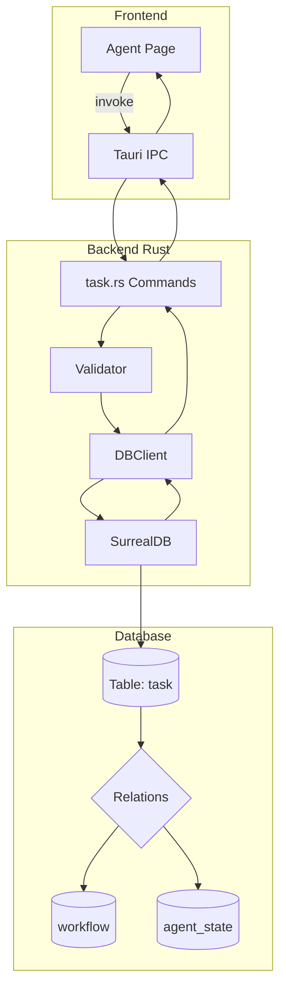
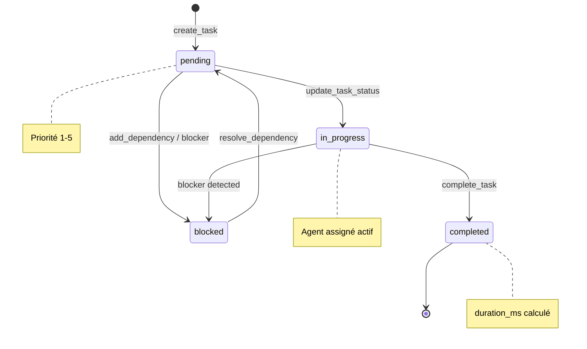
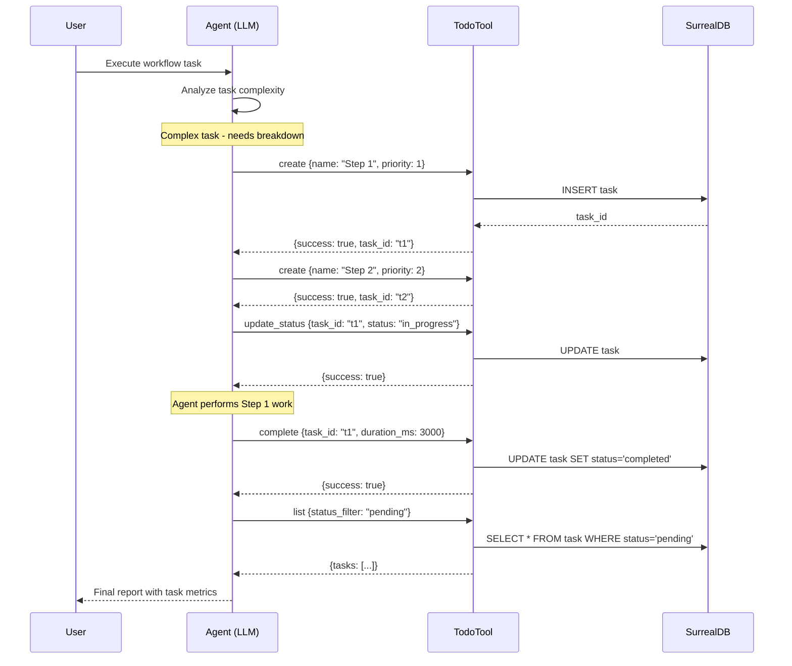

# Spécification - Todo Tool pour Agents

## Métadonnées
- **Date**: 2025-11-25
- **Stack**: Svelte 5.43 + Rust 1.91 + Tauri 2.9 + SurrealDB 2.3
- **Complexité**: Medium
- **Template de référence**: `validation.rs` (6 commandes CRUD testées)

---

## Contexte

### Demande
Lire attentivement `docs/AGENT_TOOLS_DOCUMENTATION.md` et planifier l'ajout de la fonction Todo et ses tools pour le système multi-agent.

### Objectif
Implémenter un système de gestion de tâches (Todo Tool) permettant aux agents de:
- Créer des tâches structurées avec priorité et dépendances
- Mettre à jour le statut en temps réel
- Réorganiser dynamiquement les priorités
- Tracer la progression des workflows complexes
- Coordonner l'exécution entre agents

### Périmètre

**Inclus:**
- Backend: Modèle Rust + 8 commandes Tauri CRUD
- Types: Synchronisation TypeScript/Rust
- Database: Extension du schema SurrealDB existant
- Tests: Unit tests Rust + tests de sérialisation
- Documentation: API Reference update

**Exclus (Phase future):**
- Frontend UI (composants Svelte)
- Intégration streaming temps réel
- Détection automatique des dépendances circulaires
- Assignation intelligente basée sur workload agent

### Critères de Succès
- [ ] Schema `task` étendu avec `name`, `priority`, `agent_assigned`
- [ ] 8 commandes Tauri fonctionnelles et enregistrées
- [ ] Types TypeScript synchronisés avec Rust
- [ ] **TodoTool** implémenté avec trait `Tool` et descriptions LLM
- [ ] Intégration avec AgentConfig (`tools: ["TodoTool"]`)
- [ ] Tests unitaires passants (~70% coverage backend)
- [ ] Documentation API mise à jour

---

## État Actuel

### Schema SurrealDB Existant (`src-tauri/src/db/schema.rs:59-67`)

```sql
-- Table: task (décomposition workflows)
DEFINE TABLE task SCHEMAFULL;
DEFINE FIELD id ON task TYPE string;
DEFINE FIELD workflow_id ON task TYPE string;
DEFINE FIELD description ON task TYPE string;
DEFINE FIELD status ON task TYPE string DEFAULT 'pending'
    ASSERT $value IN ['pending', 'in_progress', 'completed', 'blocked'];
DEFINE FIELD dependencies ON task TYPE array<string>;
DEFINE FIELD created_at ON task TYPE datetime DEFAULT time::now();
DEFINE FIELD completed_at ON task TYPE option<datetime>;
```

### Analyse des Écarts

| Champ (Doc) | Schema Actuel | Action |
|-------------|---------------|--------|
| `nom` | ❌ Absent | Ajouter `name` |
| `description` | ✅ Présent | Conserver |
| `agent_assigné` | ❌ Absent | Ajouter `agent_assigned` |
| `priorité` (1-5) | ❌ Absent | Ajouter `priority` |
| `status` | ✅ Présent | Conserver |
| `workflow_id` | ✅ Présent | Conserver |
| `dependencies` | ✅ Présent | Conserver |
| `created_at` | ✅ Présent | Conserver |
| `completed_at` | ✅ Présent | Conserver |
| `duration_ms` | ❌ Absent | Ajouter (métriques) |

### Patterns Identifiés (Templates)

**Backend CRUD** (`src-tauri/src/commands/validation.rs`):
- Pattern `#[tauri::command]` + `#[instrument]` + `State<'_, AppState>`
- Retour `Result<T, String>` standardisé
- Validation via `Validator::validate_*`
- UUID génération via `uuid::Uuid::new_v4()`

**Modèles Rust** (`src-tauri/src/models/validation.rs`):
- Enums avec `#[serde(rename_all = "snake_case")]`
- Structs avec `#[serde(deserialize_with = "deserialize_thing_id")]`
- Payload création séparé: `{Entity}Create` sans ID/timestamps
- Implémentations `Display` pour conversion string

**Types TypeScript** (`src/types/validation.ts`):
- Type unions pour enums: `'value1' | 'value2'`
- Interfaces avec JSDoc
- Import via alias `$types`

---

## Architecture Proposée

### Diagramme de Flux



### Diagramme des États



---

## Spécification des Composants

### 1. Schema SurrealDB Étendu

**Modifications dans** `src-tauri/src/db/schema.rs`:

```sql
-- Table: task (décomposition workflows) - VERSION ÉTENDUE
DEFINE TABLE task SCHEMAFULL;
DEFINE FIELD id ON task TYPE string;
DEFINE FIELD workflow_id ON task TYPE string;
DEFINE FIELD name ON task TYPE string
    ASSERT string::len($value) > 0 AND string::len($value) <= 128;
DEFINE FIELD description ON task TYPE string
    ASSERT string::len($value) <= 1000;
DEFINE FIELD agent_assigned ON task TYPE option<string>;
DEFINE FIELD priority ON task TYPE int DEFAULT 3
    ASSERT $value >= 1 AND $value <= 5;
DEFINE FIELD status ON task TYPE string DEFAULT 'pending'
    ASSERT $value IN ['pending', 'in_progress', 'completed', 'blocked'];
DEFINE FIELD dependencies ON task TYPE array<string>;
DEFINE FIELD duration_ms ON task TYPE option<int>;
DEFINE FIELD created_at ON task TYPE datetime DEFAULT time::now();
DEFINE FIELD completed_at ON task TYPE option<datetime>;

-- Index pour requêtes fréquentes
DEFINE INDEX task_workflow_idx ON task FIELDS workflow_id;
DEFINE INDEX task_status_idx ON task FIELDS status;
DEFINE INDEX task_priority_idx ON task FIELDS priority;
DEFINE INDEX task_agent_idx ON task FIELDS agent_assigned;
```

### 2. Modèle Rust

**Nouveau fichier**: `src-tauri/src/models/task.rs`

```rust
// Copyright 2025 Zileo-Chat-3 Contributors
// SPDX-License-Identifier: Apache-2.0

use super::serde_utils::deserialize_thing_id;
use chrono::{DateTime, Utc};
use serde::{Deserialize, Serialize};

/// Task status for workflow decomposition
#[derive(Debug, Clone, PartialEq, Eq, Serialize, Deserialize)]
#[serde(rename_all = "snake_case")]
pub enum TaskStatus {
    Pending,
    InProgress,
    Completed,
    Blocked,
}

impl Default for TaskStatus {
    fn default() -> Self {
        Self::Pending
    }
}

impl std::fmt::Display for TaskStatus {
    fn fmt(&self, f: &mut std::fmt::Formatter<'_>) -> std::fmt::Result {
        match self {
            Self::Pending => write!(f, "pending"),
            Self::InProgress => write!(f, "in_progress"),
            Self::Completed => write!(f, "completed"),
            Self::Blocked => write!(f, "blocked"),
        }
    }
}

/// Task priority level (1=critical, 5=low)
pub type TaskPriority = u8;

/// Task entity for workflow decomposition
#[derive(Debug, Clone, Serialize, Deserialize)]
pub struct Task {
    /// Unique identifier (deserialized from SurrealDB Thing type)
    #[serde(deserialize_with = "deserialize_thing_id")]
    pub id: String,
    /// Associated workflow ID
    pub workflow_id: String,
    /// Task name (short identifier)
    pub name: String,
    /// Detailed description
    pub description: String,
    /// Agent responsible for this task (optional)
    #[serde(skip_serializing_if = "Option::is_none")]
    pub agent_assigned: Option<String>,
    /// Priority level (1-5, 1=critical)
    #[serde(default = "default_priority")]
    pub priority: TaskPriority,
    /// Current status
    #[serde(default)]
    pub status: TaskStatus,
    /// Task dependencies (other task IDs)
    #[serde(default)]
    pub dependencies: Vec<String>,
    /// Execution duration in milliseconds (if completed)
    #[serde(skip_serializing_if = "Option::is_none")]
    pub duration_ms: Option<u64>,
    /// Creation timestamp
    #[serde(default = "Utc::now")]
    pub created_at: DateTime<Utc>,
    /// Completion timestamp (if completed)
    #[serde(skip_serializing_if = "Option::is_none")]
    pub completed_at: Option<DateTime<Utc>>,
}

fn default_priority() -> TaskPriority {
    3 // Medium priority
}

/// Task creation payload - only fields needed for creation
/// ID is passed separately to db.create() using table:id format
/// Timestamps are handled by database defaults
#[derive(Debug, Clone, Serialize)]
pub struct TaskCreate {
    pub workflow_id: String,
    pub name: String,
    pub description: String,
    #[serde(skip_serializing_if = "Option::is_none")]
    pub agent_assigned: Option<String>,
    pub priority: TaskPriority,
    pub status: String, // As string for SurrealDB
    #[serde(default)]
    pub dependencies: Vec<String>,
}

impl TaskCreate {
    pub fn new(
        workflow_id: String,
        name: String,
        description: String,
        priority: TaskPriority,
    ) -> Self {
        Self {
            workflow_id,
            name,
            description,
            agent_assigned: None,
            priority,
            status: TaskStatus::Pending.to_string(),
            dependencies: Vec::new(),
        }
    }

    pub fn with_agent(mut self, agent_id: String) -> Self {
        self.agent_assigned = Some(agent_id);
        self
    }

    pub fn with_dependencies(mut self, deps: Vec<String>) -> Self {
        self.dependencies = deps;
        self
    }
}

/// Task update payload (partial fields)
#[derive(Debug, Clone, Default, Serialize)]
pub struct TaskUpdate {
    #[serde(skip_serializing_if = "Option::is_none")]
    pub name: Option<String>,
    #[serde(skip_serializing_if = "Option::is_none")]
    pub description: Option<String>,
    #[serde(skip_serializing_if = "Option::is_none")]
    pub agent_assigned: Option<String>,
    #[serde(skip_serializing_if = "Option::is_none")]
    pub priority: Option<TaskPriority>,
    #[serde(skip_serializing_if = "Option::is_none")]
    pub status: Option<String>,
    #[serde(skip_serializing_if = "Option::is_none")]
    pub dependencies: Option<Vec<String>>,
    #[serde(skip_serializing_if = "Option::is_none")]
    pub duration_ms: Option<u64>,
}

#[cfg(test)]
mod tests {
    use super::*;

    #[test]
    fn test_task_status_serialization() {
        let status = TaskStatus::InProgress;
        let json = serde_json::to_string(&status).unwrap();
        assert_eq!(json, "\"in_progress\"");

        let deserialized: TaskStatus = serde_json::from_str(&json).unwrap();
        assert_eq!(deserialized, TaskStatus::InProgress);
    }

    #[test]
    fn test_task_status_display() {
        assert_eq!(TaskStatus::Pending.to_string(), "pending");
        assert_eq!(TaskStatus::InProgress.to_string(), "in_progress");
        assert_eq!(TaskStatus::Completed.to_string(), "completed");
        assert_eq!(TaskStatus::Blocked.to_string(), "blocked");
    }

    #[test]
    fn test_task_create_builder() {
        let task = TaskCreate::new(
            "wf_001".to_string(),
            "Analyze code".to_string(),
            "Deep analysis of the codebase".to_string(),
            1, // Critical priority
        )
        .with_agent("db_agent".to_string())
        .with_dependencies(vec!["task_001".to_string()]);

        assert_eq!(task.workflow_id, "wf_001");
        assert_eq!(task.priority, 1);
        assert_eq!(task.agent_assigned, Some("db_agent".to_string()));
        assert_eq!(task.dependencies.len(), 1);
        assert_eq!(task.status, "pending");
    }

    #[test]
    fn test_priority_range() {
        // Priority should be 1-5
        let valid_priorities: Vec<TaskPriority> = vec![1, 2, 3, 4, 5];
        for p in valid_priorities {
            let task = TaskCreate::new(
                "wf".to_string(),
                "test".to_string(),
                "desc".to_string(),
                p,
            );
            assert!(task.priority >= 1 && task.priority <= 5);
        }
    }
}
```

### 3. Types TypeScript

**Nouveau fichier**: `src/types/task.ts`

```typescript
/**
 * Task status for workflow decomposition
 */
export type TaskStatus = 'pending' | 'in_progress' | 'completed' | 'blocked';

/**
 * Task priority level (1=critical, 5=low)
 */
export type TaskPriority = 1 | 2 | 3 | 4 | 5;

/**
 * Task entity for workflow decomposition
 */
export interface Task {
  /** Unique identifier */
  id: string;
  /** Associated workflow ID */
  workflow_id: string;
  /** Task name (short identifier) */
  name: string;
  /** Detailed description */
  description: string;
  /** Agent responsible for this task (optional) */
  agent_assigned?: string;
  /** Priority level (1-5, 1=critical) */
  priority: TaskPriority;
  /** Current status */
  status: TaskStatus;
  /** Task dependencies (other task IDs) */
  dependencies: string[];
  /** Execution duration in milliseconds (if completed) */
  duration_ms?: number;
  /** Creation timestamp */
  created_at: Date;
  /** Completion timestamp (if completed) */
  completed_at?: Date;
}

/**
 * Parameters for creating a new task
 */
export interface CreateTaskParams {
  /** Associated workflow ID */
  workflow_id: string;
  /** Task name (short identifier) */
  name: string;
  /** Detailed description */
  description: string;
  /** Agent responsible for this task (optional) */
  agent_assigned?: string;
  /** Priority level (1-5, 1=critical, default: 3) */
  priority?: TaskPriority;
  /** Task dependencies (other task IDs) */
  dependencies?: string[];
}

/**
 * Parameters for updating a task
 */
export interface UpdateTaskParams {
  /** New task name */
  name?: string;
  /** New description */
  description?: string;
  /** New agent assignment */
  agent_assigned?: string;
  /** New priority */
  priority?: TaskPriority;
  /** New dependencies list */
  dependencies?: string[];
}

/**
 * Result of task list query
 */
export interface TaskListResult {
  /** Array of tasks */
  tasks: Task[];
  /** Total count matching filter */
  total: number;
}
```

### 4. Commandes Tauri

**Nouveau fichier**: `src-tauri/src/commands/task.rs`

```rust
// Copyright 2025 Zileo-Chat-3 Contributors
// SPDX-License-Identifier: Apache-2.0

//! Task management commands for the Todo Tool.
//!
//! Provides CRUD operations for workflow task decomposition.
//!
//! # Commands
//!
//! | Command | Description |
//! |---------|-------------|
//! | `create_task` | Create a new task for a workflow |
//! | `get_task` | Get a single task by ID |
//! | `list_workflow_tasks` | List all tasks for a workflow |
//! | `list_tasks_by_status` | List tasks filtered by status |
//! | `update_task` | Update task fields (partial) |
//! | `update_task_status` | Update task status specifically |
//! | `complete_task` | Mark task as completed with duration |
//! | `delete_task` | Delete a task |

use crate::models::task::{Task, TaskCreate, TaskStatus, TaskUpdate};
use crate::security::Validator;
use crate::AppState;
use chrono::Utc;
use tauri::State;
use tracing::{info, instrument, warn};
use uuid::Uuid;

/// Create a new task for a workflow
///
/// # Parameters (camelCase in TypeScript)
/// - `workflowId`: Associated workflow ID
/// - `name`: Task name (max 128 chars)
/// - `description`: Task description (max 1000 chars)
/// - `priority`: Priority level 1-5 (optional, default 3)
/// - `agentAssigned`: Agent ID to assign (optional)
/// - `dependencies`: List of task IDs this depends on (optional)
///
/// # Returns
/// The created task ID (UUID string)
#[tauri::command]
#[instrument(name = "create_task", skip(state), fields(workflow_id = %workflow_id))]
pub async fn create_task(
    workflow_id: String,
    name: String,
    description: String,
    priority: Option<u8>,
    agent_assigned: Option<String>,
    dependencies: Option<Vec<String>>,
    state: State<'_, AppState>,
) -> Result<String, String> {
    info!("Creating new task");

    // Validate inputs
    let workflow_id = Validator::validate_uuid(&workflow_id).map_err(|e| {
        warn!(error = %e, "Invalid workflow_id");
        format!("Invalid workflow_id: {}", e)
    })?;

    let name = Validator::validate_message(&name).map_err(|e| {
        warn!(error = %e, "Invalid task name");
        format!("Invalid task name: {}", e)
    })?;

    if name.len() > 128 {
        return Err("Task name must be 128 characters or less".to_string());
    }

    if description.len() > 1000 {
        return Err("Task description must be 1000 characters or less".to_string());
    }

    let priority = priority.unwrap_or(3);
    if !(1..=5).contains(&priority) {
        return Err("Priority must be between 1 and 5".to_string());
    }

    // Validate dependencies if provided
    let deps = if let Some(deps) = dependencies {
        for dep in &deps {
            Validator::validate_uuid(dep).map_err(|e| {
                warn!(error = %e, dependency = %dep, "Invalid dependency ID");
                format!("Invalid dependency ID '{}': {}", dep, e)
            })?;
        }
        deps
    } else {
        Vec::new()
    };

    // Create task payload
    let task_id = Uuid::new_v4().to_string();
    let mut task_create = TaskCreate::new(workflow_id, name, description, priority);

    if let Some(agent) = agent_assigned {
        task_create = task_create.with_agent(agent);
    }

    if !deps.is_empty() {
        task_create = task_create.with_dependencies(deps);
    }

    // Insert into database
    state
        .db
        .create("task", &task_id, task_create)
        .await
        .map_err(|e| {
            warn!(error = %e, "Failed to create task");
            format!("Database error: {}", e)
        })?;

    info!(task_id = %task_id, "Task created successfully");
    Ok(task_id)
}

/// Get a single task by ID
#[tauri::command]
#[instrument(name = "get_task", skip(state))]
pub async fn get_task(task_id: String, state: State<'_, AppState>) -> Result<Task, String> {
    let task_id = Validator::validate_uuid(&task_id).map_err(|e| {
        warn!(error = %e, "Invalid task_id");
        format!("Invalid task_id: {}", e)
    })?;

    let query = format!(
        r#"SELECT
            meta::id(id) AS id,
            workflow_id,
            name,
            description,
            agent_assigned,
            priority,
            status,
            dependencies,
            duration_ms,
            created_at,
            completed_at
        FROM task
        WHERE meta::id(id) = '{}'"#,
        task_id
    );

    let results: Vec<Task> = state.db.query_json(&query).await.map_err(|e| {
        warn!(error = %e, "Failed to query task");
        format!("Database error: {}", e)
    })?;

    results
        .into_iter()
        .next()
        .ok_or_else(|| format!("Task not found: {}", task_id))
}

/// List all tasks for a workflow
#[tauri::command]
#[instrument(name = "list_workflow_tasks", skip(state))]
pub async fn list_workflow_tasks(
    workflow_id: String,
    state: State<'_, AppState>,
) -> Result<Vec<Task>, String> {
    let workflow_id = Validator::validate_uuid(&workflow_id).map_err(|e| {
        warn!(error = %e, "Invalid workflow_id");
        format!("Invalid workflow_id: {}", e)
    })?;

    let query = format!(
        r#"SELECT
            meta::id(id) AS id,
            workflow_id,
            name,
            description,
            agent_assigned,
            priority,
            status,
            dependencies,
            duration_ms,
            created_at,
            completed_at
        FROM task
        WHERE workflow_id = '{}'
        ORDER BY priority ASC, created_at ASC"#,
        workflow_id
    );

    state.db.query_json(&query).await.map_err(|e| {
        warn!(error = %e, "Failed to list tasks");
        format!("Database error: {}", e)
    })
}

/// List tasks filtered by status
#[tauri::command]
#[instrument(name = "list_tasks_by_status", skip(state))]
pub async fn list_tasks_by_status(
    status: String,
    workflow_id: Option<String>,
    state: State<'_, AppState>,
) -> Result<Vec<Task>, String> {
    // Validate status
    let valid_statuses = ["pending", "in_progress", "completed", "blocked"];
    if !valid_statuses.contains(&status.as_str()) {
        return Err(format!(
            "Invalid status '{}'. Must be one of: {:?}",
            status, valid_statuses
        ));
    }

    let query = if let Some(wf_id) = workflow_id {
        let wf_id = Validator::validate_uuid(&wf_id).map_err(|e| {
            format!("Invalid workflow_id: {}", e)
        })?;
        format!(
            r#"SELECT
                meta::id(id) AS id,
                workflow_id,
                name,
                description,
                agent_assigned,
                priority,
                status,
                dependencies,
                duration_ms,
                created_at,
                completed_at
            FROM task
            WHERE status = '{}' AND workflow_id = '{}'
            ORDER BY priority ASC, created_at ASC"#,
            status, wf_id
        )
    } else {
        format!(
            r#"SELECT
                meta::id(id) AS id,
                workflow_id,
                name,
                description,
                agent_assigned,
                priority,
                status,
                dependencies,
                duration_ms,
                created_at,
                completed_at
            FROM task
            WHERE status = '{}'
            ORDER BY priority ASC, created_at ASC"#,
            status
        )
    };

    state.db.query_json(&query).await.map_err(|e| {
        warn!(error = %e, "Failed to list tasks by status");
        format!("Database error: {}", e)
    })
}

/// Update task fields (partial update)
#[tauri::command]
#[instrument(name = "update_task", skip(state, updates))]
pub async fn update_task(
    task_id: String,
    updates: TaskUpdate,
    state: State<'_, AppState>,
) -> Result<Task, String> {
    let task_id = Validator::validate_uuid(&task_id).map_err(|e| {
        warn!(error = %e, "Invalid task_id");
        format!("Invalid task_id: {}", e)
    })?;

    // Build SET clause dynamically
    let mut set_parts: Vec<String> = Vec::new();

    if let Some(name) = &updates.name {
        if name.len() > 128 {
            return Err("Task name must be 128 characters or less".to_string());
        }
        set_parts.push(format!("name = '{}'", name.replace('\'', "''")));
    }

    if let Some(desc) = &updates.description {
        if desc.len() > 1000 {
            return Err("Task description must be 1000 characters or less".to_string());
        }
        set_parts.push(format!("description = '{}'", desc.replace('\'', "''")));
    }

    if let Some(agent) = &updates.agent_assigned {
        set_parts.push(format!("agent_assigned = '{}'", agent.replace('\'', "''")));
    }

    if let Some(priority) = updates.priority {
        if !(1..=5).contains(&priority) {
            return Err("Priority must be between 1 and 5".to_string());
        }
        set_parts.push(format!("priority = {}", priority));
    }

    if let Some(status) = &updates.status {
        let valid_statuses = ["pending", "in_progress", "completed", "blocked"];
        if !valid_statuses.contains(&status.as_str()) {
            return Err(format!("Invalid status '{}'", status));
        }
        set_parts.push(format!("status = '{}'", status));
    }

    if let Some(deps) = &updates.dependencies {
        let deps_json = serde_json::to_string(deps).map_err(|e| {
            format!("Failed to serialize dependencies: {}", e)
        })?;
        set_parts.push(format!("dependencies = {}", deps_json));
    }

    if let Some(duration) = updates.duration_ms {
        set_parts.push(format!("duration_ms = {}", duration));
    }

    if set_parts.is_empty() {
        return Err("No fields to update".to_string());
    }

    let query = format!(
        "UPDATE task:`{}` SET {}",
        task_id,
        set_parts.join(", ")
    );

    state.db.query(&query).await.map_err(|e| {
        warn!(error = %e, "Failed to update task");
        format!("Database error: {}", e)
    })?;

    // Return updated task
    get_task(task_id, state).await
}

/// Update task status specifically
#[tauri::command]
#[instrument(name = "update_task_status", skip(state))]
pub async fn update_task_status(
    task_id: String,
    status: String,
    state: State<'_, AppState>,
) -> Result<Task, String> {
    let task_id = Validator::validate_uuid(&task_id).map_err(|e| {
        format!("Invalid task_id: {}", e)
    })?;

    let valid_statuses = ["pending", "in_progress", "completed", "blocked"];
    if !valid_statuses.contains(&status.as_str()) {
        return Err(format!(
            "Invalid status '{}'. Must be one of: {:?}",
            status, valid_statuses
        ));
    }

    let query = format!(
        "UPDATE task:`{}` SET status = '{}'",
        task_id, status
    );

    state.db.query(&query).await.map_err(|e| {
        warn!(error = %e, "Failed to update task status");
        format!("Database error: {}", e)
    })?;

    info!(task_id = %task_id, status = %status, "Task status updated");
    get_task(task_id, state).await
}

/// Mark task as completed with duration
#[tauri::command]
#[instrument(name = "complete_task", skip(state))]
pub async fn complete_task(
    task_id: String,
    duration_ms: Option<u64>,
    state: State<'_, AppState>,
) -> Result<Task, String> {
    let task_id = Validator::validate_uuid(&task_id).map_err(|e| {
        format!("Invalid task_id: {}", e)
    })?;

    let duration_part = if let Some(d) = duration_ms {
        format!(", duration_ms = {}", d)
    } else {
        String::new()
    };

    let query = format!(
        "UPDATE task:`{}` SET status = 'completed', completed_at = time::now(){}",
        task_id, duration_part
    );

    state.db.query(&query).await.map_err(|e| {
        warn!(error = %e, "Failed to complete task");
        format!("Database error: {}", e)
    })?;

    info!(task_id = %task_id, "Task marked as completed");
    get_task(task_id, state).await
}

/// Delete a task
#[tauri::command]
#[instrument(name = "delete_task", skip(state))]
pub async fn delete_task(task_id: String, state: State<'_, AppState>) -> Result<(), String> {
    let task_id = Validator::validate_uuid(&task_id).map_err(|e| {
        format!("Invalid task_id: {}", e)
    })?;

    let query = format!("DELETE task:`{}`", task_id);

    state.db.query(&query).await.map_err(|e| {
        warn!(error = %e, "Failed to delete task");
        format!("Database error: {}", e)
    })?;

    info!(task_id = %task_id, "Task deleted");
    Ok(())
}

#[cfg(test)]
mod tests {
    use super::*;

    #[test]
    fn test_task_status_validation() {
        let valid = ["pending", "in_progress", "completed", "blocked"];
        let invalid = ["done", "started", "waiting", ""];

        for s in valid {
            assert!(valid.contains(&s));
        }

        for s in invalid {
            assert!(!valid.contains(&s));
        }
    }

    #[test]
    fn test_priority_validation() {
        for p in 1..=5 {
            assert!((1..=5).contains(&p));
        }

        assert!(!(1..=5).contains(&0));
        assert!(!(1..=5).contains(&6));
    }
}
```

### 5. Enregistrement des Commandes

**Modifications dans** `src-tauri/src/commands/mod.rs`:

```rust
// Ajouter après les autres modules
pub mod task;
```

**Modifications dans** `src-tauri/src/main.rs`:

```rust
// Dans tauri::generate_handler![], ajouter:
commands::task::create_task,
commands::task::get_task,
commands::task::list_workflow_tasks,
commands::task::list_tasks_by_status,
commands::task::update_task,
commands::task::update_task_status,
commands::task::complete_task,
commands::task::delete_task,
```

**Modifications dans** `src-tauri/src/models/mod.rs`:

```rust
// Ajouter
pub mod task;
pub use task::{Task, TaskCreate, TaskUpdate, TaskStatus, TaskPriority};
```

**Modifications dans** `src/types/index.ts`:

```typescript
export * from './task';
```

---

## Plan d'Implémentation

### Phase 1: Schema et Types (Backend)
**Objectif**: Définir les structures de données

**Tâches**:
1. **Database**: Modifier `src-tauri/src/db/schema.rs`
   - Ajouter champs `name`, `priority`, `agent_assigned`, `duration_ms`
   - Ajouter indexes pour performance

2. **Models**: Créer `src-tauri/src/models/task.rs`
   - Enum `TaskStatus` avec serde rename
   - Struct `Task` avec deserialize_thing_id
   - Struct `TaskCreate` pour création
   - Struct `TaskUpdate` pour mise à jour partielle
   - Tests unitaires de sérialisation

3. **Exports**: Modifier `src-tauri/src/models/mod.rs`
   - Ajouter `pub mod task;`
   - Ajouter réexports

**Validation**:
- [ ] `cargo check` passe
- [ ] `cargo test --lib` passe
- [ ] Sérialisation JSON correcte

### Phase 2: Commandes Tauri (Backend)
**Objectif**: Implémenter les opérations CRUD

**Tâches**:
1. **Commands**: Créer `src-tauri/src/commands/task.rs`
   - `create_task`: Création avec validation
   - `get_task`: Lecture par ID
   - `list_workflow_tasks`: Liste par workflow
   - `list_tasks_by_status`: Liste par statut
   - `update_task`: Mise à jour partielle
   - `update_task_status`: Mise à jour statut
   - `complete_task`: Complétion avec durée
   - `delete_task`: Suppression

2. **Registration**: Modifier `src-tauri/src/commands/mod.rs`
   - Ajouter `pub mod task;`

3. **Handler**: Modifier `src-tauri/src/main.rs`
   - Ajouter 8 commandes dans `tauri::generate_handler![]`

**Validation**:
- [ ] `cargo check` passe
- [ ] `cargo clippy -- -D warnings` passe
- [ ] Application démarre sans erreur

### Phase 3: Types TypeScript (Frontend)
**Objectif**: Synchroniser les types frontend

**Tâches**:
1. **Types**: Créer `src/types/task.ts`
   - Type `TaskStatus` (union string)
   - Type `TaskPriority` (1-5)
   - Interface `Task`
   - Interface `CreateTaskParams`
   - Interface `UpdateTaskParams`

2. **Exports**: Modifier `src/types/index.ts`
   - Ajouter `export * from './task';`

**Validation**:
- [ ] `npm run check` passe
- [ ] Types importables via `$types/task`

### Phase 4: Tests et Documentation
**Objectif**: Valider et documenter

**Tâches**:
1. **Tests Backend**: Dans `task.rs`
   - Tests de sérialisation enum
   - Tests de validation priorité
   - Tests du builder TaskCreate

2. **Documentation**: Modifier `docs/API_REFERENCE.md`
   - Ajouter section Task Commands
   - Documenter paramètres (camelCase frontend)

3. **Memory Serena**: Créer mémoire pour patterns

**Validation**:
- [ ] `cargo test` passe (~70% coverage)
- [ ] Documentation complète

---

## Estimation

| Phase | Tâches | Estimation | Notes |
|-------|--------|------------|-------|
| Phase 1 | Schema + Models | 30 min | Pattern validation.rs existant |
| Phase 2 | 8 Commands | 1h | Template validation.rs copié |
| Phase 3 | Types TS | 15 min | Mapping direct des structs |
| Phase 4 | Tests + Docs | 30 min | Tests basés sur existants |
| **Total** | | **~2h15** | |

**Facteurs de réduction**:
- Template `validation.rs` complet (-40%)
- Schema `task` partiellement existant (-10%)
- Patterns établis pour IPC (-20%)

---

## Analyse des Risques

| Risque | Probabilité | Impact | Mitigation | Plan B |
|--------|-------------|--------|------------|--------|
| Migration schema existant | Faible | Moyen | ALTER via SurrealQL si données existantes | DROP + recreate (dev) |
| Désérialisation SurrealDB | Faible | Moyen | Réutiliser `deserialize_thing_id` testé | Custom deserializer |
| Conversion camelCase IPC | Faible | Faible | Pattern documenté, testé sur 53 commands | Tests e2e manuels |
| Dépendances circulaires | Faible | Moyen | Validation à la création | Détection post-création |
| Performance requêtes | Faible | Faible | Indexes sur workflow_id, status, priority | Optimisation future |

---

## Tests

### Backend (Rust)

```rust
#[cfg(test)]
mod tests {
    use super::*;

    #[test]
    fn test_task_status_serialization() { ... }

    #[test]
    fn test_task_create_builder() { ... }

    #[test]
    fn test_priority_validation() { ... }

    #[tokio::test]
    async fn test_create_task_integration() {
        // Avec mock DB ou test DB
    }
}
```

### Frontend (Vitest)

```typescript
import { describe, it, expect } from 'vitest';
import type { Task, TaskStatus } from '$types/task';

describe('Task types', () => {
  it('should have valid status values', () => {
    const statuses: TaskStatus[] = ['pending', 'in_progress', 'completed', 'blocked'];
    expect(statuses).toHaveLength(4);
  });

  it('should have valid priority range', () => {
    const task: Task = { /* mock */ };
    expect(task.priority).toBeGreaterThanOrEqual(1);
    expect(task.priority).toBeLessThanOrEqual(5);
  });
});
```

---

## Considérations

### Performance
- **Indexes SurrealDB**: Sur `workflow_id`, `status`, `priority`, `agent_assigned`
- **Pagination future**: Ajouter `limit`/`offset` si >100 tasks
- **Cache**: Non requis pour Phase 1

### Sécurité
- **Validation inputs**: Validator Rust côté backend
- **SQL Injection**: Queries paramétrées via bind (pattern existant)
- **Access Control**: Workflow ownership (future)

### Tauri Spécifique
- **Paramètres**: `snake_case` (Rust) ↔ `camelCase` (TypeScript)
- **Errors**: `Result<T, String>` sérialisé
- **State**: `State<'_, AppState>` pour accès DB

---

## Dépendances

### Backend (Cargo.toml)
| Crate | Version | Raison | Déjà présent |
|-------|---------|--------|--------------|
| serde | 1.0.228 | Sérialisation | ✅ |
| serde_json | 1.0.145 | JSON | ✅ |
| chrono | 0.4 | Timestamps | ✅ |
| uuid | 1.0 | ID génération | ✅ |
| tracing | 0.1 | Logging | ✅ |

### Frontend (package.json)
| Package | Version | Raison | Déjà présent |
|---------|---------|--------|--------------|
| @tauri-apps/api | ^2.9.0 | IPC | ✅ |
| typescript | ^5.9.3 | Types | ✅ |

**Aucune nouvelle dépendance requise.**

---

## Signatures IPC Finales

### TypeScript → Rust (Frontend invocations)

```typescript
// Créer une tâche
const taskId = await invoke<string>('create_task', {
  workflowId: 'wf_001',
  name: 'Analyze code',
  description: 'Deep analysis of the codebase',
  priority: 1,
  agentAssigned: 'db_agent',
  dependencies: ['task_prev_001']
});

// Obtenir une tâche
const task = await invoke<Task>('get_task', { taskId: 'task_001' });

// Lister les tâches d'un workflow
const tasks = await invoke<Task[]>('list_workflow_tasks', {
  workflowId: 'wf_001'
});

// Lister par statut
const pending = await invoke<Task[]>('list_tasks_by_status', {
  status: 'pending',
  workflowId: 'wf_001'  // Optionnel
});

// Mettre à jour (partiel)
const updated = await invoke<Task>('update_task', {
  taskId: 'task_001',
  updates: {
    priority: 2,
    description: 'Updated description'
  }
});

// Mettre à jour le statut
const inProgress = await invoke<Task>('update_task_status', {
  taskId: 'task_001',
  status: 'in_progress'
});

// Compléter avec durée
const completed = await invoke<Task>('complete_task', {
  taskId: 'task_001',
  durationMs: 5000
});

// Supprimer
await invoke('delete_task', { taskId: 'task_001' });
```

---

## Prochaines Étapes

### Validation Pré-Implémentation
- [ ] Architecture approuvée par l'utilisateur
- [ ] Schema extensions validées
- [ ] Aucune question bloquante

### Implémentation
1. Commencer Phase 1 (Schema + Models)
2. Checkpoint validation après Phase 1
3. Continuer Phases 2-4 séquentiellement
4. Tests continus après chaque phase

### Post-Implémentation (Future)
- [ ] Composants UI Svelte (TaskCard, TaskForm, TaskList)
- [ ] Intégration page Agent
- [ ] Streaming temps réel des mises à jour
- [ ] Détection dépendances circulaires

---

## Références

- **Template principal**: `src-tauri/src/commands/validation.rs`
- **Modèle Rust**: `src-tauri/src/models/validation.rs`
- **Types TS**: `src/types/validation.ts`
- **Schema**: `src-tauri/src/db/schema.rs:59-67`
- **Doc originale**: `docs/AGENT_TOOLS_DOCUMENTATION.md`
- **API Reference**: `docs/API_REFERENCE.md`

---

## Section 6: TodoTool pour Agents (NOUVEAU)

Cette section définit le **TodoTool** - l'outil que les agents LLM peuvent utiliser pour gérer les tâches.

### 6.1 Prérequis: Trait Tool et Types de Base

**IMPORTANT**: Le module `tools` n'est pas encore compilé dans le projet. Il faut d'abord créer les types de base.

**Nouveau fichier**: `src-tauri/src/tools/mod.rs`

```rust
// Copyright 2025 Zileo-Chat-3 Contributors
// SPDX-License-Identifier: Apache-2.0

//! Agent Tools Framework
//!
//! Provides the trait and types for agent-callable tools.

pub mod db;
pub mod todo;

use async_trait::async_trait;
use serde::{Deserialize, Serialize};
use serde_json::Value;
use std::fmt;

/// Tool definition metadata for LLM understanding
#[derive(Debug, Clone, Serialize, Deserialize)]
pub struct ToolDefinition {
    /// Unique tool identifier (e.g., "TodoTool")
    pub id: String,
    /// Human-readable name
    pub name: String,
    /// Description for LLM (critical for tool selection)
    pub description: String,
    /// JSON Schema for input validation
    pub input_schema: Value,
    /// JSON Schema for output format
    pub output_schema: Value,
    /// Whether the tool requires human confirmation
    pub requires_confirmation: bool,
}

/// Tool execution result
pub type ToolResult<T> = Result<T, ToolError>;

/// Errors that can occur during tool execution
#[derive(Debug, Clone)]
pub enum ToolError {
    /// Invalid input parameters
    InvalidInput(String),
    /// Execution failed
    ExecutionFailed(String),
    /// Tool not found
    NotFound(String),
    /// Permission denied
    PermissionDenied(String),
    /// Timeout
    Timeout(String),
}

impl fmt::Display for ToolError {
    fn fmt(&self, f: &mut fmt::Formatter<'_>) -> fmt::Result {
        match self {
            Self::InvalidInput(msg) => write!(f, "Invalid input: {}", msg),
            Self::ExecutionFailed(msg) => write!(f, "Execution failed: {}", msg),
            Self::NotFound(msg) => write!(f, "Tool not found: {}", msg),
            Self::PermissionDenied(msg) => write!(f, "Permission denied: {}", msg),
            Self::Timeout(msg) => write!(f, "Timeout: {}", msg),
        }
    }
}

impl std::error::Error for ToolError {}

/// Tool trait - unified interface for all agent tools
#[async_trait]
pub trait Tool: Send + Sync {
    /// Returns tool definition with description for LLM
    fn definition(&self) -> ToolDefinition;

    /// Executes the tool with JSON input
    async fn execute(&self, input: Value) -> ToolResult<Value>;

    /// Validates input before execution
    fn validate_input(&self, input: &Value) -> ToolResult<()>;

    /// Returns true if tool requires human confirmation
    fn requires_confirmation(&self) -> bool {
        false
    }
}
```

### 6.2 TodoTool Implementation

**Nouveau fichier**: `src-tauri/src/tools/todo/mod.rs`

```rust
// Copyright 2025 Zileo-Chat-3 Contributors
// SPDX-License-Identifier: Apache-2.0

//! Todo Tool - Task management for agents.
//!
//! Allows agents to create, update, and manage workflow tasks.

mod tool;

pub use tool::TodoTool;
```

**Nouveau fichier**: `src-tauri/src/tools/todo/tool.rs`

```rust
// Copyright 2025 Zileo-Chat-3 Contributors
// SPDX-License-Identifier: Apache-2.0

//! TodoTool implementation for agent task management.

use crate::db::DBClient;
use crate::models::task::{Task, TaskCreate, TaskStatus};
use crate::tools::{Tool, ToolDefinition, ToolError, ToolResult};
use async_trait::async_trait;
use serde_json::Value;
use std::sync::Arc;
use tracing::{debug, info, instrument, warn};
use uuid::Uuid;

/// Tool for managing workflow tasks
///
/// This tool allows agents to:
/// - Create new tasks for workflow decomposition
/// - Update task status as work progresses
/// - Query tasks by status or workflow
/// - Mark tasks as completed with metrics
pub struct TodoTool {
    /// Database client for persistence
    db: Arc<DBClient>,
    /// Current workflow ID (scope)
    workflow_id: String,
    /// Agent ID using this tool
    agent_id: String,
}

impl TodoTool {
    /// Creates a new TodoTool for a specific workflow
    pub fn new(db: Arc<DBClient>, workflow_id: String, agent_id: String) -> Self {
        Self {
            db,
            workflow_id,
            agent_id,
        }
    }

    /// Creates a new task
    #[instrument(skip(self))]
    async fn create_task(
        &self,
        name: &str,
        description: &str,
        priority: u8,
        dependencies: Vec<String>,
    ) -> ToolResult<Value> {
        let task_id = Uuid::new_v4().to_string();

        let task = TaskCreate::new(
            self.workflow_id.clone(),
            name.to_string(),
            description.to_string(),
            priority,
        )
        .with_agent(self.agent_id.clone())
        .with_dependencies(dependencies);

        self.db
            .create("task", &task_id, task)
            .await
            .map_err(|e| ToolError::ExecutionFailed(e.to_string()))?;

        info!(task_id = %task_id, name = %name, "Task created");

        Ok(serde_json::json!({
            "success": true,
            "task_id": task_id,
            "message": format!("Task '{}' created successfully", name)
        }))
    }

    /// Updates task status
    #[instrument(skip(self))]
    async fn update_status(&self, task_id: &str, status: &str) -> ToolResult<Value> {
        let valid_statuses = ["pending", "in_progress", "completed", "blocked"];
        if !valid_statuses.contains(&status) {
            return Err(ToolError::InvalidInput(format!(
                "Invalid status '{}'. Must be one of: {:?}",
                status, valid_statuses
            )));
        }

        let query = format!(
            "UPDATE task:`{}` SET status = '{}'",
            task_id, status
        );

        self.db
            .query(&query)
            .await
            .map_err(|e| ToolError::ExecutionFailed(e.to_string()))?;

        info!(task_id = %task_id, status = %status, "Task status updated");

        Ok(serde_json::json!({
            "success": true,
            "task_id": task_id,
            "new_status": status,
            "message": format!("Task status updated to '{}'", status)
        }))
    }

    /// Lists tasks for current workflow
    #[instrument(skip(self))]
    async fn list_tasks(&self, status_filter: Option<&str>) -> ToolResult<Value> {
        let query = match status_filter {
            Some(status) => format!(
                r#"SELECT meta::id(id) AS id, name, description, status, priority, agent_assigned
                FROM task WHERE workflow_id = '{}' AND status = '{}'
                ORDER BY priority ASC, created_at ASC"#,
                self.workflow_id, status
            ),
            None => format!(
                r#"SELECT meta::id(id) AS id, name, description, status, priority, agent_assigned
                FROM task WHERE workflow_id = '{}'
                ORDER BY priority ASC, created_at ASC"#,
                self.workflow_id
            ),
        };

        let tasks: Vec<Value> = self
            .db
            .query(&query)
            .await
            .map_err(|e| ToolError::ExecutionFailed(e.to_string()))?;

        Ok(serde_json::json!({
            "success": true,
            "workflow_id": self.workflow_id,
            "count": tasks.len(),
            "tasks": tasks
        }))
    }

    /// Marks task as completed with optional duration
    #[instrument(skip(self))]
    async fn complete_task(&self, task_id: &str, duration_ms: Option<u64>) -> ToolResult<Value> {
        let duration_part = duration_ms
            .map(|d| format!(", duration_ms = {}", d))
            .unwrap_or_default();

        let query = format!(
            "UPDATE task:`{}` SET status = 'completed', completed_at = time::now(){}",
            task_id, duration_part
        );

        self.db
            .query(&query)
            .await
            .map_err(|e| ToolError::ExecutionFailed(e.to_string()))?;

        info!(task_id = %task_id, "Task completed");

        Ok(serde_json::json!({
            "success": true,
            "task_id": task_id,
            "status": "completed",
            "duration_ms": duration_ms,
            "message": "Task marked as completed"
        }))
    }

    /// Deletes a task
    #[instrument(skip(self))]
    async fn delete_task(&self, task_id: &str) -> ToolResult<Value> {
        let query = format!("DELETE task:`{}`", task_id);

        self.db
            .query(&query)
            .await
            .map_err(|e| ToolError::ExecutionFailed(e.to_string()))?;

        info!(task_id = %task_id, "Task deleted");

        Ok(serde_json::json!({
            "success": true,
            "task_id": task_id,
            "message": "Task deleted"
        }))
    }
}

#[async_trait]
impl Tool for TodoTool {
    /// Returns the tool definition with LLM-friendly description
    fn definition(&self) -> ToolDefinition {
        ToolDefinition {
            id: "TodoTool".to_string(),
            name: "Todo Task Manager".to_string(),
            description: r#"Manages workflow tasks for structured execution tracking.

USE THIS TOOL TO:
- Break down complex work into trackable tasks
- Update task progress as you work
- Coordinate with other agents via task assignment
- Track task completion with timing metrics

OPERATIONS:
- create: Create a new task with name, description, priority (1-5)
- update_status: Change task status (pending/in_progress/completed/blocked)
- list: View all tasks or filter by status
- complete: Mark task done with optional duration
- delete: Remove a task

BEST PRACTICES:
- Create tasks BEFORE starting complex multi-step work
- Update status to 'in_progress' when starting a task
- Use priority 1 for critical/blocking tasks, 5 for low priority
- Mark completed with duration_ms for metrics tracking"#.to_string(),

            input_schema: serde_json::json!({
                "type": "object",
                "properties": {
                    "operation": {
                        "type": "string",
                        "enum": ["create", "update_status", "list", "complete", "delete"],
                        "description": "The operation to perform"
                    },
                    "name": {
                        "type": "string",
                        "maxLength": 128,
                        "description": "Task name (for create operation)"
                    },
                    "description": {
                        "type": "string",
                        "maxLength": 1000,
                        "description": "Task description (for create operation)"
                    },
                    "priority": {
                        "type": "integer",
                        "minimum": 1,
                        "maximum": 5,
                        "default": 3,
                        "description": "Priority level: 1=critical, 5=low (for create)"
                    },
                    "dependencies": {
                        "type": "array",
                        "items": {"type": "string"},
                        "description": "Task IDs this depends on (for create)"
                    },
                    "task_id": {
                        "type": "string",
                        "description": "Task ID (for update_status/complete/delete)"
                    },
                    "status": {
                        "type": "string",
                        "enum": ["pending", "in_progress", "completed", "blocked"],
                        "description": "New status (for update_status)"
                    },
                    "status_filter": {
                        "type": "string",
                        "enum": ["pending", "in_progress", "completed", "blocked"],
                        "description": "Filter by status (for list operation)"
                    },
                    "duration_ms": {
                        "type": "integer",
                        "description": "Execution duration in ms (for complete)"
                    }
                },
                "required": ["operation"]
            }),

            output_schema: serde_json::json!({
                "type": "object",
                "properties": {
                    "success": {"type": "boolean"},
                    "task_id": {"type": "string"},
                    "message": {"type": "string"},
                    "tasks": {"type": "array"},
                    "count": {"type": "integer"},
                    "error": {"type": "string"}
                }
            }),

            requires_confirmation: false,
        }
    }

    #[instrument(skip(self, input))]
    async fn execute(&self, input: Value) -> ToolResult<Value> {
        self.validate_input(&input)?;

        let operation = input["operation"]
            .as_str()
            .ok_or_else(|| ToolError::InvalidInput("Missing operation".to_string()))?;

        debug!(operation = %operation, "Executing TodoTool");

        match operation {
            "create" => {
                let name = input["name"]
                    .as_str()
                    .ok_or_else(|| ToolError::InvalidInput("Missing name for create".to_string()))?;
                let description = input["description"].as_str().unwrap_or("");
                let priority = input["priority"].as_u64().unwrap_or(3) as u8;
                let dependencies: Vec<String> = input["dependencies"]
                    .as_array()
                    .map(|arr| {
                        arr.iter()
                            .filter_map(|v| v.as_str().map(String::from))
                            .collect()
                    })
                    .unwrap_or_default();

                self.create_task(name, description, priority, dependencies).await
            }

            "update_status" => {
                let task_id = input["task_id"]
                    .as_str()
                    .ok_or_else(|| ToolError::InvalidInput("Missing task_id".to_string()))?;
                let status = input["status"]
                    .as_str()
                    .ok_or_else(|| ToolError::InvalidInput("Missing status".to_string()))?;

                self.update_status(task_id, status).await
            }

            "list" => {
                let status_filter = input["status_filter"].as_str();
                self.list_tasks(status_filter).await
            }

            "complete" => {
                let task_id = input["task_id"]
                    .as_str()
                    .ok_or_else(|| ToolError::InvalidInput("Missing task_id".to_string()))?;
                let duration_ms = input["duration_ms"].as_u64();

                self.complete_task(task_id, duration_ms).await
            }

            "delete" => {
                let task_id = input["task_id"]
                    .as_str()
                    .ok_or_else(|| ToolError::InvalidInput("Missing task_id".to_string()))?;

                self.delete_task(task_id).await
            }

            _ => Err(ToolError::InvalidInput(format!(
                "Unknown operation: {}",
                operation
            ))),
        }
    }

    fn validate_input(&self, input: &Value) -> ToolResult<()> {
        if !input.is_object() {
            return Err(ToolError::InvalidInput("Input must be an object".to_string()));
        }

        let operation = input["operation"].as_str().ok_or_else(|| {
            ToolError::InvalidInput("Missing operation field".to_string())
        })?;

        match operation {
            "create" => {
                if input.get("name").is_none() {
                    return Err(ToolError::InvalidInput(
                        "Missing 'name' for create operation".to_string(),
                    ));
                }
            }
            "update_status" => {
                if input.get("task_id").is_none() {
                    return Err(ToolError::InvalidInput(
                        "Missing 'task_id' for update_status".to_string(),
                    ));
                }
                if input.get("status").is_none() {
                    return Err(ToolError::InvalidInput(
                        "Missing 'status' for update_status".to_string(),
                    ));
                }
            }
            "complete" | "delete" => {
                if input.get("task_id").is_none() {
                    return Err(ToolError::InvalidInput(format!(
                        "Missing 'task_id' for {} operation",
                        operation
                    )));
                }
            }
            "list" => {} // No required params
            _ => {
                return Err(ToolError::InvalidInput(format!(
                    "Unknown operation: {}",
                    operation
                )));
            }
        }

        Ok(())
    }

    fn requires_confirmation(&self) -> bool {
        false // Task operations are reversible, no confirmation needed
    }
}

#[cfg(test)]
mod tests {
    use super::*;

    #[test]
    fn test_tool_definition() {
        // Mock test - real test would need DB
        let definition = ToolDefinition {
            id: "TodoTool".to_string(),
            name: "Todo Task Manager".to_string(),
            description: "Test".to_string(),
            input_schema: serde_json::json!({}),
            output_schema: serde_json::json!({}),
            requires_confirmation: false,
        };

        assert_eq!(definition.id, "TodoTool");
        assert!(!definition.requires_confirmation);
    }

    #[test]
    fn test_input_validation_create() {
        let valid_input = serde_json::json!({
            "operation": "create",
            "name": "Test task",
            "description": "A test task",
            "priority": 2
        });

        assert!(valid_input.is_object());
        assert_eq!(valid_input["operation"], "create");
        assert!(valid_input.get("name").is_some());
    }

    #[test]
    fn test_input_validation_update_status() {
        let valid_input = serde_json::json!({
            "operation": "update_status",
            "task_id": "task_001",
            "status": "in_progress"
        });

        assert!(valid_input.is_object());
        assert!(valid_input.get("task_id").is_some());
        assert!(valid_input.get("status").is_some());
    }

    #[test]
    fn test_priority_values() {
        for p in 1..=5u8 {
            assert!(p >= 1 && p <= 5);
        }
    }
}
```

### 6.3 Intégration avec AgentConfig

Pour qu'un agent puisse utiliser le TodoTool, il faut l'ajouter à sa configuration:

**Configuration TOML** (`src-tauri/agents/config/orchestrator.toml`):

```toml
[agent]
id = "orchestrator"
name = "Orchestrator Agent"
lifecycle = "Permanent"

[llm]
provider = "Mistral"
model = "mistral-large-latest"
temperature = 0.3
max_tokens = 4096

[tools]
enabled = ["TodoTool", "SurrealDBTool"]

[mcp_servers]
required = ["serena"]
```

**Modification dans LLMAgent** (`src-tauri/src/agents/llm_agent.rs`):

```rust
// Dans execute_with_mcp(), ajouter l'instanciation du TodoTool
async fn execute_with_mcp(
    &self,
    task: Task,
    mcp_manager: Option<Arc<MCPManager>>,
) -> anyhow::Result<Report> {
    // Créer les tools locaux
    let tools: Vec<Box<dyn Tool>> = self.config.tools.iter()
        .filter_map(|tool_name| match tool_name.as_str() {
            "TodoTool" => Some(Box::new(TodoTool::new(
                self.db.clone(),
                task.context["workflow_id"].as_str().unwrap_or("").to_string(),
                self.config.id.clone(),
            )) as Box<dyn Tool>),
            "SurrealDBTool" => Some(Box::new(SurrealDBTool::new(
                self.db.clone(),
                5000,
                100,
            )) as Box<dyn Tool>),
            _ => None,
        })
        .collect();

    // Construire les descriptions pour le LLM
    let tool_descriptions: Vec<String> = tools.iter()
        .map(|t| {
            let def = t.definition();
            format!("## {}\n{}\n\nInput Schema:\n```json\n{}\n```",
                def.name,
                def.description,
                serde_json::to_string_pretty(&def.input_schema).unwrap_or_default()
            )
        })
        .collect();

    // Inclure dans le prompt système
    let tools_section = format!(
        "\n\n# Available Tools\n\n{}\n\nTo use a tool, respond with a JSON block:\n```json\n{{\"tool\": \"ToolName\", \"input\": {{...}}}}\n```",
        tool_descriptions.join("\n\n---\n\n")
    );

    // ... rest of execution
}
```

### 6.4 Description LLM du TodoTool

La description du tool est **critique** pour que le LLM comprenne quand et comment l'utiliser:

```
TodoTool - Todo Task Manager

Manages workflow tasks for structured execution tracking.

USE THIS TOOL TO:
- Break down complex work into trackable tasks
- Update task progress as you work
- Coordinate with other agents via task assignment
- Track task completion with timing metrics

OPERATIONS:
- create: Create a new task with name, description, priority (1-5)
- update_status: Change task status (pending/in_progress/completed/blocked)
- list: View all tasks or filter by status
- complete: Mark task done with optional duration
- delete: Remove a task

BEST PRACTICES:
- Create tasks BEFORE starting complex multi-step work
- Update status to 'in_progress' when starting a task
- Use priority 1 for critical/blocking tasks, 5 for low priority
- Mark completed with duration_ms for metrics tracking

EXAMPLES:

1. Create a task:
   {"operation": "create", "name": "Analyze code", "description": "Deep analysis of src/", "priority": 1}

2. Start working on it:
   {"operation": "update_status", "task_id": "abc123", "status": "in_progress"}

3. Mark complete:
   {"operation": "complete", "task_id": "abc123", "duration_ms": 5000}

4. List pending tasks:
   {"operation": "list", "status_filter": "pending"}
```

### 6.5 Fichiers à Créer/Modifier pour le TodoTool

| Action | Fichier | Description |
|--------|---------|-------------|
| CREATE | `src-tauri/src/tools/mod.rs` | Trait Tool + ToolDefinition + ToolError |
| CREATE | `src-tauri/src/tools/todo/mod.rs` | Module export |
| CREATE | `src-tauri/src/tools/todo/tool.rs` | TodoTool implementation |
| MODIFY | `src-tauri/src/lib.rs` | Ajouter `pub mod tools;` |
| MODIFY | `src-tauri/src/agents/llm_agent.rs` | Intégrer TodoTool dans execute_with_mcp |
| MODIFY | `src-tauri/agents/config/*.toml` | Ajouter TodoTool aux agents |

### 6.6 Diagramme d'Intégration Agent-Tool



---

## Plan d'Implémentation Mis à Jour

### Phase 5 (NOUVEAU): Tool Framework et TodoTool
**Objectif**: Créer le framework de tools et TodoTool

**Tâches**:
1. **Tool Framework**: Créer `src-tauri/src/tools/mod.rs`
   - Trait `Tool` avec async execute
   - `ToolDefinition` pour métadonnées LLM
   - `ToolError` et `ToolResult`

2. **TodoTool**: Créer `src-tauri/src/tools/todo/`
   - 5 opérations: create, update_status, list, complete, delete
   - Description détaillée pour LLM
   - JSON Schema pour validation

3. **Integration**: Modifier `src-tauri/src/agents/llm_agent.rs`
   - Instanciation des tools configurés
   - Construction du prompt avec descriptions
   - Parsing des réponses tool calls (future)

4. **Configuration**: Modifier TOML agents
   - Ajouter `tools = ["TodoTool"]`

**Validation**:
- [ ] `cargo check` passe
- [ ] `cargo test --lib` passe
- [ ] Tool definition retourne JSON Schema valide

---

**Fin de spécification - Prêt pour implémentation**
