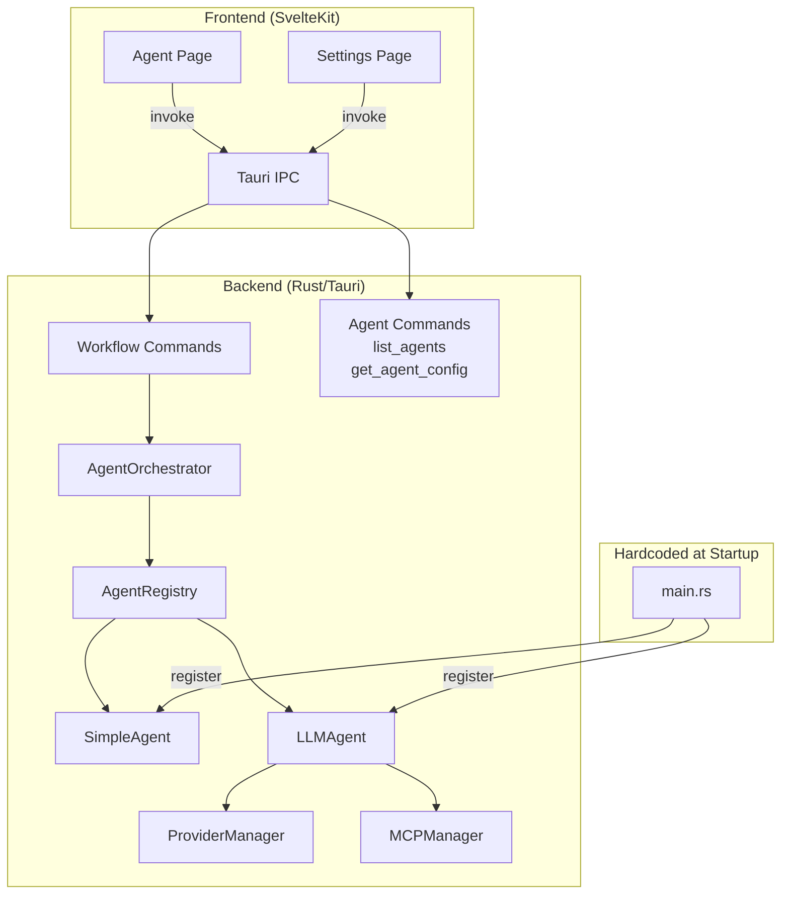
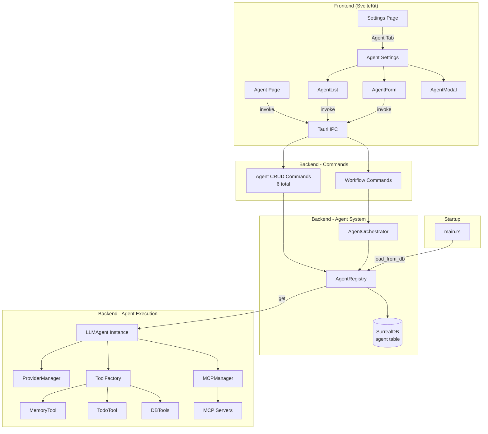
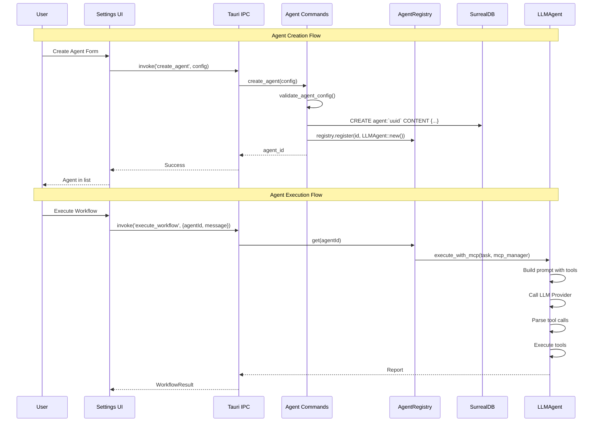

# Specification - Functional Agent System

## Metadata
- **Date**: 2025-11-26
- **Stack**: Svelte 5.43 + Rust 1.91 + Tauri 2.9 + SurrealDB 2.3
- **Complexity**: Complex (multi-phase, architectural refactoring)
- **Author**: Claude (Planning Workflow)

---

## Context

### Demande
> Ultrathink - Lire attentivement MULTI_AGENT_ARCHITECTURE.md. Utiliser les tools et les paramétrages MCP déjà implémentés. **Il ne doit pas y avoir d'agent par défaut**, c'est l'utilisateur qui les créera dans les settings. Planifier l'ajout du système agentique fonctionnel.

### Objectif
Transformer le système d'agents existant (hardcodé) en système dynamique où:
1. **Aucun agent par défaut** - l'utilisateur crée tous ses agents
2. **Persistence complète** - agents stockés en SurrealDB
3. **UI de gestion** - Settings avec CRUD agents complet
4. **Exécution fonctionnelle** - agents exécutent réellement les tools et MCP

### Périmètre
**Inclus**:
- Suppression des agents hardcodés (main.rs lines 84-167)
- Agent CRUD backend (6 nouvelles commandes Tauri)
- Agent Settings UI (Svelte components)
- Persistence SurrealDB (table `agent`)
- Chargement dynamique agents au démarrage
- Intégration tools dans exécution agent

**Exclus**:
- Agents temporaires (Phase 6+)
- Inter-agent communication (Phase 7+)
- Configuration TOML fichiers (users create via UI only)
- Dashboard métriques agents

### Critères de Succès
- [ ] Zero agents au démarrage application
- [ ] User peut créer/modifier/supprimer agents via Settings
- [ ] Agents persistent entre sessions (SurrealDB)
- [ ] Agent sélectionnable dans workflow execution
- [ ] Agent exécute tools configurés (MemoryTool, TodoTool, etc.)
- [ ] Agent appelle MCP servers configurés
- [ ] Validation inputs frontend + backend

---

## État Actuel

### Architecture Existante



### Problème Actuel

**Fichier**: `src-tauri/src/main.rs` (lignes 84-167)

3 agents hardcodés au démarrage:
```rust
// Lines 84-109: simple_agent (demo, no LLM)
// Lines 113-138: ollama_agent (Ollama, llama3.2)
// Lines 140-165: mistral_agent (Mistral, mistral-large-latest)
```

**Conséquence**: Utilisateur ne peut pas créer/modifier/supprimer ses propres agents.

### Commandes Agent Existantes (2 seulement)

| Commande | Fichier | Signature |
|----------|---------|-----------|
| `list_agents` | `commands/agent.rs` | `() -> Vec<String>` (IDs only) |
| `get_agent_config` | `commands/agent.rs` | `(agent_id) -> AgentConfig` |

### Patterns Réutilisables Identifiés

1. **LLM CRUD Pattern** (`commands/models.rs`): 9 commandes pour models
2. **MCP CRUD Pattern** (`commands/mcp.rs`): 10 commandes pour MCP servers
3. **Validation Pattern** (`security/validator.rs`): Fonctions de validation
4. **Settings UI Pattern** (`routes/settings/+page.svelte`): Tabs + forms
5. **Store Pattern** (`stores/llm.ts`, `stores/mcp.ts`): State management

### Code Existant Réutilisable

| Component | Path | Reuse |
|-----------|------|-------|
| `Agent` trait | `agents/core/agent.rs` | 100% - interface complète |
| `AgentRegistry` | `agents/core/registry.rs` | 100% - registration OK |
| `AgentOrchestrator` | `agents/core/orchestrator.rs` | 100% - execution OK |
| `LLMAgent` | `agents/llm_agent.rs` | 100% - implementation OK |
| `AgentConfig` model | `models/agent.rs` | 90% - add validation |
| `ToolFactory` | `tools/factory.rs` | 100% - tool creation |
| `MCPManager` | `mcp/manager.rs` | 100% - MCP integration |
| `ProviderManager` | `llm/manager.rs` | 100% - LLM providers |

---

## Architecture Proposée

### Diagramme Cible



### Flux de Données



---

## Composants

### 1. Backend: Agent CRUD Commands

**Path**: `src-tauri/src/commands/agent.rs`
**Type**: Modification

#### Nouvelles Commandes (4 ajouts)

```rust
/// Create a new agent configuration
/// Validates config, creates in DB, registers in memory
#[tauri::command]
pub async fn create_agent(
    config: AgentConfigCreate,
    state: State<'_, AppState>,
) -> Result<String, String>
// Returns: agent_id (UUID)

/// Update an existing agent configuration
/// Unregisters old, updates DB, registers new
#[tauri::command]
pub async fn update_agent(
    agent_id: String,
    config: AgentConfigUpdate,
    state: State<'_, AppState>,
) -> Result<AgentConfig, String>

/// Delete an agent
/// Unregisters from memory, deletes from DB
#[tauri::command]
pub async fn delete_agent(
    agent_id: String,
    state: State<'_, AppState>,
) -> Result<(), String>

/// Load agents from database (called at startup)
/// Clears registry, loads all agents from DB
pub async fn load_agents_from_db(state: &AppState) -> Result<usize, String>
```

#### Commandes Existantes (Modifier)

```rust
/// List all agent IDs - MODIFIER pour retourner Vec<AgentSummary>
#[tauri::command]
pub async fn list_agents(state: State<'_, AppState>) -> Result<Vec<AgentSummary>, String>

/// Get agent configuration - déjà OK
#[tauri::command]
pub async fn get_agent_config(agent_id: String, state: State<'_, AppState>) -> Result<AgentConfig, String>
```

#### Input/Output Types

```rust
// New types for CRUD operations
#[derive(Debug, Clone, Serialize, Deserialize)]
pub struct AgentConfigCreate {
    pub name: String,                    // 1-64 chars
    pub lifecycle: Lifecycle,            // Permanent | Temporary
    pub llm: LLMConfig,                  // Provider + model config
    pub tools: Vec<String>,              // Tool names to enable
    pub mcp_servers: Vec<String>,        // MCP server names
    pub system_prompt: String,           // 1-10000 chars
}

#[derive(Debug, Clone, Serialize, Deserialize)]
pub struct AgentConfigUpdate {
    pub name: Option<String>,
    pub llm: Option<LLMConfig>,
    pub tools: Option<Vec<String>>,
    pub mcp_servers: Option<Vec<String>>,
    pub system_prompt: Option<String>,
    // Note: lifecycle cannot be changed after creation
}

#[derive(Debug, Clone, Serialize, Deserialize)]
pub struct AgentSummary {
    pub id: String,
    pub name: String,
    pub lifecycle: Lifecycle,
    pub provider: String,
    pub model: String,
    pub tools_count: usize,
    pub mcp_servers_count: usize,
}
```

### 2. Backend: Database Schema

**Table**: `agent`

```surql
-- Define agent table
DEFINE TABLE agent SCHEMAFULL;

-- Core fields
DEFINE FIELD id ON agent TYPE string ASSERT $value != NONE;
DEFINE FIELD name ON agent TYPE string ASSERT $value != NONE AND string::len($value) >= 1 AND string::len($value) <= 64;
DEFINE FIELD lifecycle ON agent TYPE string ASSERT $value IN ['permanent', 'temporary'];

-- LLM configuration (embedded object)
DEFINE FIELD llm ON agent TYPE object;
DEFINE FIELD llm.provider ON agent TYPE string ASSERT $value IN ['Mistral', 'Ollama'];
DEFINE FIELD llm.model ON agent TYPE string;
DEFINE FIELD llm.temperature ON agent TYPE float ASSERT $value >= 0.0 AND $value <= 2.0;
DEFINE FIELD llm.max_tokens ON agent TYPE int ASSERT $value >= 256 AND $value <= 128000;

-- Tools and MCP
DEFINE FIELD tools ON agent TYPE array<string>;
DEFINE FIELD mcp_servers ON agent TYPE array<string>;

-- System prompt
DEFINE FIELD system_prompt ON agent TYPE string;

-- Timestamps
DEFINE FIELD created_at ON agent TYPE datetime DEFAULT time::now();
DEFINE FIELD updated_at ON agent TYPE datetime DEFAULT time::now();

-- Indexes
DEFINE INDEX agent_name_idx ON agent FIELDS name;
DEFINE INDEX agent_provider_idx ON agent FIELDS llm.provider;
```

### 3. Backend: AgentRegistry Modifications

**Path**: `src-tauri/src/agents/core/registry.rs`
**Type**: Modification

```rust
impl AgentRegistry {
    /// Load all agents from database and register them
    pub async fn load_from_db(&self, db: &DBClient, llm_manager: Arc<ProviderManager>) -> Result<usize, String> {
        // 1. Query all agents from DB
        // 2. For each agent:
        //    - Create LLMAgent instance with config
        //    - Register in memory
        // 3. Return count of loaded agents
    }

    /// Unregister and cleanup an agent
    pub async fn unregister(&self, id: &str) -> Result<(), String> {
        // 1. Check if agent exists
        // 2. Remove from HashMap
        // 3. Return success
    }

    /// Check if agent with name exists (for uniqueness)
    pub async fn exists_by_name(&self, name: &str) -> bool {
        // Search through registered agents
    }
}
```

### 4. Backend: main.rs Modifications

**Path**: `src-tauri/src/main.rs`
**Type**: Modification

```rust
// REMOVE: Lines 84-167 (hardcoded agent registration)

// ADD: After app_state initialization
// Load agents from database instead of hardcoding
let loaded_count = commands::agent::load_agents_from_db(&app_state)
    .await
    .unwrap_or_else(|e| {
        tracing::warn!(error = %e, "Failed to load agents from database");
        0
    });
tracing::info!(count = loaded_count, "Agents loaded from database");

// MODIFY: Add new commands to invoke_handler
.invoke_handler(tauri::generate_handler![
    // ... existing commands ...
    // Agent CRUD commands (NEW)
    commands::agent::create_agent,
    commands::agent::update_agent,
    commands::agent::delete_agent,
    // Keep existing
    commands::agent::list_agents,
    commands::agent::get_agent_config,
])
```

### 5. Frontend: TypeScript Types

**Path**: `src/types/agent.ts`
**Type**: Modification

```typescript
// Existing types (keep)
export type Lifecycle = 'permanent' | 'temporary';

export interface LLMConfig {
  provider: string;           // 'Mistral' | 'Ollama'
  model: string;
  temperature: number;        // 0.0-2.0
  max_tokens: number;         // 256-128000
}

export interface AgentConfig {
  id: string;
  name: string;
  lifecycle: Lifecycle;
  llm: LLMConfig;
  tools: string[];
  mcp_servers: string[];
  system_prompt: string;
  created_at?: string;        // ISO 8601
  updated_at?: string;        // ISO 8601
}

// NEW types for CRUD
export interface AgentConfigCreate {
  name: string;
  lifecycle: Lifecycle;
  llm: LLMConfig;
  tools: string[];
  mcp_servers: string[];
  system_prompt: string;
}

export interface AgentConfigUpdate {
  name?: string;
  llm?: LLMConfig;
  tools?: string[];
  mcp_servers?: string[];
  system_prompt?: string;
}

export interface AgentSummary {
  id: string;
  name: string;
  lifecycle: Lifecycle;
  provider: string;
  model: string;
  tools_count: number;
  mcp_servers_count: number;
}

// Available tools (static list for UI)
export const AVAILABLE_TOOLS = [
  'MemoryTool',
  'TodoTool',
] as const;

export type AvailableTool = typeof AVAILABLE_TOOLS[number];
```

### 6. Frontend: Agent Store

**Path**: `src/lib/stores/agents.ts`
**Type**: Modification/New

```typescript
import { writable, derived, get } from 'svelte/store';
import { invoke } from '@tauri-apps/api/core';
import type { AgentConfig, AgentSummary, AgentConfigCreate, AgentConfigUpdate } from '$types/agent';

// State
interface AgentStoreState {
  agents: AgentSummary[];
  selectedId: string | null;
  loading: boolean;
  error: string | null;
  formMode: 'create' | 'edit' | null;
  editingAgent: AgentConfig | null;
}

const initialState: AgentStoreState = {
  agents: [],
  selectedId: null,
  loading: false,
  error: null,
  formMode: null,
  editingAgent: null,
};

// Store
const store = writable<AgentStoreState>(initialState);

// Actions
export const agentStore = {
  subscribe: store.subscribe,

  async loadAgents(): Promise<void> {
    store.update(s => ({ ...s, loading: true, error: null }));
    try {
      const agents = await invoke<AgentSummary[]>('list_agents');
      store.update(s => ({ ...s, agents, loading: false }));
    } catch (e) {
      store.update(s => ({ ...s, error: String(e), loading: false }));
    }
  },

  async createAgent(config: AgentConfigCreate): Promise<string> {
    store.update(s => ({ ...s, loading: true, error: null }));
    try {
      const id = await invoke<string>('create_agent', { config });
      await this.loadAgents();
      store.update(s => ({ ...s, formMode: null }));
      return id;
    } catch (e) {
      store.update(s => ({ ...s, error: String(e), loading: false }));
      throw e;
    }
  },

  async updateAgent(agentId: string, config: AgentConfigUpdate): Promise<void> {
    store.update(s => ({ ...s, loading: true, error: null }));
    try {
      await invoke('update_agent', { agentId, config });
      await this.loadAgents();
      store.update(s => ({ ...s, formMode: null, editingAgent: null }));
    } catch (e) {
      store.update(s => ({ ...s, error: String(e), loading: false }));
      throw e;
    }
  },

  async deleteAgent(agentId: string): Promise<void> {
    store.update(s => ({ ...s, loading: true, error: null }));
    try {
      await invoke('delete_agent', { agentId });
      await this.loadAgents();
      store.update(s => ({
        ...s,
        selectedId: s.selectedId === agentId ? null : s.selectedId
      }));
    } catch (e) {
      store.update(s => ({ ...s, error: String(e), loading: false }));
      throw e;
    }
  },

  async getAgentConfig(agentId: string): Promise<AgentConfig> {
    return await invoke<AgentConfig>('get_agent_config', { agentId });
  },

  select(agentId: string | null): void {
    store.update(s => ({ ...s, selectedId: agentId }));
  },

  openCreateForm(): void {
    store.update(s => ({ ...s, formMode: 'create', editingAgent: null }));
  },

  async openEditForm(agentId: string): Promise<void> {
    const config = await this.getAgentConfig(agentId);
    store.update(s => ({ ...s, formMode: 'edit', editingAgent: config }));
  },

  closeForm(): void {
    store.update(s => ({ ...s, formMode: null, editingAgent: null }));
  },

  clearError(): void {
    store.update(s => ({ ...s, error: null }));
  },
};

// Derived stores
export const agents = derived(store, $s => $s.agents);
export const selectedAgent = derived(store, $s =>
  $s.agents.find(a => a.id === $s.selectedId) ?? null
);
export const isLoading = derived(store, $s => $s.loading);
export const error = derived(store, $s => $s.error);
export const formMode = derived(store, $s => $s.formMode);
export const editingAgent = derived(store, $s => $s.editingAgent);
```

### 7. Frontend: Agent Settings Components

#### AgentSettings.svelte (Container)

**Path**: `src/lib/components/settings/agents/AgentSettings.svelte`
**Type**: New

```svelte
<script lang="ts">
  import { onMount } from 'svelte';
  import { agentStore, agents, isLoading, error, formMode, editingAgent } from '$lib/stores/agents';
  import AgentList from './AgentList.svelte';
  import AgentForm from './AgentForm.svelte';
  import { Button, Modal } from '$lib/components/ui';

  let showDeleteConfirm = false;
  let agentToDelete: string | null = null;

  onMount(() => {
    agentStore.loadAgents();
  });

  function handleCreate() {
    agentStore.openCreateForm();
  }

  function handleEdit(event: CustomEvent<string>) {
    agentStore.openEditForm(event.detail);
  }

  function handleDeleteRequest(event: CustomEvent<string>) {
    agentToDelete = event.detail;
    showDeleteConfirm = true;
  }

  async function confirmDelete() {
    if (agentToDelete) {
      await agentStore.deleteAgent(agentToDelete);
      showDeleteConfirm = false;
      agentToDelete = null;
    }
  }

  function cancelDelete() {
    showDeleteConfirm = false;
    agentToDelete = null;
  }
</script>

<div class="agent-settings">
  <header class="settings-header">
    <h2>Agent Configuration</h2>
    <Button variant="primary" on:click={handleCreate}>
      Create Agent
    </Button>
  </header>

  {#if $error}
    <div class="error-banner">
      {$error}
      <button on:click={() => agentStore.clearError()}>Dismiss</button>
    </div>
  {/if}

  {#if $formMode}
    <AgentForm
      mode={$formMode}
      agent={$editingAgent}
      on:cancel={() => agentStore.closeForm()}
    />
  {:else}
    <AgentList
      agents={$agents}
      loading={$isLoading}
      on:edit={handleEdit}
      on:delete={handleDeleteRequest}
    />
  {/if}

  <Modal
    open={showDeleteConfirm}
    title="Delete Agent"
    on:close={cancelDelete}
  >
    <p>Are you sure you want to delete this agent? This action cannot be undone.</p>
    <div class="modal-actions">
      <Button variant="ghost" on:click={cancelDelete}>Cancel</Button>
      <Button variant="danger" on:click={confirmDelete}>Delete</Button>
    </div>
  </Modal>
</div>

<style>
  .agent-settings {
    display: flex;
    flex-direction: column;
    gap: var(--spacing-lg);
  }

  .settings-header {
    display: flex;
    justify-content: space-between;
    align-items: center;
  }

  .error-banner {
    background: var(--color-error-light);
    color: var(--color-error);
    padding: var(--spacing-md);
    border-radius: var(--radius-md);
    display: flex;
    justify-content: space-between;
    align-items: center;
  }

  .modal-actions {
    display: flex;
    gap: var(--spacing-md);
    justify-content: flex-end;
    margin-top: var(--spacing-lg);
  }
</style>
```

#### AgentList.svelte

**Path**: `src/lib/components/settings/agents/AgentList.svelte`
**Type**: New

```svelte
<script lang="ts">
  import { createEventDispatcher } from 'svelte';
  import type { AgentSummary } from '$types/agent';
  import { Card, Badge, Button, Spinner } from '$lib/components/ui';

  export let agents: AgentSummary[];
  export let loading: boolean;

  const dispatch = createEventDispatcher<{
    edit: string;
    delete: string;
  }>();
</script>

{#if loading}
  <div class="loading-container">
    <Spinner size="lg" />
  </div>
{:else if agents.length === 0}
  <Card>
    <div class="empty-state">
      <h3>No Agents Configured</h3>
      <p>Create your first agent to get started with AI-powered workflows.</p>
    </div>
  </Card>
{:else}
  <div class="agent-grid">
    {#each agents as agent (agent.id)}
      <Card>
        <div class="agent-card">
          <div class="agent-header">
            <h3>{agent.name}</h3>
            <Badge variant={agent.lifecycle === 'permanent' ? 'primary' : 'warning'}>
              {agent.lifecycle}
            </Badge>
          </div>

          <div class="agent-details">
            <div class="detail-row">
              <span class="label">Provider:</span>
              <span class="value">{agent.provider}</span>
            </div>
            <div class="detail-row">
              <span class="label">Model:</span>
              <span class="value">{agent.model}</span>
            </div>
            <div class="detail-row">
              <span class="label">Tools:</span>
              <span class="value">{agent.tools_count} enabled</span>
            </div>
            <div class="detail-row">
              <span class="label">MCP Servers:</span>
              <span class="value">{agent.mcp_servers_count} configured</span>
            </div>
          </div>

          <div class="agent-actions">
            <Button variant="ghost" size="sm" on:click={() => dispatch('edit', agent.id)}>
              Edit
            </Button>
            <Button variant="danger" size="sm" on:click={() => dispatch('delete', agent.id)}>
              Delete
            </Button>
          </div>
        </div>
      </Card>
    {/each}
  </div>
{/if}

<style>
  .loading-container {
    display: flex;
    justify-content: center;
    padding: var(--spacing-xl);
  }

  .empty-state {
    text-align: center;
    padding: var(--spacing-xl);
    color: var(--color-text-secondary);
  }

  .agent-grid {
    display: grid;
    grid-template-columns: repeat(auto-fill, minmax(320px, 1fr));
    gap: var(--spacing-lg);
  }

  .agent-card {
    display: flex;
    flex-direction: column;
    gap: var(--spacing-md);
  }

  .agent-header {
    display: flex;
    justify-content: space-between;
    align-items: center;
  }

  .agent-header h3 {
    margin: 0;
  }

  .agent-details {
    display: flex;
    flex-direction: column;
    gap: var(--spacing-xs);
  }

  .detail-row {
    display: flex;
    gap: var(--spacing-sm);
  }

  .label {
    color: var(--color-text-secondary);
    min-width: 100px;
  }

  .value {
    font-weight: 500;
  }

  .agent-actions {
    display: flex;
    gap: var(--spacing-sm);
    justify-content: flex-end;
    padding-top: var(--spacing-md);
    border-top: 1px solid var(--color-border);
  }
</style>
```

#### AgentForm.svelte

**Path**: `src/lib/components/settings/agents/AgentForm.svelte`
**Type**: New

```svelte
<script lang="ts">
  import { createEventDispatcher } from 'svelte';
  import { agentStore } from '$lib/stores/agents';
  import { llmStore } from '$lib/stores/llm';
  import { mcpStore } from '$lib/stores/mcp';
  import type { AgentConfig, AgentConfigCreate, Lifecycle, LLMConfig, AVAILABLE_TOOLS } from '$types/agent';
  import { Button, Input, Textarea, Select, Card } from '$lib/components/ui';

  export let mode: 'create' | 'edit';
  export let agent: AgentConfig | null = null;

  const dispatch = createEventDispatcher<{ cancel: void }>();

  // Form state
  let name = agent?.name ?? '';
  let lifecycle: Lifecycle = agent?.lifecycle ?? 'permanent';
  let provider = agent?.llm.provider ?? 'Mistral';
  let model = agent?.llm.model ?? 'mistral-large-latest';
  let temperature = agent?.llm.temperature ?? 0.7;
  let maxTokens = agent?.llm.max_tokens ?? 4096;
  let selectedTools: string[] = agent?.tools ?? [];
  let selectedMcpServers: string[] = agent?.mcp_servers ?? [];
  let systemPrompt = agent?.system_prompt ?? '';

  let saving = false;
  let errors: Record<string, string> = {};

  // Available tools (only functional ones)
  const availableTools = [
    { value: 'MemoryTool', label: 'Memory Tool' },
    { value: 'TodoTool', label: 'Todo Tool' },
  ];

  const lifecycleOptions = [
    { value: 'permanent', label: 'Permanent' },
    { value: 'temporary', label: 'Temporary' },
  ];

  const providerOptions = [
    { value: 'Mistral', label: 'Mistral AI' },
    { value: 'Ollama', label: 'Ollama (Local)' },
  ];

  // Reactive: update models when provider changes
  $: providerModels = provider === 'Mistral'
    ? ['mistral-large-latest', 'mistral-medium-latest', 'mistral-small-latest', 'codestral-latest']
    : ['llama3.2', 'llama3.1', 'mistral', 'codellama', 'phi3'];

  // Reactive: available MCP servers from store
  $: availableMcpServers = $mcpStore.servers.map(s => ({
    value: s.name,
    label: s.name,
  }));

  function validate(): boolean {
    errors = {};

    if (!name.trim() || name.length < 1 || name.length > 64) {
      errors.name = 'Name must be 1-64 characters';
    }

    if (!model) {
      errors.model = 'Model is required';
    }

    if (temperature < 0 || temperature > 2) {
      errors.temperature = 'Temperature must be 0-2';
    }

    if (maxTokens < 256 || maxTokens > 128000) {
      errors.maxTokens = 'Max tokens must be 256-128000';
    }

    if (!systemPrompt.trim()) {
      errors.systemPrompt = 'System prompt is required';
    }

    return Object.keys(errors).length === 0;
  }

  async function handleSubmit() {
    if (!validate()) return;

    saving = true;

    const config: AgentConfigCreate = {
      name: name.trim(),
      lifecycle,
      llm: {
        provider,
        model,
        temperature,
        max_tokens: maxTokens,
      },
      tools: selectedTools,
      mcp_servers: selectedMcpServers,
      system_prompt: systemPrompt,
    };

    try {
      if (mode === 'create') {
        await agentStore.createAgent(config);
      } else if (agent) {
        await agentStore.updateAgent(agent.id, config);
      }
    } catch (e) {
      // Error handled by store
    } finally {
      saving = false;
    }
  }

  function toggleTool(tool: string) {
    if (selectedTools.includes(tool)) {
      selectedTools = selectedTools.filter(t => t !== tool);
    } else {
      selectedTools = [...selectedTools, tool];
    }
  }

  function toggleMcpServer(server: string) {
    if (selectedMcpServers.includes(server)) {
      selectedMcpServers = selectedMcpServers.filter(s => s !== server);
    } else {
      selectedMcpServers = [...selectedMcpServers, server];
    }
  }
</script>

<Card>
  <form on:submit|preventDefault={handleSubmit}>
    <h3>{mode === 'create' ? 'Create New Agent' : 'Edit Agent'}</h3>

    <div class="form-grid">
      <!-- Basic Info -->
      <div class="form-section">
        <h4>Basic Information</h4>

        <Input
          label="Agent Name"
          bind:value={name}
          error={errors.name}
          placeholder="My Custom Agent"
          maxlength={64}
        />

        <Select
          label="Lifecycle"
          bind:value={lifecycle}
          options={lifecycleOptions}
          disabled={mode === 'edit'}
          help={mode === 'edit' ? 'Lifecycle cannot be changed after creation' : undefined}
        />
      </div>

      <!-- LLM Configuration -->
      <div class="form-section">
        <h4>LLM Configuration</h4>

        <Select
          label="Provider"
          bind:value={provider}
          options={providerOptions}
        />

        <Select
          label="Model"
          bind:value={model}
          options={providerModels.map(m => ({ value: m, label: m }))}
          error={errors.model}
        />

        <Input
          label="Temperature"
          type="number"
          bind:value={temperature}
          error={errors.temperature}
          min={0}
          max={2}
          step={0.1}
        />

        <Input
          label="Max Tokens"
          type="number"
          bind:value={maxTokens}
          error={errors.maxTokens}
          min={256}
          max={128000}
        />
      </div>

      <!-- Tools -->
      <div class="form-section">
        <h4>Tools</h4>
        <p class="section-help">Select tools this agent can use</p>

        <div class="checkbox-group">
          {#each availableTools as tool}
            <label class="checkbox-item">
              <input
                type="checkbox"
                checked={selectedTools.includes(tool.value)}
                on:change={() => toggleTool(tool.value)}
              />
              <span>{tool.label}</span>
            </label>
          {/each}
        </div>
      </div>

      <!-- MCP Servers -->
      <div class="form-section">
        <h4>MCP Servers</h4>
        <p class="section-help">Select MCP servers this agent can access</p>

        {#if availableMcpServers.length === 0}
          <p class="no-servers">No MCP servers configured. Add servers in MCP Settings.</p>
        {:else}
          <div class="checkbox-group">
            {#each availableMcpServers as server}
              <label class="checkbox-item">
                <input
                  type="checkbox"
                  checked={selectedMcpServers.includes(server.value)}
                  on:change={() => toggleMcpServer(server.value)}
                />
                <span>{server.label}</span>
              </label>
            {/each}
          </div>
        {/if}
      </div>

      <!-- System Prompt -->
      <div class="form-section full-width">
        <h4>System Prompt</h4>

        <Textarea
          label="Instructions for the agent"
          bind:value={systemPrompt}
          error={errors.systemPrompt}
          rows={8}
          placeholder="You are a helpful AI assistant specialized in..."
        />
      </div>
    </div>

    <div class="form-actions">
      <Button variant="ghost" type="button" on:click={() => dispatch('cancel')}>
        Cancel
      </Button>
      <Button variant="primary" type="submit" disabled={saving}>
        {saving ? 'Saving...' : (mode === 'create' ? 'Create Agent' : 'Save Changes')}
      </Button>
    </div>
  </form>
</Card>

<style>
  form {
    display: flex;
    flex-direction: column;
    gap: var(--spacing-lg);
  }

  h3 {
    margin: 0 0 var(--spacing-md) 0;
  }

  h4 {
    margin: 0 0 var(--spacing-sm) 0;
    color: var(--color-text-secondary);
    font-size: 0.875rem;
    text-transform: uppercase;
    letter-spacing: 0.05em;
  }

  .form-grid {
    display: grid;
    grid-template-columns: repeat(2, 1fr);
    gap: var(--spacing-xl);
  }

  .form-section {
    display: flex;
    flex-direction: column;
    gap: var(--spacing-md);
  }

  .form-section.full-width {
    grid-column: 1 / -1;
  }

  .section-help {
    margin: 0;
    font-size: 0.875rem;
    color: var(--color-text-secondary);
  }

  .checkbox-group {
    display: flex;
    flex-direction: column;
    gap: var(--spacing-sm);
  }

  .checkbox-item {
    display: flex;
    align-items: center;
    gap: var(--spacing-sm);
    cursor: pointer;
  }

  .checkbox-item input {
    width: 16px;
    height: 16px;
  }

  .no-servers {
    color: var(--color-text-secondary);
    font-style: italic;
  }

  .form-actions {
    display: flex;
    gap: var(--spacing-md);
    justify-content: flex-end;
    padding-top: var(--spacing-lg);
    border-top: 1px solid var(--color-border);
  }
</style>
```

### 8. Frontend: Settings Page Integration

**Path**: `src/routes/settings/+page.svelte`
**Type**: Modification

Add new tab for Agent Settings:

```svelte
<!-- In the tabs array, add: -->
{ id: 'agents', label: 'Agents', icon: 'bot' }

<!-- In the tab content section, add: -->
{#if activeTab === 'agents'}
  <AgentSettings />
{/if}

<!-- Import at top: -->
import AgentSettings from '$lib/components/settings/agents/AgentSettings.svelte';
```

---

## Types Synchronisés

### TypeScript (`src/types/agent.ts`)

```typescript
// Full type definitions as shown in Section 5
export type Lifecycle = 'permanent' | 'temporary';
export interface LLMConfig { ... }
export interface AgentConfig { ... }
export interface AgentConfigCreate { ... }
export interface AgentConfigUpdate { ... }
export interface AgentSummary { ... }
```

### Rust (`src-tauri/src/models/agent.rs`)

```rust
// Match TypeScript exactly
#[derive(Debug, Clone, Serialize, Deserialize)]
#[serde(rename_all = "lowercase")]
pub enum Lifecycle {
    Permanent,
    Temporary,
}

#[derive(Debug, Clone, Serialize, Deserialize)]
pub struct LLMConfig {
    pub provider: String,
    pub model: String,
    pub temperature: f32,
    pub max_tokens: usize,
}

#[derive(Debug, Clone, Serialize, Deserialize)]
pub struct AgentConfig {
    pub id: String,
    pub name: String,
    pub lifecycle: Lifecycle,
    pub llm: LLMConfig,
    pub tools: Vec<String>,
    pub mcp_servers: Vec<String>,
    pub system_prompt: String,
    #[serde(skip_serializing_if = "Option::is_none")]
    pub created_at: Option<chrono::DateTime<chrono::Utc>>,
    #[serde(skip_serializing_if = "Option::is_none")]
    pub updated_at: Option<chrono::DateTime<chrono::Utc>>,
}

// NEW types for CRUD
#[derive(Debug, Clone, Serialize, Deserialize)]
pub struct AgentConfigCreate { ... }

#[derive(Debug, Clone, Serialize, Deserialize)]
pub struct AgentConfigUpdate { ... }

#[derive(Debug, Clone, Serialize, Deserialize)]
pub struct AgentSummary { ... }
```

---

## Plan d'Implementation

### Phase 1: Backend - Agent Persistence (Foundation)

**Objectif**: Remplacer agents hardcodés par persistence SurrealDB

**Taches**:

1. **Database Schema**: Ajouter table `agent` dans `db/schema.rs`
   - Fichier: `src-tauri/src/db/schema.rs`
   - Action: Ajouter DEFINE TABLE agent...

2. **Model Updates**: Ajouter types CRUD dans `models/agent.rs`
   - Fichier: `src-tauri/src/models/agent.rs`
   - Action: Ajouter AgentConfigCreate, AgentConfigUpdate, AgentSummary

3. **Agent Commands**: Implementer CRUD complet
   - Fichier: `src-tauri/src/commands/agent.rs`
   - Action: Ajouter create_agent, update_agent, delete_agent, load_agents_from_db
   - Modifier: list_agents pour retourner AgentSummary[]

4. **AgentRegistry Updates**: Ajouter load_from_db, unregister
   - Fichier: `src-tauri/src/agents/core/registry.rs`
   - Action: Implementer methodes pour persistence

5. **main.rs Refactoring**: Supprimer hardcoded agents
   - Fichier: `src-tauri/src/main.rs`
   - Action: Supprimer lines 84-167, ajouter load_agents_from_db()

6. **Command Registration**: Enregistrer nouvelles commandes
   - Fichier: `src-tauri/src/main.rs`
   - Action: Ajouter commands a invoke_handler

**Validation Phase 1**:
- [ ] `cargo test` passe
- [ ] `cargo clippy` sans warnings
- [ ] Application demarre avec 0 agents
- [ ] Agents se chargent du DB correctement

### Phase 2: Frontend - Agent Store & Types

**Objectif**: State management et types pour agents

**Taches**:

1. **TypeScript Types**: Mettre a jour types agent
   - Fichier: `src/types/agent.ts`
   - Action: Ajouter AgentConfigCreate, AgentConfigUpdate, AgentSummary, AVAILABLE_TOOLS

2. **Agent Store**: Creer store complet
   - Fichier: `src/lib/stores/agents.ts`
   - Action: Implementer CRUD actions, derived stores

3. **Store Index**: Exporter nouveau store
   - Fichier: `src/lib/stores/index.ts`
   - Action: Ajouter export

**Validation Phase 2**:
- [ ] `npm run check` passe
- [ ] `npm run lint` sans erreurs
- [ ] Types synchronises avec Rust

### Phase 3: Frontend - Agent Settings UI

**Objectif**: Interface utilisateur complete pour gestion agents

**Taches**:

1. **Component Directory**: Creer structure
   - Path: `src/lib/components/settings/agents/`
   - Action: Creer dossier

2. **AgentSettings Container**:
   - Fichier: `src/lib/components/settings/agents/AgentSettings.svelte`
   - Action: Implementer container avec header, error handling, modal

3. **AgentList Component**:
   - Fichier: `src/lib/components/settings/agents/AgentList.svelte`
   - Action: Grid de cards avec actions edit/delete

4. **AgentForm Component**:
   - Fichier: `src/lib/components/settings/agents/AgentForm.svelte`
   - Action: Formulaire create/edit avec validation

5. **Component Index**:
   - Fichier: `src/lib/components/settings/agents/index.ts`
   - Action: Exporter composants

6. **Settings Page Integration**:
   - Fichier: `src/routes/settings/+page.svelte`
   - Action: Ajouter tab "Agents" avec AgentSettings

**Validation Phase 3**:
- [ ] `npm run check` passe
- [ ] `npm run lint` sans erreurs
- [ ] UI fonctionne pour create/edit/delete
- [ ] Formulaire valide inputs

### Phase 4: Integration - Agent Selector

**Objectif**: Connecter agents aux workflows

**Taches**:

1. **AgentSelector Update**:
   - Fichier: `src/lib/components/workflow/AgentSelector.svelte`
   - Action: Charger agents depuis store au lieu de mock

2. **Agent Page Integration**:
   - Fichier: `src/routes/agent/+page.svelte`
   - Action: Utiliser agents du store pour selection

3. **Empty State**:
   - Action: Afficher message si aucun agent configure

**Validation Phase 4**:
- [ ] AgentSelector affiche agents du store
- [ ] Workflow execution utilise agent selectionne
- [ ] Message clair si aucun agent

### Phase 5: Tool Execution Integration

**Objectif**: Agents executent reellement les tools configures

**Taches**:

1. **LLMAgent Enhancement**:
   - Fichier: `src-tauri/src/agents/llm_agent.rs`
   - Action: Parser reponse LLM pour tool calls
   - Action: Executer tools via ToolFactory
   - Action: Loop back results to LLM

2. **Tool Prompt Injection**:
   - Action: Ajouter descriptions tools au system prompt
   - Action: Format JSON pour tool calls

3. **MCP Tool Integration**:
   - Action: Appeler MCP tools via MCPManager
   - Action: Inclure resultats dans report

**Validation Phase 5**:
- [ ] Agent avec MemoryTool peut sauvegarder memories
- [ ] Agent avec TodoTool peut creer tasks
- [ ] Agent avec MCP server peut appeler tools externes

---

## Estimation

| Phase | Frontend | Backend | Tests | Total |
|-------|----------|---------|-------|-------|
| 1 - Agent Persistence | - | 4h | 1h | 5h |
| 2 - Store & Types | 2h | - | 0.5h | 2.5h |
| 3 - Settings UI | 4h | - | 1h | 5h |
| 4 - Agent Selector | 1h | - | 0.5h | 1.5h |
| 5 - Tool Execution | - | 3h | 1h | 4h |
| **Total** | **7h** | **7h** | **4h** | **18h** |

**Facteurs**:
- Patterns existants (MCP CRUD, LLM CRUD): -30%
- Code reutilisable (Agent trait, registry): -20%
- Nouvelle complexite tool execution: +15%
- **Estimation ajustee**: ~14h

---

## Analyse Risques

| Risque | Probabilite | Impact | Mitigation | Plan B |
|--------|-------------|--------|------------|--------|
| Schema migration conflicts | Moyenne | Moyen | Test migration sur DB vide d'abord | Backup avant migration |
| Tool execution parsing complex | Haute | Moyen | JSON format strict pour tool calls | Fallback a simple text response |
| MCP server availability | Moyenne | Faible | Graceful degradation si MCP down | Continue sans MCP tools |
| LLM provider rate limits | Faible | Faible | Retry logic avec backoff | Queue requests |
| Frontend state sync issues | Moyenne | Moyen | Store actions refresh after mutations | Manual refresh button |

---

## Tests

### Backend (Rust)

```rust
#[cfg(test)]
mod tests {
    use super::*;

    #[tokio::test]
    async fn test_create_agent() {
        // Setup test DB
        // Create agent via command
        // Verify in DB
        // Verify in registry
    }

    #[tokio::test]
    async fn test_create_agent_validation() {
        // Test name too long
        // Test invalid provider
        // Test invalid temperature
    }

    #[tokio::test]
    async fn test_update_agent() {
        // Create agent
        // Update agent
        // Verify changes persisted
    }

    #[tokio::test]
    async fn test_delete_agent() {
        // Create agent
        // Delete agent
        // Verify removed from DB and registry
    }

    #[tokio::test]
    async fn test_load_agents_from_db() {
        // Create multiple agents in DB
        // Call load_agents_from_db
        // Verify all registered
    }
}
```

### Frontend (Vitest)

```typescript
import { describe, it, expect, vi } from 'vitest';
import { render, fireEvent } from '@testing-library/svelte';
import AgentForm from './AgentForm.svelte';

describe('AgentForm', () => {
  it('validates required fields', async () => {
    const { getByLabelText, getByText } = render(AgentForm, {
      props: { mode: 'create' }
    });

    await fireEvent.click(getByText('Create Agent'));

    expect(getByText(/name must be/i)).toBeInTheDocument();
  });

  it('calls createAgent on valid submit', async () => {
    // Mock store
    // Fill form
    // Submit
    // Verify store.createAgent called
  });
});
```

---

## Considerations

### Performance
- Lazy load agent configs (summary first, full on edit)
- Cache agents in registry (Arc for sharing)
- Debounce form validation

### Securite
- Validate all inputs backend (ne pas faire confiance au frontend)
- Sanitize system prompts (no injection)
- Rate limit agent creation

### Tauri Specifique
- IPC serialization via serde
- State management via tauri::State
- Command registration dans generate_handler!

### SurrealDB Specifique
- Use `meta::id(id)` for clean UUIDs in SELECT
- Use `execute()` for write operations
- JSON encode strings with special chars

---

## Dependencies

### Frontend (package.json)
Aucune nouvelle dependance requise.

### Backend (Cargo.toml)
Aucune nouvelle dependance requise. Utilise:
- `serde` (existant)
- `serde_json` (existant)
- `tokio` (existant)
- `async-trait` (existant)

---

## Prochaines Etapes

### Validation Spec
- [ ] Architecture approuvee
- [ ] Types synchronises valides
- [ ] Plan phases clair

### Implementation
1. Commencer Phase 1 (Backend Persistence)
2. Valider avec `cargo test && cargo clippy`
3. Phase 2 (Store & Types)
4. Phase 3 (UI)
5. Phase 4 (Integration)
6. Phase 5 (Tool Execution)
7. E2E tests finaux

---

## References

- Architecture: `docs/MULTI_AGENT_ARCHITECTURE.md`
- Tech Stack: `docs/TECH_STACK.md`
- Existing Agent Code: `src-tauri/src/agents/`
- MCP CRUD Pattern: `src-tauri/src/commands/mcp.rs`
- LLM CRUD Pattern: `src-tauri/src/commands/models.rs`
- Tool Architecture: Serena memory `tools_architecture_analysis`

---

## Annexe: Commandes Existantes

### Agent Commands (A modifier)
- `list_agents` -> retourner `Vec<AgentSummary>` au lieu de `Vec<String>`
- `get_agent_config` -> OK, garder tel quel

### Nouvelles Commandes
- `create_agent(config: AgentConfigCreate) -> String`
- `update_agent(agent_id: String, config: AgentConfigUpdate) -> AgentConfig`
- `delete_agent(agent_id: String) -> ()`

### Fonction Interne
- `load_agents_from_db(state: &AppState) -> Result<usize, String>`
