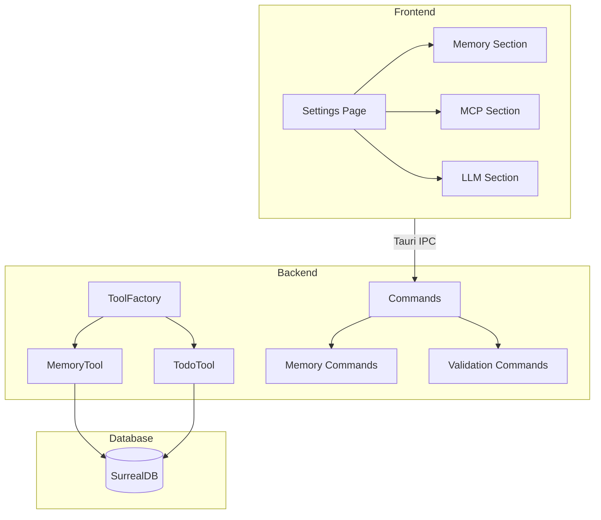
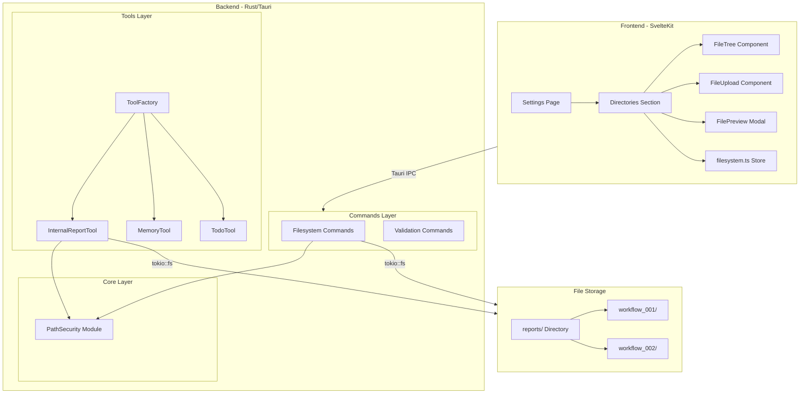
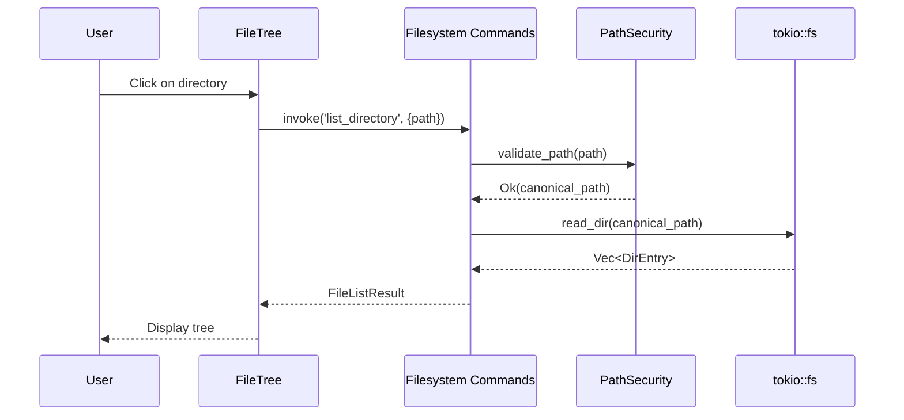
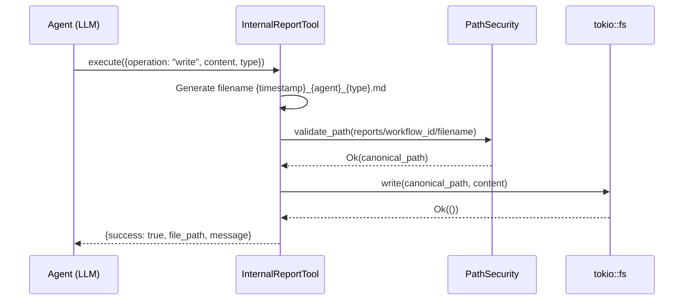

# Specification - Internal Report Tool & Directory Management

## Metadata
- **Date**: 2025-11-26
- **Stack**: Svelte 5.43.14 + Rust 1.91.1 + Tauri 2.9.4 + SurrealDB 2.3.10
- **Complexity**: Medium-Complex
- **Estimated Effort**: 6-8 days

## Context

**Demande**: Planifier l'implementation de l'Internal Report Tool (section 3 de AGENT_TOOLS_DOCUMENTATION.md) avec integration dans la section Directory Management de la page Settings (FRONTEND_SPECIFICATIONS.md).

**Objectif**:
1. Creer un outil backend (InternalReportTool) pour la communication inter-agents via rapports Markdown persistes localement
2. Implementer les commandes Tauri pour la gestion de fichiers (Directory Management UI)
3. Integrer la section Directory Management dans la page Settings

**Perimetre**:
- **Inclus**: InternalReportTool (7 operations), Filesystem commands (11 commands), Frontend Directory Management (4 components), Types TypeScript/Rust synchronises
- **Exclus**: Compression/archivage avance, versioning de fichiers, synchronisation cloud

**Criteres Succes**:
- [ ] Agents peuvent lire/ecrire des rapports via InternalReportTool
- [ ] Frontend affiche arborescence fichiers dans Settings > Directories
- [ ] Operations CRUD fonctionnelles (create, read, update, delete)
- [ ] Securite: path traversal bloque, scope respecte
- [ ] Tests unitaires backend + frontend

---

## Etat Actuel

### Architecture Existante



### Patterns Identifies

| Pattern | Usage | Fichiers |
|---------|-------|----------|
| **Tool Trait** | Operations JSON async | `src-tauri/src/tools/mod.rs` |
| **ToolFactory** | Instanciation dynamique | `src-tauri/src/tools/factory.rs` |
| **JSON Operation Dispatch** | Switch sur operation | `src-tauri/src/tools/todo/tool.rs` |
| **ToolError Enum** | 8 variantes d'erreur | `src-tauri/src/tools/mod.rs` |
| **Pure Function Store** | State immutable | `src/lib/stores/mcp.ts` |
| **Settings Section** | Sidebar + Content grid | `src/routes/settings/+page.svelte` |
| **$types Alias** | Import TypeScript | `svelte.config.js` |

### Code Reutilisable

**Backend**:
- `src-tauri/src/tools/mod.rs` - Tool trait, ToolError, ToolDefinition
- `src-tauri/src/tools/factory.rs` - ToolFactory pattern
- `src-tauri/src/tools/memory/tool.rs` - Reference implementation (8 operations)
- `src-tauri/src/commands/validation.rs` - Validation integration pattern

**Frontend**:
- `src/lib/stores/mcp.ts` - Pure function state pattern
- `src/lib/components/ui/` - Button, Card, Modal, Input, etc.
- `src/routes/settings/+page.svelte` - Settings section pattern
- `src/lib/components/settings/memory/` - Memory settings components

---

## Architecture Proposee

### Diagramme Global



### Flux de Donnees





---

## Composants

### Backend: InternalReportTool

**Path**: `src-tauri/src/tools/report/tool.rs`
**Type**: Nouveau fichier

**Trait Implementation**:
```rust
#[async_trait]
impl Tool for InternalReportTool {
    fn definition(&self) -> ToolDefinition {
        ToolDefinition {
            id: "InternalReportTool".to_string(),
            name: "Internal Report Tool".to_string(),
            description: "Inter-agent communication via Markdown reports".to_string(),
            input_schema: json!({
                "type": "object",
                "properties": {
                    "operation": {
                        "type": "string",
                        "enum": ["read", "write", "write_diff", "glob", "delete",
                                 "create_dir", "delete_dir"]
                    },
                    "path": {"type": "string"},
                    "content": {"type": "string"},
                    "report_type": {"type": "string", "enum": ["analysis", "decision", "error", "status"]},
                    "pattern": {"type": "string"},
                    "diff": {"type": "object"}
                },
                "required": ["operation"]
            }),
            output_schema: json!({}),
            requires_confirmation: false,
        }
    }

    async fn execute(&self, input: Value) -> ToolResult<Value> {
        self.validate_input(&input)?;
        let operation = input["operation"].as_str().unwrap();

        match operation {
            "read" => self.read_report(&input).await,
            "write" => self.write_report(&input).await,
            "write_diff" => self.write_diff(&input).await,
            "glob" => self.glob_reports(&input).await,
            "delete" => self.delete_report(&input).await,
            "create_dir" => self.create_directory(&input).await,
            "delete_dir" => self.delete_directory(&input).await,
            _ => Err(ToolError::InvalidInput(format!("Unknown operation: {}", operation)))
        }
    }

    fn validate_input(&self, input: &Value) -> ToolResult<()> {
        // Validation logic
    }

    fn requires_confirmation(&self) -> bool {
        false // Tool-level confirmation not needed; use validation system for UI
    }
}
```

**Operations**:

| Operation | Params | Description | Returns |
|-----------|--------|-------------|---------|
| `read` | `path` | Lire contenu rapport | `{success, content, metadata}` |
| `write` | `content`, `report_type`, `metadata?` | Creer nouveau rapport | `{success, file_path, message}` |
| `write_diff` | `path`, `diff` | Modifier section rapport | `{success, file_path, changes_applied}` |
| `glob` | `pattern` | Rechercher rapports | `{success, files: [...], count}` |
| `delete` | `path` | Supprimer rapport | `{success, message}` |
| `create_dir` | `name` | Creer sous-dossier | `{success, directory_path}` |
| `delete_dir` | `path` | Supprimer dossier (recursif) | `{success, files_deleted, message}` |

**Report File Structure**:
```markdown
# Titre Rapport
**Agent**: {agent_id}
**Timestamp**: 2025-11-26T10:30:00Z
**Type**: analysis | decision | error | status
**Workflow**: {workflow_id}

## Contexte
[Description situation/probleme]

## Donnees
[Informations pertinentes structurees]

## Conclusions
[Resultats, decisions, recommandations]

## Actions Requises
- [ ] Action 1
- [ ] Action 2
```

**Filename Convention**: `{timestamp}_{agent_id}_{type}.md`
- Example: `20251126T103000_db_agent_analysis.md`

---

### Backend: Filesystem Commands

**Path**: `src-tauri/src/commands/filesystem.rs`
**Type**: Nouveau fichier

**Commands**:

```rust
// Get reports root path
#[tauri::command]
pub async fn get_reports_root_path() -> Result<String, String>

// List directory contents
#[tauri::command]
pub async fn list_directory(
    path: String,
    recursive: Option<bool>,
    include_hidden: Option<bool>
) -> Result<FileListResult, String>

// Get file metadata
#[tauri::command]
pub async fn get_file_metadata(path: String) -> Result<FileMetadata, String>

// Read file content
#[tauri::command]
pub async fn read_file(path: String) -> Result<FileContent, String>

// Write file content
#[tauri::command]
pub async fn write_file(
    path: String,
    content: String,
    create_dirs: Option<bool>
) -> Result<WriteResult, String>

// Create directory
#[tauri::command]
pub async fn create_directory(
    path: String,
    recursive: Option<bool>
) -> Result<DirectoryResult, String>

// Delete file
#[tauri::command]
pub async fn delete_file(path: String) -> Result<DeleteResult, String>

// Delete directory
#[tauri::command]
pub async fn delete_directory(
    path: String,
    recursive: Option<bool>
) -> Result<DeleteResult, String>

// Rename file or directory
#[tauri::command]
pub async fn rename_item(
    old_path: String,
    new_name: String
) -> Result<RenameResult, String>

// Move file or directory
#[tauri::command]
pub async fn move_item(
    source_path: String,
    destination_path: String
) -> Result<MoveResult, String>

// Copy file
#[tauri::command]
pub async fn copy_file(
    source_path: String,
    destination_path: String
) -> Result<CopyResult, String>
```

**Registration in main.rs**:
```rust
tauri::generate_handler![
    // ... existing 34 commands ...
    // Filesystem commands (11 new)
    commands::filesystem::get_reports_root_path,
    commands::filesystem::list_directory,
    commands::filesystem::get_file_metadata,
    commands::filesystem::read_file,
    commands::filesystem::write_file,
    commands::filesystem::create_directory,
    commands::filesystem::delete_file,
    commands::filesystem::delete_directory,
    commands::filesystem::rename_item,
    commands::filesystem::move_item,
    commands::filesystem::copy_file,
]
```

---

### Backend: PathSecurity Module

**Path**: `src-tauri/src/security/path.rs`
**Type**: Nouveau fichier

```rust
use std::path::{Path, PathBuf};
use anyhow::{Result, anyhow};

/// Security configuration for file operations
pub struct PathSecurityConfig {
    pub base_path: PathBuf,
    pub max_file_size: u64,
    pub allowed_extensions: Vec<String>,
    pub follow_symlinks: bool,
}

impl Default for PathSecurityConfig {
    fn default() -> Self {
        Self {
            base_path: get_reports_base_path(),
            max_file_size: 10 * 1024 * 1024, // 10MB
            allowed_extensions: vec![
                "md".into(), "txt".into(), "json".into(), "csv".into()
            ],
            follow_symlinks: false,
        }
    }
}

/// Validates and canonicalizes a path within the allowed scope
pub fn validate_path(path: &str, config: &PathSecurityConfig) -> Result<PathBuf> {
    let requested = PathBuf::from(path);

    // Resolve to absolute path
    let absolute = if requested.is_absolute() {
        requested
    } else {
        config.base_path.join(&requested)
    };

    // Canonicalize (resolves .., symlinks if allowed)
    let canonical = if config.follow_symlinks {
        absolute.canonicalize()?
    } else {
        // Custom canonicalization without following symlinks
        normalize_path(&absolute)?
    };

    // Verify path is within allowed scope
    if !canonical.starts_with(&config.base_path) {
        return Err(anyhow!(
            "Path '{}' is outside allowed scope '{}'",
            path,
            config.base_path.display()
        ));
    }

    Ok(canonical)
}

/// Validates file extension
pub fn validate_extension(path: &Path, config: &PathSecurityConfig) -> Result<()> {
    if let Some(ext) = path.extension() {
        let ext_str = ext.to_string_lossy().to_lowercase();
        if config.allowed_extensions.contains(&ext_str) {
            return Ok(());
        }
    }
    Err(anyhow!("File extension not allowed"))
}

/// Gets the reports base path
pub fn get_reports_base_path() -> PathBuf {
    let home = std::env::var("HOME")
        .or_else(|_| std::env::var("USERPROFILE"))
        .unwrap_or_else(|_| ".".to_string());

    PathBuf::from(home).join(".zileo").join("reports")
}

/// Normalize path without following symlinks
fn normalize_path(path: &Path) -> Result<PathBuf> {
    let mut components = Vec::new();

    for component in path.components() {
        match component {
            std::path::Component::ParentDir => {
                if components.pop().is_none() {
                    return Err(anyhow!("Path traversal detected"));
                }
            }
            std::path::Component::Normal(name) => {
                components.push(name);
            }
            std::path::Component::RootDir => {
                components.clear();
                components.push(std::ffi::OsStr::new("/"));
            }
            _ => {}
        }
    }

    Ok(components.iter().collect())
}
```

---

### Backend: Models

**Path**: `src-tauri/src/models/filesystem.rs`
**Type**: Nouveau fichier

```rust
use serde::{Deserialize, Serialize};
use chrono::{DateTime, Utc};

#[derive(Debug, Clone, Serialize, Deserialize)]
pub struct FileSystemItem {
    pub id: String,
    pub name: String,
    pub path: String,
    pub is_directory: bool,
    pub parent_id: Option<String>,
    pub size: Option<u64>,
    pub mime_type: Option<String>,
    pub created_at: DateTime<Utc>,
    pub modified_at: DateTime<Utc>,
}

#[derive(Debug, Clone, Serialize, Deserialize)]
pub struct FileListResult {
    pub items: Vec<FileSystemItem>,
    pub total: usize,
    pub path: String,
}

#[derive(Debug, Clone, Serialize, Deserialize)]
pub struct FileMetadata {
    pub path: String,
    pub name: String,
    pub is_directory: bool,
    pub size: u64,
    pub mime_type: Option<String>,
    pub created_at: DateTime<Utc>,
    pub modified_at: DateTime<Utc>,
    pub is_readonly: bool,
}

#[derive(Debug, Clone, Serialize, Deserialize)]
pub struct FileContent {
    pub path: String,
    pub content: String,
    pub encoding: String,
    pub size: u64,
}

#[derive(Debug, Clone, Serialize, Deserialize)]
pub struct WriteResult {
    pub success: bool,
    pub path: String,
    pub bytes_written: u64,
}

#[derive(Debug, Clone, Serialize, Deserialize)]
pub struct DirectoryResult {
    pub success: bool,
    pub path: String,
    pub created: bool,
}

#[derive(Debug, Clone, Serialize, Deserialize)]
pub struct DeleteResult {
    pub success: bool,
    pub path: String,
    pub items_deleted: usize,
}

#[derive(Debug, Clone, Serialize, Deserialize)]
pub struct RenameResult {
    pub success: bool,
    pub old_path: String,
    pub new_path: String,
}

#[derive(Debug, Clone, Serialize, Deserialize)]
pub struct MoveResult {
    pub success: bool,
    pub source_path: String,
    pub destination_path: String,
}

#[derive(Debug, Clone, Serialize, Deserialize)]
pub struct CopyResult {
    pub success: bool,
    pub source_path: String,
    pub destination_path: String,
    pub bytes_copied: u64,
}

// Report-specific types for InternalReportTool
#[derive(Debug, Clone, Serialize, Deserialize)]
pub struct ReportMetadata {
    pub agent_id: String,
    pub workflow_id: Option<String>,
    pub report_type: ReportType,
    pub timestamp: DateTime<Utc>,
    pub title: Option<String>,
}

#[derive(Debug, Clone, Serialize, Deserialize)]
#[serde(rename_all = "snake_case")]
pub enum ReportType {
    Analysis,
    Decision,
    Error,
    Status,
}

#[derive(Debug, Clone, Serialize, Deserialize)]
pub struct GlobResult {
    pub success: bool,
    pub files: Vec<FileSystemItem>,
    pub count: usize,
    pub pattern: String,
}
```

---

### Frontend: Types

**Path**: `src/types/filesystem.ts`
**Type**: Nouveau fichier

```typescript
// File system item types
export interface FileSystemItem {
  id: string;
  name: string;
  path: string;
  isDirectory: boolean;
  parentId?: string;
  size?: number;
  mimeType?: string;
  createdAt: string;
  modifiedAt: string;
}

export interface FileListResult {
  items: FileSystemItem[];
  total: number;
  path: string;
}

export interface FileMetadata {
  path: string;
  name: string;
  isDirectory: boolean;
  size: number;
  mimeType?: string;
  createdAt: string;
  modifiedAt: string;
  isReadonly: boolean;
}

export interface FileContent {
  path: string;
  content: string;
  encoding: string;
  size: number;
}

// Operation results
export interface WriteResult {
  success: boolean;
  path: string;
  bytesWritten: number;
}

export interface DeleteResult {
  success: boolean;
  path: string;
  itemsDeleted: number;
}

export interface RenameResult {
  success: boolean;
  oldPath: string;
  newPath: string;
}

export interface MoveResult {
  success: boolean;
  sourcePath: string;
  destinationPath: string;
}

export interface CopyResult {
  success: boolean;
  sourcePath: string;
  destinationPath: string;
  bytesCopied: number;
}

// State management
export interface FileSystemState {
  items: FileSystemItem[];
  currentPath: string;
  rootPath: string;
  loading: boolean;
  error: string | null;
  selectedId: string | null;
  expandedIds: Set<string>;
}

// Request params (camelCase for invoke)
export interface ListDirectoryParams {
  path: string;
  recursive?: boolean;
  includeHidden?: boolean;
}

export interface WriteFileParams {
  path: string;
  content: string;
  createDirs?: boolean;
}

export interface CreateDirectoryParams {
  path: string;
  recursive?: boolean;
}

export interface RenameItemParams {
  oldPath: string;
  newName: string;
}

export interface MoveItemParams {
  sourcePath: string;
  destinationPath: string;
}

export interface CopyFileParams {
  sourcePath: string;
  destinationPath: string;
}

// File type icons mapping
export type FileIconType = 'folder' | 'markdown' | 'json' | 'text' | 'csv' | 'unknown';

export function getFileIconType(item: FileSystemItem): FileIconType {
  if (item.isDirectory) return 'folder';

  const ext = item.name.split('.').pop()?.toLowerCase();
  switch (ext) {
    case 'md': return 'markdown';
    case 'json': return 'json';
    case 'txt': return 'text';
    case 'csv': return 'csv';
    default: return 'unknown';
  }
}

// File size formatting
export function formatFileSize(bytes: number): string {
  if (bytes === 0) return '0 B';
  const k = 1024;
  const sizes = ['B', 'KB', 'MB', 'GB'];
  const i = Math.floor(Math.log(bytes) / Math.log(k));
  return `${parseFloat((bytes / Math.pow(k, i)).toFixed(1))} ${sizes[i]}`;
}
```

---

### Frontend: Store

**Path**: `src/lib/stores/filesystem.ts`
**Type**: Nouveau fichier

```typescript
import type {
  FileSystemState,
  FileSystemItem,
  FileListResult
} from '$types/filesystem';

// Initial state factory
export function createInitialState(): FileSystemState {
  return {
    items: [],
    currentPath: '',
    rootPath: '',
    loading: false,
    error: null,
    selectedId: null,
    expandedIds: new Set(),
  };
}

// Pure updater functions
export function setLoading(state: FileSystemState, loading: boolean): FileSystemState {
  return { ...state, loading, error: null };
}

export function setError(state: FileSystemState, error: string): FileSystemState {
  return { ...state, error, loading: false };
}

export function setRootPath(state: FileSystemState, rootPath: string): FileSystemState {
  return { ...state, rootPath, currentPath: rootPath };
}

export function setItems(state: FileSystemState, result: FileListResult): FileSystemState {
  return {
    ...state,
    items: result.items,
    currentPath: result.path,
    loading: false,
    error: null,
  };
}

export function addItem(state: FileSystemState, item: FileSystemItem): FileSystemState {
  return {
    ...state,
    items: [...state.items, item].sort((a, b) => {
      // Directories first, then alphabetical
      if (a.isDirectory !== b.isDirectory) return a.isDirectory ? -1 : 1;
      return a.name.localeCompare(b.name);
    }),
  };
}

export function updateItem(
  state: FileSystemState,
  id: string,
  updates: Partial<FileSystemItem>
): FileSystemState {
  return {
    ...state,
    items: state.items.map(item =>
      item.id === id ? { ...item, ...updates } : item
    ),
  };
}

export function removeItem(state: FileSystemState, id: string): FileSystemState {
  return {
    ...state,
    items: state.items.filter(item => item.id !== id),
    selectedId: state.selectedId === id ? null : state.selectedId,
  };
}

export function selectItem(state: FileSystemState, id: string | null): FileSystemState {
  return { ...state, selectedId: id };
}

export function toggleExpanded(state: FileSystemState, id: string): FileSystemState {
  const expandedIds = new Set(state.expandedIds);
  if (expandedIds.has(id)) {
    expandedIds.delete(id);
  } else {
    expandedIds.add(id);
  }
  return { ...state, expandedIds };
}

export function setExpanded(state: FileSystemState, id: string, expanded: boolean): FileSystemState {
  const expandedIds = new Set(state.expandedIds);
  if (expanded) {
    expandedIds.add(id);
  } else {
    expandedIds.delete(id);
  }
  return { ...state, expandedIds };
}

// Selectors
export function getItemById(state: FileSystemState, id: string): FileSystemItem | undefined {
  return state.items.find(item => item.id === id);
}

export function getSelectedItem(state: FileSystemState): FileSystemItem | undefined {
  return state.selectedId ? getItemById(state, state.selectedId) : undefined;
}

export function getDirectories(state: FileSystemState): FileSystemItem[] {
  return state.items.filter(item => item.isDirectory);
}

export function getFiles(state: FileSystemState): FileSystemItem[] {
  return state.items.filter(item => !item.isDirectory);
}

export function isExpanded(state: FileSystemState, id: string): boolean {
  return state.expandedIds.has(id);
}
```

---

### Frontend: FileTree Component

**Path**: `src/lib/components/settings/directories/FileTree.svelte`
**Type**: Nouveau fichier

```svelte
<script lang="ts">
  import { invoke } from '@tauri-apps/api/core';
  import {
    Folder, FolderOpen, FileText, FileJson, File,
    ChevronRight, ChevronDown, MoreVertical
  } from 'lucide-svelte';
  import type { FileSystemItem, FileListResult } from '$types/filesystem';
  import { getFileIconType, formatFileSize } from '$types/filesystem';

  interface Props {
    items: FileSystemItem[];
    selectedId: string | null;
    expandedIds: Set<string>;
    onSelect: (item: FileSystemItem) => void;
    onExpand: (item: FileSystemItem) => void;
    onContextMenu: (item: FileSystemItem, event: MouseEvent) => void;
    loading?: boolean;
  }

  let {
    items,
    selectedId,
    expandedIds,
    onSelect,
    onExpand,
    onContextMenu,
    loading = false
  }: Props = $props();

  // Group items: directories first, then files
  let sortedItems = $derived(
    [...items].sort((a, b) => {
      if (a.isDirectory !== b.isDirectory) return a.isDirectory ? -1 : 1;
      return a.name.localeCompare(b.name);
    })
  );

  function getIcon(item: FileSystemItem) {
    if (item.isDirectory) {
      return expandedIds.has(item.id) ? FolderOpen : Folder;
    }
    const type = getFileIconType(item);
    switch (type) {
      case 'markdown': return FileText;
      case 'json': return FileJson;
      default: return File;
    }
  }

  function handleClick(item: FileSystemItem) {
    onSelect(item);
    if (item.isDirectory) {
      onExpand(item);
    }
  }

  function handleKeydown(event: KeyboardEvent, item: FileSystemItem) {
    if (event.key === 'Enter' || event.key === ' ') {
      event.preventDefault();
      handleClick(item);
    }
  }
</script>

<div class="file-tree" role="tree" aria-label="File browser">
  {#if loading}
    <div class="loading-state">
      <span class="spinner"></span>
      <span>Loading files...</span>
    </div>
  {:else if sortedItems.length === 0}
    <div class="empty-state">
      <Folder size={32} />
      <p>No files or folders</p>
    </div>
  {:else}
    <ul class="tree-list">
      {#each sortedItems as item (item.id)}
        <li
          class="tree-item"
          class:selected={selectedId === item.id}
          class:directory={item.isDirectory}
          role="treeitem"
          aria-selected={selectedId === item.id}
          tabindex="0"
          onclick={() => handleClick(item)}
          onkeydown={(e) => handleKeydown(e, item)}
          oncontextmenu={(e) => { e.preventDefault(); onContextMenu(item, e); }}
        >
          <span class="expand-icon">
            {#if item.isDirectory}
              {#if expandedIds.has(item.id)}
                <ChevronDown size={16} />
              {:else}
                <ChevronRight size={16} />
              {/if}
            {/if}
          </span>

          <span class="file-icon">
            <svelte:component this={getIcon(item)} size={18} />
          </span>

          <span class="file-name">{item.name}</span>

          {#if !item.isDirectory && item.size}
            <span class="file-size">{formatFileSize(item.size)}</span>
          {/if}

          <button
            class="context-btn"
            onclick={(e) => { e.stopPropagation(); onContextMenu(item, e); }}
            aria-label="More options"
          >
            <MoreVertical size={16} />
          </button>
        </li>
      {/each}
    </ul>
  {/if}
</div>

<style>
  .file-tree {
    font-family: var(--font-family);
    font-size: var(--font-size-sm);
  }

  .tree-list {
    list-style: none;
    padding: 0;
    margin: 0;
  }

  .tree-item {
    display: flex;
    align-items: center;
    gap: var(--spacing-xs);
    padding: var(--spacing-xs) var(--spacing-sm);
    cursor: pointer;
    border-radius: 4px;
    transition: background-color var(--transition-fast);
  }

  .tree-item:hover {
    background-color: var(--color-bg-secondary);
  }

  .tree-item.selected {
    background-color: var(--color-accent);
    color: white;
  }

  .expand-icon {
    width: 16px;
    display: flex;
    align-items: center;
    justify-content: center;
  }

  .file-icon {
    display: flex;
    align-items: center;
    color: var(--color-text-secondary);
  }

  .tree-item.directory .file-icon {
    color: var(--color-accent);
  }

  .file-name {
    flex: 1;
    overflow: hidden;
    text-overflow: ellipsis;
    white-space: nowrap;
  }

  .file-size {
    color: var(--color-text-secondary);
    font-size: 0.75rem;
  }

  .context-btn {
    opacity: 0;
    background: none;
    border: none;
    padding: 2px;
    cursor: pointer;
    color: var(--color-text-secondary);
    border-radius: 4px;
  }

  .tree-item:hover .context-btn {
    opacity: 1;
  }

  .context-btn:hover {
    background-color: var(--color-bg-primary);
  }

  .loading-state,
  .empty-state {
    display: flex;
    flex-direction: column;
    align-items: center;
    justify-content: center;
    padding: var(--spacing-xl);
    color: var(--color-text-secondary);
    gap: var(--spacing-sm);
  }

  .spinner {
    width: 24px;
    height: 24px;
    border: 2px solid var(--color-bg-secondary);
    border-top-color: var(--color-accent);
    border-radius: 50%;
    animation: spin 1s linear infinite;
  }

  @keyframes spin {
    to { transform: rotate(360deg); }
  }
</style>
```

---

## Types Synchronises

### Definition Pattern

**TypeScript** (`src/types/filesystem.ts`):
```typescript
export interface FileSystemItem {
  id: string;
  name: string;
  path: string;
  isDirectory: boolean;      // camelCase
  parentId?: string;         // camelCase
  size?: number;
  mimeType?: string;         // camelCase
  createdAt: string;         // camelCase
  modifiedAt: string;        // camelCase
}
```

**Rust** (`src-tauri/src/models/filesystem.rs`):
```rust
#[derive(Debug, Clone, Serialize, Deserialize)]
pub struct FileSystemItem {
    pub id: String,
    pub name: String,
    pub path: String,
    pub is_directory: bool,   // snake_case
    pub parent_id: Option<String>,
    pub size: Option<u64>,
    pub mime_type: Option<String>,
    pub created_at: DateTime<Utc>,
    pub modified_at: DateTime<Utc>,
}
```

### Import Pattern

```typescript
// CORRECT - Always use $types alias
import type { FileSystemItem, FileListResult } from '$types/filesystem';

// INCORRECT - Never use
import type { FileSystemItem } from '$lib/types/filesystem';  // NO!
import type { FileSystemItem } from '../types/filesystem';     // NO!
```

### Invoke Pattern

```typescript
// CORRECT - camelCase for all multi-word params
await invoke('list_directory', {
  path: '/reports',
  recursive: true,
  includeHidden: false   // NOT include_hidden
});

await invoke('rename_item', {
  oldPath: '/reports/old.md',   // NOT old_path
  newName: 'new.md'             // NOT new_name
});
```

---

## Plan d'Implementation

### Phase 1: Backend Foundation

**Objectif**: Implementer InternalReportTool et modules de securite

**Taches**:
1. **Backend**: Creer `src-tauri/src/security/mod.rs` et `path.rs`
   - Module PathSecurity avec validation
   - Configuration scope et extensions

2. **Backend**: Creer `src-tauri/src/tools/report/mod.rs` et `tool.rs`
   - Struct InternalReportTool
   - Implementation Tool trait
   - 7 operations (read, write, write_diff, glob, delete, create_dir, delete_dir)

3. **Backend**: Mettre a jour `src-tauri/src/tools/factory.rs`
   - Ajouter "InternalReportTool" au match
   - Instanciation avec workflow_id et agent_id

4. **Backend**: Ajouter dependances dans `Cargo.toml`
   ```toml
   walkdir = "0.4"
   mime = "0.3"
   glob = "0.3"
   ```

5. **Backend**: Mettre a jour `src-tauri/src/tools/mod.rs`
   - Export du module report

**Validation**:
- [ ] `cargo test` passe
- [ ] `cargo clippy` sans warnings
- [ ] ToolFactory cree InternalReportTool sans erreur

---

### Phase 2: Filesystem Commands

**Objectif**: Implementer les commandes Tauri pour le frontend

**Taches**:
1. **Backend**: Creer `src-tauri/src/models/filesystem.rs`
   - Tous les structs de resultat
   - ReportMetadata, ReportType

2. **Backend**: Creer `src-tauri/src/commands/filesystem.rs`
   - 11 commandes Tauri
   - Integration PathSecurity
   - Error handling coherent

3. **Backend**: Mettre a jour `src-tauri/src/main.rs`
   - Enregistrer les 11 nouvelles commandes
   - Initialiser repertoire reports/ au demarrage

4. **Backend**: Creer `src-tauri/src/commands/mod.rs` update
   - Export module filesystem

**Validation**:
- [ ] Toutes les commandes enregistrees
- [ ] `cargo build` reussit
- [ ] Test manuel des commandes via frontend dev

---

### Phase 3: TypeScript Types & Store

**Objectif**: Creer les types et store frontend

**Taches**:
1. **Frontend**: Creer `src/types/filesystem.ts`
   - Interfaces synchronisees avec Rust
   - Fonctions utilitaires (formatFileSize, getFileIconType)

2. **Frontend**: Creer `src/lib/stores/filesystem.ts`
   - State initial
   - Pure functions (setItems, addItem, removeItem, etc.)
   - Selectors

3. **Frontend**: Mettre a jour `src/types/index.ts`
   - Export filesystem types

**Validation**:
- [ ] `npm run check` passe
- [ ] Types compatibles avec backend

---

### Phase 4: Frontend Components

**Objectif**: Creer les composants UI

**Taches**:
1. **Frontend**: Creer `src/lib/components/settings/directories/FileTree.svelte`
   - Arborescence avec icons
   - Selection et expansion
   - Context menu

2. **Frontend**: Creer `src/lib/components/settings/directories/FileActions.svelte`
   - Menu contextuel (View, Rename, Delete, Move)
   - Confirmation dialogs

3. **Frontend**: Creer `src/lib/components/settings/directories/FileUpload.svelte`
   - Drag-drop zone
   - Multi-file upload
   - Progress indicators

4. **Frontend**: Creer `src/lib/components/settings/directories/FilePreview.svelte`
   - Modal pour afficher contenu
   - Markdown rendering
   - JSON formatting

5. **Frontend**: Creer `src/lib/components/settings/directories/index.ts`
   - Exports des composants

**Validation**:
- [ ] Composants rendent sans erreur
- [ ] Props types corrects
- [ ] Accessibilite (keyboard nav, aria labels)

---

### Phase 5: Settings Integration

**Objectif**: Integrer dans la page Settings

**Taches**:
1. **Frontend**: Modifier `src/routes/settings/+page.svelte`
   - Ajouter section "Directories" au sidebar
   - Ajouter section content avec FileTree, FileUpload
   - Wiring des events (create, delete, rename)

2. **Frontend**: Ajouter icone dans sidebar
   - Import FolderTree de lucide-svelte

3. **Frontend**: Implementer logique CRUD
   - Appels invoke pour toutes operations
   - Messages de succes/erreur
   - Loading states

**Validation**:
- [ ] Section visible dans Settings
- [ ] Navigation fonctionnelle
- [ ] CRUD operations marchent

---

### Phase 6: Testing & Documentation

**Objectif**: Tests et documentation

**Taches**:
1. **Backend**: Tests unitaires InternalReportTool
   - Fichier `src-tauri/src/tools/report/tests.rs`
   - Tests pour chaque operation
   - Tests securite (path traversal)

2. **Backend**: Tests integration filesystem commands
   - Fichier `src-tauri/tests/filesystem_integration.rs`

3. **Frontend**: Tests Vitest
   - Tests store functions
   - Tests composants avec @testing-library/svelte

4. **Documentation**: Mettre a jour `docs/AGENT_TOOLS_DOCUMENTATION.md`
   - Marquer InternalReportTool comme "Implemented"
   - Ajouter exemples d'utilisation

5. **Documentation**: Mettre a jour `CLAUDE.md`
   - Ajouter commandes filesystem
   - Mettre a jour nombre total de commandes (34 -> 45)

**Validation**:
- [ ] `cargo test` - tous tests passent
- [ ] `npm run test` - tous tests passent
- [ ] Documentation a jour

---

## Estimation

| Phase | Backend | Frontend | Tests | Total |
|-------|---------|----------|-------|-------|
| 1. Foundation | 4h | - | 1h | 5h |
| 2. Commands | 4h | - | 1h | 5h |
| 3. Types/Store | - | 2h | 0.5h | 2.5h |
| 4. Components | - | 6h | 1h | 7h |
| 5. Integration | - | 3h | 0.5h | 3.5h |
| 6. Testing/Docs | 2h | 1h | 2h | 5h |
| **Total** | **10h** | **12h** | **6h** | **28h** |

**Facteurs**:
- Reutilisation patterns existants: -20%
- Complexite securite path: +10%
- **Estimation ajustee**: ~25h (3-4 jours)

---

## Analyse Risques

| Risque | Probabilite | Impact | Mitigation | Plan B |
|--------|-------------|--------|------------|--------|
| Path traversal vulnerability | Moyenne | Critique | Canonicalize + starts_with check | Regex whitelist strict |
| Performance avec >1000 fichiers | Faible | Moyen | Virtual scrolling, lazy load | Pagination 100 items |
| Encoding UTF-8 issues | Faible | Moyen | Detect encoding, convert | Binary read + hex display |
| Race conditions file ops | Faible | Faible | tokio::fs atomic ops | File locking (flock) |
| Cross-platform paths | Moyenne | Moyen | std::path::PathBuf | Utility module abstraction |
| Large file handling | Faible | Moyen | 10MB limit enforced | Stream read for preview |

---

## Tests

### Backend (Rust)

```rust
// src-tauri/src/tools/report/tests.rs
#[cfg(test)]
mod tests {
    use super::*;
    use tempfile::TempDir;

    #[tokio::test]
    async fn test_write_report() {
        let temp_dir = TempDir::new().unwrap();
        let tool = InternalReportTool::new_with_base(
            temp_dir.path().to_path_buf(),
            "test_workflow".into(),
            "test_agent".into(),
        );

        let result = tool.execute(json!({
            "operation": "write",
            "content": "# Test Report\nContent here",
            "report_type": "analysis"
        })).await;

        assert!(result.is_ok());
        let response = result.unwrap();
        assert_eq!(response["success"], true);
        assert!(response["file_path"].as_str().unwrap().ends_with(".md"));
    }

    #[tokio::test]
    async fn test_path_traversal_blocked() {
        let temp_dir = TempDir::new().unwrap();
        let tool = InternalReportTool::new_with_base(
            temp_dir.path().to_path_buf(),
            "test_workflow".into(),
            "test_agent".into(),
        );

        let result = tool.execute(json!({
            "operation": "read",
            "path": "../../../etc/passwd"
        })).await;

        assert!(result.is_err());
        // Should be ToolError::PermissionDenied or InvalidInput
    }
}
```

### Frontend (Vitest)

```typescript
// src/lib/stores/filesystem.test.ts
import { describe, it, expect } from 'vitest';
import {
  createInitialState,
  setItems,
  addItem,
  removeItem,
  selectItem
} from './filesystem';

describe('filesystem store', () => {
  it('creates initial state correctly', () => {
    const state = createInitialState();
    expect(state.items).toEqual([]);
    expect(state.loading).toBe(false);
    expect(state.error).toBeNull();
  });

  it('adds item and sorts correctly', () => {
    let state = createInitialState();

    state = addItem(state, {
      id: '1',
      name: 'file.md',
      path: '/reports/file.md',
      isDirectory: false,
      createdAt: new Date().toISOString(),
      modifiedAt: new Date().toISOString(),
    });

    state = addItem(state, {
      id: '2',
      name: 'folder',
      path: '/reports/folder',
      isDirectory: true,
      createdAt: new Date().toISOString(),
      modifiedAt: new Date().toISOString(),
    });

    // Directories should come first
    expect(state.items[0].name).toBe('folder');
    expect(state.items[1].name).toBe('file.md');
  });
});
```

---

## Considerations

### Performance
- Utiliser `tokio::fs` pour operations async non-bloquantes
- Virtual scrolling pour listes >100 items
- Lazy loading des sous-dossiers (expand on click)
- Cache metadata fichiers frequemment accedes

### Securite
- Validation path obligatoire avant toute operation
- Extensions whitelist (.md, .txt, .json, .csv)
- Taille max 10MB par fichier
- Pas de suivi symlinks
- Audit log des operations destructives
- Integration validation system pour delete operations

### Tauri Specifique
- Commandes enregistrees dans generate_handler![]
- Serialisation serde automatique
- Pas besoin de tauri-plugin-fs (utilisation tokio::fs natif)
- Scope limite a $HOME/.zileo/reports/

---

## Dependances

### Backend (Cargo.toml)

| Crate | Version | Raison |
|-------|---------|--------|
| `walkdir` | 0.4 | Parcours recursif repertoires |
| `mime` | 0.3 | Detection type MIME |
| `glob` | 0.3 | Pattern matching pour glob operation |

### Frontend (package.json)

Aucune nouvelle dependance requise. Utilisation de:
- `@tauri-apps/api` (existant)
- `lucide-svelte` (existant) - icons fichiers/dossiers

---

## Prochaines Etapes

### Validation Plan
- [ ] Architecture approuvee par utilisateur
- [ ] Dependances validees (aucun conflit)
- [ ] Risques securite acceptables

### Implementation
1. Commencer Phase 1 (Backend Foundation)
2. Checkpoint apres chaque phase
3. Tests continus
4. Review code avant merge

---

## References

- **Architecture**: `docs/TECH_STACK.md`, `docs/ARCHITECTURE_DECISIONS.md`
- **Tools Pattern**: `src-tauri/src/tools/memory/tool.rs`, `src-tauri/src/tools/todo/tool.rs`
- **Frontend Pattern**: `src/routes/settings/+page.svelte`, `src/lib/stores/mcp.ts`
- **Tauri FS**: https://v2.tauri.app/plugin/file-system/
- **Tauri Path API**: https://v2.tauri.app/reference/javascript/api/namespacepath/
