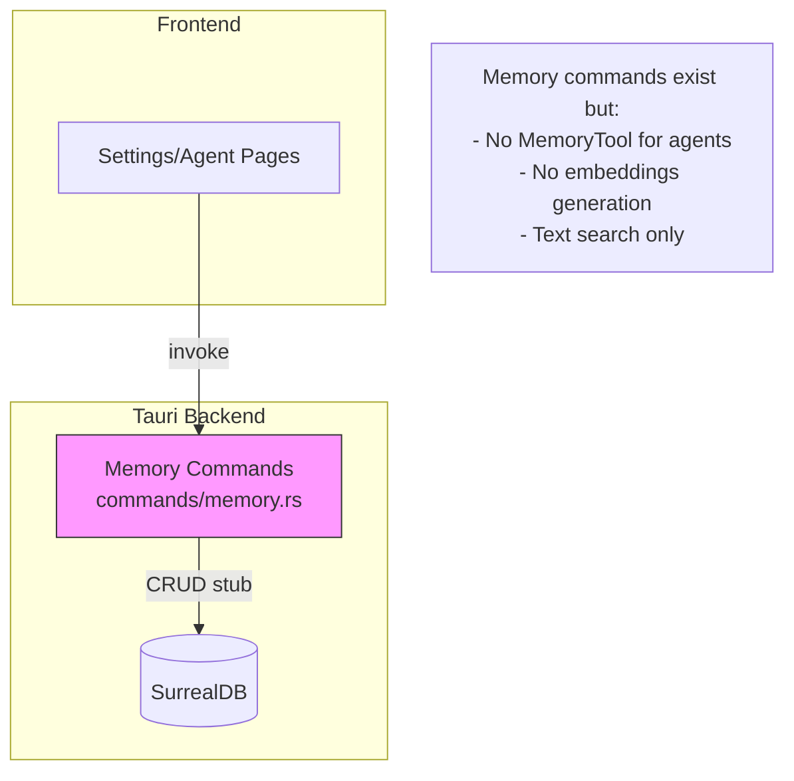
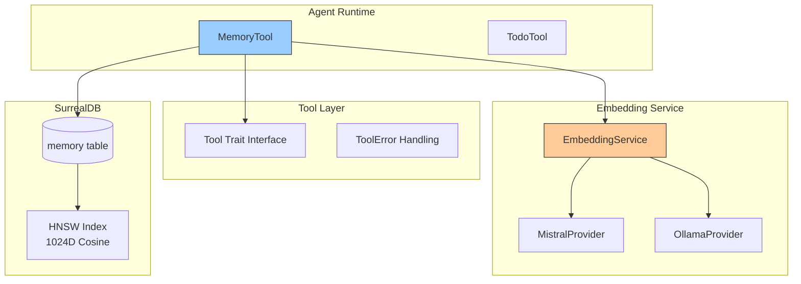
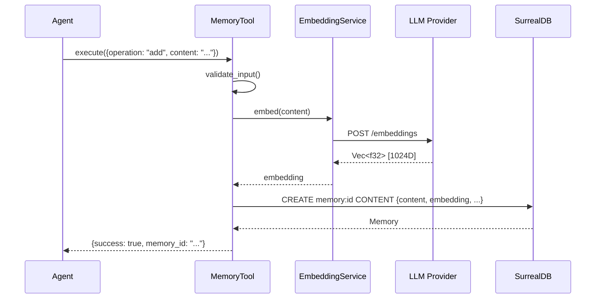
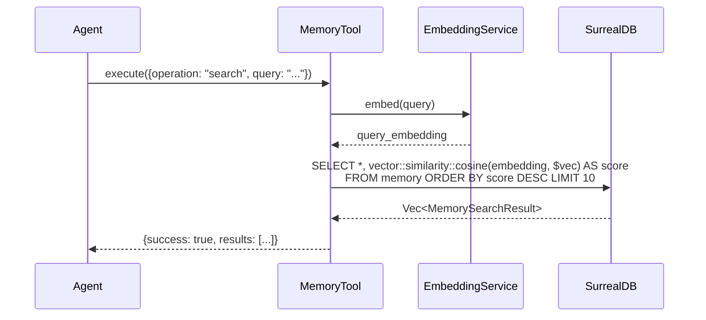

# Specification - Memory Tool for Agent Contextual Persistence

## Metadata
- **Date**: 2025-11-26
- **Stack**: Svelte 5.43 + Rust 1.91 + Tauri 2.9 + SurrealDB 2.3 + Rig.rs 0.24
- **Complexity**: Complex
- **Phase**: 7 (Post-Phase 6 Integration)

## Context

**Request**: Implement the Memory Tool for agent contextual persistence with vector embeddings and semantic search capabilities.

**Objective**: Provide agents with a unified tool interface for storing, retrieving, and searching contextual memories using SurrealDB's vector search capabilities (HNSW index, KNN, cosine similarity).

**Scope**:
- **Included**:
  - MemoryTool trait implementation following TodoTool patterns
  - Embedding generation via LLM providers (Mistral, Ollama)
  - Vector-based semantic search with HNSW index
  - Workflow-scoped and general memory management
  - Integration with existing memory Tauri commands

- **Excluded**:
  - OpenAI provider (future phase)
  - Memory graph relations (future enhancement)
  - Metacognitive operations (future phase)

**Decisions Resolved**:
1. **Default Provider**: Mistral (cloud) as primary embedding provider
2. **Fallback Behavior**: Text search fallback if embedding generation fails
3. **Migration Strategy**: User configures embedding model in Settings UI before use (no default)
   - Settings section: Memory Tool Settings (per FRONTEND_SPECIFICATIONS.md)
   - User must configure: provider, model, chunk size, overlap
   - CRUD operations available for memory management

**Success Criteria**:
- [ ] MemoryTool implements Tool trait with 8 operations
- [ ] Embedding generation integrated with Mistral and Ollama
- [ ] Vector search returns semantically relevant results
- [ ] All operations respect workflow scope isolation
- [ ] Unit tests cover all operations with >80% coverage
- [ ] Integration tests verify SurrealDB vector search

---

## Current State

### Architecture Existante



### Patterns Identifies

| Pattern | Usage | Files |
|---------|-------|-------|
| **Tool Trait** | Agent tool interface | `src-tauri/src/tools/mod.rs` |
| **TodoTool** | Reference implementation | `src-tauri/src/tools/todo/tool.rs` |
| **Memory Model** | Data structures | `src-tauri/src/models/memory.rs` |
| **DB Client** | Query patterns | `src-tauri/src/db/client.rs` |
| **HNSW Index** | Vector search ready | `src-tauri/src/db/schema.rs:45-46` |

### Code Reusable

**Backend** (`src-tauri/src/`):
- `models/memory.rs`: `Memory`, `MemoryCreate`, `MemoryWithEmbedding`, `MemorySearchResult`
- `commands/memory.rs`: CRUD logic (can be extracted into shared functions)
- `tools/mod.rs`: `Tool` trait, `ToolDefinition`, `ToolError` types
- `tools/todo/tool.rs`: Complete reference for operation dispatch pattern
- `db/client.rs`: `DBClient` with query methods

**Database**:
- Schema with HNSW index already defined (line 45-46)
- `memory` table with `embedding` field (unused but ready)

---

## Architecture Proposed

### Diagram



### Data Flow - Add Memory with Embedding



### Data Flow - Semantic Search



---

## Components

### 1. EmbeddingService

**Path**: `src-tauri/src/llm/embedding.rs` (NEW)

**Purpose**: Abstraction for embedding generation across providers

**Struct**:
```rust
pub struct EmbeddingService {
    provider: EmbeddingProvider,
    dimension: usize,
    batch_size: usize,
}

#[derive(Clone)]
pub enum EmbeddingProvider {
    Mistral { api_key: String, model: String },     // mistral-embed (1024D)
    Ollama { base_url: String, model: String },     // nomic-embed-text (768D) / mxbai-embed-large (1024D)
}
```

**Methods**:
```rust
impl EmbeddingService {
    pub async fn new(provider: EmbeddingProvider) -> Result<Self, EmbeddingError>;
    pub async fn embed(&self, text: &str) -> Result<Vec<f32>, EmbeddingError>;
    pub async fn embed_batch(&self, texts: &[&str]) -> Result<Vec<Vec<f32>>, EmbeddingError>;
    pub fn dimension(&self) -> usize;
}
```

**Error Type**:
```rust
#[derive(Debug, thiserror::Error)]
pub enum EmbeddingError {
    #[error("API request failed: {0}")]
    RequestFailed(String),
    #[error("Invalid response format: {0}")]
    InvalidResponse(String),
    #[error("Provider not configured: {0}")]
    NotConfigured(String),
    #[error("Text too long: {0} chars, max {1}")]
    TextTooLong(usize, usize),
}
```

### 2. MemoryTool

**Path**: `src-tauri/src/tools/memory/tool.rs` (NEW)

**Purpose**: Agent tool for memory operations with semantic search

**Struct**:
```rust
pub struct MemoryTool {
    /// Database client for persistence
    db: Arc<DBClient>,
    /// Embedding service for vector generation
    embedding_service: Option<Arc<EmbeddingService>>,
    /// Current workflow ID (scope) - None for general mode
    workflow_id: Option<String>,
    /// Agent ID using this tool
    agent_id: String,
}
```

**Constructor**:
```rust
impl MemoryTool {
    /// Creates a new MemoryTool with optional embedding support.
    ///
    /// # Arguments
    /// * `db` - Database client for persistence
    /// * `embedding_service` - Optional embedding service (None = text search only)
    /// * `workflow_id` - Workflow ID for scoping (None = general mode)
    /// * `agent_id` - Agent ID using this tool
    pub fn new(
        db: Arc<DBClient>,
        embedding_service: Option<Arc<EmbeddingService>>,
        workflow_id: Option<String>,
        agent_id: String,
    ) -> Self;

    /// Switches to workflow-scoped mode.
    pub fn activate_workflow(&mut self, workflow_id: String);

    /// Switches to general mode (no workflow scope).
    pub fn activate_general(&mut self);
}
```

### 3. Operations

**8 operations** following AGENT_TOOLS_DOCUMENTATION.md:

| Operation | Description | Parameters |
|-----------|-------------|------------|
| `activate_workflow` | Set workflow-specific scope | `workflow_id` |
| `activate_general` | Switch to general mode | (none) |
| `add` | Add new memory with embedding | `type`, `content`, `metadata?`, `tags?` |
| `get` | Retrieve memory by ID | `memory_id` |
| `list` | List memories with filters | `type_filter?`, `limit?` |
| `search` | Semantic search | `query`, `limit?`, `type_filter?`, `threshold?` |
| `delete` | Remove memory | `memory_id` |
| `clear_by_type` | Bulk delete by type | `type` |

---

## Types Synchronizes

### Rust Models

**Definition** (`src-tauri/src/models/memory.rs`) - EXISTING, minor updates:

```rust
/// Memory creation with embedding support
#[derive(Debug, Clone, Serialize)]
pub struct MemoryCreateWithEmbedding {
    #[serde(rename = "type")]
    pub memory_type: String,
    pub content: String,
    pub embedding: Vec<f32>,         // NEW: Required embedding
    pub metadata: serde_json::Value,
    pub workflow_id: Option<String>, // NEW: Optional workflow scope
}
```

**NEW Types** (`src-tauri/src/llm/embedding.rs`):

```rust
/// Embedding provider configuration
#[derive(Debug, Clone, Serialize, Deserialize)]
pub struct EmbeddingConfig {
    pub provider: String,           // "mistral" | "ollama"
    pub model: String,              // "mistral-embed" | "nomic-embed-text"
    pub dimension: usize,           // 768 | 1024 | 1536
    pub max_tokens: usize,          // Max input tokens
}
```

### TypeScript Types

**Definition** (`src/types/memory.ts`) - EXISTING, no frontend changes needed:

```typescript
// Already defined and synchronized
export interface Memory { ... }
export interface MemorySearchResult { ... }
export type MemoryType = 'user_pref' | 'context' | 'knowledge' | 'decision';
```

---

## Database

### Schema Updates

**Current** (`src-tauri/src/db/schema.rs:45-46`):
```sql
DEFINE FIELD embedding ON memory TYPE array<float>;
DEFINE INDEX memory_vec_idx ON memory FIELDS embedding HNSW DIMENSION 1536 DIST COSINE;
```

**Updated** (change dimension to 1024 for Mistral/Ollama compatibility):
```sql
-- Drop and recreate with correct dimension
REMOVE INDEX memory_vec_idx ON TABLE memory;
DEFINE INDEX memory_vec_idx ON memory FIELDS embedding HNSW DIMENSION 1024 DIST COSINE;

-- Add workflow_id field for scoping
DEFINE FIELD workflow_id ON memory TYPE option<string>;
DEFINE INDEX memory_workflow_idx ON memory FIELDS workflow_id;
```

### Vector Search Queries

**Semantic Search**:
```sql
SELECT
    meta::id(id) AS id,
    type,
    content,
    metadata,
    created_at,
    vector::similarity::cosine(embedding, $query_embedding) AS score
FROM memory
WHERE ($workflow_id IS NONE OR workflow_id = $workflow_id)
  AND ($type_filter IS NONE OR type = $type_filter)
  AND vector::distance::cosine(embedding, $query_embedding) < $threshold
ORDER BY score DESC
LIMIT $limit
```

**List with Scope**:
```sql
SELECT meta::id(id) AS id, type, content, metadata, created_at
FROM memory
WHERE ($workflow_id IS NONE OR workflow_id = $workflow_id)
  AND ($type_filter IS NONE OR type = $type_filter)
ORDER BY created_at DESC
LIMIT $limit
```

---

## Implementation Plan

### Phase 1: Embedding Service (Foundation)

**Objective**: Create embedding generation abstraction

**Tasks**:
1. **Backend**: Create `src-tauri/src/llm/embedding.rs`
   - `EmbeddingService` struct with provider enum
   - `embed()` and `embed_batch()` methods
   - Mistral API integration (POST https://api.mistral.ai/v1/embeddings)
   - Ollama API integration (POST http://localhost:11434/api/embeddings)
   - Error handling with `EmbeddingError`

2. **Backend**: Update `src-tauri/src/llm/mod.rs`
   - Export `embedding` module
   - Re-export `EmbeddingService`, `EmbeddingProvider`, `EmbeddingError`

3. **Tests**: Create `src-tauri/src/llm/embedding_tests.rs`
   - Unit tests for request/response formatting
   - Mock tests for API responses

**Validation**:
- [ ] `cargo test llm::embedding` passes
- [ ] Embedding generation works with Mistral API
- [ ] Embedding generation works with Ollama local

### Phase 2: Schema Migration

**Objective**: Update database schema for vector search

**Tasks**:
1. **Database**: Update `src-tauri/src/db/schema.rs`
   - Change HNSW dimension from 1536 to 1024
   - Add `workflow_id` field and index
   - Create migration script for existing data

2. **Backend**: Create migration command
   - `migrate_memory_schema` Tauri command
   - Handle existing memories (set embedding to null, will be regenerated)

**Validation**:
- [ ] Schema migration runs without error
- [ ] Existing memories preserved (embedding field nulled)
- [ ] New index created with 1024D

### Phase 3: MemoryTool Implementation

**Objective**: Implement Tool trait for MemoryTool

**Tasks**:
1. **Backend**: Create `src-tauri/src/tools/memory/mod.rs`
   - Module exports

2. **Backend**: Create `src-tauri/src/tools/memory/tool.rs`
   - `MemoryTool` struct with `Arc<DBClient>`, `Arc<EmbeddingService>`
   - Constructor with workflow scoping
   - `activate_workflow()` and `activate_general()` methods

3. **Backend**: Implement operations (in `tool.rs`)
   - `add_memory()` - with embedding generation
   - `get_memory()` - by ID
   - `list_memories()` - with filters and pagination
   - `search_memories()` - vector similarity search
   - `delete_memory()` - by ID
   - `clear_by_type()` - bulk delete

4. **Backend**: Implement Tool trait
   - `definition()` - LLM-friendly description with examples
   - `execute()` - operation dispatch
   - `validate_input()` - comprehensive validation
   - `requires_confirmation()` - returns false

**Validation**:
- [ ] All 8 operations implemented
- [ ] Tool trait fully implemented
- [ ] Unit tests cover all operations

### Phase 4: Integration

**Objective**: Register tool and update agent system

**Tasks**:
1. **Backend**: Update `src-tauri/src/tools/mod.rs`
   - Add `pub mod memory;`
   - Export `MemoryTool`

2. **Backend**: Update agent factory/registry
   - Register MemoryTool as available tool
   - Configure embedding service based on settings

3. **Backend**: Update agent configuration parsing
   - Support `"MemoryTool"` in `[tools].enabled`

**Validation**:
- [ ] MemoryTool instantiates correctly in agent
- [ ] Tool shows in agent's available tools
- [ ] Operations work end-to-end

### Phase 5: Frontend Settings UI

**Objective**: Implement Memory Tool Settings section in Settings page

**Tasks**:
1. **Frontend**: Create `src/lib/components/settings/MemorySettings.svelte`
   - Embedding configuration form (provider, model, chunk, overlap)
   - Test embedding functionality

2. **Frontend**: Create `src/lib/components/settings/MemoryList.svelte`
   - Memory table with pagination
   - Filters (type, agent, search)
   - View/Edit/Delete actions

3. **Frontend**: Create `src/lib/components/settings/MemoryForm.svelte`
   - Add memory modal form
   - Edit memory modal form
   - Embedding preview

4. **Frontend**: Update `src/routes/settings/+page.svelte`
   - Add "Memory" section to sidebar navigation
   - Import and render MemorySettings component

5. **Backend**: Add new Tauri commands
   - `get_embedding_config`, `save_embedding_config`
   - `test_embedding`
   - `update_memory`, `export_memories`, `import_memories`
   - `get_memory_stats`, `regenerate_embeddings`

6. **Types**: Create `src/types/embedding.ts`
   - `EmbeddingConfig`, `MemoryStats` interfaces

**Validation**:
- [ ] Memory section visible in Settings sidebar
- [ ] Embedding config saves and loads correctly
- [ ] Memory CRUD works from UI
- [ ] Search returns relevant results

### Phase 6: Testing & Documentation

**Objective**: Comprehensive testing and documentation

**Tasks**:
1. **Tests**: Unit tests in `tool.rs`
   - Input validation tests
   - Operation logic tests (with mock DB)

2. **Tests**: Integration tests
   - Full workflow with real SurrealDB
   - Vector search accuracy tests

3. **Tests**: Frontend tests (Vitest)
   - MemorySettings component tests
   - MemoryList component tests

4. **Documentation**: Update `docs/AGENT_TOOLS_DOCUMENTATION.md`
   - Mark Memory Tool as "Implemented"
   - Add usage examples

5. **Documentation**: Add Rustdoc comments
   - All public structs and methods documented

**Validation**:
- [ ] `cargo test tools::memory` passes
- [ ] `npm run test` passes
- [ ] Integration tests pass
- [ ] Documentation complete

---

## Estimation

| Phase | Description | Effort | Notes |
|-------|-------------|--------|-------|
| 1 | Embedding Service | 4-6h | New abstraction, API integration |
| 2 | Schema Migration | 2-3h | Simple migration, index update |
| 3 | MemoryTool Implementation | 6-8h | Main implementation |
| 4 | Integration | 2-3h | Registration, configuration |
| 5 | Frontend Settings UI | 6-8h | Memory settings section, CRUD UI |
| 6 | Testing & Documentation | 3-4h | Tests, docs |
| **Total** | | **23-34h** | ~4-5 days |

**Factors**:
- **Reduction** (-20%): TodoTool patterns well established, reusable
- **Reduction** (-10%): Memory models already exist
- **Increase** (+15%): Embedding API integration (external dependency)
- **Increase** (+10%): Vector search query complexity

---

## Risk Analysis

| Risk | Probability | Impact | Mitigation | Plan B |
|------|-------------|--------|------------|--------|
| **Embedding API latency** | Medium | Medium | Batch operations, caching | Local Ollama fallback |
| **Dimension mismatch** | Low | High | Strict validation, config check | Support multiple dimensions |
| **HNSW performance** | Low | Medium | Tune M, ef parameters | Fallback to linear scan |
| **Memory overuse** | Medium | Medium | Limit content size (50KB) | Truncation strategy |
| **Ollama not available** | Medium | Low | Graceful degradation | Text search fallback |

### Technical Risks

**Embedding Generation**:
- Mistral API requires valid API key
- Ollama requires local server running
- Both may have rate limits or timeouts

**Mitigation**:
- Check provider availability on startup
- Implement timeout handling (30s default)
- Support text-only fallback mode

**Vector Search**:
- HNSW index rebuild on dimension change
- First search may be slow (index warming)

**Mitigation**:
- Migration script handles index rebuild
- Document expected first-search latency

---

## Tests

### Unit Tests (Vitest - Not Applicable)

Memory Tool is backend-only. No frontend tests required.

### Backend Tests (Rust)

**Location**: `src-tauri/src/tools/memory/tool.rs` (embedded)

```rust
#[cfg(test)]
mod tests {
    use super::*;

    #[test]
    fn test_tool_definition() {
        // Verify definition structure without DB
    }

    #[test]
    fn test_input_validation_add() {
        // Valid add input
        let input = serde_json::json!({
            "operation": "add",
            "type": "knowledge",
            "content": "Test content"
        });
        assert!(input.is_object());
    }

    #[test]
    fn test_input_validation_search() {
        // Valid search input
        let input = serde_json::json!({
            "operation": "search",
            "query": "find relevant info",
            "limit": 5
        });
        assert!(input.is_object());
    }

    #[test]
    fn test_memory_type_values() {
        let valid_types = ["user_pref", "context", "knowledge", "decision"];
        for t in valid_types {
            assert!(valid_types.contains(&t));
        }
    }
}
```

### Integration Tests

**Location**: `src-tauri/tests/memory_tool_integration.rs` (NEW)

```rust
#[tokio::test]
async fn test_memory_add_and_search() {
    // Setup test DB
    // Add memory with embedding
    // Search for similar content
    // Verify relevance scoring
}

#[tokio::test]
async fn test_workflow_scoping() {
    // Add memories to workflow A
    // Add memories to workflow B
    // Verify isolation in search results
}
```

---

## Considerations

### Performance

- **Embedding Caching**: Cache embeddings for frequently accessed memories
- **Batch Operations**: Use `embed_batch()` for multiple memories
- **Query Optimization**: HNSW index provides O(log n) search
- **Connection Pooling**: Reuse HTTP connections for embedding API

### Security

- **API Key Storage**: Embedding API keys via Tauri secure storage
- **Input Validation**: Max content size (50KB), sanitize metadata
- **Scope Isolation**: Workflow memories isolated per workflow_id

### Tauri Specific

- **State Management**: `EmbeddingService` in Tauri managed state
- **Async Operations**: All embedding/search ops are async
- **Error Propagation**: ToolError converts to Tauri command error

---

## Dependencies

### Backend (Cargo.toml)

No new dependencies required. Using existing:

| Crate | Version | Usage |
|-------|---------|-------|
| `reqwest` | Existing | HTTP client for embedding APIs |
| `serde_json` | 1.0.145 | JSON parsing |
| `tokio` | 1.48.0 | Async runtime |
| `async-trait` | 0.1 | Tool trait async methods |
| `uuid` | Existing | Memory ID generation |
| `thiserror` | Existing | Error types |
| `tracing` | Existing | Instrumentation |

### Frontend (package.json)

No new dependencies. Frontend UI uses existing components.

---

## Frontend: Memory Tool Settings UI

Per `docs/FRONTEND_SPECIFICATIONS.md` section "Memory Tool Settings", the Settings page must include:

### Settings Page Section: Memory Tool

**Path**: `src/routes/settings/+page.svelte` (existing, add section)

**Components Required**:
- `src/lib/components/settings/MemorySettings.svelte` (NEW)
- `src/lib/components/settings/MemoryList.svelte` (NEW)
- `src/lib/components/settings/MemoryForm.svelte` (NEW)

### UI Specifications

#### 1. Embedding Model Configuration

```svelte
<section class="embedding-config">
  <h3>Embedding Model</h3>

  <!-- Provider Selection -->
  <Select
    label="Provider"
    bind:value={embeddingConfig.provider}
    options={activeProviders}
    helpText="Select from enabled LLM providers"
  />

  <!-- Model Selection (conditional on provider) -->
  <Select
    label="Embedding Model"
    bind:value={embeddingConfig.model}
    options={availableModels}
    helpText={modelHelpText}
  />

  <!-- Dimension (auto-set based on model, read-only display) -->
  <Input
    label="Dimensions"
    value={embeddingConfig.dimension}
    readonly
    helpText="Vector dimensions (set by model)"
  />

  <!-- Chunking Settings -->
  <div class="chunking-settings">
    <h4>Chunking</h4>

    <Input
      type="range"
      label="Chunk Size"
      bind:value={embeddingConfig.chunkSize}
      min={100}
      max={2000}
      helpText="Characters per chunk (default: 512)"
    />

    <Input
      type="range"
      label="Overlap"
      bind:value={embeddingConfig.overlap}
      min={0}
      max={500}
      helpText="Overlap between chunks (default: 50)"
    />

    <Select
      label="Strategy"
      bind:value={embeddingConfig.strategy}
      options={[
        { value: 'fixed', label: 'Fixed' },
        { value: 'semantic', label: 'Semantic' },
        { value: 'recursive', label: 'Recursive' }
      ]}
    />
  </div>

  <!-- Test Embedding -->
  <div class="test-embedding">
    <Textarea
      label="Test Text"
      bind:value={testText}
      placeholder="Enter text to test embedding generation..."
    />
    <Button on:click={testEmbedding}>Test Embedding</Button>
    {#if testResult}
      <pre class="embedding-preview">{testResult}</pre>
    {/if}
  </div>
</section>
```

**Model Help Text (per provider)**:
- **Mistral**: "mistral-embed produces 1024D vectors. Recommended for semantic search."
- **Ollama**: "nomic-embed-text (768D) for speed, mxbai-embed-large (1024D) for accuracy."

#### 2. Memory List (CRUD)

```svelte
<section class="memory-list">
  <h3>Memories</h3>

  <!-- Filters -->
  <div class="filters">
    <Select
      label="Type"
      bind:value={typeFilter}
      options={memoryTypes}
      placeholder="All types"
    />

    <Select
      label="Agent Source"
      bind:value={agentFilter}
      options={agents}
      placeholder="All agents"
    />

    <Input
      type="search"
      label="Semantic Search"
      bind:value={searchQuery}
      placeholder="Search memories..."
      on:input={debounce(searchMemories, 300)}
    />
  </div>

  <!-- Memory Table -->
  <table class="memory-table">
    <thead>
      <tr>
        <th>Type</th>
        <th>Content</th>
        <th>Source</th>
        <th>Date</th>
        <th>Tags</th>
        <th>Actions</th>
      </tr>
    </thead>
    <tbody>
      {#each memories as memory}
        <tr>
          <td><Badge variant={memory.type}>{memory.type}</Badge></td>
          <td class="content-preview">{truncate(memory.content, 100)}</td>
          <td>{memory.metadata.agent_source || '-'}</td>
          <td>{formatDate(memory.created_at)}</td>
          <td>{memory.metadata.tags?.join(', ') || '-'}</td>
          <td class="actions">
            <Button size="sm" variant="ghost" on:click={() => viewMemory(memory)}>View</Button>
            <Button size="sm" variant="ghost" on:click={() => editMemory(memory)}>Edit</Button>
            <Button size="sm" variant="danger" on:click={() => deleteMemory(memory.id)}>Delete</Button>
          </td>
        </tr>
      {/each}
    </tbody>
  </table>

  <!-- Pagination -->
  <Pagination
    currentPage={page}
    totalItems={totalMemories}
    itemsPerPage={50}
    on:change={loadPage}
  />
</section>
```

#### 3. Add Memory Form (Modal)

```svelte
<Modal bind:open={showAddModal} title="Add Memory">
  <form on:submit|preventDefault={addMemory}>
    <Select
      label="Type"
      bind:value={newMemory.type}
      options={memoryTypes}
      required
    />

    <Textarea
      label="Content"
      bind:value={newMemory.content}
      maxlength={5000}
      rows={6}
      required
      helpText="Maximum 5000 characters"
    />

    <Input
      label="Tags"
      bind:value={newMemory.tags}
      placeholder="tag1, tag2, tag3"
      helpText="Comma-separated tags"
    />

    <Input
      type="range"
      label="Priority"
      bind:value={newMemory.priority}
      min={0}
      max={1}
      step={0.1}
      helpText="0.0 (low) to 1.0 (high)"
    />

    <Select
      label="Workflow Association"
      bind:value={newMemory.workflowId}
      options={workflows}
      placeholder="None (general)"
    />

    <!-- Embedding Preview -->
    {#if embeddingPreview}
      <div class="embedding-preview">
        <h4>Embedding Preview</h4>
        <code>Dimension: {embeddingPreview.dimension}</code>
        <code>First 5 values: [{embeddingPreview.values.slice(0, 5).join(', ')}...]</code>
      </div>
    {/if}

    <div class="actions">
      <Button type="button" variant="secondary" on:click={() => showAddModal = false}>
        Cancel
      </Button>
      <Button type="submit" disabled={!newMemory.content}>
        Save Memory
      </Button>
    </div>
  </form>
</Modal>
```

#### 4. Global Actions

```svelte
<section class="global-actions">
  <h3>Actions</h3>

  <div class="action-buttons">
    <Button on:click={exportMemories}>Export All (JSON)</Button>
    <Button on:click={exportCSV}>Export All (CSV)</Button>
    <Button variant="secondary" on:click={() => showImportModal = true}>Import</Button>
  </div>

  <div class="purge-section">
    <h4>Purge Memories</h4>
    <Select
      label="By Type"
      bind:value={purgeType}
      options={memoryTypes}
      placeholder="Select type..."
    />
    <Input
      type="number"
      label="Older than (days)"
      bind:value={purgeDays}
      min={1}
    />
    <Button variant="danger" on:click={purgeMemories}>
      Purge Selected
    </Button>
  </div>

  <div class="statistics">
    <h4>Statistics</h4>
    <p>Total memories: {stats.total}</p>
    <p>With embeddings: {stats.withEmbeddings}</p>
    <p>Without embeddings: {stats.withoutEmbeddings}</p>
    <!-- Pie chart for type distribution -->
    <PieChart data={stats.byType} />
  </div>
</section>
```

### Tauri Commands Required (Frontend)

| Command | TypeScript Call | Purpose |
|---------|-----------------|---------|
| `get_embedding_config` | `invoke('get_embedding_config')` | Load current config |
| `save_embedding_config` | `invoke('save_embedding_config', { config })` | Save config |
| `test_embedding` | `invoke('test_embedding', { text })` | Test embedding generation |
| `list_memories` | `invoke('list_memories', { typeFilter?, limit?, offset? })` | List with pagination |
| `search_memories` | `invoke('search_memories', { query, limit?, typeFilter? })` | Semantic search |
| `add_memory` | `invoke('add_memory', { memoryType, content, metadata })` | Create memory |
| `update_memory` | `invoke('update_memory', { memoryId, content?, metadata? })` | Update memory |
| `delete_memory` | `invoke('delete_memory', { memoryId })` | Delete single |
| `clear_memories_by_type` | `invoke('clear_memories_by_type', { memoryType })` | Bulk delete |
| `export_memories` | `invoke('export_memories', { format })` | Export JSON/CSV |
| `import_memories` | `invoke('import_memories', { data })` | Import from JSON |
| `get_memory_stats` | `invoke('get_memory_stats')` | Get statistics |
| `regenerate_embeddings` | `invoke('regenerate_embeddings', { typeFilter? })` | Re-embed existing |

### TypeScript Types (Frontend)

```typescript
// src/types/embedding.ts (NEW)

export interface EmbeddingConfig {
  provider: string;           // 'mistral' | 'ollama'
  model: string;              // 'mistral-embed' | 'nomic-embed-text' | 'mxbai-embed-large'
  dimension: number;          // Auto-set based on model
  chunkSize: number;          // 100-2000, default 512
  overlap: number;            // 0-500, default 50
  strategy: 'fixed' | 'semantic' | 'recursive';
}

export interface MemoryStats {
  total: number;
  withEmbeddings: number;
  withoutEmbeddings: number;
  byType: Record<string, number>;
  byAgent: Record<string, number>;
}

// Update src/types/memory.ts
export interface Memory {
  id: string;
  memory_type: MemoryType;
  content: string;
  embedding?: number[];       // Optional (may not exist yet)
  metadata: MemoryMetadata;
  created_at: string;
}

export interface MemoryMetadata {
  agent_source?: string;
  priority?: number;
  tags?: string[];
  workflow_id?: string;
}
```

---

## File Structure

```
src-tauri/src/
├── llm/
│   ├── mod.rs              # Add: pub mod embedding;
│   ├── embedding.rs        # NEW: EmbeddingService, providers
│   └── ...
├── tools/
│   ├── mod.rs              # Add: pub mod memory; pub use memory::MemoryTool;
│   ├── memory/
│   │   ├── mod.rs          # NEW: Module exports
│   │   └── tool.rs         # NEW: MemoryTool implementation
│   └── ...
├── db/
│   └── schema.rs           # UPDATE: HNSW dimension, workflow_id field
├── models/
│   └── memory.rs           # UPDATE: Add MemoryCreateWithEmbedding
└── ...
```

---

## Next Steps

### Validation

- [ ] Architecture approved by team
- [ ] Embedding provider choice confirmed (Mistral default, Ollama local)
- [ ] HNSW dimension confirmed (1024D)

### Questions Resolved

1. **Embedding Provider Priority**: Mistral (cloud) as default provider
2. **Fallback Behavior**: Text search fallback when embedding fails (graceful degradation)
3. **Migration Strategy**: User-driven configuration via Settings UI
   - No automatic embedding generation on startup
   - User configures embedding model before using Memory Tool
   - Existing memories without embeddings use text search until user triggers re-embedding

### Implementation Order

1. Start with Phase 1 (Embedding Service) - foundation for all vector operations
2. Phase 2 (Schema Migration) - database ready for vectors
3. Phase 3 (MemoryTool) - main implementation
4. Phase 4-5 - integration and testing

---

## References

- **Architecture**: `docs/TECH_STACK.md`
- **Agent Tools Spec**: `docs/AGENT_TOOLS_DOCUMENTATION.md`
- **TodoTool Reference**: `src-tauri/src/tools/todo/tool.rs`
- **Memory Models**: `src-tauri/src/models/memory.rs`
- **DB Schema**: `src-tauri/src/db/schema.rs`
- **SurrealDB Vector Search**: https://surrealdb.com/docs/surrealdb/reference-guide/vector-search
- **Mistral Embeddings**: https://docs.mistral.ai/api/#operation/createEmbedding
- **Ollama Embeddings**: https://github.com/ollama/ollama/blob/main/docs/api.md#embeddings

---

## Appendix: Tool Definition (LLM-Friendly)

```rust
fn definition(&self) -> ToolDefinition {
    ToolDefinition {
        id: "MemoryTool".to_string(),
        name: "Memory Manager".to_string(),
        description: r#"Manages persistent memory for contextual awareness and knowledge retrieval.

USE THIS TOOL TO:
- Store important information for future reference
- Search past memories by semantic similarity
- Maintain context across conversations
- Organize knowledge by type (user_pref, context, knowledge, decision)

OPERATIONS:
- activate_workflow: Set workflow-specific scope for memory isolation
- activate_general: Switch to general mode (cross-workflow access)
- add: Store new memory with automatic embedding generation
- get: Retrieve specific memory by ID
- list: View memories with optional type filter
- search: Find semantically similar memories using vector search
- delete: Remove a memory
- clear_by_type: Bulk delete all memories of a specific type

BEST PRACTICES:
- Use 'knowledge' type for facts and domain expertise
- Use 'decision' type for rationale behind choices
- Use 'context' type for conversation-specific information
- Use 'user_pref' type for user preferences and settings
- Activate workflow scope when working on specific tasks
- Search before adding to avoid duplicates

EXAMPLES:
1. Store knowledge:
   {"operation": "add", "type": "knowledge", "content": "SurrealDB supports HNSW vector indexing"}

2. Search memories:
   {"operation": "search", "query": "vector database indexing", "limit": 5}

3. Activate workflow scope:
   {"operation": "activate_workflow", "workflow_id": "wf_abc123"}

4. List user preferences:
   {"operation": "list", "type_filter": "user_pref"}"#.to_string(),

        input_schema: serde_json::json!({
            "type": "object",
            "properties": {
                "operation": {
                    "type": "string",
                    "enum": ["activate_workflow", "activate_general", "add", "get", "list", "search", "delete", "clear_by_type"],
                    "description": "The operation to perform"
                },
                "workflow_id": {
                    "type": "string",
                    "description": "Workflow ID (for activate_workflow)"
                },
                "type": {
                    "type": "string",
                    "enum": ["user_pref", "context", "knowledge", "decision"],
                    "description": "Memory type (for add)"
                },
                "content": {
                    "type": "string",
                    "maxLength": 50000,
                    "description": "Memory content (for add)"
                },
                "metadata": {
                    "type": "object",
                    "description": "Additional metadata (for add)"
                },
                "tags": {
                    "type": "array",
                    "items": {"type": "string"},
                    "description": "Classification tags (for add)"
                },
                "memory_id": {
                    "type": "string",
                    "description": "Memory ID (for get/delete)"
                },
                "query": {
                    "type": "string",
                    "description": "Search query (for search)"
                },
                "limit": {
                    "type": "integer",
                    "default": 10,
                    "description": "Max results (for list/search)"
                },
                "type_filter": {
                    "type": "string",
                    "enum": ["user_pref", "context", "knowledge", "decision"],
                    "description": "Filter by type (for list/search)"
                },
                "threshold": {
                    "type": "number",
                    "default": 0.7,
                    "description": "Similarity threshold 0-1 (for search)"
                }
            },
            "required": ["operation"]
        }),

        output_schema: serde_json::json!({
            "type": "object",
            "properties": {
                "success": {"type": "boolean"},
                "memory_id": {"type": "string"},
                "message": {"type": "string"},
                "memory": {"type": "object"},
                "memories": {"type": "array"},
                "results": {"type": "array"},
                "count": {"type": "integer"},
                "scope": {"type": "string"}
            }
        }),

        requires_confirmation: false,
    }
}
```
