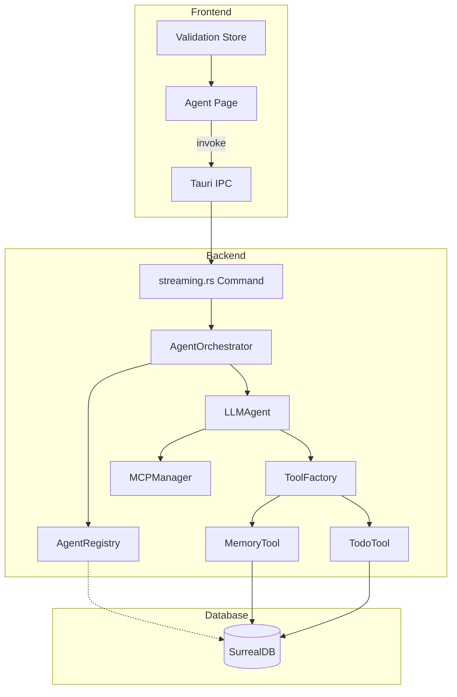
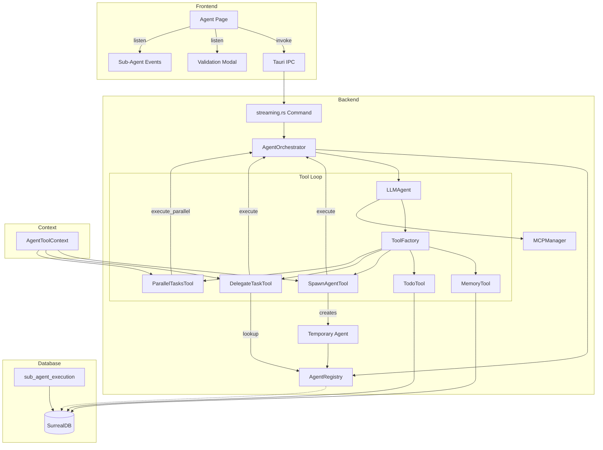

# Specification - Sub-Agent System Implementation

## Metadata
- **Date**: 2025-11-27
- **Stack**: Svelte 5.43 + Rust 1.91 + Tauri 2.9 + SurrealDB 2.3
- **Complexity**: complex
- **Based on**: `docs/specs/2025-11-27_agent-system-analysis.md`
- **Author**: Claude Code Planning

---

## Context

### Request
Implement the complete sub-agent system as specified in the agent-system-analysis document. This includes creating tools for spawning, delegating, and parallel execution of sub-agents with validation integration.

### Objective
Enable dynamic multi-agent workflows where a primary agent can:
1. Spawn temporary sub-agents for parallel processing
2. Delegate tasks to existing permanent agents
3. Execute multiple tasks in parallel with result aggregation
4. Require human-in-the-loop validation for sub-agent operations

### Scope

**Included:**
- SpawnAgentTool - Dynamic temporary agent creation and execution
- DelegateTaskTool - Task delegation to existing agents
- ParallelTasksTool - Parallel batch execution using existing `execute_parallel()`
- Validation UI for sub-agent approval/rejection
- Streaming events for sub-agent execution status
- SurrealDB persistence for sub-agent execution logs

**Excluded:**
- Inter-agent messaging system (deferred to Phase 7)
- Agent templates/presets system
- Advanced result aggregation strategies

### Sub-Agent Hierarchy Rules (CRITICAL)

```
┌─────────────────────────────────────────────────────────────┐
│                    WORKFLOW STARTER (A)                      │
│                   Primary/Orchestrator Agent                 │
│                                                              │
│   CAN: Spawn up to 3 sub-agents (sequential or parallel)   │
│   CAN: Use SpawnAgentTool, DelegateTaskTool, ParallelTasks  │
│                                                              │
│         ┌──────────┬──────────┬──────────┐                  │
│         ▼          ▼          ▼          │                  │
│      Sub-B      Sub-C      Sub-D         │                  │
│         │          │          │          │                  │
│         └──────────┴──────────┴──────────┘                  │
│                         │                                    │
│                    Reports ONLY                              │
│                         ▼                                    │
│                    Back to A                                 │
└─────────────────────────────────────────────────────────────┘
```

**Constraints:**

| Rule | Description |
|------|-------------|
| **Single Level Only** | NO chaining: A spawns B, but B CANNOT spawn C |
| **Maximum 3 Sub-Agents** | Per workflow, the primary agent can spawn/delegate to max 3 sub-agents |
| **Report to Parent** | Sub-agents ONLY return their report to the primary agent (A) |
| **No Sub-Agent Tools** | SpawnAgentTool, DelegateTaskTool, ParallelTasksTool are NOT available to sub-agents |
| **Primary Agent Only** | Only the workflow starter agent has access to sub-agent tools |

**Valid Patterns:**
- A spawns B (sequential) -> B reports to A
- A spawns B, C, D in parallel -> All report to A
- A delegates to existing-agent-1 -> Reports to A
- A spawns B, then delegates to C -> Both report to A

**Invalid Patterns:**
- A spawns B, B spawns C (FORBIDDEN - chaining)
- A spawns B, C, D, E (FORBIDDEN - max 3 exceeded)
- B uses DelegateTaskTool (FORBIDDEN - sub-agent cannot delegate)

### Communication Pattern: "Prompt In, Report Out" (CRITICAL)

**Principle:** Agents are ISOLATED. No context, memory, or state is shared between agents.

```
┌─────────────────────────────────────────────────────────────┐
│                     AGENT A (Primary)                        │
│                                                              │
│  1. Constructs a COMPLETE prompt containing:                │
│     - Task description                                       │
│     - All necessary data/context (explicitly in prompt)     │
│     - Expected report format                                 │
│                                                              │
│  Example prompt:                                             │
│  "Analyze the database schema for table 'users'.            │
│   List all fields with their types.                         │
│   Return a markdown report with:                            │
│   - Table name                                               │
│   - Fields list (name, type, constraints)                   │
│   - Any indexes found"                                       │
│                                                              │
└─────────────────────┬───────────────────────────────────────┘
                      │
                      │  prompt: String (ONLY input)
                      ▼
┌─────────────────────────────────────────────────────────────┐
│                     SUB-AGENT B                              │
│                                                              │
│  RECEIVES: prompt (String) - nothing else                   │
│                                                              │
│  HAS ACCESS TO:                                              │
│  ✓ Own LLM (provider/model from config)                     │
│  ✓ Own tools (MemoryTool, TodoTool, MCP tools)              │
│  ✓ Own system_prompt (from config)                          │
│                                                              │
│  NO ACCESS TO:                                               │
│  ✗ Agent A's conversation history                           │
│  ✗ Agent A's memories (MemoryTool data)                     │
│  ✗ Agent A's workflow context                               │
│  ✗ Agent A's tool results                                   │
│  ✗ Any shared state                                          │
│                                                              │
│  EXECUTES: Task autonomously with own tools                 │
│  GENERATES: Report in format requested by prompt            │
│                                                              │
└─────────────────────┬───────────────────────────────────────┘
                      │
                      │  report: String (Markdown)
                      │  + metrics: { duration_ms, tokens }
                      ▼
┌─────────────────────────────────────────────────────────────┐
│                     AGENT A (Primary)                        │
│                                                              │
│  2. Receives sub-agent's report as tool result              │
│                                                              │
│  3. Parses/integrates report into own reasoning             │
│     (Agent A is responsible for extracting data)            │
│                                                              │
│  4. Continues workflow with enriched context                │
│                                                              │
└─────────────────────────────────────────────────────────────┘
```

**Data Flow Rules:**

| What | From A to B | From B to A |
|------|-------------|-------------|
| Prompt text | YES (explicit) | - |
| Report text | - | YES (result) |
| Execution metrics | - | YES (duration, tokens) |
| Conversation history | NO | NO |
| Memory data | NO | NO |
| Tool results | NO | NO |
| Workflow state | NO | NO |

**Prompt Construction Best Practices (for Agent A):**

```markdown
# Good Prompt Structure for Sub-Agent

## Task
[Clear description of what to do]

## Input Data
[Any data the sub-agent needs, copied explicitly into prompt]

## Expected Output Format
[Exact format for the report - headers, sections, etc.]

## Constraints
[Any limitations or requirements]
```

**Report Format (Sub-Agent B returns):**

```markdown
# [Task Name] Report

## Summary
[Brief overview of findings]

## Details
[Detailed results]

## Metrics (auto-generated)
- Duration: X ms
- Tokens used: Y
```

### Success Criteria
- [ ] SpawnAgentTool creates and executes temporary sub-agents
- [ ] DelegateTaskTool delegates tasks to existing agents
- [ ] ParallelTasksTool uses existing `execute_parallel()` method
- [ ] Validation modal appears for sub-agent operations
- [ ] Sub-agent execution logs persist to SurrealDB
- [ ] All existing tests pass (cargo test, npm run test)
- [ ] New tools have unit test coverage

**Constraint Validation:**
- [ ] Sub-agents CANNOT access SpawnAgentTool/DelegateTaskTool/ParallelTasksTool
- [ ] Maximum 3 sub-agents enforced per workflow
- [ ] Error returned if sub-agent tries to spawn/delegate
- [ ] Sub-agent reports correctly returned to primary agent

---

## Current State

### Architecture Existing



### Prepared but Unused Code

| Component | Location | Status |
|-----------|----------|--------|
| `execute_parallel()` | `orchestrator.rs:99-141` | `#[allow(dead_code)]` |
| `cleanup_temporary()` | `registry.rs:101-124` | `#[allow(dead_code)]` |
| `ValidationType::SubAgent` | `validation.rs:22` | Defined, unused |

### Patterns Identified

1. **Tool Pattern** (MemoryTool, TodoTool):
   - Struct with `Arc<DBClient>` and context
   - Trait `Tool` with `definition()`, `execute()`, `validate_input()`
   - Dispatch by operation string in `execute()`
   - JSON Schema for input validation

2. **Factory Pattern** (ToolFactory):
   - `create_tool(name, workflow_id, agent_id)` -> `Arc<dyn Tool>`
   - Dependencies injected via struct fields
   - `available_tools()` returns known tools list

3. **Validation Pattern**:
   - `create_validation_request()` command
   - `ValidationRequest` struct with `ValidationType`, `RiskLevel`
   - Frontend listens for pending validations

### Code Reusable

| Component | Location | Reuse For |
|-----------|----------|-----------|
| Tool trait | `src-tauri/src/tools/mod.rs:166-246` | All new tools |
| ToolFactory | `src-tauri/src/tools/factory.rs` | Tool instantiation |
| execute_parallel | `src-tauri/src/agents/core/orchestrator.rs:99-141` | ParallelTasksTool |
| cleanup_temporary | `src-tauri/src/agents/core/registry.rs:101-124` | SpawnAgentTool cleanup |
| ValidationType::SubAgent | `src-tauri/src/models/validation.rs:22` | Validation flow |
| Streaming pattern | `src-tauri/src/commands/streaming.rs` | Sub-agent events |

---

## Architecture Proposed

### Diagram



### New Components

#### 1. AgentToolContext (New Struct)

**Path**: `src-tauri/src/tools/context.rs`
**Type**: New file

Purpose: Provides agent-level dependencies to tools that need access to registry, orchestrator, etc.

```rust
// Definition
pub struct AgentToolContext {
    pub registry: Arc<AgentRegistry>,
    pub orchestrator: Arc<AgentOrchestrator>,
    pub llm_manager: Arc<ProviderManager>,
    pub mcp_manager: Option<Arc<MCPManager>>,
    pub tool_factory: Arc<ToolFactory>,
}

impl AgentToolContext {
    pub fn from_app_state(
        app_state: &AppState,
        mcp_manager: Option<Arc<MCPManager>>,
    ) -> Self { ... }
}
```

#### 2. SpawnAgentTool (New Tool)

**Path**: `src-tauri/src/tools/spawn_agent.rs`
**Type**: New file

```rust
pub struct SpawnAgentTool {
    db: Arc<DBClient>,
    registry: Arc<AgentRegistry>,
    orchestrator: Arc<AgentOrchestrator>,
    llm_manager: Arc<ProviderManager>,
    mcp_manager: Option<Arc<MCPManager>>,
    tool_factory: Arc<ToolFactory>,
    parent_agent_id: String,
    workflow_id: String,
    spawned_children: Arc<RwLock<Vec<String>>>,
    is_primary_agent: bool,  // TRUE only for workflow starter
}

// Constants
const MAX_SUB_AGENTS: usize = 3;
```

**Constraint Enforcement:**
```rust
impl SpawnAgentTool {
    async fn spawn(&self, args: &Value) -> ToolResult<Value> {
        // 1. Check if this agent is the primary (workflow starter)
        if !self.is_primary_agent {
            return Err(ToolError::PermissionDenied(
                "Only the primary workflow agent can spawn sub-agents. \
                 Sub-agents cannot create other sub-agents.".into()
            ));
        }

        // 2. Check sub-agent limit
        let current_count = self.spawned_children.read().await.len();
        if current_count >= MAX_SUB_AGENTS {
            return Err(ToolError::ValidationFailed(format!(
                "Maximum {} sub-agents reached. Cannot spawn more. \
                 Current sub-agents: {}",
                MAX_SUB_AGENTS, current_count
            )));
        }

        // 3. Proceed with spawn...
    }
}
```

**Operations:**
- `spawn`: Create temporary sub-agent, execute task, cleanup
- `list_children`: List active spawned sub-agents
- `terminate`: Force-stop a child agent

**Input Schema:**
```json
{
    "type": "object",
    "properties": {
        "operation": { "type": "string", "enum": ["spawn", "list_children", "terminate"] },
        "name": { "type": "string", "description": "Sub-agent name (for spawn)" },
        "prompt": {
            "type": "string",
            "description": "COMPLETE prompt for sub-agent. Must include task, any data needed, and expected report format. This is the ONLY input the sub-agent receives."
        },
        "system_prompt": { "type": "string", "description": "Custom system prompt (optional, overrides default)" },
        "tools": { "type": "array", "items": { "type": "string" }, "description": "Tools for sub-agent (default: parent's tools)" },
        "mcp_servers": { "type": "array", "items": { "type": "string" }, "description": "MCP servers (default: parent's)" },
        "provider": { "type": "string", "description": "LLM provider (default: parent's)" },
        "model": { "type": "string", "description": "Model ID (default: parent's)" },
        "child_id": { "type": "string", "description": "Child agent ID (for terminate)" }
    },
    "required": ["operation"]
}

// Note: For "spawn" operation, "name" and "prompt" are required
// No context/history is passed - only the prompt string
```

**Output Schema:**
```json
{
    "type": "object",
    "properties": {
        "success": { "type": "boolean" },
        "child_id": { "type": "string" },
        "report": { "type": "string", "description": "Sub-agent's markdown report" },
        "metrics": {
            "type": "object",
            "properties": {
                "duration_ms": { "type": "integer" },
                "tokens_input": { "type": "integer" },
                "tokens_output": { "type": "integer" }
            }
        }
    }
}
```

#### 3. DelegateTaskTool (New Tool)

**Path**: `src-tauri/src/tools/delegate_task.rs`
**Type**: New file

```rust
pub struct DelegateTaskTool {
    registry: Arc<AgentRegistry>,
    orchestrator: Arc<AgentOrchestrator>,
    mcp_manager: Option<Arc<MCPManager>>,
    current_agent_id: String,
    workflow_id: String,
    is_primary_agent: bool,  // TRUE only for workflow starter
    active_delegations: Arc<RwLock<Vec<String>>>,  // Track delegated agents
}
```

**Constraint Enforcement:** Same as SpawnAgentTool - only primary agent can delegate, max 3 total sub-agents (shared count with spawned).

**Operations:**
- `delegate`: Execute task via existing agent
- `list_agents`: List available agents for delegation

**Input Schema:**
```json
{
    "type": "object",
    "properties": {
        "operation": { "type": "string", "enum": ["delegate", "list_agents"] },
        "agent_id": { "type": "string", "description": "Target agent ID (for delegate)" },
        "prompt": {
            "type": "string",
            "description": "COMPLETE prompt for target agent. Must include task, any data needed, and expected report format. This is the ONLY input the target agent receives."
        }
    },
    "required": ["operation"]
}

// Note: For "delegate" operation, "agent_id" and "prompt" are required
// No context is passed - only the prompt string
// Target agent uses its own config (tools, mcp_servers, system_prompt)
```

#### 4. ParallelTasksTool (New Tool)

**Path**: `src-tauri/src/tools/parallel_tasks.rs`
**Type**: New file

```rust
pub struct ParallelTasksTool {
    orchestrator: Arc<AgentOrchestrator>,
    mcp_manager: Option<Arc<MCPManager>>,
    workflow_id: String,
    is_primary_agent: bool,  // TRUE only for workflow starter
}
```

**Constraint Enforcement:**
- Only primary agent can use parallel execution
- Maximum 3 agents in tasks array (enforced in validate_input)

**Operations:**
- `execute_batch`: Run multiple tasks in parallel (max 3 agents)

**Input Schema:**
```json
{
    "type": "object",
    "properties": {
        "operation": { "type": "string", "enum": ["execute_batch"] },
        "tasks": {
            "type": "array",
            "maxItems": 3,
            "description": "Array of agent-prompt pairs (max 3)",
            "items": {
                "type": "object",
                "properties": {
                    "agent_id": { "type": "string", "description": "Target agent ID" },
                    "prompt": { "type": "string", "description": "COMPLETE prompt for this agent" }
                },
                "required": ["agent_id", "prompt"]
            }
        },
        "wait_all": { "type": "boolean", "default": true }
    },
    "required": ["operation", "tasks"]
}
```

**Output Schema:**
```json
{
    "type": "object",
    "properties": {
        "success": { "type": "boolean" },
        "completed": { "type": "integer" },
        "failed": { "type": "integer" },
        "results": {
            "type": "array",
            "items": {
                "type": "object",
                "properties": {
                    "agent_id": { "type": "string" },
                    "success": { "type": "boolean" },
                    "report": { "type": "string" },
                    "error": { "type": "string" }
                }
            }
        },
        "aggregated_report": { "type": "string" }
    }
}
```

#### 5. Frontend: SubAgentValidation Component

**Path**: `src/lib/components/validation/SubAgentValidation.svelte`
**Type**: New file

```typescript
// Props
interface Props {
  request: ValidationRequest;
  onApprove: () => void;
  onReject: (reason: string) => void;
}

// Features
- Modal display with request details
- Risk level badge (warning/error)
- JSON pretty-print of details
- Approve/Reject buttons
- Optional rejection reason input
```

#### 6. Database: sub_agent_execution Table

**Path**: `src-tauri/src/db/schema.rs` (modification)
**Type**: Modification

```surql
-- Sub-agent execution tracking
DEFINE TABLE sub_agent_execution SCHEMAFULL;
DEFINE FIELD id ON sub_agent_execution TYPE string;
DEFINE FIELD workflow_id ON sub_agent_execution TYPE string;
DEFINE FIELD parent_agent_id ON sub_agent_execution TYPE string;
DEFINE FIELD sub_agent_id ON sub_agent_execution TYPE string;
DEFINE FIELD sub_agent_name ON sub_agent_execution TYPE string;
DEFINE FIELD task_description ON sub_agent_execution TYPE string;
DEFINE FIELD status ON sub_agent_execution TYPE string
    ASSERT $value IN ['pending', 'running', 'completed', 'error', 'cancelled'];
DEFINE FIELD duration_ms ON sub_agent_execution TYPE option<int>;
DEFINE FIELD tokens_input ON sub_agent_execution TYPE option<int>;
DEFINE FIELD tokens_output ON sub_agent_execution TYPE option<int>;
DEFINE FIELD result_summary ON sub_agent_execution TYPE option<string>;
DEFINE FIELD error_message ON sub_agent_execution TYPE option<string>;
DEFINE FIELD created_at ON sub_agent_execution TYPE datetime DEFAULT time::now();
DEFINE FIELD completed_at ON sub_agent_execution TYPE option<datetime>;

-- Indexes
DEFINE INDEX idx_sub_agent_workflow ON sub_agent_execution FIELDS workflow_id;
DEFINE INDEX idx_sub_agent_parent ON sub_agent_execution FIELDS parent_agent_id;
```

### Types Synchronized

**Backend** (`src-tauri/src/models/sub_agent.rs`) - New file:

```rust
#[derive(Debug, Clone, Serialize, Deserialize)]
pub struct SubAgentExecution {
    pub id: String,
    pub workflow_id: String,
    pub parent_agent_id: String,
    pub sub_agent_id: String,
    pub sub_agent_name: String,
    pub task_description: String,
    pub status: SubAgentStatus,
    pub duration_ms: Option<u64>,
    pub tokens_input: Option<u64>,
    pub tokens_output: Option<u64>,
    pub result_summary: Option<String>,
    pub error_message: Option<String>,
    pub created_at: DateTime<Utc>,
    pub completed_at: Option<DateTime<Utc>>,
}

#[derive(Debug, Clone, Serialize, Deserialize)]
#[serde(rename_all = "snake_case")]
pub enum SubAgentStatus {
    Pending,
    Running,
    Completed,
    Error,
    Cancelled,
}
```

**Frontend** (`src/types/sub-agent.ts`) - New file:

```typescript
export type SubAgentStatus = 'pending' | 'running' | 'completed' | 'error' | 'cancelled';

export interface SubAgentExecution {
  id: string;
  workflow_id: string;
  parent_agent_id: string;
  sub_agent_id: string;
  sub_agent_name: string;
  task_description: string;
  status: SubAgentStatus;
  duration_ms?: number;
  tokens_input?: number;
  tokens_output?: number;
  result_summary?: string;
  error_message?: string;
  created_at: string;
  completed_at?: string;
}

// Streaming events for sub-agents
export interface SubAgentStreamEvent {
  type: 'sub_agent_start' | 'sub_agent_complete' | 'sub_agent_error';
  workflow_id: string;
  parent_agent_id: string;
  sub_agent_id: string;
  sub_agent_name: string;
  data?: {
    report?: string;
    error?: string;
    metrics?: {
      duration_ms: number;
      tokens_input: number;
      tokens_output: number;
    };
  };
}
```

---

## Implementation Plan

### Phase A: Core Infrastructure (Day 1)

**Objective**: Create the foundational structures for agent-level tools

**Tasks:**

1. **Backend**: Create `src-tauri/src/tools/context.rs`
   - Define `AgentToolContext` struct
   - Implement `from_app_state()` constructor
   - Export in `tools/mod.rs`

2. **Backend**: Create `src-tauri/src/models/sub_agent.rs`
   - Define `SubAgentExecution` struct
   - Define `SubAgentStatus` enum
   - Export in `models/mod.rs`

3. **Backend**: Modify `src-tauri/src/tools/factory.rs`
   - Add `create_tool_with_context()` method
   - Update `available_tools()` to include new tools
   - Keep backward compatibility with existing `create_tool()`

4. **Database**: Add schema in `src-tauri/src/db/schema.rs`
   - Add `sub_agent_execution` table definition
   - Add indexes

**Dependencies**: None
**Validation**:
- [ ] `cargo check` passes
- [ ] Types compile correctly

### Phase B: SpawnAgentTool Implementation (Day 1-2)

**Objective**: Implement the primary sub-agent creation tool

**Tasks:**

1. **Backend**: Create `src-tauri/src/tools/spawn_agent.rs`
   - Implement struct with required dependencies
   - Implement `Tool` trait
   - Implement spawn operation:
     - Validate parent is Permanent
     - Generate sub-agent ID
     - Create AgentConfig with Lifecycle::Temporary
     - Create LLMAgent instance
     - Register in registry
     - Execute via orchestrator
     - Persist to sub_agent_execution table
     - Cleanup: unregister agent
   - Implement list_children operation
   - Implement terminate operation
   - Add validation request creation for spawn

2. **Backend**: Modify `src-tauri/src/tools/mod.rs`
   - Add `pub mod spawn_agent;`

3. **Backend**: Remove `#[allow(dead_code)]` from:
   - `orchestrator.rs:execute_parallel()` - NOT YET (used in Phase D)
   - `registry.rs:cleanup_temporary()`
   - `registry.rs:unregister()`

4. **Frontend**: Create `src/types/sub-agent.ts`
   - Add types as specified above

**Dependencies**: Phase A
**Validation**:
- [ ] SpawnAgentTool compiles
- [ ] Unit test: spawn creates temporary agent
- [ ] Unit test: terminate removes agent

### Phase C: DelegateTaskTool & ParallelTasksTool (Day 2)

**Objective**: Implement remaining tools

**Tasks:**

1. **Backend**: Create `src-tauri/src/tools/delegate_task.rs`
   - Implement struct with dependencies
   - Implement `Tool` trait
   - Implement delegate operation
   - Implement list_agents operation

2. **Backend**: Create `src-tauri/src/tools/parallel_tasks.rs`
   - Implement struct with dependencies
   - Implement `Tool` trait
   - Implement execute_batch using `orchestrator.execute_parallel()`
   - Implement result aggregation

3. **Backend**: Remove `#[allow(dead_code)]` from:
   - `orchestrator.rs:execute_parallel()`

4. **Backend**: Modify `src-tauri/src/tools/mod.rs`
   - Add `pub mod delegate_task;`
   - Add `pub mod parallel_tasks;`

5. **Backend**: Modify `src-tauri/src/tools/factory.rs`
   - Add cases in `create_tool_with_context()` for new tools

**Dependencies**: Phase A, Phase B
**Validation**:
- [ ] DelegateTaskTool compiles and works
- [ ] ParallelTasksTool uses execute_parallel
- [ ] Unit tests pass

### Phase D: Validation Integration (Day 2-3)

**Objective**: Integrate human-in-the-loop validation for sub-agent operations

**Tasks:**

1. **Backend**: Modify `src-tauri/src/tools/spawn_agent.rs`
   - Add validation request creation before spawn
   - Use `ValidationType::SubAgent`
   - Use `RiskLevel::Medium` for single spawn
   - Emit Tauri event for validation required

2. **Backend**: Create validation command for async approval
   - Add `wait_for_validation(validation_id)` helper
   - Or use event-based approval pattern

3. **Frontend**: Create `src/lib/components/validation/SubAgentValidation.svelte`
   - Modal component with request details
   - Approve/Reject buttons
   - Risk level visualization

4. **Frontend**: Modify `src/lib/stores/streaming.ts`
   - Add `pendingValidation` state
   - Add listener for `validation_required` event
   - Add actions for approve/reject

5. **Frontend**: Integrate validation in Agent page
   - Show modal when validation required
   - Handle approve/reject actions

**Dependencies**: Phase B
**Validation**:
- [ ] Validation modal appears for spawn operation
- [ ] Approval allows spawn to proceed
- [ ] Rejection cancels spawn

### Phase E: Streaming Events (Day 3)

**Objective**: Add real-time sub-agent execution events

**Tasks:**

1. **Backend**: Extend `StreamChunk` in `src-tauri/src/models/streaming.rs`
   - Add `sub_agent_start`, `sub_agent_complete`, `sub_agent_error` types

2. **Backend**: Modify `src-tauri/src/tools/spawn_agent.rs`
   - Emit `sub_agent_start` when spawning
   - Emit `sub_agent_complete` when done
   - Emit `sub_agent_error` on failure

3. **Frontend**: Extend `src/types/streaming.ts`
   - Add SubAgentStreamEvent type
   - Add new chunk types

4. **Frontend**: Modify streaming store
   - Handle sub-agent events
   - Track active sub-agents

5. **Frontend**: Add sub-agent visualization in Agent page
   - Show active sub-agents
   - Display progress/status

**Dependencies**: Phase B
**Validation**:
- [ ] Sub-agent start event received
- [ ] Sub-agent complete event with report
- [ ] UI shows sub-agent activity

### Phase F: Testing & Documentation (Day 3-4)

**Objective**: Comprehensive testing and documentation

**Tasks:**

1. **Backend**: Unit tests
   - `tests/spawn_agent_test.rs`
   - `tests/delegate_task_test.rs`
   - `tests/parallel_tasks_test.rs`

2. **Backend**: Integration tests
   - Test full spawn-execute-cleanup flow
   - Test parallel execution with multiple agents
   - Test validation approval flow

3. **Frontend**: Component tests
   - SubAgentValidation component
   - Streaming store with sub-agent events

4. **E2E**: Playwright tests
   - Spawn sub-agent scenario
   - Validation approval scenario

5. **Documentation**:
   - Update `docs/API_REFERENCE.md` with new tools
   - Update `docs/WORKFLOW_ORCHESTRATION.md` with examples
   - Add `docs/SUB_AGENT_GUIDE.md`

**Dependencies**: All phases
**Validation**:
- [ ] `cargo test` passes
- [ ] `npm run test` passes
- [ ] E2E tests pass
- [ ] Documentation complete

---

## Estimation

| Phase | Backend | Frontend | Database | Tests | Total |
|-------|---------|----------|----------|-------|-------|
| A: Infrastructure | 2h | 0.5h | 0.5h | - | 3h |
| B: SpawnAgentTool | 4h | 0.5h | - | 1h | 5.5h |
| C: Delegate & Parallel | 3h | - | - | 1h | 4h |
| D: Validation | 2h | 2h | - | 0.5h | 4.5h |
| E: Streaming | 1h | 2h | - | 0.5h | 3.5h |
| F: Testing & Docs | 1h | 0.5h | - | 3h | 4.5h |
| **Total** | **13h** | **5.5h** | **0.5h** | **6h** | **25h** |

**Factors:**

| Factor | Impact | Justification |
|--------|--------|---------------|
| Code Reuse | -15% | Tool patterns well established |
| execute_parallel exists | -10% | Core parallel logic ready |
| Validation system ready | -5% | ValidationType::SubAgent defined |
| New context injection | +10% | AgentToolContext is new pattern |
| Testing complexity | +5% | Multi-agent scenarios complex |

**Adjusted Total: ~22-24 hours (3-4 days)**

---

## Risk Analysis

| Risk | Probability | Impact | Mitigation | Plan B |
|------|-------------|--------|------------|--------|
| **Circular dependency** in AgentToolContext | Medium | High | Careful Arc/weak ref design | Use lazy initialization |
| **Race condition** in spawned_children tracking | Medium | Medium | Use RwLock, atomic operations | Single-threaded spawn |
| **Memory leak** from unreleased temporary agents | Low | High | cleanup_temporary on workflow end | Manual cleanup command |
| **Validation timeout** blocking tool loop | Medium | Medium | Async validation with timeout | Auto-approve with warning |
| **MCP connection sharing** between parent/child | Low | Medium | Clone MCPManager reference | Create new connections |
| **LLM rate limiting** with parallel agents | Medium | Low | Sequential fallback | Exponential backoff |

---

## Tests

### Backend (Rust)

```rust
// src-tauri/src/tools/spawn_agent_test.rs
#[tokio::test]
async fn test_spawn_creates_temporary_agent() {
    // Setup: Create tool with mock dependencies
    // Act: Call spawn operation
    // Assert: Agent registered with Lifecycle::Temporary
}

#[tokio::test]
async fn test_spawn_cleanup_on_completion() {
    // Setup: Spawn an agent
    // Act: Wait for execution to complete
    // Assert: Agent unregistered from registry
}

#[tokio::test]
async fn test_terminate_removes_agent() {
    // Setup: Spawn an agent
    // Act: Call terminate operation
    // Assert: Agent removed from registry
}

#[tokio::test]
async fn test_temporary_cannot_spawn() {
    // Setup: Tool with Temporary parent agent
    // Act: Attempt spawn
    // Assert: Error returned
}
```

### Frontend (Vitest)

```typescript
// src/lib/components/validation/SubAgentValidation.test.ts
describe('SubAgentValidation', () => {
  it('renders request details', () => {
    // Render component with mock request
    // Assert: Details displayed correctly
  });

  it('calls onApprove when approved', async () => {
    // Render with mock callbacks
    // Click approve button
    // Assert: onApprove called
  });

  it('shows risk badge based on level', () => {
    // Render with high risk request
    // Assert: Error badge displayed
  });
});
```

### E2E (Playwright)

```typescript
// tests/e2e/sub-agent.spec.ts
test('spawn sub-agent workflow', async ({ page }) => {
  // Navigate to agent page
  // Send message that triggers spawn
  // Approve validation modal
  // Verify sub-agent execution in timeline
});

test('reject sub-agent creation', async ({ page }) => {
  // Navigate to agent page
  // Send message that triggers spawn
  // Reject validation modal
  // Verify spawn was cancelled
});
```

---

## Considerations

### Performance
- **Agent Creation**: LLMAgent instantiation is lightweight (~1ms)
- **Parallel Execution**: futures::join_all is non-blocking
- **Registry Access**: RwLock allows concurrent reads
- **Cleanup**: Automatic via unregister after execution

### Security
- **Validation Required**: All spawn operations require approval
- **Lifecycle Restriction**: Temporary agents cannot spawn others
- **Tool Access**: Sub-agents inherit tools from parent config
- **MCP Access**: Sub-agents share parent's MCP connections (no new auth)

### Tauri Specific
- **Event Emission**: Use `window.emit()` for validation/streaming events
- **State Access**: AppState available in all commands
- **IPC Naming**: snake_case in Rust, camelCase in TypeScript (auto-converted)

### SurrealDB Patterns
- **ID Extraction**: Use `meta::id(id)` for clean UUIDs
- **Execute for Writes**: Use `db.execute()` not `db.query()` for UPDATE/DELETE
- **JSON Encoding**: Use `serde_json::to_string()` for string values

---

## Dependencies

### Frontend (package.json)
No new dependencies required.

### Backend (Cargo.toml)
| Crate | Version | Features | Status |
|-------|---------|----------|--------|
| `futures` | 0.3 | - | PRESENT |
| `async-trait` | 0.1 | - | PRESENT |
| `tokio` | 1.48.0 | full | PRESENT |
| `uuid` | 1.0 | v4, serde | PRESENT |

**No new crates required.**

---

## File Changes Summary

### New Files (11)

| Path | Type | Description |
|------|------|-------------|
| `src-tauri/src/tools/context.rs` | Rust | AgentToolContext struct |
| `src-tauri/src/tools/spawn_agent.rs` | Rust | SpawnAgentTool implementation |
| `src-tauri/src/tools/delegate_task.rs` | Rust | DelegateTaskTool implementation |
| `src-tauri/src/tools/parallel_tasks.rs` | Rust | ParallelTasksTool implementation |
| `src-tauri/src/models/sub_agent.rs` | Rust | SubAgentExecution model |
| `src/types/sub-agent.ts` | TypeScript | Frontend types |
| `src/lib/components/validation/SubAgentValidation.svelte` | Svelte | Validation modal |
| `tests/spawn_agent_test.rs` | Rust | Unit tests |
| `tests/delegate_task_test.rs` | Rust | Unit tests |
| `tests/e2e/sub-agent.spec.ts` | TypeScript | E2E tests |
| `docs/SUB_AGENT_GUIDE.md` | Markdown | User guide |

### Modified Files (8)

| Path | Changes |
|------|---------|
| `src-tauri/src/tools/mod.rs` | Add module exports |
| `src-tauri/src/tools/factory.rs` | Add `create_tool_with_context()`, update `available_tools()` |
| `src-tauri/src/models/mod.rs` | Export SubAgentExecution |
| `src-tauri/src/db/schema.rs` | Add sub_agent_execution table |
| `src-tauri/src/agents/core/orchestrator.rs` | Remove dead_code from execute_parallel |
| `src-tauri/src/agents/core/registry.rs` | Remove dead_code from cleanup_temporary |
| `src/lib/stores/streaming.ts` | Add validation and sub-agent event handling |
| `src/types/streaming.ts` | Add sub-agent stream types |

---

## Next Steps

### Validation
- [ ] Architecture reviewed with stakeholders
- [ ] Risk mitigations approved
- [ ] Questions resolved (see below)

### Questions to Resolve
1. **Auto-approval setting**: Should there be a setting to auto-approve low-risk sub-agent operations?
2. **Concurrent limit**: Maximum number of simultaneous sub-agents per workflow?
3. **Timeout**: Default execution timeout for sub-agents?

### Implementation
1. Start with Phase A (Infrastructure)
2. Checkpoint after each phase
3. Run tests continuously

---

## References

- Analysis: `docs/specs/2025-11-27_agent-system-analysis.md`
- Architecture: `docs/TECH_STACK.md`
- API Reference: `docs/API_REFERENCE.md`
- Tool Patterns: `src-tauri/src/tools/memory/tool.rs`
- Factory Pattern: `src-tauri/src/tools/factory.rs`
- Streaming Pattern: `src-tauri/src/commands/streaming.rs`

---

**Version**: 1.0
**Status**: Ready for Implementation
**Last Updated**: 2025-11-27
