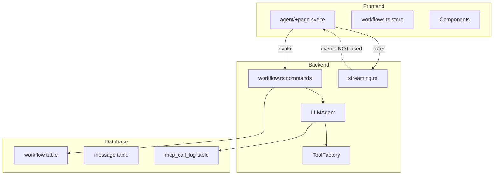
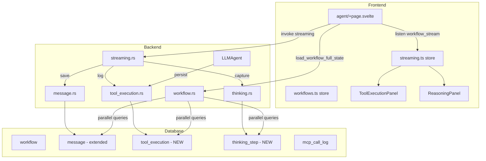
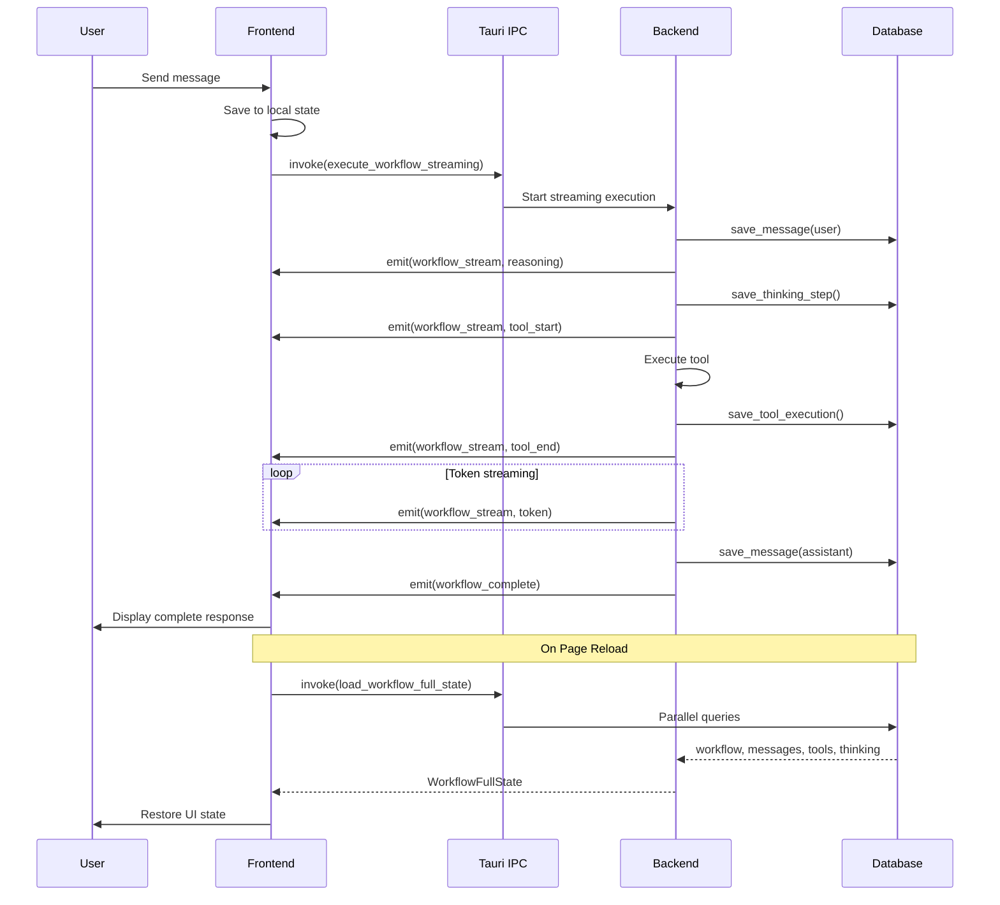

# Specification - Workflow Persistence & Streaming Integration

## Metadata
- Date: 2025-11-27
- Stack: Svelte 5.43.14 + Rust 1.91.1 + Tauri 2.9.4 + SurrealDB 2.3.10
- Complexity: **complex**
- Estimated Effort: ~50 hours

## Context

**Request**: Improve existing workflow code to enable real-time streaming display and complete persistence of all workflow data (user messages, tool calls, thinking steps) for recovery after application restart.

**Objective**:
1. Integrate streaming frontend (currently backend-only)
2. Persist ALL workflow data to SurrealDB
3. Enable complete state recovery after restart

**Scope**:
- **Included**: Message persistence, tool execution logging, thinking step capture, streaming UI integration, state recovery
- **Excluded**: MCP server configuration, agent CRUD (already complete), vector embeddings for messages

**Success Criteria**:
- [ ] Messages persisted and recovered identically after reload
- [ ] Tool executions visible in real-time AND after reload
- [ ] Thinking steps displayed (if model supports) and persisted
- [ ] Complete workflow restored in < 500ms
- [ ] No performance regression (>60 FPS)
- [ ] WCAG AA accessibility maintained

---

## Current State

### Architecture Overview



### Current Gaps Identified

| Gap | Current State | Impact | Priority |
|-----|---------------|--------|----------|
| Messages not persisted | Stored in $state memory only | Lost on reload | CRITICAL |
| Tool executions not logged (local) | Only MCP calls logged | No traceability | HIGH |
| Thinking steps not persisted | Emitted via streaming, never stored | Cannot review reasoning | MEDIUM |
| Streaming not integrated | Backend ready, frontend uses sync call | No real-time feedback | HIGH |
| Token counts not historized | In WorkflowResult only, not per message | No granular cost tracking | LOW |

### Existing Patterns (Reusable)

**IPC Pattern** (`src-tauri/src/commands/*.rs`):
```rust
#[tauri::command]
pub async fn command_name(
    param: String,
    state: State<'_, AppState>,
) -> Result<ReturnType, String>
```

**Store Pattern** (`src/lib/stores/workflows.ts`):
```typescript
// Pure functions for immutability
export function addItem(state, item) { ... }
export function updateItem(state, id, updates) { ... }
```

**Streaming Types** (`src/types/streaming.ts`):
```typescript
export interface StreamChunk {
  workflow_id: string;
  chunk_type: 'token' | 'tool_start' | 'tool_end' | 'reasoning' | 'error';
  content?: string;
  tool?: string;
  duration?: number;
}
```

---

## Proposed Architecture

### Target Architecture Diagram



### Data Flow



---

## Database Schema Changes

### New Table: `tool_execution`

```surql
DEFINE TABLE tool_execution SCHEMAFULL;
DEFINE FIELD id ON tool_execution TYPE string;
DEFINE FIELD workflow_id ON tool_execution TYPE string;
DEFINE FIELD message_id ON tool_execution TYPE string;
DEFINE FIELD agent_id ON tool_execution TYPE string;
DEFINE FIELD tool_type ON tool_execution TYPE string
    ASSERT $value IN ['local', 'mcp'];
DEFINE FIELD tool_name ON tool_execution TYPE string;
DEFINE FIELD server_name ON tool_execution TYPE option<string>;
DEFINE FIELD input_params ON tool_execution TYPE object;
DEFINE FIELD output_result ON tool_execution TYPE object;
DEFINE FIELD success ON tool_execution TYPE bool;
DEFINE FIELD error_message ON tool_execution TYPE option<string>;
DEFINE FIELD duration_ms ON tool_execution TYPE int;
DEFINE FIELD iteration ON tool_execution TYPE int;
DEFINE FIELD created_at ON tool_execution TYPE datetime DEFAULT time::now();

DEFINE INDEX tool_exec_workflow_idx ON tool_execution FIELDS workflow_id;
DEFINE INDEX tool_exec_message_idx ON tool_execution FIELDS message_id;
```

### New Table: `thinking_step`

```surql
DEFINE TABLE thinking_step SCHEMAFULL;
DEFINE FIELD id ON thinking_step TYPE string;
DEFINE FIELD workflow_id ON thinking_step TYPE string;
DEFINE FIELD message_id ON thinking_step TYPE string;
DEFINE FIELD agent_id ON thinking_step TYPE string;
DEFINE FIELD step_number ON thinking_step TYPE int;
DEFINE FIELD content ON thinking_step TYPE string;
DEFINE FIELD duration_ms ON thinking_step TYPE option<int>;
DEFINE FIELD tokens ON thinking_step TYPE option<int>;
DEFINE FIELD created_at ON thinking_step TYPE datetime DEFAULT time::now();

DEFINE INDEX thinking_workflow_idx ON thinking_step FIELDS workflow_id;
DEFINE INDEX thinking_message_idx ON thinking_step FIELDS message_id;
```

### Extended Table: `message`

```surql
-- Add new fields to existing message table
DEFINE FIELD tokens_input ON message TYPE option<int>;
DEFINE FIELD tokens_output ON message TYPE option<int>;
DEFINE FIELD model ON message TYPE option<string>;
DEFINE FIELD provider ON message TYPE option<string>;
DEFINE FIELD cost_usd ON message TYPE option<float>;
DEFINE FIELD duration_ms ON message TYPE option<int>;
```

---

## Component Specifications

### Backend: New Commands

#### `src-tauri/src/commands/message.rs`

**save_message**:
```rust
#[tauri::command]
pub async fn save_message(
    workflow_id: String,
    role: String,
    content: String,
    tokens_input: Option<u64>,
    tokens_output: Option<u64>,
    model: Option<String>,
    provider: Option<String>,
    duration_ms: Option<u64>,
    state: State<'_, AppState>,
) -> Result<String, String> {
    // Validate inputs
    // Generate UUID
    // Build Message struct
    // Insert into SurrealDB
    // Return message ID
}
```

**load_workflow_messages**:
```rust
#[tauri::command]
pub async fn load_workflow_messages(
    workflow_id: String,
    state: State<'_, AppState>,
) -> Result<Vec<Message>, String> {
    // Validate workflow_id
    // Query: SELECT * FROM message WHERE workflow_id = $id ORDER BY timestamp ASC
    // Deserialize with custom deserializers
    // Return messages
}
```

#### `src-tauri/src/commands/tool_execution.rs` (new file)

**save_tool_execution**:
```rust
#[tauri::command]
pub async fn save_tool_execution(
    workflow_id: String,
    message_id: String,
    agent_id: String,
    tool_type: String,
    tool_name: String,
    server_name: Option<String>,
    input_params: serde_json::Value,
    output_result: serde_json::Value,
    success: bool,
    error_message: Option<String>,
    duration_ms: u64,
    iteration: u32,
    state: State<'_, AppState>,
) -> Result<String, String>
```

**load_workflow_tool_executions**:
```rust
#[tauri::command]
pub async fn load_workflow_tool_executions(
    workflow_id: String,
    state: State<'_, AppState>,
) -> Result<Vec<ToolExecution>, String>
```

#### `src-tauri/src/commands/thinking.rs` (new file)

**save_thinking_step**:
```rust
#[tauri::command]
pub async fn save_thinking_step(
    workflow_id: String,
    message_id: String,
    agent_id: String,
    step_number: u32,
    content: String,
    duration_ms: Option<u64>,
    tokens: Option<u64>,
    state: State<'_, AppState>,
) -> Result<String, String>
```

**load_workflow_thinking_steps**:
```rust
#[tauri::command]
pub async fn load_workflow_thinking_steps(
    workflow_id: String,
    state: State<'_, AppState>,
) -> Result<Vec<ThinkingStep>, String>
```

#### `src-tauri/src/commands/workflow.rs` (extension)

**load_workflow_full_state**:
```rust
#[tauri::command]
pub async fn load_workflow_full_state(
    workflow_id: String,
    state: State<'_, AppState>,
) -> Result<WorkflowFullState, String> {
    // Parallel queries with tokio::try_join!
    let (workflow, messages, tools, thinking, tasks, memories, validations) = tokio::try_join!(
        load_workflow(&workflow_id, &state.db),
        load_messages(&workflow_id, &state.db),
        load_tool_executions(&workflow_id, &state.db),
        load_thinking_steps(&workflow_id, &state.db),
        load_tasks(&workflow_id, &state.db),
        load_memories(&workflow_id, &state.db),
        load_validations(&workflow_id, &state.db),
    )?;

    Ok(WorkflowFullState { workflow, messages, tool_executions: tools, ... })
}
```

### Backend: Modified Agent Loop

**`src-tauri/src/agents/llm_agent.rs`** - Add persistence in tool loop:

```rust
// In execute_with_mcp method, after each tool execution:
for tool_call in tool_calls {
    let start = Instant::now();
    let result = self.execute_local_tool(&tool_call, ...).await;
    let duration = start.elapsed();

    // NEW: Persist tool execution
    let execution = ToolExecution {
        id: Uuid::new_v4().to_string(),
        workflow_id: task.workflow_id.clone(),
        message_id: current_message_id.clone(),
        agent_id: self.config.id.clone(),
        tool_type: ToolType::Local,
        tool_name: tool_call.name.clone(),
        server_name: None,
        input_params: tool_call.params.clone(),
        output_result: result.clone(),
        success: result.is_ok(),
        error_message: result.err().map(|e| e.to_string()),
        duration_ms: duration.as_millis() as u64,
        iteration,
        created_at: Utc::now(),
    };
    self.db.create("tool_execution", &execution.id, &execution).await?;

    tool_results.push(result);
}
```

### Frontend: Streaming Store

**`src/lib/stores/streaming.ts`** (new file):

```typescript
import { writable, derived } from 'svelte/store';
import type { StreamChunk, WorkflowComplete } from '$types/streaming';
import type { ToolExecution } from '$types/tool';
import type { ThinkingStep } from '$types/thinking';

interface StreamingState {
  workflowId: string | null;
  content: string;
  tools: ToolExecution[];
  reasoning: ThinkingStep[];
  isStreaming: boolean;
  tokensReceived: number;
  error: string | null;
}

const initial: StreamingState = {
  workflowId: null,
  content: '',
  tools: [],
  reasoning: [],
  isStreaming: false,
  tokensReceived: 0,
  error: null,
};

const _state = writable<StreamingState>(initial);

export const streamingStore = {
  subscribe: _state.subscribe,

  start(workflowId: string) {
    _state.set({ ...initial, workflowId, isStreaming: true });
  },

  appendToken(content: string) {
    _state.update(s => ({
      ...s,
      content: s.content + content,
      tokensReceived: s.tokensReceived + 1
    }));
  },

  addToolStart(toolName: string) {
    _state.update(s => ({
      ...s,
      tools: [...s.tools, {
        name: toolName,
        status: 'running',
        startedAt: Date.now()
      }]
    }));
  },

  completeToolEnd(toolName: string, duration: number) {
    _state.update(s => ({
      ...s,
      tools: s.tools.map(t =>
        t.name === toolName && t.status === 'running'
          ? { ...t, status: 'completed', duration }
          : t
      )
    }));
  },

  addReasoning(content: string) {
    _state.update(s => ({
      ...s,
      reasoning: [...s.reasoning, {
        content,
        timestamp: Date.now(),
        stepNumber: s.reasoning.length + 1
      }]
    }));
  },

  setError(error: string) {
    _state.update(s => ({ ...s, error, isStreaming: false }));
  },

  complete() {
    _state.update(s => ({ ...s, isStreaming: false }));
  },

  reset() {
    _state.set(initial);
  }
};

// Derived stores
export const isStreaming = derived(_state, s => s.isStreaming);
export const streamContent = derived(_state, s => s.content);
export const activeTools = derived(_state, s => s.tools);
export const reasoningSteps = derived(_state, s => s.reasoning);
export const streamError = derived(_state, s => s.error);
```

### Frontend: New Components

#### `src/lib/components/workflow/ToolExecutionPanel.svelte`

```svelte
<script lang="ts">
  import type { ToolExecution } from '$types/tool';
  import { StatusIndicator, Badge, Card } from '$lib/components/ui';

  interface Props {
    tools: ToolExecution[];
    collapsed?: boolean;
  }

  let { tools, collapsed = false }: Props = $props();

  const runningTools = $derived(tools.filter(t => t.status === 'running'));
  const completedTools = $derived(tools.filter(t => t.status === 'completed'));
</script>

<Card class="tool-panel" class:collapsed>
  <svelte:fragment slot="header">
    <h3>Tools ({runningTools.length} active)</h3>
  </svelte:fragment>

  <div class="tool-list">
    {#each tools as tool (tool.name + tool.startedAt)}
      <div class="tool-item" class:running={tool.status === 'running'}>
        <StatusIndicator status={tool.status === 'running' ? 'running' : 'completed'} />
        <span class="name">{tool.name}</span>
        {#if tool.duration}
          <Badge variant="secondary">{tool.duration}ms</Badge>
        {:else}
          <span class="spinner-small"></span>
        {/if}
      </div>
    {/each}
  </div>
</Card>

<style>
  .tool-panel { /* ... */ }
  .tool-item { display: flex; align-items: center; gap: var(--spacing-sm); }
  .tool-item.running { animation: pulse 2s infinite; }
  .spinner-small { /* ... */ }
</style>
```

#### `src/lib/components/workflow/ReasoningPanel.svelte`

```svelte
<script lang="ts">
  import type { ThinkingStep } from '$types/thinking';
  import { Card } from '$lib/components/ui';

  interface Props {
    steps: ThinkingStep[];
    expanded?: boolean;
  }

  let { steps, expanded = true }: Props = $props();
</script>

<Card class="reasoning-panel">
  <details open={expanded}>
    <summary>
      Reasoning ({steps.length} step{steps.length !== 1 ? 's' : ''})
    </summary>
    <div class="reasoning-content">
      {#each steps as step, i (step.timestamp)}
        <div class="step">
          <span class="index">{i + 1}.</span>
          <p class="content">{step.content}</p>
          {#if step.duration_ms}
            <span class="duration">{step.duration_ms}ms</span>
          {/if}
        </div>
      {/each}
    </div>
  </details>
</Card>

<style>
  .reasoning-panel { /* ... */ }
  .step { display: flex; gap: var(--spacing-sm); padding: var(--spacing-xs) 0; }
  .index { font-weight: bold; color: var(--color-accent); }
  .content { flex: 1; }
  .duration { color: var(--color-text-secondary); font-size: var(--font-size-sm); }
</style>
```

### Frontend: Page Integration

**`src/routes/agent/+page.svelte`** - Key modifications:

```typescript
import { listen } from '@tauri-apps/api/event';
import { onMount, onDestroy } from 'svelte';
import { streamingStore, isStreaming, activeTools, reasoningSteps } from '$lib/stores/streaming';
import type { StreamChunk, WorkflowComplete } from '$types/streaming';
import type { WorkflowFullState } from '$types/workflow';

let unlisteners: (() => void)[] = [];

// Setup streaming listeners
async function setupStreamListeners(workflowId: string) {
  const unlistenChunk = await listen<StreamChunk>('workflow_stream', (event) => {
    if (event.payload.workflow_id !== workflowId) return;

    switch (event.payload.chunk_type) {
      case 'token':
        streamingStore.appendToken(event.payload.content ?? '');
        break;
      case 'tool_start':
        streamingStore.addToolStart(event.payload.tool!);
        break;
      case 'tool_end':
        streamingStore.completeToolEnd(event.payload.tool!, event.payload.duration ?? 0);
        break;
      case 'reasoning':
        streamingStore.addReasoning(event.payload.content!);
        break;
      case 'error':
        streamingStore.setError(event.payload.content!);
        break;
    }
  });

  const unlistenComplete = await listen<WorkflowComplete>('workflow_complete', (event) => {
    if (event.payload.workflow_id !== workflowId) return;

    if (event.payload.status === 'error') {
      streamingStore.setError(event.payload.error ?? 'Unknown error');
    }
    streamingStore.complete();
    cleanupListeners();
  });

  unlisteners = [unlistenChunk, unlistenComplete];
}

function cleanupListeners() {
  unlisteners.forEach(fn => fn());
  unlisteners = [];
}

// Send message with streaming
async function handleSend(message: string) {
  if (!selectedWorkflowId || !selectedAgentId) return;

  // Save user message immediately
  const userMsgId = await invoke<string>('save_message', {
    workflowId: selectedWorkflowId,
    role: 'user',
    content: message,
  });

  messages = [...messages, { id: userMsgId, role: 'user', content: message, timestamp: new Date() }];

  // Setup streaming
  streamingStore.start(selectedWorkflowId);
  await setupStreamListeners(selectedWorkflowId);

  try {
    // Execute with streaming
    const result = await invoke<WorkflowResult>('execute_workflow_streaming', {
      workflowId: selectedWorkflowId,
      message,
      agentId: selectedAgentId,
    });

    // Save assistant message
    const assistantMsgId = await invoke<string>('save_message', {
      workflowId: selectedWorkflowId,
      role: 'assistant',
      content: result.report,
      tokensInput: result.metrics.tokens_input,
      tokensOutput: result.metrics.tokens_output,
      model: result.metrics.model,
      provider: result.metrics.provider,
      durationMs: result.metrics.duration_ms,
    });

    messages = [...messages, {
      id: assistantMsgId,
      role: 'assistant',
      content: result.report,
      timestamp: new Date(),
      metrics: result.metrics,
    }];

  } catch (e) {
    streamingStore.setError(e instanceof Error ? e.message : String(e));
  }
}

// Restore state on mount
onMount(async () => {
  await loadWorkflows();

  const lastWorkflowId = localStorage.getItem('lastSelectedWorkflow');
  if (lastWorkflowId) {
    try {
      const fullState = await invoke<WorkflowFullState>('load_workflow_full_state', {
        workflowId: lastWorkflowId,
      });

      selectedWorkflowId = fullState.workflow.id;
      messages = fullState.messages;
      // Restore tools and thinking for display
    } catch (e) {
      console.warn('Could not restore workflow:', e);
      localStorage.removeItem('lastSelectedWorkflow');
    }
  }
});

// Persist selected workflow
$effect(() => {
  if (selectedWorkflowId) {
    localStorage.setItem('lastSelectedWorkflow', selectedWorkflowId);
  }
});

onDestroy(() => {
  cleanupListeners();
});
```

---

## Synchronized Types

### TypeScript: `src/types/tool.ts` (new)

```typescript
export type ToolType = 'local' | 'mcp';

export type ToolStatus = 'pending' | 'running' | 'completed' | 'error';

export interface ToolExecution {
  id: string;
  workflow_id: string;
  message_id: string;
  agent_id: string;
  tool_type: ToolType;
  tool_name: string;
  server_name?: string;
  input_params: Record<string, unknown>;
  output_result: Record<string, unknown>;
  success: boolean;
  error_message?: string;
  duration_ms: number;
  iteration: number;
  created_at: Date;
}

// For streaming state (lighter)
export interface ActiveTool {
  name: string;
  status: ToolStatus;
  startedAt: number;
  duration?: number;
}
```

### TypeScript: `src/types/thinking.ts` (new)

```typescript
export interface ThinkingStep {
  id: string;
  workflow_id: string;
  message_id: string;
  agent_id: string;
  step_number: number;
  content: string;
  duration_ms?: number;
  tokens?: number;
  created_at: Date;
}

// For streaming state (lighter)
export interface ActiveThinkingStep {
  content: string;
  timestamp: number;
  stepNumber: number;
}
```

### TypeScript: `src/types/workflow.ts` (extension)

```typescript
// Add to existing file
export interface WorkflowFullState {
  workflow: Workflow;
  messages: Message[];
  tool_executions: ToolExecution[];
  thinking_steps: ThinkingStep[];
  tasks: Task[];
  memories: Memory[];
  validations: ValidationRequest[];
}
```

### Rust: `src-tauri/src/models/tool_execution.rs` (new)

```rust
use chrono::{DateTime, Utc};
use serde::{Deserialize, Serialize};

#[derive(Debug, Clone, Serialize, Deserialize, PartialEq)]
#[serde(rename_all = "snake_case")]
pub enum ToolType {
    Local,
    Mcp,
}

#[derive(Debug, Clone, Serialize, Deserialize)]
pub struct ToolExecution {
    pub id: String,
    pub workflow_id: String,
    pub message_id: String,
    pub agent_id: String,
    pub tool_type: ToolType,
    pub tool_name: String,
    pub server_name: Option<String>,
    pub input_params: serde_json::Value,
    pub output_result: serde_json::Value,
    pub success: bool,
    pub error_message: Option<String>,
    pub duration_ms: u64,
    pub iteration: u32,
    pub created_at: DateTime<Utc>,
}

#[derive(Debug, Clone, Serialize)]
pub struct ToolExecutionCreate {
    pub workflow_id: String,
    pub message_id: String,
    pub agent_id: String,
    pub tool_type: String,
    pub tool_name: String,
    pub server_name: Option<String>,
    pub input_params: serde_json::Value,
    pub output_result: serde_json::Value,
    pub success: bool,
    pub error_message: Option<String>,
    pub duration_ms: u64,
    pub iteration: u32,
}
```

### Rust: `src-tauri/src/models/thinking_step.rs` (new)

```rust
use chrono::{DateTime, Utc};
use serde::{Deserialize, Serialize};

#[derive(Debug, Clone, Serialize, Deserialize)]
pub struct ThinkingStep {
    pub id: String,
    pub workflow_id: String,
    pub message_id: String,
    pub agent_id: String,
    pub step_number: u32,
    pub content: String,
    pub duration_ms: Option<u64>,
    pub tokens: Option<u64>,
    pub created_at: DateTime<Utc>,
}

#[derive(Debug, Clone, Serialize)]
pub struct ThinkingStepCreate {
    pub workflow_id: String,
    pub message_id: String,
    pub agent_id: String,
    pub step_number: u32,
    pub content: String,
    pub duration_ms: Option<u64>,
    pub tokens: Option<u64>,
}
```

---

## Implementation Plan

### Phase 1: Message Persistence (Foundation)
**Dependencies**: None
**Objective**: User/assistant messages persisted and recoverable

**Tasks**:
1. **Backend**: Extend `message` schema with new fields (tokens, model, provider, cost, duration)
2. **Backend**: Create/extend `src-tauri/src/commands/message.rs` (save_message, load_workflow_messages)
3. **Backend**: Register commands in `main.rs` generate_handler!
4. **Types**: Create `src/types/message.ts` extension (MessageWithMetrics)
5. **Types**: Sync `src-tauri/src/models/message.rs`
6. **Frontend**: Modify `+page.svelte` to save messages on send/receive

**Validation**:
- [ ] Messages saved in DB after send
- [ ] Messages restored after page reload
- [ ] Metrics (tokens, duration) visible in UI

### Phase 2: Streaming Frontend Integration
**Dependencies**: Phase 1
**Objective**: Real-time display of generated content

**Tasks**:
1. **Frontend**: Create `src/lib/stores/streaming.ts`
2. **Frontend**: Modify `+page.svelte` to use `execute_workflow_streaming`
3. **Frontend**: Setup listeners for `workflow_stream` and `workflow_complete`
4. **Frontend**: Display streaming content in MessageBubble (progressive)
5. **Tests**: Verify token streaming and completion events

**Validation**:
- [ ] Tokens appear progressively
- [ ] No UI blocking during generation
- [ ] Cancellation works (invoke cancel_workflow_streaming)

### Phase 3: Tool Execution Persistence
**Dependencies**: Phase 1
**Objective**: Complete history of tool calls

**Tasks**:
1. **Backend**: Create `tool_execution` table in schema.rs
2. **Backend**: Create `src-tauri/src/models/tool_execution.rs`
3. **Backend**: Create `src-tauri/src/commands/tool_execution.rs`
4. **Backend**: Modify `llm_agent.rs` to persist each execution
5. **Types**: Create `src/types/tool.ts` (ToolExecution, ToolType)
6. **Frontend**: Create `ToolExecutionPanel.svelte`
7. **Frontend**: Integrate panel in agent page layout

**Validation**:
- [ ] Tool executions recorded in DB
- [ ] Panel shows active tools during streaming
- [ ] History visible after reload

### Phase 4: Thinking Steps Persistence
**Dependencies**: Phase 2, Phase 3
**Objective**: Capture and display agent reasoning

**Tasks**:
1. **Backend**: Create `thinking_step` table in schema.rs
2. **Backend**: Create `src-tauri/src/models/thinking_step.rs`
3. **Backend**: Create `src-tauri/src/commands/thinking.rs`
4. **Backend**: Modify streaming to save reasoning chunks
5. **Types**: Create `src/types/thinking.ts`
6. **Frontend**: Create/enhance `ReasoningPanel.svelte`
7. **Frontend**: Display reasoning during streaming + after reload

**Validation**:
- [ ] Thinking steps persisted to DB
- [ ] Reasoning panel displayed in real-time
- [ ] Steps restored after reload

### Phase 5: Complete State Recovery
**Dependencies**: Phase 1, 3, 4
**Objective**: Full workflow restoration after restart

**Tasks**:
1. **Backend**: Create `load_workflow_full_state` command with parallel queries
2. **Types**: Create `WorkflowFullState` (TS + Rust)
3. **Frontend**: Recovery logic on mount with localStorage
4. **Frontend**: Loading indicator "Restoring workflow..."
5. **Frontend**: Error handling for missing/corrupted state
6. **Tests E2E**: Complete reload scenario with Playwright

**Validation**:
- [ ] Workflow restored identical to pre-reload state
- [ ] Messages, tools, thinking all visible
- [ ] Performance < 500ms for restoration

### Phase 6: Polish and Optimizations
**Dependencies**: Phase 5
**Objective**: Refined UX and performance

**Tasks**:
1. **Frontend**: Transition animations (tools, reasoning)
2. **Frontend**: Virtual scrolling for long histories (svelte-virtual-list)
3. **Frontend**: Skeleton loading states
4. **Backend**: Pagination for load_workflow_messages (optional)
5. **Tests**: Complete E2E suite with Playwright
6. **Docs**: Update FRONTEND_SPECIFICATIONS.md

**Validation**:
- [ ] Satisfactory performance (>60 FPS)
- [ ] Accessibility validated (WCAG AA)
- [ ] Documentation current

---

## Estimation

| Phase | Frontend | Backend | Types | Tests | Total | Notes |
|-------|----------|---------|-------|-------|-------|-------|
| 1. Messages | 2h | 3h | 1h | 1h | **7h** | Existing patterns |
| 2. Streaming | 4h | 0h | 1h | 2h | **7h** | Listener complexity |
| 3. Tools | 3h | 4h | 1h | 2h | **10h** | New table |
| 4. Thinking | 2h | 3h | 1h | 1h | **7h** | Similar to Phase 3 |
| 5. Recovery | 3h | 4h | 1h | 2h | **10h** | Parallel queries |
| 6. Polish | 4h | 2h | 0h | 3h | **9h** | UI complexity |

**Total Estimated**: ~50 hours

**Reduction Factors**:
- Established IPC patterns: -10%
- Existing synchronized types: -5%
- Reusable UI components: -10%

**Increase Factors**:
- Async streaming (race conditions): +15%
- Complex state management: +10%
- E2E tests with Playwright: +10%

---

## Risk Analysis

| Risk | Probability | Impact | Mitigation | Plan B |
|------|-------------|--------|------------|--------|
| **Streaming race conditions** | Medium | High | Mutex on state updates, unit tests | Disable streaming, fallback sync |
| **DB performance with long history** | Low | Medium | Appropriate indexes, pagination | Auto-purge old history |
| **TS/Rust type desync** | Low | High | Serialization tests, CI checks | Type validation script |
| **Listener memory leaks** | Medium | Medium | Systematic cleanup onDestroy | Periodic memory audit |
| **SurrealDB SDK bugs** | Low | Medium | Established workaround patterns | Raw queries fallback |
| **Merge conflicts** | Low | Low | Isolated feature branches | Frequent rebase |

---

## Tests

### Unit Tests (Vitest)

**Frontend Stores**:
```typescript
// src/lib/stores/streaming.test.ts
describe('streamingStore', () => {
  it('appends tokens correctly', () => {
    streamingStore.start('wf-1');
    streamingStore.appendToken('Hello');
    streamingStore.appendToken(' World');
    expect(get(streamContent)).toBe('Hello World');
  });

  it('tracks tool lifecycle', () => {
    streamingStore.addToolStart('MemoryTool');
    expect(get(activeTools)[0].status).toBe('running');

    streamingStore.completeToolEnd('MemoryTool', 150);
    expect(get(activeTools)[0].status).toBe('completed');
    expect(get(activeTools)[0].duration).toBe(150);
  });
});
```

### Backend Tests (Rust)

**Commands**:
```rust
#[cfg(test)]
mod tests {
    use super::*;

    #[tokio::test]
    async fn test_save_and_load_tool_execution() {
        let state = setup_test_state().await;

        let id = save_tool_execution(
            "wf-1".into(),
            "msg-1".into(),
            "agent-1".into(),
            "local".into(),
            "MemoryTool".into(),
            None,
            json!({"operation": "add"}),
            json!({"id": "mem-1"}),
            true,
            None,
            150,
            0,
            state.clone(),
        ).await.unwrap();

        let executions = load_workflow_tool_executions("wf-1".into(), state).await.unwrap();
        assert_eq!(executions.len(), 1);
        assert_eq!(executions[0].id, id);
    }
}
```

### E2E Tests (Playwright)

```typescript
// tests/e2e/workflow-persistence.spec.ts
test('workflow state persists after reload', async ({ page }) => {
  await page.goto('http://localhost:5173/agent');

  // Create workflow and send message
  await page.click('[data-testid="new-workflow"]');
  await page.fill('[data-testid="chat-input"]', 'Test message');
  await page.click('[data-testid="send-button"]');

  // Wait for response
  await page.waitForSelector('[data-testid="assistant-message"]');

  // Capture state before reload
  const messageCount = await page.locator('[data-testid="message"]').count();

  // Reload page
  await page.reload();

  // Verify state restored
  await page.waitForSelector('[data-testid="message"]');
  const restoredCount = await page.locator('[data-testid="message"]').count();
  expect(restoredCount).toBe(messageCount);
});
```

---

## Considerations

### Performance
- **Parallel DB queries**: Use `tokio::try_join!` for full state load
- **Svelte reactivity**: Derived stores for computed values
- **Virtual scrolling**: For workflows with 100+ messages
- **Debounced persistence**: Batch rapid state changes

### Security
- **Input validation**: All Tauri commands validate parameters
- **SQL injection prevention**: Parameterized queries with bind()
- **Content size limits**: Max 50KB per message/memory

### Tauri Specific
- **Event cleanup**: Always cleanup listeners in onDestroy
- **State access**: Use State<'_, AppState> pattern
- **Error serialization**: Return Result<T, String> from commands

### SurrealDB Patterns
- **Custom deserializers**: For Thing type and enum fields
- **Raw queries**: For UPSERT and complex operations
- **JSON encoding**: For string values with special characters

---

## Dependencies

### Frontend (package.json)
No new dependencies required. Using existing:
- `@tauri-apps/api`: 2.9.0 (listen, invoke)
- `svelte`: 5.43.14 (runes)

### Backend (Cargo.toml)
No new dependencies required. Using existing:
- `tokio`: 1.48.0 (try_join!, async)
- `serde`: 1.0.228 (serialization)
- `chrono`: (timestamps)
- `uuid`: (ID generation)

---

## Next Steps

### Validation
- [ ] Architecture approved by team
- [ ] Dependencies validated (none new needed)
- [ ] Questions resolved

### Implementation Order
1. Start Phase 1 (Messages) - foundation for all
2. Phases 2 and 3 can be parallelized by different developers
3. Phase 4 depends on 2+3 but small scope
4. Phase 5 final integration after stabilization
5. Phase 6 optional if time permits

### Checkpoints
- After Phase 1: Verify message persistence works
- After Phase 3: Verify tool logging complete
- After Phase 5: Full E2E test suite passing

---

## References

- Architecture: `docs/TECH_STACK.md`
- Frontend specs: `docs/FRONTEND_SPECIFICATIONS.md`
- Workflow orchestration: `docs/WORKFLOW_ORCHESTRATION.md`
- Existing streaming: `src-tauri/src/commands/streaming.rs`
- Existing workflow: `src-tauri/src/commands/workflow.rs`
- Agent implementation: `src-tauri/src/agents/llm_agent.rs`

---

## Dependency Diagram

```
Phase 1: Messages ─────────────┬──────────────────┐
                               │                  │
                               ▼                  ▼
Phase 2: Streaming ───────┬─── Phase 3: Tools ───┤
                          │                       │
                          ▼                       │
Phase 4: Thinking ────────┴───────────────────────┤
                                                  │
                                                  ▼
Phase 5: Full State Recovery ─────────────────────┤
                                                  │
                                                  ▼
Phase 6: Polish ──────────────────────────────────┘
```

---

**Version**: 1.0
**Last Updated**: 2025-11-27
**Status**: Ready for Review
