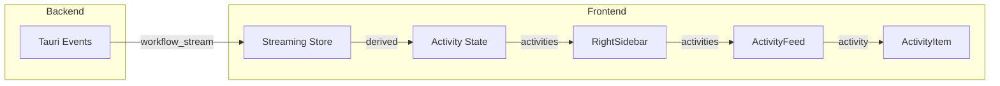

# Specification - Right Sidebar Activity Feed for Agent Page

## Metadata
- **Date**: 2025-11-29
- **Stack**: Svelte 5.43 + Rust 1.91 + Tauri 2.9 + SurrealDB 2.3
- **Complexity**: medium
- **Target**: Agent page (`src/routes/agent/+page.svelte`)

## Contexte

**Demande**: Ajouter une sidebar a droite pour afficher tous les elements qui s'affichent lors du workflow (tools, agents, reasoning, etc.)

**Objectif**: Deplacer les panels d'activite (ToolExecutionPanel, SubAgentActivity, ReasoningPanel) vers une sidebar droite collapsible, liberant l'espace vertical dans la zone principale pour les messages.

**Perimetre**:
- **Inclus**:
  - Nouveau composant RightSidebar
  - Nouveau composant ActivityFeed avec timeline unifiee
  - Modification layout page agent (2 colonnes -> 3 colonnes)
  - Types TypeScript pour les activites
- **Exclus**:
  - Backend Rust (aucune modification)
  - Base de donnees (aucun schema)
  - Nouveaux events Tauri (reutilisation des existants)

**Criteres de Succes**:
- [ ] Sidebar droite collapsible independante de la sidebar gauche
- [ ] Affichage chronologique de toutes les activites du workflow
- [ ] Filtres par type d'activite (All/Tools/Agents/Reasoning)
- [ ] Conservation de StreamingMessage dans la zone principale
- [ ] Responsive: auto-collapse sur ecrans < 1200px
- [ ] Tests unitaires pour nouveaux composants

---

## Etat Actuel

### Architecture Existante

```
+-------------------+----------------------------------------+
|  Left Sidebar     |          Main Area (flex: 1)           |
|  (280px)          |                                        |
|                   |  +----------------------------------+  |
|  - Workflows      |  | Header (agent title)             |  |
|  - Search         |  +----------------------------------+  |
|  - New workflow   |  | Messages Container (flex: 1)     |  |
|                   |  |   - MessageList                  |  |
|                   |  +----------------------------------+  |
|                   |  | StreamingMessage (optional)      |  |
|                   |  +----------------------------------+  |
|                   |  | SubAgentActivity (optional)      |  |
|                   |  +----------------------------------+  |
|                   |  | ToolExecutionPanel (optional)    |  |
|                   |  +----------------------------------+  |
|                   |  | ChatInput                        |  |
|                   |  +----------------------------------+  |
|                   |  | MetricsBar (optional)            |  |
|                   |  +----------------------------------+  |
+-------------------+----------------------------------------+
```

### Patterns Identifies

| Pattern | Usage | Fichiers |
|---------|-------|----------|
| **Sidebar collapsible** | Left sidebar avec snippets | `src/lib/components/layout/Sidebar.svelte` |
| **Panel collapsible** | Header + liste expandable | `ToolExecutionPanel.svelte`, `SubAgentActivity.svelte` |
| **Status icons** | Success/error/running/pending | `StatusIndicator.svelte`, patterns inline |
| **Badge counts** | Compteurs colores | Pattern `.count-badge` dans panels |
| **Streaming store** | 29 derived stores | `src/lib/stores/streaming.ts` |

### Code Reutilisable

- **Frontend**:
  - `src/lib/components/layout/Sidebar.svelte` - Structure et toggle pattern
  - `src/lib/components/workflow/ToolExecutionPanel.svelte` - Item list pattern
  - `src/lib/components/workflow/SubAgentActivity.svelte` - Activity item pattern
  - CSS animations: `slideDown`, `fadeInItem`, `spin`
  - Design tokens: `--color-status-*`, `--spacing-*`, `--radius-*`

---

## Architecture Proposee

### Diagramme Layout

```
+----------------+---------------------------+----------------+
| Left Sidebar   |      Main Area            | Right Sidebar  |
| (280px)        |      (flex: 1)            | (320px)        |
|                |                           |                |
| - Workflows    | +---------------------+   | +------------+ |
| - Search       | | Header              |   | | Activity   | |
| - New btn      | +---------------------+   | | Feed       | |
|                | | Messages (flex: 1)  |   | |            | |
| [Toggle <]     | |                     |   | | - Tools    | |
|                | +---------------------+   | | - Agents   | |
|                | | StreamingMessage    |   | | - Reason   | |
|                | +---------------------+   | |            | |
|                | | ChatInput           |   | [> Toggle]  | |
|                | +---------------------+   | +------------+ |
|                | | MetricsBar          |   |                |
|                | +---------------------+   |                |
+----------------+---------------------------+----------------+
```

### Flux de Donnees



---

## Composants

### Frontend: RightSidebar.svelte

- **Path**: `src/lib/components/layout/RightSidebar.svelte`
- **Type**: Nouveau
- **Props/Events**:

```typescript
interface Props {
  /** Whether the sidebar is collapsed */
  collapsed?: boolean;  // bindable, default: false
  /** Header slot content - receives collapsed state */
  header?: Snippet<[boolean]>;
  /** Main content slot - receives collapsed state */
  content?: Snippet<[boolean]>;
}
```

- **Structure HTML**:

```svelte
<aside class="right-sidebar" class:collapsed>
  {#if header}
    <div class="sidebar-header">
      {@render header(collapsed)}
    </div>
  {/if}

  {#if content}
    <div class="sidebar-content">
      {@render content(collapsed)}
    </div>
  {/if}

  <button class="sidebar-toggle" onclick={toggleCollapsed}>
    {#if collapsed}
      <PanelRightOpen size={18} />
    {:else}
      <PanelRightClose size={18} />
    {/if}
  </button>
</aside>
```

- **CSS Variables**:

```css
.right-sidebar {
  width: var(--right-sidebar-width, 320px);
  border-left: 1px solid var(--color-border);
  transition: width var(--transition-base);
}

.right-sidebar.collapsed {
  width: var(--right-sidebar-collapsed-width, 48px);
}

.sidebar-toggle {
  position: absolute;
  bottom: var(--spacing-lg);
  left: calc(-1 * var(--spacing-md) - 2px);
  /* Mirror of left sidebar toggle */
}
```

---

### Frontend: ActivityFeed.svelte

- **Path**: `src/lib/components/workflow/ActivityFeed.svelte`
- **Type**: Nouveau
- **Props/Events**:

```typescript
interface Props {
  /** List of activity events */
  activities?: WorkflowActivityEvent[];
  /** Whether workflow is currently streaming */
  isStreaming?: boolean;
  /** Current filter (all | tools | agents | reasoning) */
  filter?: ActivityFilter;
  /** Callback when filter changes */
  onFilterChange?: (filter: ActivityFilter) => void;
  /** Whether panel is collapsed */
  collapsed?: boolean;
}

type ActivityFilter = 'all' | 'tools' | 'agents' | 'reasoning';
```

- **Structure HTML**:

```svelte
<div class="activity-feed" class:collapsed>
  <!-- Filter Tabs -->
  <div class="filter-tabs" role="tablist">
    {#each filters as f}
      <button
        role="tab"
        class:active={filter === f.id}
        onclick={() => setFilter(f.id)}
      >
        <svelte:component this={f.icon} size={14} />
        {#if !collapsed}
          <span>{f.label}</span>
          <span class="count">{getCount(f.id)}</span>
        {/if}
      </button>
    {/each}
  </div>

  <!-- Activity List -->
  {#if !collapsed}
    <div class="activity-list" role="list">
      {#each filteredActivities as activity (activity.id)}
        <ActivityItem {activity} />
      {/each}

      {#if isStreaming}
        <div class="streaming-indicator">
          <Loader2 class="spinning" size={14} />
          <span>Processing...</span>
        </div>
      {/if}
    </div>
  {/if}
</div>
```

- **Derived State**:

```typescript
const filteredActivities = $derived(() => {
  if (filter === 'all') return activities;
  return activities.filter(a => {
    switch (filter) {
      case 'tools': return a.type.startsWith('tool_');
      case 'agents': return a.type.startsWith('sub_agent_');
      case 'reasoning': return a.type === 'reasoning';
      default: return true;
    }
  });
});

const counts = $derived(() => ({
  all: activities.length,
  tools: activities.filter(a => a.type.startsWith('tool_')).length,
  agents: activities.filter(a => a.type.startsWith('sub_agent_')).length,
  reasoning: activities.filter(a => a.type === 'reasoning').length,
}));
```

---

### Frontend: ActivityItem.svelte

- **Path**: `src/lib/components/workflow/ActivityItem.svelte`
- **Type**: Nouveau
- **Props/Events**:

```typescript
interface Props {
  /** Activity event to display */
  activity: WorkflowActivityEvent;
  /** Whether item details are expanded */
  expanded?: boolean;
  /** Callback when expand toggled */
  onToggle?: () => void;
}
```

- **Structure HTML**:

```svelte
<div
  class="activity-item {getStatusClass(activity.status)}"
  role="listitem"
>
  <div class="item-icon">
    <svelte:component this={getIcon(activity.type)} size={14} />
  </div>

  <div class="item-content">
    <div class="item-title">{activity.title}</div>
    {#if activity.description && expanded}
      <div class="item-description">{activity.description}</div>
    {/if}
    {#if activity.metadata?.error}
      <div class="item-error">{activity.metadata.error}</div>
    {/if}
  </div>

  <div class="item-meta">
    <span class="item-time">{formatTime(activity.timestamp)}</span>
    {#if activity.duration}
      <span class="item-duration">{formatDuration(activity.duration)}</span>
    {/if}
  </div>
</div>
```

- **Icon Mapping**:

```typescript
function getIcon(type: ActivityType): ComponentType {
  switch (type) {
    case 'tool_start':
    case 'tool_complete':
    case 'tool_error':
      return Wrench;
    case 'reasoning':
      return Brain;
    case 'sub_agent_start':
    case 'sub_agent_progress':
    case 'sub_agent_complete':
    case 'sub_agent_error':
      return Bot;
    case 'validation':
      return ShieldCheck;
    default:
      return Activity;
  }
}
```

---

## Types Synchronises

### TypeScript: `src/types/activity.ts` (Nouveau)

```typescript
/**
 * @fileoverview Activity types for workflow sidebar display.
 * @module types/activity
 */

/**
 * Type of workflow activity event.
 */
export type ActivityType =
  | 'tool_start'
  | 'tool_complete'
  | 'tool_error'
  | 'reasoning'
  | 'sub_agent_start'
  | 'sub_agent_progress'
  | 'sub_agent_complete'
  | 'sub_agent_error'
  | 'validation'
  | 'message';

/**
 * Status of an activity event.
 */
export type ActivityStatus = 'pending' | 'running' | 'completed' | 'error';

/**
 * Filter options for activity feed.
 */
export type ActivityFilter = 'all' | 'tools' | 'agents' | 'reasoning';

/**
 * Metadata specific to activity types.
 */
export interface ActivityMetadata {
  /** Tool name (for tool_* types) */
  toolName?: string;
  /** MCP server name (for MCP tools) */
  serverName?: string;
  /** Sub-agent name (for sub_agent_* types) */
  agentName?: string;
  /** Sub-agent ID */
  agentId?: string;
  /** Progress percentage 0-100 */
  progress?: number;
  /** Token counts */
  tokens?: {
    input: number;
    output: number;
  };
  /** Error message */
  error?: string;
  /** Iteration number (for tools) */
  iteration?: number;
}

/**
 * Unified workflow activity event for sidebar display.
 */
export interface WorkflowActivityEvent {
  /** Unique identifier */
  id: string;
  /** Unix timestamp in milliseconds */
  timestamp: number;
  /** Activity type discriminator */
  type: ActivityType;
  /** Display title */
  title: string;
  /** Optional detailed description */
  description?: string;
  /** Current status */
  status: ActivityStatus;
  /** Duration in milliseconds (for completed activities) */
  duration?: number;
  /** Type-specific metadata */
  metadata?: ActivityMetadata;
}

/**
 * State for right sidebar in agent page.
 */
export interface RightSidebarState {
  /** Whether sidebar is collapsed */
  collapsed: boolean;
  /** Current activity filter */
  filter: ActivityFilter;
  /** All activity events for current workflow */
  activities: WorkflowActivityEvent[];
}
```

### Import Pattern

```typescript
// In components/stores:
import type {
  WorkflowActivityEvent,
  ActivityType,
  ActivityFilter,
  RightSidebarState
} from '$types/activity';
```

---

## Plan d'Implementation

### Phase 1: Types & Utilitaires

**Objectif**: Creer les types et fonctions de conversion.

**Taches**:
1. **Types**: Creer `src/types/activity.ts`
   - Interface WorkflowActivityEvent
   - Types ActivityType, ActivityStatus, ActivityFilter
   - Export dans `src/types/index.ts`

2. **Utilitaires**: Creer `src/lib/utils/activity.ts`
   - `streamChunkToActivity(chunk: StreamChunk): WorkflowActivityEvent | null`
   - `activeToolToActivity(tool: ActiveTool): WorkflowActivityEvent`
   - `activeSubAgentToActivity(agent: ActiveSubAgent): WorkflowActivityEvent`
   - `formatActivityTime(timestamp: number): string`
   - `getActivityIcon(type: ActivityType): ComponentType`

**Validation**:
- [ ] Types compiles sans erreur
- [ ] Fonctions de conversion testees unitairement

---

### Phase 2: RightSidebar Component

**Objectif**: Creer le composant de layout sidebar droite.

**Taches**:
1. **Component**: Creer `src/lib/components/layout/RightSidebar.svelte`
   - Structure similaire a Sidebar.svelte
   - Toggle button sur le bord gauche
   - Support des snippets header/content

2. **Export**: Ajouter a `src/lib/components/layout/index.ts`

3. **CSS Variables**: Ajouter a `src/styles/global.css`
   ```css
   --right-sidebar-width: 320px;
   --right-sidebar-collapsed-width: 48px;
   ```

**Validation**:
- [ ] Sidebar s'affiche correctement
- [ ] Toggle collapse/expand fonctionne
- [ ] Transition fluide (200ms)

---

### Phase 3: ActivityItem Component

**Objectif**: Creer le composant d'item d'activite individuel.

**Taches**:
1. **Component**: Creer `src/lib/components/workflow/ActivityItem.svelte`
   - Props: activity, expanded, onToggle
   - Icon dynamique selon type
   - Status color-coded
   - Duration/timestamp display

2. **CSS**: Reutiliser patterns de ToolExecutionPanel
   - `.status-success`, `.status-error`, `.status-running`
   - Animation `fadeInItem`

**Validation**:
- [ ] Tous les types d'activite s'affichent correctement
- [ ] Status visuellement distinct
- [ ] Animations fluides

---

### Phase 4: ActivityFeed Component

**Objectif**: Creer le composant de feed d'activites.

**Taches**:
1. **Component**: Creer `src/lib/components/workflow/ActivityFeed.svelte`
   - Filter tabs (All/Tools/Agents/Reasoning)
   - Liste scrollable d'ActivityItems
   - Empty state
   - Streaming indicator

2. **Export**: Ajouter a `src/lib/components/workflow/index.ts`

**Validation**:
- [ ] Filtres fonctionnent correctement
- [ ] Compteurs mis a jour
- [ ] Scroll fonctionne avec beaucoup d'items

---

### Phase 5: Agent Page Integration

**Objectif**: Integrer la sidebar droite dans la page agent.

**Taches**:
1. **Layout**: Modifier `src/routes/agent/+page.svelte`
   - Ajouter RightSidebar apres main
   - CSS: `.agent-page` devient 3 colonnes

2. **State**: Ajouter a la page
   ```typescript
   let rightSidebarCollapsed = $state(false);
   let activityFilter = $state<ActivityFilter>('all');
   let activities = $state<WorkflowActivityEvent[]>([]);
   ```

3. **Conversion**: Transformer events streaming en activites
   ```typescript
   $effect(() => {
     // Convert streaming store to activities
     const toolActivities = $activeTools.map(activeToolToActivity);
     const agentActivities = $activeSubAgents.map(activeSubAgentToActivity);
     const reasoningActivities = $reasoningSteps.map(stepToActivity);
     activities = [...toolActivities, ...agentActivities, ...reasoningActivities]
       .sort((a, b) => a.timestamp - b.timestamp);
   });
   ```

4. **Suppression**: Retirer SubAgentActivity et ToolExecutionPanel de la zone principale

5. **Persistence**: Sauvegarder `rightSidebarCollapsed` dans localStorage

**Validation**:
- [ ] Layout 3 colonnes correct
- [ ] Activites apparaissent en temps reel
- [ ] Panels supprimes de la zone principale
- [ ] State persiste entre sessions

---

### Phase 6: Polish & Responsive

**Objectif**: Finaliser UX et responsive design.

**Taches**:
1. **Responsive**: Ajouter media query
   ```css
   @media (max-width: 1200px) {
     .right-sidebar {
       display: none; /* ou mode drawer */
     }
   }
   ```

2. **Keyboard**: Ajouter raccourci `Ctrl+B` pour toggle

3. **Animations**: Affiner transitions

4. **A11y**: Verifier aria-labels et focus management

**Validation**:
- [ ] Sidebar disparait sur petits ecrans
- [ ] Raccourci clavier fonctionne
- [ ] Aucune erreur a11y

---

## Estimation

| Phase | Description | Estimation | Ajustee |
|-------|-------------|------------|---------|
| 1 | Types & Utilitaires | 30min | 25min |
| 2 | RightSidebar | 1h | 45min |
| 3 | ActivityItem | 1h | 45min |
| 4 | ActivityFeed | 1h30 | 1h15 |
| 5 | Integration | 2h | 1h30 |
| 6 | Polish | 1h | 45min |
| **Total** | | **7h** | **~5h** |

**Facteurs de reduction**:
- Reutilisation Sidebar.svelte pattern: -20%
- Reutilisation ToolExecutionPanel CSS: -15%
- Streaming store deja existant: -10%

---

## Analyse Risques

| Risque | Probabilite | Impact | Mitigation | Plan B |
|--------|-------------|--------|------------|--------|
| Layout break sur petits ecrans | Moyenne | Moyen | Auto-collapse < 1200px | Mode drawer overlay |
| Performance avec 100+ activites | Faible | Moyen | Virtual scrolling | Pagination |
| Conflits CSS avec sidebars | Faible | Faible | Namespaced classes | CSS modules |
| State desynchronise | Faible | Moyen | Derived stores | Manual sync |
| UX perturbee (changement layout) | Moyenne | Faible | Toggle inline/sidebar | Preference user |

---

## Tests

### Frontend (Vitest)

```typescript
// src/lib/components/workflow/ActivityFeed.test.ts
import { render, screen, fireEvent } from '@testing-library/svelte';
import ActivityFeed from './ActivityFeed.svelte';

describe('ActivityFeed', () => {
  const mockActivities = [
    { id: '1', type: 'tool_start', title: 'Read file', status: 'completed', timestamp: Date.now() },
    { id: '2', type: 'reasoning', title: 'Analyzing...', status: 'completed', timestamp: Date.now() },
  ];

  it('renders activities list', () => {
    render(ActivityFeed, { props: { activities: mockActivities } });
    expect(screen.getByText('Read file')).toBeInTheDocument();
    expect(screen.getByText('Analyzing...')).toBeInTheDocument();
  });

  it('filters by type', async () => {
    render(ActivityFeed, { props: { activities: mockActivities, filter: 'tools' } });
    expect(screen.getByText('Read file')).toBeInTheDocument();
    expect(screen.queryByText('Analyzing...')).not.toBeInTheDocument();
  });

  it('shows streaming indicator', () => {
    render(ActivityFeed, { props: { activities: [], isStreaming: true } });
    expect(screen.getByText('Processing...')).toBeInTheDocument();
  });
});
```

### E2E (Playwright)

```typescript
// tests/e2e/agent-sidebar.spec.ts
import { test, expect } from '@playwright/test';

test.describe('Agent Page Right Sidebar', () => {
  test('shows activity feed during workflow', async ({ page }) => {
    await page.goto('/agent');
    // Select workflow, send message
    await page.fill('[data-testid="chat-input"]', 'Hello');
    await page.click('[data-testid="send-button"]');

    // Verify activity appears in sidebar
    await expect(page.locator('.right-sidebar .activity-item')).toBeVisible();
  });

  test('collapses and expands', async ({ page }) => {
    await page.goto('/agent');
    const sidebar = page.locator('.right-sidebar');

    // Initially expanded
    await expect(sidebar).not.toHaveClass(/collapsed/);

    // Click toggle
    await page.click('.right-sidebar .sidebar-toggle');
    await expect(sidebar).toHaveClass(/collapsed/);
  });

  test('filters activities', async ({ page }) => {
    await page.goto('/agent');
    // ... setup activities

    await page.click('[data-testid="filter-tools"]');
    // Verify only tool activities shown
  });
});
```

---

## Considerations

### Performance

- **Virtual scrolling**: Implementer si > 100 activites
- **Debounce**: Filter changes avec 100ms debounce
- **Memoization**: Derived stores pour filtres

### Securite

- **XSS**: Activity descriptions sanitized (pas de HTML)
- **Input validation**: Types stricts pour ActivityType

### Accessibilite

- **ARIA**: `role="list"`, `role="listitem"`, `aria-expanded`
- **Keyboard**: Tab navigation, Enter/Space pour toggle
- **Focus**: Focus trap dans sidebar expanded
- **Screen readers**: Labels descriptifs

### Tauri Specifique

- **IPC**: Aucun nouveau - reutilisation streaming events
- **Window**: Aucune modification
- **State**: localStorage pour persistence client-side

---

## Dependances

### Frontend (package.json)

Aucune nouvelle dependance requise. Utilisation des existantes:
- `lucide-svelte` - Icons (PanelRightOpen, PanelRightClose, Brain, Activity)
- `svelte` - Snippets, $state, $derived

### Backend (Cargo.toml)

Aucune modification backend requise.

---

## Prochaines Etapes

### Validation Pre-Implementation
- [ ] Architecture approuvee
- [ ] Types valides
- [ ] Risques acceptes

### Implementation
1. Commencer Phase 1 (Types)
2. Checkpoint apres Phase 2 (RightSidebar visible)
3. Checkpoint apres Phase 5 (Integration complete)
4. Tests continus

### Post-Implementation
- [ ] Documentation mise a jour
- [ ] CLAUDE.md mis a jour si necessaire
- [ ] Memory Serena si patterns reutilisables

---

## References

- Architecture: `docs/TECH_STACK.md`
- Design System: `docs/DESIGN_SYSTEM.md`
- Code analyse:
  - `src/routes/agent/+page.svelte` (layout actuel)
  - `src/lib/components/layout/Sidebar.svelte` (pattern sidebar)
  - `src/lib/components/workflow/ToolExecutionPanel.svelte` (pattern panel)
  - `src/lib/components/workflow/SubAgentActivity.svelte` (pattern activite)
  - `src/lib/stores/streaming.ts` (streaming store)
  - `src/types/streaming.ts` (types streaming)
