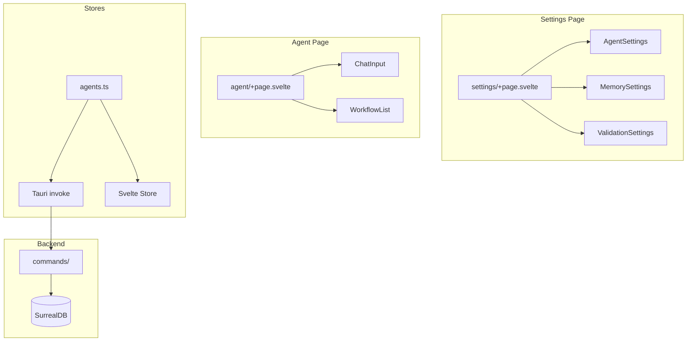
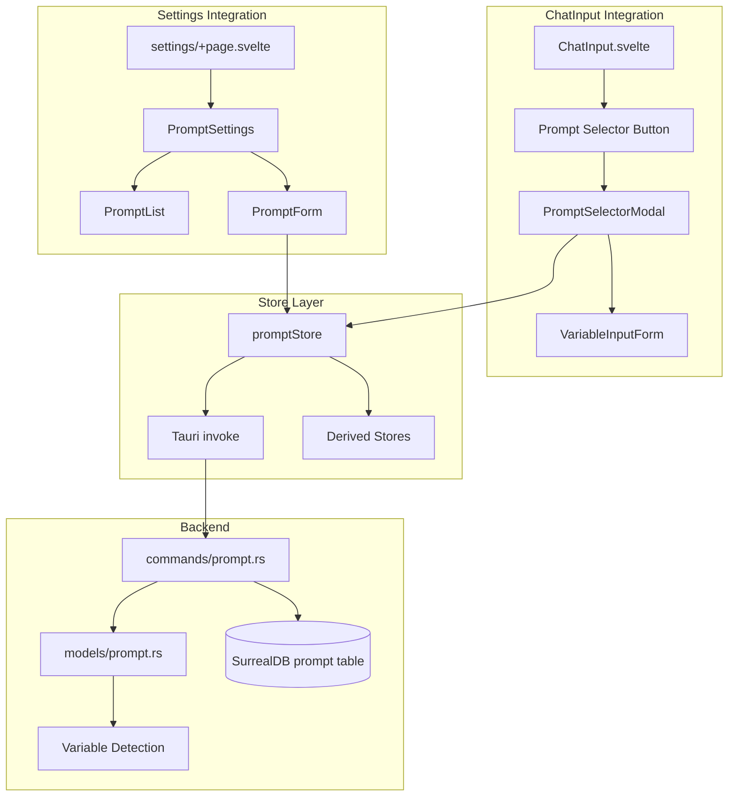
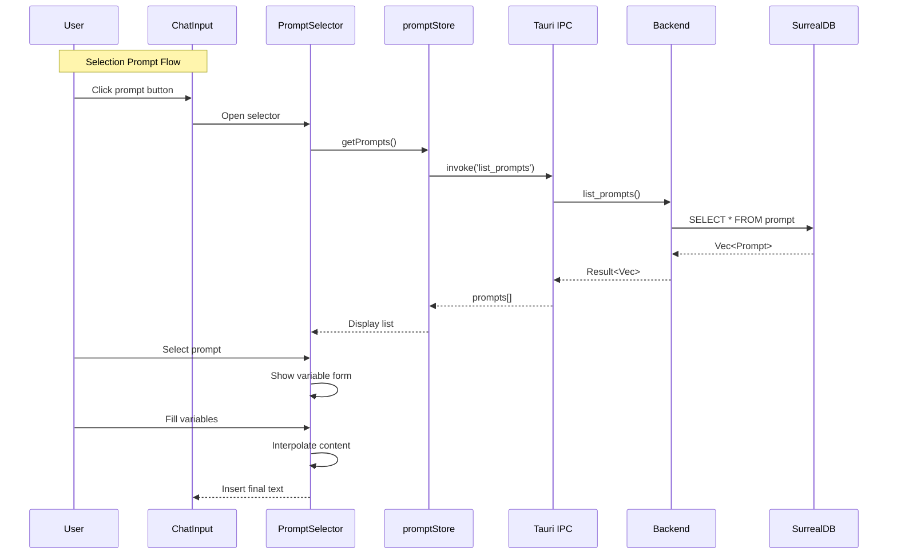

# Specification - Prompt Library

## Metadata
- **Date**: 2025-11-30
- **Stack**: Svelte 5.43 + Rust 1.91 + Tauri 2.9 + SurrealDB 2.3
- **Complexity**: Medium
- **Priority**: MEDIUM (Point #7 dans remaining-implementation-points.md)
- **Estimated Effort**: 6h

## Context

**Demande**: Implémenter la Prompt Library avec:
1. Paramétrage dans Settings (CRUD complet des prompts)
2. Bouton dans ChatInput pour sélectionner un prompt existant via modal
3. Possibilité de modifier les prompts avant utilisation
4. Détection automatique des variables `{{placeholder}}`

**Objectif**: Permettre aux utilisateurs de créer, gérer et réutiliser des prompts templated avec variables dynamiques.

**Périmètre**:
- **Inclus**: CRUD Settings, Modal sélecteur ChatInput, détection variables, preview
- **Exclus**: Versioning/historique (Phase ultérieure), Import/Export (Phase ultérieure)

**Critères Succès**:
- [ ] CRUD complet des prompts dans Settings
- [ ] Modal sélecteur accessible depuis ChatInput
- [ ] Détection automatique des variables `{{var}}`
- [ ] Preview avec substitution des variables
- [ ] Insertion dans ChatInput après sélection

---

## Etat Actuel

### Architecture Existante



### Patterns Identifies

| Pattern | Usage | Fichiers Reference |
|---------|-------|-------------------|
| **Three-Component CRUD** | Settings, List, Form | `src/lib/components/settings/agents/` |
| **Store Pattern** | Writable + methods + derived | `src/lib/stores/agents.ts` |
| **Modal Workflow** | Create/Edit/Delete avec snippets | `src/lib/components/ui/Modal.svelte` |
| **Type Sync** | TS interface = Rust struct | `src/types/agent.ts`, `src-tauri/src/models/agent.rs` |
| **Tauri IPC** | invoke() avec camelCase params | `src/routes/settings/+page.svelte` |

### Code Reutilisable

**Frontend**:
- `src/lib/components/ui/` - Button, Modal, Card, Input, Textarea, Select, Badge
- `src/lib/stores/agents.ts` - Pattern store complet
- `src/lib/components/settings/agents/` - Pattern three-component

**Backend**:
- `src-tauri/src/commands/agent.rs` - Pattern CRUD complet
- `src-tauri/src/models/agent.rs` - Pattern struct avec validation
- `src-tauri/src/agents/llm_agent.rs` - Usage regex (ligne 85+)

---

## Architecture Proposee

### Diagramme Global



### Flux de Donnees



---

## Composants

### Types Synchronises

**TypeScript Definition** (`src/types/prompt.ts`):

```typescript
// ===== Core Types =====

export type PromptCategory = 'system' | 'user' | 'analysis' | 'generation' | 'coding' | 'custom';

export interface PromptVariable {
  name: string;           // Variable name (e.g., "user_name")
  description?: string;   // Optional description for form label
  defaultValue?: string;  // Optional default value
}

// Full entity (from backend)
export interface Prompt {
  id: string;
  name: string;              // max 128 chars, unique
  description: string;       // max 1000 chars
  category: PromptCategory;
  content: string;           // max 50000 chars, with {{variable}} placeholders
  variables: PromptVariable[]; // Auto-detected from content
  created_at: string;        // ISO 8601
  updated_at: string;        // ISO 8601
}

// For list display (lightweight)
export interface PromptSummary {
  id: string;
  name: string;
  description: string;
  category: PromptCategory;
  variables_count: number;
  updated_at: string;
}

// For creation (no id, no timestamps)
export interface PromptCreate {
  name: string;
  description: string;
  category: PromptCategory;
  content: string;
}

// For updates (all optional)
export interface PromptUpdate {
  name?: string;
  description?: string;
  category?: PromptCategory;
  content?: string;
}

// ===== Utility Types =====

export interface PromptPreviewParams {
  content: string;
  variables: Record<string, string>;
}

export interface PromptPreviewResult {
  rendered: string;
  missingVariables: string[];
}

// ===== Store State =====

export interface PromptStoreState {
  prompts: PromptSummary[];
  selectedId: string | null;
  loading: boolean;
  error: string | null;
  formMode: 'create' | 'edit' | null;
  editingPrompt: Prompt | null;
}
```

**Import Pattern** (components/stores):
```typescript
import type { Prompt, PromptCreate, PromptSummary } from '$types/prompt';
```

**Rust Definition** (`src-tauri/src/models/prompt.rs`):

```rust
use chrono::{DateTime, Utc};
use serde::{Deserialize, Serialize};
use regex::Regex;

// ===== Enums =====

#[derive(Debug, Clone, Serialize, Deserialize, PartialEq)]
#[serde(rename_all = "snake_case")]
pub enum PromptCategory {
    System,
    User,
    Analysis,
    Generation,
    Coding,
    Custom,
}

impl Default for PromptCategory {
    fn default() -> Self {
        Self::Custom
    }
}

// ===== Structs =====

#[derive(Debug, Clone, Serialize, Deserialize)]
pub struct PromptVariable {
    pub name: String,
    #[serde(skip_serializing_if = "Option::is_none")]
    pub description: Option<String>,
    #[serde(default, skip_serializing_if = "Option::is_none")]
    pub default_value: Option<String>,
}

#[derive(Debug, Clone, Serialize, Deserialize)]
pub struct Prompt {
    pub id: String,
    pub name: String,
    pub description: String,
    pub category: PromptCategory,
    pub content: String,
    #[serde(default)]
    pub variables: Vec<PromptVariable>,
    #[serde(default = "Utc::now")]
    pub created_at: DateTime<Utc>,
    #[serde(default = "Utc::now")]
    pub updated_at: DateTime<Utc>,
}

#[derive(Debug, Clone, Serialize, Deserialize)]
pub struct PromptSummary {
    pub id: String,
    pub name: String,
    pub description: String,
    pub category: PromptCategory,
    pub variables_count: u32,
    pub updated_at: DateTime<Utc>,
}

#[derive(Debug, Clone, Serialize, Deserialize)]
pub struct PromptCreate {
    pub name: String,
    pub description: String,
    pub category: PromptCategory,
    pub content: String,
}

#[derive(Debug, Clone, Serialize, Deserialize)]
pub struct PromptUpdate {
    #[serde(skip_serializing_if = "Option::is_none")]
    pub name: Option<String>,
    #[serde(skip_serializing_if = "Option::is_none")]
    pub description: Option<String>,
    #[serde(skip_serializing_if = "Option::is_none")]
    pub category: Option<PromptCategory>,
    #[serde(skip_serializing_if = "Option::is_none")]
    pub content: Option<String>,
}

// ===== Variable Detection =====

impl Prompt {
    /// Extract variables from content using {{variable_name}} pattern
    pub fn detect_variables(content: &str) -> Vec<PromptVariable> {
        let pattern = Regex::new(r#"\{\{([a-zA-Z_][a-zA-Z0-9_]*)\}\}"#)
            .expect("Invalid regex pattern");

        let mut seen = std::collections::HashSet::new();
        let mut variables = Vec::new();

        for cap in pattern.captures_iter(content) {
            let name = cap[1].to_string();
            if seen.insert(name.clone()) {
                variables.push(PromptVariable {
                    name,
                    description: None,
                    default_value: None,
                });
            }
        }

        variables
    }

    /// Interpolate variables into content
    pub fn interpolate(content: &str, values: &std::collections::HashMap<String, String>) -> String {
        let pattern = Regex::new(r#"\{\{([a-zA-Z_][a-zA-Z0-9_]*)\}\}"#)
            .expect("Invalid regex pattern");

        pattern.replace_all(content, |caps: &regex::Captures| {
            let key = &caps[1];
            values.get(key)
                .map(|v| v.as_str())
                .unwrap_or(&format!("{{{{{}}}}}", key))
                .to_string()
        }).into_owned()
    }
}
```

### SurrealDB Schema

```surql
-- Table definition
DEFINE TABLE prompt SCHEMAFULL;

-- Fields
DEFINE FIELD id ON prompt TYPE string;
DEFINE FIELD name ON prompt TYPE string
    ASSERT string::len($value) >= 1 AND string::len($value) <= 128;
DEFINE FIELD description ON prompt TYPE string
    ASSERT string::len($value) <= 1000;
DEFINE FIELD category ON prompt TYPE string
    ASSERT $value IN ['system', 'user', 'analysis', 'generation', 'coding', 'custom'];
DEFINE FIELD content ON prompt TYPE string
    ASSERT string::len($value) >= 1 AND string::len($value) <= 50000;
DEFINE FIELD variables ON prompt TYPE array<object>;
DEFINE FIELD created_at ON prompt TYPE datetime DEFAULT time::now();
DEFINE FIELD updated_at ON prompt TYPE datetime DEFAULT time::now();

-- Indexes
DEFINE INDEX prompt_id_unique ON prompt FIELDS id UNIQUE;
DEFINE INDEX prompt_name_idx ON prompt FIELDS name;
DEFINE INDEX prompt_category_idx ON prompt FIELDS category;
```

---

### Frontend: Store (`src/lib/stores/prompts.ts`)

```typescript
import { writable, derived } from 'svelte/store';
import { invoke } from '@tauri-apps/api/core';
import type {
  Prompt,
  PromptCreate,
  PromptUpdate,
  PromptSummary,
  PromptStoreState
} from '$types/prompt';

const initialState: PromptStoreState = {
  prompts: [],
  selectedId: null,
  loading: false,
  error: null,
  formMode: null,
  editingPrompt: null,
};

const store = writable<PromptStoreState>(initialState);

export const promptStore = {
  subscribe: store.subscribe,

  // ===== CRUD Operations =====

  async loadPrompts(): Promise<void> {
    store.update((s) => ({ ...s, loading: true, error: null }));
    try {
      const prompts = await invoke<PromptSummary[]>('list_prompts');
      store.update((s) => ({ ...s, prompts, loading: false }));
    } catch (e) {
      store.update((s) => ({ ...s, error: String(e), loading: false }));
    }
  },

  async getPrompt(id: string): Promise<Prompt> {
    return await invoke<Prompt>('get_prompt', { promptId: id });
  },

  async createPrompt(config: PromptCreate): Promise<string> {
    store.update((s) => ({ ...s, loading: true, error: null }));
    try {
      const id = await invoke<string>('create_prompt', { config });
      await this.loadPrompts();
      store.update((s) => ({ ...s, formMode: null, loading: false }));
      return id;
    } catch (e) {
      store.update((s) => ({ ...s, error: String(e), loading: false }));
      throw e;
    }
  },

  async updatePrompt(id: string, updates: PromptUpdate): Promise<Prompt> {
    store.update((s) => ({ ...s, loading: true, error: null }));
    try {
      const updated = await invoke<Prompt>('update_prompt', {
        promptId: id,
        config: updates
      });
      await this.loadPrompts();
      store.update((s) => ({ ...s, formMode: null, editingPrompt: null, loading: false }));
      return updated;
    } catch (e) {
      store.update((s) => ({ ...s, error: String(e), loading: false }));
      throw e;
    }
  },

  async deletePrompt(id: string): Promise<void> {
    store.update((s) => ({ ...s, loading: true, error: null }));
    try {
      await invoke('delete_prompt', { promptId: id });
      await this.loadPrompts();
    } catch (e) {
      store.update((s) => ({ ...s, error: String(e), loading: false }));
      throw e;
    }
  },

  // ===== UI State Management =====

  openCreateForm(): void {
    store.update((s) => ({ ...s, formMode: 'create', editingPrompt: null }));
  },

  async openEditForm(id: string): Promise<void> {
    store.update((s) => ({ ...s, loading: true }));
    try {
      const prompt = await this.getPrompt(id);
      store.update((s) => ({
        ...s,
        formMode: 'edit',
        editingPrompt: prompt,
        loading: false
      }));
    } catch (e) {
      store.update((s) => ({ ...s, error: String(e), loading: false }));
    }
  },

  closeForm(): void {
    store.update((s) => ({ ...s, formMode: null, editingPrompt: null }));
  },

  clearError(): void {
    store.update((s) => ({ ...s, error: null }));
  },

  reset(): void {
    store.set(initialState);
  },
};

// ===== Derived Stores =====

export const prompts = derived(store, (s) => s.prompts);
export const isLoading = derived(store, (s) => s.loading);
export const error = derived(store, (s) => s.error);
export const formMode = derived(store, (s) => s.formMode);
export const editingPrompt = derived(store, (s) => s.editingPrompt);
export const hasPrompts = derived(store, (s) => s.prompts.length > 0);
```

---

### Frontend: Components

#### PromptSettings.svelte (`src/lib/components/settings/prompts/PromptSettings.svelte`)

**Structure**: Container orchestrant PromptList et PromptForm

**Props**:
```typescript
interface Props {
  // No external props - manages own state via store
}
```

**Responsibilities**:
- Subscribe au promptStore
- Affiche PromptList en mode normal
- Affiche PromptForm quand formMode !== null
- Gere les callbacks save/cancel/delete
- Affiche error banner si erreur

**Pattern Reference**: `AgentSettings.svelte`

---

#### PromptList.svelte (`src/lib/components/settings/prompts/PromptList.svelte`)

**Props**:
```typescript
interface Props {
  prompts: PromptSummary[];
  loading: boolean;
  oncreate?: () => void;
  onedit?: (id: string) => void;
  ondelete?: (id: string) => void;
  onuse?: (id: string) => void;  // For quick-use in ChatInput
}
```

**Features**:
- Grid de cards (2-3 colonnes responsive)
- Filter par category (dropdown Select)
- Search par nom (Input avec debounce)
- Empty state avec icon et bouton create
- Loading state avec StatusIndicator

**UI Pattern**:
```
[Search: _________] [Category: All v] [+ Create Prompt]

┌─────────────────┐ ┌─────────────────┐
│ 📝 Prompt Name  │ │ 📝 Another One  │
│ Description...  │ │ Description...  │
│ ────────────────│ │ ────────────────│
│ [system] 3 vars │ │ [coding] 1 var  │
│ [Edit] [Delete] │ │ [Edit] [Delete] │
└─────────────────┘ └─────────────────┘
```

---

#### PromptForm.svelte (`src/lib/components/settings/prompts/PromptForm.svelte`)

**Props**:
```typescript
interface Props {
  mode: 'create' | 'edit';
  prompt?: Prompt;
  onsave?: () => void;
  oncancel?: () => void;
  saving?: boolean;
}
```

**Form Fields**:
| Field | Component | Validation |
|-------|-----------|------------|
| name | Input | Required, max 128 chars |
| description | Textarea | max 1000 chars |
| category | Select | Required, enum values |
| content | Textarea | Required, max 50000 chars |

**Features**:
- Live variable detection (affiche badges des `{{var}}` detectees)
- Character counter pour content
- Preview section montrant le rendu
- Validation inline avec messages erreur

**Variable Detection Display**:
```
Content:
┌────────────────────────────────────────┐
│ Hello {{user_name}}, your task is:    │
│ {{task_description}}                   │
│                                        │
└────────────────────────────────────────┘
                              [45000/50000]

Detected Variables:
[user_name] [task_description]
```

---

#### PromptSelectorModal.svelte (`src/lib/components/chat/PromptSelectorModal.svelte`)

**Props**:
```typescript
interface Props {
  open: boolean;
  onclose?: () => void;
  onselect?: (content: string) => void;  // Returns interpolated content
}
```

**Flow**:
1. Modal s'ouvre avec liste des prompts
2. User clique sur un prompt
3. Si variables detectees: affiche formulaire VariableInput
4. User remplit les variables
5. Click "Use Prompt" -> interpolate et retourne contenu final
6. ChatInput recoit le texte et ferme le modal

**UI Layout**:
```
┌─────────────────────────────────────────┐
│ Select Prompt                      [X]  │
├─────────────────────────────────────────┤
│ [Search...______] [Category: All v]     │
│                                         │
│ ┌─────────────────────────────────────┐ │
│ │ > System Prompt Template            │ │
│ │   For agent configuration...        │ │
│ └─────────────────────────────────────┘ │
│ ┌─────────────────────────────────────┐ │
│ │   Code Review Template              │ │
│ │   Analyze code quality...           │ │
│ └─────────────────────────────────────┘ │
│                                         │
├─────────────────────────────────────────┤
│ [Cancel]                                │
└─────────────────────────────────────────┘
```

Quand prompt selectionne avec variables:
```
┌─────────────────────────────────────────┐
│ Fill Variables                     [<]  │
├─────────────────────────────────────────┤
│ user_name:                              │
│ [_______________________________]       │
│                                         │
│ task_description:                       │
│ [_______________________________]       │
│                                         │
├─────────────────────────────────────────┤
│ Preview:                                │
│ ┌─────────────────────────────────────┐ │
│ │ Hello Alice, your task is:          │ │
│ │ Review the code changes             │ │
│ └─────────────────────────────────────┘ │
│                                         │
├─────────────────────────────────────────┤
│ [Cancel]                 [Use Prompt]   │
└─────────────────────────────────────────┘
```

---

### Backend: Commands (`src-tauri/src/commands/prompt.rs`)

**CRUD Signatures**:

```rust
use tauri::State;
use crate::models::prompt::{Prompt, PromptCreate, PromptUpdate, PromptSummary};
use crate::AppState;

/// List all prompts (summaries only)
#[tauri::command]
pub async fn list_prompts(
    state: State<'_, AppState>,
) -> Result<Vec<PromptSummary>, String>;

/// Get full prompt by ID
#[tauri::command]
pub async fn get_prompt(
    prompt_id: String,
    state: State<'_, AppState>,
) -> Result<Prompt, String>;

/// Create new prompt
#[tauri::command]
pub async fn create_prompt(
    config: PromptCreate,
    state: State<'_, AppState>,
) -> Result<String, String>;

/// Update existing prompt
#[tauri::command]
pub async fn update_prompt(
    prompt_id: String,
    config: PromptUpdate,
    state: State<'_, AppState>,
) -> Result<Prompt, String>;

/// Delete prompt
#[tauri::command]
pub async fn delete_prompt(
    prompt_id: String,
    state: State<'_, AppState>,
) -> Result<(), String>;

/// Search prompts by query and/or category
#[tauri::command]
pub async fn search_prompts(
    query: Option<String>,
    category: Option<String>,
    state: State<'_, AppState>,
) -> Result<Vec<PromptSummary>, String>;
```

**Registration** (`src-tauri/src/main.rs`):

```rust
.invoke_handler(tauri::generate_handler![
    // ... existing commands ...
    commands::prompt::list_prompts,
    commands::prompt::get_prompt,
    commands::prompt::create_prompt,
    commands::prompt::update_prompt,
    commands::prompt::delete_prompt,
    commands::prompt::search_prompts,
])
```

---

### ChatInput Integration

**Modification** (`src/lib/components/chat/ChatInput.svelte`):

Ajouter bouton avant le send button:

```svelte
<script lang="ts">
  import { BookOpen } from 'lucide-svelte';
  import PromptSelectorModal from './PromptSelectorModal.svelte';

  let showPromptSelector = $state(false);

  function handlePromptSelect(content: string): void {
    value = content;  // Insert into textarea
    showPromptSelector = false;
    adjustHeight();
  }
</script>

<!-- In template, before send button -->
<button
  type="button"
  class="prompt-button"
  title="Select from prompt library (Ctrl+P)"
  disabled={loading || disabled}
  onclick={() => showPromptSelector = true}
>
  <BookOpen size={18} />
</button>

<!-- Modal -->
<PromptSelectorModal
  open={showPromptSelector}
  onclose={() => showPromptSelector = false}
  onselect={handlePromptSelect}
/>
```

**Keyboard Shortcut** (optionnel):
```typescript
function handleKeydown(event: KeyboardEvent): void {
  // Existing Ctrl+Enter for send
  if (event.key === 'Enter' && (event.ctrlKey || event.metaKey)) {
    event.preventDefault();
    handleSend();
  }
  // New: Ctrl+P for prompt selector
  if (event.key === 'p' && (event.ctrlKey || event.metaKey)) {
    event.preventDefault();
    showPromptSelector = true;
  }
}
```

---

## Plan d'Implementation

### Phase 1: Types et Models (1h)

**Objectif**: Definir les types TypeScript et Rust synchronises

**Taches**:
1. **Frontend**: Creer `src/types/prompt.ts`
   - Interfaces: Prompt, PromptSummary, PromptCreate, PromptUpdate
   - Type PromptCategory
   - PromptStoreState interface

2. **Backend**: Creer `src-tauri/src/models/prompt.rs`
   - Structs avec serde derives
   - PromptCategory enum
   - Impl detect_variables() et interpolate()
   - Unit tests pour variable detection

3. **Exports**: Mettre a jour `src/types/index.ts` et `src-tauri/src/models/mod.rs`

**Validation**:
- [ ] Types TS compilent sans erreur
- [ ] Structs Rust compilent avec cargo check
- [ ] Tests detect_variables passent

---

### Phase 2: Backend Commands (1.5h)

**Objectif**: Implementer les commandes Tauri CRUD

**Taches**:
1. **Database**: Ajouter schema prompt dans `src-tauri/src/db/schema.rs`

2. **Commands**: Creer `src-tauri/src/commands/prompt.rs`
   - list_prompts(): SELECT meta::id(id) AS id, ... FROM prompt
   - get_prompt(): SELECT * FROM prompt WHERE meta::id(id) = '{}'
   - create_prompt(): Validate + detect variables + CREATE prompt:`uuid`
   - update_prompt(): Validate + UPDATE prompt SET ... + re-detect variables
   - delete_prompt(): DELETE prompt:`uuid`
   - search_prompts(): WHERE name CONTAINS $query OR category = $cat

3. **Registration**: Ajouter commands dans main.rs generate_handler![]

4. **Tests**: Unit tests pour validation et queries

**Validation**:
- [ ] cargo test passe
- [ ] cargo clippy sans warnings
- [ ] Commandes registrees dans main.rs

---

### Phase 3: Store Frontend (0.5h)

**Objectif**: Creer le store Svelte pour la gestion d'etat

**Taches**:
1. **Store**: Creer `src/lib/stores/prompts.ts`
   - Pattern identique a agents.ts
   - CRUD methods avec invoke()
   - UI state methods (openCreateForm, closeForm, etc.)
   - Derived stores (prompts, isLoading, error, etc.)

2. **Export**: Mettre a jour `src/lib/stores/index.ts`

**Validation**:
- [ ] npm run check passe
- [ ] Store exporte correctement

---

### Phase 4: Components Settings (1.5h)

**Objectif**: Creer les composants CRUD pour Settings

**Taches**:
1. **PromptForm**: `src/lib/components/settings/prompts/PromptForm.svelte`
   - Form avec Input, Textarea, Select
   - Live variable detection avec badges
   - Character counter
   - Validation inline

2. **PromptList**: `src/lib/components/settings/prompts/PromptList.svelte`
   - Grid de cards avec actions
   - Filter category + search
   - Empty state et loading state

3. **PromptSettings**: `src/lib/components/settings/prompts/PromptSettings.svelte`
   - Container orchestrant List et Form
   - Gestion modal create/edit
   - Error handling

4. **Index**: `src/lib/components/settings/prompts/index.ts`

**Validation**:
- [ ] Composants affichent correctement
- [ ] CRUD fonctionne via UI
- [ ] Variables detectees en temps reel

---

### Phase 5: Integration Settings Page (0.5h)

**Objectif**: Integrer les composants dans la page Settings

**Taches**:
1. **settings/+page.svelte**:
   - Ajouter section 'prompts' dans sections array
   - Importer PromptSettings component
   - Ajouter section HTML avec id="prompts"

2. **Navigation**: Verifier scroll-to-section fonctionne

**Validation**:
- [ ] Section visible dans sidebar
- [ ] Navigation smooth scroll fonctionne
- [ ] CRUD operationnel depuis Settings

---

### Phase 6: ChatInput Integration (1h)

**Objectif**: Ajouter le selecteur de prompts dans ChatInput

**Taches**:
1. **PromptSelectorModal**: `src/lib/components/chat/PromptSelectorModal.svelte`
   - Liste des prompts avec search/filter
   - Selection et formulaire variables
   - Preview avec interpolation
   - Callback onselect avec contenu final

2. **ChatInput.svelte**:
   - Ajouter bouton prompt library
   - State showPromptSelector
   - Handler handlePromptSelect
   - Keyboard shortcut Ctrl+P (optionnel)

3. **Styling**: CSS pour bouton et integration visuelle

**Validation**:
- [ ] Bouton visible dans ChatInput
- [ ] Modal s'ouvre et liste les prompts
- [ ] Variables remplies inserent le texte correct
- [ ] ChatInput recoit le contenu interpole

---

## Estimation

| Phase | Frontend | Backend | Tests | Total |
|-------|----------|---------|-------|-------|
| 1. Types & Models | 30min | 30min | 15min | 1h15 |
| 2. Backend Commands | - | 1h | 30min | 1h30 |
| 3. Store Frontend | 30min | - | - | 30min |
| 4. Components Settings | 1h30 | - | - | 1h30 |
| 5. Integration Settings | 30min | - | - | 30min |
| 6. ChatInput Integration | 1h | - | - | 1h |

**Total Estime**: ~6h15

**Facteurs**:
- **Reduction (-15%)**: Patterns existants reutilises (agents, memory)
- **Augmentation (+10%)**: Variable detection regex a tester
- **Estimation finale**: ~6h (correspond a l'estimation du spec)

---

## Analyse Risques

| Risque | Probabilite | Impact | Mitigation | Plan B |
|--------|-------------|--------|------------|--------|
| Regex variable edge cases | Moyenne | Faible | Tests exhaustifs patterns | Fallback simple split |
| Performance gros prompts | Faible | Moyen | Debounce detection | Lazy detection on save |
| Sync types TS/Rust | Faible | Moyen | Tests integration | Schema validation |
| Modal accessibilite | Faible | Faible | ARIA attributes | Focus trap manuel |

---

## Tests

### Frontend (Vitest)

```typescript
// tests/unit/prompt-store.test.ts
describe('promptStore', () => {
  it('loads prompts from backend', async () => {
    // Mock invoke
    vi.mocked(invoke).mockResolvedValueOnce([mockPromptSummary]);
    await promptStore.loadPrompts();
    expect(get(prompts)).toHaveLength(1);
  });

  it('handles create error', async () => {
    vi.mocked(invoke).mockRejectedValueOnce('Validation failed');
    await expect(promptStore.createPrompt(invalid)).rejects.toThrow();
    expect(get(error)).toBe('Validation failed');
  });
});

// tests/unit/variable-detection.test.ts
describe('extractVariables', () => {
  it('extracts single variable', () => {
    expect(extractVariables('Hello {{name}}')).toEqual(['name']);
  });

  it('extracts multiple unique variables', () => {
    const content = '{{a}} and {{b}} and {{a}}';
    expect(extractVariables(content)).toEqual(['a', 'b']);
  });

  it('handles nested braces', () => {
    expect(extractVariables('{{{var}}}')).toEqual(['var']);
  });
});
```

### Backend (Rust)

```rust
#[cfg(test)]
mod tests {
    use super::*;

    #[test]
    fn test_detect_variables() {
        let content = "Hello {{user}}, your {{task}} is ready";
        let vars = Prompt::detect_variables(content);
        assert_eq!(vars.len(), 2);
        assert_eq!(vars[0].name, "user");
        assert_eq!(vars[1].name, "task");
    }

    #[test]
    fn test_detect_variables_dedup() {
        let content = "{{x}} and {{y}} and {{x}}";
        let vars = Prompt::detect_variables(content);
        assert_eq!(vars.len(), 2);
    }

    #[test]
    fn test_interpolate() {
        let content = "Hello {{name}}!";
        let mut values = HashMap::new();
        values.insert("name".to_string(), "Alice".to_string());
        let result = Prompt::interpolate(content, &values);
        assert_eq!(result, "Hello Alice!");
    }

    #[test]
    fn test_interpolate_missing_var() {
        let content = "Hello {{name}}!";
        let values = HashMap::new();
        let result = Prompt::interpolate(content, &values);
        assert_eq!(result, "Hello {{name}}!");
    }
}
```

### E2E (Playwright)

```typescript
// tests/e2e/prompt-library.spec.ts
test('create prompt and use in chat', async ({ page }) => {
  // Navigate to Settings
  await page.goto('/settings');
  await page.click('[data-section="prompts"]');

  // Create prompt
  await page.click('button:has-text("Create Prompt")');
  await page.fill('input[name="name"]', 'Test Prompt');
  await page.fill('textarea[name="content"]', 'Hello {{user}}');
  await page.click('button:has-text("Save")');

  // Verify created
  await expect(page.locator('text=Test Prompt')).toBeVisible();

  // Navigate to Agent
  await page.goto('/agent');

  // Open prompt selector
  await page.click('[title="Select from prompt library"]');
  await page.click('text=Test Prompt');

  // Fill variable
  await page.fill('input[name="user"]', 'Alice');
  await page.click('button:has-text("Use Prompt")');

  // Verify inserted
  await expect(page.locator('textarea')).toHaveValue('Hello Alice');
});
```

---

## Considerations

### Performance
- Debounce variable detection (300ms) pour eviter re-calculs excessifs
- Lazy loading prompts seulement quand section visible
- Pagination si >100 prompts (future phase)

### Securite
- Validation longueur max content (50000 chars)
- Sanitize nom prompt (pas de caracteres speciaux)
- Escape HTML dans preview (XSS prevention)

### Tauri Specifique
- IPC serialisation correcte (serde derives)
- State access thread-safe (Arc<RwLock>)
- Error mapping Result<T, String>

### Accessibilite
- ARIA labels sur boutons et modals
- Keyboard navigation (Tab, Enter, Escape)
- Focus trap dans modals

---

## Dependances

### Frontend (package.json)
Aucune nouvelle dependance requise. Utilise:
- lucide-svelte (existant) pour icons
- @tauri-apps/api (existant) pour invoke

### Backend (Cargo.toml)
- regex = "1" (deja present pour llm_agent)
- uuid (existant)
- chrono (existant)
- serde/serde_json (existant)

---

## Prochaines Etapes

### Validation
- [ ] Architecture approuvee
- [ ] Patterns confirmes
- [ ] Questions resolues

### Implementation
1. Commencer Phase 1 (Types)
2. Valider avec cargo check + npm run check
3. Phase 2 (Backend) avec tests
4. Phase 3-4 (Frontend) iteratif
5. Phase 5-6 (Integration) avec tests E2E
6. Review finale

### Post-Implementation (Future Phases)
- Import/Export JSON/Markdown
- Versioning avec historique
- Categories custom (CRUD)
- Tags et recherche avancee
- Partage prompts entre agents

---

## References

- Architecture: `docs/TECH_STACK.md`
- Frontend specs: `docs/FRONTEND_SPECIFICATIONS.md` (section Modele de Prompt)
- Remaining points: `docs/specs/2025-11-27_remaining-implementation-points.md` (Point #7)
- Pattern agent: `src/lib/components/settings/agents/`
- Pattern store: `src/lib/stores/agents.ts`
- Pattern commands: `src-tauri/src/commands/agent.rs`

---

**Version**: 1.0
**Status**: Ready for Implementation
