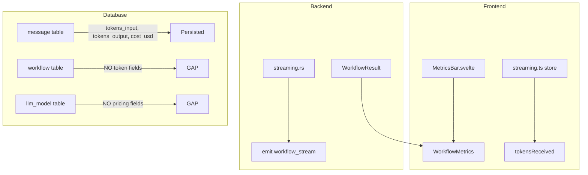
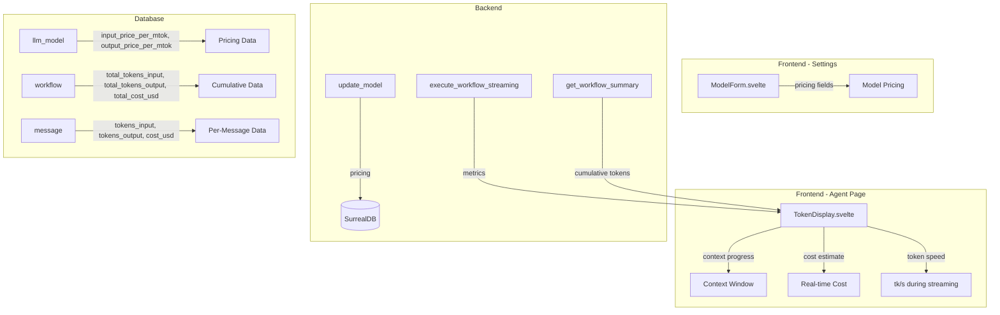

# Specification - Token Display Complet

## Metadata
- **Date**: 2025-11-30
- **Stack**: Svelte 5.43 + Rust 1.91 + Tauri 2.9 + SurrealDB 2.3
- **Complexity**: medium
- **Priority**: MEDIUM (Point #14 from remaining-implementation-points.md)
- **Estimated Effort**: 4h (extended from original 2h due to pricing persistence)

## Context

**Request**: Implement complete Token Display with:
1. Persistent token tracking (cumulative in/out per workflow)
2. Context max from model configuration
3. Remaining context visualization (used vs max)
4. Model pricing fields (input/output per million tokens)
5. User-configurable pricing amounts for Mistral models

**Objective**: Provide real-time and persistent token consumption tracking with cost estimation

**Scope**:
- **Included**: Token persistence, context window tracking, pricing configuration, cost calculation
- **Excluded**: Pricing API auto-fetch, multi-currency support, billing integration

**Success Criteria**:
- [ ] Cumulative tokens (in/out) persisted per workflow in SurrealDB
- [ ] Context window progress bar with warning states (75%, 90%, 100%)
- [ ] Model pricing fields editable in ModelForm
- [ ] Cost calculated using persisted model pricing
- [ ] MetricsBar shows real-time cost during streaming
- [ ] Token speed (tk/s) displayed during streaming

---

## Current State

### Architecture Existing



### Files Analyzed

| File | Purpose | Gap |
|------|---------|-----|
| `src/lib/components/workflow/MetricsBar.svelte` | Display metrics after completion | No streaming, no context progress |
| `src/types/workflow.ts` | WorkflowMetrics interface | No cumulative tokens |
| `src/types/llm.ts` | LLMModel interface | No pricing fields |
| `src/lib/stores/streaming.ts` | Real-time streaming state | `tokensReceived` = chunk count, not actual tokens |
| `src-tauri/src/db/schema.rs` | SurrealDB tables | workflow: no cumulative tokens, llm_model: no pricing |
| `src-tauri/src/models/llm_models.rs` | LLMModel struct | No pricing fields |
| `src/lib/components/llm/ModelForm.svelte` | Model create/edit form | No pricing inputs |

### Patterns Identified

- **Settings Persistence**: `ValidationSettings.svelte` pattern with store + Tauri command
- **Form Pattern**: `ModelForm.svelte` with validation, number inputs, checkbox
- **Metrics Display**: `MetricsBar.svelte` with formatted values and icons
- **Schema Extension**: Add fields to existing SCHEMAFULL tables

### Code Reusable

- Frontend: `Input`, `Button` from `$lib/components/ui`
- Backend: `models.rs` CRUD pattern for update/create
- Store: `validation-settings.ts` pattern for settings store

---

## Architecture Proposed

### Diagram



### Data Flow

```
1. User configures model pricing in Settings > Models
   ModelForm → invoke('update_model', { pricing }) → SurrealDB llm_model

2. During workflow execution
   streaming.rs → emit tokens → Frontend accumulates
   streaming.rs → on complete → update workflow cumulative tokens

3. Cost calculation
   tokens × (pricing / 1_000_000) = cost_usd
   Calculated in backend, persisted with message

4. Display
   TokenDisplay shows: current/max context, in/out tokens, cost, speed
   Warning states at 75%, 90%, 100% of context_window
```

---

## Components Specification

### 1. Database Schema Changes

**File**: `src-tauri/src/db/schema.rs`

#### llm_model table - Add pricing fields

```surql
-- Add to existing llm_model table definition (after is_reasoning field)
DEFINE FIELD input_price_per_mtok ON llm_model TYPE float
    ASSERT $value >= 0.0 AND $value <= 1000.0
    DEFAULT 0.0;
DEFINE FIELD output_price_per_mtok ON llm_model TYPE float
    ASSERT $value >= 0.0 AND $value <= 1000.0
    DEFAULT 0.0;
```

#### workflow table - Add cumulative token fields

```surql
-- Add to existing workflow table definition (after completed_at)
DEFINE FIELD total_tokens_input ON workflow TYPE int DEFAULT 0;
DEFINE FIELD total_tokens_output ON workflow TYPE int DEFAULT 0;
DEFINE FIELD total_cost_usd ON workflow TYPE float DEFAULT 0.0;
DEFINE FIELD model_id ON workflow TYPE option<string>;
```

### 2. TypeScript Types

**File**: `src/types/llm.ts`

```typescript
// Add to LLMModel interface (after is_reasoning)
export interface LLMModel {
  // ... existing fields ...

  /** Price per million input tokens (USD) - user configurable */
  input_price_per_mtok: number;
  /** Price per million output tokens (USD) - user configurable */
  output_price_per_mtok: number;
}

// Add to CreateModelRequest (after is_reasoning)
export interface CreateModelRequest {
  // ... existing fields ...

  /** Price per million input tokens (USD, default 0.0) */
  input_price_per_mtok?: number;
  /** Price per million output tokens (USD, default 0.0) */
  output_price_per_mtok?: number;
}

// Add to UpdateModelRequest (after is_reasoning)
export interface UpdateModelRequest {
  // ... existing fields ...

  /** New price per million input tokens (USD) */
  input_price_per_mtok?: number;
  /** New price per million output tokens (USD) */
  output_price_per_mtok?: number;
}
```

**File**: `src/types/workflow.ts`

```typescript
// Add to Workflow interface (after completed_at)
export interface Workflow {
  // ... existing fields ...

  /** Cumulative input tokens for this workflow */
  total_tokens_input: number;
  /** Cumulative output tokens for this workflow */
  total_tokens_output: number;
  /** Cumulative cost for this workflow (USD) */
  total_cost_usd: number;
  /** Model ID used (for context_window lookup) */
  model_id?: string;
}

// New interface for token display props
export interface TokenDisplayData {
  /** Input tokens for current message/streaming */
  tokens_input: number;
  /** Output tokens for current message/streaming */
  tokens_output: number;
  /** Cumulative input tokens for workflow */
  cumulative_input: number;
  /** Cumulative output tokens for workflow */
  cumulative_output: number;
  /** Context window maximum from model */
  context_max: number;
  /** Estimated cost for current message (USD) */
  cost_usd: number;
  /** Cumulative cost for workflow (USD) */
  cumulative_cost_usd: number;
  /** Token generation speed (tokens/second) - only during streaming */
  speed_tks?: number;
  /** Whether currently streaming */
  is_streaming: boolean;
}
```

### 3. Rust Types

**File**: `src-tauri/src/models/llm_models.rs`

```rust
// Add to LLMModel struct (after is_reasoning)
#[derive(Debug, Clone, Serialize, Deserialize)]
pub struct LLMModel {
    // ... existing fields ...

    /// Price per million input tokens (USD)
    #[serde(default)]
    pub input_price_per_mtok: f64,
    /// Price per million output tokens (USD)
    #[serde(default)]
    pub output_price_per_mtok: f64,
}

// Add to CreateModelRequest (after is_reasoning)
#[derive(Debug, Clone, Deserialize)]
pub struct CreateModelRequest {
    // ... existing fields ...

    /// Price per million input tokens (default 0.0)
    #[serde(default)]
    pub input_price_per_mtok: f64,
    /// Price per million output tokens (default 0.0)
    #[serde(default)]
    pub output_price_per_mtok: f64,
}

// Add to UpdateModelRequest (after is_reasoning)
#[derive(Debug, Clone, Deserialize)]
pub struct UpdateModelRequest {
    // ... existing fields ...

    /// New price per million input tokens
    pub input_price_per_mtok: Option<f64>,
    /// New price per million output tokens
    pub output_price_per_mtok: Option<f64>,
}

// Add validation in CreateModelRequest::validate()
impl CreateModelRequest {
    pub fn validate(&self) -> Result<(), String> {
        // ... existing validations ...

        // Pricing validation
        if self.input_price_per_mtok < 0.0 || self.input_price_per_mtok > 1000.0 {
            return Err("Input price must be between 0 and 1000 USD per million tokens".into());
        }
        if self.output_price_per_mtok < 0.0 || self.output_price_per_mtok > 1000.0 {
            return Err("Output price must be between 0 and 1000 USD per million tokens".into());
        }

        Ok(())
    }
}
```

**File**: `src-tauri/src/models/workflow.rs`

```rust
// Add to Workflow struct (after completed_at)
#[derive(Debug, Clone, Serialize, Deserialize)]
pub struct Workflow {
    // ... existing fields ...

    /// Cumulative input tokens
    #[serde(default)]
    pub total_tokens_input: u64,
    /// Cumulative output tokens
    #[serde(default)]
    pub total_tokens_output: u64,
    /// Cumulative cost (USD)
    #[serde(default)]
    pub total_cost_usd: f64,
    /// Model ID used (for context_window lookup)
    #[serde(default)]
    pub model_id: Option<String>,
}
```

### 4. Frontend Component: TokenDisplay

**File**: `src/lib/components/workflow/TokenDisplay.svelte`

**Type**: New component

**Props**:
```typescript
interface Props {
  /** Token display data */
  data: TokenDisplayData;
  /** Compact mode (header bar) */
  compact?: boolean;
}
```

**Features**:
- Context window progress bar with gradient (green → yellow → red)
- Warning indicators at 75%, 90%, 100%
- Tokens: "in: X / out: Y" format
- Cost: "$0.0000" format
- Speed: "X tk/s" during streaming
- Cumulative totals expandable

**Visual States**:
```
Normal (0-75%):    [████████░░░░] 6.4K / 128K tokens
Warning (75-90%):  [██████████░░] 115K / 128K tokens ⚠
Critical (90-100%): [███████████░] 122K / 128K tokens ⚠⚠
Full (100%+):      [████████████] 128K+ / 128K tokens ❌
```

### 5. Backend Commands

**File**: `src-tauri/src/commands/models.rs`

Update `update_model` command to handle pricing fields:

```rust
#[tauri::command]
pub async fn update_model(
    id: String,
    request: UpdateModelRequest,
    state: State<'_, AppState>,
) -> Result<LLMModel, String> {
    // ... existing validation ...

    // Build SET clause with pricing fields
    let mut updates = vec![];
    if let Some(price_in) = request.input_price_per_mtok {
        updates.push(format!("input_price_per_mtok = {}", price_in));
    }
    if let Some(price_out) = request.output_price_per_mtok {
        updates.push(format!("output_price_per_mtok = {}", price_out));
    }
    // ... rest of update logic ...
}
```

**File**: `src-tauri/src/commands/workflow.rs`

Add function to update workflow cumulative tokens:

```rust
/// Updates workflow cumulative token counts after message completion
async fn update_workflow_tokens(
    db: &DatabaseClient,
    workflow_id: &str,
    tokens_input: u64,
    tokens_output: u64,
    cost_usd: f64,
) -> Result<(), String> {
    let query = format!(
        "UPDATE workflow:`{}` SET
            total_tokens_input += {},
            total_tokens_output += {},
            total_cost_usd += {},
            updated_at = time::now()",
        workflow_id, tokens_input, tokens_output, cost_usd
    );
    db.execute(&query).await.map_err(|e| e.to_string())?;
    Ok(())
}
```

**File**: `src-tauri/src/commands/streaming.rs`

Update `execute_workflow_streaming` to:
1. Calculate cost using model pricing
2. Update workflow cumulative tokens on completion
3. Persist cost_usd with message

```rust
// After getting agent report metrics
let model = get_model_by_id(&db, &agent.config.llm.model).await?;
let cost_usd = calculate_cost(
    report.metrics.tokens_input,
    report.metrics.tokens_output,
    model.input_price_per_mtok,
    model.output_price_per_mtok,
);

// Update workflow cumulative
update_workflow_tokens(
    &db,
    &workflow_id,
    report.metrics.tokens_input as u64,
    report.metrics.tokens_output as u64,
    cost_usd,
).await?;

// Set cost in metrics
metrics.cost_usd = cost_usd;
```

### 6. Cost Calculation Helper

**File**: `src-tauri/src/llm/pricing.rs` (New)

```rust
/// Calculates cost based on token counts and pricing per million tokens
pub fn calculate_cost(
    tokens_input: usize,
    tokens_output: usize,
    input_price_per_mtok: f64,
    output_price_per_mtok: f64,
) -> f64 {
    let input_cost = (tokens_input as f64 / 1_000_000.0) * input_price_per_mtok;
    let output_cost = (tokens_output as f64 / 1_000_000.0) * output_price_per_mtok;
    input_cost + output_cost
}

#[cfg(test)]
mod tests {
    use super::*;

    #[test]
    fn test_calculate_cost() {
        // Mistral Large: $2/M input, $6/M output
        let cost = calculate_cost(1000, 500, 2.0, 6.0);
        // 1000/1M * 2 + 500/1M * 6 = 0.002 + 0.003 = 0.005
        assert!((cost - 0.005).abs() < 0.0001);
    }

    #[test]
    fn test_zero_pricing() {
        let cost = calculate_cost(10000, 5000, 0.0, 0.0);
        assert_eq!(cost, 0.0);
    }
}
```

### 7. ModelForm UI Extension

**File**: `src/lib/components/llm/ModelForm.svelte`

Add pricing fields section:

```svelte
<!-- After temperature field, before is_reasoning checkbox -->
<div class="pricing-section">
  <h4 class="pricing-title">Pricing (USD per million tokens)</h4>
  <p class="pricing-help">
    Enter your provider's pricing. Check
    <a href="https://mistral.ai/technology/#pricing" target="_blank" rel="noopener">
      Mistral pricing
    </a> for current rates.
  </p>

  <div class="form-row">
    <div class="form-field">
      <Input
        label="Input Price"
        type="number"
        value={formData.input_price_per_mtok.toString()}
        oninput={(e) => handleNumberInput('input_price_per_mtok', e)}
        step="0.01"
        min="0"
        max="1000"
        help="$ per million input tokens"
        disabled={saving}
      />
    </div>

    <div class="form-field">
      <Input
        label="Output Price"
        type="number"
        value={formData.output_price_per_mtok.toString()}
        oninput={(e) => handleNumberInput('output_price_per_mtok', e)}
        step="0.01"
        min="0"
        max="1000"
        help="$ per million output tokens"
        disabled={saving}
      />
    </div>
  </div>
</div>
```

---

## Implementation Plan

### Phase 1: Database Schema (30min)

**Objective**: Add pricing and cumulative token fields to SurrealDB

**Tasks**:
1. **Database**: Modify `src-tauri/src/db/schema.rs`
   - Add `input_price_per_mtok`, `output_price_per_mtok` to llm_model table
   - Add `total_tokens_input`, `total_tokens_output`, `total_cost_usd`, `model_id` to workflow table

2. **Migration**: Create migration for existing data
   - Existing llm_model records get pricing = 0.0
   - Existing workflow records get cumulative = 0

**Validation**:
- [ ] Schema compiles without errors
- [ ] New fields accessible in SurrealDB queries
- [ ] Existing data preserved

### Phase 2: Backend Types & Commands (1h)

**Objective**: Update Rust types and commands to handle pricing/cumulative tokens

**Tasks**:
1. **Types**: Update `src-tauri/src/models/llm_models.rs`
   - Add pricing fields to LLMModel, CreateModelRequest, UpdateModelRequest
   - Add validation for pricing range (0-1000)

2. **Types**: Update `src-tauri/src/models/workflow.rs`
   - Add cumulative token fields to Workflow struct

3. **Commands**: Update `src-tauri/src/commands/models.rs`
   - Handle pricing in create_model and update_model
   - Include pricing in list_models response

4. **Commands**: Update `src-tauri/src/commands/workflow.rs`
   - Add update_workflow_tokens helper function
   - Include cumulative tokens in workflow queries

5. **Pricing**: Create `src-tauri/src/llm/pricing.rs`
   - Implement calculate_cost function
   - Add unit tests

6. **Streaming**: Update `src-tauri/src/commands/streaming.rs`
   - Calculate cost after execution
   - Call update_workflow_tokens on completion
   - Include cost_usd in metrics

**Validation**:
- [ ] cargo check passes
- [ ] cargo test passes (new pricing tests)
- [ ] update_model handles pricing fields

### Phase 3: Frontend Types & Store (30min)

**Objective**: Update TypeScript types and add token tracking to streaming store

**Tasks**:
1. **Types**: Update `src/types/llm.ts`
   - Add pricing fields to LLMModel, CreateModelRequest, UpdateModelRequest

2. **Types**: Update `src/types/workflow.ts`
   - Add cumulative fields to Workflow
   - Create TokenDisplayData interface

3. **Store**: Update `src/lib/stores/streaming.ts`
   - Add token speed calculation (tokens / elapsed time)
   - Expose speed_tks derived store

**Validation**:
- [ ] npm run check passes
- [ ] Types synchronized with Rust

### Phase 4: UI Components (1.5h)

**Objective**: Create TokenDisplay and extend ModelForm

**Tasks**:
1. **Component**: Create `src/lib/components/workflow/TokenDisplay.svelte`
   - Context progress bar with gradient colors
   - Warning states (75%, 90%, 100%)
   - Token counts (in/out current + cumulative)
   - Cost display (current + cumulative)
   - Speed during streaming

2. **Component**: Update `src/lib/components/llm/ModelForm.svelte`
   - Add pricing section with two inputs
   - Validation for pricing range
   - Help text with link to Mistral pricing

3. **Component**: Update `src/lib/components/workflow/MetricsBar.svelte`
   - Use TokenDisplay for token section
   - Or integrate token display inline

4. **Page**: Update `src/routes/agent/+page.svelte`
   - Pass cumulative tokens to display
   - Load workflow with cumulative data
   - Show TokenDisplay during streaming

**Validation**:
- [ ] TokenDisplay renders correctly
- [ ] Progress bar shows correct percentage
- [ ] Warning states appear at thresholds
- [ ] ModelForm saves pricing

### Phase 5: Integration & Testing (30min)

**Objective**: End-to-end validation

**Tasks**:
1. **Manual Test**: Create model with pricing
2. **Manual Test**: Execute workflow, verify cost calculation
3. **Manual Test**: Verify cumulative tokens persist across messages
4. **Manual Test**: Warning states at context limits

**Validation**:
- [ ] Pricing persists after app restart
- [ ] Cost calculates correctly
- [ ] Cumulative tokens accumulate
- [ ] Context warnings appear

---

## Estimation

| Phase | Frontend | Backend | Database | Tests | Total |
|-------|----------|---------|----------|-------|-------|
| 1. Schema | - | - | 30min | - | 30min |
| 2. Backend | - | 45min | - | 15min | 1h |
| 3. Types | 20min | - | - | 10min | 30min |
| 4. UI | 1h30 | - | - | - | 1h30 |
| 5. Integration | 15min | - | - | 15min | 30min |
| **Total** | **2h05** | **45min** | **30min** | **40min** | **4h** |

**Factors**:
- Reuse existing ModelForm pattern: -20%
- Existing schema extension pattern: -10%
- New TokenDisplay component: +30%
- Cost calculation logic: +10%

---

## Risk Analysis

| Risk | Probability | Impact | Mitigation | Plan B |
|------|-------------|--------|------------|--------|
| Schema migration breaks existing data | Low | High | Add fields with DEFAULT values | Manual data migration script |
| Float precision for cost | Low | Medium | Use f64, round to 4 decimals on display | Store as integer cents |
| Context window varies by conversation | Medium | Medium | Track per-workflow, reset on new conversation | Add "Reset Context" button |
| Pricing API changes | Low | Low | User-editable, not auto-fetched | Manual update by user |

---

## Tests

### Backend (Rust)

```rust
// src-tauri/src/llm/pricing.rs
#[cfg(test)]
mod tests {
    #[test]
    fn test_calculate_cost_mistral_large() {
        // Mistral Large: $2/M input, $6/M output
        let cost = calculate_cost(10000, 2000, 2.0, 6.0);
        // (10000/1M)*2 + (2000/1M)*6 = 0.02 + 0.012 = 0.032
        assert!((cost - 0.032).abs() < 0.0001);
    }

    #[test]
    fn test_ollama_free() {
        let cost = calculate_cost(100000, 50000, 0.0, 0.0);
        assert_eq!(cost, 0.0);
    }
}
```

### Frontend (Vitest)

```typescript
// src/lib/components/workflow/TokenDisplay.test.ts
import { render } from '@testing-library/svelte';
import TokenDisplay from './TokenDisplay.svelte';

describe('TokenDisplay', () => {
  it('shows warning at 75% context', () => {
    const { getByRole } = render(TokenDisplay, {
      data: {
        tokens_input: 0,
        tokens_output: 0,
        cumulative_input: 90000,
        cumulative_output: 6000, // 96K / 128K = 75%
        context_max: 128000,
        cost_usd: 0,
        cumulative_cost_usd: 0,
        is_streaming: false,
      }
    });
    expect(getByRole('progressbar')).toHaveClass('warning');
  });
});
```

---

## Considerations

### Performance
- Calculate cost server-side, not in frontend
- Cache model pricing in streaming command
- Update cumulative with single atomic UPDATE query

### Security
- Validate pricing input (0-1000 range)
- No sensitive data in pricing fields
- Cost displayed but not transmitted externally

### Tauri Specific
- IPC serialization: f64 for pricing, u64 for tokens
- AppState: cache model pricing during streaming
- Event emission: no change needed (metrics already emitted)

---

## Dependencies

### Frontend (package.json)
No new dependencies required.

### Backend (Cargo.toml)
No new dependencies required.

---

## Reference: Mistral Pricing (Nov 2025)

For user reference when configuring pricing:

| Model | Input $/M | Output $/M |
|-------|-----------|------------|
| mistral-large-latest | $2.00 | $6.00 |
| mistral-small-latest | $0.20 | $0.60 |
| codestral-latest | $0.20 | $0.60 |
| mistral-embed | $0.10 | N/A |

**Note**: Prices subject to change. Users should verify current pricing at https://mistral.ai/technology/#pricing

---

## Next Steps

### Before Implementation
- [ ] Architecture approved
- [ ] Dependencies validated
- [ ] Questions resolved

### Implementation Order
1. Phase 1: Database Schema
2. Phase 2: Backend Types & Commands
3. Phase 3: Frontend Types & Store
4. Phase 4: UI Components
5. Phase 5: Integration & Testing

### Post-Implementation
- [ ] Update CLAUDE.md with new command signatures
- [ ] Document pricing configuration in user guide
- [ ] Consider: auto-fetch pricing from providers (future enhancement)

---

## References

- Architecture: `docs/TECH_STACK.md`
- Frontend Specs: `docs/FRONTEND_SPECIFICATIONS.md` (Section 3.6 Token Display)
- Remaining Points: `docs/specs/2025-11-27_remaining-implementation-points.md` (Point #14)
- Existing Components:
  - `src/lib/components/workflow/MetricsBar.svelte`
  - `src/lib/components/llm/ModelForm.svelte`
  - `src/lib/stores/streaming.ts`
- Existing Types:
  - `src/types/llm.ts`
  - `src/types/workflow.ts`
  - `src-tauri/src/models/llm_models.rs`
  - `src-tauri/src/models/workflow.rs`

---

**Version**: 1.0
**Status**: Ready for Implementation
