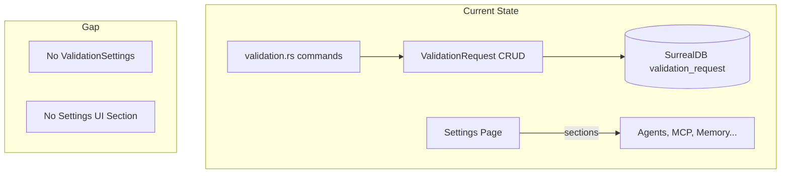
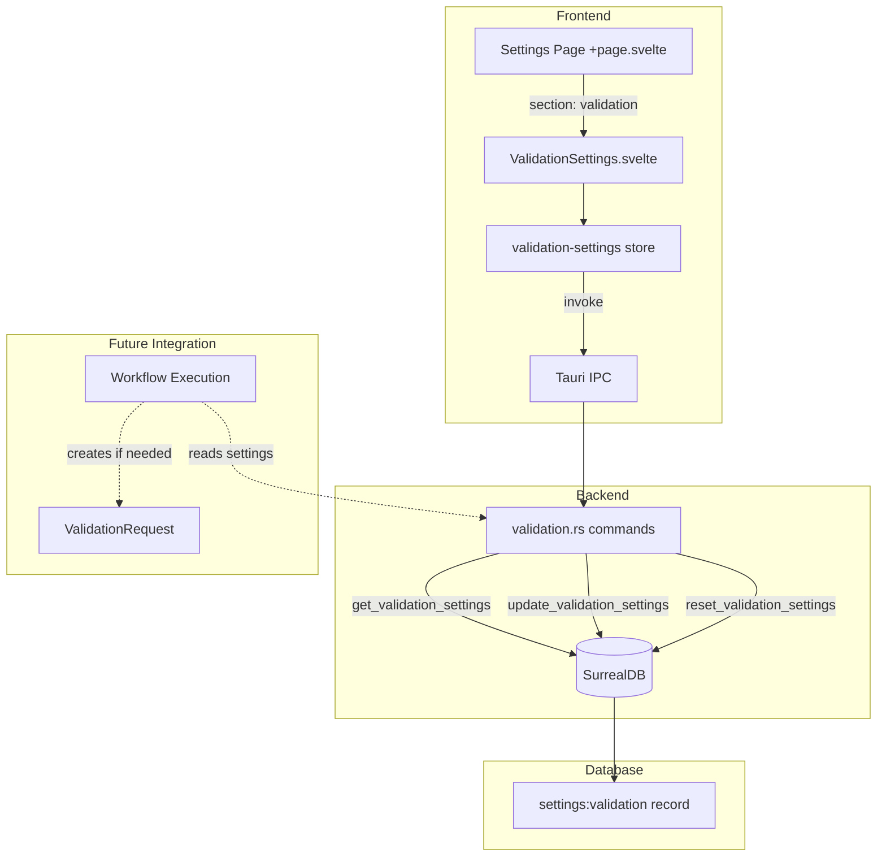
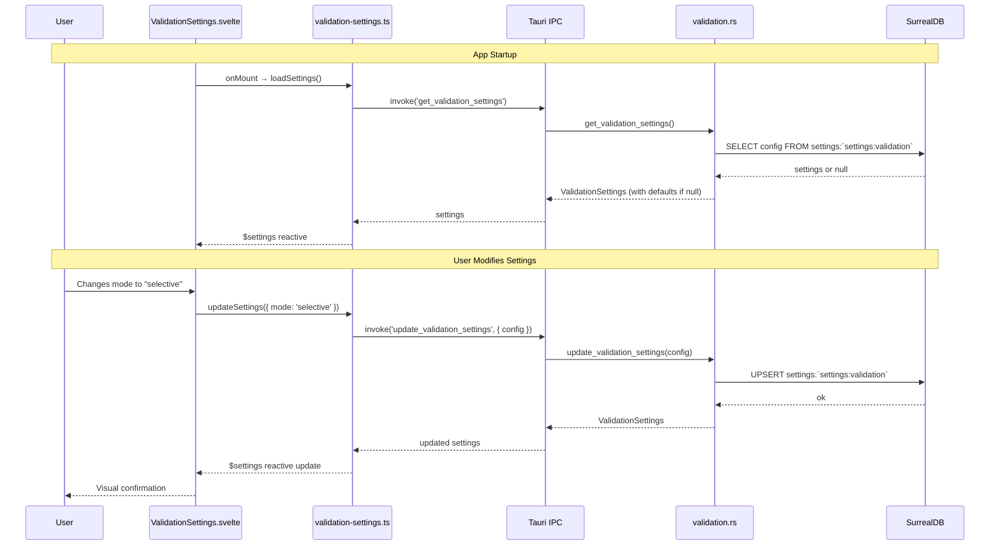

# Specification - Validation Settings (Global Config)

## Metadata
- **Date**: 2025-11-30
- **Stack**: Svelte 5.43 + Rust 1.91 + Tauri 2.9 + SurrealDB 2.3
- **Complexity**: Medium
- **Estimated Effort**: 4h
- **Priority**: HIGH (Phase 7A prerequisite)

## Context

**Demand**: Implement global validation settings configuration in the Settings page.

**Objective**: Allow users to configure when and how human-in-the-loop validation is triggered during workflow execution.

**Scope**:
- **Included**:
  - Validation mode selection (Auto/Manual/Selective)
  - Selective configuration per operation type
  - Risk threshold configuration
  - Timeout settings with behavior selection
  - Audit settings (logging, retention, export)
  - Persistence to SurrealDB
  - Settings page UI section
- **Excluded**:
  - Validation Request UI (separate implementation #11)
  - Message Queue System (separate implementation #9)
  - Integration with workflow execution (backend hook exists, wiring deferred)

**Success Criteria**:
- [ ] User can select validation mode (Auto/Manual/Selective)
- [ ] Selective configuration toggles work correctly
- [ ] Settings persist across app restarts
- [ ] Default values are sensible and functional
- [ ] Reset to defaults works
- [ ] Settings load on app startup

---

## Current State

### Architecture Overview



### Existing Validation Infrastructure

**Commands** (`src-tauri/src/commands/validation.rs`):
| Command | Purpose |
|---------|---------|
| `create_validation_request` | Create pending approval request |
| `list_pending_validations` | List pending requests |
| `list_workflow_validations` | Filter by workflow |
| `approve_validation` | User approves operation |
| `reject_validation` | User rejects operation |
| `delete_validation` | Clean up validation |

**Types** (`src/types/validation.ts` + `src-tauri/src/models/validation.rs`):
```typescript
export type ValidationMode = 'auto' | 'manual' | 'selective';
export type ValidationType = 'tool' | 'sub_agent' | 'mcp' | 'file_op' | 'db_op';
export type RiskLevel = 'low' | 'medium' | 'high' | 'critical';
```

### Key Distinction

| Concept | Purpose | Status |
|---------|---------|--------|
| ValidationRequest | Runtime approval request during workflow | EXISTS |
| ValidationSettings | Global config determining when to create requests | MISSING |

### Reusable Patterns Identified

| Pattern | Source File | Usage |
|---------|-------------|-------|
| Card Selector | `AgentForm.svelte` | Mode selection (Auto/Manual/Selective) |
| Checkbox Group | `AgentForm.svelte` | Selective operation toggles |
| Number Input | `ModelForm.svelte` | Timeout slider |
| Settings Store | `agents.ts`, `mcp.ts` | writable store pattern |
| Settings CRUD | `commands/models.rs` | get/update/reset pattern |
| UPSERT Settings | `schema.rs` | settings:key record pattern |

---

## Architecture Proposed

### Diagram



### Data Flow



---

## Components Specification

### Frontend: ValidationSettings.svelte

- **Path**: `src/lib/components/settings/validation/ValidationSettings.svelte`
- **Type**: New
- **Purpose**: Main container for validation settings form

**Component Structure**:
```
ValidationSettings.svelte
├── Mode Selector (Card Selector - 3 options)
├── Selective Config (Checkbox Group - 5 toggles, conditional)
├── Risk Thresholds (2 checkboxes)
├── Timeout Config (Number input + Radio group)
├── Audit Config (Checkbox + Number input + Export button)
└── Action Buttons (Reset + Save)
```

**Props/State**:
```typescript
// No external props - uses store directly
// Internal state:
let saving = $state(false);
let message = $state<{ type: 'success' | 'error'; text: string } | null>(null);

// Derived from store
const settings = $derived(get(validationSettingsStore).settings);
const loading = $derived(get(validationSettingsStore).loading);
const error = $derived(get(validationSettingsStore).error);
```

**Store Usage**:
```typescript
import { validationSettingsStore } from '$lib/stores/validation-settings';

onMount(async () => {
  await validationSettingsStore.loadSettings();
});

async function handleSave() {
  saving = true;
  try {
    await validationSettingsStore.updateSettings(localSettings);
    message = { type: 'success', text: 'Settings saved' };
  } catch (err) {
    message = { type: 'error', text: String(err) };
  } finally {
    saving = false;
  }
}
```

**UI Layout**:
```
┌─────────────────────────────────────────────────────────────┐
│ Validation Settings                                          │
├─────────────────────────────────────────────────────────────┤
│                                                              │
│ Validation Mode                                              │
│ ┌─────────────┐ ┌─────────────┐ ┌─────────────┐             │
│ │ ● Auto      │ │ ○ Manual    │ │ ○ Selective │             │
│ │ Execute all │ │ Confirm all │ │ Choose ops  │             │
│ │ operations  │ │ operations  │ │ to validate │             │
│ │ without     │ │ before      │ │             │             │
│ │ confirmation│ │ execution   │ │             │             │
│ └─────────────┘ └─────────────┘ └─────────────┘             │
│                                                              │
│ ─────────────────────────────────────────────────────────── │
│                                                              │
│ Selective Configuration (visible when mode = selective)      │
│                                                              │
│ ☐ Tool Execution                                            │
│   Validate calls to internal tools                          │
│                                                              │
│ ☑ Sub-Agent Spawn                                           │
│   Validate creation of sub-agents                           │
│                                                              │
│ ☑ MCP Server Calls                                          │
│   Validate calls to MCP servers                             │
│                                                              │
│ ☑ File Operations                                           │
│   Validate file write/delete operations                     │
│                                                              │
│ ☑ Database Operations                                       │
│   Validate database write/delete operations                 │
│                                                              │
│ ─────────────────────────────────────────────────────────── │
│                                                              │
│ Risk Thresholds                                              │
│                                                              │
│ ☑ Auto-approve LOW risk operations                          │
│   Skip validation for low-risk operations                   │
│                                                              │
│ ☐ Always confirm HIGH risk operations                       │
│   Require validation even in Auto mode (dangerous!)         │
│                                                              │
│ ─────────────────────────────────────────────────────────── │
│                                                              │
│ Validation Timeout                                           │
│                                                              │
│ Timeout delay                                                │
│ [━━━━━━━━━━━━━━━○━━━━━━━━━━━━] 60 seconds                   │
│ 30s                                              300s        │
│                                                              │
│ On timeout:                                                  │
│ ○ Reject operation                                          │
│ ● Approve operation                                         │
│ ○ Ask again                                                 │
│                                                              │
│ ─────────────────────────────────────────────────────────── │
│                                                              │
│ Audit Settings                                               │
│                                                              │
│ ☑ Enable validation logging                                 │
│   Log all validation decisions for audit trail              │
│                                                              │
│ Log retention                                                │
│ [━━━━━━○━━━━━━━━━━━━━━━━━━━━━] 30 days                      │
│ 7 days                                           90 days    │
│                                                              │
│ [Export Logs]                                                │
│                                                              │
├─────────────────────────────────────────────────────────────┤
│                                                              │
│              [Reset to Defaults]        [Save Changes]       │
│                                                              │
└─────────────────────────────────────────────────────────────┘
```

---

### Frontend: Store (validation-settings.ts)

- **Path**: `src/lib/stores/validation-settings.ts`
- **Type**: New
- **Pattern**: Following `agents.ts` writable store pattern

**Interface**:
```typescript
import { writable, derived, get } from 'svelte/store';
import { invoke } from '@tauri-apps/api/core';
import type {
  ValidationSettings,
  ValidationSettingsConfig,
  UpdateValidationSettingsRequest
} from '$types/validation';

interface ValidationSettingsState {
  settings: ValidationSettings | null;
  loading: boolean;
  saving: boolean;
  error: string | null;
}

const initialState: ValidationSettingsState = {
  settings: null,
  loading: false,
  saving: false,
  error: null
};

function createValidationSettingsStore() {
  const store = writable<ValidationSettingsState>(initialState);

  return {
    subscribe: store.subscribe,

    async loadSettings(): Promise<void> {
      store.update(s => ({ ...s, loading: true, error: null }));
      try {
        const settings = await invoke<ValidationSettings>('get_validation_settings');
        store.update(s => ({ ...s, settings, loading: false }));
      } catch (err) {
        store.update(s => ({ ...s, error: String(err), loading: false }));
      }
    },

    async updateSettings(config: UpdateValidationSettingsRequest): Promise<void> {
      store.update(s => ({ ...s, saving: true, error: null }));
      try {
        const settings = await invoke<ValidationSettings>('update_validation_settings', { config });
        store.update(s => ({ ...s, settings, saving: false }));
      } catch (err) {
        store.update(s => ({ ...s, error: String(err), saving: false }));
        throw err;
      }
    },

    async resetToDefaults(): Promise<void> {
      store.update(s => ({ ...s, saving: true, error: null }));
      try {
        const settings = await invoke<ValidationSettings>('reset_validation_settings');
        store.update(s => ({ ...s, settings, saving: false }));
      } catch (err) {
        store.update(s => ({ ...s, error: String(err), saving: false }));
        throw err;
      }
    },

    getState(): ValidationSettingsState {
      return get(store);
    }
  };
}

export const validationSettingsStore = createValidationSettingsStore();

// Derived stores for convenience
export const settings = derived(
  validationSettingsStore,
  $store => $store.settings
);

export const isLoading = derived(
  validationSettingsStore,
  $store => $store.loading
);

export const isSaving = derived(
  validationSettingsStore,
  $store => $store.saving
);
```

---

### Frontend: Types (validation.ts extension)

- **Path**: `src/types/validation.ts`
- **Type**: Modification (extend existing)

**New Types to Add**:
```typescript
// =====================================================
// Validation Settings Types (Global Configuration)
// =====================================================

/** Timeout behavior when validation request expires */
export type TimeoutBehavior = 'reject' | 'approve' | 'ask_again';

/** Selective validation config - which operations require validation */
export interface SelectiveValidationConfig {
  /** Validate internal tool execution */
  tools: boolean;
  /** Validate sub-agent spawn */
  subAgents: boolean;
  /** Validate MCP server calls */
  mcp: boolean;
  /** Validate file write/delete operations */
  fileOps: boolean;
  /** Validate database write/delete operations */
  dbOps: boolean;
}

/** Risk threshold configuration */
export interface RiskThresholdConfig {
  /** Skip validation for low-risk operations */
  autoApproveLow: boolean;
  /** Always require validation for high-risk (even in Auto mode) */
  alwaysConfirmHigh: boolean;
}

/** Audit/logging configuration */
export interface AuditConfig {
  /** Enable validation decision logging */
  enableLogging: boolean;
  /** Log retention in days (7-90) */
  retentionDays: number;
}

/** Main validation settings configuration */
export interface ValidationSettingsConfig {
  /** Validation mode */
  mode: ValidationMode;
  /** Selective config (used when mode = 'selective') */
  selectiveConfig: SelectiveValidationConfig;
  /** Risk threshold settings */
  riskThresholds: RiskThresholdConfig;
  /** Timeout in seconds (30-300) */
  timeoutSeconds: number;
  /** Behavior when timeout expires */
  timeoutBehavior: TimeoutBehavior;
  /** Audit settings */
  audit: AuditConfig;
}

/** Validation settings with metadata */
export interface ValidationSettings extends ValidationSettingsConfig {
  /** Last update timestamp (ISO 8601) */
  updatedAt: string;
}

/** Update request (partial update) */
export interface UpdateValidationSettingsRequest {
  mode?: ValidationMode;
  selectiveConfig?: Partial<SelectiveValidationConfig>;
  riskThresholds?: Partial<RiskThresholdConfig>;
  timeoutSeconds?: number;
  timeoutBehavior?: TimeoutBehavior;
  audit?: Partial<AuditConfig>;
}

/** Default settings values */
export const DEFAULT_VALIDATION_SETTINGS: ValidationSettingsConfig = {
  mode: 'selective',
  selectiveConfig: {
    tools: false,
    subAgents: true,
    mcp: true,
    fileOps: true,
    dbOps: true,
  },
  riskThresholds: {
    autoApproveLow: true,
    alwaysConfirmHigh: false,
  },
  timeoutSeconds: 60,
  timeoutBehavior: 'reject',
  audit: {
    enableLogging: true,
    retentionDays: 30,
  },
};
```

---

### Backend: Commands (validation.rs extension)

- **Path**: `src-tauri/src/commands/validation.rs`
- **Type**: Modification (add 3 new commands)

**New Commands**:
```rust
use crate::models::validation::{
    ValidationSettings, ValidationSettingsConfig, UpdateValidationSettingsRequest,
    DEFAULT_VALIDATION_SETTINGS
};

/// Get validation settings (returns defaults if not configured)
#[tauri::command]
#[instrument(name = "get_validation_settings", skip(state))]
pub async fn get_validation_settings(
    state: State<'_, AppState>,
) -> Result<ValidationSettings, String> {
    let db = &state.db;

    // Try to load existing settings
    let query = "SELECT config FROM settings:`settings:validation`";
    let results: Vec<serde_json::Value> = db.query_json(query)
        .await
        .map_err(|e| format!("Failed to query settings: {}", e))?;

    if let Some(first) = results.first() {
        if let Some(config) = first.get("config") {
            let settings: ValidationSettings = serde_json::from_value(config.clone())
                .map_err(|e| format!("Failed to parse settings: {}", e))?;
            return Ok(settings);
        }
    }

    // Return defaults if not found
    info!("No validation settings found, returning defaults");
    Ok(ValidationSettings {
        config: DEFAULT_VALIDATION_SETTINGS.clone(),
        updated_at: chrono::Utc::now(),
    })
}

/// Update validation settings (partial update supported)
#[tauri::command]
#[instrument(name = "update_validation_settings", skip(state))]
pub async fn update_validation_settings(
    config: UpdateValidationSettingsRequest,
    state: State<'_, AppState>,
) -> Result<ValidationSettings, String> {
    let db = &state.db;

    // Load existing settings
    let mut current = get_validation_settings(state.clone()).await?;

    // Apply partial updates
    if let Some(mode) = config.mode {
        current.mode = mode;
    }
    if let Some(selective) = config.selective_config {
        if let Some(v) = selective.tools { current.selective_config.tools = v; }
        if let Some(v) = selective.sub_agents { current.selective_config.sub_agents = v; }
        if let Some(v) = selective.mcp { current.selective_config.mcp = v; }
        if let Some(v) = selective.file_ops { current.selective_config.file_ops = v; }
        if let Some(v) = selective.db_ops { current.selective_config.db_ops = v; }
    }
    if let Some(risk) = config.risk_thresholds {
        if let Some(v) = risk.auto_approve_low { current.risk_thresholds.auto_approve_low = v; }
        if let Some(v) = risk.always_confirm_high { current.risk_thresholds.always_confirm_high = v; }
    }
    if let Some(timeout) = config.timeout_seconds {
        // Validate range 30-300
        if timeout < 30 || timeout > 300 {
            return Err("Timeout must be between 30 and 300 seconds".to_string());
        }
        current.timeout_seconds = timeout;
    }
    if let Some(behavior) = config.timeout_behavior {
        current.timeout_behavior = behavior;
    }
    if let Some(audit) = config.audit {
        if let Some(v) = audit.enable_logging { current.audit.enable_logging = v; }
        if let Some(v) = audit.retention_days {
            // Validate range 7-90
            if v < 7 || v > 90 {
                return Err("Retention must be between 7 and 90 days".to_string());
            }
            current.audit.retention_days = v;
        }
    }

    // Update timestamp
    current.updated_at = chrono::Utc::now();

    // Save to database
    let json_config = serde_json::to_value(&current)
        .map_err(|e| format!("Failed to serialize settings: {}", e))?;

    db.execute(&format!(
        "UPSERT settings:`settings:validation` SET config = {}",
        serde_json::to_string(&json_config).unwrap()
    ))
    .await
    .map_err(|e| format!("Failed to save settings: {}", e))?;

    info!("Validation settings updated");
    Ok(current)
}

/// Reset validation settings to defaults
#[tauri::command]
#[instrument(name = "reset_validation_settings", skip(state))]
pub async fn reset_validation_settings(
    state: State<'_, AppState>,
) -> Result<ValidationSettings, String> {
    let db = &state.db;

    let settings = ValidationSettings {
        config: DEFAULT_VALIDATION_SETTINGS.clone(),
        updated_at: chrono::Utc::now(),
    };

    let json_config = serde_json::to_value(&settings)
        .map_err(|e| format!("Failed to serialize settings: {}", e))?;

    db.execute(&format!(
        "UPSERT settings:`settings:validation` SET config = {}",
        serde_json::to_string(&json_config).unwrap()
    ))
    .await
    .map_err(|e| format!("Failed to save settings: {}", e))?;

    info!("Validation settings reset to defaults");
    Ok(settings)
}
```

**Command Registration** (main.rs):
```rust
// Add to tauri::generate_handler![]
commands::validation::get_validation_settings,
commands::validation::update_validation_settings,
commands::validation::reset_validation_settings,
```

---

### Backend: Models (validation.rs extension)

- **Path**: `src-tauri/src/models/validation.rs`
- **Type**: Modification (add settings structs)

**New Structs**:
```rust
use chrono::{DateTime, Utc};

// =====================================================
// Validation Settings Types (Global Configuration)
// =====================================================

/// Timeout behavior enum
#[derive(Debug, Clone, PartialEq, Eq, Serialize, Deserialize)]
#[serde(rename_all = "snake_case")]
pub enum TimeoutBehavior {
    Reject,
    Approve,
    AskAgain,
}

impl Default for TimeoutBehavior {
    fn default() -> Self {
        Self::Reject
    }
}

/// Selective validation configuration
#[derive(Debug, Clone, Serialize, Deserialize)]
pub struct SelectiveValidationConfig {
    pub tools: bool,
    pub sub_agents: bool,
    pub mcp: bool,
    pub file_ops: bool,
    pub db_ops: bool,
}

impl Default for SelectiveValidationConfig {
    fn default() -> Self {
        Self {
            tools: false,
            sub_agents: true,
            mcp: true,
            file_ops: true,
            db_ops: true,
        }
    }
}

/// Risk threshold configuration
#[derive(Debug, Clone, Serialize, Deserialize)]
pub struct RiskThresholdConfig {
    pub auto_approve_low: bool,
    pub always_confirm_high: bool,
}

impl Default for RiskThresholdConfig {
    fn default() -> Self {
        Self {
            auto_approve_low: true,
            always_confirm_high: false,
        }
    }
}

/// Audit configuration
#[derive(Debug, Clone, Serialize, Deserialize)]
pub struct AuditConfig {
    pub enable_logging: bool,
    pub retention_days: i32,
}

impl Default for AuditConfig {
    fn default() -> Self {
        Self {
            enable_logging: true,
            retention_days: 30,
        }
    }
}

/// Main validation settings configuration
#[derive(Debug, Clone, Serialize, Deserialize)]
pub struct ValidationSettingsConfig {
    pub mode: ValidationMode,
    pub selective_config: SelectiveValidationConfig,
    pub risk_thresholds: RiskThresholdConfig,
    pub timeout_seconds: i32,
    pub timeout_behavior: TimeoutBehavior,
    pub audit: AuditConfig,
}

impl Default for ValidationSettingsConfig {
    fn default() -> Self {
        Self {
            mode: ValidationMode::Selective,
            selective_config: SelectiveValidationConfig::default(),
            risk_thresholds: RiskThresholdConfig::default(),
            timeout_seconds: 60,
            timeout_behavior: TimeoutBehavior::default(),
            audit: AuditConfig::default(),
        }
    }
}

/// Validation settings with metadata
#[derive(Debug, Clone, Serialize, Deserialize)]
pub struct ValidationSettings {
    #[serde(flatten)]
    pub config: ValidationSettingsConfig,
    pub updated_at: DateTime<Utc>,
}

/// Static default for lazy initialization
pub static DEFAULT_VALIDATION_SETTINGS: once_cell::sync::Lazy<ValidationSettingsConfig> =
    once_cell::sync::Lazy::new(ValidationSettingsConfig::default);

/// Update request for partial updates
#[derive(Debug, Clone, Deserialize)]
pub struct UpdateValidationSettingsRequest {
    pub mode: Option<ValidationMode>,
    pub selective_config: Option<PartialSelectiveConfig>,
    pub risk_thresholds: Option<PartialRiskThresholds>,
    pub timeout_seconds: Option<i32>,
    pub timeout_behavior: Option<TimeoutBehavior>,
    pub audit: Option<PartialAuditConfig>,
}

#[derive(Debug, Clone, Deserialize)]
pub struct PartialSelectiveConfig {
    pub tools: Option<bool>,
    pub sub_agents: Option<bool>,
    pub mcp: Option<bool>,
    pub file_ops: Option<bool>,
    pub db_ops: Option<bool>,
}

#[derive(Debug, Clone, Deserialize)]
pub struct PartialRiskThresholds {
    pub auto_approve_low: Option<bool>,
    pub always_confirm_high: Option<bool>,
}

#[derive(Debug, Clone, Deserialize)]
pub struct PartialAuditConfig {
    pub enable_logging: Option<bool>,
    pub retention_days: Option<i32>,
}
```

---

### Database: Schema

- **Path**: `src-tauri/src/db/schema.rs`
- **Type**: Modification (add settings:validation schema)

**Schema Addition**:
```sql
-- Validation settings (single record)
-- Using existing settings table pattern
-- Key: settings:validation

-- The config field stores JSON blob with full ValidationSettingsConfig
-- No need for explicit schema on nested fields since stored as JSON
```

**Note**: Following the existing pattern in schema.rs where settings are stored as JSON in a `config` field, avoiding the SCHEMAFULL dynamic key issues documented in CLAUDE.md.

---

### Integration: Settings Page

- **Path**: `src/routes/settings/+page.svelte`
- **Type**: Modification

**Changes Required**:

1. **Import ValidationSettings component**:
```typescript
import ValidationSettings from '$lib/components/settings/validation/ValidationSettings.svelte';
```

2. **Add section to sections array** (around line 117):
```typescript
const sections = [
  { id: 'providers', label: 'Providers', icon: Globe },
  { id: 'models', label: 'Models', icon: Cpu },
  { id: 'agents', label: 'Agents', icon: Bot },
  { id: 'mcp', label: 'MCP Servers', icon: Plug },
  { id: 'memory', label: 'Memory', icon: Brain },
  { id: 'validation', label: 'Validation', icon: ShieldCheck },  // NEW
  { id: 'theme', label: 'Theme', icon: Palette }
];
```

3. **Add section content** (in template, following other sections pattern):
```svelte
<!-- Validation Section -->
<section id="validation" class="settings-section">
  <h2 class="section-title">Validation Settings</h2>
  <p class="section-description">
    Configure when and how human-in-the-loop validation is triggered during workflow execution.
  </p>
  <ValidationSettings />
</section>
```

4. **Import icon**:
```typescript
import ShieldCheck from 'lucide-svelte/icons/shield-check';
```

---

## Implementation Plan

### Phase 1: Backend Foundation (2h)

**Objective**: Implement backend types, commands, and database persistence

**Tasks**:

1. **Models** (`src-tauri/src/models/validation.rs`):
   - Add TimeoutBehavior enum
   - Add SelectiveValidationConfig struct
   - Add RiskThresholdConfig struct
   - Add AuditConfig struct
   - Add ValidationSettingsConfig struct
   - Add ValidationSettings struct
   - Add DEFAULT_VALIDATION_SETTINGS lazy static
   - Add UpdateValidationSettingsRequest and partial structs

2. **Commands** (`src-tauri/src/commands/validation.rs`):
   - Implement `get_validation_settings`
   - Implement `update_validation_settings`
   - Implement `reset_validation_settings`
   - Add input validation (timeout range, retention range)

3. **Registration** (`src-tauri/src/main.rs`):
   - Add 3 new commands to `generate_handler![]`

4. **Dependencies** (`src-tauri/Cargo.toml`):
   - Add `once_cell` if not present (for lazy static)

**Validation**:
- [ ] `cargo check` passes
- [ ] `cargo clippy` passes
- [ ] Commands compile without errors

---

### Phase 2: Frontend Store (1h)

**Objective**: Create validation settings store for state management

**Tasks**:

1. **Types** (`src/types/validation.ts`):
   - Add TimeoutBehavior type
   - Add SelectiveValidationConfig interface
   - Add RiskThresholdConfig interface
   - Add AuditConfig interface
   - Add ValidationSettingsConfig interface
   - Add ValidationSettings interface
   - Add UpdateValidationSettingsRequest interface
   - Add DEFAULT_VALIDATION_SETTINGS constant

2. **Store** (`src/lib/stores/validation-settings.ts`):
   - Create store with writable pattern
   - Implement `loadSettings()`
   - Implement `updateSettings()`
   - Implement `resetToDefaults()`
   - Add derived stores for convenience

3. **Export** (`src/lib/stores/index.ts`):
   - Export validation-settings store

**Validation**:
- [ ] `npm run check` passes
- [ ] Types match between TS and Rust

---

### Phase 3: Frontend UI (3h)

**Objective**: Create ValidationSettings component and integrate into Settings page

**Tasks**:

1. **Component Directory**:
   - Create `src/lib/components/settings/validation/`
   - Create `index.ts` with exports

2. **ValidationSettings.svelte**:
   - Mode selector (card selector pattern from AgentForm)
   - Selective config section (checkbox group pattern)
   - Risk thresholds section (checkbox pattern)
   - Timeout config (number input + radio group)
   - Audit settings (checkbox + slider + export button)
   - Save/Reset buttons
   - Loading states
   - Error handling
   - Success feedback

3. **Settings Page Integration** (`src/routes/settings/+page.svelte`):
   - Import ValidationSettings component
   - Add 'validation' section to sections array
   - Add section template with component
   - Import ShieldCheck icon

4. **Styling**:
   - Use existing CSS variables from design system
   - Follow patterns from AgentForm.svelte
   - Responsive design (2-column on wide, 1-column on narrow)

**Validation**:
- [ ] Component renders without errors
- [ ] All UI elements functional
- [ ] Responsive layout works
- [ ] Keyboard navigation works

---

### Phase 4: Integration Testing (0.5h)

**Objective**: Verify end-to-end functionality

**Tasks**:

1. **Manual Testing**:
   - [ ] Settings load on page mount
   - [ ] Default values applied when no settings exist
   - [ ] Mode selection updates correctly
   - [ ] Selective config toggles work
   - [ ] Conditional visibility (selective config hidden when mode != selective)
   - [ ] Risk threshold checkboxes work
   - [ ] Timeout slider works within bounds
   - [ ] Timeout behavior radio buttons work
   - [ ] Audit settings work
   - [ ] Save persists to database
   - [ ] Settings survive app restart
   - [ ] Reset to defaults works
   - [ ] Error states display correctly

2. **Edge Cases**:
   - [ ] Invalid timeout values rejected
   - [ ] Invalid retention values rejected
   - [ ] Concurrent saves handled gracefully

**Validation**:
- [ ] All manual tests pass
- [ ] No console errors
- [ ] No TypeScript errors

---

## Estimation

| Phase | Frontend | Backend | Database | Tests | Total |
|-------|----------|---------|----------|-------|-------|
| 1. Backend Foundation | - | 1.5h | 0.5h | - | 2h |
| 2. Frontend Store | 1h | - | - | - | 1h |
| 3. Frontend UI | 3h | - | - | - | 3h |
| 4. Integration Testing | - | - | - | 0.5h | 0.5h |
| **Total** | **4h** | **1.5h** | **0.5h** | **0.5h** | **6.5h** |

**Factors**:
- Reuse of existing patterns: -30% (card selector, checkbox groups, store pattern)
- Complexity of nested state: +10%
- Need for careful type synchronization: +10%

**Adjusted Estimate**: ~4h (as per original spec estimate)

---

## Risk Analysis

| Risk | Probability | Impact | Mitigation | Plan B |
|------|-------------|--------|------------|--------|
| Type sync issues TS↔Rust | Medium | Medium | Use serde rename_all, test early | Manual mapping |
| SurrealDB JSON storage issues | Low | Medium | Follow existing settings pattern | Store as string |
| Conditional UI complexity | Low | Low | Use proven AgentForm patterns | Simplify UI |
| Timeout validation edge cases | Low | Low | Server-side validation | Clamp values |

---

## Tests

### Backend (Rust Unit Tests)

```rust
#[cfg(test)]
mod tests {
    use super::*;

    #[test]
    fn test_default_settings() {
        let defaults = ValidationSettingsConfig::default();
        assert_eq!(defaults.mode, ValidationMode::Selective);
        assert_eq!(defaults.timeout_seconds, 60);
        assert!(defaults.selective_config.sub_agents);
        assert!(!defaults.selective_config.tools);
    }

    #[test]
    fn test_timeout_validation() {
        // Test valid range
        assert!(validate_timeout(30).is_ok());
        assert!(validate_timeout(300).is_ok());

        // Test invalid range
        assert!(validate_timeout(29).is_err());
        assert!(validate_timeout(301).is_err());
    }
}
```

### Frontend (Vitest)

```typescript
import { describe, it, expect, vi } from 'vitest';
import { render, fireEvent } from '@testing-library/svelte';
import ValidationSettings from './ValidationSettings.svelte';

vi.mock('@tauri-apps/api/core', () => ({
  invoke: vi.fn()
}));

describe('ValidationSettings', () => {
  it('renders mode selector', async () => {
    const { getByText } = render(ValidationSettings);
    expect(getByText('Auto')).toBeInTheDocument();
    expect(getByText('Manual')).toBeInTheDocument();
    expect(getByText('Selective')).toBeInTheDocument();
  });

  it('shows selective config when mode is selective', async () => {
    // Mock initial settings with selective mode
    const { getByText } = render(ValidationSettings, {
      props: { initialMode: 'selective' }
    });
    expect(getByText('Tool Execution')).toBeInTheDocument();
  });
});
```

### E2E (Playwright)

```typescript
test('validation settings persist', async ({ page }) => {
  await page.goto('/settings');
  await page.click('[data-section="validation"]');

  // Select Manual mode
  await page.click('button:has-text("Manual")');
  await page.click('button:has-text("Save Changes")');

  // Reload and verify
  await page.reload();
  await page.click('[data-section="validation"]');

  const manualButton = page.locator('button:has-text("Manual")');
  await expect(manualButton).toHaveClass(/selected/);
});
```

---

## Considerations

### Performance
- Settings loaded once on component mount
- Debounced save (300ms) for slider inputs
- No reactive derivations needed (simple form state)

### Security
- Server-side validation of all inputs
- Range validation for timeout (30-300s)
- Range validation for retention (7-90 days)
- No sensitive data in settings

### Tauri Specific
- Use camelCase in TypeScript invoke calls
- Rust uses snake_case internally
- Tauri handles automatic conversion

### Accessibility
- All form inputs have labels
- Card selector uses role="group" with aria-label
- Radio buttons use proper grouping
- Keyboard navigation supported

---

## Dependencies

### Frontend (package.json)
No new dependencies required.

### Backend (Cargo.toml)
| Crate | Version | Features | Reason |
|-------|---------|----------|--------|
| `once_cell` | 1.x | - | Lazy static for defaults (if not present) |

---

## Next Steps

### Validation
- [ ] Architecture reviewed
- [ ] Types synchronized (TS ↔ Rust)
- [ ] Patterns confirmed (store, component, command)

### Implementation
1. Start Phase 1 (Backend Foundation)
2. Checkpoint: `cargo check` passes
3. Start Phase 2 (Frontend Store)
4. Checkpoint: `npm run check` passes
5. Start Phase 3 (Frontend UI)
6. Checkpoint: Visual review
7. Phase 4 (Integration Testing)
8. Final review

### Future Integration
After this implementation, the settings will be **consumed** by:
- Validation Request UI (#11) - uses settings to determine display
- Workflow Execution - uses settings to decide when to create ValidationRequests

---

## References

- Architecture: `docs/TECH_STACK.md`
- Existing validation: `src-tauri/src/commands/validation.rs`
- Settings patterns: `src-tauri/src/commands/models.rs`
- UI patterns: `src/lib/components/settings/agents/AgentForm.svelte`
- Store patterns: `src/lib/stores/agents.ts`
- Spec source: `docs/FRONTEND_SPECIFICATIONS.md` (Section "Validation (Global Settings)")
- Remaining points: `docs/specs/2025-11-27_remaining-implementation-points.md` (#8)
