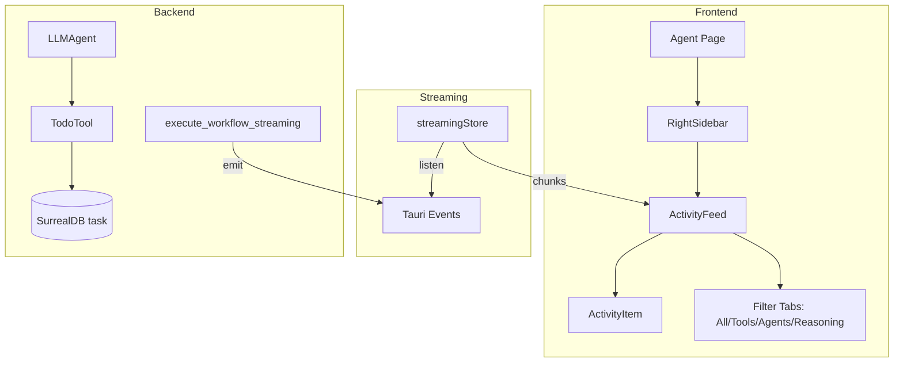

# Spécification - Todo Tab dans Activity Sidebar

## Métadonnées
- **Date**: 2025-12-01
- **Stack**: Svelte 5.43 + Rust 1.91 + Tauri 2.9 + SurrealDB 2.3
- **Complexité**: Medium-Complex
- **Dépendances**: TodoTool (implémenté), Streaming System (implémenté)

## Contexte

**Demande**: Ajouter dans le sidebar "Activity" l'onglet todo. Afficher la liste des tâches de TodoTool pendant l'exécution du workflow. Créées par les agents s'ils l'utilisent. Elles doivent être persistantes.

**Objectif**: Permettre aux utilisateurs de voir en temps réel les tâches créées par les agents via TodoTool pendant l'exécution d'un workflow, avec persistance après la fin du workflow.

**Périmètre**:
- **Inclus**:
  - Nouvel onglet "Todo" dans ActivityFeed
  - Streaming events pour création/mise à jour de tâches
  - Affichage temps réel des tâches pendant l'exécution
  - Chargement des tâches historiques après workflow
  - Indicateurs de statut (pending, in_progress, completed, blocked)
  - Persistence via SurrealDB (déjà implémentée pour Task)

- **Exclus**:
  - CRUD manuel de tâches depuis l'UI (future feature)
  - Drag & drop pour réordonner les tâches
  - Assignation d'agents depuis l'UI

**Critères de Succès**:
- [ ] Tab "Todo" visible dans ActivityFeed avec icône ListTodo
- [ ] Tâches affichées en temps réel pendant l'exécution du workflow
- [ ] Filtrage correct (tab Todo = uniquement task_* events)
- [ ] Statut des tâches affiché avec couleurs appropriées
- [ ] Tâches historiques chargées après fin de streaming
- [ ] Compteur de tâches affiché sur le tab

---

## État Actuel

### Architecture Existante



### Patterns Identifiés

| Pattern | Fichier | Usage |
|---------|---------|-------|
| ACTIVITY_FILTERS config | `src/types/activity.ts` | Définition des tabs |
| filterActivities() | `src/lib/utils/activity.ts` | Filtrage par type |
| ActivityItem rendering | `src/lib/components/workflow/ActivityItem.svelte` | Rendu item avec status |
| StreamChunk events | `src/types/streaming.ts` | Types d'événements |
| Streaming store | `src/lib/stores/streaming.ts` | État streaming |

### Code Réutilisable

**Frontend**:
- `ActivityItem.svelte` - Pattern d'affichage avec statut, durée, icône
- `filterActivities()` - Logique de filtrage par préfixe
- `countActivitiesByType()` - Comptage pour badges
- `activeToolToActivity()` - Conversion streaming → activity

**Backend**:
- `StreamChunk::tool_start/tool_end` - Pattern d'émission d'événements
- `TodoTool` - Création/update de tâches déjà implémenté
- `list_workflow_tasks` - Query SurrealDB existante

---

## Architecture Proposée

### Diagramme

```mermaid
graph TD
    subgraph Frontend
        AP[Agent Page] --> RS[RightSidebar]
        RS --> AF[ActivityFeed]
        AF --> AI[ActivityItem]
        AF --> FT["Filter Tabs: All/Tools/Agents/Reasoning/TODO"]
        AF --> |derive| FTA[filteredActivities]
    end

    subgraph "Streaming Store (Extended)"
        SS[streamingStore] --> AT[activeTasks: ActiveTask[]]
        SS --> |listen| TE[Tauri Events]
        AT --> |$derived| TAC[taskActivities]
    end

    subgraph "Backend (Extended)"
        WS[execute_workflow_streaming] --> |emit| TE
        LA[LLMAgent] --> TT[TodoTool]
        TT --> |1. create| DB[(SurrealDB task)]
        TT --> |2. emit| SC["StreamChunk::task_create"]
        SC --> |emit| TE
    end

    subgraph Historical
        HT[loadWorkflowTasks] --> |invoke| LWT[list_workflow_tasks]
        LWT --> |query| DB
        HT --> |convert| HA[historicalActivities]
    end
```

### Flux de Données

1. **Pendant Streaming**:
   - Agent appelle `TodoTool.execute("create", {...})`
   - TodoTool crée la tâche dans SurrealDB
   - TodoTool émet `StreamChunk` avec `chunk_type: task_create`
   - Frontend reçoit via listener, ajoute à `activeTasks`
   - `$derived` convertit en `WorkflowActivityEvent`
   - ActivityFeed affiche avec filtre "Todo"

2. **Après Streaming**:
   - `workflow_complete` event reçu
   - Appel `invoke('list_workflow_tasks', { workflowId })`
   - Conversion `Task[]` → `WorkflowActivityEvent[]`
   - Stockage dans `historicalActivities`

---

## Composants

### Frontend: Types Extension (`src/types/activity.ts`)

**Type**: Modification

**Changements**:
```typescript
// Ajouter à ActivityType
export type ActivityType =
  | 'tool_start'
  | 'tool_complete'
  | 'tool_error'
  | 'reasoning'
  | 'sub_agent_start'
  | 'sub_agent_progress'
  | 'sub_agent_complete'
  | 'sub_agent_error'
  | 'validation'
  | 'message'
  | 'task_create'      // NEW: Tâche créée
  | 'task_update'      // NEW: Statut mis à jour
  | 'task_complete';   // NEW: Tâche terminée

// Ajouter à ACTIVITY_FILTERS
export const ACTIVITY_FILTERS: ActivityFilterConfig[] = [
  { id: 'all', label: 'All', icon: 'Activity' },
  { id: 'tools', label: 'Tools', icon: 'Wrench' },
  { id: 'agents', label: 'Agents', icon: 'Bot' },
  { id: 'reasoning', label: 'Reasoning', icon: 'Brain' },
  { id: 'todos', label: 'Todos', icon: 'ListTodo' }  // NEW
];

// Ajouter type de filtre
export type ActivityFilter = 'all' | 'tools' | 'agents' | 'reasoning' | 'todos';
```

### Frontend: Streaming Types Extension (`src/types/streaming.ts`)

**Type**: Modification

**Changements**:
```typescript
// Étendre ChunkType
export type ChunkType =
  | 'token'
  | 'tool_start'
  | 'tool_end'
  | 'reasoning'
  | 'error'
  | 'sub_agent_start'
  | 'sub_agent_progress'
  | 'sub_agent_complete'
  | 'sub_agent_error'
  | 'task_create'        // NEW
  | 'task_update'        // NEW
  | 'task_complete';     // NEW

// Étendre StreamChunk avec champs task
export interface StreamChunk {
  workflow_id: string;
  chunk_type: ChunkType;
  content?: string;
  tool?: string;
  duration?: number;
  sub_agent_id?: string;
  sub_agent_name?: string;
  parent_agent_id?: string;
  metrics?: SubAgentStreamMetrics;
  progress?: number;
  // NEW: Task-specific fields
  task_id?: string;           // ID de la tâche
  task_name?: string;         // Nom court
  task_status?: string;       // pending | in_progress | completed | blocked
  task_priority?: number;     // 1-5
}
```

### Frontend: Streaming Store Extension (`src/lib/stores/streaming.ts`)

**Type**: Modification

**Changements**:
```typescript
// Ajouter ActiveTask interface
export interface ActiveTask {
  id: string;
  name: string;
  status: 'pending' | 'in_progress' | 'completed' | 'blocked';
  priority: number;
  createdAt: number;
  updatedAt: number;
}

// Étendre StreamingState
export interface StreamingState {
  // ... existing fields
  tasks: ActiveTask[];  // NEW: Active tasks during streaming
}

// Ajouter handlers dans processChunk
function processChunk(chunk: StreamChunk): void {
  switch (chunk.chunk_type) {
    // ... existing cases
    case 'task_create':
      addTask(chunk);
      break;
    case 'task_update':
      updateTaskStatus(chunk);
      break;
    case 'task_complete':
      completeTask(chunk);
      break;
  }
}

// Nouvelles fonctions
function addTask(chunk: StreamChunk): void {
  store.update(s => ({
    ...s,
    tasks: [...s.tasks, {
      id: chunk.task_id!,
      name: chunk.task_name!,
      status: chunk.task_status as ActiveTask['status'],
      priority: chunk.task_priority ?? 3,
      createdAt: Date.now(),
      updatedAt: Date.now()
    }]
  }));
}

function updateTaskStatus(chunk: StreamChunk): void {
  store.update(s => ({
    ...s,
    tasks: s.tasks.map(t =>
      t.id === chunk.task_id
        ? { ...t, status: chunk.task_status as ActiveTask['status'], updatedAt: Date.now() }
        : t
    )
  }));
}

function completeTask(chunk: StreamChunk): void {
  store.update(s => ({
    ...s,
    tasks: s.tasks.map(t =>
      t.id === chunk.task_id
        ? { ...t, status: 'completed', updatedAt: Date.now() }
        : t
    )
  }));
}

// Derived stores
export const activeTasks = derived(store, s => s.tasks);
export const pendingTasks = derived(store, s => s.tasks.filter(t => t.status === 'pending'));
export const runningTasks = derived(store, s => s.tasks.filter(t => t.status === 'in_progress'));
export const completedTasks = derived(store, s => s.tasks.filter(t => t.status === 'completed'));
export const hasActiveTasks = derived(store, s => s.tasks.length > 0);
```

### Frontend: Activity Utils Extension (`src/lib/utils/activity.ts`)

**Type**: Modification

**Changements**:
```typescript
// Ajouter conversion ActiveTask → WorkflowActivityEvent
export function activeTaskToActivity(task: ActiveTask): WorkflowActivityEvent {
  return {
    id: `task-${task.id}`,
    timestamp: task.createdAt,
    type: getTaskActivityType(task.status),
    title: task.name,
    description: `Priority: ${task.priority}`,
    status: mapTaskStatusToActivityStatus(task.status),
    metadata: {
      taskId: task.id,
      priority: task.priority
    }
  };
}

function getTaskActivityType(status: string): ActivityType {
  switch (status) {
    case 'completed': return 'task_complete';
    case 'in_progress': return 'task_update';
    default: return 'task_create';
  }
}

function mapTaskStatusToActivityStatus(status: string): ActivityStatus {
  switch (status) {
    case 'completed': return 'completed';
    case 'blocked': return 'error';
    case 'in_progress': return 'running';
    default: return 'pending';
  }
}

// Ajouter conversion Task (historique) → WorkflowActivityEvent
export function taskToActivity(task: Task): WorkflowActivityEvent {
  const activityType = task.status === 'completed' ? 'task_complete'
    : task.status === 'in_progress' ? 'task_update'
    : 'task_create';

  return {
    id: `task-${task.id}`,
    timestamp: new Date(task.created_at).getTime(),
    type: activityType,
    title: task.name,
    description: task.description?.substring(0, 100),
    status: mapTaskStatusToActivityStatus(task.status),
    duration: task.duration_ms,
    metadata: {
      taskId: task.id,
      priority: task.priority,
      agentAssigned: task.agent_assigned,
      completedAt: task.completed_at
    }
  };
}

// Étendre filterActivities pour 'todos'
export function filterActivities(
  activities: WorkflowActivityEvent[],
  filter: ActivityFilter
): WorkflowActivityEvent[] {
  if (filter === 'all') return activities;

  return activities.filter((a) => {
    switch (filter) {
      case 'tools':
        return a.type.startsWith('tool_');
      case 'agents':
        return a.type.startsWith('sub_agent_');
      case 'reasoning':
        return a.type === 'reasoning';
      case 'todos':  // NEW
        return a.type.startsWith('task_');
      default:
        return true;
    }
  });
}

// Étendre combineActivities pour inclure tasks
export function combineActivities(
  tools: ActiveTool[],
  subAgents: ActiveSubAgent[],
  reasoning: ActiveReasoningStep[],
  tasks: ActiveTask[]  // NEW parameter
): WorkflowActivityEvent[] {
  const activities: WorkflowActivityEvent[] = [
    ...tools.map(activeToolToActivity),
    ...subAgents.map(activeSubAgentToActivity),
    ...reasoning.map(activeReasoningToActivity),
    ...tasks.map(activeTaskToActivity)  // NEW
  ];
  return activities.sort((a, b) => b.timestamp - a.timestamp);
}
```

### Frontend: ActivityFeed Updates (`src/lib/components/workflow/ActivityFeed.svelte`)

**Type**: Modification

**Changements**:
```typescript
// Ajouter import ListTodo
import { Activity, Wrench, Bot, Brain, ListTodo } from 'lucide-svelte';

// Ajouter à iconMap
const iconMap: Record<string, ComponentType> = {
  Activity: Activity,
  Wrench: Wrench,
  Bot: Bot,
  Brain: Brain,
  ListTodo: ListTodo  // NEW
};
```

### Frontend: ActivityItem Updates (`src/lib/components/workflow/ActivityItem.svelte`)

**Type**: Modification

**Changements**:
```typescript
// Ajouter imports
import { ListTodo, CheckCircle2, Clock, AlertCircle } from 'lucide-svelte';

// Étendre getIconComponent pour task_*
function getIconComponent(type: string): ComponentType {
  // ... existing mappings
  if (type.startsWith('task_')) return ListTodo;
  return Activity;
}

// Ajouter styles pour task status
// Dans la section <style>:
.activity-item.task_create .item-icon :global(.type-icon) {
  color: var(--color-accent);
}

.activity-item.task_update .item-icon :global(.type-icon) {
  color: var(--color-warning);
}

.activity-item.task_complete .item-icon :global(.type-icon) {
  color: var(--color-success);
}
```

### Frontend: Agent Page Updates (`src/routes/agent/+page.svelte`)

**Type**: Modification

**Changements**:
```typescript
// Ajouter import
import { activeTasks } from '$lib/stores/streaming';
import { taskToActivity } from '$lib/utils/activity';
import type { Task } from '$types/task';

// Étendre activities derivation
const activities = $derived.by<WorkflowActivityEvent[]>(() => {
  if ($hasStreamingActivities || $hasActiveTasks) {  // NEW condition
    return combineActivities(
      $activeTools,
      $activeSubAgents,
      $reasoningSteps,
      $activeTasks  // NEW parameter
    );
  }
  return historicalActivities;
});

// Ajouter chargement des tâches historiques
async function loadHistoricalData(workflowId: string): Promise<void> {
  const [tools, thinking, subAgents, tasks] = await Promise.all([
    loadToolExecutions(workflowId),
    loadThinkingSteps(workflowId),
    loadSubAgentExecutions(workflowId),
    invoke<Task[]>('list_workflow_tasks', { workflowId })  // NEW
  ]);

  historicalActivities = mergeActivities(
    tools.map(toolExecutionToActivity),
    thinking.map(thinkingStepToActivity),
    subAgents.map(subAgentExecutionToActivity),
    tasks.map(taskToActivity)  // NEW
  );
}
```

### Backend: Streaming Types Extension (`src-tauri/src/models/streaming.rs`)

**Type**: Modification

**Changements**:
```rust
// Étendre ChunkType enum
#[derive(Debug, Clone, PartialEq, Eq, Serialize, Deserialize)]
#[serde(rename_all = "snake_case")]
pub enum ChunkType {
    Token,
    ToolStart,
    ToolEnd,
    Reasoning,
    Error,
    SubAgentStart,
    SubAgentProgress,
    SubAgentComplete,
    SubAgentError,
    TaskCreate,      // NEW
    TaskUpdate,      // NEW
    TaskComplete,    // NEW
}

// Étendre StreamChunk
#[derive(Debug, Clone, Serialize, Deserialize)]
pub struct StreamChunk {
    pub workflow_id: String,
    pub chunk_type: ChunkType,
    // ... existing fields
    // NEW: Task-specific fields
    #[serde(skip_serializing_if = "Option::is_none")]
    pub task_id: Option<String>,
    #[serde(skip_serializing_if = "Option::is_none")]
    pub task_name: Option<String>,
    #[serde(skip_serializing_if = "Option::is_none")]
    pub task_status: Option<String>,
    #[serde(skip_serializing_if = "Option::is_none")]
    pub task_priority: Option<u8>,
}

// Ajouter helper constructors
impl StreamChunk {
    pub fn task_create(
        workflow_id: impl Into<String>,
        task_id: impl Into<String>,
        task_name: impl Into<String>,
        priority: u8,
    ) -> Self {
        Self {
            workflow_id: workflow_id.into(),
            chunk_type: ChunkType::TaskCreate,
            task_id: Some(task_id.into()),
            task_name: Some(task_name.into()),
            task_status: Some("pending".to_string()),
            task_priority: Some(priority),
            ..Default::default()
        }
    }

    pub fn task_update(
        workflow_id: impl Into<String>,
        task_id: impl Into<String>,
        task_name: impl Into<String>,
        status: impl Into<String>,
    ) -> Self {
        Self {
            workflow_id: workflow_id.into(),
            chunk_type: ChunkType::TaskUpdate,
            task_id: Some(task_id.into()),
            task_name: Some(task_name.into()),
            task_status: Some(status.into()),
            ..Default::default()
        }
    }

    pub fn task_complete(
        workflow_id: impl Into<String>,
        task_id: impl Into<String>,
        task_name: impl Into<String>,
        duration: Option<u64>,
    ) -> Self {
        Self {
            workflow_id: workflow_id.into(),
            chunk_type: ChunkType::TaskComplete,
            task_id: Some(task_id.into()),
            task_name: Some(task_name.into()),
            task_status: Some("completed".to_string()),
            duration,
            ..Default::default()
        }
    }
}
```

### Backend: TodoTool Extension (`src-tauri/src/tools/todo/tool.rs`)

**Type**: Modification

**Changements**:
```rust
use tauri::{AppHandle, Emitter};
use crate::models::streaming::{StreamChunk, events};

// Modifier struct pour inclure AppHandle
pub struct TodoTool {
    db: Arc<DBClient>,
    workflow_id: String,
    agent_id: String,
    app_handle: Option<AppHandle>,  // NEW
}

impl TodoTool {
    pub fn new(
        db: Arc<DBClient>,
        workflow_id: String,
        agent_id: String,
        app_handle: Option<AppHandle>,  // NEW
    ) -> Self {
        Self { db, workflow_id, agent_id, app_handle }
    }

    // NEW: Helper pour émettre des events
    fn emit_task_event(&self, chunk: StreamChunk) {
        if let Some(ref handle) = self.app_handle {
            let _ = handle.emit(events::WORKFLOW_STREAM, &chunk);
        }
    }

    // Modifier create_task pour émettre event
    async fn create_task(
        &self,
        name: &str,
        description: &str,
        priority: u8,
        dependencies: Vec<String>,
    ) -> ToolResult<Value> {
        // ... existing creation logic
        let task_id = // ... creation result

        // NEW: Émettre event
        self.emit_task_event(StreamChunk::task_create(
            &self.workflow_id,
            &task_id,
            name,
            priority,
        ));

        Ok(serde_json::json!({
            "success": true,
            "task_id": task_id,
            "message": format!("Task '{}' created", name)
        }))
    }

    // Modifier update_status pour émettre event
    async fn update_status(
        &self,
        task_id: &str,
        status: &str,
    ) -> ToolResult<Value> {
        // ... existing update logic
        let task = // ... get task after update

        // NEW: Émettre event approprié
        let chunk = if status == "completed" {
            StreamChunk::task_complete(&self.workflow_id, task_id, &task.name, task.duration_ms)
        } else {
            StreamChunk::task_update(&self.workflow_id, task_id, &task.name, status)
        };
        self.emit_task_event(chunk);

        Ok(serde_json::json!({
            "success": true,
            "message": format!("Task status updated to '{}'", status)
        }))
    }

    // Modifier complete_task pour émettre event
    async fn complete_task(
        &self,
        task_id: &str,
        duration_ms: Option<u64>,
    ) -> ToolResult<Value> {
        // ... existing completion logic
        let task = // ... get task after completion

        // NEW: Émettre event
        self.emit_task_event(StreamChunk::task_complete(
            &self.workflow_id,
            task_id,
            &task.name,
            duration_ms,
        ));

        Ok(serde_json::json!({
            "success": true,
            "message": "Task completed"
        }))
    }
}
```

### Backend: ToolFactory Update (`src-tauri/src/tools/factory.rs`)

**Type**: Modification

**Changements**:
```rust
use tauri::AppHandle;

// Modifier signature pour accepter AppHandle
pub fn create_tool(
    tool_name: &str,
    db: Arc<DBClient>,
    workflow_id: &str,
    agent_id: &str,
    app_handle: Option<AppHandle>,  // NEW
) -> Option<Arc<dyn Tool>> {
    match tool_name {
        "TodoTool" => Some(Arc::new(TodoTool::new(
            db,
            workflow_id.to_string(),
            agent_id.to_string(),
            app_handle,  // NEW
        ))),
        "MemoryTool" => Some(Arc::new(MemoryTool::new(db, workflow_id.to_string()))),
        _ => None,
    }
}

// Modifier create_tools et create_tools_with_context de la même manière
```

### Backend: LLMAgent Update (`src-tauri/src/agents/llm_agent.rs`)

**Type**: Modification

**Changements**:
```rust
// Passer app_handle lors de la création des tools
async fn create_local_tools(&self) -> Vec<Arc<dyn Tool>> {
    let app_handle = self.agent_context
        .as_ref()
        .and_then(|ctx| ctx.app_handle.clone());

    self.tool_factory.create_tools(
        &self.config.tools,
        &self.workflow_id,
        &self.config.id,
        app_handle,  // NEW
    )
}
```

---

## Types Synchronisés

### Definition (`src/types/streaming.ts`) - Extensions

```typescript
// Nouveaux types pour task streaming
export type TaskChunkType = 'task_create' | 'task_update' | 'task_complete';

// Extension de StreamChunk
export interface StreamChunk {
  // ... existing fields
  task_id?: string;
  task_name?: string;
  task_status?: 'pending' | 'in_progress' | 'completed' | 'blocked';
  task_priority?: 1 | 2 | 3 | 4 | 5;
}
```

### Import Pattern

```typescript
import type { StreamChunk, ChunkType } from '$types/streaming';
import type { Task, TaskStatus } from '$types/task';
import type { WorkflowActivityEvent, ActivityType, ActivityFilter } from '$types/activity';
```

### Backend (`src-tauri/src/models/streaming.rs`)

```rust
#[derive(Debug, Clone, PartialEq, Eq, Serialize, Deserialize)]
#[serde(rename_all = "snake_case")]
pub enum ChunkType {
    // ... existing
    TaskCreate,
    TaskUpdate,
    TaskComplete,
}

#[derive(Debug, Clone, Serialize, Deserialize)]
pub struct StreamChunk {
    // ... existing fields
    #[serde(skip_serializing_if = "Option::is_none")]
    pub task_id: Option<String>,
    #[serde(skip_serializing_if = "Option::is_none")]
    pub task_name: Option<String>,
    #[serde(skip_serializing_if = "Option::is_none")]
    pub task_status: Option<String>,
    #[serde(skip_serializing_if = "Option::is_none")]
    pub task_priority: Option<u8>,
}
```

---

## Plan d'Implémentation

### Phase 1: Backend - Streaming Types (30 min)

**Objectif**: Étendre le modèle StreamChunk pour supporter les événements de tâches

**Tâches**:
1. **Backend**: Modifier `src-tauri/src/models/streaming.rs`
   - Ajouter `TaskCreate`, `TaskUpdate`, `TaskComplete` à `ChunkType` enum
   - Ajouter champs `task_id`, `task_name`, `task_status`, `task_priority` à `StreamChunk`
   - Implémenter helpers `StreamChunk::task_create()`, `task_update()`, `task_complete()`

2. **Types**: Synchroniser `src/types/streaming.ts`
   - Ajouter les 3 nouveaux `ChunkType` variants
   - Ajouter les champs task_* à l'interface `StreamChunk`

**Validation**:
- [ ] `cargo check` passe sans erreur
- [ ] `cargo test` passe
- [ ] Types TS compilent (`npm run check`)

### Phase 2: Backend - TodoTool Event Emission (45 min)

**Objectif**: Émettre des événements streaming lors des opérations TodoTool

**Tâches**:
1. **Backend**: Modifier `src-tauri/src/tools/todo/tool.rs`
   - Ajouter champ `app_handle: Option<AppHandle>` à `TodoTool`
   - Modifier constructeur `new()` pour accepter `AppHandle`
   - Ajouter méthode privée `emit_task_event()`
   - Modifier `create_task()` pour émettre `task_create`
   - Modifier `update_status()` pour émettre `task_update` ou `task_complete`
   - Modifier `complete_task()` pour émettre `task_complete`

2. **Backend**: Modifier `src-tauri/src/tools/factory.rs`
   - Passer `AppHandle` aux constructeurs de tools

3. **Backend**: Modifier `src-tauri/src/agents/llm_agent.rs`
   - Extraire `app_handle` de `agent_context`
   - Passer à `tool_factory.create_tools()`

**Validation**:
- [ ] `cargo check` passe
- [ ] `cargo test` passe
- [ ] Événements émis lors de création/update de tâches (test manuel)

### Phase 3: Frontend - Activity Types (15 min)

**Objectif**: Étendre les types d'activité pour supporter les tâches

**Tâches**:
1. **Frontend**: Modifier `src/types/activity.ts`
   - Ajouter `task_create`, `task_update`, `task_complete` à `ActivityType`
   - Ajouter `{ id: 'todos', label: 'Todos', icon: 'ListTodo' }` à `ACTIVITY_FILTERS`
   - Ajouter `'todos'` à `ActivityFilter` type

**Dépendances**: Aucune

**Validation**:
- [ ] `npm run check` passe

### Phase 4: Frontend - Streaming Store (30 min)

**Objectif**: Gérer les tâches actives dans le store streaming

**Tâches**:
1. **Frontend**: Modifier `src/lib/stores/streaming.ts`
   - Ajouter interface `ActiveTask`
   - Ajouter `tasks: ActiveTask[]` à `StreamingState`
   - Ajouter handlers pour `task_create`, `task_update`, `task_complete` dans `processChunk`
   - Ajouter fonctions `addTask()`, `updateTaskStatus()`, `completeTask()`
   - Exporter derived stores: `activeTasks`, `pendingTasks`, `runningTasks`, `completedTasks`, `hasActiveTasks`

**Dépendances**: Phase 3

**Validation**:
- [ ] `npm run check` passe
- [ ] Store réagit aux événements task_* (test unitaire)

### Phase 5: Frontend - Activity Utils (20 min)

**Objectif**: Convertir les tâches en activités

**Tâches**:
1. **Frontend**: Modifier `src/lib/utils/activity.ts`
   - Ajouter `activeTaskToActivity()` pour conversion streaming
   - Ajouter `taskToActivity()` pour conversion historique
   - Modifier `filterActivities()` pour supporter `'todos'` filter
   - Modifier `combineActivities()` pour inclure `tasks` parameter
   - Ajouter `countActivitiesByType()` support pour `task_*`

**Dépendances**: Phase 4

**Validation**:
- [ ] `npm run check` passe
- [ ] Conversions produisent des `WorkflowActivityEvent` valides (test)

### Phase 6: Frontend - UI Components (30 min)

**Objectif**: Afficher le tab Todo et les tâches dans ActivityFeed

**Tâches**:
1. **Frontend**: Modifier `src/lib/components/workflow/ActivityFeed.svelte`
   - Importer `ListTodo` de lucide-svelte
   - Ajouter `ListTodo` à `iconMap`

2. **Frontend**: Modifier `src/lib/components/workflow/ActivityItem.svelte`
   - Étendre `getIconComponent()` pour `task_*` types
   - Ajouter styles CSS pour `task_create`, `task_update`, `task_complete`

3. **Frontend**: Modifier `src/routes/agent/+page.svelte`
   - Importer `activeTasks`, `hasActiveTasks` du streaming store
   - Importer `taskToActivity` des utils
   - Modifier `activities` derivation pour inclure `$activeTasks`
   - Modifier `loadHistoricalData()` pour charger les tâches

**Dépendances**: Phase 5

**Validation**:
- [ ] Tab "Todo" visible avec icône ListTodo
- [ ] Tâches affichées avec couleurs de statut correctes
- [ ] Filtrage fonctionne correctement

### Phase 7: Tests & Polish (30 min)

**Objectif**: Valider l'intégration complète

**Tâches**:
1. **Backend Tests**: Ajouter tests pour StreamChunk::task_* helpers
2. **Frontend Tests**: Ajouter tests pour conversions activity
3. **Manual Test**: Workflow avec agent utilisant TodoTool
4. **CSS Polish**: Ajuster animations et couleurs

**Dépendances**: Phase 6

**Validation**:
- [ ] `cargo test` passe
- [ ] `npm run test` passe
- [ ] E2E: Workflow crée des tâches visibles en temps réel

---

## Estimation

| Phase | Frontend | Backend | Tests | Total |
|-------|----------|---------|-------|-------|
| 1. Streaming Types | 15 min | 15 min | - | 30 min |
| 2. TodoTool Events | - | 45 min | - | 45 min |
| 3. Activity Types | 15 min | - | - | 15 min |
| 4. Streaming Store | 30 min | - | - | 30 min |
| 5. Activity Utils | 20 min | - | - | 20 min |
| 6. UI Components | 30 min | - | - | 30 min |
| 7. Tests & Polish | 15 min | - | 15 min | 30 min |
| **TOTAL** | **2h05** | **1h** | **15 min** | **3h20** |

**Facteurs**:
- **Réduction -30%**: Patterns existants (ActivityFeed, streaming)
- **Réduction -20%**: Types Task/TodoTool déjà implémentés
- **Augmentation +15%**: Intégration AppHandle à travers layers

**Estimation ajustée**: ~2h45

---

## Analyse Risques

| Risque | Probabilité | Impact | Mitigation | Plan B |
|--------|-------------|--------|------------|--------|
| AppHandle null pendant exécution | Moyenne | Moyen | Vérification `if let Some(handle)` | Log warning, continuer sans event |
| Race condition streaming/historique | Faible | Moyen | Délai 100ms avant load historique | Flag `streamingComplete` |
| Type mismatch TS/Rust | Faible | Moyen | Tests de sérialisation | Custom deserializer |
| Performance avec beaucoup de tâches | Faible | Faible | Limite 100 tâches affichées | Pagination future |

---

## Tests

### Backend (Rust)

```rust
#[cfg(test)]
mod tests {
    use super::*;

    #[test]
    fn test_stream_chunk_task_create() {
        let chunk = StreamChunk::task_create("wf-1", "task-1", "Analyze code", 2);
        assert_eq!(chunk.chunk_type, ChunkType::TaskCreate);
        assert_eq!(chunk.task_id, Some("task-1".to_string()));
        assert_eq!(chunk.task_status, Some("pending".to_string()));
    }

    #[test]
    fn test_stream_chunk_task_complete() {
        let chunk = StreamChunk::task_complete("wf-1", "task-1", "Analyze", Some(5000));
        assert_eq!(chunk.chunk_type, ChunkType::TaskComplete);
        assert_eq!(chunk.duration, Some(5000));
    }
}
```

### Frontend (Vitest)

```typescript
import { describe, it, expect } from 'vitest';
import { activeTaskToActivity, filterActivities } from '$lib/utils/activity';

describe('activeTaskToActivity', () => {
  it('converts pending task to task_create activity', () => {
    const task = { id: '1', name: 'Test', status: 'pending', priority: 2, createdAt: Date.now(), updatedAt: Date.now() };
    const activity = activeTaskToActivity(task);
    expect(activity.type).toBe('task_create');
    expect(activity.status).toBe('pending');
  });
});

describe('filterActivities todos', () => {
  it('filters only task_* activities', () => {
    const activities = [
      { type: 'tool_start', ... },
      { type: 'task_create', ... },
      { type: 'reasoning', ... },
    ];
    const filtered = filterActivities(activities, 'todos');
    expect(filtered).toHaveLength(1);
    expect(filtered[0].type).toBe('task_create');
  });
});
```

### E2E (Playwright) - Future

```typescript
test('workflow shows tasks in Activity sidebar', async ({ page }) => {
  // Start workflow with agent that creates tasks
  await page.click('[data-testid="send-message"]');

  // Wait for task to appear in Activity
  await expect(page.locator('[data-testid="activity-item-task"]')).toBeVisible();

  // Click Todo filter
  await page.click('[data-testid="filter-todos"]');

  // Only tasks visible
  const items = await page.locator('[data-testid="activity-item"]').count();
  expect(items).toBeGreaterThan(0);
});
```

---

## Considérations

### Performance
- Derived stores (`$derived`) pour réactivité optimale
- Limit affichage à 100 dernières tâches si nécessaire
- `skip_serializing_if` pour réduire taille des chunks

### Sécurité
- Validation task_id format UUID
- Sanitization task_name (XSS prevention dans description)
- Tauri allowlist déjà en place

### Tauri Spécifique
- `AppHandle` nécessaire pour `emit()` - passé à travers le tool factory
- Events namespace: `workflow_stream` (réutilisé)
- Sérialisation automatique via serde

---

## Dépendances

### Frontend (package.json)
Aucune nouvelle dépendance requise.

### Backend (Cargo.toml)
Aucune nouvelle dépendance requise - utilise `tauri::Emitter` existant.

---

## Prochaines Étapes

### Validation
- [ ] Architecture approuvée
- [ ] Estimation validée
- [ ] Questions clarifiées

### Implémentation
1. Phase 1-2: Backend (streaming types + TodoTool events)
2. Phase 3-5: Frontend types et stores
3. Phase 6: UI components
4. Phase 7: Tests et polish

### Extensions Futures
- CRUD manuel de tâches depuis UI
- Drag & drop pour réordonner
- Assignation d'agents depuis UI
- Dépendances visuelles (graphe)

---

## Références

- Architecture: `docs/TECH_STACK.md`
- Types existants: `src/types/task.ts`, `src/types/streaming.ts`
- Activity patterns: `src/lib/components/workflow/ActivityFeed.svelte`
- TodoTool: `src-tauri/src/tools/todo/tool.rs`
- Streaming: `src-tauri/src/commands/streaming.rs`
- Memory: `todo_tool_specification`, `todo_tool_implementation_patterns`
