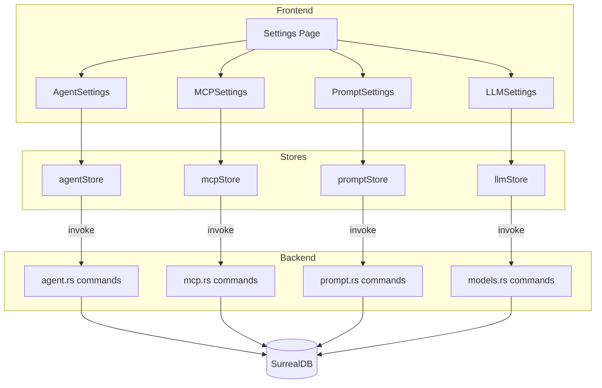
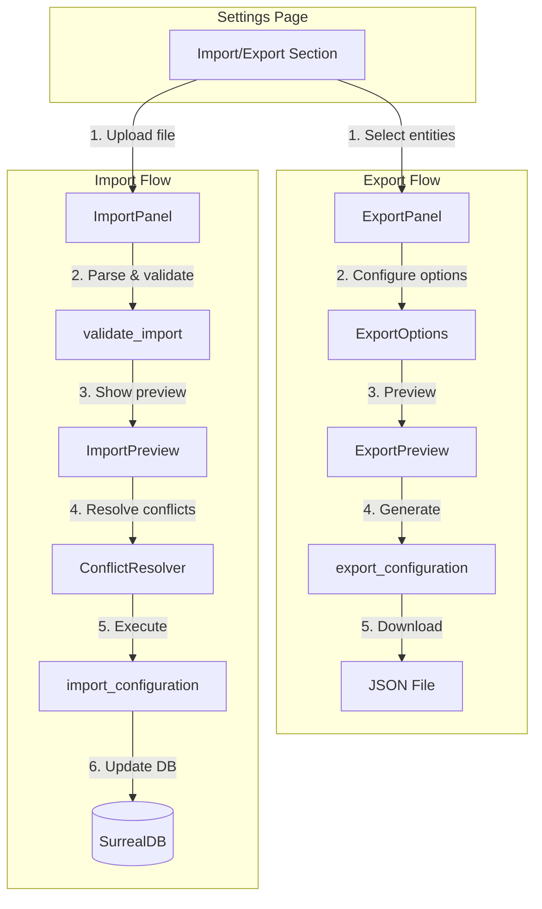
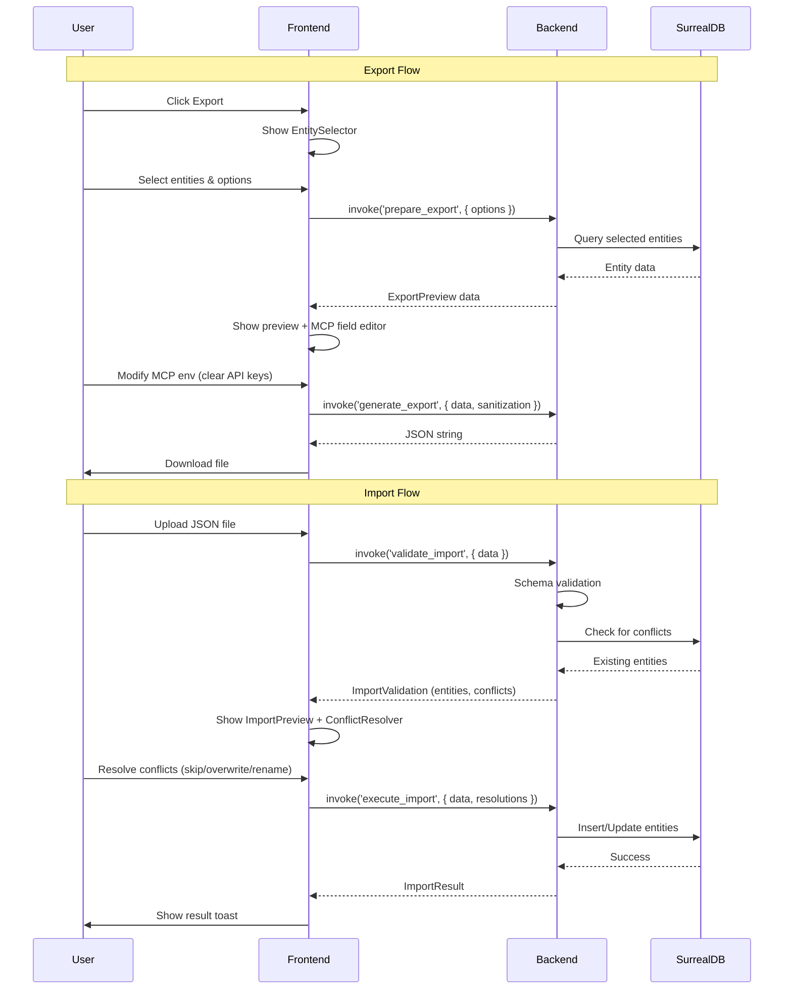

# Specification - Import/Export Settings

## Metadata
- **Date**: 2025-12-02
- **Stack**: Svelte 5.43.14 + Rust 1.91.1 + Tauri 2.9.4 + SurrealDB 2.3.10
- **Complexity**: medium
- **Estimated Implementation**: 3-4 phases

## Context

**Request**: Add an Import/Export section in Settings allowing users to:
- **Export**: Select entities to export (Models, Agents, MCP Servers, Prompts)
  - For MCP servers: ability to modify commands/env before export, clear sensitive fields (API keys)
- **Import**: Select elements to import with conflict resolution
  - For MCP: ability to add missing variables/commands
  - Duplicate detection with user choice (skip, overwrite, rename)

**Objective**: Enable configuration portability between Zileo installations, backup/restore capabilities, and team configuration sharing.

**Scope**:
- **Included**: Models (custom), Agents, MCP Servers, Prompts export/import with selective filtering
- **Excluded**: API keys (security), Memory entries (separate feature exists), Workflow data, Theme settings (localStorage)

**Success Criteria**:
- [ ] Export selected entities to JSON file
- [ ] MCP server export with field sanitization (env vars clearing)
- [ ] Import with preview and conflict resolution
- [ ] Validation of import data integrity
- [ ] User feedback for all operations (toast messages, progress)

---

## Current State

### Architecture Overview



### Existing Patterns Identified

#### Pattern 1: Memory Export/Import (Reusable Template)
**Location**: `src-tauri/src/commands/embedding.rs` (lines 327-450+)

```rust
#[tauri::command]
pub async fn export_memories(
    format: ExportFormat,
    type_filter: Option<String>,
    state: State<'_, AppState>,
) -> Result<String, String>

#[tauri::command]
pub async fn import_memories(
    data: String,
    state: State<'_, AppState>,
) -> Result<ImportResult, String>
```

**Types** (`src/types/embedding.ts`):
```typescript
export type ExportFormat = 'json' | 'csv';
export interface ImportResult {
  imported: number;
  failed: number;
  errors: string[];
}
```

#### Pattern 2: Multi-Selection (AgentForm)
**Location**: `src/lib/components/settings/agents/AgentForm.svelte`

```typescript
function toggleItem(item: string, array: string[]): string[] {
  if (array.includes(item)) {
    return array.filter((x) => x !== item);
  }
  return [...array, item];
}
```

#### Pattern 3: File Download (MemoryList)
**Location**: `src/lib/components/settings/memory/MemoryList.svelte`

```typescript
const blob = new Blob([data], { type: 'application/json' });
const url = URL.createObjectURL(blob);
const a = document.createElement('a');
a.href = url;
a.download = `filename-${new Date().toISOString().slice(0, 10)}.json`;
document.body.appendChild(a);
a.click();
document.body.removeChild(a);
URL.revokeObjectURL(url);
```

#### Pattern 4: File Upload (MemoryList)
**Location**: `src/lib/components/settings/memory/MemoryList.svelte`

```typescript
const input = document.createElement('input');
input.type = 'file';
input.accept = '.json';
input.onchange = async (e) => {
  const file = (e.target as HTMLInputElement).files?.[0];
  if (!file) return;
  const text = await file.text();
  const result = await invoke<ImportResult>('import_data', { data: text });
};
input.click();
```

### Code Reusable

| Location | Component/Function | Usage |
|----------|-------------------|-------|
| `src/lib/components/ui/` | Button, Card, Modal, Badge, Select, Input, Checkbox | All UI elements |
| `src/lib/components/settings/memory/MemoryList.svelte` | Export/Import handlers | File I/O pattern |
| `src/lib/components/settings/agents/AgentForm.svelte` | Toggle selection | Multi-select pattern |
| `src-tauri/src/commands/embedding.rs` | export_memories, import_memories | Backend pattern |

---

## Proposed Architecture

### High-Level Diagram



### Component Structure

```
src/lib/components/settings/import-export/
├── ImportExportSettings.svelte   # Main container (like AgentSettings)
├── ExportPanel.svelte            # Export wizard UI
├── ImportPanel.svelte            # Import wizard UI
├── ExportPreview.svelte          # Preview what will be exported
├── ImportPreview.svelte          # Preview what will be imported
├── ConflictResolver.svelte       # Handle duplicate entities
├── EntitySelector.svelte         # Multi-select entity picker
├── MCPFieldEditor.svelte         # Edit MCP env before export
└── index.ts                      # Exports
```

### Data Flow



---

## Component Specifications

### Frontend Components

#### ImportExportSettings.svelte
- **Path**: `src/lib/components/settings/import-export/ImportExportSettings.svelte`
- **Type**: New
- **Purpose**: Main container with tabs (Export/Import)

```typescript
interface Props {
  // No external props - self-contained
}

// Internal state
let activeTab: 'export' | 'import' = $state('export');
let message: { type: 'success' | 'error'; text: string } | null = $state(null);
```

#### ExportPanel.svelte
- **Path**: `src/lib/components/settings/import-export/ExportPanel.svelte`
- **Type**: New
- **Purpose**: Export wizard with entity selection and options

```typescript
interface Props {
  onexport?: (result: ExportResult) => void;
}

// Internal state
let step: 'select' | 'configure' | 'preview' = $state('select');
let selectedEntities: ExportSelection = $state({
  agents: [],
  mcpServers: [],
  models: [],
  prompts: []
});
let exportOptions: ExportOptions = $state({
  format: 'json',
  includeTimestamps: true,
  sanitizeMcp: true
});
let previewData: ExportPackage | null = $state(null);
let mcpSanitization: Record<string, MCPSanitizationConfig> = $state({});
```

#### ImportPanel.svelte
- **Path**: `src/lib/components/settings/import-export/ImportPanel.svelte`
- **Type**: New
- **Purpose**: Import wizard with file upload, preview, and conflict resolution

```typescript
interface Props {
  onimport?: (result: ImportResult) => void;
}

// Internal state
let step: 'upload' | 'preview' | 'conflicts' | 'executing' = $state('upload');
let importData: ExportPackage | null = $state(null);
let validation: ImportValidation | null = $state(null);
let selectedItems: ImportSelection = $state({
  agents: [],
  mcpServers: [],
  models: [],
  prompts: []
});
let conflictResolutions: Record<string, ConflictResolution> = $state({});
```

#### EntitySelector.svelte
- **Path**: `src/lib/components/settings/import-export/EntitySelector.svelte`
- **Type**: New
- **Purpose**: Reusable multi-select component for entities

```typescript
interface Props {
  entityType: 'agent' | 'mcp' | 'model' | 'prompt';
  items: EntitySummary[];
  selected: string[];
  onchange: (selected: string[]) => void;
  disabled?: boolean;
}
```

#### MCPFieldEditor.svelte
- **Path**: `src/lib/components/settings/import-export/MCPFieldEditor.svelte`
- **Type**: New
- **Purpose**: Edit MCP server env vars before export (clear sensitive fields)

```typescript
interface Props {
  server: MCPServer;
  sanitization: MCPSanitizationConfig;
  onchange: (config: MCPSanitizationConfig) => void;
}

interface MCPSanitizationConfig {
  clearEnvKeys: string[];      // Keys to clear (e.g., ['API_KEY', 'SECRET'])
  modifyEnv: Record<string, string>;  // Modified values
  modifyArgs: string[];        // Modified args
  excludeFromExport: boolean;  // Skip entirely
}
```

#### ConflictResolver.svelte
- **Path**: `src/lib/components/settings/import-export/ConflictResolver.svelte`
- **Type**: New
- **Purpose**: Handle import conflicts for duplicate entities

```typescript
interface Props {
  conflicts: ImportConflict[];
  onresolve: (resolutions: Record<string, ConflictResolution>) => void;
}

interface ImportConflict {
  entityType: 'agent' | 'mcp' | 'model' | 'prompt';
  importItem: EntitySummary;
  existingItem: EntitySummary;
  conflictType: 'id' | 'name' | 'both';
}

type ConflictResolution = 'skip' | 'overwrite' | 'rename';
```

---

### Backend Commands

#### export_configuration (Rust)
- **Path**: `src-tauri/src/commands/import_export.rs`
- **Signature**:

```rust
#[tauri::command]
#[instrument(name = "export_configuration", skip(state))]
pub async fn export_configuration(
    selection: ExportSelection,
    options: ExportOptions,
    state: State<'_, AppState>,
) -> Result<ExportPackage, String>
```

**Logic**:
1. Validate selection (at least one entity selected)
2. Query selected entities from SurrealDB
3. Build ExportPackage with manifest
4. Return package (frontend handles file download)

#### prepare_export_preview (Rust)
- **Path**: `src-tauri/src/commands/import_export.rs`
- **Signature**:

```rust
#[tauri::command]
pub async fn prepare_export_preview(
    selection: ExportSelection,
    state: State<'_, AppState>,
) -> Result<ExportPreviewData, String>
```

**Logic**:
1. Query selected entities
2. Return summary data for UI preview
3. Include MCP env keys for sanitization UI

#### generate_export_file (Rust)
- **Path**: `src-tauri/src/commands/import_export.rs`
- **Signature**:

```rust
#[tauri::command]
pub async fn generate_export_file(
    package: ExportPackage,
    sanitization: HashMap<String, MCPSanitizationConfig>,
) -> Result<String, String>
```

**Logic**:
1. Apply MCP sanitization (clear env keys, modify values)
2. Serialize to JSON string
3. Return string (frontend downloads as file)

#### validate_import (Rust)
- **Path**: `src-tauri/src/commands/import_export.rs`
- **Signature**:

```rust
#[tauri::command]
pub async fn validate_import(
    data: String,
    state: State<'_, AppState>,
) -> Result<ImportValidation, String>
```

**Logic**:
1. Parse JSON string to ExportPackage
2. Validate schema version compatibility
3. Check each entity for conflicts (existing ID or name)
4. Return validation result with conflicts list

#### execute_import (Rust)
- **Path**: `src-tauri/src/commands/import_export.rs`
- **Signature**:

```rust
#[tauri::command]
pub async fn execute_import(
    package: ExportPackage,
    selection: ImportSelection,
    resolutions: HashMap<String, ConflictResolution>,
    mcp_additions: HashMap<String, MCPAdditions>,
    state: State<'_, AppState>,
) -> Result<ImportResult, String>
```

**Logic**:
1. For each selected entity:
   - If conflict: apply resolution (skip/overwrite/rename)
   - For MCP: merge additional env vars/args
   - Insert/Update in SurrealDB
2. Return ImportResult with counts and errors

---

### Type Definitions

#### TypeScript (`src/types/importExport.ts`)

```typescript
// ============ EXPORT TYPES ============

export interface ExportSelection {
  agents: string[];        // Agent IDs to export
  mcpServers: string[];    // MCP Server IDs to export
  models: string[];        // Model IDs to export (custom only)
  prompts: string[];       // Prompt IDs to export
}

export interface ExportOptions {
  format: 'json';          // Only JSON supported initially
  includeTimestamps: boolean;
  sanitizeMcp: boolean;    // Enable MCP field editing
}

export interface MCPSanitizationConfig {
  clearEnvKeys: string[];              // Keys to set to empty string
  modifyEnv: Record<string, string>;   // Override env values
  modifyArgs: string[];                // Override args
  excludeFromExport: boolean;          // Skip this server entirely
}

export interface ExportManifest {
  version: string;              // Schema version "1.0"
  appVersion: string;           // Zileo version
  exportedAt: string;           // ISO 8601 timestamp
  exportedBy?: string;          // Optional identifier
  description?: string;         // User description
  counts: {
    agents: number;
    mcpServers: number;
    models: number;
    prompts: number;
  };
}

export interface ExportPackage {
  manifest: ExportManifest;
  agents: AgentConfig[];
  mcpServers: MCPServerConfig[];
  models: LLMModel[];
  prompts: Prompt[];
}

export interface ExportPreviewData {
  agents: AgentSummary[];
  mcpServers: MCPServerSummary[];
  models: LLMModelSummary[];
  prompts: PromptSummary[];
  mcpEnvKeys: Record<string, string[]>;  // server_id -> env key names
}

export interface ExportResult {
  success: boolean;
  filename: string;
  sizeBytes: number;
  counts: ExportManifest['counts'];
}

// ============ IMPORT TYPES ============

export interface ImportSelection {
  agents: string[];        // Agent IDs to import
  mcpServers: string[];    // MCP Server IDs to import
  models: string[];        // Model IDs to import
  prompts: string[];       // Prompt IDs to import
}

export interface ImportConflict {
  entityType: 'agent' | 'mcp' | 'model' | 'prompt';
  entityId: string;
  entityName: string;
  conflictType: 'id' | 'name' | 'both';
  existingId: string;
  existingName: string;
}

export type ConflictResolution = 'skip' | 'overwrite' | 'rename';

export interface MCPAdditions {
  addEnv: Record<string, string>;   // Additional env vars
  addArgs: string[];                // Additional args
}

export interface ImportValidation {
  valid: boolean;
  schemaVersion: string;
  errors: string[];
  warnings: string[];
  entities: {
    agents: AgentSummary[];
    mcpServers: MCPServerSummary[];
    models: LLMModelSummary[];
    prompts: PromptSummary[];
  };
  conflicts: ImportConflict[];
  missingMcpEnv: Record<string, string[]>;  // server_id -> missing required env keys
}

export interface ImportResult {
  success: boolean;
  imported: {
    agents: number;
    mcpServers: number;
    models: number;
    prompts: number;
  };
  skipped: {
    agents: number;
    mcpServers: number;
    models: number;
    prompts: number;
  };
  errors: Array<{
    entityType: 'agent' | 'mcp' | 'model' | 'prompt';
    entityId: string;
    error: string;
  }>;
}
```

#### Rust (`src-tauri/src/models/import_export.rs`)

```rust
use serde::{Deserialize, Serialize};
use std::collections::HashMap;

// ============ EXPORT TYPES ============

#[derive(Debug, Clone, Serialize, Deserialize)]
pub struct ExportSelection {
    pub agents: Vec<String>,
    pub mcp_servers: Vec<String>,
    pub models: Vec<String>,
    pub prompts: Vec<String>,
}

#[derive(Debug, Clone, Serialize, Deserialize)]
pub struct ExportOptions {
    pub format: String,  // "json"
    pub include_timestamps: bool,
    pub sanitize_mcp: bool,
}

#[derive(Debug, Clone, Serialize, Deserialize)]
pub struct MCPSanitizationConfig {
    pub clear_env_keys: Vec<String>,
    pub modify_env: HashMap<String, String>,
    pub modify_args: Vec<String>,
    pub exclude_from_export: bool,
}

#[derive(Debug, Clone, Serialize, Deserialize)]
pub struct ExportManifest {
    pub version: String,
    pub app_version: String,
    pub exported_at: String,
    #[serde(skip_serializing_if = "Option::is_none")]
    pub exported_by: Option<String>,
    #[serde(skip_serializing_if = "Option::is_none")]
    pub description: Option<String>,
    pub counts: ExportCounts,
}

#[derive(Debug, Clone, Serialize, Deserialize)]
pub struct ExportCounts {
    pub agents: usize,
    pub mcp_servers: usize,
    pub models: usize,
    pub prompts: usize,
}

#[derive(Debug, Clone, Serialize, Deserialize)]
pub struct ExportPackage {
    pub manifest: ExportManifest,
    pub agents: Vec<AgentConfig>,
    pub mcp_servers: Vec<MCPServerConfig>,
    pub models: Vec<LLMModel>,
    pub prompts: Vec<Prompt>,
}

#[derive(Debug, Clone, Serialize, Deserialize)]
pub struct ExportPreviewData {
    pub agents: Vec<AgentSummary>,
    pub mcp_servers: Vec<MCPServerSummary>,
    pub models: Vec<LLMModelSummary>,
    pub prompts: Vec<PromptSummary>,
    pub mcp_env_keys: HashMap<String, Vec<String>>,
}

// ============ IMPORT TYPES ============

#[derive(Debug, Clone, Serialize, Deserialize)]
pub struct ImportSelection {
    pub agents: Vec<String>,
    pub mcp_servers: Vec<String>,
    pub models: Vec<String>,
    pub prompts: Vec<String>,
}

#[derive(Debug, Clone, Serialize, Deserialize)]
pub struct ImportConflict {
    pub entity_type: String,  // "agent", "mcp", "model", "prompt"
    pub entity_id: String,
    pub entity_name: String,
    pub conflict_type: String,  // "id", "name", "both"
    pub existing_id: String,
    pub existing_name: String,
}

#[derive(Debug, Clone, Serialize, Deserialize)]
#[serde(rename_all = "lowercase")]
pub enum ConflictResolution {
    Skip,
    Overwrite,
    Rename,
}

#[derive(Debug, Clone, Serialize, Deserialize)]
pub struct MCPAdditions {
    pub add_env: HashMap<String, String>,
    pub add_args: Vec<String>,
}

#[derive(Debug, Clone, Serialize, Deserialize)]
pub struct ImportValidation {
    pub valid: bool,
    pub schema_version: String,
    pub errors: Vec<String>,
    pub warnings: Vec<String>,
    pub entities: ImportEntities,
    pub conflicts: Vec<ImportConflict>,
    pub missing_mcp_env: HashMap<String, Vec<String>>,
}

#[derive(Debug, Clone, Serialize, Deserialize)]
pub struct ImportEntities {
    pub agents: Vec<AgentSummary>,
    pub mcp_servers: Vec<MCPServerSummary>,
    pub models: Vec<LLMModelSummary>,
    pub prompts: Vec<PromptSummary>,
}

#[derive(Debug, Clone, Serialize, Deserialize)]
pub struct ImportResult {
    pub success: bool,
    pub imported: ImportCounts,
    pub skipped: ImportCounts,
    pub errors: Vec<ImportError>,
}

#[derive(Debug, Clone, Serialize, Deserialize)]
pub struct ImportCounts {
    pub agents: usize,
    pub mcp_servers: usize,
    pub models: usize,
    pub prompts: usize,
}

#[derive(Debug, Clone, Serialize, Deserialize)]
pub struct ImportError {
    pub entity_type: String,
    pub entity_id: String,
    pub error: String,
}
```

---

## Implementation Plan

### Phase 1: Types and Backend Foundation
**Objective**: Create type definitions and basic Tauri commands

**Tasks**:

1. **Types TypeScript**: Create `src/types/importExport.ts`
   - All interfaces defined above
   - Export from `src/types/index.ts`

2. **Types Rust**: Create `src-tauri/src/models/import_export.rs`
   - All structs defined above
   - Add `pub mod import_export;` to `src-tauri/src/models/mod.rs`

3. **Commands Rust**: Create `src-tauri/src/commands/import_export.rs`
   - `export_configuration` - basic version (no sanitization yet)
   - `validate_import` - schema validation + conflict detection
   - Add `pub mod import_export;` to `src-tauri/src/commands/mod.rs`
   - Register commands in `src-tauri/src/main.rs`

**Validation**:
- [ ] `cargo check` passes
- [ ] `cargo clippy` passes
- [ ] Types compile without errors
- [ ] Commands registered in main.rs

### Phase 2: Export Feature
**Objective**: Complete export functionality with MCP sanitization

**Tasks**:

1. **Backend Enhancement**:
   - Implement `prepare_export_preview` command
   - Implement `generate_export_file` command with sanitization
   - Add MCP env key extraction logic

2. **Frontend Components**:
   - Create `src/lib/components/settings/import-export/` directory
   - Implement `EntitySelector.svelte`
   - Implement `MCPFieldEditor.svelte`
   - Implement `ExportPreview.svelte`
   - Implement `ExportPanel.svelte`

3. **Integration**:
   - Add export handlers using existing download pattern
   - Connect to backend commands

**Validation**:
- [ ] Can select entities for export
- [ ] Can preview export data
- [ ] Can edit MCP env vars before export
- [ ] Can download JSON file
- [ ] Exported file is valid JSON

### Phase 3: Import Feature
**Objective**: Complete import functionality with conflict resolution

**Tasks**:

1. **Backend Enhancement**:
   - Implement `execute_import` command
   - Add conflict resolution logic (skip/overwrite/rename)
   - Add MCP additions merge logic

2. **Frontend Components**:
   - Implement `ImportPreview.svelte`
   - Implement `ConflictResolver.svelte`
   - Implement `ImportPanel.svelte`

3. **Integration**:
   - Add file upload handler
   - Connect conflict resolution UI to backend
   - Show import results

**Validation**:
- [ ] Can upload JSON file
- [ ] Validation shows errors/warnings
- [ ] Conflicts detected correctly
- [ ] Can resolve conflicts (skip/overwrite/rename)
- [ ] Can add missing MCP env vars
- [ ] Import completes successfully
- [ ] Stores refreshed after import

### Phase 4: Integration and Polish
**Objective**: Integrate into Settings page, polish UI/UX

**Tasks**:

1. **Main Container**:
   - Implement `ImportExportSettings.svelte`
   - Add tabs for Export/Import

2. **Settings Page Integration**:
   - Add sidebar item in `src/routes/settings/+page.svelte`
   - Add section for import-export
   - Import components

3. **UX Polish**:
   - Add loading states
   - Add toast messages
   - Add keyboard shortcuts (Escape to cancel)
   - Add progress indicators for large imports

4. **Testing**:
   - Create test export file
   - Test round-trip (export -> import)
   - Test conflict scenarios
   - Test MCP sanitization

**Validation**:
- [ ] Section visible in Settings sidebar
- [ ] Full export flow works
- [ ] Full import flow works
- [ ] Error handling complete
- [ ] All toast messages display correctly

---

## Estimation

| Phase | Frontend | Backend | Types | Tests | Total |
|-------|----------|---------|-------|-------|-------|
| 1: Foundation | 1h | 3h | 2h | 1h | 7h |
| 2: Export | 4h | 2h | - | 1h | 7h |
| 3: Import | 5h | 3h | - | 2h | 10h |
| 4: Integration | 3h | 1h | - | 2h | 6h |
| **Total** | **13h** | **9h** | **2h** | **6h** | **30h** |

**Factors**:
- Pattern reuse (memory export/import): -25%
- Existing UI components: -15%
- MCP sanitization complexity: +10%
- Conflict resolution complexity: +15%

**Adjusted estimate**: ~25-30h of implementation time

---

## Risk Analysis

| Risk | Probability | Impact | Mitigation | Plan B |
|------|-------------|--------|------------|--------|
| Schema version incompatibility | Medium | High | Include version in manifest, validate on import | Show clear error message, reject incompatible versions |
| Large file import performance | Low | Medium | Stream JSON parsing, show progress | Limit file size (10MB), warn user |
| MCP env var conflicts | Medium | Low | Allow user to review/merge | Skip MCP server, log warning |
| ID collisions on import | High | Medium | Conflict resolver UI | Generate new IDs on rename |
| Cyclic references (agent -> MCP) | Low | Medium | Import order: MCP first, then agents | Validate dependencies before import |
| Sensitive data in export | High | Critical | Default sanitize MCP env, warn user | Require explicit confirmation for env export |

---

## Tests

### Frontend (Vitest)

```typescript
// EntitySelector.test.ts
describe('EntitySelector', () => {
  it('renders all items with checkboxes');
  it('calls onchange when item toggled');
  it('supports select all / deselect all');
  it('shows item counts');
});

// ExportPanel.test.ts
describe('ExportPanel', () => {
  it('validates at least one entity selected');
  it('shows preview after selection');
  it('allows MCP env editing');
  it('generates download on confirm');
});

// ImportPanel.test.ts
describe('ImportPanel', () => {
  it('accepts valid JSON file');
  it('rejects invalid JSON');
  it('shows validation errors');
  it('shows conflicts when detected');
  it('applies conflict resolutions');
});

// ConflictResolver.test.ts
describe('ConflictResolver', () => {
  it('displays all conflicts');
  it('allows resolution selection');
  it('validates all conflicts resolved');
});
```

### Backend (Rust)

```rust
#[cfg(test)]
mod tests {
    // export_configuration tests
    #[tokio::test]
    async fn test_export_empty_selection_fails();

    #[tokio::test]
    async fn test_export_agents_success();

    #[tokio::test]
    async fn test_export_mcp_sanitization();

    // validate_import tests
    #[tokio::test]
    async fn test_validate_invalid_json();

    #[tokio::test]
    async fn test_validate_schema_version();

    #[tokio::test]
    async fn test_validate_detects_conflicts();

    // execute_import tests
    #[tokio::test]
    async fn test_import_skip_conflicts();

    #[tokio::test]
    async fn test_import_overwrite_conflicts();

    #[tokio::test]
    async fn test_import_rename_conflicts();

    #[tokio::test]
    async fn test_import_mcp_additions();
}
```

### E2E (Playwright)

```typescript
test.describe('Import/Export Settings', () => {
  test('export flow - select agents and download', async ({ page }) => {
    await page.goto('/settings');
    await page.click('[data-testid="import-export-section"]');
    await page.click('[data-testid="export-tab"]');
    // Select agents
    await page.click('[data-testid="agent-checkbox-0"]');
    // Preview
    await page.click('[data-testid="preview-export"]');
    // Download
    const [download] = await Promise.all([
      page.waitForEvent('download'),
      page.click('[data-testid="download-export"]'),
    ]);
    expect(download.suggestedFilename()).toContain('.json');
  });

  test('import flow - upload and resolve conflicts', async ({ page }) => {
    // ... similar flow for import
  });
});
```

---

## Considerations

### Performance
- Stream large JSON files instead of loading entirely in memory
- Use pagination for entity selection if > 100 items
- Debounce search/filter inputs
- Show progress for imports with > 10 items

### Security
- **NEVER** export API keys from OS keychain
- Default MCP env sanitization ON (user must opt-out)
- Warn user when exporting env vars with sensitive names (API_KEY, SECRET, TOKEN, PASSWORD)
- Validate all import data before database operations
- Sanitize entity names to prevent injection

### Tauri Specific
- Use `invoke()` for all backend operations
- Handle IPC errors gracefully with user feedback
- Consider using Tauri file dialog for save location (future enhancement)
- Respect `api_key_configured` flag - never expose actual keys

### SurrealDB Specific
- Use transactions for multi-entity imports (all-or-nothing)
- Handle ID format correctly (`meta::id(id)` for clean UUIDs)
- Update `updated_at` timestamps on import
- Generate new UUIDs for renamed entities

---

## Dependencies

### Frontend (package.json)
| Package | Version | Reason |
|---------|---------|--------|
| @tauri-apps/api | ^2.9.0 | Already installed - invoke() |
| lucide-svelte | ^0.554.0 | Already installed - icons (Download, Upload, FileJson) |

**No new dependencies required**

### Backend (Cargo.toml)
| Crate | Version | Features | Reason |
|-------|---------|----------|--------|
| serde | 1.0.228 | derive | Already installed - serialization |
| serde_json | 1.0.145 | - | Already installed - JSON handling |
| uuid | 1.0 | v4, serde | Already installed - ID generation |
| chrono | 0.4 | serde | Already installed - timestamps |

**No new dependencies required**

---

## File Checklist

### New Files

```
Frontend:
[ ] src/types/importExport.ts
[ ] src/lib/components/settings/import-export/index.ts
[ ] src/lib/components/settings/import-export/ImportExportSettings.svelte
[ ] src/lib/components/settings/import-export/ExportPanel.svelte
[ ] src/lib/components/settings/import-export/ImportPanel.svelte
[ ] src/lib/components/settings/import-export/ExportPreview.svelte
[ ] src/lib/components/settings/import-export/ImportPreview.svelte
[ ] src/lib/components/settings/import-export/EntitySelector.svelte
[ ] src/lib/components/settings/import-export/MCPFieldEditor.svelte
[ ] src/lib/components/settings/import-export/ConflictResolver.svelte

Backend:
[ ] src-tauri/src/models/import_export.rs
[ ] src-tauri/src/commands/import_export.rs
```

### Modified Files

```
Frontend:
[ ] src/types/index.ts - add export
[ ] src/routes/settings/+page.svelte - add section

Backend:
[ ] src-tauri/src/models/mod.rs - add pub mod
[ ] src-tauri/src/commands/mod.rs - add pub mod
[ ] src-tauri/src/main.rs - register commands
```

---

## Next Steps

### Validation
- [x] Architecture approved (using existing patterns)
- [x] Dependencies validated (no new deps)
- [ ] Questions resolved (see below)

### Questions for User
1. Should we support CSV export format or JSON only?
2. Maximum file size limit for imports (recommended: 10MB)?
3. Should export include agent `created_at`/`updated_at` timestamps?
4. Should we add export/import to keyboard shortcuts (Ctrl+Shift+E/I)?

### Implementation
1. Start Phase 1 after approval
2. Checkpoint after each phase
3. Continuous testing

---

## References

- **Architecture**: `docs/TECH_STACK.md`
- **Settings patterns**: `zileo_settings_quick_reference` memory
- **Type patterns**: `llm_types_detailed_inventory` memory
- **Existing export/import**: `src-tauri/src/commands/embedding.rs`
- **UI Components**: `src/lib/components/ui/`
- **Agent patterns**: `src/lib/components/settings/agents/`
