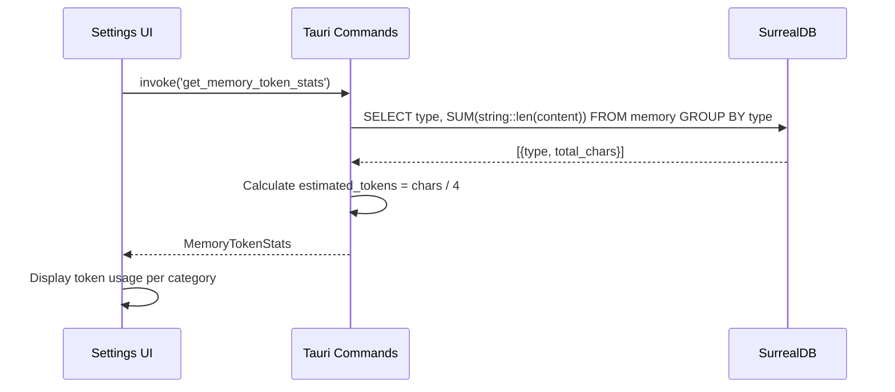

# Specification - Memory Tool Completion & Token Statistics

## Metadata
- **Date**: 2025-12-02
- **Stack**: Svelte 5.43 + Rust 1.91 + Tauri 2.9 + SurrealDB 2.3 + Rig.rs 0.24
- **Complexity**: Medium
- **Phase**: 7 (Post-Phase 6 Completion)
- **Parent Spec**: `docs/specs/2025-11-26_spec-memory-tool.md`

## Context

**Request**: Complete the Memory Tool implementation by adding missing commands and new token statistics functionality.

**Objective**:
1. Register missing Tauri commands identified during audit
2. Add token/character statistics per memory category
3. Provide embedding dimension visibility per category

**Scope**:
- **Included**:
  - `test_embedding` command implementation
  - `update_embedding_service` command registration
  - New `get_memory_token_stats` command for token analytics
  - Enhanced `MemoryStats` with character counts
  - Frontend integration for token statistics

- **Excluded**:
  - Actual tokenizer integration (use char/4 approximation)
  - Real-time token counting during streaming
  - Token budgeting/limits system

**Success Criteria**:
- [ ] `test_embedding` command functional and registered
- [ ] `update_embedding_service` registered in main.rs
- [ ] Token statistics available per memory category
- [ ] Frontend displays token usage in Memory Settings
- [ ] All tests passing (cargo test, npm run test)

---

## Current State Analysis

### Missing Commands (Audit Results)

| Command | Spec Reference | Implementation | main.rs |
|---------|---------------|----------------|---------|
| `test_embedding` | Line 1002 | **MISSING** | **NOT REGISTERED** |
| `update_embedding_service` | N/A | EXISTS | **NOT REGISTERED** |

### Missing Features

| Feature | Status | Impact |
|---------|--------|--------|
| Token count per category | NOT IMPLEMENTED | Users cannot estimate embedding costs |
| Character count per category | NOT IMPLEMENTED | No content size visibility |
| Embedding test from UI | NOT FUNCTIONAL | Cannot validate config before save |

---

## Architecture Proposed

### Data Flow - Token Statistics



---

## Components

### 1. New Command: `test_embedding`

**Path**: `src-tauri/src/commands/embedding.rs`

**Purpose**: Test embedding generation with current configuration

**Signature**:
```rust
#[tauri::command]
#[instrument(name = "test_embedding", skip(state))]
pub async fn test_embedding(
    state: State<'_, AppState>,
    text: String,
) -> Result<EmbeddingTestResult, String>
```

**Response Type**:
```rust
#[derive(Debug, Clone, Serialize, Deserialize)]
pub struct EmbeddingTestResult {
    /// Whether embedding was generated successfully
    pub success: bool,
    /// Vector dimension (e.g., 1024)
    pub dimension: usize,
    /// First 5 values of the embedding (preview)
    pub preview: Vec<f32>,
    /// Generation time in milliseconds
    pub duration_ms: u64,
    /// Provider used (mistral/ollama)
    pub provider: String,
    /// Model used
    pub model: String,
    /// Error message if failed
    pub error: Option<String>,
}
```

**TypeScript**:
```typescript
// src/types/embedding.ts
export interface EmbeddingTestResult {
  success: boolean;
  dimension: number;
  preview: number[];
  duration_ms: number;
  provider: string;
  model: string;
  error?: string;
}

// Usage
const result = await invoke<EmbeddingTestResult>('test_embedding', { text: 'Test content' });
```

---

### 2. New Command: `get_memory_token_stats`

**Path**: `src-tauri/src/commands/embedding.rs`

**Purpose**: Get token/character statistics per memory category

**Signature**:
```rust
#[tauri::command]
#[instrument(name = "get_memory_token_stats", skip(state))]
pub async fn get_memory_token_stats(
    state: State<'_, AppState>,
    type_filter: Option<String>,
) -> Result<MemoryTokenStats, String>
```

**Response Type**:
```rust
/// Token statistics for memory categories
#[derive(Debug, Clone, Default, Serialize, Deserialize)]
pub struct MemoryTokenStats {
    /// Statistics per memory type
    pub categories: Vec<CategoryTokenStats>,
    /// Total characters across all categories
    pub total_chars: usize,
    /// Estimated total tokens (chars / 4)
    pub total_estimated_tokens: usize,
    /// Total memories counted
    pub total_memories: usize,
}

/// Token statistics for a single category
#[derive(Debug, Clone, Serialize, Deserialize)]
pub struct CategoryTokenStats {
    /// Memory type (user_pref, context, knowledge, decision)
    pub memory_type: String,
    /// Number of memories in this category
    pub count: usize,
    /// Total characters in this category
    pub total_chars: usize,
    /// Estimated tokens (chars / 4)
    pub estimated_tokens: usize,
    /// Average characters per memory
    pub avg_chars: usize,
    /// Number with embeddings
    pub with_embeddings: usize,
}
```

**SurrealQL Query**:
```sql
SELECT
    type,
    count() AS count,
    math::sum(string::len(content)) AS total_chars,
    count(embedding IS NOT NONE) AS with_embeddings
FROM memory
GROUP BY type
```

**TypeScript**:
```typescript
// src/types/embedding.ts
export interface CategoryTokenStats {
  memory_type: string;
  count: number;
  total_chars: number;
  estimated_tokens: number;
  avg_chars: number;
  with_embeddings: number;
}

export interface MemoryTokenStats {
  categories: CategoryTokenStats[];
  total_chars: number;
  total_estimated_tokens: number;
  total_memories: number;
}

// Usage
const stats = await invoke<MemoryTokenStats>('get_memory_token_stats');
const stats = await invoke<MemoryTokenStats>('get_memory_token_stats', { typeFilter: 'knowledge' });
```

---

### 3. Register Missing Command: `update_embedding_service`

**Current State**: Function exists in `src-tauri/src/commands/embedding.rs` but not registered.

**Action**: Add to `main.rs` generate_handler![]:
```rust
commands::embedding::update_embedding_service,
```

---

## Types Synchronization

### Rust Models Update

**File**: `src-tauri/src/models/embedding.rs`

```rust
// ADD after existing types

/// Result of embedding test operation
#[derive(Debug, Clone, Serialize, Deserialize)]
pub struct EmbeddingTestResult {
    pub success: bool,
    pub dimension: usize,
    pub preview: Vec<f32>,
    pub duration_ms: u64,
    pub provider: String,
    pub model: String,
    pub error: Option<String>,
}

/// Token statistics for memory categories
#[derive(Debug, Clone, Default, Serialize, Deserialize)]
pub struct MemoryTokenStats {
    pub categories: Vec<CategoryTokenStats>,
    pub total_chars: usize,
    pub total_estimated_tokens: usize,
    pub total_memories: usize,
}

/// Token statistics for a single category
#[derive(Debug, Clone, Serialize, Deserialize)]
pub struct CategoryTokenStats {
    pub memory_type: String,
    pub count: usize,
    pub total_chars: usize,
    pub estimated_tokens: usize,
    pub avg_chars: usize,
    pub with_embeddings: usize,
}
```

### TypeScript Types Update

**File**: `src/types/embedding.ts`

```typescript
// ADD after existing types

/**
 * Result of embedding test operation
 */
export interface EmbeddingTestResult {
  /** Whether embedding was generated successfully */
  success: boolean;
  /** Vector dimension (e.g., 1024) */
  dimension: number;
  /** First 5 values of the embedding (preview) */
  preview: number[];
  /** Generation time in milliseconds */
  duration_ms: number;
  /** Provider used (mistral/ollama) */
  provider: string;
  /** Model used */
  model: string;
  /** Error message if failed */
  error?: string;
}

/**
 * Token statistics for a single memory category
 */
export interface CategoryTokenStats {
  /** Memory type (user_pref, context, knowledge, decision) */
  memory_type: string;
  /** Number of memories in this category */
  count: number;
  /** Total characters in this category */
  total_chars: number;
  /** Estimated tokens (chars / 4) */
  estimated_tokens: number;
  /** Average characters per memory */
  avg_chars: number;
  /** Number with embeddings generated */
  with_embeddings: number;
}

/**
 * Token statistics for all memory categories
 */
export interface MemoryTokenStats {
  /** Statistics per memory type */
  categories: CategoryTokenStats[];
  /** Total characters across all categories */
  total_chars: number;
  /** Estimated total tokens (chars / 4) */
  total_estimated_tokens: number;
  /** Total memories counted */
  total_memories: number;
}
```

---

## Implementation Plan

### Phase A: Fix Missing Registrations (30 min)

**Tasks**:
1. Add `update_embedding_service` to `main.rs` generate_handler![]
2. Verify command is accessible from frontend

**Files Modified**:
- `src-tauri/src/main.rs`

**Validation**:
- [ ] `cargo build` passes
- [ ] Command callable from frontend

---

### Phase B: Implement `test_embedding` (1-2h)

**Tasks**:
1. Add `EmbeddingTestResult` struct to `src-tauri/src/models/embedding.rs`
2. Implement `test_embedding` command in `src-tauri/src/commands/embedding.rs`
3. Register command in `main.rs`
4. Add TypeScript type to `src/types/embedding.ts`
5. Add unit tests

**Implementation**:
```rust
#[tauri::command]
#[instrument(name = "test_embedding", skip(state))]
pub async fn test_embedding(
    state: State<'_, AppState>,
    text: String,
) -> Result<EmbeddingTestResult, String> {
    use std::time::Instant;

    info!(text_len = text.len(), "Testing embedding generation");

    // Validate input
    if text.is_empty() {
        return Err("Test text cannot be empty".to_string());
    }

    if text.len() > 10000 {
        return Err("Test text too long (max 10000 chars)".to_string());
    }

    // Get embedding service
    let embed_service = state.embedding_service.read().await;
    let service = embed_service.as_ref().ok_or_else(|| {
        "Embedding service not configured. Please save embedding settings first.".to_string()
    })?;

    let start = Instant::now();

    match service.embed(&text).await {
        Ok(embedding) => {
            let duration_ms = start.elapsed().as_millis() as u64;
            let dimension = embedding.len();
            let preview: Vec<f32> = embedding.iter().take(5).cloned().collect();

            let (provider, model) = service.provider_info();

            info!(
                dimension = dimension,
                duration_ms = duration_ms,
                "Embedding test successful"
            );

            Ok(EmbeddingTestResult {
                success: true,
                dimension,
                preview,
                duration_ms,
                provider,
                model,
                error: None,
            })
        }
        Err(e) => {
            let (provider, model) = service.provider_info();

            warn!(error = %e, "Embedding test failed");

            Ok(EmbeddingTestResult {
                success: false,
                dimension: 0,
                preview: vec![],
                duration_ms: start.elapsed().as_millis() as u64,
                provider,
                model,
                error: Some(e.to_string()),
            })
        }
    }
}
```

**Files Modified**:
- `src-tauri/src/models/embedding.rs`
- `src-tauri/src/commands/embedding.rs`
- `src-tauri/src/main.rs`
- `src/types/embedding.ts`

**Validation**:
- [ ] `cargo test` passes
- [ ] Command returns correct result structure
- [ ] Error handling works for missing service

---

### Phase C: Implement `get_memory_token_stats` (2-3h)

**Tasks**:
1. Add `MemoryTokenStats` and `CategoryTokenStats` to models
2. Implement `get_memory_token_stats` command
3. Register command in `main.rs`
4. Add TypeScript types
5. Add unit tests

**Implementation**:
```rust
#[tauri::command]
#[instrument(name = "get_memory_token_stats", skip(state))]
pub async fn get_memory_token_stats(
    state: State<'_, AppState>,
    type_filter: Option<String>,
) -> Result<MemoryTokenStats, String> {
    info!(type_filter = ?type_filter, "Getting memory token statistics");

    // Build query with optional filter
    let query = if let Some(ref mem_type) = type_filter {
        format!(
            r#"SELECT
                type,
                count() AS count,
                math::sum(string::len(content)) AS total_chars,
                count(embedding != NONE) AS with_embeddings
            FROM memory
            WHERE type = '{}'
            GROUP BY type"#,
            mem_type
        )
    } else {
        r#"SELECT
            type,
            count() AS count,
            math::sum(string::len(content)) AS total_chars,
            count(embedding != NONE) AS with_embeddings
        FROM memory
        GROUP BY type"#.to_string()
    };

    let results: Vec<serde_json::Value> = state.db.query(&query).await.map_err(|e| {
        error!(error = %e, "Failed to get token stats");
        format!("Failed to get token statistics: {}", e)
    })?;

    let mut categories = Vec::new();
    let mut total_chars: usize = 0;
    let mut total_memories: usize = 0;

    for row in results {
        let memory_type = row.get("type")
            .and_then(|t| t.as_str())
            .unwrap_or("unknown")
            .to_string();

        let count = row.get("count")
            .and_then(|c| c.as_u64())
            .unwrap_or(0) as usize;

        let chars = row.get("total_chars")
            .and_then(|c| c.as_u64())
            .unwrap_or(0) as usize;

        let with_embeddings = row.get("with_embeddings")
            .and_then(|c| c.as_u64())
            .unwrap_or(0) as usize;

        let avg_chars = if count > 0 { chars / count } else { 0 };
        let estimated_tokens = chars / 4; // Standard approximation

        categories.push(CategoryTokenStats {
            memory_type,
            count,
            total_chars: chars,
            estimated_tokens,
            avg_chars,
            with_embeddings,
        });

        total_chars += chars;
        total_memories += count;
    }

    let stats = MemoryTokenStats {
        categories,
        total_chars,
        total_estimated_tokens: total_chars / 4,
        total_memories,
    };

    info!(
        total_memories = stats.total_memories,
        total_chars = stats.total_chars,
        total_tokens = stats.total_estimated_tokens,
        "Token statistics retrieved"
    );

    Ok(stats)
}
```

**Files Modified**:
- `src-tauri/src/models/embedding.rs`
- `src-tauri/src/commands/embedding.rs`
- `src-tauri/src/main.rs`
- `src/types/embedding.ts`

**Validation**:
- [ ] `cargo test` passes
- [ ] Returns correct stats per category
- [ ] Filter parameter works correctly

---

### Phase D: Frontend Integration (2-3h)

**Tasks**:
1. Update MemorySettings.svelte with token stats display
2. Add test embedding button functionality
3. Create TokenStatsCard component

**Component**: `src/lib/components/settings/memory/TokenStatsCard.svelte`

```svelte
<script lang="ts">
  import { Card, Badge, ProgressBar } from '$lib/components/ui';
  import type { MemoryTokenStats } from '$types/embedding';

  export let stats: MemoryTokenStats;

  // Format large numbers
  function formatNumber(n: number): string {
    if (n >= 1000000) return `${(n / 1000000).toFixed(1)}M`;
    if (n >= 1000) return `${(n / 1000).toFixed(1)}K`;
    return n.toString();
  }

  // Get color based on percentage
  function getTypeColor(type: string): 'primary' | 'success' | 'warning' | 'error' {
    switch (type) {
      case 'knowledge': return 'primary';
      case 'context': return 'success';
      case 'decision': return 'warning';
      case 'user_pref': return 'error';
      default: return 'primary';
    }
  }
</script>

<Card>
  <svelte:fragment slot="header">
    <h3>Token Usage by Category</h3>
  </svelte:fragment>

  <div class="stats-grid">
    <div class="total-stats">
      <div class="stat">
        <span class="label">Total Memories</span>
        <span class="value">{formatNumber(stats.total_memories)}</span>
      </div>
      <div class="stat">
        <span class="label">Total Characters</span>
        <span class="value">{formatNumber(stats.total_chars)}</span>
      </div>
      <div class="stat">
        <span class="label">Est. Tokens</span>
        <span class="value">{formatNumber(stats.total_estimated_tokens)}</span>
      </div>
    </div>

    <div class="categories">
      {#each stats.categories as cat}
        <div class="category-row">
          <div class="category-header">
            <Badge variant={getTypeColor(cat.memory_type)}>{cat.memory_type}</Badge>
            <span class="count">{cat.count} memories</span>
          </div>
          <div class="category-stats">
            <span>{formatNumber(cat.estimated_tokens)} tokens</span>
            <span class="secondary">({formatNumber(cat.total_chars)} chars)</span>
          </div>
          <ProgressBar
            value={stats.total_chars > 0 ? (cat.total_chars / stats.total_chars) * 100 : 0}
            showPercentage={false}
          />
          <div class="embedding-status">
            {cat.with_embeddings}/{cat.count} with embeddings
          </div>
        </div>
      {/each}
    </div>
  </div>
</Card>

<style>
  .stats-grid {
    display: flex;
    flex-direction: column;
    gap: var(--spacing-lg);
  }

  .total-stats {
    display: flex;
    gap: var(--spacing-xl);
    padding: var(--spacing-md);
    background: var(--color-surface-elevated);
    border-radius: var(--radius-md);
  }

  .stat {
    display: flex;
    flex-direction: column;
  }

  .stat .label {
    font-size: var(--font-size-sm);
    color: var(--color-text-secondary);
  }

  .stat .value {
    font-size: var(--font-size-xl);
    font-weight: var(--font-weight-semibold);
  }

  .categories {
    display: flex;
    flex-direction: column;
    gap: var(--spacing-md);
  }

  .category-row {
    display: flex;
    flex-direction: column;
    gap: var(--spacing-xs);
  }

  .category-header {
    display: flex;
    align-items: center;
    gap: var(--spacing-sm);
  }

  .category-stats {
    display: flex;
    gap: var(--spacing-sm);
    font-size: var(--font-size-sm);
  }

  .secondary {
    color: var(--color-text-secondary);
  }

  .embedding-status {
    font-size: var(--font-size-xs);
    color: var(--color-text-tertiary);
  }
</style>
```

**Update MemorySettings.svelte**:
```svelte
<!-- Add test embedding section -->
<section class="test-embedding">
  <h4>Test Embedding</h4>
  <Textarea
    label="Test Text"
    bind:value={testText}
    placeholder="Enter text to test embedding generation..."
    rows={3}
  />
  <Button onclick={handleTestEmbedding} disabled={!testText || testingEmbedding}>
    {testingEmbedding ? 'Testing...' : 'Test Embedding'}
  </Button>

  {#if testResult}
    <div class="test-result" class:success={testResult.success} class:error={!testResult.success}>
      {#if testResult.success}
        <p>Dimension: {testResult.dimension}</p>
        <p>Duration: {testResult.duration_ms}ms</p>
        <p>Preview: [{testResult.preview.slice(0, 3).map(v => v.toFixed(4)).join(', ')}...]</p>
      {:else}
        <p class="error-message">{testResult.error}</p>
      {/if}
    </div>
  {/if}
</section>

<!-- Add token stats section -->
<section class="token-stats">
  <TokenStatsCard stats={tokenStats} />
</section>
```

**Files Modified**:
- `src/lib/components/settings/memory/TokenStatsCard.svelte` (NEW)
- `src/lib/components/settings/memory/MemorySettings.svelte`
- `src/lib/components/settings/memory/index.ts`

**Validation**:
- [ ] `npm run check` passes
- [ ] Token stats display correctly
- [ ] Test embedding button works

---

### Phase E: Testing & Documentation (1-2h)

**Tasks**:
1. Add Rust unit tests for new commands
2. Add TypeScript tests for new types
3. Update AGENT_TOOLS_DOCUMENTATION.md
4. Update CLAUDE.md with new commands

**Tests**:
```rust
#[cfg(test)]
mod tests {
    use super::*;

    #[test]
    fn test_embedding_test_result_serialization() {
        let result = EmbeddingTestResult {
            success: true,
            dimension: 1024,
            preview: vec![0.1, 0.2, 0.3, 0.4, 0.5],
            duration_ms: 150,
            provider: "mistral".to_string(),
            model: "mistral-embed".to_string(),
            error: None,
        };
        let json = serde_json::to_string(&result).unwrap();
        assert!(json.contains("\"success\":true"));
        assert!(json.contains("\"dimension\":1024"));
    }

    #[test]
    fn test_memory_token_stats_default() {
        let stats = MemoryTokenStats::default();
        assert_eq!(stats.total_chars, 0);
        assert_eq!(stats.total_estimated_tokens, 0);
        assert!(stats.categories.is_empty());
    }

    #[test]
    fn test_category_token_stats_serialization() {
        let cat = CategoryTokenStats {
            memory_type: "knowledge".to_string(),
            count: 10,
            total_chars: 5000,
            estimated_tokens: 1250,
            avg_chars: 500,
            with_embeddings: 8,
        };
        let json = serde_json::to_string(&cat).unwrap();
        assert!(json.contains("\"memory_type\":\"knowledge\""));
        assert!(json.contains("\"estimated_tokens\":1250"));
    }
}
```

**Files Modified**:
- `src-tauri/src/commands/embedding.rs` (tests)
- `src-tauri/src/models/embedding.rs` (tests)
- `src/types/__tests__/embedding.test.ts`
- `docs/AGENT_TOOLS_DOCUMENTATION.md`
- `CLAUDE.md`

**Validation**:
- [ ] `cargo test` passes
- [ ] `npm run test` passes
- [ ] Documentation accurate

---

## Estimation

| Phase | Description | Effort |
|-------|-------------|--------|
| A | Fix Missing Registrations | 30 min |
| B | Implement `test_embedding` | 1-2h |
| C | Implement `get_memory_token_stats` | 2-3h |
| D | Frontend Integration | 2-3h |
| E | Testing & Documentation | 1-2h |
| **Total** | | **7-11h** |

---

## Risk Analysis

| Risk | Probability | Impact | Mitigation |
|------|-------------|--------|------------|
| SurrealDB math::sum edge case | Low | Medium | Test with empty table |
| Token estimation inaccuracy | Low | Low | Document as approximation |
| Embedding service not configured | Medium | Low | Clear error messages |

---

## Commands Summary (After Implementation)

### Embedding Commands (main.rs)

```rust
// COMPLETE list after implementation
commands::embedding::get_embedding_config,
commands::embedding::save_embedding_config,
commands::embedding::update_embedding_service,  // FIX: Register
commands::embedding::test_embedding,            // NEW
commands::embedding::get_memory_stats,
commands::embedding::get_memory_token_stats,    // NEW
commands::embedding::update_memory,
commands::embedding::export_memories,
commands::embedding::import_memories,
commands::embedding::regenerate_embeddings,
```

### TypeScript Usage

```typescript
// Test embedding (NEW)
const result = await invoke<EmbeddingTestResult>('test_embedding', { text: 'Sample text' });

// Get token stats (NEW)
const stats = await invoke<MemoryTokenStats>('get_memory_token_stats');
const filtered = await invoke<MemoryTokenStats>('get_memory_token_stats', { typeFilter: 'knowledge' });

// Update embedding service (FIX)
await invoke('update_embedding_service');
```

---

## References

- Parent Spec: `docs/specs/2025-11-26_spec-memory-tool.md`
- Embedding Service: `src-tauri/src/llm/embedding.rs`
- Commands: `src-tauri/src/commands/embedding.rs`
- Models: `src-tauri/src/models/embedding.rs`
- Frontend: `src/lib/components/settings/memory/`
- Types: `src/types/embedding.ts`
