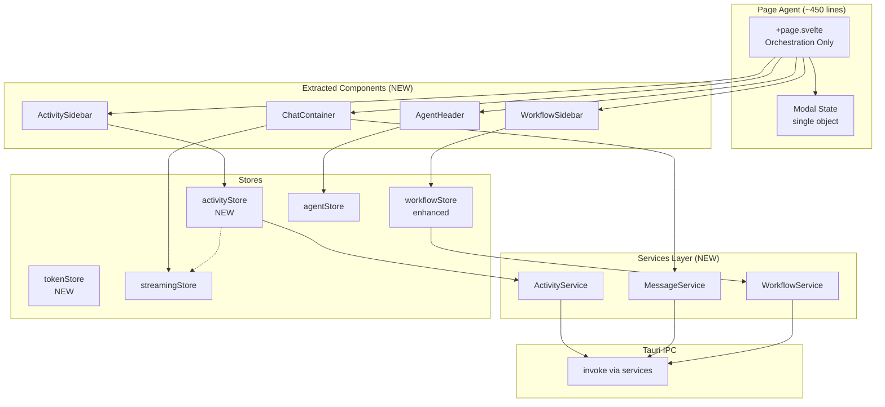
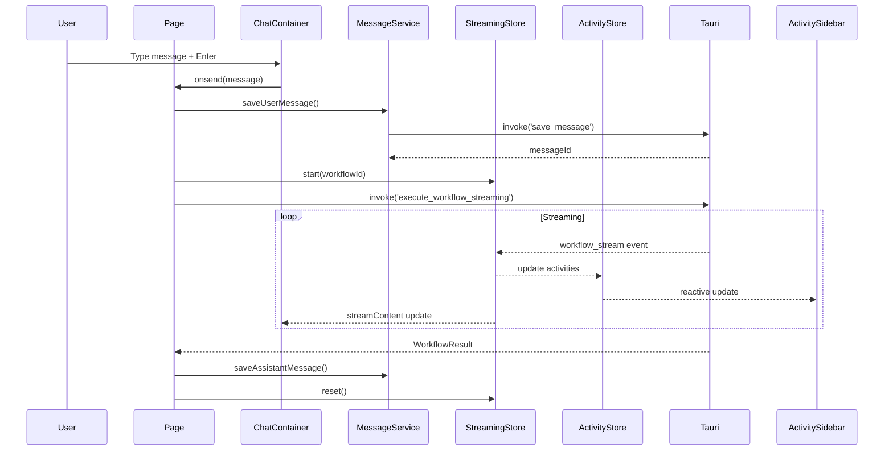

# Spécification - Refactoring de la Page Agent

## Métadonnées
- **Date**: 2025-12-03
- **Stack**: Svelte 5.43.14 + Rust 1.91.1 + Tauri 2.9.4 + SurrealDB 2.3.10
- **Complexité**: Complex (6 phases, ~16-20h d'effort)
- **Fichier Principal**: `src/routes/agent/+page.svelte` (1550 lignes actuellement)

## Contexte

### Demande
Refactoring du code existant pour simplifier, améliorer et nettoyer l'efficacité du workflow de la page agent. Focus sur :
- Sidebars (gauche: workflows, droite: activités)
- Agent header (sélecteur, iterations)
- Messages container (liste, streaming)
- Chat input container
- Token display container
- Injection des tools et MCP

### Objectif
Réduire la complexité du composant principal de 1550 lignes à ~400-500 lignes via :
1. Extraction d'une couche services pour les appels IPC Tauri
2. Consolidation des stores avec patterns établis
3. Extraction de composants autonomes avec responsabilités uniques
4. Simplification de l'orchestration au niveau page

### Périmètre

**Inclus**:
- Page agent (`src/routes/agent/+page.svelte`)
- Création de services (`src/lib/services/`)
- Nouveaux stores (`src/lib/stores/activity.ts`, `tokens.ts`)
- Composants extraits (`src/lib/components/agent/`)
- Tests unitaires et E2E

**Exclus**:
- Backend Rust (pas de modifications)
- Commandes Tauri existantes
- Base de données SurrealDB
- Logique MCP/Tool existante (fonctionne déjà bien)

### Critères de Succès
- [ ] Page réduite de 1550 à <500 lignes
- [ ] Variables d'état page réduites de 27 à <10
- [ ] handleSend() réduit de 114 à <30 lignes
- [ ] `npm run check` passe sans erreurs
- [ ] `npm run test` passe
- [ ] `cargo clippy` passe
- [ ] Streaming temps réel fonctionne identiquement
- [ ] Couverture tests >80% pour nouveaux services

---

## État Actuel

### Architecture Existante

```mermaid
graph TD
    subgraph "Page Agent (1550 lines)"
        PAGE[+page.svelte]
        STATE[27 State Variables]
        HANDLERS[Event Handlers<br>handleSend: 114 lines]
        LOADERS[5 Data Loaders<br>identical patterns]
        DERIVED[Activity Derivation<br>4 sources inline]
    end

    subgraph "Stores"
        AGENT_STORE[agentStore]
        STREAMING_STORE[streamingStore]
        VALIDATION_STORE[validationStore]
    end

    subgraph "Components"
        SIDEBAR[Sidebar]
        WORKFLOW_LIST[WorkflowList]
        MSG_LIST[MessageList]
        CHAT_INPUT[ChatInput]
        ACTIVITY_FEED[ActivityFeed]
        TOKEN_DISPLAY[TokenDisplay]
        AGENT_SELECTOR[AgentSelector]
    end

    subgraph "Tauri IPC"
        IPC[invoke calls<br>scattered in page]
    end

    PAGE --> STATE
    PAGE --> HANDLERS
    PAGE --> LOADERS
    PAGE --> DERIVED
    PAGE --> AGENT_STORE
    PAGE --> STREAMING_STORE
    PAGE --> VALIDATION_STORE
    PAGE --> IPC
    PAGE --> SIDEBAR
    PAGE --> WORKFLOW_LIST
    PAGE --> MSG_LIST
    PAGE --> CHAT_INPUT
    PAGE --> ACTIVITY_FEED
    PAGE --> TOKEN_DISPLAY
    PAGE --> AGENT_SELECTOR
```



### Problèmes Identifiés

| Problème | Impact | Localisation |
|----------|--------|--------------|
| Page trop volumineuse (1550 lignes) | Maintenabilité | +page.svelte |
| 27 variables d'état au niveau page | Complexité, bugs | +page.svelte:100-150 |
| handleSend() mélange 10 responsabilités (114 lignes) | Testabilité | +page.svelte:584-698 |
| 5 fonctions de chargement identiques | Duplication ~50 lignes | +page.svelte:231-312 |
| Dérivation activités inline (4 sources) | Re-renders inutiles | +page.svelte:136-143 |
| Modal state éparpillé (3 booleans) | État incohérent possible | +page.svelte |
| Prop drilling pour ActivityFeed | Couplage fort | Page → RightSidebar → ActivityFeed |
| TokenDisplay calculé inline | Logique dispersée | +page.svelte:179-201 |

### Patterns Existants Réutilisables

**Pattern agentStore** (`src/lib/stores/agents.ts`):
```typescript
// Pattern à suivre: Combined object store + derived stores
export const agentStore = {
  subscribe: store.subscribe,
  async loadAgents(): Promise<void> { ... },
  async createAgent(config): Promise<string> { ... },
  // ...
};

export const agents = derived(store, ($s) => $s.agents);
export const isLoading = derived(store, ($s) => $s.loading);
```

**Pattern Settings Page** (`src/routes/settings/+page.svelte`):
- Modal state centralisé: `mcpModalMode = $state<'create' | 'edit'>('create')`
- IntersectionObserver pour navigation
- Refresh trigger pour coordination stores

**Pattern Svelte 5 Runes**:
```typescript
// Props interface avec $props()
interface Props { data: DataType; }
let { data }: Props = $props();

// Derived avec tracking runtime
const computed = $derived.by(() => expensiveCalculation(data));

// Effects pour side-effects
$effect(() => { sideEffect(dependency); });
```

### Code Réutilisable

**Frontend**:
- `src/lib/stores/agents.ts` - Pattern store complet
- `src/lib/stores/streaming.ts` - Event listeners Tauri (736 lignes, bien structuré)
- `src/lib/utils/activity.ts` - Fonctions de conversion existantes
- `src/lib/components/layout/Sidebar.svelte` - Layout sidebar avec snippets

**Backend** (pas de modifications nécessaires):
- `src-tauri/src/commands/streaming.rs` - Commandes streaming complètes
- `src-tauri/src/commands/workflow.rs` - CRUD workflows
- `src-tauri/src/commands/message.rs` - Persistence messages

---

## Architecture Proposée

### Vue d'Ensemble



### Flux de Données



---

## Composants Spécifiés

### Service Layer

#### File 1: `src/lib/services/workflow.service.ts`
- **Path**: `src/lib/services/workflow.service.ts`
- **Type**: Nouveau

**Interface**:
```typescript
import { invoke } from '@tauri-apps/api/core';
import type { Workflow, WorkflowResult, WorkflowFullState } from '$types/workflow';

export const WorkflowService = {
  async loadAll(): Promise<Workflow[]>;
  async create(name: string, agentId: string): Promise<string>;
  async rename(workflowId: string, name: string): Promise<Workflow>;
  async delete(workflowId: string): Promise<void>;
  async executeStreaming(workflowId: string, message: string, agentId: string): Promise<WorkflowResult>;
  async cancel(workflowId: string): Promise<void>;
  async getFullState(workflowId: string): Promise<WorkflowFullState>;
  async restoreState(workflowId: string): Promise<RestorationResult>;
};
```

**Responsabilités**:
- Encapsule tous les appels IPC workflow
- Gère la restauration d'état coordonnée
- Retourne des types typés, pas de serde_json::Value

---

#### File 2: `src/lib/services/message.service.ts`
- **Path**: `src/lib/services/message.service.ts`
- **Type**: Nouveau

**Interface**:
```typescript
import type { Message, MessageCreate } from '$types/message';
import type { WorkflowMetrics } from '$types/workflow';

export const MessageService = {
  async load(workflowId: string): Promise<Message[]>;
  async save(params: MessageCreate): Promise<string>;
  async saveUser(workflowId: string, content: string): Promise<string>;
  async saveAssistant(workflowId: string, content: string, metrics?: WorkflowMetrics): Promise<string>;
  async saveSystem(workflowId: string, content: string): Promise<string>;
  async clear(workflowId: string): Promise<void>;
};
```

---

#### File 3: `src/lib/services/activity.service.ts`
- **Path**: `src/lib/services/activity.service.ts`
- **Type**: Nouveau

**Interface**:
```typescript
import type { ToolExecution } from '$types/tool';
import type { ThinkingStep } from '$types/thinking';
import type { SubAgentExecution } from '$types/sub-agent';
import type { Task } from '$types/task';
import type { WorkflowActivityEvent } from '$types/activity';

export const ActivityService = {
  async loadToolExecutions(workflowId: string): Promise<ToolExecution[]>;
  async loadThinkingSteps(workflowId: string): Promise<ThinkingStep[]>;
  async loadSubAgentExecutions(workflowId: string): Promise<SubAgentExecution[]>;
  async loadTasks(workflowId: string): Promise<Task[]>;
  async loadAll(workflowId: string): Promise<{
    tools: ToolExecution[];
    thinking: ThinkingStep[];
    subAgents: SubAgentExecution[];
    tasks: Task[];
  }>;
  convertToActivities(data: LoadAllResult): WorkflowActivityEvent[];
};
```

---

### Stores

#### File 4: `src/lib/stores/activity.ts`
- **Path**: `src/lib/stores/activity.ts`
- **Type**: Nouveau

**Interface**:
```typescript
import { writable, derived } from 'svelte/store';
import type { WorkflowActivityEvent, ActivityFilter } from '$types/activity';

interface ActivityState {
  historical: WorkflowActivityEvent[];
  filter: ActivityFilter;
  loading: boolean;
  error: string | null;
}

export const activityStore = {
  subscribe: store.subscribe,
  async loadHistorical(workflowId: string): Promise<void>;
  setFilter(filter: ActivityFilter): void;
  addStreamingActivity(activity: WorkflowActivityEvent): void;
  captureStreamingActivities(): void;
  reset(): void;
};

// Derived stores
export const historicalActivities = derived(store, ($s) => $s.historical);
export const activityFilter = derived(store, ($s) => $s.filter);
export const isLoading = derived(store, ($s) => $s.loading);

// Combined: historical + current streaming (from streamingStore)
export const allActivities = derived(
  [store, streamingStore],
  ([$activity, $streaming]) => combineActivities($activity.historical, $streaming)
);

export const filteredActivities = derived(
  [allActivities, activityFilter],
  ([$all, $filter]) => filterActivities($all, $filter)
);
```

---

#### File 5: `src/lib/stores/tokens.ts`
- **Path**: `src/lib/stores/tokens.ts`
- **Type**: Nouveau

**Interface**:
```typescript
import type { TokenDisplayData } from '$types/workflow';

interface TokenState {
  streaming: { input: number; output: number; speed: number | null };
  cumulative: { input: number; output: number; cost: number };
  contextMax: number;
  inputPrice: number;
  outputPrice: number;
  isStreaming: boolean;
  streamStartTime: number | null;
}

export const tokenStore = {
  subscribe: store.subscribe,
  updateFromWorkflow(workflow: Workflow): void;
  updateFromModel(model: LLMModel): void;
  startStreaming(): void;
  updateStreamingTokens(tokensOut: number): void;
  stopStreaming(): void;
  reset(): void;
};

// Derived: ready-to-use data for TokenDisplay component
export const tokenDisplayData = derived(store, ($s): TokenDisplayData => ({
  tokens_input: $s.streaming.input,
  tokens_output: $s.streaming.output,
  cumulative_tokens_input: $s.cumulative.input,
  cumulative_tokens_output: $s.cumulative.output,
  context_max: $s.contextMax,
  cost_usd: calculateCost($s.streaming, $s.inputPrice, $s.outputPrice),
  cumulative_cost_usd: $s.cumulative.cost,
  speed_tks: $s.streaming.speed,
  is_streaming: $s.isStreaming,
}));
```

---

### Composants Extraits

#### File 6: `src/lib/components/agent/AgentHeader.svelte`
- **Path**: `src/lib/components/agent/AgentHeader.svelte`
- **Type**: Nouveau
- **Lignes estimées**: ~150

**Props**:
```typescript
interface Props {
  workflow: Workflow | null;
  selectedAgentId: string | null;
  maxIterations: number;
  contextWindow: number;
  onagentchange: (agentId: string) => void;
  oniterationschange: (value: number) => void;
}
```

**Template Structure**:
```svelte
<header class="agent-header">
  <div class="header-left">
    <Bot size={24} />
    <h1>{workflow?.name ?? 'No workflow selected'}</h1>
  </div>

  <div class="header-center">
    <AgentSelector
      agents={$agents}
      selected={selectedAgentId}
      disabled={!workflow}
      onselect={onagentchange}
    />
  </div>

  <div class="header-right">
    <label>
      Max iterations:
      <Input
        type="number"
        value={maxIterations}
        min={1}
        max={200}
        onchange={(e) => oniterationschange(Number(e.target.value))}
      />
    </label>
    <span class="context-info">Context: {contextWindow.toLocaleString()} tokens</span>
  </div>
</header>
```

**Stores utilisés**: `agents` (from agentStore)

---

#### File 7: `src/lib/components/agent/WorkflowSidebar.svelte`
- **Path**: `src/lib/components/agent/WorkflowSidebar.svelte`
- **Type**: Nouveau
- **Lignes estimées**: ~200

**Props**:
```typescript
interface Props {
  collapsed?: boolean;
  selectedWorkflowId: string | null;
  oncollapsedchange?: (collapsed: boolean) => void;
  onselect: (workflowId: string) => void;
  oncreate: () => void;
  ondelete: (workflowId: string) => void;
}
```

**Template Structure**:
```svelte
<Sidebar bind:collapsed={collapsed}>
  {#snippet header(isCollapsed)}
    {#if !isCollapsed}
      <div class="sidebar-header">
        <h2>Workflows</h2>
        <Button variant="ghost" size="icon" onclick={oncreate}>
          <Plus size={16} />
        </Button>
      </div>
      <Input
        type="text"
        placeholder="Search..."
        bind:value={searchFilter}
      />
    {:else}
      <Button variant="ghost" size="icon" onclick={oncreate}>
        <Plus size={16} />
      </Button>
    {/if}
  {/snippet}

  {#snippet nav(isCollapsed)}
    <WorkflowList
      workflows={filteredWorkflows}
      selectedId={selectedWorkflowId}
      collapsed={isCollapsed}
      onselect={onselect}
      ondelete={ondelete}
    />
  {/snippet}
</Sidebar>
```

**Stores utilisés**: workflowStore (subscribe à workflows)

---

#### File 8: `src/lib/components/agent/ActivitySidebar.svelte`
- **Path**: `src/lib/components/agent/ActivitySidebar.svelte`
- **Type**: Nouveau
- **Lignes estimées**: ~180

**Props**:
```typescript
interface Props {
  collapsed?: boolean;
  oncollapsedchange?: (collapsed: boolean) => void;
}
```

**Template Structure**:
```svelte
<script lang="ts">
  import { filteredActivities, activityFilter, activityStore } from '$lib/stores/activity';
  import { isStreaming } from '$lib/stores/streaming';

  let { collapsed = $bindable(false), oncollapsedchange }: Props = $props();
</script>

<RightSidebar bind:collapsed={collapsed}>
  {#snippet header()}
    <div class="activity-header">
      <Activity size={20} />
      <span>Activity</span>
    </div>
  {/snippet}

  {#snippet content()}
    <ActivityFeed
      activities={$filteredActivities}
      filter={$activityFilter}
      isStreaming={$isStreaming}
      onfilterchange={(f) => activityStore.setFilter(f)}
    />
  {/snippet}
</RightSidebar>
```

**Stores utilisés**: activityStore, streamingStore (subscription directe, pas de prop drilling)

---

#### File 9: `src/lib/components/agent/ChatContainer.svelte`
- **Path**: `src/lib/components/agent/ChatContainer.svelte`
- **Type**: Nouveau
- **Lignes estimées**: ~250

**Props**:
```typescript
interface Props {
  messages: Message[];
  messagesLoading: boolean;
  streamContent: string;
  isStreaming: boolean;
  disabled: boolean;
  onsend: (message: string) => void;
  oncancel?: () => void;
}
```

**Template Structure**:
```svelte
<div class="chat-container">
  <!-- Messages -->
  {#if messagesLoading}
    <MessageListSkeleton />
  {:else}
    <MessageList {messages} />
  {/if}

  <!-- Streaming bubble -->
  {#if isStreaming && streamContent}
    <div class="streaming-bubble">
      <StreamingMessage content={streamContent} />
    </div>
  {/if}

  <!-- Input area -->
  <div class="chat-input-area">
    {#if isStreaming}
      <Button variant="danger" onclick={oncancel}>
        <StopCircle size={16} />
        Cancel
      </Button>
    {:else}
      <ChatInput
        {disabled}
        loading={isStreaming}
        onsend={onsend}
      />
    {/if}
  </div>
</div>
```

**Stores utilisés**: Aucun directement (props passées)

---

### Page Simplifiée

#### File 10: `src/routes/agent/+page.svelte` (MODIFICATION)
- **Path**: `src/routes/agent/+page.svelte`
- **Type**: Modification majeure
- **Lignes cible**: ~400-500 (de 1550)

**État simplifié**:
```typescript
// Modal state centralisé (1 object au lieu de 3 booleans)
type ModalState =
  | { type: 'none' }
  | { type: 'new-workflow' }
  | { type: 'delete-workflow'; workflowId: string }
  | { type: 'validation'; request: ValidationRequest };

let modalState = $state<ModalState>({ type: 'none' });

// UI state (3 variables au lieu de ~10)
let leftSidebarCollapsed = $state(false);
let rightSidebarCollapsed = $state(
  localStorage.getItem('zileo_right_sidebar_collapsed') === 'true'
);

// Selection state (délégué aux stores pour le reste)
let selectedWorkflowId = $state<string | null>(null);
let selectedAgentId = $state<string | null>(null);

// Agent config (chargé on-demand)
let currentMaxIterations = $state(50);
let currentContextWindow = $state(128000);
```

**Handlers simplifiés**:
```typescript
async function handleSend(message: string): Promise<void> {
  if (!selectedWorkflowId || !selectedAgentId) return;

  // 1. Save user message
  await MessageService.saveUser(selectedWorkflowId, message);

  // 2. Start streaming
  tokenStore.startStreaming();
  streamingStore.start(selectedWorkflowId);

  try {
    // 3. Execute
    const result = await WorkflowService.executeStreaming(
      selectedWorkflowId, message, selectedAgentId
    );

    // 4. Save assistant message
    await MessageService.saveAssistant(
      selectedWorkflowId, result.report, result.metrics
    );

    // 5. Capture activities
    activityStore.captureStreamingActivities();

  } catch (err) {
    await MessageService.saveSystem(selectedWorkflowId, `Error: ${err}`);
  } finally {
    streamingStore.reset();
    tokenStore.stopStreaming();
    await workflowStore.loadWorkflows(); // Refresh cumulative
  }
}
```

**Template simplifié**:
```svelte
<div class="agent-page">
  <!-- Left Sidebar -->
  <WorkflowSidebar
    bind:collapsed={leftSidebarCollapsed}
    selectedWorkflowId={selectedWorkflowId}
    onselect={handleWorkflowSelect}
    oncreate={() => modalState = { type: 'new-workflow' }}
    ondelete={(id) => modalState = { type: 'delete-workflow', workflowId: id }}
  />

  <!-- Main Content -->
  <main class="main-content">
    {#if selectedWorkflowId}
      <AgentHeader
        workflow={$currentWorkflow}
        {selectedAgentId}
        maxIterations={currentMaxIterations}
        contextWindow={currentContextWindow}
        onagentchange={handleAgentSelect}
        oniterationschange={handleIterationsChange}
      />

      <ChatContainer
        messages={$messages}
        messagesLoading={$messagesLoading}
        streamContent={$streamContent}
        isStreaming={$isStreaming}
        disabled={!selectedAgentId}
        onsend={handleSend}
        oncancel={handleCancel}
      />

      <TokenDisplay data={$tokenDisplayData} />
    {:else}
      <EmptyState message="Select or create a workflow" />
    {/if}
  </main>

  <!-- Right Sidebar -->
  <ActivitySidebar bind:collapsed={rightSidebarCollapsed} />

  <!-- Modals -->
  {#if modalState.type === 'new-workflow'}
    <NewWorkflowModal onclose={() => modalState = { type: 'none' }} />
  {:else if modalState.type === 'delete-workflow'}
    <ConfirmDeleteModal
      workflowId={modalState.workflowId}
      onclose={() => modalState = { type: 'none' }}
    />
  {:else if modalState.type === 'validation'}
    <ValidationModal
      request={modalState.request}
      onclose={() => modalState = { type: 'none' }}
    />
  {/if}
</div>
```

---

## Types Synchronisés

### Nouveaux Types (Frontend uniquement)

**Definition** (`src/types/services.ts`):
```typescript
// Service result types
export interface RestorationResult {
  success: boolean;
  workflowId: string;
  messagesCount: number;
  activitiesCount: number;
  error?: string;
}

// Modal state union type
export type ModalState =
  | { type: 'none' }
  | { type: 'new-workflow' }
  | { type: 'delete-workflow'; workflowId: string }
  | { type: 'validation'; request: ValidationRequest };
```

**Imports** (pattern existant, aucun changement):
```typescript
// ALWAYS use $types alias
import type { Workflow, WorkflowResult } from '$types/workflow';
import type { Message } from '$types/message';
import type { WorkflowActivityEvent, ActivityFilter } from '$types/activity';
import type { TokenDisplayData } from '$types/workflow';
```

### Types Existants Réutilisés

| Type | Fichier | Usage |
|------|---------|-------|
| `Workflow` | `$types/workflow` | WorkflowService, stores |
| `WorkflowResult` | `$types/workflow` | executeStreaming return |
| `WorkflowFullState` | `$types/workflow` | restoreState |
| `Message` | `$types/message` | MessageService |
| `TokenDisplayData` | `$types/workflow` | tokenStore derived |
| `WorkflowActivityEvent` | `$types/activity` | activityStore |
| `ActivityFilter` | `$types/activity` | activityStore |
| `ToolExecution` | `$types/tool` | ActivityService |
| `ThinkingStep` | `$types/thinking` | ActivityService |
| `SubAgentExecution` | `$types/sub-agent` | ActivityService |
| `Task` | `$types/task` | ActivityService |

---

## Plan d'Implémentation

### Phase A: Service Layer Foundation
**Objectif**: Créer la couche services sans modifier le code existant

**Tâches**:
1. **Services**: Créer `src/lib/services/index.ts` (exports)
2. **Services**: Créer `src/lib/services/workflow.service.ts`
3. **Services**: Créer `src/lib/services/message.service.ts`
4. **Services**: Créer `src/lib/services/activity.service.ts`
5. **Types**: Créer `src/types/services.ts` (RestorationResult, etc.)

**Dépendances**: Aucune (nouveau code isolé)

**Livrable**: 3 services fonctionnels avec types

**Validation**:
- [ ] `npm run check` passe
- [ ] Tests unitaires pour chaque service
- [ ] Aucune modification aux fichiers existants

---

### Phase B: Store Consolidation
**Objectif**: Créer nouveaux stores et améliorer existants

**Tâches**:
1. **Stores**: Créer `src/lib/stores/activity.ts`
   - State: historical, filter, loading, error
   - Methods: loadHistorical, setFilter, captureStreaming, reset
   - Derived: allActivities (combine avec streamingStore), filteredActivities

2. **Stores**: Créer `src/lib/stores/tokens.ts`
   - State: streaming metrics, cumulative, prices
   - Methods: updateFromWorkflow, updateFromModel, startStreaming, stopStreaming
   - Derived: tokenDisplayData

3. **Stores**: Modifier `src/lib/stores/workflows.ts`
   - Ajouter: selectedWorkflowId state
   - Ajouter: methods loadWorkflows, selectWorkflow
   - Pattern: comme agentStore

4. **Stores**: Mettre à jour `src/lib/stores/index.ts` (exports)

**Dépendances**: Phase A (services utilisés par stores)

**Livrable**: 2 nouveaux stores, 1 store amélioré

**Validation**:
- [ ] `npm run check` passe
- [ ] Tests unitaires pour stores
- [ ] Derived stores calculent correctement

---

### Phase C: Component Extraction
**Objectif**: Extraire composants autonomes de la page

**Tâches**:
1. **Components**: Créer `src/lib/components/agent/AgentHeader.svelte`
   - Extraire header avec AgentSelector
   - Props pour workflow, agent, iterations

2. **Components**: Créer `src/lib/components/agent/WorkflowSidebar.svelte`
   - Encapsuler Sidebar + WorkflowList
   - Subscribe à workflowStore

3. **Components**: Créer `src/lib/components/agent/ActivitySidebar.svelte`
   - Encapsuler RightSidebar + ActivityFeed
   - Subscribe directement à activityStore (élimine prop drilling)

4. **Components**: Créer `src/lib/components/agent/ChatContainer.svelte`
   - Encapsuler MessageList + ChatInput + streaming bubble
   - Props pour messages et callbacks

5. **Components**: Créer `src/lib/components/agent/index.ts` (exports)

**Dépendances**: Phase B (stores)

**Livrable**: 4 composants autonomes

**Validation**:
- [ ] Chaque composant fonctionne isolément
- [ ] Props interfaces complètes
- [ ] Pas de régression UI

---

### Phase D: Page Simplification
**Objectif**: Réduire +page.svelte à ~450 lignes

**Tâches**:
1. **Page**: Remplacer state variables par subscriptions stores
2. **Page**: Remplacer data loaders par appels services
3. **Page**: Simplifier handleSend() (114→30 lignes)
4. **Page**: Centraliser modal state (3 booleans → 1 union type)
5. **Page**: Utiliser composants extraits
6. **Page**: Supprimer code mort

**Dépendances**: Phase C (composants)

**Livrable**: Page < 500 lignes

**Validation**:
- [ ] Page < 500 lignes
- [ ] Toutes fonctionnalités préservées
- [ ] Performance identique ou meilleure

---

### Phase E: Tool/MCP Display Enhancements
**Objectif**: Améliorations mineures affichage tools (optionnel)

**Tâches**:
1. **ActivityItem**: Afficher nom serveur MCP pour outils MCP
2. **ActivityItem**: Ajouter preview input/output expandable
3. **CSS**: Améliorer distinction tools locaux vs MCP

**Dépendances**: Aucune (peut être fait en parallèle)

**Livrable**: UI améliorée pour activities

**Validation**:
- [ ] MCP tools distingués visuellement
- [ ] Preview fonctionne

---

### Phase F: Testing & Documentation
**Objectif**: Couverture tests et documentation

**Tâches**:
1. **Tests**: Unit tests services (vitest + mock invoke)
2. **Tests**: Unit tests stores (test derived calculations)
3. **Tests**: Component tests (testing-library/svelte)
4. **Tests**: E2E test workflow complet (Playwright)
5. **Docs**: Mettre à jour CLAUDE.md section agent page

**Dépendances**: Phases A-D complètes

**Livrable**: >80% couverture nouveaux fichiers

**Validation**:
- [ ] `npm run test` passe
- [ ] Couverture >80% services
- [ ] E2E test passe

---

## Estimation

| Phase | Services | Stores | Components | Page | Tests | Total |
|-------|----------|--------|------------|------|-------|-------|
| A | 2-3h | - | - | - | 1h | 3-4h |
| B | - | 3-4h | - | - | 1h | 4-5h |
| C | - | - | 4-5h | - | - | 4-5h |
| D | - | - | - | 2-3h | - | 2-3h |
| E | - | - | 1h | - | - | 1h |
| F | - | - | - | - | 3-4h | 3-4h |
| **Total** | 2-3h | 3-4h | 5-6h | 2-3h | 5-6h | **17-22h** |

**Facteurs de réduction**:
- Patterns établis (agentStore, settings page): -15%
- Types existants complets: -10%
- Composants UI existants réutilisables: -10%

**Facteurs d'augmentation**:
- Intégration streaming complexe: +10%
- Tests E2E nouveaux: +5%

**Estimation ajustée**: ~16-20h

---

## Analyse des Risques

| Risque | Probabilité | Impact | Mitigation | Plan B |
|--------|-------------|--------|------------|--------|
| Casser réactivité streaming | Moyenne | Haute | Garder streamingStore intact, ajouter subscriptions | Rollback, garder dérivation page-level |
| Race conditions stores | Moyenne | Moyenne | $effect pour updates coordonnées, tests exhaustifs | Patterns async/await explicites avec guards |
| Performance régression | Basse | Basse | Svelte 5 fine-grained reactivity, profiler | Memoization manuelle |
| Bundle size augmentation | Basse | Basse | Tree-shaking Svelte efficace | Lazy loading composants |
| Type drift services | Basse | Moyenne | Réutiliser types $types/, conventions naming | Review types systématique |

---

## Tests

### Frontend (Vitest)

**Services** (`src/lib/services/__tests__/`):
```typescript
import { describe, it, expect, vi } from 'vitest';
import { WorkflowService } from '../workflow.service';

vi.mock('@tauri-apps/api/core', () => ({
  invoke: vi.fn()
}));

describe('WorkflowService', () => {
  it('loadAll returns workflows array', async () => {
    vi.mocked(invoke).mockResolvedValue([{ id: '1', name: 'Test' }]);
    const result = await WorkflowService.loadAll();
    expect(result).toHaveLength(1);
  });
});
```

**Stores** (`src/lib/stores/__tests__/`):
```typescript
describe('activityStore', () => {
  it('filteredActivities filters by type', () => {
    activityStore.setFilter('tools');
    const filtered = get(filteredActivities);
    expect(filtered.every(a => a.type === 'tool')).toBe(true);
  });
});
```

**Components** (`src/lib/components/agent/__tests__/`):
```typescript
import { render, fireEvent } from '@testing-library/svelte';
import AgentHeader from '../AgentHeader.svelte';

describe('AgentHeader', () => {
  it('emits onagentchange when agent selected', async () => {
    const onagentchange = vi.fn();
    const { getByRole } = render(AgentHeader, { props: { onagentchange, ... } });
    // Test interaction
  });
});
```

### E2E (Playwright)

```typescript
test('complete workflow: select, send, receive', async ({ page }) => {
  await page.goto('/agent');

  // Select workflow
  await page.click('[data-testid="workflow-item"]');

  // Select agent
  await page.click('[data-testid="agent-selector"]');
  await page.click('[data-testid="agent-option-mistral"]');

  // Send message
  await page.fill('[data-testid="chat-input"]', 'Hello');
  await page.click('[data-testid="send-button"]');

  // Wait for response
  await expect(page.locator('[data-testid="assistant-message"]')).toBeVisible();

  // Verify activities
  await expect(page.locator('[data-testid="activity-item"]')).toHaveCount.greaterThan(0);
});
```

---

## Considérations

### Performance
- **Réactivité Svelte 5**: $derived.by pour calculs coûteux
- **Store subscriptions**: Fine-grained avec derived stores
- **MessageList**: CSS containment existant préservé
- **Streaming**: Aucun changement au pattern événements Tauri

### Sécurité
- **Validation inputs**: Préservée (backend inchangé)
- **Tauri allowlist**: Inchangé
- **CSP**: Inchangé dans tauri.conf.json

### Tauri Spécifique
- **IPC sérialisation**: Via services, types synchronisés
- **State management**: AppState backend inchangé
- **Events**: workflow_stream, workflow_complete patterns préservés
- **Parameter naming**: camelCase côté TS, snake_case côté Rust

---

## Dépendances

### Frontend (package.json)
Aucune nouvelle dépendance requise.

### Backend (Cargo.toml)
Aucune modification backend.

---

## Prochaines Étapes

### Validation Pré-Implémentation
- [ ] Architecture approuvée par l'utilisateur
- [ ] Phases séquencées comprises
- [ ] Risques acceptés

### Implémentation
1. Commencer Phase A (services)
2. Tests unitaires après chaque phase
3. Review après Phase D
4. E2E tests Phase F

### Post-Implémentation
- [ ] Mettre à jour CLAUDE.md
- [ ] Créer memory Serena si nécessaire
- [ ] Review performance

---

## Références

### Sources Externes
- [Svelte 5 Runes Best Practices](https://www.loopwerk.io/articles/2025/svelte-5-runes/)
- [Refactoring Svelte Stores to $state](https://www.loopwerk.io/articles/2025/svelte-5-stores/)
- [Svelte 5 Migration Guide](https://svelte.dev/docs/svelte/v5-migration-guide)
- [Tauri 2 IPC Concepts](https://v2.tauri.app/concept/inter-process-communication/)
- [Tauri Command Best Practices](https://v2.tauri.app/develop/calling-rust/)
- [Svelte Design Patterns](https://render.com/blog/svelte-design-patterns)
- [Component Composition Patterns](https://www.frontendhire.com/learn/frontend/courses/todo-app-svelte/component-composition)

### Documentation Projet
- `docs/TECH_STACK.md` - Versions et stack
- `docs/ARCHITECTURE_DECISIONS.md` - Décisions architecturales
- `CLAUDE.md` - Instructions développement

### Code Analysé
- `src/routes/agent/+page.svelte` (1550 lignes)
- `src/lib/stores/agents.ts` (pattern référence)
- `src/lib/stores/streaming.ts` (736 lignes)
- `src/routes/settings/+page.svelte` (pattern modal)
- `src/lib/components/layout/Sidebar.svelte` (pattern snippet)

### Memories Serena
- `project_overview`
- `zileo_settings_architecture_deep_dive`

---

## ADDENDUM: Améliorations Backend Critiques

Les phases suivantes adressent des bugs et limitations identifiés lors de l'analyse.

---

## Phase G: Système de Feedback d'Erreur Tool Call

### Problème Identifié

Certains modèles LLM (notamment Ollama `kimik2thinking`, `deepseek-r1`) génèrent des tool calls avec des **tags XML mal fermés**:

```xml
<!-- Format généré par le LLM (INCORRECT) -->
<tool_call name="MemoryTool">
{"operation": "search", "query": "nom utilisateur", "limit": 10}
</tool_result>   ← MAUVAIS TAG (devrait être </tool_call>)

<!-- Format attendu par le parser (CORRECT) -->
<tool_call name="MemoryTool">
{"operation": "search", "query": "nom utilisateur", "limit": 10}
</tool_call>
```

**Conséquence**: Le regex ne matche pas → tool call ignoré → texte brut dans la réponse.

### Solution: Feedback d'Erreur au LLM

**Fichier**: `src-tauri/src/agents/llm_agent.rs`

#### G.1 Regex Tolérante (Quick Fix)

```rust
// Ligne ~600 - Accepter les deux fermetures
const TOOL_CALL_PATTERN: &str =
    r#"<tool_call\s+name=\"([^\"]+)\">\s*([\s\S]*?)\s*</tool_(?:call|result)>"#;
```

#### G.2 Détection de Tool Calls Malformées

```rust
// Nouvelle fonction dans llm_agent.rs
fn detect_malformed_tool_calls(content: &str) -> Option<String> {
    // Patterns de tool calls potentiellement malformées
    let has_tool_call_start = content.contains("<tool_call");
    let has_proper_close = content.contains("</tool_call>");
    let has_wrong_close = content.contains("</tool_result>");
    let has_json_in_tag = Regex::new(r#"<tool_call[^>]*>\s*\{"#).unwrap().is_match(content);

    if has_tool_call_start && !has_proper_close && has_json_in_tag {
        if has_wrong_close {
            return Some(format!(
                "TOOL CALL FORMAT ERROR: You used </tool_result> as closing tag.\n\
                 Expected format:\n\
                 <tool_call name=\"ToolName\">\n\
                 {{\"param\": \"value\"}}\n\
                 </tool_call>  ← Use </tool_call> not </tool_result>\n\n\
                 Please retry with the correct format."
            ));
        }
        return Some(format!(
            "TOOL CALL FORMAT ERROR: Malformed tool call detected.\n\
             Expected format:\n\
             <tool_call name=\"ToolName\">\n\
             {{\"param\": \"value\"}}\n\
             </tool_call>\n\n\
             Please ensure your tool calls are properly formatted."
        ));
    }
    None
}
```

#### G.3 Injection du Feedback dans la Boucle Tool

```rust
// Dans execute_with_mcp(), après parse_tool_calls()
let parsed_calls = Self::parse_tool_calls(&response.content);

if parsed_calls.is_empty() {
    // Vérifier si c'est une erreur de format
    if let Some(format_error) = Self::detect_malformed_tool_calls(&response.content) {
        warn!(error = %format_error, "Detected malformed tool call");

        // Injecter feedback dans le contexte pour auto-correction
        let error_feedback = ToolExecutionResult {
            tool_name: "FORMAT_ERROR".to_string(),
            success: false,
            result: serde_json::json!({}),
            error: Some(format_error),
        };

        // Formater et ajouter au prompt de continuation
        let error_context = Self::format_tool_results(&[error_feedback]);
        conversation_history.push(format!(
            "Tool execution results:\n{}\n\nPlease correct the format and try again.",
            error_context
        ));

        // Continuer la boucle pour laisser le LLM corriger
        continue;
    }
}
```

#### G.4 Feedback JSON Malformé

```rust
// Dans parse_tool_calls(), au lieu de `continue` silencieux
let arguments = match serde_json::from_str::<serde_json::Value>(json_str) {
    Ok(args) => args,
    Err(e) => {
        warn!(tool = %tool_name, error = %e, json = %json_str, "Failed to parse tool arguments");

        // Créer un ParsedToolCall spécial pour feedback d'erreur
        return Some(ParsedToolCall {
            tool_name: tool_name.to_string(),
            arguments: serde_json::json!({}),
            is_mcp: false,
            mcp_server: None,
            mcp_tool: None,
            parse_error: Some(format!(
                "Invalid JSON in tool call '{}': {}. Received: {}",
                tool_name, e, json_str.chars().take(200).collect::<String>()
            )),
        });
    }
};
```

### Format de Feedback XML

```xml
<tool_result name="FORMAT_ERROR" success="false">
Error: TOOL CALL FORMAT ERROR: You used </tool_result> as closing tag.
Expected format:
<tool_call name="ToolName">
{"param": "value"}
</tool_call>  ← Use </tool_call> not </tool_result>

Please retry with the correct format.
</tool_result>
```

### Tests Phase G

```rust
#[cfg(test)]
mod tool_error_tests {
    #[test]
    fn test_detect_wrong_closing_tag() {
        let content = r#"<tool_call name="MemoryTool">{"op": "search"}</tool_result>"#;
        let error = detect_malformed_tool_calls(content);
        assert!(error.is_some());
        assert!(error.unwrap().contains("</tool_result>"));
    }

    #[test]
    fn test_detect_missing_closing_tag() {
        let content = r#"<tool_call name="MemoryTool">{"op": "search"}"#;
        let error = detect_malformed_tool_calls(content);
        assert!(error.is_some());
    }

    #[test]
    fn test_valid_tool_call_no_error() {
        let content = r#"<tool_call name="MemoryTool">{"op": "search"}</tool_call>"#;
        let error = detect_malformed_tool_calls(content);
        assert!(error.is_none());
    }
}
```

### Estimation Phase G

| Tâche | Effort |
|-------|--------|
| Regex tolérante | 0.5h |
| detect_malformed_tool_calls() | 1h |
| Injection feedback dans boucle | 1h |
| Feedback JSON malformé | 0.5h |
| Tests unitaires | 1h |
| **Total** | **4h** |

---

## Phase H: Support des Modèles Thinking Ollama

### Contexte

L'API Ollama supporte les modèles de raisonnement (thinking models) via le paramètre `think: true`.

**Sources**:
- [Ollama Thinking Documentation](https://docs.ollama.com/capabilities/thinking)
- [Ollama Blog - Thinking](https://ollama.com/blog/thinking)

### Modèles Supportés

| Modèle | Provider | Paramètre Think |
|--------|----------|-----------------|
| `deepseek-r1` | Ollama | `think: true/false` |
| `deepseek-r1:7b` | Ollama | `think: true/false` |
| `qwen3` | Ollama | `think: true/false` |
| `gpt-oss` | Ollama | `think: "low"/"medium"/"high"` |
| `kimik2thinking` | Ollama | `think: true/false` |
| `magistral-*` | Mistral | (format différent) |

### API Ollama - Format Thinking

**Request**:
```json
{
  "model": "deepseek-r1",
  "messages": [{"role": "user", "content": "question"}],
  "think": true,
  "stream": false
}
```

**Response** (non-streaming):
```json
{
  "message": {
    "role": "assistant",
    "content": "The final answer is...",
    "thinking": "First, let me analyze... Then I need to consider..."
  }
}
```

**Streaming**: Les chunks contiennent soit `thinking` soit `content`, jamais les deux.

### Implémentation Proposée

#### H.1 Détection des Modèles Thinking

**Fichier**: `src-tauri/src/llm/ollama.rs`

```rust
/// Modèles Ollama qui supportent le thinking
const OLLAMA_THINKING_MODELS: &[&str] = &[
    "deepseek-r1",
    "deepseek-v3",
    "qwen3",
    "gpt-oss",
    "kimik",
    "thinking",  // Catch-all pour modèles avec "thinking" dans le nom
];

/// Vérifie si un modèle supporte le thinking
fn is_thinking_model(model: &str) -> bool {
    let model_lower = model.to_lowercase();
    OLLAMA_THINKING_MODELS.iter().any(|m| model_lower.contains(m))
}

/// Retourne le paramètre think approprié
fn get_think_param(model: &str, enable_thinking: bool) -> serde_json::Value {
    if !enable_thinking {
        return serde_json::json!(false);
    }

    // gpt-oss utilise des niveaux, pas des booléens
    if model.to_lowercase().contains("gpt-oss") {
        serde_json::json!("medium")
    } else {
        serde_json::json!(true)
    }
}
```

#### H.2 Appel HTTP Direct (Bypass rig-core)

**Fichier**: `src-tauri/src/llm/ollama.rs`

```rust
/// Response structure pour chat avec thinking
#[derive(Debug, Deserialize)]
struct OllamaChatResponse {
    message: OllamaMessage,
    #[serde(default)]
    done: bool,
}

#[derive(Debug, Deserialize)]
struct OllamaMessage {
    role: String,
    content: String,
    #[serde(default)]
    thinking: Option<String>,
}

/// Complète avec support thinking (appel HTTP direct)
async fn complete_with_thinking(
    &self,
    prompt: &str,
    system_prompt: Option<&str>,
    model: &str,
    temperature: f32,
    max_tokens: usize,
    enable_thinking: bool,
) -> Result<(LLMResponse, Option<String>), LLMError> {
    let server_url = self.server_url.read().await.clone();
    let url = format!("{}/api/chat", server_url);

    let messages = vec![
        serde_json::json!({
            "role": "system",
            "content": system_prompt.unwrap_or("You are a helpful assistant.")
        }),
        serde_json::json!({
            "role": "user",
            "content": prompt
        }),
    ];

    let body = serde_json::json!({
        "model": model,
        "messages": messages,
        "think": get_think_param(model, enable_thinking),
        "stream": false,
        "options": {
            "temperature": temperature,
            "num_predict": max_tokens
        }
    });

    let client = reqwest::Client::new();
    let response = client
        .post(&url)
        .json(&body)
        .send()
        .await
        .map_err(|e| LLMError::ConnectionError(e.to_string()))?;

    if !response.status().is_success() {
        let error_text = response.text().await.unwrap_or_default();
        return Err(LLMError::RequestFailed(error_text));
    }

    let chat_response: OllamaChatResponse = response
        .json()
        .await
        .map_err(|e| LLMError::RequestFailed(format!("Parse error: {}", e)))?;

    let thinking_content = chat_response.message.thinking;

    Ok((
        LLMResponse {
            content: chat_response.message.content,
            tokens_input: estimate_tokens(prompt),
            tokens_output: estimate_tokens(&chat_response.message.content),
            model: model.to_string(),
            provider: ProviderType::Ollama,
            finish_reason: Some("stop".to_string()),
        },
        thinking_content,
    ))
}
```

#### H.3 Streaming avec Thinking

```rust
/// Streaming avec support thinking
async fn complete_stream_with_thinking(
    &self,
    prompt: &str,
    system_prompt: Option<&str>,
    model: &str,
    temperature: f32,
    max_tokens: usize,
    enable_thinking: bool,
) -> Result<mpsc::Receiver<Result<StreamingChunk, LLMError>>, LLMError> {
    let (tx, rx) = mpsc::channel(100);

    let server_url = self.server_url.read().await.clone();
    let url = format!("{}/api/chat", server_url);

    let body = serde_json::json!({
        "model": model,
        "messages": [...],
        "think": get_think_param(model, enable_thinking),
        "stream": true,
        "options": { "temperature": temperature, "num_predict": max_tokens }
    });

    tokio::spawn(async move {
        let client = reqwest::Client::new();
        let mut response = client.post(&url).json(&body).send().await?;

        while let Some(chunk) = response.chunk().await? {
            let line = String::from_utf8_lossy(&chunk);
            if let Ok(json) = serde_json::from_str::<OllamaStreamChunk>(&line) {
                if let Some(thinking) = json.message.thinking {
                    tx.send(Ok(StreamingChunk::Thinking(thinking))).await?;
                }
                if !json.message.content.is_empty() {
                    tx.send(Ok(StreamingChunk::Content(json.message.content))).await?;
                }
            }
        }

        Ok(())
    });

    Ok(rx)
}

/// Chunk de streaming différencié
enum StreamingChunk {
    Thinking(String),
    Content(String),
}
```

#### H.4 Intégration avec LLMAgent

**Fichier**: `src-tauri/src/agents/llm_agent.rs`

```rust
// Dans execute_with_mcp()
let (llm_response, thinking_content) = if is_thinking_model(&model_name) {
    provider.complete_with_thinking(
        &full_prompt,
        Some(&system_prompt),
        &model_name,
        temperature,
        max_tokens,
        agent_config.enable_thinking.unwrap_or(true),
    ).await?
} else {
    (provider.complete(...).await?, None)
};

// Émettre thinking comme événement de streaming
if let Some(thinking) = thinking_content {
    self.emit_progress(StreamChunk::reasoning(
        workflow_id.clone(),
        thinking.clone(),
    ));

    // Persister dans thinking_step
    let step = ThinkingStepCreate::new(
        workflow_id.clone(),
        message_id.clone(),
        agent_id.clone(),
        thinking_step_number,
        thinking,
    );
    // Save to DB...
    thinking_step_number += 1;
}
```

#### H.5 Configuration Agent

**Fichier**: `src/types/agent.ts`

```typescript
export interface AgentConfig {
  // ... existing fields

  /** Enable thinking mode for supported models (default: true) */
  enable_thinking?: boolean;
}
```

**Fichier**: `src-tauri/src/models/agent.rs`

```rust
pub struct AgentConfig {
    // ... existing fields

    /// Enable thinking mode for supported models
    #[serde(default = "default_enable_thinking")]
    pub enable_thinking: bool,
}

fn default_enable_thinking() -> bool {
    true
}
```

### UI Settings - Toggle Thinking

**Dans AgentForm.svelte** (si l'agent utilise un modèle thinking):

```svelte
{#if isThinkingModel(selectedModel)}
  <div class="form-field">
    <label>
      <input type="checkbox" bind:checked={config.enable_thinking} />
      Enable thinking mode (show reasoning process)
    </label>
    <p class="help-text">
      When enabled, the model will show its reasoning before answering.
    </p>
  </div>
{/if}
```

### Tests Phase H

```rust
#[cfg(test)]
mod ollama_thinking_tests {
    #[test]
    fn test_is_thinking_model() {
        assert!(is_thinking_model("deepseek-r1"));
        assert!(is_thinking_model("deepseek-r1:7b"));
        assert!(is_thinking_model("qwen3"));
        assert!(is_thinking_model("spiah/kimik2thinking:latest"));
        assert!(!is_thinking_model("llama3.2"));
        assert!(!is_thinking_model("mistral"));
    }

    #[test]
    fn test_get_think_param() {
        assert_eq!(get_think_param("deepseek-r1", true), json!(true));
        assert_eq!(get_think_param("deepseek-r1", false), json!(false));
        assert_eq!(get_think_param("gpt-oss", true), json!("medium"));
    }

    #[tokio::test]
    async fn test_complete_with_thinking() {
        // Mock test avec server Ollama
    }
}
```

### Estimation Phase H

| Tâche | Effort |
|-------|--------|
| Détection modèles thinking | 0.5h |
| complete_with_thinking() | 2h |
| complete_stream_with_thinking() | 2h |
| Intégration LLMAgent | 1.5h |
| Config agent + UI toggle | 1h |
| Tests | 1.5h |
| **Total** | **8.5h** |

---

## Récapitulatif des Phases Ajoutées

| Phase | Description | Effort | Priorité |
|-------|-------------|--------|----------|
| **G** | Feedback erreur tool call | 4h | Haute (bug fix) |
| **H** | Support Ollama thinking | 8.5h | Moyenne (feature) |
| **Total Addendum** | | **12.5h** | |

### Nouvelle Estimation Globale

| Phases | Effort |
|--------|--------|
| A-F (Refactoring Frontend) | 16-20h |
| G (Tool Error Feedback) | 4h |
| H (Ollama Thinking) | 8.5h |
| **Total Projet** | **28.5-32.5h** |

### Ordre d'Implémentation Recommandé

1. **Phase G** (Tool Error Feedback) - Fix critique pour modèles Ollama
2. **Phase H** (Ollama Thinking) - Feature importante
3. **Phases A-F** (Refactoring Frontend) - Amélioration maintenabilité

---

## Références Additionnelles

### Ollama Thinking API
- [Ollama Thinking Documentation](https://docs.ollama.com/capabilities/thinking)
- [Ollama Blog - Thinking](https://ollama.com/blog/thinking)
- [DeepSeek R1 on Ollama](https://ollama.com/library/deepseek-r1)

### Code Analysé (Backend)
- `src-tauri/src/llm/ollama.rs` - Provider actuel (pas de thinking)
- `src-tauri/src/llm/mistral.rs` - Référence pour custom_complete()
- `src-tauri/src/agents/llm_agent.rs` - Boucle tool execution
