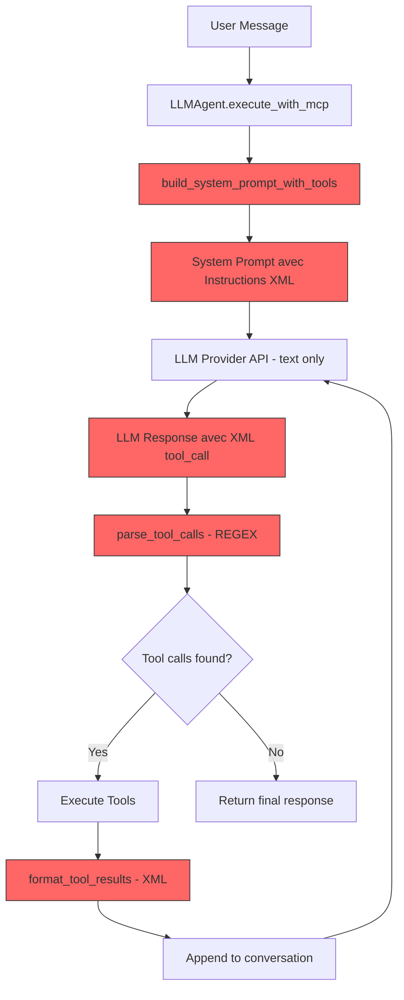
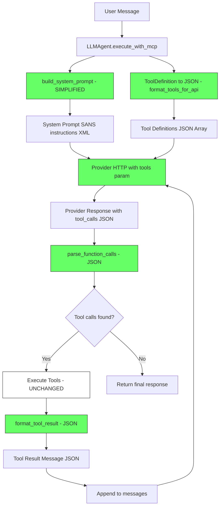

# Specification - JSON Function Calling Refactoring

## Metadata
- **Date**: 2025-12-03
- **Stack**: Svelte 5.43 + Rust 1.91 + Tauri 2.9 + SurrealDB 2.3
- **Complexity**: MODERATE (80% code reutilise)
- **Estimated Phases**: 3 (A-C)
- **Migration Type**: COMPLETE (no legacy XML code retained)
- **Rig.rs**: Utilise pour completions, PAS pour tools (notre trait Tool custom est conserve)

## Context

### Request
Refactoring du systeme de tool calling de XML custom vers JSON function calling natif pour conformite 100% aux standards industrie.

### Objective
Remplacer completement l'architecture de tool calling XML par le format JSON function calling natif (standard OpenAI) supporte par Mistral API et Ollama.

### Migration Strategy
**MIGRATION COMPLETE** - Aucun code XML ne sera conserve:
- Suppression totale du parsing XML regex
- Suppression totale du formatage XML
- Suppression des instructions XML dans les system prompts
- Pas de flag dual-mode
- Pas de backward compatibility

### Scope
**Included**:
- Remplacement XML → JSON pour tool calling
- Adaptation Mistral provider (function calling API)
- Adaptation Ollama provider (OpenAI-compatible tools API)
- Nouveaux types Rust/TypeScript pour function calling
- Nouveau system prompt sans instructions XML
- Suppression complete du code XML

**Excluded**:
- Self-reflection pattern (separate feature)
- Just-in-time tool loading (separate optimization)
- Claude/GPT-4 providers (future phase)
- MCP protocol changes (reste inchange)

### Success Criteria
- [ ] Score industrie passe de 4/5 a 4.8/5
- [ ] Mistral function calling natif fonctionne
- [ ] Ollama function calling natif fonctionne
- [ ] MCP tools continuent de fonctionner
- [ ] ZERO code XML restant dans le codebase
- [ ] Tests E2E passent pour les deux providers
- [ ] System prompt reduit de ~60%

---

## Code XML a SUPPRIMER

### Liste Complete des Suppressions

| Fichier | Fonction/Code | Lignes (approx) | Raison |
|---------|---------------|-----------------|--------|
| `llm_agent.rs` | `parse_tool_calls()` | 595-659 | Parser XML regex |
| `llm_agent.rs` | `detect_malformed_tool_calls()` | 767-803 | Detection erreurs XML |
| `llm_agent.rs` | `format_tool_results()` | 735-765 | Formatage XML results |
| `llm_agent.rs` | `strip_tool_calls()` | ~810-830 | Strip XML du output |
| `llm_agent.rs` | Instructions XML dans `build_system_prompt_with_tools()` | 461-593 | Prompt XML |
| `llm_agent.rs` | Struct `ParsedToolCall` | ~580-594 | Type XML specifique |

### Code XML Actuel (a supprimer)

**Parser XML** (`llm_agent.rs:595-659`):
```rust
// A SUPPRIMER COMPLETEMENT
fn parse_tool_calls(response: &str) -> Vec<ParsedToolCall> {
    let pattern = Regex::new(
        r#"<tool_call\s+name="([^"]+)">\s*([\s\S]*?)\s*</tool_(?:call|result)>"#
    ).expect("Invalid regex");
    // ...
}
```

**Formatage XML** (`llm_agent.rs:735-765`):
```rust
// A SUPPRIMER COMPLETEMENT
fn format_tool_results(results: &[ToolExecutionResult]) -> String {
    results.iter().map(|r| {
        format!(
            "<tool_result name=\"{}\" success=\"{}\">...</tool_result>",
            ...
        )
    }).collect()
}
```

**Detection Malformed** (`llm_agent.rs:767-803`):
```rust
// A SUPPRIMER COMPLETEMENT
fn detect_malformed_tool_calls(response: &str) -> Option<String> {
    // Detection </tool_result> au lieu de </tool_call>
    // Plus necessaire avec JSON natif
}
```

---

## Current State Analysis

### Architecture Existante - XML Tool Calling (A REMPLACER)



*Noeuds en rouge = a remplacer*

### Problems with Current Approach

| Issue | Impact | Solution |
|-------|--------|----------|
| Custom XML format | Non-standard, LLMs pas entraines | JSON function calling natif |
| Regex parsing | Fragile, erreurs silencieuses | API response parsing natif |
| Long system prompts | ~2000 tokens perdus | Tool definitions via API |
| No tool_call_id | Pas de tracking multi-tool | UUID par appel |
| Tolerant parsing | Masque erreurs LLM | Strict JSON validation |

---

## Industry Standard Analysis

### OpenAI Format (De-Facto Standard)

**Tool Definition**:
```json
{
  "type": "function",
  "function": {
    "name": "MemoryTool",
    "description": "Store and retrieve contextual memory",
    "parameters": {
      "type": "object",
      "properties": {
        "operation": {"type": "string", "enum": ["add", "search", "get"]},
        "content": {"type": "string"}
      },
      "required": ["operation"]
    }
  }
}
```

**Response with tool_calls**:
```json
{
  "choices": [{
    "message": {
      "role": "assistant",
      "content": null,
      "tool_calls": [{
        "id": "call_abc123",
        "type": "function",
        "function": {
          "name": "MemoryTool",
          "arguments": "{\"operation\":\"add\",\"content\":\"test\"}"
        }
      }]
    },
    "finish_reason": "tool_calls"
  }]
}
```

### Format Comparison Table

| Feature | OpenAI | Mistral | Ollama | Zileo Actuel | Zileo Cible |
|---------|--------|---------|--------|--------------|-------------|
| Format | JSON | JSON | JSON | XML | JSON |
| Tool definitions | API param | API param | API param | System prompt | API param |
| arguments type | JSON string | JSON string | JSON object | JSON in XML | JSON |
| Tool call ID | Yes | Yes | No | No | Yes |
| Parsing method | Native API | Native API | Native API | Regex | Native API |

---

## Target Architecture

### Decision: Garder le Trait Tool Custom

**Pourquoi NE PAS utiliser rig.rs Tool trait**:
1. Notre trait `Tool` est deja bien concu (similaire a rig.rs)
2. 5 tools deja implementes (MemoryTool, TodoTool, SpawnAgentTool, etc.)
3. Integration MCP deja fonctionnelle
4. Evite un refactoring massif (~800 lignes vs ~300 lignes)

**Ce qui change**:
- Parsing: XML regex → JSON natif
- Formatting: XML string → JSON object
- API calls: text-only → `tools` parameter
- System prompt: Instructions XML → Simplifie

**Ce qui NE change PAS**:
- Trait `Tool` dans `src-tauri/src/tools/mod.rs`
- Implementations: MemoryTool, TodoTool, etc.
- ToolFactory, ToolRegistry
- MCP tool execution via MCPManager

### New Architecture - JSON Function Calling



*Vert = nouveau code | Blanc = code existant reutilise*

### New Components

#### 1. ProviderToolAdapter Trait

```rust
// src-tauri/src/llm/tool_adapter.rs (NEW FILE)

use crate::tools::ToolDefinition;  // Reutilise le type existant!

/// Adapter pour les differences de format entre providers
pub trait ProviderToolAdapter: Send + Sync {
    /// Convertit nos ToolDefinition existantes en format API
    fn format_tools(&self, tools: &[ToolDefinition]) -> Vec<serde_json::Value>;

    /// Parse les tool_calls de la reponse provider
    fn parse_tool_calls(&self, response: &serde_json::Value) -> Vec<FunctionCall>;

    /// Formate le resultat pour le provider
    fn format_tool_result(&self, result: &FunctionCallResult) -> serde_json::Value;

    /// Parametre tool_choice specifique au provider
    fn get_tool_choice(&self, mode: ToolChoiceMode) -> serde_json::Value;

    /// Nom du provider pour logs
    fn provider_name(&self) -> &'static str;
}
```

#### 2. Mistral Tool Adapter

```rust
// src-tauri/src/llm/adapters/mistral_adapter.rs (NEW FILE)

use crate::tools::ToolDefinition;  // Type EXISTANT

pub struct MistralToolAdapter;

impl ProviderToolAdapter for MistralToolAdapter {
    /// Convertit ToolDefinition existant → format Mistral API
    fn format_tools(&self, tools: &[ToolDefinition]) -> Vec<serde_json::Value> {
        tools.iter().map(|t| json!({
            "type": "function",
            "function": {
                "name": &t.id,           // Utilise t.id existant
                "description": &t.description,  // Utilise t.description existant
                "parameters": &t.input_schema   // Utilise t.input_schema existant
            }
        })).collect()
    }

    /// Parse tool_calls - Mistral retourne arguments en JSON STRING
    fn parse_tool_calls(&self, response: &serde_json::Value) -> Vec<FunctionCall> {
        let tool_calls = response["choices"][0]["message"]["tool_calls"]
            .as_array()
            .unwrap_or(&vec![]);

        tool_calls.iter().filter_map(|tc| {
            let id = tc["id"].as_str()?.to_string();
            let name = tc["function"]["name"].as_str()?.to_string();
            // CRITICAL: Mistral = arguments est une STRING JSON a parser
            let args_str = tc["function"]["arguments"].as_str()?;
            let arguments = serde_json::from_str(args_str).ok()?;
            Some(FunctionCall { id, name, arguments })
        }).collect()
    }

    fn format_tool_result(&self, result: &FunctionCallResult) -> serde_json::Value {
        json!({
            "role": "tool",
            "name": &result.function_name,
            "content": serde_json::to_string(&result.result).unwrap_or_default(),
            "tool_call_id": &result.call_id
        })
    }

    fn get_tool_choice(&self, mode: ToolChoiceMode) -> serde_json::Value {
        match mode {
            ToolChoiceMode::Auto => json!("auto"),
            ToolChoiceMode::Required => json!("any"),  // Mistral specifique
            ToolChoiceMode::None => json!("none"),
        }
    }

    fn provider_name(&self) -> &'static str { "mistral" }
}
```

#### 3. Ollama Tool Adapter

```rust
// src-tauri/src/llm/adapters/ollama_adapter.rs (NEW FILE)

use crate::tools::ToolDefinition;  // Type EXISTANT

pub struct OllamaToolAdapter;

impl ProviderToolAdapter for OllamaToolAdapter {
    /// Meme format que Mistral (OpenAI-compatible)
    fn format_tools(&self, tools: &[ToolDefinition]) -> Vec<serde_json::Value> {
        tools.iter().map(|t| json!({
            "type": "function",
            "function": {
                "name": &t.id,
                "description": &t.description,
                "parameters": &t.input_schema
            }
        })).collect()
    }

    /// Parse tool_calls - Ollama retourne arguments en JSON OBJECT
    fn parse_tool_calls(&self, response: &serde_json::Value) -> Vec<FunctionCall> {
        let tool_calls = response["message"]["tool_calls"]
            .as_array()
            .unwrap_or(&vec![]);

        tool_calls.iter().filter_map(|tc| {
            let name = tc["function"]["name"].as_str()?.to_string();
            // CRITICAL: Ollama = arguments est un OBJECT JSON direct (pas string!)
            let arguments = tc["function"]["arguments"].clone();
            // Genere un ID car Ollama n'en fournit pas
            let id = format!("ollama_{}", uuid::Uuid::new_v4());
            Some(FunctionCall { id, name, arguments })
        }).collect()
    }

    fn format_tool_result(&self, result: &FunctionCallResult) -> serde_json::Value {
        json!({
            "role": "tool",
            "tool_name": &result.function_name,  // Ollama utilise tool_name
            "content": serde_json::to_string(&result.result).unwrap_or_default()
        })
    }

    fn get_tool_choice(&self, _mode: ToolChoiceMode) -> serde_json::Value {
        serde_json::Value::Null  // Ollama n'utilise pas tool_choice
    }

    fn provider_name(&self) -> &'static str { "ollama" }
}
```

### Resume: Code Reutilise vs Nouveau

| Composant | Status | Fichier |
|-----------|--------|---------|
| **Trait Tool** | REUTILISE | `src-tauri/src/tools/mod.rs` |
| **ToolDefinition** | REUTILISE | `src-tauri/src/tools/mod.rs` |
| **MemoryTool** | REUTILISE | `src-tauri/src/tools/memory/` |
| **TodoTool** | REUTILISE | `src-tauri/src/tools/todo/` |
| **SpawnAgentTool** | REUTILISE | `src-tauri/src/tools/sub_agent/` |
| **ToolFactory** | REUTILISE | `src-tauri/src/tools/factory.rs` |
| **ToolRegistry** | REUTILISE | `src-tauri/src/tools/registry.rs` |
| **MCPManager** | REUTILISE | `src-tauri/src/mcp/manager.rs` |
| ProviderToolAdapter | **NOUVEAU** | `src-tauri/src/llm/tool_adapter.rs` |
| MistralToolAdapter | **NOUVEAU** | `src-tauri/src/llm/adapters/mistral_adapter.rs` |
| OllamaToolAdapter | **NOUVEAU** | `src-tauri/src/llm/adapters/ollama_adapter.rs` |
| FunctionCall | **NOUVEAU** | `src-tauri/src/models/function_calling.rs` |
| FunctionCallResult | **NOUVEAU** | `src-tauri/src/models/function_calling.rs` |

**Ratio**: ~80% code reutilise, ~20% nouveau code

### New Type Definitions

#### Rust Types (Nouveaux - Uniquement pour parsing/formatting)

```rust
// src-tauri/src/models/function_calling.rs (NEW FILE)

/// Represente un tool call extrait de la reponse LLM (format JSON API)
/// NOTE: Ceci n'est PAS un remplacement de ToolDefinition, c'est pour le parsing API
#[derive(Debug, Clone, Serialize, Deserialize)]
pub struct FunctionCall {
    /// ID genere par le provider (ou synthetique pour Ollama)
    pub id: String,
    /// Nom du tool (ex: "MemoryTool" ou "mcp__serena__find_symbol")
    pub name: String,
    /// Arguments JSON (deja parse)
    pub arguments: serde_json::Value,
}

/// Resultat d'execution pour renvoyer au provider
/// NOTE: Le tool execute toujours via notre trait Tool existant
#[derive(Debug, Clone, Serialize, Deserialize)]
pub struct FunctionCallResult {
    /// Correspond a FunctionCall.id
    pub call_id: String,
    /// Nom du tool (pour reference)
    pub function_name: String,
    /// Succes de l'execution
    pub success: bool,
    /// Donnees du resultat (de tool.execute())
    pub result: serde_json::Value,
    /// Message d'erreur si echec
    pub error: Option<String>,
}

/// Mode de selection des tools pour l'API
#[derive(Debug, Clone, Serialize, Deserialize, Default)]
#[serde(rename_all = "snake_case")]
pub enum ToolChoiceMode {
    #[default]
    Auto,
    Required,
    None,
}
```

#### TypeScript Types

```typescript
// src/types/function_calling.ts (NEW FILE)

/** A function call extracted from LLM response */
export interface FunctionCall {
  id: string;
  name: string;
  arguments: Record<string, unknown>;
}

/** Result of a function call execution */
export interface FunctionCallResult {
  call_id: string;
  function_name: string;
  success: boolean;
  result: unknown;
  error?: string;
}

/** Tool choice mode */
export type ToolChoiceMode = 'auto' | 'required' | 'none';
```

---

## Implementation Plan

### Phase A: New Infrastructure

**Objective**: Creer toute la nouvelle infrastructure JSON function calling

**Tasks**:

1. **Create function_calling.rs**
   - File: `src-tauri/src/models/function_calling.rs`
   - Types: `FunctionCall`, `FunctionCallResult`, `ToolChoiceMode`
   - Add module to `src-tauri/src/models/mod.rs`

2. **Create tool_adapter.rs**
   - File: `src-tauri/src/llm/tool_adapter.rs`
   - Trait: `ProviderToolAdapter`
   - Add module to `src-tauri/src/llm/mod.rs`

3. **Create adapter implementations**
   - File: `src-tauri/src/llm/adapters/mod.rs`
   - File: `src-tauri/src/llm/adapters/mistral_adapter.rs`
   - File: `src-tauri/src/llm/adapters/ollama_adapter.rs`

4. **Create TypeScript types**
   - File: `src/types/function_calling.ts`
   - Export from `src/types/index.ts`

5. **Add provider HTTP methods with tools**
   - File: `src-tauri/src/llm/mistral.rs`
   - New method: `complete_with_tools(messages, tools) -> Result<Value, LLMError>`
   - File: `src-tauri/src/llm/ollama.rs`
   - New method: `complete_with_tools(messages, tools) -> Result<Value, LLMError>`

6. **Add unit tests**
   - File: `src-tauri/src/llm/adapters/tests.rs`
   - Test Mistral argument parsing (JSON string)
   - Test Ollama argument parsing (JSON object)
   - Test tool formatting

**Validation**:
- [ ] `cargo test` passes
- [ ] `npm run check` passes
- [ ] Adapter tests pass
- [ ] No changes to existing functionality yet

---

### Phase B: Replace LLMAgent Tool Execution

**Objective**: Remplacer completement le code XML par JSON dans LLMAgent

**Tasks**:

1. **Rewrite execute_with_mcp()**
   - File: `src-tauri/src/agents/llm_agent.rs`
   - SUPPRIMER: Appels a `parse_tool_calls()` (XML)
   - SUPPRIMER: Appels a `format_tool_results()` (XML)
   - SUPPRIMER: Appels a `detect_malformed_tool_calls()`
   - AJOUTER: Utilisation des adapters JSON

2. **New tool execution loop**
   ```rust
   // NOUVEAU CODE
   async fn execute_with_mcp(&self, task: Task, mcp_manager: Option<Arc<MCPManager>>) -> Result<Report> {
       let adapter = self.get_tool_adapter();  // MistralToolAdapter ou OllamaToolAdapter
       let tools = self.collect_tool_definitions(mcp_manager.as_ref()).await;
       let tools_json = adapter.format_tools(&tools);

       let mut messages = vec![...];
       let max_iterations = self.config.max_tool_iterations.clamp(1, 200);

       for iteration in 0..max_iterations {
           // Call provider with tools parameter
           let response = self.provider_manager
               .complete_with_tools(&messages, &tools_json, &adapter)
               .await?;

           // Parse tool calls using adapter
           let function_calls = adapter.parse_tool_calls(&response);

           if function_calls.is_empty() {
               // No more tool calls - extract final content and return
               break;
           }

           // Execute each tool call
           for call in function_calls {
               let result = self.execute_tool(&call, mcp_manager.as_ref()).await;
               let tool_message = adapter.format_tool_result(&result);
               messages.push(tool_message);
           }
       }

       Ok(Report { ... })
   }
   ```

3. **SUPPRIMER les fonctions XML**
   - `parse_tool_calls()` - SUPPRIMER
   - `format_tool_results()` - SUPPRIMER
   - `detect_malformed_tool_calls()` - SUPPRIMER
   - `strip_tool_calls()` - SUPPRIMER
   - Struct `ParsedToolCall` - SUPPRIMER

4. **Rewrite build_system_prompt()**
   - SUPPRIMER: Toutes les instructions XML format
   - SUPPRIMER: Tool schemas dans le prompt (maintenant via API)
   - GARDER: Agent personality, MCP server info, delegation rules
   - Reduction: ~3000 tokens → ~1000 tokens

5. **New simplified system prompt**:
   ```markdown
   [Agent Base Prompt]

   ## Your Role
   You are [Agent Name]. Your capabilities include memory management and task tracking.

   ## Available Tools
   You have access to tools via the function calling API.
   When you need to use a tool, the system will handle it automatically.

   Available tools:
   - MemoryTool: Store and retrieve contextual information
   - TodoTool: Manage tasks and track progress
   - MCP tools (prefixed mcp__): External integrations

   ## MCP Servers
   Available for delegation:
   - **Serena** [DIRECT] - Code analysis
   - **Context7** [DELEGATE] - Documentation

   ## Guidelines
   - Call tools when needed for external data
   - Be concise and actionable
   - Use markdown formatting
   ```

6. **Update ProviderManager**
   - File: `src-tauri/src/llm/manager.rs`
   - Add method: `complete_with_tools(messages, tools, adapter) -> Result<Value, LLMError>`

**Validation**:
- [ ] ZERO code XML restant
- [ ] `cargo test` passes
- [ ] Basic tool execution works with Mistral
- [ ] Basic tool execution works with Ollama

---

### Phase C: Integration Tests and Documentation

**Objective**: Valider completement et documenter

**Tasks**:

1. **E2E Tests - Mistral**
   - Test: Single tool call (MemoryTool add)
   - Test: Multiple sequential tool calls
   - Test: Parallel tool calls
   - Test: MCP tool (mcp__serena__find_symbol)
   - Test: Error handling

2. **E2E Tests - Ollama**
   - Same test cases
   - Verify arguments parsing (object format)
   - Test with qwen3 model (good tool support)

3. **Update documentation**
   - File: `docs/API_REFERENCE.md` - New types and flow
   - File: `CLAUDE.md` - Update tool calling section

4. **Cleanup**
   - Remove any dead code
   - Run `cargo clippy` and fix warnings
   - Run `cargo fmt`

**Validation**:
- [ ] All E2E tests pass for Mistral
- [ ] All E2E tests pass for Ollama
- [ ] `cargo clippy -- -D warnings` passes
- [ ] Documentation updated
- [ ] ZERO references to XML tool calling

---

## Estimation

| Phase | New Code | Deletions | Tests | Docs | Total |
|-------|----------|-----------|-------|------|-------|
| A | 12h | 0h | 6h | 1h | 19h |
| B | 8h | 4h | 4h | 2h | 18h |
| C | 2h | 1h | 10h | 4h | 17h |
| **Total** | **22h** | **5h** | **20h** | **7h** | **54h** |

**Adjusted Total**: ~54h (7 dev-days)

*Plus rapide que la version dual-mode car pas de backward compatibility a maintenir*

---

## Risk Analysis

| Risk | Probability | Impact | Mitigation |
|------|-------------|--------|------------|
| Mistral API issues | Low | High | Tests E2E avant merge |
| Ollama model incompatibility | Medium | Medium | Document compatible models (qwen3, llama3.1+) |
| MCP tool name mapping | Low | Low | Prefix `mcp__server__tool` |
| Breaking all agents | N/A | N/A | Migration complete = fresh start |

### Key Difference vs Dual-Mode

| Aspect | Dual-Mode (ancien) | Migration Complete |
|--------|-------------------|-------------------|
| Code XML | Conserve | SUPPRIME |
| Flag config | `use_native_function_calling` | Aucun |
| Rollback | Possible | Pas possible |
| Maintenance | Double code | Code unique |
| Complexity | Haute | Basse |
| Risk | Faible | Moyen (mais tests compensent) |

---

## Files Summary

### New Files (8)

| File | Purpose | Lines (est.) |
|------|---------|--------------|
| `src-tauri/src/models/function_calling.rs` | Types | 80 |
| `src-tauri/src/llm/tool_adapter.rs` | Adapter trait | 60 |
| `src-tauri/src/llm/adapters/mod.rs` | Module exports | 10 |
| `src-tauri/src/llm/adapters/mistral_adapter.rs` | Mistral impl | 100 |
| `src-tauri/src/llm/adapters/ollama_adapter.rs` | Ollama impl | 100 |
| `src-tauri/src/llm/adapters/tests.rs` | Tests | 150 |
| `src/types/function_calling.ts` | TypeScript types | 40 |
| **Total New** | | **540** |

### Modified Files (7)

| File | Changes |
|------|---------|
| `src-tauri/src/models/mod.rs` | Add function_calling module |
| `src-tauri/src/llm/mod.rs` | Add tool_adapter, adapters modules |
| `src-tauri/src/llm/manager.rs` | Add `complete_with_tools()` |
| `src-tauri/src/llm/mistral.rs` | Add `complete_with_tools()` |
| `src-tauri/src/llm/ollama.rs` | Add `complete_with_tools()` |
| `src-tauri/src/agents/llm_agent.rs` | **MAJOR REWRITE** - Remove XML, add JSON |
| `src/types/index.ts` | Export new types |

### Deleted Code (~300 lines)

| File | Function | Lines |
|------|----------|-------|
| `llm_agent.rs` | `parse_tool_calls()` | ~65 |
| `llm_agent.rs` | `detect_malformed_tool_calls()` | ~40 |
| `llm_agent.rs` | `format_tool_results()` | ~30 |
| `llm_agent.rs` | `strip_tool_calls()` | ~20 |
| `llm_agent.rs` | Struct `ParsedToolCall` | ~15 |
| `llm_agent.rs` | XML instructions in system prompt | ~130 |
| **Total Deleted** | | **~300** |

---

## System Prompt Comparison

### AVANT - XML Mode (~3000 tokens) - A SUPPRIMER

```markdown
## Tool Usage Instructions
You have access to tools that can help you complete tasks. To call a tool, use this exact format:

<tool_call name="ToolName">
{"operation": "...", "param": "value"}
</tool_call>

After calling a tool, wait for the result before continuing. Tool results will be provided in this format:

<tool_result name="ToolName" success="true">
{...result JSON...}
</tool_result>

## Local Tools

### MemoryTool
**Description**: Manages persistent memory...

USE THIS TOOL TO:
- Store important information...

**Input Schema**:
{
  "type": "object",
  "properties": {
    "operation": {"type": "string", "enum": [...]},
    ...
  }
}

[... 2000+ more tokens of schemas ...]
```

### APRES - Native Mode (~1000 tokens)

```markdown
## Your Role
You are [Agent Name]. Your capabilities include memory management and task tracking.

## Available Tools
You have access to tools via the function calling API.
The system handles tool execution automatically.

Available:
- MemoryTool: Store and retrieve contextual information
- TodoTool: Manage tasks and track progress
- MCP tools (prefixed mcp__): External integrations

## MCP Servers
- **Serena** [DIRECT] - Code analysis
- **Context7** [DELEGATE] - Documentation

## Guidelines
- Call tools when needed
- Be concise and actionable
- Use markdown formatting
```

**Savings**: ~2000 tokens par conversation

---

## Format Examples

### Tool Call Flow

**1. Request to Provider (Mistral)**:
```json
{
  "model": "mistral-large-latest",
  "messages": [
    {"role": "system", "content": "[simplified prompt]"},
    {"role": "user", "content": "Remember that the sky is blue"}
  ],
  "tools": [{
    "type": "function",
    "function": {
      "name": "MemoryTool",
      "description": "Store and retrieve contextual memory",
      "parameters": {
        "type": "object",
        "properties": {
          "operation": {"type": "string", "enum": ["add", "search", "get"]},
          "content": {"type": "string"}
        },
        "required": ["operation"]
      }
    }
  }],
  "tool_choice": "auto"
}
```

**2. Provider Response**:
```json
{
  "choices": [{
    "message": {
      "role": "assistant",
      "content": "I'll store this information.",
      "tool_calls": [{
        "id": "call_abc123",
        "type": "function",
        "function": {
          "name": "MemoryTool",
          "arguments": "{\"operation\":\"add\",\"type\":\"knowledge\",\"content\":\"The sky is blue\"}"
        }
      }]
    }
  }]
}
```

**3. Tool Result Message**:
```json
{
  "role": "tool",
  "tool_call_id": "call_abc123",
  "name": "MemoryTool",
  "content": "{\"success\":true,\"memory_id\":\"mem_xyz\"}"
}
```

### MCP Tool Call

**Tool Name Mapping**:
- Internal: `serena:find_symbol`
- Function Calling: `mcp__serena__find_symbol`

**Flow**:
```json
// Provider response
{
  "tool_calls": [{
    "id": "call_mcp1",
    "function": {
      "name": "mcp__serena__find_symbol",
      "arguments": "{\"name_path_pattern\":\"DBClient\"}"
    }
  }]
}

// System parses mcp__serena__find_symbol
// Extracts: server="serena", tool="find_symbol"
// Calls: mcp_manager.call_tool("serena", "find_symbol", args)
```

---

## Checklist Final

### Pre-Implementation
- [ ] Spec approuvee
- [ ] Pas de questions ouvertes

### Phase A
- [ ] Types crees
- [ ] Adapters implementes
- [ ] Tests unitaires passent
- [ ] Provider methods ajoutees

### Phase B
- [ ] LLMAgent reecrit
- [ ] XML code supprime
- [ ] System prompt simplifie
- [ ] Tests integration passent

### Phase C
- [ ] E2E Mistral OK
- [ ] E2E Ollama OK
- [ ] Documentation mise a jour
- [ ] `cargo clippy` clean
- [ ] ZERO code XML restant

### Post-Implementation
- [ ] `cargo test` 100% pass
- [ ] `npm run check` pass
- [ ] Manual testing complet
- [ ] Ready for merge

---

## References

### Documentation
- [Mistral Function Calling](https://docs.mistral.ai/capabilities/function_calling/)
- [Ollama Tool Support](https://docs.ollama.com/capabilities/tool-calling)
- [OpenAI Function Calling](https://platform.openai.com/docs/guides/function-calling)

### Internal
- `docs/TECH_STACK.md`
- `docs/ARCHITECTURE_DECISIONS.md`
- `src-tauri/src/agents/llm_agent.rs` (current XML code to replace)

---

*Specification generated: 2025-12-03*
*Migration Type: COMPLETE (no legacy code)*
*Status: PENDING APPROVAL*
