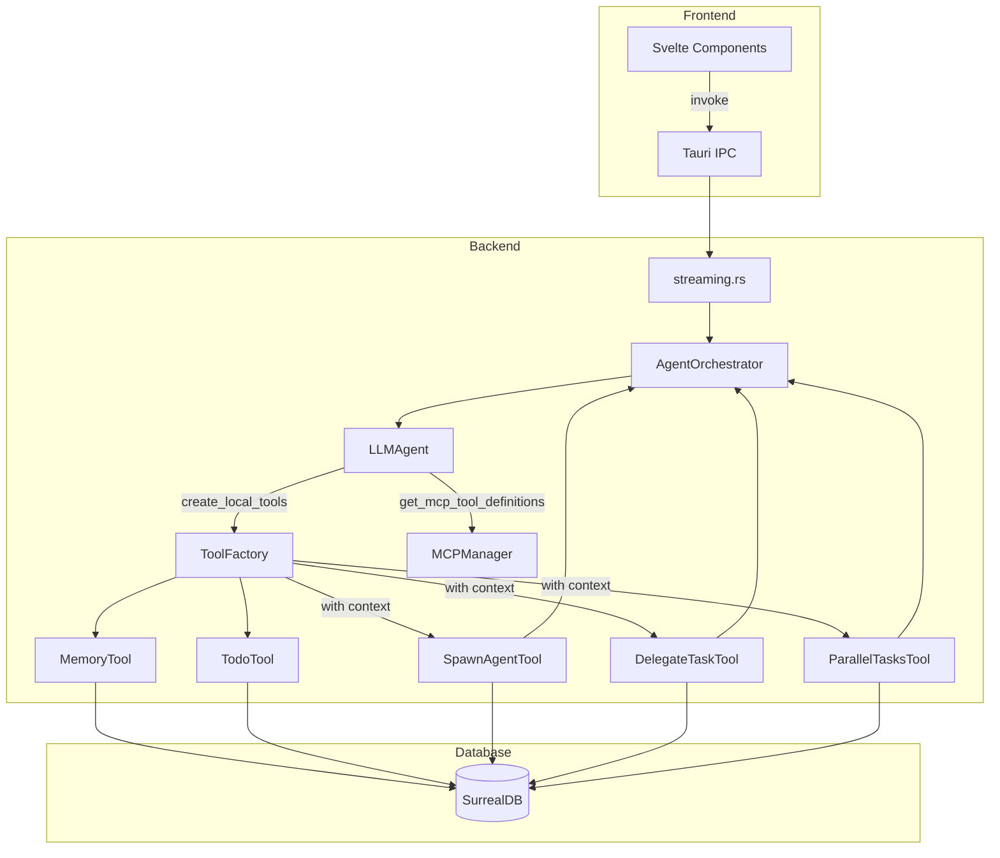
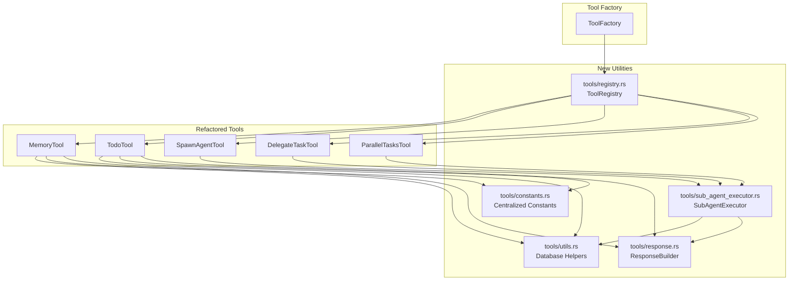

# Specification - Tools System Comprehensive Refactoring

## Metadata
- **Date**: 2025-12-03
- **Stack**: Svelte 5.43 + Rust 1.91 + Tauri 2.9 + SurrealDB 2.3
- **Complexity**: Complex (multi-phase refactoring)
- **Estimated Effort**: 32-42 hours (~5-7 days)

## Context

**Demande**: Refactoring du code existant pour simplifier et ameliorer l'efficacite des tools "memory, todotool, SpawnAgentTool, DelegateTaskTool, ParallelTasksTool", ainsi que l'injection des tools et MCP dans les workflows.

**Objectif**: Reduire la duplication de code, centraliser les patterns communs, ameliorer la maintenabilite et la testabilite du systeme de tools.

**Perimetre**:
- Inclus: MemoryTool, TodoTool, SpawnAgentTool, DelegateTaskTool, ParallelTasksTool, ToolFactory, tool injection, **MCP server identification refactoring**
- Exclus: MCP protocol implementation (JSON-RPC), frontend components

**Criteres Succes**:
- [ ] Reduction de code de 15%+ (cible: ~969 lignes sur 5,006)
- [ ] Tous les tests existants passent
- [ ] Aucune regression de performance (< 5%)
- [ ] Nouvelles utilities avec 90%+ couverture tests
- [ ] Documentation mise a jour (CLAUDE.md, Serena memory)
- [ ] **MCP servers identifies par NAME (pas ID) dans tout le systeme**
- [ ] **System prompt affiche uniquement les noms MCP (plus d'IDs)**

---

## Etat Actuel

### Inventaire des Tools

| Tool | Fichier | Lignes | Tests | Duplication Identifiee |
|------|---------|--------|-------|------------------------|
| **MemoryTool** | `tools/memory/tool.rs` | ~1,644 | ~450 | ~250 lignes |
| **TodoTool** | `tools/todo/tool.rs` | ~751 | ~80 | ~215 lignes |
| **SpawnAgentTool** | `tools/spawn_agent.rs` | ~990 | Oui | ~170 lignes |
| **DelegateTaskTool** | `tools/delegate_task.rs` | ~772 | Oui | ~167 lignes |
| **ParallelTasksTool** | `tools/parallel_tasks.rs` | ~849 | Oui | ~167 lignes |
| **Total** | | **~5,006** | | **~969 lignes** |

### Architecture Existante



### Patterns Dupliques Identifies

#### 1. Validation Pattern (Memory + Todo)
```rust
// Identique dans les deux tools (~56 lignes chacun)
fn validate_input(&self, input: &Value) -> ToolResult<()> {
    if !input.is_object() {
        return Err(ToolError::InvalidInput("Input must be an object".to_string()));
    }
    let operation = input["operation"].as_str()
        .ok_or_else(|| ToolError::InvalidInput("Missing operation field".to_string()))?;
    // ... match operation specific validation
}
```

#### 2. Database Existence Check (Tous les tools)
```rust
// Repete 6+ fois
let check_query = format!(
    "SELECT meta::id(id) AS id FROM {} WHERE meta::id(id) = '{}'",
    table, id
);
let existing: Vec<Value> = self.db.query(&check_query).await
    .map_err(|e| ToolError::DatabaseError(e.to_string()))?;
if existing.is_empty() {
    return Err(ToolError::NotFound(format!("...{id}...")));
}
```

#### 3. Permission Check (Sub-agent tools)
```rust
// Identique dans SpawnAgentTool, DelegateTaskTool, ParallelTasksTool
if !self.is_primary_agent {
    return Err(ToolError::PermissionDenied(
        "Only the primary workflow agent can [operation]. \
         Sub-agents cannot [operation]."
            .to_string(),
    ));
}
```

#### 4. Execution Record Lifecycle (Sub-agent tools)
```rust
// Creation: ~18 lignes identiques x3
let mut execution_create = SubAgentExecutionCreate::new(...);
execution_create.status = "running".to_string();
self.db.create("sub_agent_execution", &execution_id, execution_create).await?;

// Update: ~32 lignes identiques x3
let update_query = format!("UPDATE sub_agent_execution:`{}` SET ...", execution_id);
self.db.execute(&update_query).await?;
```

#### 5. Event Emission Helper (Sub-agent tools)
```rust
// Identique x3
fn emit_event(&self, event_name: &str, chunk: &StreamChunk) {
    if let Some(ref handle) = self.app_handle {
        if let Err(e) = handle.emit(event_name, chunk) {
            warn!("Failed to emit sub-agent event");
        }
    }
}
```

### Code Reutilisable

| Pattern | Location | Reutilisation |
|---------|----------|---------------|
| Tool trait | `tools/mod.rs:178-258` | Base pour tous les tools |
| ToolFactory | `tools/factory.rs` | Creation de tools |
| AgentToolContext | `tools/context.rs` | DI pour sub-agent tools |
| ValidationHelper | `tools/validation_helper.rs` | Human-in-the-loop |
| StreamChunk | `models/streaming.rs` | Event emission |

### Probleme: MCP Server ID vs Name

**Situation actuelle problematique:**

Le systeme utilise actuellement des **IDs techniques** pour identifier les serveurs MCP:

```rust
// MCPServerConfig a deux champs
pub struct MCPServerConfig {
    pub id: String,   // "mcp-1764345441545-7tj9p" (ID technique genere)
    pub name: String, // "Serena" (nom lisible)
}

// AgentConfig stocke des IDs
pub struct AgentConfig {
    pub mcp_servers: Vec<String>,  // ["mcp-1764345441545-7tj9p"]
}

// MCPManager indexe par ID
clients: HashMap<String, MCPClient>  // Key = ID
```

**Problemes identifies:**

1. **UX degradee**: L'agent voit des IDs cryptiques dans le system prompt
2. **Confusion**: Le parametre s'appelle `server_name` mais attend un ID
3. **Maintenance**: Les IDs peuvent changer si le serveur est reconfigure
4. **Lisibilite**: Les logs et erreurs contiennent des IDs incomprehensibles

**Etat actuel du system prompt (problematique):**
```
### Available MCP Servers for Delegation
- **Serena** (ID: `mcp-1764345441545-7tj9p`) [YOU HAVE DIRECT ACCESS]
  - Status: running | Tools: 15
```

**Etat cible (simplifie):**
```
### Available MCP Servers
- **Serena** [DIRECT ACCESS] - Code analysis - 15 tools
- **Context7** [DELEGATE] - Documentation lookup - 8 tools

To use: mcp_servers: ["Serena", "Context7"]
```

**Impact sur SpawnAgentTool:**

Actuellement:
```json
{
  "operation": "spawn",
  "name": "Analyzer",
  "mcp_servers": ["mcp-1764345441545-7tj9p"]  // ID cryptique!
}
```

Apres refactoring:
```json
{
  "operation": "spawn",
  "name": "Analyzer",
  "mcp_servers": ["Serena"]  // Nom lisible!
}
```

---

## Architecture Proposee

### Diagramme



### Nouveaux Modules

#### 1. `tools/utils.rs` (~150 lignes)

**Purpose**: Utilitaires partages pour operations DB et validation.

```rust
use crate::db::DBClient;
use crate::tools::{ToolError, ToolResult};
use std::sync::Arc;

/// Verifie qu'un record existe, retourne erreur NotFound sinon.
pub async fn ensure_record_exists(
    db: &Arc<DBClient>,
    table: &str,
    id: &str,
    resource_name: &str,
) -> ToolResult<()> {
    let check_query = format!(
        "SELECT meta::id(id) AS id FROM {} WHERE meta::id(id) = '{}'",
        table, id
    );
    let existing: Vec<serde_json::Value> = db.query(&check_query).await
        .map_err(|e| ToolError::DatabaseError(e.to_string()))?;

    if existing.is_empty() {
        return Err(ToolError::NotFound(format!(
            "{} '{}' does not exist",
            resource_name, id
        )));
    }
    Ok(())
}

/// Supprime un record avec verification d'existence.
pub async fn delete_with_check(
    db: &Arc<DBClient>,
    table: &str,
    id: &str,
    resource_name: &str,
) -> ToolResult<()> {
    ensure_record_exists(db, table, id, resource_name).await?;

    let delete_query = format!("DELETE {}:`{}`", table, id);
    db.execute(&delete_query).await
        .map_err(|e| ToolError::DatabaseError(e.to_string()))?;
    Ok(())
}

/// Convertit une erreur DB en ToolError.
pub fn db_error(e: impl std::fmt::Display) -> ToolError {
    ToolError::DatabaseError(e.to_string())
}

/// Valide qu'une string n'est pas vide.
pub fn validate_not_empty(value: &str, field_name: &str) -> ToolResult<()> {
    if value.is_empty() {
        return Err(ToolError::ValidationFailed(format!(
            "{} cannot be empty",
            field_name
        )));
    }
    Ok(())
}

/// Valide la longueur d'une string.
pub fn validate_length(value: &str, max: usize, field_name: &str) -> ToolResult<()> {
    if value.len() > max {
        return Err(ToolError::ValidationFailed(format!(
            "{} is {} chars, max is {}",
            field_name, value.len(), max
        )));
    }
    Ok(())
}

/// Valide qu'une valeur est dans une plage.
pub fn validate_range<T: PartialOrd + std::fmt::Display>(
    value: T,
    min: T,
    max: T,
    field_name: &str,
) -> ToolResult<()> {
    if value < min || value > max {
        return Err(ToolError::ValidationFailed(format!(
            "{} {} is invalid. Use {}-{}",
            field_name, value, min, max
        )));
    }
    Ok(())
}

/// Valide qu'une valeur est dans une liste.
pub fn validate_enum_value<'a>(
    value: &str,
    valid_values: &[&'a str],
    field_name: &str,
) -> ToolResult<()> {
    if !valid_values.contains(&value) {
        return Err(ToolError::ValidationFailed(format!(
            "Invalid {} '{}'. Valid values: {:?}",
            field_name, value, valid_values
        )));
    }
    Ok(())
}

/// Builder fluent pour queries SurrealDB.
pub struct QueryBuilder {
    table: String,
    fields: Vec<String>,
    conditions: Vec<String>,
    order_by: Option<(String, bool)>, // (field, is_desc)
    limit: Option<usize>,
}

impl QueryBuilder {
    pub fn new(table: &str) -> Self {
        Self {
            table: table.to_string(),
            fields: vec!["meta::id(id) AS id".to_string()],
            conditions: Vec::new(),
            order_by: None,
            limit: None,
        }
    }

    pub fn select(mut self, fields: &[&str]) -> Self {
        self.fields.extend(fields.iter().map(|f| f.to_string()));
        self
    }

    pub fn where_eq(mut self, field: &str, value: &str) -> Self {
        self.conditions.push(format!("{} = '{}'", field, value));
        self
    }

    pub fn where_clause(mut self, condition: &str) -> Self {
        self.conditions.push(condition.to_string());
        self
    }

    pub fn order_by(mut self, field: &str, desc: bool) -> Self {
        self.order_by = Some((field.to_string(), desc));
        self
    }

    pub fn limit(mut self, n: usize) -> Self {
        self.limit = Some(n);
        self
    }

    pub fn build(self) -> String {
        let mut query = format!(
            "SELECT {} FROM {}",
            self.fields.join(", "),
            self.table
        );

        if !self.conditions.is_empty() {
            query.push_str(" WHERE ");
            query.push_str(&self.conditions.join(" AND "));
        }

        if let Some((field, desc)) = self.order_by {
            query.push_str(&format!(
                " ORDER BY {} {}",
                field,
                if desc { "DESC" } else { "ASC" }
            ));
        }

        if let Some(n) = self.limit {
            query.push_str(&format!(" LIMIT {}", n));
        }

        query
    }
}
```

#### 2. `tools/constants.rs` (~50 lignes)

**Purpose**: Constantes centralisees pour validation.

```rust
//! Constantes centralisees pour les tools.

// ===== Memory Tool =====
pub mod memory {
    pub const MAX_CONTENT_LENGTH: usize = 50_000;
    pub const DEFAULT_LIMIT: usize = 10;
    pub const MAX_LIMIT: usize = 100;
    pub const DEFAULT_SIMILARITY_THRESHOLD: f64 = 0.7;
    pub const VALID_TYPES: &[&str] = &["user_pref", "context", "knowledge", "decision"];
}

// ===== Todo Tool =====
pub mod todo {
    pub const MAX_NAME_LENGTH: usize = 128;
    pub const MAX_DESCRIPTION_LENGTH: usize = 1000;
    pub const PRIORITY_MIN: u8 = 1;
    pub const PRIORITY_MAX: u8 = 5;
    pub const VALID_STATUSES: &[&str] = &["pending", "in_progress", "completed", "blocked"];
}

// ===== Sub-Agent Tools =====
pub mod sub_agent {
    // Note: MAX_SUB_AGENTS est deja dans models/sub_agent.rs
    pub use crate::models::sub_agent::MAX_SUB_AGENTS;
}
```

#### 3. `tools/response.rs` (~80 lignes)

**Purpose**: Builder type-safe pour reponses JSON.

```rust
use serde_json::{json, Map, Value};

/// Builder fluent pour construire des reponses JSON standardisees.
pub struct ResponseBuilder {
    data: Map<String, Value>,
}

impl ResponseBuilder {
    pub fn new() -> Self {
        Self {
            data: Map::new(),
        }
    }

    /// Ajoute le champ success.
    pub fn success(mut self, value: bool) -> Self {
        self.data.insert("success".to_string(), json!(value));
        self
    }

    /// Ajoute un message.
    pub fn message(mut self, msg: impl Into<String>) -> Self {
        self.data.insert("message".to_string(), json!(msg.into()));
        self
    }

    /// Ajoute un ID avec cle personnalisee (e.g., "memory_id", "task_id").
    pub fn id(mut self, key: &str, id: impl Into<String>) -> Self {
        self.data.insert(key.to_string(), json!(id.into()));
        self
    }

    /// Ajoute un champ custom.
    pub fn field(mut self, key: &str, value: impl Into<Value>) -> Self {
        self.data.insert(key.to_string(), value.into());
        self
    }

    /// Ajoute des metriques.
    pub fn metrics(mut self, duration_ms: u64, tokens_in: u64, tokens_out: u64) -> Self {
        self.data.insert("metrics".to_string(), json!({
            "duration_ms": duration_ms,
            "tokens_input": tokens_in,
            "tokens_output": tokens_out
        }));
        self
    }

    /// Ajoute un compte.
    pub fn count(mut self, n: usize) -> Self {
        self.data.insert("count".to_string(), json!(n));
        self
    }

    /// Ajoute des donnees.
    pub fn data(mut self, key: &str, value: impl serde::Serialize) -> Self {
        if let Ok(v) = serde_json::to_value(value) {
            self.data.insert(key.to_string(), v);
        }
        self
    }

    /// Construit la Value finale.
    pub fn build(self) -> Value {
        Value::Object(self.data)
    }
}

impl Default for ResponseBuilder {
    fn default() -> Self {
        Self::new()
    }
}

// Helper pour reponses communes
impl ResponseBuilder {
    /// Reponse de succes standard.
    pub fn ok(id_key: &str, id: impl Into<String>, msg: impl Into<String>) -> Value {
        Self::new()
            .success(true)
            .id(id_key, id)
            .message(msg)
            .build()
    }

    /// Reponse de liste standard.
    pub fn list<T: serde::Serialize>(items: T, count: usize) -> Value {
        Self::new()
            .success(true)
            .count(count)
            .data("items", items)
            .build()
    }
}
```

#### 4. `tools/registry.rs` (~200 lignes)

**Purpose**: Registry type-safe pour decouverte et validation des tools.

```rust
use std::collections::HashMap;
use std::sync::Arc;

use crate::db::DBClient;
use crate::llm::EmbeddingService;
use crate::tools::{Tool, ToolError};
use crate::tools::context::AgentToolContext;
use crate::tools::memory::MemoryTool;
use crate::tools::todo::TodoTool;
use crate::tools::spawn_agent::SpawnAgentTool;
use crate::tools::delegate_task::DelegateTaskTool;
use crate::tools::parallel_tasks::ParallelTasksTool;

/// Categories de tools.
#[derive(Debug, Clone, Copy, PartialEq, Eq)]
pub enum ToolCategory {
    Basic,
    SubAgent,
}

/// Metadata d'un tool enregistre.
#[derive(Debug, Clone)]
pub struct ToolMetadata {
    pub name: &'static str,
    pub category: ToolCategory,
    pub requires_context: bool,
}

/// Registry centralise pour tous les tools disponibles.
pub struct ToolRegistry {
    tools: HashMap<&'static str, ToolMetadata>,
}

impl ToolRegistry {
    /// Cree un nouveau registry avec tous les tools enregistres.
    pub fn new() -> Self {
        let mut tools = HashMap::new();

        // Basic tools
        tools.insert("MemoryTool", ToolMetadata {
            name: "MemoryTool",
            category: ToolCategory::Basic,
            requires_context: false,
        });
        tools.insert("TodoTool", ToolMetadata {
            name: "TodoTool",
            category: ToolCategory::Basic,
            requires_context: false,
        });

        // Sub-agent tools
        tools.insert("SpawnAgentTool", ToolMetadata {
            name: "SpawnAgentTool",
            category: ToolCategory::SubAgent,
            requires_context: true,
        });
        tools.insert("DelegateTaskTool", ToolMetadata {
            name: "DelegateTaskTool",
            category: ToolCategory::SubAgent,
            requires_context: true,
        });
        tools.insert("ParallelTasksTool", ToolMetadata {
            name: "ParallelTasksTool",
            category: ToolCategory::SubAgent,
            requires_context: true,
        });

        Self { tools }
    }

    /// Verifie si un tool existe.
    pub fn has_tool(&self, name: &str) -> bool {
        self.tools.contains_key(name)
    }

    /// Retourne les metadata d'un tool.
    pub fn get(&self, name: &str) -> Option<&ToolMetadata> {
        self.tools.get(name)
    }

    /// Verifie si un tool necessite AgentToolContext.
    pub fn requires_context(&self, name: &str) -> bool {
        self.tools.get(name).map(|m| m.requires_context).unwrap_or(false)
    }

    /// Retourne tous les noms de tools.
    pub fn available_tools(&self) -> Vec<&'static str> {
        self.tools.keys().copied().collect()
    }

    /// Retourne les basic tools (sans context).
    pub fn basic_tools(&self) -> Vec<&'static str> {
        self.tools
            .iter()
            .filter(|(_, m)| m.category == ToolCategory::Basic)
            .map(|(name, _)| *name)
            .collect()
    }

    /// Retourne les sub-agent tools (avec context).
    pub fn sub_agent_tools(&self) -> Vec<&'static str> {
        self.tools
            .iter()
            .filter(|(_, m)| m.category == ToolCategory::SubAgent)
            .map(|(name, _)| *name)
            .collect()
    }

    /// Valide un nom de tool, retourne erreur si inconnu.
    pub fn validate(&self, name: &str) -> Result<&ToolMetadata, String> {
        self.tools.get(name).ok_or_else(|| {
            format!(
                "Unknown tool: '{}'. Available tools: {:?}",
                name,
                self.available_tools()
            )
        })
    }
}

impl Default for ToolRegistry {
    fn default() -> Self {
        Self::new()
    }
}

// Singleton global
lazy_static::lazy_static! {
    pub static ref TOOL_REGISTRY: ToolRegistry = ToolRegistry::new();
}
```

#### 5. `tools/sub_agent_executor.rs` (~400 lignes)

**Purpose**: Logique d'execution commune pour les sub-agent tools.

```rust
use std::sync::Arc;
use std::time::Instant;

use serde_json::Value;
use tracing::{debug, error, info, warn};
use uuid::Uuid;

use crate::agents::core::orchestrator::AgentOrchestrator;
use crate::agents::core::agent::Task;
use crate::db::DBClient;
use crate::mcp::manager::MCPManager;
use crate::models::streaming::{events, StreamChunk, SubAgentStreamMetrics};
use crate::models::sub_agent::{
    SubAgentExecutionCreate, SubAgentExecutionComplete, SubAgentMetrics,
    SubAgentOperationType, MAX_SUB_AGENTS,
};
use crate::tools::{ToolError, ToolResult};
use crate::tools::validation_helper::ValidationHelper;
use crate::tools::response::ResponseBuilder;

/// Resultat d'execution avec metriques.
pub struct ExecutionResult {
    pub success: bool,
    pub report: String,
    pub metrics: SubAgentMetrics,
    pub error_message: Option<String>,
}

impl Default for ExecutionResult {
    fn default() -> Self {
        Self {
            success: false,
            report: String::new(),
            metrics: SubAgentMetrics::default(),
            error_message: None,
        }
    }
}

/// Executeur commun pour les operations sub-agent.
pub struct SubAgentExecutor {
    db: Arc<DBClient>,
    orchestrator: Arc<AgentOrchestrator>,
    mcp_manager: Option<Arc<MCPManager>>,
    app_handle: Option<tauri::AppHandle>,
    workflow_id: String,
    parent_agent_id: String,
}

impl SubAgentExecutor {
    /// Cree un nouvel executeur.
    pub fn new(
        db: Arc<DBClient>,
        orchestrator: Arc<AgentOrchestrator>,
        mcp_manager: Option<Arc<MCPManager>>,
        app_handle: Option<tauri::AppHandle>,
        workflow_id: String,
        parent_agent_id: String,
    ) -> Self {
        Self {
            db,
            orchestrator,
            mcp_manager,
            app_handle,
            workflow_id,
            parent_agent_id,
        }
    }

    /// Verifie que l'appelant est l'agent principal.
    pub fn check_primary_permission(
        &self,
        is_primary: bool,
        operation: &str,
    ) -> ToolResult<()> {
        if !is_primary {
            return Err(ToolError::PermissionDenied(format!(
                "Only the primary workflow agent can {}. \
                 Sub-agents cannot use this operation.",
                operation
            )));
        }
        Ok(())
    }

    /// Verifie la limite de sub-agents.
    pub fn check_limit(
        &self,
        current_count: usize,
        operation: &str,
    ) -> ToolResult<()> {
        if current_count >= MAX_SUB_AGENTS {
            return Err(ToolError::ValidationFailed(format!(
                "Maximum {} sub-agent operations reached for {}. \
                 Current: {}. Complete existing operations first.",
                MAX_SUB_AGENTS, operation, current_count
            )));
        }
        Ok(())
    }

    /// Demande validation human-in-the-loop.
    pub async fn request_validation(
        &self,
        operation_type: SubAgentOperationType,
        description: &str,
        details: Value,
    ) -> ToolResult<()> {
        let validation_helper = ValidationHelper::new(
            self.db.clone(),
            self.app_handle.clone(),
        );
        let risk_level = ValidationHelper::determine_risk_level(&operation_type);

        validation_helper
            .request_validation(
                &self.workflow_id,
                operation_type,
                description,
                details,
                risk_level,
            )
            .await
    }

    /// Cree un record d'execution dans la DB.
    pub async fn create_execution_record(
        &self,
        child_agent_id: &str,
        child_agent_name: &str,
        prompt: &str,
    ) -> ToolResult<String> {
        let execution_id = Uuid::new_v4().to_string();

        let mut execution_create = SubAgentExecutionCreate::new(
            self.workflow_id.clone(),
            self.parent_agent_id.clone(),
            child_agent_id.to_string(),
            child_agent_name.to_string(),
            prompt.to_string(),
        );
        execution_create.status = "running".to_string();

        self.db
            .create("sub_agent_execution", &execution_id, execution_create)
            .await
            .map_err(|e| {
                ToolError::DatabaseError(format!(
                    "Failed to create execution record: {}",
                    e
                ))
            })?;

        debug!(
            execution_id = %execution_id,
            child_agent_id = %child_agent_id,
            "Created sub-agent execution record"
        );

        Ok(execution_id)
    }

    /// Execute un agent et collecte les metriques.
    pub async fn execute_with_metrics(
        &self,
        agent_id: &str,
        task: Task,
    ) -> ExecutionResult {
        let start_time = Instant::now();

        let result = self
            .orchestrator
            .execute_with_mcp(agent_id, task, self.mcp_manager.clone())
            .await;

        let duration_ms = start_time.elapsed().as_millis() as u64;

        match result {
            Ok(report) => {
                info!(
                    agent_id = %agent_id,
                    duration_ms = duration_ms,
                    "Sub-agent execution completed successfully"
                );
                ExecutionResult {
                    success: true,
                    report: report.content,
                    metrics: SubAgentMetrics {
                        duration_ms,
                        tokens_input: report.metrics.tokens_input as u64,
                        tokens_output: report.metrics.tokens_output as u64,
                    },
                    error_message: None,
                }
            }
            Err(e) => {
                let error_msg = e.to_string();
                error!(
                    agent_id = %agent_id,
                    duration_ms = duration_ms,
                    error = %error_msg,
                    "Sub-agent execution failed"
                );
                ExecutionResult {
                    success: false,
                    report: format!(
                        "# Sub-Agent Error\n\nExecution failed: {}",
                        error_msg
                    ),
                    metrics: SubAgentMetrics {
                        duration_ms,
                        tokens_input: 0,
                        tokens_output: 0,
                    },
                    error_message: Some(error_msg),
                }
            }
        }
    }

    /// Met a jour le record d'execution avec le resultat.
    pub async fn update_execution_record(
        &self,
        execution_id: &str,
        result: &ExecutionResult,
    ) {
        let status = if result.success { "completed" } else { "failed" };
        let result_summary = if result.report.len() > 200 {
            format!("{}...", &result.report[..200])
        } else {
            result.report.clone()
        };

        let result_summary_json = serde_json::to_string(&result_summary)
            .unwrap_or_else(|_| "null".to_string());
        let error_message_json = result
            .error_message
            .as_ref()
            .map(|s| serde_json::to_string(s).unwrap_or_else(|_| "null".to_string()))
            .unwrap_or_else(|| "null".to_string());

        let update_query = format!(
            "UPDATE sub_agent_execution:`{}` SET \
             status = '{}', \
             duration_ms = {}, \
             tokens_input = {}, \
             tokens_output = {}, \
             result_summary = {}, \
             error_message = {}, \
             completed_at = time::now()",
            execution_id,
            status,
            result.metrics.duration_ms,
            result.metrics.tokens_input,
            result.metrics.tokens_output,
            result_summary_json,
            error_message_json,
        );

        if let Err(e) = self.db.execute(&update_query).await {
            warn!(
                execution_id = %execution_id,
                error = %e,
                "Failed to update execution record"
            );
        }
    }

    /// Emet un evenement de streaming.
    pub fn emit_event(&self, event_name: &str, chunk: &StreamChunk) {
        if let Some(ref handle) = self.app_handle {
            if let Err(e) = handle.emit(event_name, chunk) {
                warn!(
                    event = %event_name,
                    error = %e,
                    "Failed to emit sub-agent event"
                );
            }
        }
    }

    /// Emet l'evenement de debut d'execution.
    pub fn emit_start_event(
        &self,
        agent_id: &str,
        agent_name: &str,
        prompt: &str,
    ) {
        let chunk = StreamChunk::sub_agent_start(
            self.workflow_id.clone(),
            agent_id.to_string(),
            agent_name.to_string(),
            self.parent_agent_id.clone(),
            prompt.to_string(),
        );
        self.emit_event(events::WORKFLOW_STREAM, &chunk);
    }

    /// Emet l'evenement de fin d'execution.
    pub fn emit_complete_event(
        &self,
        agent_id: &str,
        agent_name: &str,
        result: &ExecutionResult,
    ) {
        if result.success {
            let chunk = StreamChunk::sub_agent_complete(
                self.workflow_id.clone(),
                agent_id.to_string(),
                agent_name.to_string(),
                self.parent_agent_id.clone(),
                result.report.clone(),
                SubAgentStreamMetrics {
                    duration_ms: result.metrics.duration_ms,
                    tokens_input: result.metrics.tokens_input,
                    tokens_output: result.metrics.tokens_output,
                },
            );
            self.emit_event(events::WORKFLOW_STREAM, &chunk);
        } else {
            let chunk = StreamChunk::sub_agent_error(
                self.workflow_id.clone(),
                agent_id.to_string(),
                agent_name.to_string(),
                self.parent_agent_id.clone(),
                result.error_message.clone().unwrap_or_default(),
                result.metrics.duration_ms,
            );
            self.emit_event(events::WORKFLOW_STREAM, &chunk);
        }
    }

    /// Genere un ID unique pour sub-agent.
    pub fn generate_sub_agent_id() -> String {
        format!("sub_{}", Uuid::new_v4())
    }
}
```

---

## Types Synchronises

### Rust (Backend)

**Existants** (pas de changement):
- `Tool` trait (`tools/mod.rs`)
- `ToolDefinition` struct (`tools/mod.rs`)
- `ToolError` enum (`tools/mod.rs`)
- `ToolResult<T>` type alias (`tools/mod.rs`)

**Nouveaux**:
```rust
// tools/registry.rs
pub enum ToolCategory { Basic, SubAgent }
pub struct ToolMetadata { name, category, requires_context }

// tools/sub_agent_executor.rs
pub struct ExecutionResult { success, report, metrics, error_message }
pub struct SubAgentExecutor { ... }
```

### TypeScript (Frontend)

**A mettre a jour** (`src/types/agent.ts`):
```typescript
// Ligne 132 - AVANT
export const AVAILABLE_TOOLS = ['MemoryTool', 'TodoTool'] as const;

// APRES
export const AVAILABLE_TOOLS = [
  'MemoryTool',
  'TodoTool',
  'SpawnAgentTool',
  'DelegateTaskTool',
  'ParallelTasksTool',
] as const;

export const BASIC_TOOLS = ['MemoryTool', 'TodoTool'] as const;
export const SUB_AGENT_TOOLS = ['SpawnAgentTool', 'DelegateTaskTool', 'ParallelTasksTool'] as const;
```

**Optionnel** (`src/types/tool.ts`):
```typescript
// Nouveau type pour ToolDefinition (inspection UI)
export interface ToolDefinition {
  id: string;
  name: string;
  description: string;
  input_schema: Record<string, unknown>;
  output_schema: Record<string, unknown>;
  requires_confirmation: boolean;
}

// Type pour ToolError
export type ToolErrorType =
  | 'invalid_input'
  | 'execution_failed'
  | 'not_found'
  | 'permission_denied'
  | 'timeout'
  | 'database_error'
  | 'validation_failed'
  | 'dependency_error';
```

---

## Plan d'Implementation

### Phase A: Foundation (4-5 heures)

**Objectif**: Creer les utilities de base.

**Taches**:

1. **Backend**: Creer `src-tauri/src/tools/utils.rs`
   - Implementer `ensure_record_exists()`
   - Implementer `delete_with_check()`
   - Implementer `db_error()`, validation helpers
   - Implementer `QueryBuilder`
   - Tests unitaires

2. **Backend**: Creer `src-tauri/src/tools/constants.rs`
   - Deplacer constantes de MemoryTool
   - Deplacer constantes de TodoTool
   - Documenter chaque constante

3. **Backend**: Creer `src-tauri/src/tools/response.rs`
   - Implementer `ResponseBuilder`
   - Tests unitaires

4. **Backend**: Modifier `src-tauri/src/tools/mod.rs`
   - Ajouter `pub mod utils;`
   - Ajouter `pub mod constants;`
   - Ajouter `pub mod response;`

**Validation**:
- [ ] `cargo test --lib tools::utils`
- [ ] `cargo test --lib tools::response`
- [ ] `cargo clippy -- -D warnings`

### Phase B: Tool Registry (4-5 heures)

**Objectif**: Centraliser la decouverte et validation des tools.

**Taches**:

1. **Backend**: Creer `src-tauri/src/tools/registry.rs`
   - Implementer `ToolRegistry`
   - Implementer `ToolMetadata`
   - Singleton via `lazy_static`

2. **Backend**: Refactorer `src-tauri/src/tools/factory.rs`
   - Utiliser `TOOL_REGISTRY.validate()` au lieu de match exhaustif
   - Deleguer `available_tools()` au registry
   - Maintenir API publique identique

3. **Tests**: Tests d'integration factory + registry

**Validation**:
- [ ] Tests ToolFactory existants passent
- [ ] `TOOL_REGISTRY.has_tool("MemoryTool")` == true
- [ ] `TOOL_REGISTRY.has_tool("UnknownTool")` == false

### Phase C: SubAgentExecutor (8-10 heures)

**Objectif**: Extraire et centraliser la logique d'execution sub-agent.

**Taches**:

1. **Backend**: Creer `src-tauri/src/tools/sub_agent_executor.rs`
   - Implementer toutes les methodes

2. **Backend**: Refactorer `src-tauri/src/tools/spawn_agent.rs`
   - Ajouter champ `executor: SubAgentExecutor` dans struct
   - Remplacer code duplique par appels executor
   - Garder logique specifique (creation agent, registry)

3. **Backend**: Refactorer `src-tauri/src/tools/delegate_task.rs`
   - Meme pattern que SpawnAgentTool

4. **Backend**: Refactorer `src-tauri/src/tools/parallel_tasks.rs`
   - Adapter pour execution batch avec `join_all`

5. **Tests**: Verifier tous les tests sub-agent passent

**Validation**:
- [ ] Tests SpawnAgentTool passent
- [ ] Tests DelegateTaskTool passent
- [ ] Tests ParallelTasksTool passent
- [ ] Events streaming emis correctement

### Phase D: Basic Tool Cleanup (6-8 heures)

**Objectif**: Appliquer les utilities aux tools de base.

**Taches**:

1. **Backend**: Refactorer `src-tauri/src/tools/memory/tool.rs`
   - Utiliser `utils::ensure_record_exists()`
   - Utiliser `utils::delete_with_check()`
   - Utiliser `utils::validate_*()` helpers
   - Utiliser `constants::memory::*`
   - Utiliser `ResponseBuilder`

2. **Backend**: Refactorer `src-tauri/src/tools/todo/tool.rs`
   - Meme pattern que MemoryTool

3. **Frontend**: Mettre a jour `src/types/agent.ts`
   - Corriger `AVAILABLE_TOOLS`
   - Ajouter `BASIC_TOOLS` et `SUB_AGENT_TOOLS`

**Validation**:
- [ ] Tests MemoryTool passent (450 tests)
- [ ] Tests TodoTool passent
- [ ] `cargo clippy` clean
- [ ] `npm run check` clean

### Phase E: Documentation & Testing (2-4 heures)

**Objectif**: Documenter les nouveaux patterns.

**Taches**:

1. **Documentation**: Mettre a jour CLAUDE.md
   - Section "Tool Development Patterns"
   - Exemples d'utilisation utils, ResponseBuilder
   - Pattern SubAgentExecutor

2. **Serena Memory**: Creer memory `tools_refactoring_complete`

3. **Tests**: Benchmark performance
   - Mesurer latence operations DB
   - Comparer avant/apres

4. **Cleanup**: Supprimer code mort

**Validation**:
- [ ] Tous tests passent
- [ ] Performance < 5% regression
- [ ] Documentation complete

### Phase F: MCP Server Name Refactoring (8-10 heures)

**Objectif**: Remplacer l'utilisation des IDs MCP par les noms dans tout le systeme.

**Justification**:
- Les IDs techniques (ex: `mcp-1764345441545-7tj9p`) sont cryptiques et confus pour l'agent LLM
- Les noms (ex: `Serena`, `Context7`) sont lisibles et intuitifs
- Simplifie l'UX pour les utilisateurs configurant les agents
- Reduit les erreurs de configuration

**Taches**:

1. **Backend**: Modifier `src-tauri/src/mcp/manager.rs`
   - Changer HashMap key de `id` vers `name`
   - `spawn_server_internal()`: `clients.insert(config.name.clone(), client)`
   - `call_tool()`: Lookup par name
   - `list_server_tools()`: Parametre `server_name` (vraiment le nom maintenant)
   - Ajouter validation unicite des noms
   - Ajouter `get_server_by_name()` helper

2. **Backend**: Modifier `src-tauri/src/models/mcp.rs`
   - `MCPServerConfig`: Garder `id` pour DB, mais `name` devient la cle fonctionnelle
   - Ajouter contrainte: `name` doit etre unique (validation)
   - Documentation: Clarifier que `name` est l'identifiant utilisateur

3. **Backend**: Modifier `src-tauri/src/agents/llm_agent.rs`
   - `get_mcp_tool_definitions()`: Utiliser `name` au lieu de `id`
   - `get_mcp_server_summaries()`: Retirer `id` du summary, garder `name`
   - `build_system_prompt_with_tools()`: Simplifier format affichage
   - Nouveau format system prompt:
     ```
     ### Available MCP Servers
     - **Serena** [DIRECT ACCESS] - Code analysis - 15 tools
     - **Context7** [DELEGATE] - Documentation - 8 tools

     Use with: mcp_servers: ["Serena"]
     ```

4. **Backend**: Modifier `src-tauri/src/tools/spawn_agent.rs`
   - `spawn()`: Valider que `mcp_servers` contient des noms valides
   - Ajouter validation: verifier que les noms existent dans MCPManager
   - Message d'erreur clair si nom invalide

5. **Backend**: Modifier `src-tauri/src/tools/delegate_task.rs`
   - Meme pattern que SpawnAgentTool

6. **Backend**: Modifier `src-tauri/src/tools/parallel_tasks.rs`
   - Meme pattern que SpawnAgentTool

7. **Backend**: Modifier `src-tauri/src/models/agent.rs`
   - Documenter que `mcp_servers: Vec<String>` contient des **noms**
   - Ajouter commentaire de documentation

8. **Frontend**: Modifier `src/types/agent.ts`
   - Mettre a jour documentation du type
   - `mcp_servers: string[]` // Server names (not IDs)

9. **Database**: Migration SurrealDB (si necessaire)
   - Verifier que les agents existants sont mis a jour
   - Script de migration: convertir IDs en noms si des agents existent

**Code Changes - MCPManager:**

```rust
// AVANT
clients: RwLock<HashMap<String, MCPClient>>  // Key = ID

async fn spawn_server_internal(&self, config: MCPServerConfig) -> MCPResult<MCPServer> {
    let id = config.id.clone();
    // ...
    clients.insert(id.clone(), client);  // Insert by ID
}

pub async fn call_tool(&self, server_name: &str, ...) {
    // Note: server_name is actually server ID (confusing!)
    let client = clients.get_mut(server_name)?;
}

// APRES
clients: RwLock<HashMap<String, MCPClient>>  // Key = NAME

async fn spawn_server_internal(&self, config: MCPServerConfig) -> MCPResult<MCPServer> {
    let name = config.name.clone();

    // Validate name uniqueness
    {
        let clients = self.clients.read().await;
        if clients.contains_key(&name) {
            return Err(MCPError::ServerAlreadyExists { server: name });
        }
    }
    // ...
    clients.insert(name.clone(), client);  // Insert by NAME
}

pub async fn call_tool(&self, server_name: &str, ...) {
    // server_name is now truly the server name!
    let client = clients.get_mut(server_name)?;
}
```

**Code Changes - LLMAgent System Prompt:**

```rust
// AVANT
fn build_system_prompt_with_tools(...) {
    // ...
    config_section.push_str(&format!(
        "\n- **{}** (ID: `{}`){}\n  - Description: {}\n  - Status: {} | Tools: {}\n",
        server.name,
        server.id,        // Affiche l'ID cryptique
        access_note,
        server.description,
        server.status,
        server.tools_count
    ));
}

// APRES
fn build_system_prompt_with_tools(...) {
    // ...
    let access_marker = if has_direct_access { "[DIRECT]" } else { "[DELEGATE]" };
    config_section.push_str(&format!(
        "\n- **{}** {} - {} - {} tools\n",
        server.name,       // Seulement le nom
        access_marker,
        server.description.unwrap_or("No description"),
        server.tools_count
    ));

    // Ajouter exemple d'utilisation
    config_section.push_str("\nTo assign MCP servers to sub-agents:\n");
    config_section.push_str("```json\n{\"mcp_servers\": [\"Serena\", \"Context7\"]}\n```\n");
}
```

**Code Changes - MCPServerSummary:**

```rust
// AVANT
struct MCPServerSummary {
    id: String,           // ID technique
    name: String,         // Nom d'affichage
    description: Option<String>,
    status: String,
    tools_count: usize,
}

// APRES
struct MCPServerSummary {
    name: String,         // Nom = identifiant unique
    description: Option<String>,
    status: String,
    tools_count: usize,
    has_direct_access: bool,  // Nouveau: indique si l'agent a acces direct
}
```

**Validation**:
- [ ] `MCPManager` indexe par name
- [ ] `call_tool()` fonctionne avec name
- [ ] System prompt n'affiche plus d'IDs
- [ ] SpawnAgentTool accepte des noms
- [ ] Agents existants migres (si applicable)
- [ ] Tests MCP passent
- [ ] Tests sub-agent tools passent

**Risques specifiques Phase F**:

| Risque | Probabilite | Impact | Mitigation |
|--------|-------------|--------|------------|
| Noms en double | Moyenne | Critique | Validation unicite a la creation |
| Migration donnees | Faible | Moyen | Script de migration + backup |
| Breaking change API | Moyenne | Moyen | Versioning ou migration transparente |

---

## Estimation

| Phase | Frontend | Backend | Tests | Total |
|-------|----------|---------|-------|-------|
| A - Foundation | 0h | 3h | 1.5h | 4.5h |
| B - Registry | 0h | 3h | 1.5h | 4.5h |
| C - SubAgentExecutor | 0h | 6h | 3h | 9h |
| D - Cleanup | 1h | 5h | 2h | 8h |
| E - Docs | 1h | 1h | 2h | 4h |
| **F - MCP Names** | **1h** | **6h** | **2h** | **9h** |
| **Total** | **3h** | **24h** | **12h** | **39h** |

**Facteurs**:
- Reutilisation patterns existants: -10%
- Tests existants (coverage): -5%
- Complexite sub-agent tools: +15%
- MCP refactoring transversal: +10%

**Estimation finale**: 32-42 heures (~5-7 jours)

---

## Analyse Risques

| Risque | Probabilite | Impact | Mitigation | Plan B |
|--------|-------------|--------|------------|--------|
| **Breaking changes API** | Faible | Critique | API publique inchangee | Rollback |
| **Test regression** | Moyenne | Moyen | Run tests apres chaque phase | Fix incrementiel |
| **Performance regression** | Faible | Moyen | Benchmark critique paths | Inline hot paths |
| **Over-abstraction** | Moyenne | Faible | Suivre "3 strikes" rule | Simplifier |
| **Merge conflicts** | Faible | Faible | Feature branch isolee | Rebase |
| **MCP noms en double** | Moyenne | Critique | Validation unicite obligatoire | Garder ID comme fallback |
| **Migration agents existants** | Faible | Moyen | Script migration automatique | Migration manuelle |

---

## Tests

### Backend (Rust)

**Existants a verifier**:
- `tools::memory::tests` (~450 lignes)
- `tools::todo::tests` (~80 lignes)
- `tools::spawn_agent::tests`
- `tools::delegate_task::tests`
- `tools::parallel_tasks::tests`
- `tools::factory::tests`

**Nouveaux a creer**:
```rust
// tools/utils.rs
#[cfg(test)]
mod tests {
    #[tokio::test]
    async fn test_ensure_record_exists_found() { ... }

    #[tokio::test]
    async fn test_ensure_record_exists_not_found() { ... }

    #[test]
    fn test_validate_not_empty() { ... }

    #[test]
    fn test_query_builder() { ... }
}

// tools/response.rs
#[cfg(test)]
mod tests {
    #[test]
    fn test_response_builder_success() { ... }

    #[test]
    fn test_response_builder_list() { ... }
}

// tools/registry.rs
#[cfg(test)]
mod tests {
    #[test]
    fn test_registry_has_all_tools() { ... }

    #[test]
    fn test_registry_categories() { ... }
}
```

### Frontend (Vitest)

```typescript
// src/types/__tests__/agent.test.ts
describe('Tool constants', () => {
  test('AVAILABLE_TOOLS contains all tools', () => {
    expect(AVAILABLE_TOOLS).toContain('MemoryTool');
    expect(AVAILABLE_TOOLS).toContain('SpawnAgentTool');
  });

  test('SUB_AGENT_TOOLS subset of AVAILABLE_TOOLS', () => {
    SUB_AGENT_TOOLS.forEach(tool => {
      expect(AVAILABLE_TOOLS).toContain(tool);
    });
  });
});
```

---

## Considerations

### Performance

- **ResponseBuilder**: Zero-cost abstraction (inline)
- **QueryBuilder**: String allocations minimales
- **SubAgentExecutor**: Pass by reference, avoid cloning
- **utils functions**: `#[inline]` pour hot paths

### Securite

- Validation inputs inchangee (backend-side)
- Pas de nouvelle surface d'attaque
- Permission checks centralises (plus facile a auditer)

### Tauri Specifique

- `State<T>` injection inchangee
- `AppHandle` passe via executor
- Event emission pattern conserve

### SurrealDB

- Patterns `meta::id()` conserves
- `execute()` pour mutations (pas de deserialisation)
- JSON encoding pour strings avec caracteres speciaux

---

## Dependances

### Backend (Cargo.toml)

**Existantes suffisantes**:
- `lazy_static` pour singleton registry (deja present via tauri)
- `uuid` pour ID generation (deja present)
- `serde_json` pour ResponseBuilder (deja present)

**Aucune nouvelle dependance requise.**

### Frontend (package.json)

**Aucune nouvelle dependance requise.**

---

## Prochaines Etapes

### Validation

- [ ] Architecture approuvee
- [ ] Dependances validees (aucune nouvelle)
- [ ] Questions resolues

### Implementation

1. Commencer Phase A (Foundation)
2. Checkpoint apres chaque phase
3. Tests continus (`cargo test`, `npm run check`)
4. Review code avant merge

### Questions Ouvertes

1. **QueryBuilder**: Utiliser ou rester avec format! strings manuels?
   - Recommandation: Utiliser pour queries complexes, format! pour simples

2. **ResponseBuilder**: Macro ou struct builder?
   - Recommandation: Struct builder (plus explicite, debug-friendly)

3. **Registry singleton**: `lazy_static` ou `OnceCell`?
   - Recommandation: `lazy_static` (pattern etabli dans le projet)

---

## References

- Architecture: `docs/TECH_STACK.md`
- Patterns Tauri: [State Management](https://v2.tauri.app/develop/state-management/)
- Patterns Rust: [Command Pattern](https://rust-unofficial.github.io/patterns/patterns/behavioural/command.html)
- Patterns DI: [Type-Driven API Design](https://willcrichton.net/rust-api-type-patterns/registries.html)
- Svelte 5 Runes: [Global State](https://mainmatter.com/blog/2025/03/11/global-state-in-svelte-5/)
- Code analyse: Discovery agents (Memory, Todo, Sub-agent tools)
- Memory Serena: `tools_architecture_analysis`, `sub_agent_system_summary`
