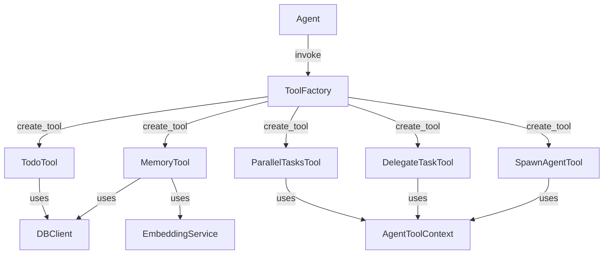
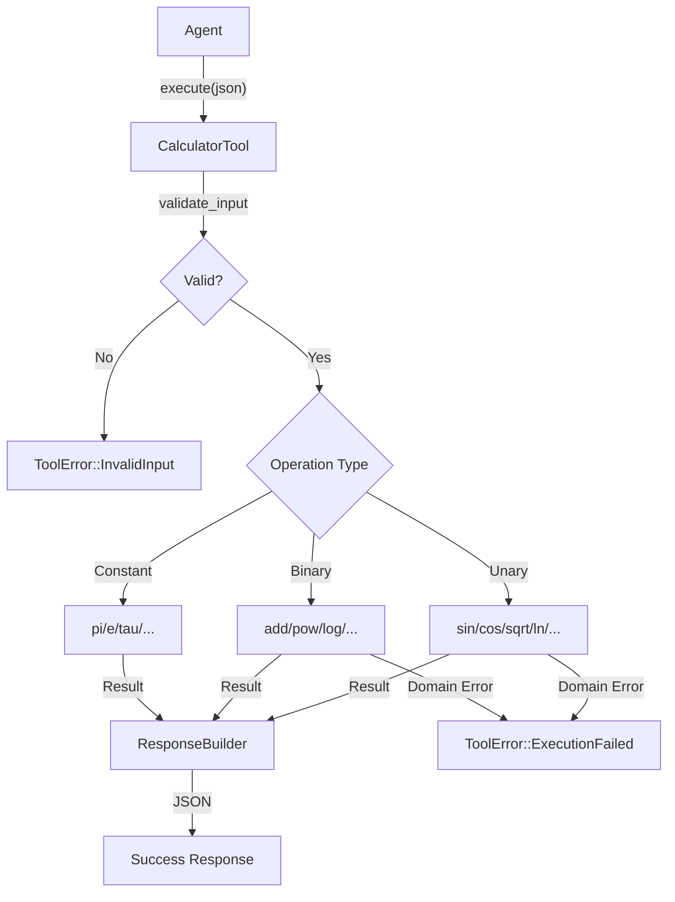

# Specification - CalculatorTool (Scientific Calculator)

## Metadata

- **Date**: 2025-12-04
- **Stack**: Svelte 5.43 + Rust 1.91 + Tauri 2.9 + SurrealDB 2.3
- **Complexity**: Simple
- **Category**: Basic Tool (no AgentToolContext required)

## Context

**Demande**: Planifier la creation d'un tool calculatrice scientifique. Le tool doit respecter le code et patterns existants (format JSON). Le tool calculatrice doit permettre aux agents de faire des calculs si necessaire.

**Objectif**: Creer un CalculatorTool permettant aux agents d'effectuer des calculs mathematiques scientifiques (trigonometrie, logarithmes, exponentielles, etc.) via une interface JSON standardisee.

**Perimetre**:
- **Inclus**: Operations arithmetiques, trigonometriques, logarithmiques, exponentielles, constantes mathematiques
- **Exclus**: Calcul symbolique, algebre lineaire, statistiques avancees, graphiques

**Criteres Succes**:
- [ ] Tool implemente suivant le trait `Tool` existant
- [ ] Enregistre dans `TOOL_REGISTRY` (categorie Basic)
- [ ] Integre dans `ToolFactory`
- [ ] Format JSON input/output conforme aux patterns existants
- [ ] Tests unitaires couvrant toutes les operations
- [ ] Gestion des erreurs de domaine (division par zero, sqrt negatif, etc.)

---

## Etat Actuel

### Architecture Existante



### Patterns Identifies

**Pattern 1: Tool Trait**
- Fichier: `src-tauri/src/tools/mod.rs:228-266`
- Trait async avec `definition()`, `execute()`, `validate_input()`, `requires_confirmation()`

**Pattern 2: ResponseBuilder**
- Fichier: `src-tauri/src/tools/response.rs`
- Builder fluent pour reponses JSON standardisees

**Pattern 3: ToolRegistry**
- Fichier: `src-tauri/src/tools/registry.rs`
- Singleton `TOOL_REGISTRY` avec categories Basic/SubAgent

**Pattern 4: ToolFactory**
- Fichier: `src-tauri/src/tools/factory.rs`
- Instanciation dynamique par nom de tool

**Pattern 5: Constants Module**
- Fichier: `src-tauri/src/tools/constants.rs`
- Modules separes par tool (memory, todo, sub_agent)

### Code Reutilisable

- **ResponseBuilder**: `src-tauri/src/tools/response.rs` - Construction reponses JSON
- **ToolError**: `src-tauri/src/tools/mod.rs:104-129` - Types d'erreurs standardises
- **Validation utils**: `src-tauri/src/tools/utils.rs` - Helpers de validation

---

## Architecture Proposee

### Diagramme



### Structure Fichiers

```
src-tauri/src/tools/
├── calculator/
│   ├── mod.rs           # NEW: Module exports
│   └── tool.rs          # NEW: CalculatorTool implementation (~400 lines)
├── constants.rs         # MODIFY: Add calculator constants
├── registry.rs          # MODIFY: Register CalculatorTool
├── factory.rs           # MODIFY: Add creation logic
└── mod.rs               # MODIFY: Add re-export
```

---

## Composants

### Backend: CalculatorTool

**Path**: `src-tauri/src/tools/calculator/tool.rs`
**Type**: Nouveau

**Structure (Stateless)**:
```rust
/// Scientific calculator tool for agents.
///
/// This tool provides mathematical operations:
/// - Basic arithmetic (add, subtract, multiply, divide)
/// - Trigonometric functions (sin, cos, tan, etc.)
/// - Logarithmic functions (log, ln, log10)
/// - Exponential functions (exp, pow, sqrt)
/// - Mathematical constants (PI, E, TAU)
///
/// # Stateless Design
///
/// Unlike MemoryTool or TodoTool, CalculatorTool is completely stateless.
/// It does not require database access or workflow scoping.
pub struct CalculatorTool;
```

**Impl Tool Trait**:
```rust
#[async_trait]
impl Tool for CalculatorTool {
    fn definition(&self) -> ToolDefinition {
        ToolDefinition {
            id: "CalculatorTool".to_string(),
            name: "Scientific Calculator".to_string(),
            description: r#"Performs mathematical calculations for agents.

USE THIS TOOL TO:
- Perform arithmetic operations (add, subtract, multiply, divide)
- Calculate trigonometric values (sin, cos, tan, asin, acos, atan)
- Compute logarithms and exponentials (log, ln, exp, pow)
- Access mathematical constants (PI, E, TAU)
- Convert between degrees and radians

OPERATIONS:

**Unary Operations** (require "value"):
- sin, cos, tan: Trigonometric (value in radians)
- asin, acos, atan: Inverse trigonometric
- sinh, cosh, tanh: Hyperbolic
- sqrt, cbrt: Square/cube root
- exp, exp2: Exponential (e^x, 2^x)
- ln, log10: Natural/base-10 logarithm
- abs, sign: Absolute value, sign
- floor, ceil, round, trunc: Rounding
- degrees, radians: Angle conversion

**Binary Operations** (require "a" and "b"):
- add, subtract, multiply, divide, modulo: Arithmetic
- pow: Power (a^b)
- log: Logarithm base b of a
- min, max: Minimum/maximum
- atan2: Two-argument arctangent
- nroot: nth root (b-th root of a)

**Constants** (require "name"):
- pi, e, tau, sqrt2, ln2, ln10

EXAMPLES:
1. Calculate sine: {"operation": "sin", "value": 1.5708}
2. Add numbers: {"operation": "add", "a": 10, "b": 5}
3. Power: {"operation": "pow", "a": 2, "b": 10}
4. Get PI: {"operation": "constant", "name": "pi"}
5. Convert to radians: {"operation": "radians", "value": 180}"#.to_string(),

            input_schema: serde_json::json!({...}),
            output_schema: serde_json::json!({...}),
            requires_confirmation: false,
        }
    }

    async fn execute(&self, input: Value) -> ToolResult<Value> {
        self.validate_input(&input)?;
        // Dispatch to operation handlers
    }

    fn validate_input(&self, input: &Value) -> ToolResult<()> {
        // Validate operation and required parameters
    }

    fn requires_confirmation(&self) -> bool {
        false  // Calculator operations are safe
    }
}
```

---

## Types Synchronises

### Constants (Rust)

**Path**: `src-tauri/src/tools/constants.rs`

```rust
// ===== Calculator Tool =====
pub mod calculator {
    /// Maximum supported value (to prevent overflow)
    pub const MAX_VALUE: f64 = 1e308;

    /// Minimum positive value (for precision)
    pub const MIN_POSITIVE: f64 = 1e-308;

    /// Valid unary operations
    pub const UNARY_OPS: &[&str] = &[
        "sin", "cos", "tan", "asin", "acos", "atan",
        "sinh", "cosh", "tanh",
        "sqrt", "cbrt", "exp", "exp2", "ln", "log10",
        "abs", "sign", "floor", "ceil", "round", "trunc",
        "degrees", "radians"
    ];

    /// Valid binary operations
    pub const BINARY_OPS: &[&str] = &[
        "add", "subtract", "multiply", "divide", "modulo",
        "pow", "log", "min", "max", "atan2", "nroot"
    ];

    /// Valid constant names
    pub const VALID_CONSTANTS: &[&str] = &[
        "pi", "e", "tau", "sqrt2", "ln2", "ln10"
    ];
}
```

### Input Schema (JSON)

```json
{
  "type": "object",
  "properties": {
    "operation": {
      "type": "string",
      "description": "The operation to perform"
    },
    "value": {
      "type": "number",
      "description": "Input value for unary operations"
    },
    "a": {
      "type": "number",
      "description": "First operand for binary operations"
    },
    "b": {
      "type": "number",
      "description": "Second operand for binary operations"
    },
    "name": {
      "type": "string",
      "enum": ["pi", "e", "tau", "sqrt2", "ln2", "ln10"],
      "description": "Constant name (for 'constant' operation)"
    }
  },
  "required": ["operation"]
}
```

### Output Schema (JSON)

```json
{
  "type": "object",
  "properties": {
    "success": {"type": "boolean"},
    "operation": {"type": "string"},
    "result": {"type": "number"},
    "message": {"type": "string"},
    "a": {"type": "number"},
    "b": {"type": "number"},
    "value": {"type": "number"},
    "name": {"type": "string"}
  }
}
```

---

## Response Examples

### Unary Operation Success

**Input**:
```json
{"operation": "sin", "value": 1.5707963267948966}
```

**Output**:
```json
{
  "success": true,
  "operation": "sin",
  "value": 1.5707963267948966,
  "result": 1.0,
  "message": "Calculation completed successfully"
}
```

### Binary Operation Success

**Input**:
```json
{"operation": "pow", "a": 2, "b": 10}
```

**Output**:
```json
{
  "success": true,
  "operation": "pow",
  "a": 2,
  "b": 10,
  "result": 1024,
  "message": "Calculation completed successfully"
}
```

### Constant Retrieval

**Input**:
```json
{"operation": "constant", "name": "pi"}
```

**Output**:
```json
{
  "success": true,
  "operation": "constant",
  "name": "pi",
  "result": 3.141592653589793,
  "message": "Constant PI retrieved"
}
```

### Domain Error (sqrt of negative)

**Input**:
```json
{"operation": "sqrt", "value": -4}
```

**Error**:
```
[EXECUTION_FAILED] Cannot compute square root of negative number (-4). Use abs() first or check input value.
```

### Division by Zero

**Input**:
```json
{"operation": "divide", "a": 10, "b": 0}
```

**Error**:
```
[EXECUTION_FAILED] Division by zero. Cannot divide 10 by 0.
```

---

## Plan d'Implementation

### Phase 1: Core Structure

**Objectif**: Creer la structure de base du CalculatorTool

**Taches**:

1. **Backend**: Creer `src-tauri/src/tools/calculator/mod.rs`
   - Declarer module exports
   ```rust
   mod tool;
   pub use tool::CalculatorTool;
   ```

2. **Backend**: Creer `src-tauri/src/tools/calculator/tool.rs`
   - Struct `CalculatorTool` (vide, stateless)
   - Impl `CalculatorTool::new() -> Self`
   - Impl `Tool` trait avec `definition()` complete

3. **Backend**: Modifier `src-tauri/src/tools/constants.rs`
   - Ajouter module `calculator` avec constantes

**Validation**:
- [ ] Fichiers crees sans erreurs de compilation
- [ ] `cargo check` passe

### Phase 2: Operations Implementation

**Objectif**: Implementer toutes les operations mathematiques

**Taches**:

1. **Backend**: Implementer operations unaires dans `tool.rs`
   ```rust
   fn execute_unary(&self, operation: &str, value: f64) -> ToolResult<Value>
   ```
   - Trigonometriques: sin, cos, tan, asin, acos, atan
   - Hyperboliques: sinh, cosh, tanh
   - Racines: sqrt, cbrt
   - Exponentielles: exp, exp2
   - Logarithmes: ln, log10
   - Arrondis: floor, ceil, round, trunc
   - Utilitaires: abs, sign, degrees, radians

2. **Backend**: Implementer operations binaires
   ```rust
   fn execute_binary(&self, operation: &str, a: f64, b: f64) -> ToolResult<Value>
   ```
   - Arithmetiques: add, subtract, multiply, divide, modulo
   - Puissances: pow, nroot
   - Logarithme: log (base b de a)
   - Comparaisons: min, max
   - Trigonometrique: atan2

3. **Backend**: Implementer constantes
   ```rust
   fn get_constant(&self, name: &str) -> ToolResult<Value>
   ```
   - pi, e, tau, sqrt2, ln2, ln10

4. **Backend**: Implementer `execute()` avec dispatch
   ```rust
   async fn execute(&self, input: Value) -> ToolResult<Value> {
       self.validate_input(&input)?;
       let operation = input["operation"].as_str()...;

       if UNARY_OPS.contains(&operation) {
           self.execute_unary(operation, value)
       } else if BINARY_OPS.contains(&operation) {
           self.execute_binary(operation, a, b)
       } else if operation == "constant" {
           self.get_constant(name)
       } else {
           Err(ToolError::InvalidInput(...))
       }
   }
   ```

**Validation**:
- [ ] Toutes operations implementees
- [ ] Gestion erreurs de domaine (sqrt negatif, log non-positif, div/0)
- [ ] `cargo check` passe

### Phase 3: Validation & Registration

**Objectif**: Integrer dans le systeme de tools

**Taches**:

1. **Backend**: Implementer `validate_input()` dans `tool.rs`
   - Verifier presence "operation"
   - Verifier parametres requis selon type operation
   - Valider types numeriques

2. **Backend**: Modifier `src-tauri/src/tools/registry.rs`
   ```rust
   // Dans ToolRegistry::new()
   tools.insert(
       "CalculatorTool",
       ToolMetadata {
           name: "CalculatorTool",
           category: ToolCategory::Basic,
           requires_context: false,
       },
   );
   ```

3. **Backend**: Modifier `src-tauri/src/tools/factory.rs`
   ```rust
   // Import
   use crate::tools::CalculatorTool;

   // Dans create_tool()
   "CalculatorTool" => {
       let tool = CalculatorTool::new();
       info!("CalculatorTool instance created");
       Ok(Arc::new(tool))
   }
   ```

4. **Backend**: Modifier `src-tauri/src/tools/mod.rs`
   ```rust
   pub mod calculator;

   // Re-export
   pub use calculator::CalculatorTool;
   ```

**Validation**:
- [ ] `TOOL_REGISTRY.has_tool("CalculatorTool")` retourne true
- [ ] `factory.create_tool("CalculatorTool", ...)` fonctionne
- [ ] `cargo check` passe

### Phase 4: Tests

**Objectif**: Couverture complete des tests

**Taches**:

1. **Backend**: Tests unitaires dans `tool.rs`
   ```rust
   #[cfg(test)]
   mod tests {
       use super::*;

       #[tokio::test]
       async fn test_sin() {...}

       #[tokio::test]
       async fn test_add() {...}

       #[tokio::test]
       async fn test_constant_pi() {...}

       #[tokio::test]
       async fn test_sqrt_negative_error() {...}

       #[tokio::test]
       async fn test_divide_by_zero() {...}

       #[test]
       fn test_validate_input_missing_operation() {...}
   }
   ```

2. **Backend**: Tests d'integration dans registry/factory
   ```rust
   #[test]
   fn test_registry_has_calculator_tool() {
       assert!(TOOL_REGISTRY.has_tool("CalculatorTool"));
   }
   ```

**Validation**:
- [ ] `cargo test` passe
- [ ] Couverture >90% des operations
- [ ] Tests erreurs de domaine

---

## Estimation

| Phase | Description | Effort |
|-------|-------------|--------|
| 1 | Core Structure | Faible |
| 2 | Operations Implementation | Moyen |
| 3 | Validation & Registration | Faible |
| 4 | Tests | Moyen |

**Facteurs**:
- **Reduction**: Tool stateless (pas de DB), patterns etablis (+40%)
- **Simplicite**: Rust std::f64 a toutes les fonctions math
- **Reutilisation**: ResponseBuilder, ToolError existants

**Complexite Globale**: Simple

---

## Analyse Risques

| Risque | Probabilite | Impact | Mitigation | Plan B |
|--------|-------------|--------|------------|--------|
| Precision flottante | Faible | Faible | Documenter limites f64 | Utiliser crate `rust_decimal` si besoin |
| Erreurs de domaine | Moyenne | Moyen | Validation pre-execution | Messages d'erreur clairs |
| Overflow grands nombres | Faible | Faible | Verifier limites f64 | Retourner erreur explicite |
| Performance | Tres Faible | Negligeable | Operations natives Rust | N/A |

---

## Tests Strategy

### Unit Tests (Rust)

```rust
#[cfg(test)]
mod tests {
    use super::*;
    use approx::assert_relative_eq;

    // Trigonometric
    #[tokio::test]
    async fn test_sin_zero() {
        let tool = CalculatorTool::new();
        let result = tool.execute(json!({"operation": "sin", "value": 0.0})).await.unwrap();
        assert_relative_eq!(result["result"].as_f64().unwrap(), 0.0, epsilon = 1e-10);
    }

    #[tokio::test]
    async fn test_sin_pi_half() {
        let tool = CalculatorTool::new();
        let result = tool.execute(json!({"operation": "sin", "value": std::f64::consts::FRAC_PI_2})).await.unwrap();
        assert_relative_eq!(result["result"].as_f64().unwrap(), 1.0, epsilon = 1e-10);
    }

    // Arithmetic
    #[tokio::test]
    async fn test_add() {
        let tool = CalculatorTool::new();
        let result = tool.execute(json!({"operation": "add", "a": 10, "b": 5})).await.unwrap();
        assert_eq!(result["result"].as_f64().unwrap(), 15.0);
    }

    // Constants
    #[tokio::test]
    async fn test_constant_pi() {
        let tool = CalculatorTool::new();
        let result = tool.execute(json!({"operation": "constant", "name": "pi"})).await.unwrap();
        assert_relative_eq!(result["result"].as_f64().unwrap(), std::f64::consts::PI, epsilon = 1e-15);
    }

    // Error cases
    #[tokio::test]
    async fn test_sqrt_negative() {
        let tool = CalculatorTool::new();
        let result = tool.execute(json!({"operation": "sqrt", "value": -4})).await;
        assert!(matches!(result, Err(ToolError::ExecutionFailed(_))));
    }

    #[tokio::test]
    async fn test_divide_by_zero() {
        let tool = CalculatorTool::new();
        let result = tool.execute(json!({"operation": "divide", "a": 10, "b": 0})).await;
        assert!(matches!(result, Err(ToolError::ExecutionFailed(_))));
    }

    #[tokio::test]
    async fn test_log_non_positive() {
        let tool = CalculatorTool::new();
        let result = tool.execute(json!({"operation": "ln", "value": -1})).await;
        assert!(matches!(result, Err(ToolError::ExecutionFailed(_))));
    }

    // Validation
    #[test]
    fn test_validate_missing_operation() {
        let tool = CalculatorTool::new();
        let result = tool.validate_input(&json!({"value": 5}));
        assert!(matches!(result, Err(ToolError::InvalidInput(_))));
    }

    #[test]
    fn test_validate_unknown_operation() {
        let tool = CalculatorTool::new();
        let result = tool.validate_input(&json!({"operation": "unknown"}));
        assert!(matches!(result, Err(ToolError::InvalidInput(_))));
    }
}
```

### Integration Tests

```rust
// Dans registry.rs tests
#[test]
fn test_registry_has_calculator_tool() {
    assert!(TOOL_REGISTRY.has_tool("CalculatorTool"));
}

#[test]
fn test_registry_calculator_is_basic() {
    let metadata = TOOL_REGISTRY.get("CalculatorTool").unwrap();
    assert_eq!(metadata.category, ToolCategory::Basic);
    assert!(!metadata.requires_context);
}

// Dans factory.rs tests
#[test]
fn test_factory_creates_calculator_tool() {
    let db = create_test_db();
    let factory = ToolFactory::new(Arc::new(db), None);
    let tool = factory.create_tool("CalculatorTool", None, "test_agent".into(), None);
    assert!(tool.is_ok());
    assert_eq!(tool.unwrap().definition().id, "CalculatorTool");
}
```

---

## Considerations

### Performance

- Operations mathematiques natives Rust (std::f64) - tres rapides
- Pas de I/O (pas de DB, pas de reseau)
- Tool stateless - pas de locks ou synchronisation
- Temps d'execution: <1ms pour toute operation

### Securite

- **Input validation**: Verifier types numeriques
- **Domain validation**: Prevenir erreurs mathematiques
- **Pas de side effects**: Tool en lecture seule, pas de persistence
- **Pas de confirmation requise**: Operations reversibles/sans effet

### Tauri Specifique

- Tool stateless: pas besoin de `AppHandle` ou `State`
- Instanciation simple: `CalculatorTool::new()`
- Compatible avec tous les agents (Basic category)

### Precision Flottante

- Utilise f64 (double precision IEEE 754)
- Precision ~15-17 chiffres significatifs
- Documenter dans description tool
- Utiliser `approx` crate pour tests avec epsilon

---

## Dependances

### Backend (Cargo.toml)

| Crate | Version | Features | Raison |
|-------|---------|----------|--------|
| - | - | - | Aucune nouvelle dependance |

**Note**: Toutes les fonctions mathematiques sont disponibles dans `std::f64`:
- `std::f64::consts::PI`, `E`, `TAU`, `SQRT_2`, `LN_2`, `LN_10`
- `f64::sin()`, `cos()`, `tan()`, `asin()`, `acos()`, `atan()`, `atan2()`
- `f64::sinh()`, `cosh()`, `tanh()`
- `f64::sqrt()`, `cbrt()`, `powf()`, `exp()`, `exp2()`
- `f64::ln()`, `log10()`, `log()` (base arbitraire)
- `f64::abs()`, `signum()`, `floor()`, `ceil()`, `round()`, `trunc()`

### Dev Dependencies

| Crate | Version | Raison |
|-------|---------|--------|
| approx | 0.5 | Tests de precision flottante (deja present) |

---

## Prochaines Etapes

### Validation

- [ ] Architecture approuvee
- [ ] Liste operations finalisee
- [ ] Questions resolues

### Implementation

1. Phase 1: Structure de base
2. Phase 2: Operations mathematiques
3. Phase 3: Registration et factory
4. Phase 4: Tests complets

### Post-Implementation

- [ ] Documentation CLAUDE.md mise a jour
- [ ] Tests de regression passes
- [ ] Tool disponible pour tous les agents

---

## References

- **Architecture Tools**: `src-tauri/src/tools/mod.rs`
- **Pattern TodoTool**: `src-tauri/src/tools/todo/tool.rs`
- **Pattern MemoryTool**: `src-tauri/src/tools/memory/tool.rs`
- **ResponseBuilder**: `src-tauri/src/tools/response.rs`
- **Registry**: `src-tauri/src/tools/registry.rs`
- **Factory**: `src-tauri/src/tools/factory.rs`
- **Constants**: `src-tauri/src/tools/constants.rs`
- **Rust f64**: https://doc.rust-lang.org/std/primitive.f64.html
- **Rust f64 consts**: https://doc.rust-lang.org/std/f64/consts/index.html

---

## Appendix: Complete Operations List

### Unary Operations (22)

| Operation | Description | Domain | Example |
|-----------|-------------|--------|---------|
| `sin` | Sine | R | sin(PI/2) = 1 |
| `cos` | Cosine | R | cos(0) = 1 |
| `tan` | Tangent | R \ {PI/2 + n*PI} | tan(PI/4) = 1 |
| `asin` | Arc sine | [-1, 1] | asin(1) = PI/2 |
| `acos` | Arc cosine | [-1, 1] | acos(0) = PI/2 |
| `atan` | Arc tangent | R | atan(1) = PI/4 |
| `sinh` | Hyperbolic sine | R | sinh(0) = 0 |
| `cosh` | Hyperbolic cosine | R | cosh(0) = 1 |
| `tanh` | Hyperbolic tangent | R | tanh(0) = 0 |
| `sqrt` | Square root | [0, +inf) | sqrt(4) = 2 |
| `cbrt` | Cube root | R | cbrt(8) = 2 |
| `exp` | e^x | R | exp(1) = e |
| `exp2` | 2^x | R | exp2(3) = 8 |
| `ln` | Natural log | (0, +inf) | ln(e) = 1 |
| `log10` | Log base 10 | (0, +inf) | log10(100) = 2 |
| `abs` | Absolute value | R | abs(-5) = 5 |
| `sign` | Sign (-1, 0, 1) | R | sign(-5) = -1 |
| `floor` | Round down | R | floor(3.7) = 3 |
| `ceil` | Round up | R | ceil(3.2) = 4 |
| `round` | Round nearest | R | round(3.5) = 4 |
| `trunc` | Truncate | R | trunc(-3.7) = -3 |
| `degrees` | Radians to degrees | R | degrees(PI) = 180 |
| `radians` | Degrees to radians | R | radians(180) = PI |

### Binary Operations (11)

| Operation | Description | Domain | Example |
|-----------|-------------|--------|---------|
| `add` | a + b | R x R | add(2, 3) = 5 |
| `subtract` | a - b | R x R | subtract(5, 3) = 2 |
| `multiply` | a * b | R x R | multiply(4, 3) = 12 |
| `divide` | a / b | R x R* | divide(10, 2) = 5 |
| `modulo` | a % b | R x R* | modulo(10, 3) = 1 |
| `pow` | a^b | R+ x R | pow(2, 10) = 1024 |
| `log` | log_b(a) | R+ x R+ | log(8, 2) = 3 |
| `min` | min(a, b) | R x R | min(3, 5) = 3 |
| `max` | max(a, b) | R x R | max(3, 5) = 5 |
| `atan2` | atan2(a, b) | R x R | atan2(1, 1) = PI/4 |
| `nroot` | b-th root of a | R+ x N+ | nroot(8, 3) = 2 |

### Constants (6)

| Name | Value | Description |
|------|-------|-------------|
| `pi` | 3.141592653589793 | Circle constant |
| `e` | 2.718281828459045 | Euler's number |
| `tau` | 6.283185307179586 | 2 * PI |
| `sqrt2` | 1.4142135623730951 | Square root of 2 |
| `ln2` | 0.6931471805599453 | Natural log of 2 |
| `ln10` | 2.302585092994046 | Natural log of 10 |
