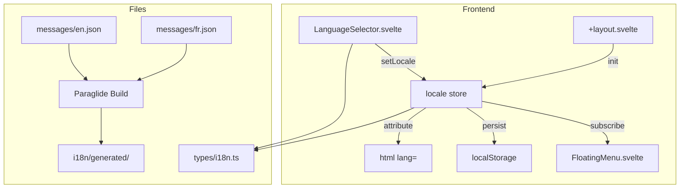

# Specification - Infrastructure i18n (Multi-langue)

## Metadata
- **Date**: 2025-12-04
- **Stack**: Svelte 5.43.14 + SvelteKit 2.49.0 + Tauri 2.9.4
- **Complexity**: Medium
- **Languages**: English (en), French (fr)
- **Library**: Paraglide-JS (runtime already generated)

## Context

**Demande**: Ajouter le support multi-langue (infrastructure uniquement). Les traductions seront ajoutees page par page ulterieurement.

**Objectif**: Mettre en place l'infrastructure i18n reutilisable avec selecteur de langue dans le FloatingMenu.

**Perimetre**:
- **Inclus**: Store locale, types i18n, composant LanguageSelector, integration FloatingMenu
- **Exclus**: Traductions concretes (pas de modification des pages existantes)

**Criteres de Succes**:
- [ ] Store locale.ts fonctionnel avec persistence localStorage
- [ ] Types TypeScript definis dans src/types/i18n.ts
- [ ] Composant LanguageSelector avec icones drapeaux
- [ ] Selecteur visible dans FloatingMenu (avant Settings/Agent)
- [ ] Fichiers messages JSON vides mais structures
- [ ] `npm run check` et `npm run lint` passent

---

## Etat Actuel

### Infrastructure Existante

**Fichiers Paraglide generes** (deja presents mais incomplets):
```
src/lib/i18n/generated/
├── .gitignore
├── .prettierignore
├── runtime.js          # Runtime Paraglide (setLanguageTag, languageTag, etc.)
├── messages.js         # Index des messages
└── messages/
    ├── en.js          # Messages anglais compiles
    └── fr.js          # Messages francais compiles
```

**Pattern de reference** (`src/lib/stores/theme.ts`):
```typescript
function createThemeStore() {
  const { subscribe, set } = writable<Theme>('light');
  return {
    subscribe,
    setTheme: (theme: Theme) => { ... },
    toggle: () => { ... },
    init: () => { ... }  // localStorage + system preference
  };
}
```

### Fichiers Manquants

| Fichier | Status | Description |
|---------|--------|-------------|
| `src/lib/stores/locale.ts` | **A CREER** | Store de gestion de la locale |
| `src/types/i18n.ts` | **A CREER** | Types Locale, LocaleInfo |
| `src/lib/components/ui/LanguageSelector.svelte` | **A CREER** | Dropdown avec drapeaux |
| `src/messages/en.json` | **A CREER** | Fichier source messages EN |
| `src/messages/fr.json` | **A CREER** | Fichier source messages FR |

### FloatingMenu (point d'integration)

**Fichier**: `src/lib/components/layout/FloatingMenu.svelte`

**Structure actuelle** (lignes 55-82):
```svelte
<div class="flex items-center gap-md">
  {#if actions}
    {@render actions()}
  {/if}

  <!-- [INSERTION ICI] LanguageSelector -->

  <button class="btn btn-ghost btn-icon" onclick={toggleTheme}>
    <!-- Theme toggle (Sun/Moon) -->
  </button>

  <a href="/settings" class="btn btn-secondary">
    <Settings size={16} />
    <span>Configuration</span>
  </a>

  <a href="/agent" class="btn btn-primary">
    <Bot size={16} />
    <span>Agent</span>
  </a>
</div>
```

**Point d'insertion**: Entre ligne 58 (`{/if}`) et ligne 60 (bouton theme toggle)

---

## Architecture Proposee

### Diagramme



### Structure des Fichiers

```
src/
├── lib/
│   ├── stores/
│   │   ├── locale.ts              # [NEW] Store de locale
│   │   ├── theme.ts               # [EXISTS] Reference pattern
│   │   └── index.ts               # [MODIFY] Export locale
│   │
│   ├── components/
│   │   ├── ui/
│   │   │   └── LanguageSelector.svelte  # [NEW] Selecteur drapeaux
│   │   └── layout/
│   │       └── FloatingMenu.svelte      # [MODIFY] Integration
│   │
│   └── i18n/
│       └── generated/             # [EXISTS] Paraglide output
│
├── messages/                      # [NEW] Source translations
│   ├── en.json
│   └── fr.json
│
├── types/
│   └── i18n.ts                    # [NEW] Types i18n
│
└── routes/
    └── +layout.svelte             # [MODIFY] locale.init()
```

---

## Composants

### 1. Types (`src/types/i18n.ts`)

```typescript
/**
 * Locale identifier (BCP 47 language tags)
 */
export type Locale = 'en' | 'fr';

/**
 * Available locales with metadata
 */
export interface LocaleInfo {
  /** Locale identifier */
  id: Locale;
  /** Display name in native language */
  nativeName: string;
  /** Flag emoji (fallback for icon) */
  flag: string;
  /** ISO 3166-1 country code for flag icon */
  countryCode: string;
}

/**
 * Locale configuration
 */
export const LOCALES: Record<Locale, LocaleInfo> = {
  en: {
    id: 'en',
    nativeName: 'English',
    flag: '🇬🇧',
    countryCode: 'GB'
  },
  fr: {
    id: 'fr',
    nativeName: 'Francais',
    flag: '🇫🇷',
    countryCode: 'FR'
  }
} as const;

/**
 * Supported locales array (for iteration)
 */
export const SUPPORTED_LOCALES: Locale[] = ['en', 'fr'];

/**
 * Default locale
 */
export const DEFAULT_LOCALE: Locale = 'en';
```

### 2. Store (`src/lib/stores/locale.ts`)

```typescript
/**
 * Locale Store
 * Manages application language with persistence
 * Pattern: copied from theme.ts
 */
import { writable, derived, get } from 'svelte/store';
import type { Locale } from '$types/i18n';
import { DEFAULT_LOCALE, SUPPORTED_LOCALES, LOCALES } from '$types/i18n';
import { setLanguageTag, isAvailableLanguageTag } from '$lib/i18n/generated/runtime';

const STORAGE_KEY = 'locale';

/**
 * Creates a locale store with persistence and system preference detection
 */
function createLocaleStore() {
  const { subscribe, set } = writable<Locale>(DEFAULT_LOCALE);

  return {
    subscribe,

    /**
     * Set the locale and persist to localStorage
     */
    setLocale: (locale: Locale): void => {
      if (!SUPPORTED_LOCALES.includes(locale)) {
        console.warn(`Unsupported locale: ${locale}, falling back to ${DEFAULT_LOCALE}`);
        locale = DEFAULT_LOCALE;
      }

      if (typeof document !== 'undefined') {
        document.documentElement.setAttribute('lang', locale);
        localStorage.setItem(STORAGE_KEY, locale);
      }

      // Update Paraglide runtime
      setLanguageTag(locale);
      set(locale);
    },

    /**
     * Initialize locale from localStorage or system preference
     */
    init: (): void => {
      if (typeof window === 'undefined') return;

      // Priority: localStorage > navigator.language > default
      const saved = localStorage.getItem(STORAGE_KEY);
      let locale: Locale = DEFAULT_LOCALE;

      if (saved && isAvailableLanguageTag(saved)) {
        locale = saved as Locale;
      } else {
        // Detect system language
        const browserLang = navigator.language.split('-')[0];
        if (isAvailableLanguageTag(browserLang)) {
          locale = browserLang as Locale;
        }
      }

      document.documentElement.setAttribute('lang', locale);
      setLanguageTag(locale);
      set(locale);
    },

    /**
     * Get current locale info
     */
    getInfo: (): typeof LOCALES[Locale] => {
      const current = get({ subscribe });
      return LOCALES[current];
    }
  };
}

/**
 * Locale store instance
 */
export const localeStore = createLocaleStore();

/**
 * Derived store for current locale value (reactive)
 */
export const locale = derived(localeStore, ($locale) => $locale);

/**
 * Derived store for current locale info (reactive)
 */
export const localeInfo = derived(localeStore, ($locale) => LOCALES[$locale]);
```

### 3. LanguageSelector (`src/lib/components/ui/LanguageSelector.svelte`)

**Design**: Bouton compact avec drapeau, dropdown au clic

```svelte
<!--
  LanguageSelector Component
  Compact language dropdown with flag icons.
  Integrates with locale store for persistence.

  @example
  <LanguageSelector />
-->
<script lang="ts">
  import { Globe } from 'lucide-svelte';
  import { localeStore, localeInfo } from '$lib/stores/locale';
  import { LOCALES, SUPPORTED_LOCALES, type Locale } from '$types/i18n';

  /**
   * Dropdown open state
   */
  let isOpen = $state(false);

  /**
   * Current locale info (reactive)
   */
  let currentInfo = $state(LOCALES.en);

  /**
   * Subscribe to locale changes
   */
  localeInfo.subscribe((info) => {
    currentInfo = info;
  });

  /**
   * Toggle dropdown visibility
   */
  function toggleDropdown(): void {
    isOpen = !isOpen;
  }

  /**
   * Select a locale
   */
  function selectLocale(locale: Locale): void {
    localeStore.setLocale(locale);
    isOpen = false;
  }

  /**
   * Close dropdown on outside click
   */
  function handleClickOutside(event: MouseEvent): void {
    const target = event.target as Element;
    if (!target.closest('.language-selector')) {
      isOpen = false;
    }
  }
</script>

<svelte:window onclick={handleClickOutside} />

<div class="language-selector">
  <button
    type="button"
    class="btn btn-ghost btn-icon"
    onclick={toggleDropdown}
    aria-label="Select language"
    aria-expanded={isOpen}
    aria-haspopup="listbox"
  >
    <span class="flag-icon">{currentInfo.flag}</span>
  </button>

  {#if isOpen}
    <ul class="dropdown" role="listbox" aria-label="Available languages">
      {#each SUPPORTED_LOCALES as loc}
        {@const info = LOCALES[loc]}
        <li role="option" aria-selected={loc === currentInfo.id}>
          <button
            type="button"
            class="dropdown-item"
            class:active={loc === currentInfo.id}
            onclick={() => selectLocale(loc)}
          >
            <span class="flag-icon">{info.flag}</span>
            <span class="locale-name">{info.nativeName}</span>
          </button>
        </li>
      {/each}
    </ul>
  {/if}
</div>

<style>
  .language-selector {
    position: relative;
    display: inline-block;
  }

  .flag-icon {
    font-size: 1.125rem;
    line-height: 1;
  }

  .dropdown {
    position: absolute;
    top: 100%;
    right: 0;
    margin-top: var(--spacing-xs);
    padding: var(--spacing-xs);
    background: var(--color-bg-secondary);
    border: 1px solid var(--color-border);
    border-radius: var(--radius-md);
    box-shadow: var(--shadow-lg);
    min-width: 140px;
    z-index: var(--z-dropdown);
    list-style: none;
  }

  .dropdown-item {
    display: flex;
    align-items: center;
    gap: var(--spacing-sm);
    width: 100%;
    padding: var(--spacing-sm) var(--spacing-md);
    background: transparent;
    border: none;
    border-radius: var(--radius-sm);
    cursor: pointer;
    font-size: var(--font-size-sm);
    color: var(--color-text-primary);
    transition: background-color var(--transition-fast);
  }

  .dropdown-item:hover {
    background: var(--color-bg-tertiary);
  }

  .dropdown-item.active {
    background: var(--color-accent);
    color: var(--color-text-on-accent);
  }

  .locale-name {
    flex: 1;
    text-align: left;
  }
</style>
```

### 4. FloatingMenu Integration

**Fichier**: `src/lib/components/layout/FloatingMenu.svelte`

**Modifications**:

```svelte
<!-- AJOUTER import -->
<script lang="ts">
  import type { Snippet } from 'svelte';
  import { Sun, Moon, Settings, Bot } from 'lucide-svelte';
  import { theme } from '$lib/stores/theme';
  import LanguageSelector from '$lib/components/ui/LanguageSelector.svelte';  // NEW
  // ... rest of script
</script>

<!-- Dans le template, AVANT le bouton theme toggle -->
<div class="flex items-center gap-md">
  {#if actions}
    {@render actions()}
  {/if}

  <!-- NEW: Language Selector -->
  <LanguageSelector />

  <button
    type="button"
    class="btn btn-ghost btn-icon"
    onclick={toggleTheme}
    aria-label={currentTheme === 'light' ? 'Switch to dark mode' : 'Switch to light mode'}
  >
    <!-- ... -->
  </button>

  <!-- ... rest of buttons -->
</div>
```

### 5. Layout Integration

**Fichier**: `src/routes/+layout.svelte`

**Modifications**:

```svelte
<script lang="ts">
  import { onMount } from 'svelte';
  import '../styles/global.css';
  import { theme } from '$lib/stores/theme';
  import { localeStore } from '$lib/stores/locale';  // NEW

  onMount(() => {
    theme.init();
    localeStore.init();  // NEW: Initialize locale from localStorage/browser
  });
</script>
```

### 6. Messages Source Files

**Fichier**: `src/messages/en.json` (structure vide pour Phase 2)

```json
{
  "$schema": "https://inlang.com/schema/inlang-message-format",
  "common_save": "Save",
  "common_cancel": "Cancel",
  "common_delete": "Delete",
  "common_edit": "Edit",
  "common_create": "Create",
  "common_close": "Close",
  "common_confirm": "Confirm",
  "common_loading": "Loading...",
  "common_error": "Error",
  "common_success": "Success",
  "common_warning": "Warning"
}
```

**Fichier**: `src/messages/fr.json`

```json
{
  "$schema": "https://inlang.com/schema/inlang-message-format",
  "common_save": "Enregistrer",
  "common_cancel": "Annuler",
  "common_delete": "Supprimer",
  "common_edit": "Modifier",
  "common_create": "Creer",
  "common_close": "Fermer",
  "common_confirm": "Confirmer",
  "common_loading": "Chargement...",
  "common_error": "Erreur",
  "common_success": "Succes",
  "common_warning": "Attention"
}
```

### 7. Stores Index Export

**Fichier**: `src/lib/stores/index.ts`

```typescript
// Existing exports
export { theme } from './theme';
export { workflowStore, workflows, isLoading, activeWorkflowId } from './workflows';
// ... other exports

// NEW: Locale exports
export { localeStore, locale, localeInfo } from './locale';
```

---

## Plan d'Implementation

### Phase 1: Types et Dependances
**Objectif**: Definir les types et verifier les dependances Paraglide

**Taches**:
1. **Types**: Creer `src/types/i18n.ts`
   - Definir `Locale`, `LocaleInfo`, `LOCALES`, `SUPPORTED_LOCALES`

2. **Dependances**: Verifier que Paraglide fonctionne
   - Les fichiers generes existent deja
   - Pas d'installation npm necessaire (runtime embarque)

**Validation**:
- [ ] `npm run check` passe
- [ ] Types importables via `$types/i18n`

---

### Phase 2: Store Locale
**Objectif**: Creer le store de gestion de locale

**Taches**:
1. **Store**: Creer `src/lib/stores/locale.ts`
   - Copier pattern de `theme.ts`
   - Ajouter `setLocale()`, `init()`, derived stores
   - Integrer avec Paraglide `setLanguageTag()`

2. **Export**: Modifier `src/lib/stores/index.ts`
   - Exporter `localeStore`, `locale`, `localeInfo`

**Validation**:
- [ ] Store exportable via `$lib/stores/locale`
- [ ] `localeStore.init()` detecte la langue du navigateur
- [ ] `localeStore.setLocale('fr')` persiste dans localStorage

---

### Phase 3: Composant LanguageSelector
**Objectif**: Creer le selecteur de langue avec drapeaux

**Taches**:
1. **Composant**: Creer `src/lib/components/ui/LanguageSelector.svelte`
   - Bouton avec emoji drapeau
   - Dropdown listant les langues disponibles
   - Integration avec localeStore

2. **Styles**: CSS pour dropdown et etats actifs
   - Support dark/light theme via CSS variables
   - Animations de transition

**Validation**:
- [ ] Composant affiche le drapeau actuel
- [ ] Click ouvre dropdown
- [ ] Selection change la langue
- [ ] Fermeture au click exterieur

---

### Phase 4: Integration FloatingMenu
**Objectif**: Integrer le selecteur dans la navigation

**Taches**:
1. **FloatingMenu**: Modifier `src/lib/components/layout/FloatingMenu.svelte`
   - Importer LanguageSelector
   - Placer AVANT le bouton theme toggle

2. **Layout**: Modifier `src/routes/+layout.svelte`
   - Importer localeStore
   - Appeler `localeStore.init()` dans onMount

**Validation**:
- [ ] Selecteur visible dans la barre de navigation
- [ ] Position: avant theme toggle, avant Settings, avant Agent
- [ ] Responsive: reste visible sur mobile

---

### Phase 5: Fichiers Messages (Structure)
**Objectif**: Creer les fichiers source pour Paraglide

**Taches**:
1. **Messages EN**: Creer `src/messages/en.json`
   - Structure de base avec cles communes

2. **Messages FR**: Creer `src/messages/fr.json`
   - Meme structure, traductions francaises

3. **Configuration** (si necessaire): `project.inlang/settings.json`
   - Configurer Paraglide pour lire les fichiers source

**Validation**:
- [ ] Fichiers JSON valides
- [ ] Structure identique EN/FR
- [ ] Build Paraglide regenere les fichiers dans `generated/`

---

## Estimation

| Phase | Description | Effort |
|-------|-------------|--------|
| 1 | Types et dependances | 0.5h |
| 2 | Store locale | 1h |
| 3 | Composant LanguageSelector | 1.5h |
| 4 | Integration FloatingMenu | 0.5h |
| 5 | Fichiers messages | 0.5h |
| **Total** | | **4h** |

**Facteurs**:
- Pattern theme.ts reutilisable: -30%
- Runtime Paraglide deja genere: -20%
- Pas de traductions concretes: -50%

---

## Analyse des Risques

| Risque | Probabilite | Impact | Mitigation |
|--------|-------------|--------|------------|
| Paraglide runtime incomplet | Faible | Moyen | Verifier `setLanguageTag` fonctionne avant dev |
| Hydration SSR | Moyenne | Faible | Pattern `typeof window !== 'undefined'` |
| Z-index dropdown | Faible | Faible | Utiliser `var(--z-dropdown)` existant |
| CSS variables manquantes | Faible | Faible | Ajouter dans global.css si necessaire |

---

## Tests

### Frontend (Vitest)

```typescript
// src/lib/stores/locale.test.ts
import { describe, it, expect, beforeEach, vi } from 'vitest';
import { get } from 'svelte/store';
import { localeStore, locale } from './locale';

describe('localeStore', () => {
  beforeEach(() => {
    localStorage.clear();
  });

  it('should default to "en"', () => {
    localeStore.init();
    expect(get(locale)).toBe('en');
  });

  it('should persist locale to localStorage', () => {
    localeStore.setLocale('fr');
    expect(localStorage.getItem('locale')).toBe('fr');
  });

  it('should detect browser language', () => {
    vi.stubGlobal('navigator', { language: 'fr-FR' });
    localeStore.init();
    expect(get(locale)).toBe('fr');
  });
});
```

### Component Test

```typescript
// src/lib/components/ui/LanguageSelector.test.ts
import { render, fireEvent } from '@testing-library/svelte';
import LanguageSelector from './LanguageSelector.svelte';

describe('LanguageSelector', () => {
  it('should render flag button', () => {
    const { getByRole } = render(LanguageSelector);
    expect(getByRole('button', { name: /select language/i })).toBeInTheDocument();
  });

  it('should open dropdown on click', async () => {
    const { getByRole, getByText } = render(LanguageSelector);
    await fireEvent.click(getByRole('button'));
    expect(getByText('English')).toBeInTheDocument();
    expect(getByText('Francais')).toBeInTheDocument();
  });
});
```

---

## Considerations

### Performance
- Store reactif Svelte (pas de re-render inutile)
- Paraglide compile les messages (0 runtime parsing)
- localStorage synchrone (pas d'async)

### Securite
- Pas d'input utilisateur pour locale (liste fermee)
- Validation des locales supportees

### Accessibilite
- `aria-label` sur bouton
- `aria-expanded` pour dropdown
- `role="listbox"` et `role="option"`
- Navigation clavier (future: Escape pour fermer)

### Tauri Specifique
- Aucune commande backend necessaire
- localStorage fonctionne dans WebView Tauri
- `document.documentElement.lang` pour SEO/accessibilite

---

## CSS Variables Requises

Verifier que ces variables existent dans `src/styles/global.css`:

```css
:root {
  /* Required for LanguageSelector */
  --z-dropdown: 1000;
  --shadow-lg: 0 10px 15px -3px rgb(0 0 0 / 0.1);
  --color-bg-tertiary: #f0f0f0;
  --color-text-on-accent: #ffffff;
}
```

---

## Dependances

### Frontend (package.json)
Aucune nouvelle dependance requise. Paraglide runtime est deja genere.

### A verifier
Si le build Paraglide ne fonctionne pas, installer:
```bash
npm install -D @inlang/paraglide-js @inlang/paraglide-vite
```

---

## Prochaines Etapes

### Validation
- [ ] Architecture approuvee
- [ ] CSS variables confirmees
- [ ] Pattern theme.ts valide

### Implementation
1. Commencer Phase 1 (types)
2. Tester store avec console
3. Creer composant LanguageSelector
4. Integrer dans FloatingMenu
5. Tests manuels + automatises

### Future (Phase 2 - Traductions)
- Ajouter cles i18n page par page
- Migrer `PROMPT_CATEGORY_LABELS` vers Paraglide
- Ajouter labels pour tous les enums

---

## References

- Architecture: `docs/TECH_STACK.md`
- Pattern store: `src/lib/stores/theme.ts`
- FloatingMenu: `src/lib/components/layout/FloatingMenu.svelte`
- Memoires Serena: `i18n_implementation_spec`, `i18n_analysis_types_contracts`
- Paraglide docs: https://inlang.com/m/gerre34r/library-inlang-paraglide
