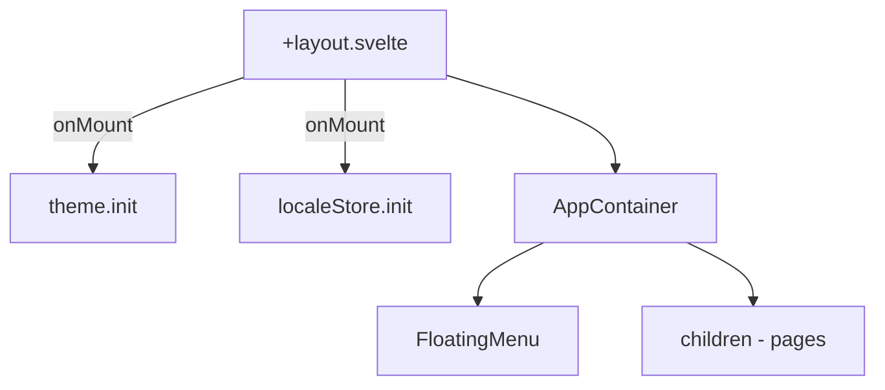
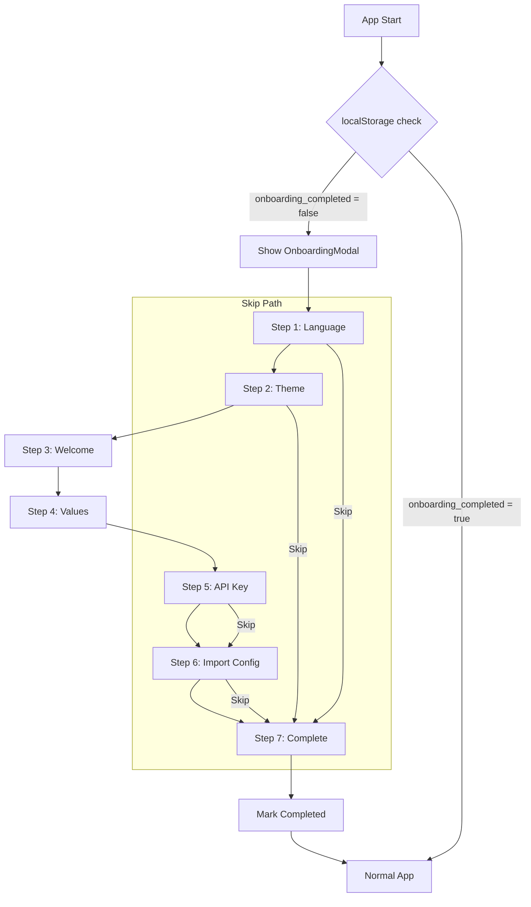

# Specification - Onboarding First Launch

## Metadonnees
- **Date**: 2025-12-04
- **Stack**: Svelte 5.43 + Rust 1.91 + Tauri 2.9 + SurrealDB 2.3
- **Complexite**: Medium
- **Reuse Potential**: 75-80% (composants UI existants)

## Contexte

**Demande**: Creer un systeme d'onboarding affiche au premier lancement de l'application.

**Objectif**: Guider l'utilisateur dans la configuration initiale (langue, theme, API key) tout en presentant les valeurs de l'application.

**Perimetre**:
- **Inclus**: Modal full-screen 7 pages, persistence etat, navigation steps, i18n
- **Exclus**: Creation agent durant onboarding (fait dans Settings), backend persistence (localStorage suffit)

**Criteres Succes**:
- [ ] Modal s'affiche uniquement au premier lancement
- [ ] 7 pages avec navigation fluide (prev/next/skip)
- [ ] Textes courts (max 2 phrases par point)
- [ ] Preferences (langue, theme) appliquees immediatement
- [ ] Option test cle API Mistral
- [ ] Lien externe vers assistancemicrodesign.net
- [ ] Marquage completion persistant (localStorage)

---

## Etat Actuel

### Architecture Existante



### Patterns Identifies

| Pattern | Usage | Fichiers |
|---------|-------|----------|
| Store localStorage | Persistence preferences | `src/lib/stores/theme.ts`, `locale.ts` |
| Modal accessible | Dialogs avec Escape/backdrop | `src/lib/components/ui/Modal.svelte` |
| LanguageSelector | Selection locale avec flags | `src/lib/components/ui/LanguageSelector.svelte` |
| i18n reactive | Traductions dynamiques | `$i18n('key')` dans templates |
| Tauri invoke | Test connexion API | `test_provider_connection` command |

### Code Reutilisable

**Frontend**:
- `Modal.svelte`: Base pour modal full-screen (adaptation CSS)
- `Button.svelte`: Navigation steps (primary, secondary, ghost)
- `LanguageSelector.svelte`: Page selection langue
- `Input.svelte`: Saisie cle API
- `theme.ts`: Pattern store + localStorage
- `locale.ts`: Pattern store + i18n integration

**Backend**:
- `test_provider_connection`: Test cle API Mistral
- `save_api_key`: Sauvegarde cle dans keystore securise

---

## Architecture Proposee

### Diagramme Flux



### Structure Composants

```
src/lib/components/onboarding/
├── OnboardingModal.svelte      # Container full-screen
├── OnboardingProgress.svelte   # Indicateur step X/7
├── steps/
│   ├── StepLanguage.svelte     # Page 1
│   ├── StepTheme.svelte        # Page 2
│   ├── StepWelcome.svelte      # Page 3
│   ├── StepValues.svelte       # Page 4
│   ├── StepApiKey.svelte       # Page 5
│   ├── StepImport.svelte       # Page 6
│   └── StepComplete.svelte     # Page 7
└── index.ts                    # Exports
```

---

## Composants Detailles

### OnboardingModal.svelte

**Path**: `src/lib/components/onboarding/OnboardingModal.svelte`
**Type**: Nouveau composant

**Props**:
```typescript
interface Props {
  onComplete: () => void;
}
```

**State interne**:
```typescript
let currentStep = $state<number>(0);
const TOTAL_STEPS = 7;

const steps = [
  StepLanguage,
  StepTheme,
  StepWelcome,
  StepValues,
  StepApiKey,
  StepImport,
  StepComplete
];
```

**Comportement**:
- Full-screen (100vw x 100vh)
- Pas de fermeture par Escape ou backdrop click
- Navigation: boutons Precedent/Suivant dans footer
- Skip global vers derniere page (sauf page 7)

**CSS specifique**:
```css
.onboarding-modal {
  position: fixed;
  inset: 0;
  z-index: var(--z-index-modal);
  background: var(--color-bg-primary);
  display: flex;
  flex-direction: column;
  align-items: center;
  justify-content: center;
}

.onboarding-content {
  max-width: 600px;
  width: 100%;
  padding: var(--spacing-xl);
  text-align: center;
}
```

---

### Pages Onboarding (7 Steps)

#### Page 1: StepLanguage

**Contenu FR**:
- Titre: "Choisissez votre langue"
- Description: "Cette preference sera utilisee dans toute l'application."

**Contenu EN**:
- Title: "Choose your language"
- Description: "This preference will be used throughout the application."

**Composants utilises**: 2 boutons drapeaux FR/EN
**Action**: `localeStore.setLocale(locale)` immediat

---

#### Page 2: StepTheme

**Contenu FR**:
- Titre: "Apparence"
- Description: "Selectionnez le theme de votre choix."

**Contenu EN**:
- Title: "Appearance"
- Description: "Select your preferred theme."

**Composants**: 2 previews visuels light/dark cliquables
**Action**: `theme.setTheme(theme)` immediat

---

#### Page 3: StepWelcome

**Contenu FR**:
- Titre: "Bienvenue dans Zileo Chat"
- Description: "Votre assistant IA multi-agents pour le bureau."

**Contenu EN**:
- Title: "Welcome to Zileo Chat"
- Description: "Your multi-agent AI assistant for desktop."

**Composants**: Logo + texte statique
**Action**: Aucune (informatif)

---

#### Page 4: StepValues

**Contenu FR** (max 2 phrases par point):
1. **Open Source**: "Code source libre et transparent. Contribuez et personnalisez."
2. **Donnees locales**: "Vos donnees restent sur votre ordinateur. Aucun cloud obligatoire."
3. **API de confiance**: "Mistral (France, RGPD) et Ollama (cloud prive). Vous choisissez."
4. **Non-SaaS**: "Pas d'abonnement. Vous controlez votre installation."

**Contenu EN**:
1. **Open Source**: "Free and transparent source code. Contribute and customize."
2. **Local Data**: "Your data stays on your computer. No cloud required."
3. **Trusted APIs**: "Mistral (France, GDPR) and Ollama (private cloud). Your choice."
4. **Non-SaaS**: "No subscription. You control your installation."

**Composants**: 4 cartes avec icones (Code, HardDrive, Shield, Server)
**Action**: Aucune (informatif)

---

#### Page 5: StepApiKey

**Contenu FR**:
- Titre: "Cle API Mistral"
- Description: "Entrez votre cle API pour utiliser Mistral AI."
- Help: "Obtenez une cle sur console.mistral.ai"
- Bouton skip: "Je n'ai pas de cle"

**Contenu EN**:
- Title: "Mistral API Key"
- Description: "Enter your API key to use Mistral AI."
- Help: "Get a key at console.mistral.ai"
- Skip button: "I don't have a key"

**Composants**: Input + Button test + Skip link
**Actions**:
- Test: `invoke('test_provider_connection', { provider: 'mistral' })`
- Save: `invoke('save_api_key', { provider: 'mistral', apiKey })`

---

#### Page 6: StepImport

**Contenu FR**:
- Titre: "Importer une configuration"
- Description: "Demarrez rapidement avec des configurations pre-faites."
- Option 1: "Consulter les configurations disponibles" (lien externe)
- Option 2: "Passer cette etape"

**Contenu EN**:
- Title: "Import a configuration"
- Description: "Get started quickly with pre-made configurations."
- Option 1: "Browse available configurations" (external link)
- Option 2: "Skip this step"

**Lien externe**: `https://assistancemicrodesign.net/`
**Composants**: 2 boutons (primary pour lien, ghost pour skip)
**Action externe**: `window.open(url, '_blank')`

---

#### Page 7: StepComplete

**Contenu FR**:
- Titre: "Configuration terminee!"
- Description: "Vous etes pret a utiliser Zileo Chat."
- Bouton: "Commencer"

**Contenu EN**:
- Title: "Setup complete!"
- Description: "You're ready to use Zileo Chat."
- Button: "Get Started"

**Composants**: Texte + bouton primary
**Action**: `onboardingStore.markComplete()` puis fermeture modal

---

## Store Onboarding

### Definition Types

**Path**: `src/types/onboarding.ts`

```typescript
/**
 * Onboarding step identifier
 */
export type OnboardingStep =
  | 'language'
  | 'theme'
  | 'welcome'
  | 'values'
  | 'api_key'
  | 'import'
  | 'complete';

/**
 * Onboarding state
 */
export interface OnboardingState {
  /** Current step index (0-6) */
  currentStep: number;
  /** Whether onboarding is completed */
  completed: boolean;
  /** Whether user skipped to end */
  skipped: boolean;
  /** API key test result (for StepApiKey) */
  apiKeyValid: boolean | null;
  /** Loading state for async operations */
  loading: boolean;
  /** Error message if any */
  error: string | null;
}

/**
 * Step definition
 */
export interface StepDefinition {
  id: OnboardingStep;
  component: typeof SvelteComponent;
  canSkip: boolean;
}
```

### Store Implementation

**Path**: `src/lib/stores/onboarding.ts`

```typescript
import { writable, derived } from 'svelte/store';
import type { OnboardingState } from '$types/onboarding';

const STORAGE_KEY = 'zileo_onboarding_completed';
const TOTAL_STEPS = 7;

function createOnboardingStore() {
  const { subscribe, set, update } = writable<OnboardingState>({
    currentStep: 0,
    completed: false,
    skipped: false,
    apiKeyValid: null,
    loading: false,
    error: null
  });

  return {
    subscribe,

    /**
     * Check if onboarding should be shown
     */
    shouldShow: (): boolean => {
      if (typeof localStorage === 'undefined') return false;
      return localStorage.getItem(STORAGE_KEY) !== 'true';
    },

    /**
     * Go to next step
     */
    nextStep: (): void => {
      update(s => ({
        ...s,
        currentStep: Math.min(s.currentStep + 1, TOTAL_STEPS - 1),
        error: null
      }));
    },

    /**
     * Go to previous step
     */
    prevStep: (): void => {
      update(s => ({
        ...s,
        currentStep: Math.max(s.currentStep - 1, 0),
        error: null
      }));
    },

    /**
     * Skip to last step
     */
    skipToEnd: (): void => {
      update(s => ({
        ...s,
        currentStep: TOTAL_STEPS - 1,
        skipped: true
      }));
    },

    /**
     * Mark onboarding as complete and persist
     */
    markComplete: (): void => {
      if (typeof localStorage !== 'undefined') {
        localStorage.setItem(STORAGE_KEY, 'true');
      }
      update(s => ({ ...s, completed: true }));
    },

    /**
     * Set API key validation result
     */
    setApiKeyValid: (valid: boolean): void => {
      update(s => ({ ...s, apiKeyValid: valid }));
    },

    /**
     * Set loading state
     */
    setLoading: (loading: boolean): void => {
      update(s => ({ ...s, loading }));
    },

    /**
     * Set error message
     */
    setError: (error: string | null): void => {
      update(s => ({ ...s, error }));
    },

    /**
     * Reset store (for testing)
     */
    reset: (): void => {
      if (typeof localStorage !== 'undefined') {
        localStorage.removeItem(STORAGE_KEY);
      }
      set({
        currentStep: 0,
        completed: false,
        skipped: false,
        apiKeyValid: null,
        loading: false,
        error: null
      });
    }
  };
}

export const onboardingStore = createOnboardingStore();

// Derived stores
export const currentStep = derived(onboardingStore, $s => $s.currentStep);
export const isCompleted = derived(onboardingStore, $s => $s.completed);
export const isLoading = derived(onboardingStore, $s => $s.loading);
export const onboardingError = derived(onboardingStore, $s => $s.error);
```

---

## Integration Layout

### Modification +layout.svelte

**Path**: `src/routes/+layout.svelte`

```svelte
<script lang="ts">
  import { onMount } from 'svelte';
  import '../styles/global.css';
  import { theme } from '$lib/stores/theme';
  import { localeStore } from '$lib/stores/locale';
  import { onboardingStore, isCompleted } from '$lib/stores/onboarding';
  import { i18n } from '$lib/i18n';
  import { AppContainer, FloatingMenu } from '$lib/components/layout';
  import { OnboardingModal } from '$lib/components/onboarding';

  let { children } = $props();

  let showOnboarding = $state(false);

  onMount(() => {
    theme.init();
    localeStore.init();

    // Check if onboarding should be shown
    showOnboarding = onboardingStore.shouldShow();
  });

  function handleOnboardingComplete(): void {
    showOnboarding = false;
  }
</script>

<svelte:head>
  <!-- fonts -->
</svelte:head>

{#if showOnboarding}
  <OnboardingModal onComplete={handleOnboardingComplete} />
{:else}
  <a href="#main-content" class="skip-link">{$i18n('nav_skip_to_content')}</a>
  <AppContainer>
    <FloatingMenu />
    <div id="main-content" class="main-content" role="main">
      {@render children()}
    </div>
  </AppContainer>
{/if}
```

---

## i18n Keys

### Nouvelles Cles (40+)

**Pattern**: `onboarding_<step>_<element>`

```json
{
  "onboarding_progress": "Step {current} of {total}",
  "onboarding_skip": "Skip",
  "onboarding_previous": "Previous",
  "onboarding_next": "Next",

  "onboarding_language_title": "Choose your language",
  "onboarding_language_description": "This preference will be used throughout the application.",
  "onboarding_language_english": "English",
  "onboarding_language_french": "Francais",

  "onboarding_theme_title": "Appearance",
  "onboarding_theme_description": "Select your preferred theme.",
  "onboarding_theme_light": "Light",
  "onboarding_theme_dark": "Dark",

  "onboarding_welcome_title": "Welcome to Zileo Chat",
  "onboarding_welcome_description": "Your multi-agent AI assistant for desktop.",

  "onboarding_values_title": "Our Values",
  "onboarding_values_opensource_title": "Open Source",
  "onboarding_values_opensource_description": "Free and transparent source code. Contribute and customize.",
  "onboarding_values_local_title": "Local Data",
  "onboarding_values_local_description": "Your data stays on your computer. No cloud required.",
  "onboarding_values_api_title": "Trusted APIs",
  "onboarding_values_api_description": "Mistral (France, GDPR) and Ollama (private cloud). Your choice.",
  "onboarding_values_nonsaas_title": "Non-SaaS",
  "onboarding_values_nonsaas_description": "No subscription. You control your installation.",

  "onboarding_apikey_title": "Mistral API Key",
  "onboarding_apikey_description": "Enter your API key to use Mistral AI.",
  "onboarding_apikey_placeholder": "sk-...",
  "onboarding_apikey_help": "Get a key at console.mistral.ai",
  "onboarding_apikey_test": "Test Connection",
  "onboarding_apikey_testing": "Testing...",
  "onboarding_apikey_valid": "Connection successful!",
  "onboarding_apikey_invalid": "Invalid API key",
  "onboarding_apikey_skip": "I don't have a key",

  "onboarding_import_title": "Import a Configuration",
  "onboarding_import_description": "Get started quickly with pre-made configurations.",
  "onboarding_import_browse": "Browse Available Configurations",
  "onboarding_import_skip": "Skip this step",

  "onboarding_complete_title": "Setup Complete!",
  "onboarding_complete_description": "You're ready to use Zileo Chat.",
  "onboarding_complete_button": "Get Started"
}
```

---

## Plan d'Implementation

### Phase A: Types & Store

**Objectif**: Infrastructure frontend

**Taches**:
1. **Types**: Creer `src/types/onboarding.ts`
   - Definir OnboardingStep, OnboardingState
   - Exporter dans `src/types/index.ts`

2. **Store**: Creer `src/lib/stores/onboarding.ts`
   - Implementer createOnboardingStore()
   - Derived stores (currentStep, isCompleted)
   - Exporter dans `src/lib/stores/index.ts`

**Validation**:
- [ ] Types compiles sans erreur
- [ ] Store testable avec shouldShow()/markComplete()

---

### Phase B: Composant OnboardingModal

**Objectif**: Container full-screen

**Taches**:
1. **Modal**: Creer `src/lib/components/onboarding/OnboardingModal.svelte`
   - Layout full-screen responsive
   - Progress indicator (step X/7)
   - Navigation buttons (prev/next/skip)
   - Dynamic step rendering

2. **Progress**: Creer `OnboardingProgress.svelte`
   - Affichage visuel progression
   - Animation entre steps

**Validation**:
- [ ] Modal occupe 100% ecran
- [ ] Navigation fonctionne (prev/next)
- [ ] Skip saute a derniere page

---

### Phase C: 7 Composants Steps

**Objectif**: Contenu chaque page

**Taches**:
1. **StepLanguage**: Selection locale avec flags FR/EN
2. **StepTheme**: Selection theme light/dark avec previews
3. **StepWelcome**: Texte bienvenue + logo
4. **StepValues**: 4 cartes valeurs avec icones
5. **StepApiKey**: Input + test + skip
6. **StepImport**: Lien externe + skip
7. **StepComplete**: Bouton final

**Validation**:
- [ ] Chaque step affiche correctement
- [ ] Textes respectent limite 2 phrases
- [ ] Actions (setLocale, setTheme, test API) fonctionnent

---

### Phase D: Integration Layout

**Objectif**: Detection premier lancement

**Taches**:
1. Modifier `+layout.svelte`
   - Check onboardingStore.shouldShow() au onMount
   - Conditional render OnboardingModal vs AppContainer
   - Handler onComplete

**Validation**:
- [ ] Premier lancement: modal s'affiche
- [ ] Apres completion: modal ne s'affiche plus
- [ ] Refresh page: etat persiste

---

### Phase E: i18n

**Objectif**: Traductions completes

**Taches**:
1. Ajouter 40+ cles dans `src/messages/en.json`
2. Ajouter traductions FR dans `src/messages/fr.json`
3. Utiliser `$i18n('key')` dans tous les composants

**Validation**:
- [ ] Toutes les cles definies EN + FR
- [ ] Pas de texte hardcode dans composants
- [ ] Changement langue immediat dans onboarding

---

### Phase F: Tests & Polish

**Objectif**: Qualite production

**Taches**:
1. **Tests unitaires**: Store onboarding (Vitest)
2. **Tests E2E**: Parcours complet onboarding (Playwright)
3. **Responsive**: Tester sur differentes resolutions
4. **Accessibilite**: Focus management, aria-labels

**Validation**:
- [ ] Tests passent
- [ ] Responsive 320px - 4K
- [ ] Accessibilite OK (keyboard nav)

---

## Estimation

| Phase | Effort | Dependances |
|-------|--------|-------------|
| A: Types & Store | 1h | Aucune |
| B: OnboardingModal | 2h | Phase A |
| C: 7 Steps | 3h | Phase B |
| D: Integration | 0.5h | Phase C |
| E: i18n | 1h | Phase C |
| F: Tests | 2h | Phase D, E |
| **Total** | **9.5h** | - |

**Facteurs**:
- Reutilisation 75%: -30% effort
- Composants UI existants: -20% effort
- Nouveaux patterns: +10% effort

**Estimation ajustee**: ~7 heures

---

## Analyse Risques

| Risque | Probabilite | Impact | Mitigation | Plan B |
|--------|-------------|--------|------------|--------|
| Test API timeout | Moyenne | Faible | Timeout 10s + message erreur clair | Skip sans test |
| Lien externe indisponible | Faible | Faible | Ouvre nouvel onglet, pas bloquant | Afficher URL texte |
| localStorage non disponible | Tres faible | Moyen | Check typeof + fallback | Toujours afficher onboarding |
| Responsive casse | Faible | Moyen | Tests Playwright multi-resolutions | CSS flexbox fallbacks |
| Conflit theme/locale init | Faible | Faible | Ordre explicite dans layout | Stores independants |

---

## Tests

### Frontend (Vitest)

```typescript
// src/lib/stores/onboarding.test.ts
describe('onboardingStore', () => {
  beforeEach(() => {
    localStorage.clear();
    onboardingStore.reset();
  });

  it('shouldShow returns true on first launch', () => {
    expect(onboardingStore.shouldShow()).toBe(true);
  });

  it('shouldShow returns false after completion', () => {
    onboardingStore.markComplete();
    expect(onboardingStore.shouldShow()).toBe(false);
  });

  it('nextStep increments currentStep', () => {
    onboardingStore.nextStep();
    expect(get(currentStep)).toBe(1);
  });

  it('skipToEnd goes to last step', () => {
    onboardingStore.skipToEnd();
    expect(get(currentStep)).toBe(6);
  });
});
```

### E2E (Playwright)

```typescript
// tests/onboarding.spec.ts
test.describe('Onboarding Flow', () => {
  test.beforeEach(async ({ page }) => {
    await page.evaluate(() => localStorage.clear());
    await page.goto('/');
  });

  test('shows onboarding modal on first launch', async ({ page }) => {
    await expect(page.locator('.onboarding-modal')).toBeVisible();
  });

  test('completes full onboarding flow', async ({ page }) => {
    // Step 1: Language
    await page.click('[data-step="language"] button:has-text("English")');
    await page.click('button:has-text("Next")');

    // Step 2: Theme
    await page.click('[data-theme-option="light"]');
    await page.click('button:has-text("Next")');

    // ... continue for all 7 steps

    // Final step
    await page.click('button:has-text("Get Started")');
    await expect(page.locator('.onboarding-modal')).not.toBeVisible();
  });

  test('persists completion across reloads', async ({ page }) => {
    // Complete onboarding
    for (let i = 0; i < 6; i++) {
      await page.click('button:has-text("Next")');
    }
    await page.click('button:has-text("Get Started")');

    // Reload
    await page.reload();

    // Should not show onboarding
    await expect(page.locator('.onboarding-modal')).not.toBeVisible();
  });
});
```

---

## Considerations

### Performance
- Lazy load step components (dynamic import)
- CSS containment pour animations
- Pas de network requests sauf test API

### Securite
- Cle API masquee (type password)
- Stockage cle via Tauri keystore (pas localStorage)
- Lien externe ouvre nouvel onglet (pas de redirect)

### Accessibilite
- Focus trap dans modal
- aria-labels sur tous les boutons
- Navigation clavier complete
- Annonces screen reader pour changements step

### UX
- Animations subtiles entre steps (fade/slide)
- Feedback immediat (locale/theme appliques)
- Messages d'erreur clairs et actionables
- Option skip visible mais non intrusive

---

## Fichiers a Creer

| Fichier | Type |
|---------|------|
| `src/types/onboarding.ts` | Types |
| `src/lib/stores/onboarding.ts` | Store |
| `src/lib/components/onboarding/OnboardingModal.svelte` | Composant |
| `src/lib/components/onboarding/OnboardingProgress.svelte` | Composant |
| `src/lib/components/onboarding/steps/StepLanguage.svelte` | Composant |
| `src/lib/components/onboarding/steps/StepTheme.svelte` | Composant |
| `src/lib/components/onboarding/steps/StepWelcome.svelte` | Composant |
| `src/lib/components/onboarding/steps/StepValues.svelte` | Composant |
| `src/lib/components/onboarding/steps/StepApiKey.svelte` | Composant |
| `src/lib/components/onboarding/steps/StepImport.svelte` | Composant |
| `src/lib/components/onboarding/steps/StepComplete.svelte` | Composant |
| `src/lib/components/onboarding/steps/index.ts` | Exports |
| `src/lib/components/onboarding/index.ts` | Exports |

## Fichiers a Modifier

| Fichier | Modification |
|---------|-------------|
| `src/routes/+layout.svelte` | Import onboarding + conditional render |
| `src/types/index.ts` | Export onboarding types |
| `src/lib/stores/index.ts` | Export onboarding store |
| `src/messages/en.json` | +40 cles onboarding |
| `src/messages/fr.json` | +40 cles onboarding |

---

## Dependances

### Frontend (package.json)
Aucune nouvelle dependance requise.

### Backend (Cargo.toml)
Aucune nouvelle dependance requise.

**Justification**: Stack existant complet pour cette feature.

---

## Prochaines Etapes

### Validation
- [ ] Architecture approuvee
- [ ] Contenu texte valide par stakeholder
- [ ] Design mockups si necessaire

### Implementation
1. Executer `/Build_zileo` avec cette spec
2. Phase A-B en premier (infrastructure)
3. Phases C-E en parallele si possible
4. Phase F apres integration complete

---

## References

- Architecture: `docs/TECH_STACK.md`
- Design System: `docs/DESIGN_SYSTEM.md`
- Modal existant: `src/lib/components/ui/Modal.svelte`
- Theme store: `src/lib/stores/theme.ts`
- Locale store: `src/lib/stores/locale.ts`
- Mistral RGPD: [Mistral Privacy Policy](https://legal.mistral.ai/terms/privacy-policy)
- Site import config: [Assistance Micro Design](https://assistancemicrodesign.net/)

---

## Appendice: Contenu Texte Complet

### Page 4 - Valeurs (Version Complete)

**FR**:
| Valeur | Titre | Description |
|--------|-------|-------------|
| Open Source | Open Source | Code source libre et transparent. Contribuez et personnalisez selon vos besoins. |
| Donnees locales | Donnees locales | Vos donnees restent sur votre ordinateur. Aucun cloud obligatoire pour fonctionner. |
| API confiance | API de confiance | Mistral AI (France, conforme RGPD) et Ollama (cloud prive local). Vous choisissez votre fournisseur. |
| Non-SaaS | Vision non-SaaS | Pas d'abonnement mensuel. Vous installez, vous controlez, vous possedez. |

**EN**:
| Value | Title | Description |
|-------|-------|-------------|
| Open Source | Open Source | Free and transparent source code. Contribute and customize to your needs. |
| Local Data | Local Data | Your data stays on your computer. No cloud required to function. |
| Trusted APIs | Trusted APIs | Mistral AI (France, GDPR compliant) and Ollama (local private cloud). You choose your provider. |
| Non-SaaS | Non-SaaS Vision | No monthly subscription. You install, you control, you own. |
