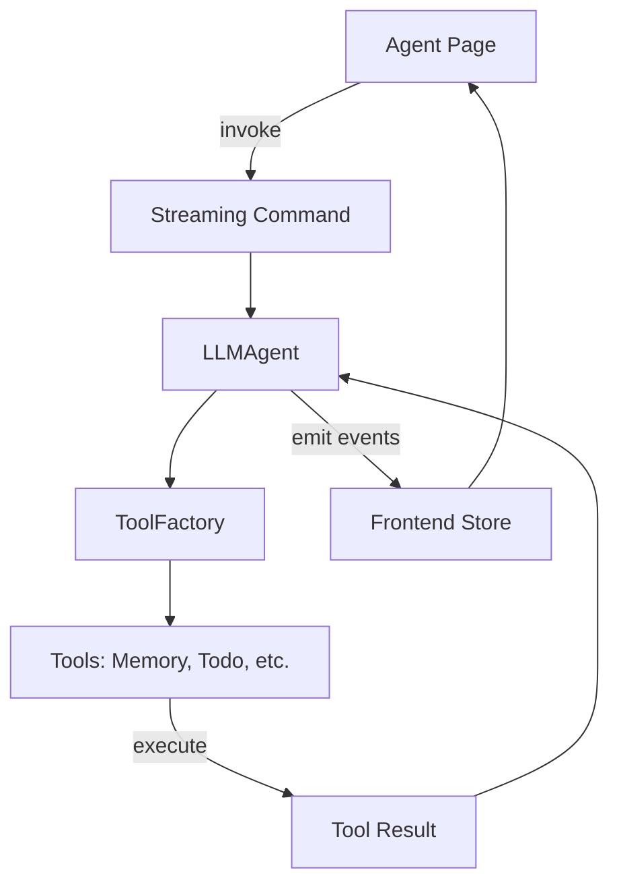
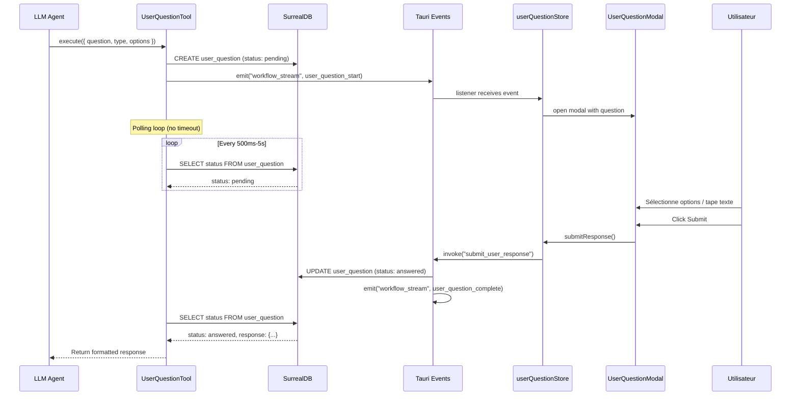

# Spécification - UserQuestionTool

## Métadonnées
- **Date**: 2025-12-06
- **Stack**: Svelte 5.43 + Rust 1.91 + Tauri 2.9 + SurrealDB 2.3
- **Complexité**: complex
- **Auteur**: Claude Code (Planification)

## Contexte

### Demande
Tool permettant aux agents de poser des questions à l'utilisateur dans un modal avec:
- Pas de timeout (attente indéfinie)
- Questions avec checkboxes (choix multiples)
- Zone de texte libre
- Combinaison checkbox + texte
- Outil configurable dans la configuration agent

### Objectif
Permettre aux agents LLM d'interrompre leur exécution pour collecter des informations auprès de l'utilisateur via une interface modale interactive, puis de reprendre l'exécution avec les réponses obtenues.

### Périmètre
**Inclus**:
- Nouveau tool `UserQuestionTool` implémentant le trait `Tool`
- Modal Svelte interactif (`UserQuestionModal`)
- Store frontend dédié (`userQuestion.ts`)
- Types synchronisés TypeScript/Rust
- Persistance des questions/réponses en DB
- Intégration avec streaming events
- Support i18n (français/anglais)

**Exclus**:
- Questions avec upload de fichiers
- Questions avec images
- Timeout configurable (explicitement exclu par la demande)
- Intégration MCP externe

### Critères de Succès
- [ ] Agent peut poser une question et recevoir une réponse
- [ ] Modal s'affiche automatiquement quand question pending
- [ ] Aucun timeout - attente indéfinie jusqu'à réponse
- [ ] Support checkboxes (multi-select)
- [ ] Support zone de texte libre
- [ ] Support mode mixte (checkbox + texte)
- [ ] Tool sélectionnable dans config agent
- [ ] Questions/réponses persistées en DB
- [ ] i18n français/anglais

---

## État Actuel

### Architecture Existante



### Patterns Identifiés

**Pattern Validation HitL** (`validation_helper.rs`):
- Crée une requête en DB
- Émet event Tauri
- Poll DB avec timeout 60s
- **Limitation**: Timeout fixe, UI approve/reject seulement

**Pattern Tool Trait** (`tools/mod.rs`):
```rust
#[async_trait]
pub trait Tool: Send + Sync {
    fn definition(&self) -> ToolDefinition;
    async fn execute(&self, input: Value) -> ToolResult<Value>;
    fn validate_input(&self, input: &Value) -> ToolResult<()>;
    fn requires_confirmation(&self) -> bool { false }
}
```

**Pattern Modal** (`Modal.svelte`):
- Snippets `body` et `footer`
- Gestion Escape/backdrop click
- Accessible (aria-modal)

### Code Réutilisable

| Composant | Path | Réutilisation |
|-----------|------|---------------|
| Modal base | `src/lib/components/ui/Modal.svelte` | Structure UI |
| Input | `src/lib/components/ui/Input.svelte` | Champs texte |
| Textarea | `src/lib/components/ui/Textarea.svelte` | Zone texte |
| Button | `src/lib/components/ui/Button.svelte` | Actions |
| ResponseBuilder | `src-tauri/src/tools/response.rs` | Réponses JSON |
| Validation utils | `src-tauri/src/tools/utils.rs` | Validation input |
| Constants pattern | `src-tauri/src/tools/constants.rs` | Constantes |

---

## Architecture Proposée

### Diagramme de Flux



### Structure des Fichiers

```
src-tauri/src/
├── tools/
│   ├── user_question/
│   │   ├── mod.rs              # Module exports
│   │   └── tool.rs             # UserQuestionTool implementation
│   ├── constants.rs            # + user_question constants
│   ├── factory.rs              # + UserQuestionTool case
│   ├── registry.rs             # + UserQuestionTool metadata
│   └── mod.rs                  # + pub mod user_question
├── commands/
│   ├── user_question.rs        # Tauri commands (NEW)
│   └── mod.rs                  # + pub mod user_question
├── models/
│   ├── user_question.rs        # Rust types (NEW)
│   └── mod.rs                  # + pub mod user_question
└── main.rs                     # + register commands

src/
├── lib/
│   ├── components/
│   │   └── workflow/
│   │       └── UserQuestionModal.svelte  # Modal UI (NEW)
│   └── stores/
│       └── userQuestion.ts               # Store (NEW)
├── types/
│   ├── user-question.ts                  # Types (NEW)
│   └── streaming.ts                      # + ChunkTypes
└── messages/
    ├── en.json                           # + i18n keys
    └── fr.json                           # + i18n keys
```

---

## Composants Détaillés

### Backend: UserQuestionTool

**Path**: `src-tauri/src/tools/user_question/tool.rs`

**Structure**:
```rust
pub struct UserQuestionTool {
    db: Arc<DBClient>,
    workflow_id: String,
    agent_id: String,
    app_handle: Option<AppHandle>,
}
```

**Opérations supportées**:
| Opération | Description | Input |
|-----------|-------------|-------|
| `ask` | Poser une question | question, type, options?, textPlaceholder? |

**Input Schema JSON**:
```json
{
  "type": "object",
  "properties": {
    "operation": {
      "type": "string",
      "enum": ["ask"]
    },
    "question": {
      "type": "string",
      "description": "The question to ask the user"
    },
    "questionType": {
      "type": "string",
      "enum": ["checkbox", "text", "mixed"],
      "description": "Type of question"
    },
    "options": {
      "type": "array",
      "items": {
        "type": "object",
        "properties": {
          "id": { "type": "string" },
          "label": { "type": "string" }
        },
        "required": ["id", "label"]
      },
      "description": "Options for checkbox/mixed type"
    },
    "textPlaceholder": {
      "type": "string",
      "description": "Placeholder for text input"
    },
    "textRequired": {
      "type": "boolean",
      "default": false,
      "description": "Whether text response is required"
    },
    "context": {
      "type": "string",
      "description": "Additional context for the user"
    }
  },
  "required": ["operation", "question", "questionType"]
}
```

**Output Schema**:
```json
{
  "type": "object",
  "properties": {
    "success": { "type": "boolean" },
    "selectedOptions": {
      "type": "array",
      "items": { "type": "string" }
    },
    "textResponse": { "type": "string" },
    "message": { "type": "string" }
  }
}
```

**Algorithme d'attente (polling progressif)**:
```rust
async fn wait_for_response(&self, question_id: &str) -> ToolResult<UserQuestionResponse> {
    let intervals = [500, 500, 1000, 1000, 2000, 2000, 5000]; // ms
    let mut interval_idx = 0;

    loop {
        let question = self.get_question(question_id).await?;

        match question.status.as_str() {
            "answered" => return Ok(question.into_response()),
            "skipped" => return Err(ToolError::ExecutionFailed("Question skipped by user".into())),
            "pending" => {
                let delay = intervals.get(interval_idx).copied().unwrap_or(5000);
                tokio::time::sleep(Duration::from_millis(delay)).await;
                if interval_idx < intervals.len() - 1 {
                    interval_idx += 1;
                }
            }
            _ => return Err(ToolError::ExecutionFailed("Invalid question status".into())),
        }
    }
}
```

### Backend: Tauri Commands

**Path**: `src-tauri/src/commands/user_question.rs`

```rust
/// Submit a response to a pending question
#[tauri::command]
pub async fn submit_user_response(
    question_id: String,
    selected_options: Vec<String>,
    text_response: Option<String>,
    state: State<'_, AppState>,
    window: Window,
) -> Result<(), String>

/// Get pending questions for a workflow
#[tauri::command]
pub async fn get_pending_questions(
    workflow_id: String,
    state: State<'_, AppState>,
) -> Result<Vec<UserQuestion>, String>

/// Skip a question (optional feature)
#[tauri::command]
pub async fn skip_question(
    question_id: String,
    state: State<'_, AppState>,
    window: Window,
) -> Result<(), String>
```

### Backend: Models

**Path**: `src-tauri/src/models/user_question.rs`

```rust
#[derive(Debug, Clone, PartialEq, Eq, Serialize, Deserialize)]
#[serde(rename_all = "snake_case")]
pub enum QuestionType {
    Checkbox,
    Text,
    Mixed,
}

#[derive(Debug, Clone, PartialEq, Eq, Serialize, Deserialize)]
#[serde(rename_all = "snake_case")]
pub enum QuestionStatus {
    Pending,
    Answered,
    Skipped,
}

#[derive(Debug, Clone, Serialize, Deserialize)]
pub struct QuestionOption {
    pub id: String,
    pub label: String,
}

#[derive(Debug, Clone, Serialize, Deserialize)]
pub struct UserQuestion {
    #[serde(deserialize_with = "deserialize_thing_id")]
    pub id: String,
    pub workflow_id: String,
    pub agent_id: String,
    pub question: String,
    pub question_type: QuestionType,
    #[serde(skip_serializing_if = "Option::is_none")]
    pub options: Option<Vec<QuestionOption>>,
    #[serde(skip_serializing_if = "Option::is_none")]
    pub text_placeholder: Option<String>,
    #[serde(default)]
    pub text_required: bool,
    #[serde(skip_serializing_if = "Option::is_none")]
    pub context: Option<String>,
    pub status: QuestionStatus,
    #[serde(skip_serializing_if = "Option::is_none")]
    pub selected_options: Option<Vec<String>>,
    #[serde(skip_serializing_if = "Option::is_none")]
    pub text_response: Option<String>,
    pub created_at: DateTime<Utc>,
    #[serde(skip_serializing_if = "Option::is_none")]
    pub answered_at: Option<DateTime<Utc>>,
}

#[derive(Debug, Clone, Serialize)]
pub struct UserQuestionCreate {
    pub workflow_id: String,
    pub agent_id: String,
    pub question: String,
    pub question_type: String,
    pub options: String,  // JSON string for SCHEMAFULL compatibility
    pub text_placeholder: Option<String>,
    pub text_required: bool,
    pub context: Option<String>,
    pub status: String,
}
```

### Frontend: Types

**Path**: `src/types/user-question.ts`

```typescript
export type QuestionType = 'checkbox' | 'text' | 'mixed';
export type QuestionStatus = 'pending' | 'answered' | 'skipped';

export interface QuestionOption {
  id: string;
  label: string;
}

export interface UserQuestion {
  id: string;
  workflowId: string;
  agentId: string;
  question: string;
  questionType: QuestionType;
  options?: QuestionOption[];
  textPlaceholder?: string;
  textRequired?: boolean;
  context?: string;
  status: QuestionStatus;
  selectedOptions?: string[];
  textResponse?: string;
  createdAt: string;
  answeredAt?: string;
}

export interface UserQuestionResponse {
  questionId: string;
  selectedOptions: string[];
  textResponse?: string;
}

export interface UserQuestionStreamPayload {
  questionId: string;
  question: string;
  questionType: QuestionType;
  options?: QuestionOption[];
  textPlaceholder?: string;
  textRequired?: boolean;
  context?: string;
}
```

**Mise à jour `src/types/streaming.ts`**:
```typescript
export type ChunkType =
  | 'token'
  | 'tool_start'
  | 'tool_end'
  | 'reasoning'
  | 'error'
  | 'sub_agent_start'
  | 'sub_agent_progress'
  | 'sub_agent_complete'
  | 'sub_agent_error'
  | 'task_create'
  | 'task_update'
  | 'task_complete'
  | 'user_question_start'    // NEW
  | 'user_question_complete'; // NEW

export interface StreamChunk {
  // ... existing fields ...
  user_question?: UserQuestionStreamPayload;  // NEW
}
```

### Frontend: Store

**Path**: `src/lib/stores/userQuestion.ts`

```typescript
import { writable, derived, get } from 'svelte/store';
import { invoke } from '@tauri-apps/api/core';
import { listen, type UnlistenFn } from '@tauri-apps/api/event';
import type { UserQuestion, UserQuestionResponse, UserQuestionStreamPayload } from '$types/user-question';
import type { StreamChunk } from '$types/streaming';

interface UserQuestionState {
  pendingQuestions: UserQuestion[];
  currentQuestion: UserQuestion | null;
  isModalOpen: boolean;
  isSubmitting: boolean;
  error: string | null;
}

const initialState: UserQuestionState = {
  pendingQuestions: [],
  currentQuestion: null,
  isModalOpen: false,
  isSubmitting: false,
  error: null,
};

const store = writable<UserQuestionState>(initialState);

let unlistenStream: UnlistenFn | null = null;

export const userQuestionStore = {
  subscribe: store.subscribe,

  async init(): Promise<void> {
    // Listen to streaming events for user_question_start
    unlistenStream = await listen<StreamChunk>('workflow_stream', (event) => {
      const chunk = event.payload;
      if (chunk.chunk_type === 'user_question_start' && chunk.user_question) {
        this.handleQuestionStart(chunk.user_question);
      }
    });
  },

  handleQuestionStart(payload: UserQuestionStreamPayload): void {
    const question: UserQuestion = {
      id: payload.questionId,
      workflowId: '', // Will be filled from context
      agentId: '',
      question: payload.question,
      questionType: payload.questionType,
      options: payload.options,
      textPlaceholder: payload.textPlaceholder,
      textRequired: payload.textRequired,
      context: payload.context,
      status: 'pending',
      createdAt: new Date().toISOString(),
    };

    store.update((s) => ({
      ...s,
      pendingQuestions: [...s.pendingQuestions, question],
      currentQuestion: s.currentQuestion ?? question,
      isModalOpen: true,
    }));
  },

  async submitResponse(response: UserQuestionResponse): Promise<void> {
    store.update((s) => ({ ...s, isSubmitting: true, error: null }));

    try {
      await invoke('submit_user_response', {
        questionId: response.questionId,
        selectedOptions: response.selectedOptions,
        textResponse: response.textResponse,
      });

      store.update((s) => {
        const remaining = s.pendingQuestions.filter((q) => q.id !== response.questionId);
        return {
          ...s,
          pendingQuestions: remaining,
          currentQuestion: remaining[0] ?? null,
          isModalOpen: remaining.length > 0,
          isSubmitting: false,
        };
      });
    } catch (e) {
      store.update((s) => ({
        ...s,
        isSubmitting: false,
        error: String(e),
      }));
    }
  },

  async skipQuestion(questionId: string): Promise<void> {
    store.update((s) => ({ ...s, isSubmitting: true }));

    try {
      await invoke('skip_question', { questionId });

      store.update((s) => {
        const remaining = s.pendingQuestions.filter((q) => q.id !== questionId);
        return {
          ...s,
          pendingQuestions: remaining,
          currentQuestion: remaining[0] ?? null,
          isModalOpen: remaining.length > 0,
          isSubmitting: false,
        };
      });
    } catch (e) {
      store.update((s) => ({
        ...s,
        isSubmitting: false,
        error: String(e),
      }));
    }
  },

  closeModal(): void {
    store.update((s) => ({ ...s, isModalOpen: false }));
  },

  cleanup(): void {
    if (unlistenStream) {
      unlistenStream();
      unlistenStream = null;
    }
    store.set(initialState);
  },
};

// Derived stores
export const pendingQuestions = derived(store, (s) => s.pendingQuestions);
export const currentQuestion = derived(store, (s) => s.currentQuestion);
export const isModalOpen = derived(store, (s) => s.isModalOpen);
export const isSubmitting = derived(store, (s) => s.isSubmitting);
export const pendingCount = derived(store, (s) => s.pendingQuestions.length);
```

### Frontend: Modal Component

**Path**: `src/lib/components/workflow/UserQuestionModal.svelte`

```svelte
<script lang="ts">
  import { Modal, Button, Textarea } from '$lib/components/ui';
  import { i18n } from '$lib/i18n';
  import {
    userQuestionStore,
    currentQuestion,
    isSubmitting,
  } from '$lib/stores/userQuestion';
  import type { UserQuestionResponse } from '$types/user-question';

  let { open = $bindable(false) } = $props();

  let selectedOptions = $state<string[]>([]);
  let textResponse = $state('');

  // Reset state when question changes
  $effect(() => {
    if ($currentQuestion) {
      selectedOptions = [];
      textResponse = '';
    }
  });

  function toggleOption(optionId: string): void {
    if (selectedOptions.includes(optionId)) {
      selectedOptions = selectedOptions.filter((id) => id !== optionId);
    } else {
      selectedOptions = [...selectedOptions, optionId];
    }
  }

  function isValid(): boolean {
    const q = $currentQuestion;
    if (!q) return false;

    if (q.questionType === 'checkbox' || q.questionType === 'mixed') {
      if (selectedOptions.length === 0) return false;
    }

    if (q.questionType === 'text' || (q.questionType === 'mixed' && q.textRequired)) {
      if (!textResponse.trim()) return false;
    }

    return true;
  }

  async function handleSubmit(): Promise<void> {
    if (!$currentQuestion || !isValid()) return;

    const response: UserQuestionResponse = {
      questionId: $currentQuestion.id,
      selectedOptions,
      textResponse: textResponse.trim() || undefined,
    };

    await userQuestionStore.submitResponse(response);
  }

  async function handleSkip(): Promise<void> {
    if (!$currentQuestion) return;
    await userQuestionStore.skipQuestion($currentQuestion.id);
  }
</script>

<Modal
  {open}
  title={$i18n('user_question_modal_title')}
  onclose={() => {}}
  closeable={false}
>
  {#snippet body()}
    {#if $currentQuestion}
      <div class="user-question-content">
        <!-- Question principale -->
        <p class="question-text">{$currentQuestion.question}</p>

        <!-- Contexte optionnel -->
        {#if $currentQuestion.context}
          <div class="context-box">
            <span class="context-label">{$i18n('user_question_context')}:</span>
            <p>{$currentQuestion.context}</p>
          </div>
        {/if}

        <!-- Options (checkbox) -->
        {#if ($currentQuestion.questionType === 'checkbox' || $currentQuestion.questionType === 'mixed') && $currentQuestion.options}
          <div class="options-container">
            {#each $currentQuestion.options as option}
              <label class="option-item">
                <input
                  type="checkbox"
                  checked={selectedOptions.includes(option.id)}
                  onchange={() => toggleOption(option.id)}
                />
                <span>{option.label}</span>
              </label>
            {/each}
          </div>
        {/if}

        <!-- Zone de texte -->
        {#if $currentQuestion.questionType === 'text' || $currentQuestion.questionType === 'mixed'}
          <Textarea
            label={$i18n('user_question_text_label')}
            placeholder={$currentQuestion.textPlaceholder ?? $i18n('user_question_text_placeholder')}
            bind:value={textResponse}
            rows={4}
          />
          {#if $currentQuestion.textRequired}
            <span class="required-hint">{$i18n('user_question_text_required')}</span>
          {/if}
        {/if}
      </div>
    {/if}
  {/snippet}

  {#snippet footer()}
    <div class="modal-actions">
      <Button
        variant="ghost"
        onclick={handleSkip}
        disabled={$isSubmitting}
      >
        {$i18n('user_question_skip')}
      </Button>
      <Button
        variant="primary"
        onclick={handleSubmit}
        disabled={!isValid() || $isSubmitting}
      >
        {#if $isSubmitting}
          {$i18n('common_submitting')}
        {:else}
          {$i18n('user_question_submit')}
        {/if}
      </Button>
    </div>
  {/snippet}
</Modal>

<style>
  .user-question-content {
    display: flex;
    flex-direction: column;
    gap: 1rem;
  }

  .question-text {
    font-size: 1.1rem;
    font-weight: 500;
    color: var(--text-primary);
  }

  .context-box {
    background: var(--bg-secondary);
    border-radius: 8px;
    padding: 0.75rem 1rem;
    font-size: 0.9rem;
  }

  .context-label {
    font-weight: 500;
    color: var(--text-secondary);
  }

  .options-container {
    display: flex;
    flex-direction: column;
    gap: 0.5rem;
  }

  .option-item {
    display: flex;
    align-items: center;
    gap: 0.5rem;
    padding: 0.5rem;
    border-radius: 6px;
    cursor: pointer;
    transition: background 0.15s;
  }

  .option-item:hover {
    background: var(--bg-hover);
  }

  .option-item input[type="checkbox"] {
    width: 18px;
    height: 18px;
    accent-color: var(--color-primary);
  }

  .required-hint {
    font-size: 0.8rem;
    color: var(--color-warning);
  }

  .modal-actions {
    display: flex;
    justify-content: flex-end;
    gap: 0.75rem;
  }
</style>
```

### Database: Schema SurrealDB

```surql
-- Table user_question
DEFINE TABLE user_question SCHEMAFULL;
DEFINE FIELD id ON user_question TYPE string;
DEFINE FIELD workflow_id ON user_question TYPE string;
DEFINE FIELD agent_id ON user_question TYPE string;
DEFINE FIELD question ON user_question TYPE string;
DEFINE FIELD question_type ON user_question TYPE string;  -- 'checkbox' | 'text' | 'mixed'
DEFINE FIELD options ON user_question TYPE string DEFAULT '[]';  -- JSON string
DEFINE FIELD text_placeholder ON user_question TYPE string;
DEFINE FIELD text_required ON user_question TYPE bool DEFAULT false;
DEFINE FIELD context ON user_question TYPE string;
DEFINE FIELD status ON user_question TYPE string DEFAULT 'pending';  -- 'pending' | 'answered' | 'skipped'
DEFINE FIELD selected_options ON user_question TYPE string DEFAULT '[]';  -- JSON string
DEFINE FIELD text_response ON user_question TYPE string;
DEFINE FIELD created_at ON user_question TYPE datetime DEFAULT time::now();
DEFINE FIELD answered_at ON user_question TYPE datetime;

-- Indexes
DEFINE INDEX user_question_workflow ON user_question FIELDS workflow_id;
DEFINE INDEX user_question_status ON user_question FIELDS status;
DEFINE INDEX user_question_workflow_status ON user_question FIELDS workflow_id, status;
```

### Relation Workflow et Cascade Delete

**Lien avec Workflow**:
- Chaque `user_question` est liée à un `workflow_id`
- L'index `user_question_workflow` optimise les requêtes par workflow

**Cascade Delete** (dans `src-tauri/src/commands/workflow.rs`):

Quand un workflow est supprimé via `delete_workflow()`, toutes les questions associées sont supprimées automatiquement. Le pattern existant utilise `tokio::join!` pour supprimer en parallèle:

```rust
// Dans delete_workflow() - AJOUTER user_question au tokio::join!
let (tasks, messages, tools, thinking, sub_agents, validations, memories, questions) = tokio::join!(
    // ... autres deletes existants ...

    // Delete user questions (NOUVEAU)
    async move {
        let query = format!("DELETE user_question WHERE workflow_id = '{}'", id8);
        match db8.execute(&query).await {
            Ok(_) => info!("Deleted user questions for workflow"),
            Err(e) => warn!(error = %e, "Failed to delete user questions (may not exist)"),
        }
    }
);
```

**Entités liées au workflow (ordre de suppression)**:
1. `task` - Tâches TodoTool
2. `message` - Messages de conversation
3. `tool_execution` - Historique d'exécution des outils
4. `thinking_step` - Étapes de raisonnement
5. `sub_agent_execution` - Exécutions de sous-agents
6. `validation_request` - Requêtes de validation HitL
7. `memory` - Mémoires contextuelles
8. `user_question` - **Questions utilisateur (NOUVEAU)**
9. `workflow` - Le workflow lui-même (en dernier)

### Constants

**Path**: `src-tauri/src/tools/constants.rs` (ajouter)

```rust
pub mod user_question {
    pub const MAX_QUESTION_LENGTH: usize = 2000;
    pub const MAX_OPTION_LABEL_LENGTH: usize = 256;
    pub const MAX_OPTIONS: usize = 20;
    pub const MAX_CONTEXT_LENGTH: usize = 5000;
    pub const MAX_TEXT_RESPONSE_LENGTH: usize = 10000;
    pub const POLL_INTERVALS_MS: &[u64] = &[500, 500, 1000, 1000, 2000, 2000, 5000];
    pub const VALID_TYPES: &[&str] = &["checkbox", "text", "mixed"];
    pub const VALID_STATUSES: &[&str] = &["pending", "answered", "skipped"];
}
```

### i18n Keys

**`src/messages/en.json`** (ajouter):
```json
{
  "user_question_modal_title": "Agent Question",
  "user_question_context": "Context",
  "user_question_text_label": "Your response",
  "user_question_text_placeholder": "Type your response here...",
  "user_question_text_required": "A text response is required",
  "user_question_submit": "Submit",
  "user_question_skip": "Skip",
  "user_question_pending": "Question pending",
  "user_question_pending_count": "{count} question(s) pending"
}
```

**`src/messages/fr.json`** (ajouter):
```json
{
  "user_question_modal_title": "Question de l'agent",
  "user_question_context": "Contexte",
  "user_question_text_label": "Votre reponse",
  "user_question_text_placeholder": "Tapez votre reponse ici...",
  "user_question_text_required": "Une reponse textuelle est requise",
  "user_question_submit": "Soumettre",
  "user_question_skip": "Passer",
  "user_question_pending": "Question en attente",
  "user_question_pending_count": "{count} question(s) en attente"
}
```

---

## Plan d'Implémentation

### Phase 1: Types et Models (Backend + Frontend)
**Objectif**: Définir les structures de données synchronisées

**Tâches**:
1. **Backend**: Créer `src-tauri/src/models/user_question.rs`
   - Enums: `QuestionType`, `QuestionStatus`
   - Structs: `QuestionOption`, `UserQuestion`, `UserQuestionCreate`
2. **Backend**: Exporter dans `src-tauri/src/models/mod.rs`
3. **Frontend**: Créer `src/types/user-question.ts`
4. **Frontend**: Mettre à jour `src/types/streaming.ts` avec nouveaux ChunkTypes
5. **Backend**: Ajouter constants dans `src-tauri/src/tools/constants.rs`

**Validation**:
- [ ] Types compilent sans erreur
- [ ] Sérialisation JSON testée

### Phase 2: Backend Tool Implementation
**Objectif**: Implémenter le UserQuestionTool

**Tâches**:
1. **Créer** `src-tauri/src/tools/user_question/mod.rs` (module wrapper)
2. **Créer** `src-tauri/src/tools/user_question/tool.rs`:
   - Struct `UserQuestionTool`
   - Implémenter trait `Tool`
   - Méthode `ask_question()` avec polling
   - Emission events streaming
3. **Mettre à jour** `src-tauri/src/tools/mod.rs`:
   - `pub mod user_question;`
   - `pub use user_question::UserQuestionTool;`
4. **Mettre à jour** `src-tauri/src/tools/registry.rs`:
   - Ajouter `UserQuestionTool` metadata
5. **Mettre à jour** `src-tauri/src/tools/factory.rs`:
   - Ajouter case `"UserQuestionTool"`

**Validation**:
- [ ] Tool compile
- [ ] `cargo test` passe
- [ ] Tool présent dans registry

### Phase 3: Tauri Commands
**Objectif**: Créer les commandes IPC

**Tâches**:
1. **Créer** `src-tauri/src/commands/user_question.rs`:
   - `submit_user_response`
   - `get_pending_questions`
   - `skip_question`
2. **Mettre à jour** `src-tauri/src/commands/mod.rs`
3. **Mettre à jour** `src-tauri/src/main.rs`:
   - Ajouter au `generate_handler![]`
4. **Mettre à jour** `src-tauri/src/commands/workflow.rs`:
   - Ajouter cascade delete `user_question` dans `delete_workflow()`
   - Pattern: `DELETE user_question WHERE workflow_id = '{}'`

**Validation**:
- [ ] Commands compilent
- [ ] Registration dans main.rs
- [ ] Cascade delete fonctionne

### Phase 4: Database Setup
**Objectif**: Créer la table SurrealDB

**Tâches**:
1. **Créer** migration ou script d'init pour table `user_question`
2. **Tester** CRUD operations

**Validation**:
- [ ] Table créée au démarrage
- [ ] Queries fonctionnelles

### Phase 5: Frontend Store
**Objectif**: Créer la gestion d'état

**Tâches**:
1. **Créer** `src/lib/stores/userQuestion.ts`
2. **Intégrer** listener dans streaming store existant
3. **Exporter** dans `src/lib/stores/index.ts`

**Validation**:
- [ ] Store réactif
- [ ] Events capturés

### Phase 6: Modal UI Component
**Objectif**: Créer l'interface utilisateur

**Tâches**:
1. **Créer** `src/lib/components/workflow/UserQuestionModal.svelte`
2. **Ajouter** styles CSS
3. **Intégrer** dans `src/routes/agent/+page.svelte`

**Validation**:
- [ ] Modal s'affiche
- [ ] Checkboxes fonctionnent
- [ ] Textarea fonctionne
- [ ] Validation formulaire

### Phase 7: Integration Agent Config
**Objectif**: Rendre le tool sélectionnable

**Tâches**:
1. **Mettre à jour** `src/types/agent.ts`:
   - Ajouter `'UserQuestionTool'` à `AVAILABLE_TOOLS`
   - Ajouter à `BASIC_TOOLS`
2. **Vérifier** `AgentForm.svelte` utilise ces constants

**Validation**:
- [ ] Tool visible dans config agent
- [ ] Sélection persistée

### Phase 8: i18n et Tests
**Objectif**: Internationalisation et couverture tests

**Tâches**:
1. **Ajouter** clés i18n dans `en.json` et `fr.json`
2. **Backend tests**: Unit tests pour tool
3. **Frontend tests**: Component tests pour modal

**Validation**:
- [ ] Traductions complètes
- [ ] Tests passent

---

## Estimation

| Phase | Frontend | Backend | Database | Tests | Total |
|-------|----------|---------|----------|-------|-------|
| 1. Types & Models | 1h | 1h | - | 0.5h | 2.5h |
| 2. Tool Implementation | - | 3h | - | 1h | 4h |
| 3. Tauri Commands | - | 1.5h | - | 0.5h | 2h |
| 4. Database Setup | - | 0.5h | 0.5h | 0.5h | 1.5h |
| 5. Frontend Store | 1.5h | - | - | 0.5h | 2h |
| 6. Modal UI | 2h | - | - | 0.5h | 2.5h |
| 7. Agent Config | 0.5h | - | - | - | 0.5h |
| 8. i18n & Tests | 0.5h | 0.5h | - | 1h | 2h |
| **Total** | **5.5h** | **6.5h** | **0.5h** | **4.5h** | **17h** |

**Facteurs**:
- Réutilisation patterns existants: -20%
- Polling complexité: +10%
- **Estimation ajustée**: ~14-15h

---

## Analyse des Risques

| Risque | Probabilité | Impact | Mitigation | Plan B |
|--------|-------------|--------|------------|--------|
| Blocage indéfini workflow | Moyenne | Critique | Skip button, indicateur UI permanent, notifications | Timeout configurable optionnel |
| Perte contexte au redémarrage | Faible | Moyen | Questions persistées en DB | Recovery automatique des pending |
| Questions multiples simultanées | Moyenne | Moyen | Queue FIFO, modal une à la fois | Indicateur "N en attente" |
| Performance polling | Moyenne | Faible | Intervalle progressif (500ms→5s) | Channel notification si nécessaire |
| Complexité UI mode mixte | Faible | Faible | Tests composant approfondis | Simplifier en deux modes séparés |

---

## Tests

### Backend (Rust)

```rust
#[cfg(test)]
mod tests {
    use super::*;

    #[test]
    fn test_question_type_serialization() {
        assert_eq!(
            serde_json::to_string(&QuestionType::Checkbox).unwrap(),
            "\"checkbox\""
        );
    }

    #[tokio::test]
    async fn test_tool_validate_input() {
        let tool = create_test_tool();
        let valid_input = json!({
            "operation": "ask",
            "question": "Test question?",
            "questionType": "checkbox",
            "options": [
                {"id": "opt1", "label": "Option 1"}
            ]
        });
        assert!(tool.validate_input(&valid_input).is_ok());
    }

    #[tokio::test]
    async fn test_tool_validate_input_missing_question() {
        let tool = create_test_tool();
        let invalid_input = json!({
            "operation": "ask",
            "questionType": "checkbox"
        });
        assert!(tool.validate_input(&invalid_input).is_err());
    }
}
```

### Frontend (Vitest)

```typescript
import { describe, it, expect, vi } from 'vitest';
import { render, fireEvent } from '@testing-library/svelte';
import UserQuestionModal from './UserQuestionModal.svelte';

describe('UserQuestionModal', () => {
  it('renders question text', () => {
    const { getByText } = render(UserQuestionModal, {
      props: {
        open: true,
        question: {
          id: 'q1',
          question: 'Test question?',
          questionType: 'checkbox',
          options: [{ id: 'o1', label: 'Option 1' }],
          status: 'pending',
        },
      },
    });
    expect(getByText('Test question?')).toBeTruthy();
  });

  it('disables submit when no option selected', () => {
    const { getByRole } = render(UserQuestionModal, {
      props: { /* ... */ },
    });
    const submitBtn = getByRole('button', { name: /submit/i });
    expect(submitBtn.disabled).toBe(true);
  });
});
```

### E2E (Playwright)

```typescript
test('agent can ask user question and receive response', async ({ page }) => {
  // Setup: Create agent with UserQuestionTool enabled
  await page.goto('/settings');
  // ... configure agent ...

  // Navigate to agent page
  await page.goto('/agent');

  // Start workflow that triggers question
  await page.fill('[data-testid="chat-input"]', 'Ask me a question');
  await page.click('[data-testid="send-button"]');

  // Wait for modal
  await page.waitForSelector('[data-testid="user-question-modal"]');

  // Select option and submit
  await page.click('label:has-text("Option 1")');
  await page.click('button:has-text("Submit")');

  // Verify workflow continues
  await page.waitForSelector('[data-testid="assistant-message"]');
});
```

---

## Considérations

### Performance
- Polling progressif (500ms → 5s) pour éviter surcharge
- Query DB légère: `SELECT status FROM user_question WHERE id = $id`
- Event-driven côté frontend (pas de polling frontend)

### Sécurité
- Validation input côté backend (longueurs, types)
- Pas d'injection possible (paramètres typés)
- Question liée à workflow_id pour isolation

### Tauri Spécifique
- Events via `window.emit()` dans le tool
- Commands enregistrées dans `generate_handler![]`
- State partagé via `State<'_, AppState>`

### Accessibilité
- Modal avec `aria-modal="true"`
- Labels associés aux inputs
- Focus management
- Escape key handling (optionnel car skip existe)

---

## Dépendances

### Frontend (package.json)
Aucune nouvelle dépendance requise.

### Backend (Cargo.toml)
Aucune nouvelle crate requise.

---

## Prochaines Étapes

### Validation Spec
- [ ] Architecture approuvée
- [ ] Types validés
- [ ] Risques acceptés

### Implémentation
1. Commencer Phase 1 (Types)
2. Checkpoint après Phase 2 (Tool fonctionnel)
3. Checkpoint après Phase 6 (UI complète)
4. Tests E2E final

### Post-Implémentation
- [ ] Documentation API mise à jour
- [ ] Serena memory créée
- [ ] Release notes

---

## Références

- Architecture: `docs/TECH_STACK.md`
- Tools existants: `src-tauri/src/tools/todo/tool.rs`
- Validation pattern: `src-tauri/src/commands/validation.rs`
- Modal pattern: `src/lib/components/workflow/ValidationModal.svelte`
- Streaming: `src/lib/stores/streaming.ts`
