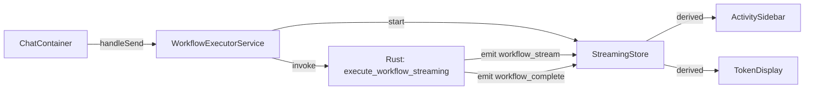
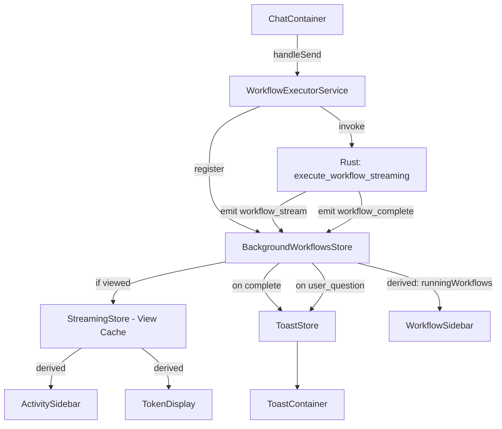
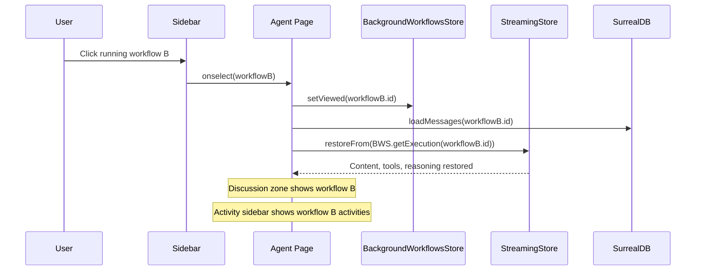

# Specification - Background Workflow Execution with Multi-Workflow Support

## Metadata
- Date: 2026-02-06
- Stack: Svelte 5.49.1 + Rust 1.91.1 + Tauri 2 + SurrealDB 2.5.0
- Complexity: complex

## Context

**Demande**: Les workflows de la page agent doivent fonctionner en arriere-plan. Mettre en place un systeme visuel dans la sidebar de gauche pour indiquer les workflows en cours et finis. Systeme de notification (toast) quand les workflows sont termines. Pouvoir cliquer sur un workflow en cours dans la sidebar pour afficher sa zone de discussion et son activity sidebar. Le multi-workflow ne fonctionne qu'en mode automatique (validation). Avertissement securite en auto, message info en manuel/selectif.

**Objectif**: Permettre l'execution simultanee de workflows en arriere-plan avec navigation fluide entre eux, notifications visuelles et gestion intelligente des UserQuestion.

**Perimetre**:
- Inclus: Background execution, sidebar indicators, toast system, workflow switching, UserQuestion background, validation mode gating
- Exclus: Nouvelles fonctionnalites d'agent, modifications du protocole MCP, changes UI settings au-dela des banners

**Criteres Succes**:
- [ ] Workflows continuent en arriere-plan quand l'utilisateur navigue
- [ ] Sidebar gauche montre sections "En cours" et "Termines recemment"
- [ ] Toast notification a la completion des workflows
- [ ] Toast persistant pour UserQuestion en arriere-plan
- [ ] Clic sur workflow en cours restore discussion + activity
- [ ] Max 3 concurrent en mode auto, 1 en manuel/selectif
- [ ] Warnings dans settings validation

---

## Key Design Decisions

| Decision | Choice | Rationale |
|----------|--------|-----------|
| Store architecture | Map-based single store (`backgroundWorkflows`) | Matches backend HashMap pattern, single event dispatch |
| StreamingStore role | View-layer cache for currently viewed workflow | Minimal changes to existing UI components |
| Event listener ownership | `backgroundWorkflowsStore` owns global Tauri listeners | Single dispatch point, forwards to streamingStore for viewed workflow |
| Toast placement | `+layout.svelte` (global) | Visible on all pages, not just agent page |
| Concurrent limit | Frontend primary (3) + backend safety net | Frontend for UX, backend for race conditions |
| Multi-workflow gating | Only in `auto` validation mode | Manual/selective modes require human validation responses which block execution |
| UserQuestion background | Persistent toast + deferred modal | Non-intrusive, user controls when to answer |

---

## Validation Mode Constraints

- **`auto` mode**: Multi-workflow enabled (up to 3 concurrent). Show warning in settings about security/risk of automated parallel execution.
- **`manual` mode**: Single workflow only. Show info message in settings explaining validation requires focused attention.
- **`selective` mode**: Single workflow only (same reason as manual - some operations need human approval).
- **Runtime enforcement**: `backgroundWorkflowsStore.canStart()` checks validation mode. If not `auto`, limit is 1.

---

## Architecture

### Current Flow (Single Workflow)


### Proposed Flow (Multi Workflow)


### Workflow Switching Flow


---

## Phase 1: Types & Toast System (Foundation)

### New file: `src/types/background-workflow.ts`
```typescript
import type { ActiveTool, ActiveReasoningStep, ActiveSubAgent, ActiveTask } from '$types/streaming';

export type BackgroundWorkflowStatus = 'running' | 'completed' | 'error' | 'cancelled';

export interface WorkflowStreamState {
  workflowId: string;
  agentId: string;
  workflowName: string;
  status: BackgroundWorkflowStatus;
  content: string;
  tools: ActiveTool[];
  reasoning: ActiveReasoningStep[];
  subAgents: ActiveSubAgent[];
  tasks: ActiveTask[];
  tokensReceived: number;
  error: string | null;
  startedAt: number;
  completedAt: number | null;
  hasPendingQuestion: boolean;
}

export type ToastType = 'success' | 'error' | 'info' | 'warning' | 'user-question';

export interface Toast {
  id: string;
  type: ToastType;
  title: string;
  message: string;
  workflowId?: string;
  persistent: boolean;
  duration: number;
  createdAt: number;
}
```

### New file: `src/lib/stores/toast.ts`
- `toasts` writable store
- `add(toast)`: Add toast, enforce max 5 visible
- `addWorkflowComplete(workflowId, name, status)`: Success/error toast, auto-dismiss 5s
- `addUserQuestion(workflowId, name, question)`: Persistent toast with "Go to workflow" action
- `dismiss(toastId)`, `dismissForWorkflow(workflowId)`, `clear()`

### New files: `src/lib/components/ui/ToastContainer.svelte` + `ToastItem.svelte`
- Fixed bottom-right position, stacking up
- ToastItem: icon (based on type), title, message, optional "Go to workflow" button, dismiss X
- CSS using existing design tokens (`--color-success`, `--color-error`, etc.)
- Entry/exit transitions

### Modified: `src/routes/+layout.svelte`
- Add `<ToastContainer />` after `AppContainer`

**Validation**: `npm run check` passes, toast visible on all pages

---

## Phase 2: Background Workflows Store (Core Engine)

### New file: `src/lib/stores/backgroundWorkflows.ts`

**State:**
```typescript
interface BackgroundWorkflowsState {
  executions: Map<string, WorkflowStreamState>;
  viewedWorkflowId: string | null;
}
```

**Methods:**
- `init()`: Set up global Tauri event listeners (`workflow_stream`, `workflow_complete`)
- `register(workflowId, agentId, workflowName)`: Add to map, enforce limit
- `canStart()`: Check limit (3 if auto mode, 1 otherwise) via validation settings
- `updateFromChunk(chunk)`: Route to correct map entry by `chunk.workflow_id`
- `markComplete(workflowId, status, error?)`: Update status, set completedAt
- `setViewed(workflowId)`: Change viewed workflow pointer
- `setHasPendingQuestion(workflowId, value)`: Mark pending UserQuestion
- `cleanup()`: Remove completed workflows older than 10 minutes
- `destroy()`: Unlisten Tauri events

**Derived stores:**
- `runningWorkflows`: `Map.values()` filtered by `status === 'running'`
- `recentlyCompletedWorkflows`: filtered by `status !== 'running'`
- `runningCount`: count of running
- `canStartNew`: `runningCount < limit` (limit depends on validation mode)
- `viewedExecution`: state for currently viewed workflow

**Event listener logic:**
```
on workflow_stream chunk:
  1. updateFromChunk(chunk) -> updates background map
  2. if chunk.workflow_id === viewedWorkflowId -> forward to streamingStore
  3. if chunk_type === 'user_question_start':
     a. setHasPendingQuestion(workflowId, true)
     b. if NOT viewed -> toastStore.addUserQuestion(...)
     c. if viewed -> let userQuestionStore handle modal normally

on workflow_complete:
  1. markComplete(workflowId, status, error)
  2. if viewed -> forward to streamingStore
  3. toastStore.addWorkflowComplete(...)
```

**Validation**: Unit test store logic, verify chunk routing

---

## Phase 3: Refactor Streaming Store (View Adapter)

### Modified: `src/lib/stores/streaming.ts`

**Changes:**
- **Remove** its own Tauri event listeners (backgroundWorkflows owns them now)
- **Add** `processChunkDirect(chunk)`: Process chunk without filtering (called by backgroundWorkflows)
- **Add** `processCompleteDirect(complete)`: Process completion without filtering
- **Add** `restoreFrom(state: WorkflowStreamState)`: Populate store from background state (for workflow switching)
- **Keep** all existing derived stores and internal logic
- **Keep** `start(workflowId)` but it no longer sets up listeners
- **Keep** `reset()` for cleanup

**Validation**: Existing streaming behavior still works for viewed workflow

---

## Phase 4: Refactor Workflow Executor

### Modified: `src/lib/services/workflowExecutor.service.ts`

**Changes:**
- Check `backgroundWorkflowsStore.canStart()` before execution -> show toast warning if at limit
- `register()` workflow in background store at start
- Conditional `streamingStore.start()` only if workflow is currently viewed
- Conditional `streamingStore.reset()` only if workflow is viewed AND completed
- Token store updates conditional on viewed workflow
- Activity capture happens for all workflows (not just viewed)

**Validation**: Start multiple workflows, verify independent execution

---

## Phase 5: Sidebar Visual Indicators

### Modified: `src/lib/components/agent/WorkflowSidebar.svelte`
- New props: `runningWorkflowIds: Set<string>`, `recentlyCompletedIds: Set<string>`, `questionPendingIds: Set<string>`
- Pass to WorkflowList

### Modified: `src/lib/components/workflow/WorkflowList.svelte`
- Split rendering into sections:
  1. **"En cours"** header + running workflows (filtered by `runningWorkflowIds`)
  2. **"Termines recemment"** header + recently completed (filtered by `recentlyCompletedIds`)
  3. **Remaining workflows** (existing list, excluding above)
- Section headers use `--font-size-xs`, `--color-text-tertiary`, uppercase

### Modified: `src/lib/components/workflow/WorkflowItem.svelte`
- New props: `running?: boolean`, `hasQuestion?: boolean`
- When `running`: Show pulsing dot (green, `--color-status-running`, `@keyframes pulse`)
- When `hasQuestion`: Show small orange badge indicator
- When recently completed: Show status badge (green check or red X)

### Modified: `src/lib/components/workflow/WorkflowItemCompact.svelte`
- Same changes as WorkflowItem for compact mode

**Validation**: Visual verification - running workflows show at top with pulsing dot

---

## Phase 6: Agent Page Integration

### Modified: `src/routes/agent/+page.svelte`

**New subscriptions:**
- `$runningWorkflows`, `$recentlyCompletedWorkflows` from backgroundWorkflowsStore
- Compute `runningWorkflowIds`, `recentlyCompletedIds`, `questionPendingIds` as derived Sets

**Workflow switching (`selectWorkflow`):**
1. Set `backgroundWorkflowsStore.setViewed(workflowId)`
2. Load messages from DB (existing `loadWorkflowData`)
3. If workflow is running in background:
   - `streamingStore.restoreFrom(backgroundWorkflowsStore.getExecution(workflowId))`
   - Token store restore
4. If workflow is not running: normal load (existing behavior)
5. Load activities (existing `activityStore.loadHistorical`)

**`handleSend` changes:**
- Check `canStartNew` before executing
- If at limit, show warning toast and prevent execution

**Lifecycle:**
- `onMount`: `backgroundWorkflowsStore.init()`
- `onDestroy`: `backgroundWorkflowsStore.destroy()`

**Validation**: Full E2E - start workflow, navigate away, come back, see accumulated content

---

## Phase 7: UserQuestion Background Support

### Modified: `src/lib/stores/userQuestion.ts`
- `handleQuestionStart(payload, workflowId)`: Accept and store `workflowId`
- If workflow is NOT currently viewed: do NOT open modal (toast handles notification)
- If workflow IS viewed: open modal as before
- `getQuestionsForWorkflow(workflowId)`: Filter pending questions by workflow
- On question answered: call `backgroundWorkflowsStore.setHasPendingQuestion(workflowId, false)` + `toastStore.dismissForWorkflow(workflowId)`

### Toast navigation flow:
1. User clicks "Go to workflow" on persistent UserQuestion toast
2. Toast handler calls agent page's `selectWorkflow(workflowId)`
3. Page switches to that workflow
4. UserQuestion modal opens for the pending question
5. User answers -> question submitted -> toast dismissed -> pulsing badge removed

**Validation**: Start background workflow, trigger UserQuestion, verify persistent toast, click "Go to workflow", verify modal opens

---

## Phase 8: Validation Mode Integration

### Modified: `src/lib/components/settings/validation/ValidationSettings.svelte`
- When user selects `auto` mode: Show warning banner:
  > "Mode automatique: les operations seront approuvees sans confirmation. Le mode multi-workflow (jusqu'a 3 simultanes) sera disponible. Assurez-vous de comprendre les risques de securite."
- When user selects `manual` or `selective` mode: Show info banner:
  > "Ce mode necessite une validation humaine. Le multi-workflow n'est pas disponible - un seul workflow peut s'executer a la fois."

### Modified: `src/lib/stores/backgroundWorkflows.ts`
- `canStart()` checks validation mode via `validationSettingsStore`:
  - If `auto`: limit = 3
  - If `manual` or `selective`: limit = 1
- When user tries to start a 2nd workflow in manual/selective: show toast explaining single-workflow limitation

**Validation**: Switch modes in settings, verify banners appear correctly

---

## Phase 9: Backend Safety Net

### Modified: `src-tauri/src/commands/streaming.rs`
- At start of `execute_workflow_streaming`:
  ```rust
  let settings = load_validation_settings(&state.db).await;
  let max_concurrent = if settings.mode == ValidationMode::Auto { 3 } else { 1 };
  let running = state.streaming_cancellations.lock().await.len();
  if running >= max_concurrent {
      return Err(format!("Maximum concurrent workflows ({}) reached", max_concurrent));
  }
  ```

**Validation**: `cargo clippy -- -D warnings` + `cargo test` pass

---

## Phase 10: Polish & Edge Cases

- **Delete running workflow**: Cancel first, then delete. Show confirmation modal.
- **Navigate away from agent page**: Background store persists, toasts still visible (in layout).
- **Token display switching**: Restore token data from `WorkflowStreamState` when switching.
- **Activity store**: `captureStreamingActivities()` called for ALL completing workflows, not just viewed.
- **i18n**: Add keys for all new strings (section headers, toast messages, warnings, limit messages).
- **Cleanup**: Auto-remove completed workflows from background store after 10 minutes.
- **Workflow status sync**: When background workflow completes, update `workflowStore` status (call `loadWorkflows()`).

---

## Files Summary

### New Files (5)
| File | Purpose |
|------|---------|
| `src/types/background-workflow.ts` | Types for background state and toasts |
| `src/lib/stores/toast.ts` | Toast notification store |
| `src/lib/stores/backgroundWorkflows.ts` | Multi-workflow background execution store |
| `src/lib/components/ui/ToastContainer.svelte` | Toast container (fixed bottom-right) |
| `src/lib/components/ui/ToastItem.svelte` | Individual toast component |

### Modified Files (11)
| File | Changes |
|------|---------|
| `src/routes/+layout.svelte` | Add ToastContainer |
| `src/lib/stores/streaming.ts` | Remove listeners, add restoreFrom/processChunkDirect |
| `src/lib/stores/userQuestion.ts` | Add workflowId support, conditional modal |
| `src/lib/services/workflowExecutor.service.ts` | Concurrent check, background registration |
| `src/routes/agent/+page.svelte` | Subscribe to background store, workflow switching, pass sidebar props |
| `src/lib/components/agent/WorkflowSidebar.svelte` | New props for running/completed/question IDs |
| `src/lib/components/workflow/WorkflowList.svelte` | Section-based rendering (running/completed/all) |
| `src/lib/components/workflow/WorkflowItem.svelte` | Pulsing dot, question badge |
| `src/lib/components/workflow/WorkflowItemCompact.svelte` | Same as WorkflowItem |
| `src/lib/components/settings/validation/ValidationSettings.svelte` | Warning/info banners per mode |
| `src-tauri/src/commands/streaming.rs` | Concurrent limit check based on validation mode |

---

## Risks

| Risk | Probability | Impact | Mitigation |
|------|-------------|--------|------------|
| State desync between background + streaming store | Medium | High | Single event dispatch point in backgroundWorkflowsStore |
| Memory leak from accumulated streaming data | Low | Medium | 10-min auto-cleanup for completed workflows |
| Race condition on concurrent limit | Low | Low | Backend safety net check in Rust |
| UserQuestion toast not dismissed | Low | Medium | Dismiss on answer + on workflow complete + manual dismiss |
| Tauri events broadcast performance with 3 workflows | Low | Low | Lightweight chunk processing, no DOM until viewed |

---

## Tests

### Frontend (Vitest)
- Toast store: add, dismiss, auto-dismiss, max 5, persistent
- Background workflows store: register, canStart limits, chunk routing, markComplete
- Streaming store: restoreFrom, processChunkDirect

### Backend (Rust)
- Concurrent limit enforcement in execute_workflow_streaming
- Validation mode check for max_concurrent

### E2E (Playwright)
- Start workflow, navigate away, verify background execution continues
- Toast appears on completion
- Click running workflow in sidebar, verify content restored
- Multi-workflow limit enforced per validation mode

---

## References
- Architecture: `docs/TECH_STACK.md`
- Validation types: `src/types/validation.ts`
- Streaming store: `src/lib/stores/streaming.ts`
- Workflow executor: `src/lib/services/workflowExecutor.service.ts`
- Backend streaming: `src-tauri/src/commands/streaming.rs`
- UserQuestion tool: `src-tauri/src/tools/user_question/tool.rs`
- Validation helper: `src-tauri/src/tools/validation_helper.rs`
