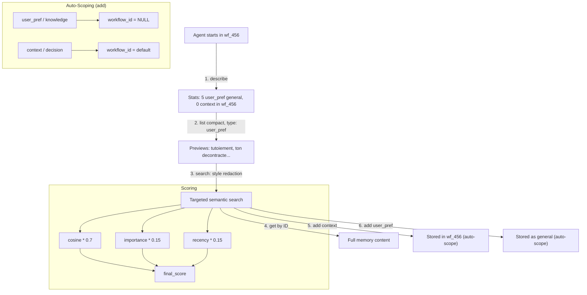

# Specification - Memory Tool v2

## Metadata
- Date: 2026-02-07
- Stack: Svelte 5.49.1 + Rust 1.91.1 + Tauri 2.9.3 + SurrealDB 2.5.0
- Complexity: medium
- Spec ID: MEM-V2

## Context

**Demand**: Improve the MemoryTool used as an inter-agent knowledge bus during workflows and as a persistent user preference store.

**Objective**: Better agent discovery (index before search), cleaner scope management, improved search relevance, and code deduplication.

**Scope**:
- Included: describe operation, compact list, importance field, TTL/expiration, scope refactoring, code deduplication
- Excluded: new memory types, hybrid search, frontend explorer, memory consolidation/decay

**Success Criteria**:
- [ ] Agents can discover available memories before searching (describe + compact)
- [ ] Search ranking factors in importance and recency
- [ ] Context memories auto-expire via TTL
- [ ] No duplicated search logic between commands and tool
- [ ] Scope passed per-operation (no more activate_workflow/activate_general)
- [ ] All existing tests pass + new tests for new features

## Current State

### Architecture

```
Frontend (Svelte)                    Backend (Rust)
  src/types/memory.ts         -->    src-tauri/src/models/memory.rs
  src/lib/components/               src-tauri/src/tools/memory/
    settings/memory/                   tool.rs (1745 lines)
      MemorySettings.svelte            helpers.rs
      MemoryForm.svelte              src-tauri/src/commands/memory.rs
      MemoryList.svelte
```

### DB Schema (current)

```sql
DEFINE TABLE memory SCHEMAFULL;
DEFINE FIELD type ON memory TYPE string ASSERT $value IN ['user_pref','context','knowledge','decision'];
DEFINE FIELD content ON memory TYPE string;
DEFINE FIELD embedding ON memory TYPE option<array<float>>;
DEFINE FIELD workflow_id ON memory TYPE option<string>;
DEFINE FIELD metadata ON memory TYPE object;
DEFINE FIELD metadata.tags ON memory TYPE option<array<string>>;
DEFINE FIELD metadata.priority ON memory TYPE option<float>;
DEFINE FIELD metadata.agent_source ON memory TYPE option<string>;
DEFINE FIELD created_at ON memory TYPE datetime DEFAULT time::now();

DEFINE INDEX memory_vec_idx ON memory FIELDS embedding HNSW DIMENSION 1024 DIST COSINE;
DEFINE INDEX memory_workflow_idx ON memory FIELDS workflow_id;
DEFINE INDEX memory_type_workflow_idx ON memory FIELDS type, workflow_id;
DEFINE INDEX memory_type_created_idx ON memory FIELDS type, created_at;
```

### Code Duplication Issue

`commands/memory.rs` contains its own `vector_search()` (L331-L448) and `text_search()` (L450-L524) functions that duplicate the logic in `tool.rs` `vector_search()` (L425-L512) and `text_search()` (L514-L586). Same query patterns, same scoring, independent implementations.

### Scope Issue

`MemoryTool` holds mutable scope state via `Arc<RwLock<Option<String>>>`. Operations `activate_workflow`/`activate_general` modify this hidden state. The Tauri commands handle scope differently (direct `workflow_id` parameter).

---

## Changes Summary

| # | Change | Type | Impact |
|---|--------|------|--------|
| 1 | `describe` operation | New feature | Agent discovery |
| 2 | `list` mode `compact` | Enhancement | Token efficiency |
| 3 | `importance` field | Schema + logic | Better search ranking |
| 4 | `expires_at` TTL field | Schema + logic | Auto-cleanup of stale context |
| 5 | Scope per-operation + auto-scoping by type | Refactor | Remove hidden state, cross-workflow user_pref |
| 6 | Deduplicate search logic | Refactor | DRY, single source of truth |

---

## Change 1: Operation `describe`

### Purpose

Give agents a lightweight overview of what's in memory BEFORE searching. Zero content returned, just statistics.

### Tool Input

```json
{
  "operation": "describe",
  "scope": "both",           // optional: "workflow", "general", "both" (default)
  "workflow_id": "wf_xxx"    // optional: required if scope includes "workflow"
}
```

### Tool Output

```json
{
  "success": true,
  "total": 23,
  "by_type": {
    "user_pref": 4,
    "context": 12,
    "knowledge": 5,
    "decision": 2
  },
  "tags": ["tone", "style", "api", "surrealdb"],
  "scope": "both",
  "workflow_id": "wf_xxx",
  "workflow_count": 8,
  "general_count": 15,
  "oldest": "2026-01-15T10:00:00Z",
  "newest": "2026-02-07T14:30:00Z"
}
```

### Implementation

**Backend query** (single aggregation, no content fetched):

```sql
-- Count by type (respecting scope)
SELECT type, count() AS cnt
FROM memory
WHERE (expires_at IS NONE OR expires_at > time::now())
  AND (workflow_id = $workflow_id OR workflow_id IS NONE)
GROUP BY type;

-- Distinct tags
SELECT array::distinct(array::flatten(metadata.tags)) AS tags
FROM memory
WHERE (expires_at IS NONE OR expires_at > time::now())
  AND (workflow_id = $workflow_id OR workflow_id IS NONE);

-- Date range
SELECT math::min(created_at) AS oldest, math::max(created_at) AS newest
FROM memory
WHERE (expires_at IS NONE OR expires_at > time::now())
  AND (workflow_id = $workflow_id OR workflow_id IS NONE);
```

**Files to modify**:
- `src-tauri/src/tools/memory/tool.rs`: Add `describe()` method + dispatch in `execute()`
- `src-tauri/src/tools/memory/helpers.rs`: Add `describe_memories()` shared helper
- `src-tauri/src/commands/memory.rs`: Add `describe_memories` Tauri command
- `src/types/memory.ts`: Add `MemoryDescribeResult` interface

**New type (Rust)**:

```rust
#[derive(Debug, Clone, Serialize, Deserialize)]
pub struct MemoryDescribeResult {
    pub total: usize,
    pub by_type: HashMap<String, usize>,
    pub tags: Vec<String>,
    pub workflow_count: usize,
    pub general_count: usize,
    #[serde(skip_serializing_if = "Option::is_none")]
    pub oldest: Option<DateTime<Utc>>,
    #[serde(skip_serializing_if = "Option::is_none")]
    pub newest: Option<DateTime<Utc>>,
}
```

**New type (TypeScript)**:

```typescript
export interface MemoryDescribeResult {
  total: number;
  by_type: Record<MemoryType, number>;
  tags: string[];
  workflow_count: number;
  general_count: number;
  oldest?: string;
  newest?: string;
}
```

---

## Change 2: List Mode `compact`

### Purpose

Return truncated previews instead of full content. Agents get a "table of contents" using fewer tokens.

### Tool Input

```json
{
  "operation": "list",
  "mode": "compact",           // NEW: "full" (default, current behavior) or "compact"
  "type_filter": "user_pref",  // optional
  "limit": 20,                 // optional
  "scope": "both",             // optional
  "workflow_id": "wf_xxx"      // optional
}
```

### Tool Output (compact mode)

```json
{
  "success": true,
  "count": 4,
  "mode": "compact",
  "memories": [
    {
      "id": "xxx",
      "type": "user_pref",
      "preview": "L'utilisateur prefere un ton decontracte et le tu...",
      "tags": ["tone", "style"],
      "importance": 0.8,
      "workflow_id": null,
      "created_at": "2026-02-01T10:00:00Z"
    }
  ]
}
```

### Implementation

**Backend**: Same query as current `list`, but in compact mode:
- Truncate `content` to first 100 characters + "..." if longer
- Extract `metadata.tags` as top-level field
- Extract `importance` as top-level field
- Skip `metadata` object in response

**Constant**:

```rust
pub const COMPACT_PREVIEW_LENGTH: usize = 100;
```

**Files to modify**:
- `src-tauri/src/tools/memory/tool.rs`: Add `mode` parameter to `list_memories()`, truncate content in compact mode
- `src-tauri/src/tools/constants.rs`: Add `COMPACT_PREVIEW_LENGTH`
- Input schema: Add `"mode"` property

---

## Change 3: `importance` Field

### Purpose

Differentiate critical memories (user preferences) from ephemeral ones (workflow context). Factors into search ranking.

### Schema Change

```sql
-- New field with default value
DEFINE FIELD importance ON memory TYPE float DEFAULT 0.5;
```

**Migration** (for existing memories):

```sql
-- Migration: Set importance for existing records
UPDATE memory SET importance = 0.5 WHERE importance IS NONE;
```

**Default importance by type** (in code, not schema):

| Type | Default Importance |
|------|-------------------|
| `user_pref` | 0.8 |
| `decision` | 0.7 |
| `knowledge` | 0.6 |
| `context` | 0.3 |

### Scoring Formula

**Vector search** (new ranking):

```
final_score = cosine_similarity * 0.7
            + importance * 0.15
            + recency_score * 0.15
```

Where `recency_score` = 1.0 for now, decays to 0.0 over 30 days. Computed entirely in SurrealQL (no Rust-side scoring).

**SQL implementation** (in vector_search query):

```sql
SELECT
    meta::id(id) AS id,
    type,
    content,
    workflow_id,
    metadata,
    importance,
    created_at,
    vector::similarity::cosine(embedding, [$embedding]) AS cosine_score,
    -- Composite score with importance + recency (all in SurrealQL)
    (vector::similarity::cosine(embedding, [$embedding]) * 0.7
     + importance * 0.15
     + (1.0 - math::clamp(
         duration::secs(time::now() - created_at) / (30.0 * 24.0 * 3600.0),
         0.0,
         1.0
       )) * 0.15
    ) AS score
FROM memory
WHERE embedding IS NOT NONE
  AND vector::distance::cosine(embedding, [$embedding]) < $distance
  AND (expires_at IS NONE OR expires_at > time::now())
ORDER BY score DESC
LIMIT $limit
```

### Files to modify

- `src-tauri/src/db/schema.rs`: Add `importance` field definition
- `src-tauri/src/commands/migration.rs`: Migration for existing data
- `src-tauri/src/models/memory.rs`: Add `importance: f64` to `Memory`, `MemoryCreate`, `MemoryCreateWithEmbedding`
- `src-tauri/src/tools/memory/tool.rs`: Default importance by type in `add_memory()`, new scoring in search
- `src-tauri/src/tools/memory/helpers.rs`: Update `AddMemoryParams` and `add_memory_core()`
- `src-tauri/src/tools/constants.rs`: Add importance defaults
- `src/types/memory.ts`: Add `importance` to `Memory` interface
- `src-tauri/src/commands/memory.rs`: Update vector_search/text_search scoring (before dedup, or after)

**New constants**:

```rust
pub mod memory {
    // ... existing ...
    pub const DEFAULT_IMPORTANCE: f64 = 0.5;
    pub const IMPORTANCE_USER_PREF: f64 = 0.8;
    pub const IMPORTANCE_DECISION: f64 = 0.7;
    pub const IMPORTANCE_KNOWLEDGE: f64 = 0.6;
    pub const IMPORTANCE_CONTEXT: f64 = 0.3;
    pub const COMPACT_PREVIEW_LENGTH: usize = 100;
    pub const RECENCY_DECAY_DAYS: f64 = 30.0;
    // Scoring weights
    pub const SCORE_WEIGHT_COSINE: f64 = 0.70;
    pub const SCORE_WEIGHT_IMPORTANCE: f64 = 0.15;
    pub const SCORE_WEIGHT_RECENCY: f64 = 0.15;
}
```

---

## Change 4: `expires_at` TTL

### Purpose

Context memories from finished workflows auto-expire. User preferences persist forever.

### Schema Change

```sql
DEFINE FIELD expires_at ON memory TYPE option<datetime>;
```

### TTL Behavior

| Type | Default TTL |
|------|------------|
| `context` | 7 days |
| `knowledge` | None (permanent) |
| `decision` | None (permanent) |
| `user_pref` | None (permanent) |

**On add**: If type is `context` and no explicit `expires_at` given, set `expires_at = time::now() + 7d`. This aligns with auto-scoping: context memories are workflow-scoped AND time-limited.

**On query**: All SELECT queries add filter:
```sql
WHERE (expires_at IS NONE OR expires_at > time::now())
```

**Cleanup command** (optional, called periodically or manually):
```sql
DELETE FROM memory WHERE expires_at IS NOT NONE AND expires_at < time::now();
```

### Files to modify

- `src-tauri/src/db/schema.rs`: Add `expires_at` field
- `src-tauri/src/commands/migration.rs`: Migration for schema
- `src-tauri/src/models/memory.rs`: Add `expires_at: Option<DateTime<Utc>>` to all memory structs
- `src-tauri/src/tools/memory/tool.rs`: Set TTL on context add, add filter to all queries
- `src-tauri/src/tools/memory/helpers.rs`: Pass `expires_at` through `AddMemoryParams`
- `src-tauri/src/commands/memory.rs`: Add filter to all queries
- `src-tauri/src/tools/constants.rs`: Add TTL constants
- `src/types/memory.ts`: Add `expires_at?: string` to `Memory`

**New constants**:

```rust
pub mod memory {
    // ... existing ...
    pub const DEFAULT_CONTEXT_TTL_DAYS: i64 = 7;
}
```

---

## Change 5: Scope Per-Operation with Auto-Scoping by Type

### Purpose

Remove hidden mutable state (`activate_workflow` / `activate_general`). Pass scope explicitly in each operation. And most importantly: **auto-scope memories based on their type** so agents don't have to think about it.

### Problem with Previous Design

With the old `activate_workflow`/`activate_general` AND with a naive `default_workflow_id`, user preferences get trapped inside the workflow where they were created:

```
Workflow wf_123:
  Agent stores user_pref "prefere le tutoiement" → stored with workflow_id = "wf_123"

Workflow wf_456 (later):
  Agent searches "preferences communication" with scope "both"
  → Searches wf_456 + general (workflow_id IS NONE)
  → Does NOT find wf_123's user_pref! Preference is lost.
```

### Solution: Auto-Scoping by Memory Type

The memory type determines its natural scope automatically:

| Type | Storage Scope | Reason |
|------|--------------|--------|
| `user_pref` | **General** (always) | Preferences apply everywhere |
| `knowledge` | **General** (always) | Knowledge is reusable across workflows |
| `context` | **Workflow** (always) | Temporary, tied to this workflow run |
| `decision` | **Workflow** (always) | Rationale tied to this specific workflow |

The agent doesn't need to think about it. The tool decides based on the type:

```
Workflow wf_123 (Agent Recherche):
  {"operation": "add", "type": "user_pref", "content": "prefere le tutoiement"}
  → Tool sees type=user_pref → stores with workflow_id=NULL (general)

  {"operation": "add", "type": "context", "content": "resultats recherche web..."}
  → Tool sees type=context → stores with workflow_id="wf_123" (scoped)

Workflow wf_456 (Agent Redacteur, later):
  {"operation": "search", "query": "preferences communication", "scope": "both"}
  → Searches wf_456 + general
  → FINDS the user_pref! (it's in general)
```

### What Changes

**Remove**:
- `MemoryTool.workflow_id: Arc<RwLock<Option<String>>>` field
- `activate_workflow()` method
- `activate_general()` method
- `current_workflow_id()` method
- `"activate_workflow"` and `"activate_general"` from operations enum

**Add**: Auto-scoping logic + explicit override via `scope` parameter.

### MemoryTool Struct (new)

```rust
pub struct MemoryTool {
    db: Arc<DBClient>,
    embedding_service: Option<Arc<EmbeddingService>>,
    // REMOVED: workflow_id: Arc<RwLock<Option<String>>>
    default_workflow_id: Option<String>,  // Set at creation, immutable
    agent_id: String,
}
```

The `default_workflow_id` is set by `ToolFactory` when the workflow starts. It's immutable.

### Auto-Scoping Logic (for `add` operation)

```rust
/// Types that are naturally general (cross-workflow)
const GENERAL_TYPES: &[&str] = &["user_pref", "knowledge"];
/// Types that are naturally workflow-scoped
const WORKFLOW_TYPES: &[&str] = &["context", "decision"];

/// Determines the workflow_id to store on a new memory.
/// Priority: 1) explicit scope override, 2) auto-scope by type
fn resolve_storage_scope(&self, memory_type: &str, input: &MemoryInput) -> Option<String> {
    // Agent can override with explicit scope parameter
    if let Some(ref scope) = input.scope {
        return match scope.as_str() {
            "general" => None,
            "workflow" => self.default_workflow_id.clone(),
            _ => self.default_workflow_id.clone(),
        };
    }

    // Auto-scope based on memory type
    if GENERAL_TYPES.contains(&memory_type) {
        None  // user_pref, knowledge → always general
    } else {
        self.default_workflow_id.clone()  // context, decision → workflow-scoped
    }
}
```

### Scope Resolution Logic (for `list`, `search`, `describe`)

Query-side scope uses the existing `scope` parameter (`"both"`, `"workflow"`, `"general"`):

```rust
/// Resolves the workflow_id for query filtering.
/// Uses default_workflow_id when scope includes "workflow".
fn resolve_query_workflow_id(&self, input: &MemoryInput) -> Option<String> {
    // Explicit workflow_id in input takes priority over default
    input.workflow_id.clone().or(self.default_workflow_id.clone())
}
```

Query behavior:
- `scope: "both"` (default) → `workflow_id = $wf_id OR workflow_id IS NONE`
- `scope: "workflow"` → `workflow_id = $wf_id`
- `scope: "general"` → `workflow_id IS NONE`

### Example: Full Cross-Workflow Flow

```
=== Workflow wf_123 (Agent Recherche) ===
MemoryTool created with default_workflow_id = "wf_123"

1. {"operation": "add", "type": "user_pref", "content": "prefere le tutoiement"}
   → auto-scope: user_pref → general → stored with workflow_id = NULL

2. {"operation": "add", "type": "context", "content": "resultats recherche API"}
   → auto-scope: context → workflow → stored with workflow_id = "wf_123"

3. {"operation": "add", "type": "knowledge", "content": "SurrealDB HNSW max 1024D"}
   → auto-scope: knowledge → general → stored with workflow_id = NULL

4. {"operation": "add", "type": "decision", "content": "choisi Mistral pour embeddings"}
   → auto-scope: decision → workflow → stored with workflow_id = "wf_123"

=== Workflow wf_456 (Agent Redacteur, 2 days later) ===
MemoryTool created with default_workflow_id = "wf_456"

5. {"operation": "describe"}
   → total: 4, by_type: {user_pref: 1, knowledge: 1, context: 1, decision: 1}
   → general_count: 2 (user_pref + knowledge), workflow_count: 0 (wf_456 has nothing)

6. {"operation": "search", "query": "preferences utilisateur"}
   → scope defaults to "both" → searches wf_456 + general
   → FINDS: "prefere le tutoiement" (general)

7. {"operation": "search", "query": "choix technique embeddings", "scope": "general"}
   → searches only general
   → FINDS: "SurrealDB HNSW max 1024D"
   → Does NOT find: "choisi Mistral" (it's in wf_123, not general)

8. {"operation": "add", "type": "context", "content": "brouillon article redige"}
   → auto-scope: context → workflow → stored with workflow_id = "wf_456"

=== Override example ===
9. {"operation": "add", "type": "decision", "content": "politique globale: RGPD", "scope": "general"}
   → explicit override → stored with workflow_id = NULL (even though decision normally scopes to workflow)
```

### Operations After Refactor

| Operation | Scope-aware | Auto-scope (add) | Query scope (list/search) |
|-----------|-------------|-------------------|--------------------------|
| `describe` | Yes | N/A | Uses `scope` param for filtering |
| `add` | Yes | **By type** (user_pref/knowledge → general, context/decision → workflow) | N/A |
| `list` | Yes | N/A | Uses `scope` param for filtering |
| `search` | Yes | N/A | Uses `scope` param for filtering |
| `get` | No | N/A | N/A (by ID) |
| `delete` | No | N/A | N/A (by ID) |
| `clear_by_type` | Yes | N/A | Uses `scope` param for filtering |

### Input Schema Change

Remove `activate_workflow`/`activate_general` from operations enum. Add to schema:

```json
"scope": {
    "type": "string",
    "enum": ["workflow", "general", "both"],
    "default": "both",
    "description": "For add: override auto-scoping ('general' forces cross-workflow, 'workflow' forces workflow-scoped). For list/search/describe: filter scope."
}
```

The existing `workflow_id` parameter remains for explicit override (rare):

```json
"workflow_id": {
    "type": "string",
    "description": "Override the default workflow context. Rarely needed - the tool auto-detects from its creation context."
}
```

### New Constants

```rust
pub mod memory {
    // ... existing ...
    /// Types that are stored as general (cross-workflow) by default
    pub const GENERAL_SCOPE_TYPES: &[&str] = &["user_pref", "knowledge"];
    /// Types that are stored as workflow-scoped by default
    pub const WORKFLOW_SCOPE_TYPES: &[&str] = &["context", "decision"];
}
```

### Files to modify

- `src-tauri/src/tools/memory/tool.rs`: Remove RwLock, add `default_workflow_id`, add `resolve_storage_scope()`, add `resolve_query_workflow_id()`, remove activate_* operations, update all methods
- `src-tauri/src/tools/memory/helpers.rs`: Update `AddMemoryParams` to accept resolved `workflow_id` (no change to helper logic, scope resolved before calling helper)
- `src-tauri/src/tools/factory.rs`: Pass `workflow_id` as `default_workflow_id`
- `src-tauri/src/tools/constants.rs`: Add `GENERAL_SCOPE_TYPES` and `WORKFLOW_SCOPE_TYPES`
- Tool definition: Remove `activate_workflow`/`activate_general` from schema, update `scope` description

### Breaking Change Mitigation

The `activate_workflow`/`activate_general` operations are used by LLM agents via function calling. Removing them is a schema change that agents will see in the tool definition. Since agents read the tool definition each time, they will adapt automatically. No frontend code calls these operations.

---

## Change 6: Deduplicate Search Logic

### Purpose

`commands/memory.rs` has its own `vector_search()` and `text_search()` functions (~200 lines) that duplicate `tool.rs` logic. Factor into `helpers.rs`.

### What Moves to `helpers.rs`

```rust
// New shared search helpers

pub struct SearchParams {
    pub query_text: String,
    pub limit: usize,
    pub type_filter: Option<String>,
    pub workflow_id: Option<String>,
    pub scope: String,            // "workflow", "general", "both"
    pub threshold: f64,
}

pub async fn search_memories_core(
    params: SearchParams,
    db: &DBClient,
    embedding_service: Option<&Arc<EmbeddingService>>,
) -> Result<Vec<MemorySearchResult>, String>

pub async fn vector_search_core(
    query_embedding: &[f32],
    params: &SearchParams,
    db: &DBClient,
) -> Result<Vec<MemorySearchResult>, String>

pub async fn text_search_core(
    params: &SearchParams,
    db: &DBClient,
) -> Result<Vec<MemorySearchResult>, String>

pub async fn describe_memories_core(
    workflow_id: Option<&str>,
    scope: &str,
    db: &DBClient,
) -> Result<MemoryDescribeResult, String>
```

### Callers After Refactor

**`tool.rs`**:
```rust
async fn search_memories(&self, ...) -> ToolResult<Value> {
    let params = SearchParams { ... };
    let results = search_memories_core(params, &self.db, self.embedding_service.as_ref()).await
        .map_err(ToolError::DatabaseError)?;
    // Format as tool JSON response
}
```

**`commands/memory.rs`**:
```rust
pub async fn search_memories(...) -> Result<Vec<MemorySearchResult>, String> {
    let params = SearchParams { ... };
    search_memories_core(params, &state.db, embedding_service.as_ref()).await
}
```

### Files to modify

- `src-tauri/src/tools/memory/helpers.rs`: Add `SearchParams`, `search_memories_core()`, `vector_search_core()`, `text_search_core()`, `describe_memories_core()`
- `src-tauri/src/tools/memory/tool.rs`: Replace inline search methods with calls to helpers
- `src-tauri/src/commands/memory.rs`: Replace inline search functions with calls to helpers
- `src-tauri/src/tools/memory/mod.rs`: Export new helpers

---

## Architecture After Changes

```
Frontend (Svelte)                    Backend (Rust)
  src/types/memory.ts         -->    src-tauri/src/models/memory.rs
    + MemoryDescribeResult              + importance: f64
    + importance, expires_at            + expires_at: Option<DateTime>
                                        + MemoryDescribeResult

  (No frontend changes              src-tauri/src/tools/memory/
   beyond types)                       tool.rs (simplified, no RwLock)
                                       helpers.rs (search_core, describe_core, add_core)

                                     src-tauri/src/commands/memory.rs
                                       (thin wrappers around helpers)
```

### Data Flow (agent using memories in a workflow)



---

## Implementation Plan

### Phase 1: Schema + Models (no behavior change)

**Objective**: Add new fields to DB schema and Rust/TS models. No logic changes yet.

**Tasks**:
1. **Schema**: Add `importance` and `expires_at` fields to `schema.rs`
2. **Migration**: Add migration in `migration.rs` for existing data
3. **Rust models**: Add fields to `Memory`, `MemoryCreate`, `MemoryCreateWithEmbedding` in `models/memory.rs`
4. **TS types**: Add fields to `Memory`, `CreateMemoryParams` in `types/memory.ts`. Add `MemoryDescribeResult` interface
5. **Constants**: Add new constants to `constants.rs` (importance defaults, TTL, compact preview length, scoring weights)

**Validation**:
- [ ] `cargo clippy` passes
- [ ] `cargo test` passes (existing tests may need minor updates for new fields)
- [ ] `npm run check` passes
- [ ] Schema migration runs without error

### Phase 2: Deduplicate search into helpers

**Objective**: Factor `vector_search` and `text_search` from both `tool.rs` and `commands/memory.rs` into `helpers.rs`. No behavior change yet.

**Tasks**:
1. **helpers.rs**: Add `SearchParams`, `search_memories_core()`, `vector_search_core()`, `text_search_core()`
2. **tool.rs**: Replace `vector_search()` and `text_search()` with calls to helpers
3. **commands/memory.rs**: Replace `vector_search()` and `text_search()` with calls to helpers

**Validation**:
- [ ] `cargo clippy` passes
- [ ] `cargo test` passes (same behavior, different code path)
- [ ] Search results identical to before

### Phase 3: New features (describe + compact + importance + TTL)

**Objective**: Implement all new features using the shared helpers.

**Tasks**:
1. **describe**: Add `describe_memories_core()` to helpers, `describe()` method to tool, `describe_memories` command, dispatch in `execute()`
2. **compact list**: Add `mode` parameter to `list_memories()`, truncate content in compact mode
3. **importance scoring**: Update `add_memory_core()` with default importance by type. Update `vector_search_core()` and `text_search_core()` with composite scoring formula
4. **TTL**: Set `expires_at` on context memories in `add_memory_core()`. Add expiration filter to all query helpers

**Validation**:
- [ ] `describe` returns correct stats
- [ ] `list` compact mode returns truncated previews
- [ ] Search results ranked by composite score (cosine + importance + recency)
- [ ] Context memories have `expires_at` set automatically
- [ ] Expired memories filtered from all queries

### Phase 4: Scope refactoring (auto-scoping + remove activate_*)

**Objective**: Remove hidden scope state. Auto-scope memories by type. Make query scope explicit per-operation.

**Tasks**:
1. **tool.rs**: Remove `workflow_id: Arc<RwLock<Option<String>>>`, add `default_workflow_id: Option<String>`. Add `resolve_storage_scope()` (auto-scope by type for `add`) and `resolve_query_workflow_id()` (for list/search/describe). Remove `activate_workflow()` and `activate_general()` methods. Remove from `execute()` dispatch
2. **MemoryInput**: Remove `activate_workflow`/`activate_general` from validation. Update `scope` parameter description (now also controls storage scope override for `add`)
3. **Tool definition**: Update schema (remove activate_* operations, update scope description with auto-scoping explanation)
4. **factory.rs**: Pass `workflow_id` as `default_workflow_id` at creation
5. **constants.rs**: Add `GENERAL_SCOPE_TYPES` and `WORKFLOW_SCOPE_TYPES`

**Validation**:
- [ ] `user_pref` and `knowledge` memories stored as general (workflow_id = NULL) by default
- [ ] `context` and `decision` memories stored with workflow_id by default
- [ ] Agent can override scope with explicit `"scope": "general"` or `"scope": "workflow"`
- [ ] Query operations (list, search, describe) respect scope parameter
- [ ] Default workflow_id used for query filtering when not specified
- [ ] Tool schema no longer contains activate_* operations
- [ ] `cargo clippy` passes (no dead code warnings from removed methods)

### Phase 5: Tests + Tool Definition

**Objective**: Complete test coverage and updated LLM-facing tool description.

**Tasks**:
1. **Unit tests**: Test describe, compact, importance defaults, TTL setting, scope resolution
2. **Integration tests**: Test describe with data, search with composite scoring, expired memory filtering
3. **Tool definition update**: Rewrite `definition()` description with new operations, examples, best practices
4. **Validation tests**: Update `validate_input_tests` for new operations and removed operations

**Validation**:
- [ ] `cargo test` passes (all new + existing tests)
- [ ] `cargo clippy -- -D warnings` passes
- [ ] `npm run lint` passes
- [ ] `npm run check` passes

---

## Risks

| Risk | Probability | Impact | Mitigation |
|------|-------------|--------|------------|
| SurrealDB aggregation query perf on large datasets | Low | Medium | `describe` uses GROUP BY which is indexed. Add LIMIT safety |
| Composite scoring formula in SurrealQL | Low | Medium | Fonctions `duration::secs()` et `math::clamp()` confirmees dans la doc SurrealDB. Tout en SurrealQL, pas de fallback |
| Removing activate_* breaks existing agent prompts | Low | Low | Agents read tool definition each time. System prompts don't reference these operations |
| Migration on existing data (importance field) | Low | Low | Default value 0.5, UPDATE WHERE IS NONE pattern |
| `expires_at` filter on every query adds overhead | Low | Low | Already indexed by `memory_type_created_idx`. Can add dedicated index if needed |

---

## Not Included (Future)

- Duplicate detection on `add` (cosine > 0.95 check)
- Frontend memory explorer with timeline
- Memory consolidation / decay
- Hybrid search (combined vector + text scoring)
- New memory types beyond the existing 4
- Bulk operations (import/export memories)
