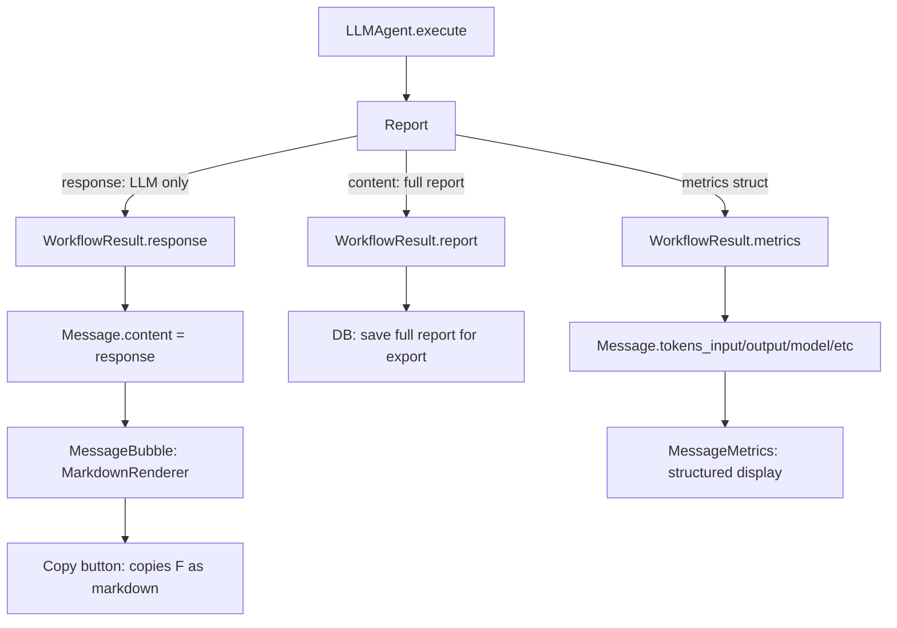

# Specification - Chat Bubble Redesign

## Metadata
- Date: 2026-02-08
- Stack: Svelte 5.49.1 + Rust 1.91.1 + Tauri 2.10 + SurrealDB 2.5.0
- Complexity: medium
- Branch: `feature/chat-bubble-redesign`

## Context

**Request**: Redesign the agent discussion zone to properly separate the LLM response from metadata (metrics, tool usage), render markdown, add copy functionality, and enable real-time token display.

**Current State**: The `MessageBubble` displays the entire `Report.content` as plain text (`white-space: pre-wrap`). This string contains structured markdown with `# Agent Report`, `## Response`, `## Metrics`, `## Tool Usage` sections. Metrics are duplicated: once in the report text, once in `Message` fields. Tokens in the bottom bar (`TokenDisplay`) don't update during execution because `streaming.input` stays at 0.

**Scope**:
- Included: Backend response field, bubble redesign, markdown rendering, copy button, metrics panel, real-time tokens
- Excluded: Streaming text preview (user confirmed activity sidebar suffices), message edit/delete

**Success Criteria**:
- [ ] Bubble shows only the LLM response content, rendered as markdown
- [ ] Metrics + tool usage displayed below the bubble in structured format
- [ ] Copy button copies the response as markdown
- [ ] TokenDisplay updates in real-time during workflow execution (output tokens + speed)
- [ ] No regressions: existing messages still display correctly
- [ ] Backward compatible: old messages (full report) still render gracefully

## Architecture

### Current Flow

```
Rust LLMAgent → Report { content: "# Agent Report...\n## Response\n{llm}\n## Metrics\n..." }
                         ↓
workflow.rs → WorkflowResult { report: report.content, metrics: {...}, tools_used: [...] }
                         ↓
Frontend → Message { content: result.report }  → MessageBubble: {message.content} (plain text)
```

### Proposed Flow

```
Rust LLMAgent → Report { content: "# Agent Report...", response: "{llm pure response}" }
                         ↓
workflow.rs → WorkflowResult { report: report.content, response: report.response, metrics, tools_used }
                         ↓
Frontend → Message { content: result.response }  → MessageBubble: markdown render
           Message retains .tokens_input, .tokens_output, .model, .provider, .duration_ms, .cost_usd
                         ↓
           MessageMetrics component: structured display from Message fields
```

### Data Flow Diagram



## Detailed Changes

### Phase 1: Backend - Add `response` field to WorkflowResult

**Objective**: Expose the pure LLM response separately from the full report.

#### 1.1 Rust: `Report` struct

**File**: `src-tauri/src/agents/core/agent.rs`
**Action**: Add `response` field to `Report`

```rust
pub struct Report {
    pub task_id: String,
    pub status: ReportStatus,
    pub content: String,      // Full markdown report (kept for DB/export)
    pub response: String,     // NEW: Pure LLM response content only
    pub metrics: ReportMetrics,
    pub system_prompt: Option<String>,
    pub tools_json: Option<serde_json::Value>,
}
```

#### 1.2 Rust: `WorkflowResult` struct

**File**: `src-tauri/src/models/workflow.rs`
**Action**: Add `response` field

```rust
pub struct WorkflowResult {
    pub report: String,       // Full report (for DB persistence/export)
    pub response: String,     // NEW: Pure LLM response (for display)
    pub metrics: WorkflowMetrics,
    pub tools_used: Vec<String>,
    pub mcp_calls: Vec<String>,
    pub tool_executions: Vec<WorkflowToolExecution>,
}
```

#### 1.3 Rust: LLMAgent - populate `response`

**File**: `src-tauri/src/agents/llm_agent.rs`
**Action**: Set `report.response` to the pure LLM response in both `execute` (line ~873) and `execute_with_mcp` (line ~1446)

For `execute` (no tools):
```rust
Ok(Report {
    task_id: task.id,
    status: ReportStatus::Success,
    content,                          // Full report string
    response: response.content.clone(), // NEW: LLM response only
    metrics: ReportMetrics { ... },
    ...
})
```

For `execute_with_mcp` (with tools):
```rust
Ok(Report {
    task_id: task.id,
    status: ReportStatus::Success,
    content,                                      // Full report string
    response: final_response_content.clone(),     // NEW: LLM response only
    metrics: ReportMetrics { ... },
    ...
})
```

For error cases: `response: error_message.clone()`

#### 1.4 Rust: SimpleAgent

**File**: `src-tauri/src/agents/simple_agent.rs`
**Action**: Set `response` to task description (simple agent has no LLM call)

#### 1.5 Rust: workflow command

**File**: `src-tauri/src/commands/workflow.rs`
**Action**: Pass `report.response` to `WorkflowResult`

```rust
let result = WorkflowResult {
    report: report.content,
    response: report.response,  // NEW
    metrics: WorkflowMetrics { ... },
    ...
};
```

#### 1.6 TypeScript: WorkflowResult type

**File**: `src/types/workflow.ts`
**Action**: Add `response` field

```typescript
export interface WorkflowResult {
  report: string;
  response: string;  // NEW: Pure LLM response for display
  metrics: WorkflowMetrics;
  tools_used: string[];
  mcp_calls: string[];
  tool_executions: WorkflowToolExecution[];
}
```

**Validation Phase 1**:
- [ ] `cargo clippy` passes
- [ ] `cargo test` passes
- [ ] WorkflowResult serializes with `response` field

---

### Phase 2: Frontend - Markdown Rendering + Copy Button

**Objective**: Render markdown in message bubbles and provide copy functionality.

#### 2.1 Install dependencies

```bash
npm install marked dompurify
npm install -D @types/dompurify
```

- `marked` (~40KB): Fast markdown parser, zero dependencies
- `dompurify` (~15KB): XSS sanitization for HTML output
- CSP compatible: `unsafe-inline` already allowed for styles, `{@html}` doesn't require `unsafe-eval`

#### 2.2 Create MarkdownRenderer component

**File**: `src/lib/components/ui/MarkdownRenderer.svelte` (NEW)
**Action**: Create

```svelte
<script lang="ts">
  import { marked } from 'marked';
  import DOMPurify from 'dompurify';

  interface Props {
    content: string;
    compact?: boolean;
  }

  let { content, compact = false }: Props = $props();

  const html = $derived(DOMPurify.sanitize(marked.parse(content) as string));
</script>

<div class="markdown-content" class:compact>
  {@html html}
</div>

<style>
  /* Scoped markdown styles */
  .markdown-content :global(h1) { ... }
  .markdown-content :global(h2) { ... }
  .markdown-content :global(p) { ... }
  .markdown-content :global(code) { font-family: var(--font-mono); ... }
  .markdown-content :global(pre) { background: var(--color-bg-tertiary); ... }
  .markdown-content :global(ul), .markdown-content :global(ol) { ... }
  .markdown-content :global(blockquote) { ... }
  .markdown-content :global(table) { ... }
</style>
```

#### 2.3 Redesign MessageBubble

**File**: `src/lib/components/chat/MessageBubble.svelte`
**Action**: Modify

Changes:
1. Import `MarkdownRenderer`
2. For assistant messages: render `message.content` via `MarkdownRenderer` instead of plain text
3. For user messages: keep plain text (user prompts are not markdown)
4. Add copy button (visible on hover for assistant messages)
5. Remove token display from bubble footer (moved to MessageMetrics)

```svelte
<script lang="ts">
  import type { Message } from '$types/message';
  import { Clock, Copy, Check } from '@lucide/svelte';
  import MarkdownRenderer from '$lib/components/ui/MarkdownRenderer.svelte';
  import { i18n } from '$lib/i18n';

  interface Props {
    message: Message;
    isUser?: boolean;
  }

  let { message, isUser }: Props = $props();
  const isUserMessage = $derived(isUser ?? message.role === 'user');
  let copied = $state(false);

  async function copyContent(): Promise<void> {
    await navigator.clipboard.writeText(message.content);
    copied = true;
    setTimeout(() => { copied = false; }, 2000);
  }

  function formatTime(date: Date): string {
    const d = date instanceof Date ? date : new Date(date);
    return d.toLocaleTimeString([], { hour: '2-digit', minute: '2-digit' });
  }
</script>

<div class="message-bubble" class:user={isUserMessage} class:assistant={!isUserMessage}>
  <div class="message-content">
    {#if isUserMessage}
      {message.content}
    {:else}
      <MarkdownRenderer content={message.content} />
    {/if}
  </div>
  <div class="message-footer">
    <span class="message-time">
      <Clock size={12} />
      {formatTime(message.timestamp)}
    </span>
    {#if !isUserMessage}
      <button class="copy-button" onclick={copyContent} aria-label={$i18n('chat_copy_arialabel')}>
        {#if copied}
          <Check size={14} />
        {:else}
          <Copy size={14} />
        {/if}
      </button>
    {/if}
  </div>
</div>
```

**Styling notes**:
- Copy button: semi-transparent, visible on hover of `.message-bubble.assistant`
- Copied state: green check icon for 2 seconds
- Markdown content: inherit assistant bubble colors, proper spacing for headers/lists/code

#### 2.4 Backward compatibility

Old messages have `content` = full report (with `# Agent Report...`). The MarkdownRenderer will render them as valid markdown - headers, bold, lists will display properly. No parsing/stripping needed for backward compat.

New messages will have `content` = response only. Both render correctly through MarkdownRenderer.

**Validation Phase 2**:
- [ ] `npm run lint` passes
- [ ] `npm run check` passes
- [ ] Old messages render as formatted markdown (with headers)
- [ ] New messages render response-only as markdown
- [ ] Copy button works and copies raw markdown
- [ ] User messages remain plain text

---

### Phase 3: MessageMetrics Component

**Objective**: Display metrics and tool usage in a structured panel below assistant messages.

#### 3.1 Create MessageMetrics component

**File**: `src/lib/components/chat/MessageMetrics.svelte` (NEW)
**Action**: Create

```svelte
<script lang="ts">
  import type { Message } from '$types/message';
  import { Clock, Cpu, ArrowDownToLine, TrendingUp, Wrench, CircleDollarSign } from '@lucide/svelte';
  import { i18n } from '$lib/i18n';

  interface Props {
    message: Message;
  }

  let { message }: Props = $props();

  const hasMetrics = $derived(
    (message.tokens_input ?? 0) > 0 ||
    (message.tokens_output ?? 0) > 0 ||
    message.model ||
    message.duration_ms
  );

  function formatDuration(ms: number): string {
    if (ms < 1000) return `${ms}ms`;
    return `${(ms / 1000).toFixed(1)}s`;
  }

  // REUSE existing utility (inventory: utilities.frontend.formatTokenCount)
  import { formatTokenCount } from '$lib/utils/activity';
</script>

{#if hasMetrics}
  <div class="message-metrics">
    <!-- Provider / Model -->
    {#if message.model}
      <span class="metric">
        <Cpu size={12} />
        {message.provider ? `${message.provider} / ` : ''}{message.model}
      </span>
    {/if}

    <!-- Tokens -->
    {#if (message.tokens_input ?? 0) > 0 || (message.tokens_output ?? 0) > 0}
      <span class="metric">
        <ArrowDownToLine size={12} />
        {formatTokenCount(message.tokens_input ?? 0)} / {formatTokenCount(message.tokens_output ?? 0)}
      </span>
    {/if}

    <!-- Duration -->
    {#if message.duration_ms}
      <span class="metric">
        <Clock size={12} />
        {formatDuration(message.duration_ms)}
      </span>
    {/if}

    <!-- Cost -->
    {#if message.cost_usd && message.cost_usd > 0}
      <span class="metric">
        <CircleDollarSign size={12} />
        ${message.cost_usd < 0.01 ? message.cost_usd.toFixed(4) : message.cost_usd.toFixed(2)}
      </span>
    {/if}
  </div>
{/if}
```

**Styling**: Horizontal flex bar, subtle text (tertiary), monospace for numbers, small font size. Below the bubble, left-aligned (matching assistant bubble alignment).

**Note**: `MetricsBar` (`src/lib/components/workflow/MetricsBar.svelte`) exists in the Activity Sidebar with similar layout (takes `WorkflowMetrics`). Reuse its styling patterns (icon sizes, spacing, font) for visual consistency. `MessageMetrics` is distinct because it takes `Message` (different data source) and includes sub-agent chips.

#### 3.2 Integrate in MessageList

**File**: `src/lib/components/chat/MessageList.svelte`
**Action**: Modify to render `MessageMetrics` after assistant `MessageBubble`

```svelte
{#each messages as message (message.id)}
  <div class="message-wrapper" class:optimize={enablePerformanceMode}>
    <MessageBubble {message} />
    {#if message.role === 'assistant'}
      <MessageMetrics {message} />
    {/if}
  </div>
{/each}
```

#### 3.3 Update chat/index.ts exports

**File**: `src/lib/components/chat/index.ts`
**Action**: Add `MessageMetrics` export

#### 3.4 Sub-Agent Metrics Display

**Context**: Sub-agents are invoked by 3 tools: `SpawnAgentTool`, `DelegateTaskTool`, `ParallelTasksTool`. Each emits streaming events (`sub_agent_start`/`sub_agent_complete`/`sub_agent_error`) AND persists to the `sub_agent_execution` DB table. However, sub-agent metrics are **NOT** aggregated into the primary agent's `Report.metrics` or `WorkflowResult` - they remain completely separate.

**Data availability**:

| Source | Data | Persistent | Available when |
|--------|------|-----------|----------------|
| `StreamingState.subAgents` | name, status, duration, tokens_in/out | No (transient) | During execution only |
| Tool result JSON (spawn/delegate/parallel) | `SubAgentMetrics { duration_ms, tokens_input, tokens_output }` | No (in agent loop) | Never reaches frontend |
| DB `sub_agent_execution` table | name, status, duration, tokens_in/out, workflow_id | Yes | Always (via `load_workflow_sub_agent_executions`) |

**Chosen approach**: **Dual-source capture**
1. **Immediate** (current session): Capture `StreamingState.subAgents` before streaming reset in `workflowExecutorService`
2. **Persistent** (reload/history): No change needed - sub-agent data is already in DB. If we need it on message reload, we can query `load_workflow_sub_agent_executions` per workflow. But this is out of scope - the Activity Sidebar already provides persistent sub-agent history.

##### 3.4.1 Add SubAgentSummary type

**File**: `src/types/message.ts`
**Action**: Add interface, extend `Message`

```typescript
/** Summary of a sub-agent execution (frontend-only, not persisted in message) */
export interface SubAgentSummary {
  name: string;
  status: 'completed' | 'error';
  duration_ms?: number;
  tokens_input?: number;
  tokens_output?: number;
}

export interface Message {
  // ... existing fields ...
  /** Sub-agent summaries (transient, captured from StreamingState) */
  sub_agents?: SubAgentSummary[];
}
```

##### 3.4.2 Capture sub-agents in workflowExecutorService

**File**: `src/lib/services/workflowExecutor.service.ts`
**Action**: After `invoke()` returns, before streaming reset, extract sub-agent data from `streamingStore`

```typescript
import { get } from 'svelte/store';
import type { SubAgentSummary } from '$types/message';

// After invoke() returns result, before streaming reset:
const streamState = get(streamingStore);
const subAgentSummaries: SubAgentSummary[] = streamState.subAgents
  .filter(a => a.status === 'completed' || a.status === 'error')
  .map(a => ({
    name: a.name,
    status: a.status as 'completed' | 'error',
    duration_ms: a.metrics?.duration_ms,
    tokens_input: a.metrics?.tokens_input,
    tokens_output: a.metrics?.tokens_output,
  }));

// Inject into assistant message:
const assistantMessage = createAssistantMessage(workflowId, result);
if (subAgentSummaries.length > 0) {
  assistantMessage.sub_agents = subAgentSummaries;
}
```

**Note**: This data is transient (only in current session). On message reload from DB, `sub_agents` will be `undefined` and the section won't render. This is acceptable: the Activity Sidebar provides full persistent sub-agent history.

##### 3.4.3 Display sub-agents in MessageMetrics

**File**: `src/lib/components/chat/MessageMetrics.svelte`
**Action**: Add sub-agent section below main metrics

```svelte
{#if message.sub_agents && message.sub_agents.length > 0}
  <div class="sub-agents-bar">
    <Users size={12} />
    {#each message.sub_agents as agent (agent.name)}
      <span class="sub-agent-chip" class:error={agent.status === 'error'}>
        <span class="agent-name">{agent.name}</span>
        {#if agent.tokens_input || agent.tokens_output}
          <span class="agent-tokens">
            {formatTokenCount(agent.tokens_input ?? 0)}/{formatTokenCount(agent.tokens_output ?? 0)}
          </span>
        {/if}
        {#if agent.duration_ms}
          <span class="agent-duration">{formatDuration(agent.duration_ms)}</span>
        {/if}
      </span>
    {/each}
  </div>
{/if}
```

**Styling**: Inline chips below the main metrics bar. Each chip: `name | tokens | duration`. Error chips in warning color.

##### 3.4.4 i18n key

```
chat_metrics_agents: "Agents"
```

**Validation Phase 3**:
- [ ] Metrics display only for assistant messages
- [ ] Empty metrics (user messages, old messages without metrics) show nothing
- [ ] Provider, model, tokens, duration, cost all display when available
- [ ] Sub-agent chips display when `sub_agents` is populated (current session)
- [ ] Sub-agent error status shown visually
- [ ] No sub-agent section when `sub_agents` is undefined (reloaded messages)
- [ ] No sub-agent section when no sub-agents were used

---

### Phase 4: WorkflowExecutorService - Use `response` Field

**Objective**: Store the pure response (not full report) in Message.content.

#### 4.1 Update createAssistantMessage

**File**: `src/lib/services/workflowExecutor.service.ts`
**Action**: Modify `createAssistantMessage` to use `result.response`

```typescript
function createAssistantMessage(workflowId: string, result: WorkflowResult): Message {
  return {
    id: crypto.randomUUID(),
    workflow_id: workflowId,
    role: 'assistant',
    content: result.response,  // CHANGED: was result.report
    tokens: result.metrics.tokens_output,
    tokens_input: result.metrics.tokens_input,
    tokens_output: result.metrics.tokens_output,
    model: result.metrics.model,
    provider: result.metrics.provider,
    cost_usd: result.metrics.cost_usd,
    duration_ms: result.metrics.duration_ms,
    timestamp: new Date()
  };
}
```

#### 4.2 Update MessageService.saveAssistant

**File**: `src/lib/services/message.service.ts`
**Action**: Verify it receives the right content. The `saveAssistant` call at line 264 of workflowExecutor.service.ts currently passes `workflowResult.report`. Change to `workflowResult.response`.

```typescript
// Step 5: Save assistant response (always persist to DB)
const assistantMessageId = await MessageService.saveAssistant(
  workflowId,
  workflowResult.response,  // CHANGED: was workflowResult.report
  workflowResult.metrics
);
```

**Note**: The full report (`workflowResult.report`) is still available for other uses (export, historical activities). It just no longer goes into message.content.

**Validation Phase 4**:
- [ ] New messages contain only the response in content
- [ ] Old messages (already in DB) still display via MarkdownRenderer (backward compat)
- [ ] Message persistence works correctly

---

### Phase 5: Real-Time Token Display

**Objective**: Make TokenDisplay show live output tokens and speed during execution.

#### 5.1 Verify streaming token flow

The flow already exists:
1. Backend emits `stream_chunk` with `chunk_type: "token"` and optional `tokens_total`
2. `backgroundWorkflowsStore` forwards to `streamingStore.processChunkDirect()`
3. `handleToken()` calls `tokenStore.updateStreamingTokens(outputTokens)`
4. `tokenDisplayData` derives from tokenStore

**Investigation needed**: Verify that events actually reach the frontend during execution.
The `invoke()` call in `WorkflowService.executeStreaming()` blocks the JS thread's Promise,
but Tauri events use a separate async channel that should work independently.

#### 5.2 Fix: Input tokens during streaming

**File**: `src-tauri/src/commands/streaming.rs`
**Action**: Emit a `stream_chunk` with `tokens_input` at the start of LLM call (if available from the request)

If input token count is available from the completion API response or can be estimated,
emit a chunk with it. This allows `tokenStore.setInputTokens()` to be called during streaming
rather than only at completion.

Alternative: In the `stream_chunk` event handler for `token` type, also include
cumulative input token count when the backend knows it.

#### 5.3 Fix: Context gauge percentage

**File**: `src/lib/components/workflow/TokenDisplay.svelte`
**Action**: The context gauge currently uses `data.tokens_input` which is 0 during streaming.
During streaming, the gauge should show the cumulative input tokens if current session is 0.

```typescript
const contextUsed = $derived(
  data.tokens_input > 0
    ? data.tokens_input
    : data.cumulative_input  // Fallback to cumulative during streaming
);
```

**Validation Phase 5**:
- [ ] Output tokens count up in real-time during streaming
- [ ] Speed (tok/s) displays during streaming
- [ ] Context gauge shows meaningful percentage (not 0%)
- [ ] Cost updates at end of execution

---

## Impact Analysis

### Modified Files

| File | Type | Risk | Dependants |
|------|------|------|-----------|
| `src-tauri/src/agents/core/agent.rs` | Backend struct | Medium | All agents (2) |
| `src-tauri/src/agents/llm_agent.rs` | Backend logic | Medium | workflow.rs |
| `src-tauri/src/agents/simple_agent.rs` | Backend logic | Low | workflow.rs |
| `src-tauri/src/models/workflow.rs` | Backend struct | Medium | commands/workflow.rs, streaming.rs |
| `src-tauri/src/commands/workflow.rs` | Backend command | Low | Frontend WorkflowService |
| `src/types/workflow.ts` | TS type | Medium | WorkflowExecutorService, stores |
| `src/lib/services/workflowExecutor.service.ts` | Frontend service | Low | +page.svelte |
| `src/lib/services/message.service.ts` | Frontend service | Low | WorkflowExecutorService |
| `src/lib/components/chat/MessageBubble.svelte` | Frontend component | Medium | MessageList |
| `src/lib/components/chat/MessageList.svelte` | Frontend component | Low | ChatContainer |
| `src/lib/components/chat/index.ts` | Frontend exports | Low | agent page |
| `src/lib/components/workflow/TokenDisplay.svelte` | Frontend component | Low | agent page |

### New Files

| File | Type | Purpose |
|------|------|---------|
| `src/lib/components/ui/MarkdownRenderer.svelte` | Component | Markdown rendering with DOMPurify |
| `src/lib/components/chat/MessageMetrics.svelte` | Component | Structured metrics display below bubble |

### New Dependencies

| Package | Version | Size | Purpose |
|---------|---------|------|---------|
| `marked` | ^15.0.0 | ~40KB | Markdown to HTML parser |
| `dompurify` | ^3.2.0 | ~15KB | XSS sanitization |
| `@types/dompurify` | ^3.2.0 | dev | TypeScript types |

## Risks

| Risk | Probability | Impact | Mitigation |
|------|------------|--------|------------|
| XSS via markdown | Low | Critical | DOMPurify sanitization; CSP blocks external scripts |
| Old messages display differently | Medium | Low | MarkdownRenderer handles full reports as valid markdown |
| Backend `response` field missing on old WorkflowResults | Low | Low | New field only, not read from DB |
| `marked` bundle size | Low | Low | 40KB acceptable; could lazy-load if needed |
| Token events not reaching frontend | Medium | Medium | Phase 5 investigation step; fallback to cumulative |

## i18n Keys Needed

| Key | EN | FR |
|-----|----|----|
| `chat_copy_arialabel` | Copy response | Copier la reponse |
| `chat_copied` | Copied | Copie |
| `chat_metrics_model` | Model | Modele |
| `chat_metrics_tokens` | Tokens | Tokens |
| `chat_metrics_duration` | Duration | Duree |
| `chat_metrics_cost` | Cost | Cout |
| `chat_metrics_agents` | Agents | Agents |

**Files**: `src/messages/en.json`, `src/messages/fr.json`

## Implementation Order

```
Phase 1 (Backend) → Phase 2 (Markdown + Copy) → Phase 3 (Metrics) → Phase 4 (Wiring) → Phase 5 (Real-time tokens)
```

Phases 2 and 3 can be developed in parallel after Phase 1.
Phase 5 is independent and can be done at any point.

## Revue Honnête - Biais et Limites

### Ce qui est solide

1. **Phase 1 (Backend `response`)** : Approche claire, modification backward-compatible (champ optionnel ajouté). Le `response` est disponible à la source (LLMAgent), pas besoin de parsing fragile.

2. **Phase 3 (MessageMetrics)** : Les données existent déjà dans `Message` (tokens, model, duration, cost). C'est un composant d'affichage pur, risque faible.

3. **Sub-agents** : La commande `load_workflow_sub_agent_executions` existe déjà en DB. L'approche transiente (capture StreamingState) est pragmatique pour la session courante.

### Limites et risques réels

1. **Backward compat overestimée** : La spec dit "old messages render as valid markdown". C'est vrai syntaxiquement, mais visuellement les anciens messages afficheront `# Agent Report: UUID` comme un gros titre H1 avec Task/Status/Metrics formatés. C'est lisible mais pas "clean". L'utilisateur verra une différence nette entre anciens et nouveaux messages.

2. **Phase 5 (Real-time tokens) est spéculative** : La spec dit "Investigation needed" mais présente quand même des "fixes". En réalité :
   - On ne sait pas si les événements streaming arrivent réellement au frontend pendant `invoke()` (le Promise bloque mais les Tauri events sont sur un canal séparé - pas testé)
   - Le fix `contextUsed` avec fallback `cumulative_input` est un guess - le cumulative_input pourrait aussi être 0 si c'est le premier message
   - Cette phase nécessite un **spike d'investigation** avant d'écrire du code

3. **`marked` comme choix de librairie** : Choix raisonnable mais pas investigué en profondeur. Alternatives : `markdown-it` (plus extensible, plugins), `micromark` (plus petit). Le choix de `marked` n'est pas mauvais mais c'est un choix par défaut, pas un choix éclairé.

4. **Sub-agents transients uniquement** : Les données sub-agents ne persistent pas dans le `Message`. Quand l'utilisateur recharge la page, les chips sub-agents disparaissent. La spec dit "acceptable car Activity Sidebar" mais c'est un compromis assumé, pas une solution complète. Une solution complète nécessiterait :
   - Soit ajouter `sub_agents` à `ReportMetrics` → `WorkflowResult` (backend change)
   - Soit requêter la DB `sub_agent_execution` au chargement des messages (performance concern)

5. **`response` vs parsing frontend** : La spec choisit l'approche backend (ajouter un champ `response`). C'est plus propre mais nécessite de modifier 5 fichiers Rust (agent.rs, llm_agent.rs, simple_agent.rs, workflow.rs, workflow command). L'alternative frontend (parser `## Response\n...` avec regex) serait plus rapide à implémenter mais plus fragile. Le choix backend est correct mais le coût n'est pas trivial.

6. **Cas d'erreur non couverts** : Quand l'agent échoue, que contient `response` ? La spec dit `response: error_message.clone()` mais c'est vague. Il faut vérifier tous les chemins d'erreur dans `llm_agent.rs` (timeout, API error, tool error, cancellation).

7. **Performance de DOMPurify** : Chaque message assistant sera sanitizé à chaque render. Pour une conversation longue (50+ messages), `$derived` recalcule à chaque changement de state. Devrait être OK car `$derived` est lazy, mais non mesuré.

### Biais identifiés

1. **Biais de complexité** : La spec est détaillée et structurée, ce qui donne une impression de maîtrise. Mais Phase 5 est largement du wishful thinking.

2. **Biais d'optimisme** : "No regressions" dans les success criteria est ambitieux. Le changement de `content: result.report` → `content: result.response` affecte la persistance en DB. Les anciens messages en DB ont le full report, les nouveaux auront le response seul. Si d'autres fonctionnalités lisent `message.content` en attendant le full report, elles casseront silencieusement.

3. **Biais de scope** : La spec ajoute `marked` + `DOMPurify` (55KB de deps) pour un cas d'usage (rendu markdown dans les bulles). Si d'autres composants ont besoin de markdown plus tard, c'est bien. Sinon, c'est une surcharge pour un seul composant.

### Recommandations

1. **Phase 5** : Séparer en 2 - d'abord un spike d'investigation (vérifier que les events streaming arrivent), puis l'implémentation si confirmé
2. **Backward compat** : Ajouter un test visuel explicite avec un ancien message contenant `# Agent Report`
3. **Sub-agents** : Accepter la limitation transiente comme V1, planifier la persistance comme V2 si le besoin est confirmé
4. **Grep les consommateurs de `message.content`** : Avant Phase 4, vérifier tous les endroits qui lisent `message.content` pour s'assurer qu'ils ne dépendent pas du format full report. Candidats connus : `MessageBubble`, `StreamingMessage`, export fonctionnality, `message.service.ts`
5. **Réutiliser `formatTokenCount`** de `$lib/utils/activity` (inventaire: utilities.frontend) au lieu de dupliquer
6. **S'inspirer du styling de `MetricsBar`** (inventaire: components.workflow) pour la cohérence visuelle de `MessageMetrics`

## Registry Update (inventory.yml)

After implementation, update `.claude/registry/inventory.yml`:

### Fix stale entries

```yaml
# FIX: MessageBubble props are wrong (agentName/isStreaming don't exist)
- { name: MessageBubble, path: src/lib/components/chat/MessageBubble.svelte, props: [message, isUser] }

# FIX: MessageList props are wrong
- { name: MessageList, path: src/lib/components/chat/MessageList.svelte, props: [messages, autoScroll, performanceThreshold] }
```

### Add new entries

```yaml
# components.ui:
- { name: MarkdownRenderer, path: src/lib/components/ui/MarkdownRenderer.svelte, props: [content, compact] }

# components.chat:
- { name: MessageMetrics, path: src/lib/components/chat/MessageMetrics.svelte, props: [message] }

# types_typescript.workflow.WorkflowResult:
- { name: WorkflowResult, fields: [report, response, metrics, tools_used, mcp_calls, tool_executions] }

# types_typescript.message (NEW section):
- { name: Message, fields: [id, workflow_id, role, content, tokens, tokens_input, tokens_output, model, provider, cost_usd, duration_ms, timestamp, sub_agents] }
- { name: SubAgentSummary, fields: [name, status, duration_ms, tokens_input, tokens_output] }
- { name: MessageCreate, fields: [workflow_id, role, content, tokens_input, tokens_output, model, provider, cost_usd, duration_ms] }

# i18n_keys (NEW section):
chat_bubble:
  count: 7
  prefix: "chat_*"
  files: ["src/messages/fr.json", "src/messages/en.json"]
  added: "2026-02-08"
  description: "Chat bubble redesign - copy, metrics, agents"
```

### Pre-existing gaps to fix

```yaml
# commands.sub_agent_execution (NEW section):
sub_agent_execution:
  file: src-tauri/src/commands/sub_agent_execution.rs
  commands:
    - { name: load_workflow_sub_agent_executions, params: [workflow_id], returns: "Vec<SubAgentExecution>" }
    - { name: clear_workflow_sub_agent_executions, params: [workflow_id], returns: u64 }
```

## Validation Commands

```bash
# Frontend
npm run lint && npm run check

# Backend
cd src-tauri && cargo fmt --check && cargo clippy -- -D warnings && cargo test
```
