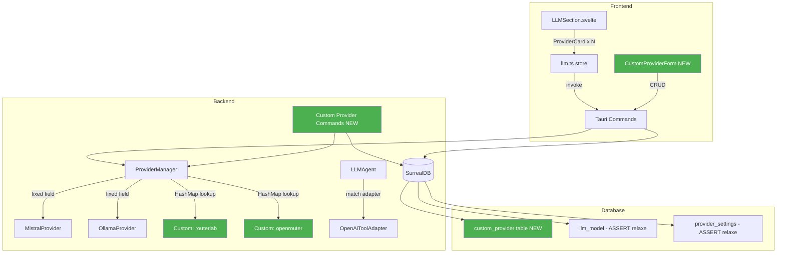

# Specification - Custom OpenAI-Compatible Providers (v3 - Option A')

## Metadata
- Date: 2026-02-12
- Stack: Svelte 5.49 + Rust 1.93 + Tauri 2.10 + SurrealDB 2.5
- Complexity: **complex**
- Branch: `feature/openai-compatible-provider`
- Revision: v3 - Added streaming, reasoning models, custom model management

## Context

**Demande**: Ajouter RouterLab.ch comme provider pour Kimi K2.5
**Option choisie**: Option A' - HashMap minimal pour providers custom dynamiques
**Contrainte absolue**: Zero regression sur Mistral/Ollama existants

**Objectif**: Permettre a l'utilisateur d'ajouter N providers OpenAI-compatible (RouterLab, OpenRouter, Together AI, etc.) sans toucher au code Mistral/Ollama.

**Perimetre**:
- Inclus: CRUD custom providers, tool calling, connection test, multi-provider simultane, streaming, reasoning models, custom model management
- Exclus: Embedding via custom provider

**Criteres Succes**:
- [ ] User peut ajouter un custom provider (nom + base URL + API key)
- [ ] User peut ajouter plusieurs custom providers simultanement
- [ ] User peut ajouter des modeles pour un custom provider et les utiliser dans des agents
- [ ] Tool calling fonctionne via boucle agent MCP
- [ ] Test de connexion valide l'endpoint
- [ ] Streaming fonctionne pour les custom providers (simulate_streaming, coherent avec Mistral/Ollama)
- [ ] Reasoning models supportes (content string OU array de content blocks)
- [ ] Custom models: user peut creer/editer/supprimer des modeles pour un custom provider via ModelForm
- [ ] Mistral et Ollama fonctionnent exactement comme avant

---

## Critique du Plan v1 (Self-Review)

Le plan v1 (Third Field) a ete rejete apres analyse via thinking-mcp:

| Probleme | Impact |
|----------|--------|
| Un seul endpoint OpenAI-compatible a la fois | Contradicts objectif "generic" |
| 23 fichiers pour 1 provider, re-23 pour le 4e | Ne scale pas |
| ~1200 lignes de code duplique (Provider + Adapter) | Maintenance lourde |
| Estimation "14h pour HashMap" inventee sans analyse | Biais d'ancrage |
| Spec de 500 lignes masquant une decision faible | Biais verbosity/confidence |

---

## Architecture Proposee (Option A')

### Principe: Hybrid Static + Dynamic

```
Mistral  ──► Arc<MistralProvider>  (champ fixe, INCHANGE)
Ollama   ──► Arc<OllamaProvider>   (champ fixe, INCHANGE)
Custom*  ──► HashMap<String, Arc<OpenAiCompatibleProvider>>  (dynamique)
```

Les chemins de code Mistral/Ollama restent **caractere pour caractere identiques**.
Le nouveau bras `Custom(name)` dans les match statements delegue au HashMap.

### Diagramme



### Decision: ProviderType Custom(String)

```rust
// AVANT
#[derive(Debug, Clone, Copy, PartialEq, Eq, Hash, Serialize, Deserialize)]
pub enum ProviderType {
    Mistral,
    Ollama,
}

// APRES
#[derive(Debug, Clone, PartialEq, Eq, Hash)]  // Copy REMOVED (String is not Copy)
pub enum ProviderType {
    Mistral,
    Ollama,
    Custom(String),  // e.g., Custom("routerlab"), Custom("openrouter")
}
```

**Impact de la perte de Copy**:
- Purement compile-time: ajouter `.clone()` la ou ProviderType est passe par valeur
- Zero impact runtime
- Le compilateur trouve tous les cas

**Serde custom** (serialize `Custom("routerlab")` comme `"routerlab"`, pas `{"Custom":"routerlab"}`):
```rust
impl Serialize for ProviderType {
    fn serialize<S: Serializer>(&self, s: S) -> Result<S::Ok, S::Error> {
        match self {
            ProviderType::Mistral => s.serialize_str("mistral"),
            ProviderType::Ollama => s.serialize_str("ollama"),
            ProviderType::Custom(name) => s.serialize_str(name),
        }
    }
}

impl<'de> Deserialize<'de> for ProviderType {
    // "mistral" -> Mistral, "ollama" -> Ollama, anything else -> Custom(s)
}
```

**Garantie zero regression des match existants**:
```rust
// AVANT (inchange a l'interieur)
match provider_type {
    ProviderType::Mistral => { /* CODE IDENTIQUE */ },
    ProviderType::Ollama => { /* CODE IDENTIQUE */ },
}

// APRES (seul ajout: le bras Custom)
match provider_type {
    ProviderType::Mistral => { /* CODE IDENTIQUE - PAS TOUCHE */ },
    ProviderType::Ollama => { /* CODE IDENTIQUE - PAS TOUCHE */ },
    ProviderType::Custom(ref name) => {
        // NOUVEAU: delegation au HashMap
        let providers = self.custom_providers.read().await;
        let custom = providers.get(name)
            .ok_or(LLMError::InvalidProvider(format!("Unknown provider: {}", name)))?
            .clone();
        // ... utilise custom
    }
}
```

---

## Composants

### Backend - Nouveaux fichiers

#### 1. NEW: `src-tauri/src/llm/openai_compatible.rs`

Provider HTTP generique pour toute API OpenAI-compatible.

```rust
pub struct OpenAiCompatibleProvider {
    api_key: Arc<RwLock<Option<String>>>,
    base_url: Arc<RwLock<Option<String>>>,
    provider_name: String,  // "routerlab", "openrouter", etc.
    http_client: Arc<reqwest::Client>,
}
```

**Methodes**:
- `new(name: &str, http_client)` - Cree un provider nomme non configure
- `configure(api_key, base_url)` - Configure
- `clear()`, `is_configured()`, `get_api_key()`, `get_base_url()`
- `complete()` - POST `{base_url}/chat/completions` avec Bearer auth
- `complete_with_tools()` - Idem avec tools (copie pattern de `mistral.rs:471-528`)
- `complete_stream()` - Via `simulate_streaming()` (coherent avec Mistral/Ollama)
- `test_connection()` - GET `{base_url}/models` avec Bearer token

**Implementation**: Extraire la logique HTTP de `mistral.rs` (methodes `custom_complete` et `complete_with_tools`) en parametrant:
- URL: `self.base_url` au lieu de `MISTRAL_API_URL` constant
- Erreurs: `self.provider_name` au lieu de `"Mistral"` hardcode
- ProviderType: `ProviderType::Custom(self.provider_name.clone())`

**Streaming**: `complete_stream()` utilise `simulate_streaming()` de `utils.rs`, exactement comme Mistral et Ollama le font actuellement (les deux providers existants simulent le streaming via chunking de la reponse complete).

```rust
async fn complete_stream(...) -> Result<mpsc::Receiver<Result<String, LLMError>>, LLMError> {
    let response = self.complete(prompt, system_prompt, model, temperature, max_tokens).await?;
    Ok(simulate_streaming(response.content, None, None))
}
```

**Reasoning Models**: Reutiliser le `deserialize_content` custom deserializer de `mistral.rs:168-226`. Ce deserializer gere les deux formats de reponse:
- Format standard: `"content": "string"` -> retourne le string
- Format reasoning: `"content": [{"type": "thinking", ...}, {"type": "text", "text": "answer"}]` -> extrait le texte, ignore les blocs thinking

Le deserializer est utilise dans la struct `OpenAiResponseMessage` (equivalente de `MistralResponseMessage`):
```rust
/// Response types reutilisees de mistral.rs (extraites dans ce fichier ou partagees)
#[derive(Debug, Deserialize)]
struct OpenAiResponseMessage {
    #[allow(dead_code)]
    role: String,
    #[serde(deserialize_with = "deserialize_content")]
    content: String,
}
```

**Note**: Le `deserialize_content` et les types `ContentBlock`/`TextBlock` seront **copies** dans ce fichier (pas extraits dans un module partage) pour eviter de toucher `mistral.rs`. C'est ~60 lignes de duplication acceptable pour garantir zero regression.

#### 2. NEW: `src-tauri/src/llm/adapters/openai_adapter.rs`

Tool adapter OpenAI standard. Seule difference avec MistralToolAdapter: `tool_choice`.

```rust
#[derive(Debug, Clone, Default)]
pub struct OpenAiToolAdapter;

impl ProviderToolAdapter for OpenAiToolAdapter {
    fn get_tool_choice(&self, mode: ToolChoiceMode) -> Value {
        match mode {
            ToolChoiceMode::Auto => json!("auto"),
            ToolChoiceMode::Required => json!("required"),  // "required" (pas "any" comme Mistral)
            ToolChoiceMode::None => json!("none"),
        }
    }
    // Toutes les autres methodes: identiques a MistralToolAdapter
}
```

#### 3. NEW: `src-tauri/src/commands/custom_provider.rs`

CRUD pour les custom providers.

```rust
/// Metadata d'un provider (builtin ou custom)
#[derive(Serialize, Clone)]
#[serde(rename_all = "camelCase")]
pub struct ProviderInfo {
    pub id: String,           // "mistral", "ollama", "routerlab"
    pub display_name: String, // "Mistral", "Ollama", "RouterLab"
    pub is_builtin: bool,
    pub is_cloud: bool,
    pub requires_api_key: bool,
    pub has_base_url: bool,
    pub base_url: Option<String>,
    pub enabled: bool,
}

#[tauri::command]
pub async fn list_providers(state: State<'_, AppState>) -> Result<Vec<ProviderInfo>, String>
// Retourne builtins (Mistral, Ollama) + custom providers depuis DB

#[tauri::command]
pub async fn create_custom_provider(
    name: String,           // URL-safe: "routerlab"
    display_name: String,   // Human: "RouterLab"
    base_url: String,       // "https://api.routerlab.ch/v1"
    api_key: String,        // Stored in SecureKeyStore
    state: State<'_, AppState>,
) -> Result<ProviderInfo, String>
// 1. Validate name (alphanum + hyphens, not "mistral"/"ollama")
// 2. Insert into custom_provider table
// 3. Store API key in SecureKeyStore (key = name)
// 4. Create OpenAiCompatibleProvider + add to HashMap
// 5. Initialize circuit breaker

#[tauri::command]
pub async fn update_custom_provider(
    name: String,
    display_name: Option<String>,
    base_url: Option<String>,
    api_key: Option<String>,
    enabled: Option<bool>,
    state: State<'_, AppState>,
) -> Result<ProviderInfo, String>

#[tauri::command]
pub async fn delete_custom_provider(
    name: String,
    state: State<'_, AppState>,
) -> Result<(), String>
// 1. Check no models reference this provider (or warn)
// 2. Remove from DB
// 3. Remove from SecureKeyStore
// 4. Remove from HashMap
```

#### 4. NEW: `src-tauri/src/models/custom_provider.rs`

```rust
#[derive(Debug, Clone, Serialize, Deserialize)]
#[serde(rename_all = "camelCase")]
pub struct CustomProvider {
    pub name: String,
    pub display_name: String,
    pub base_url: String,
    pub enabled: bool,
    pub created_at: Option<String>,
}
```

**Note sur le reasoning**: Le support des reasoning models est **automatique** grace au `deserialize_content` polymorphe. Pas besoin de flag `supports_reasoning` sur le provider ou le modele. Le deserializer gere les deux formats de reponse (string simple OU array de content blocks) sans configuration.

**Custom Model Management**: Les modeles pour custom providers sont geres via les commandes CRUD existantes (`create_model`, `update_model`, `delete_model`). La seule modification est la relaxation de l'ASSERT sur le champ `provider` de `llm_model` (voir section 10). Le workflow utilisateur:
1. Creer un custom provider (name: "routerlab", base_url: "https://api.routerlab.ch/v1")
2. Aller dans Settings > Models > Add Model
3. Selectionner provider "RouterLab" dans le dropdown (dynamique)
4. Saisir le model ID: "kimi-k2.5"
5. Le modele est disponible dans les agents/workflows

---

### Backend - Fichiers modifies

#### 5. MODIFY: `src-tauri/src/llm/provider.rs`

**Changements**:
- ProviderType: ajouter `Custom(String)`, retirer `Copy`, custom Serialize/Deserialize
- Display: `Custom(name) => write!(f, "{}", name)`
- FromStr: `"mistral" -> Mistral`, `"ollama" -> Ollama`, `other -> Custom(other)`
- Tests: adapter les tests existants (ajout .clone() si necessaire)

#### 6. MODIFY: `src-tauri/src/models/llm_models.rs`

Memes changements que `provider.rs` sur le second enum ProviderType.
Display lowercase: `Custom(name) => write!(f, "{}", name)`.

**Note**: Les deux enums doivent rester synchronises. Unification en un seul enum = future task.

#### 7. MODIFY: `src-tauri/src/llm/manager.rs`

**7a. Struct** - ajouter champ dynamique:
```rust
pub struct ProviderManager {
    mistral: Arc<MistralProvider>,         // INCHANGE
    ollama: Arc<OllamaProvider>,           // INCHANGE
    custom_providers: Arc<RwLock<HashMap<String, Arc<OpenAiCompatibleProvider>>>>,  // NEW
    config: Arc<RwLock<ProviderConfig>>,   // INCHANGE
    http_client: Arc<reqwest::Client>,     // INCHANGE
    retry_config: RetryConfig,             // INCHANGE
    circuit_breakers: Arc<RwLock<HashMap<ProviderType, CircuitBreaker>>>,  // INCHANGE
}
```

**7b. Nouvelles methodes**:
```rust
pub async fn register_custom_provider(&self, name: &str, provider: Arc<OpenAiCompatibleProvider>)
pub async fn unregister_custom_provider(&self, name: &str)
pub async fn get_custom_provider(&self, name: &str) -> Option<Arc<OpenAiCompatibleProvider>>
pub fn http_client_ref(&self) -> Arc<reqwest::Client>  // Pour creer des providers
```

**7c. Match statements** - ajouter bras `Custom(ref name)` dans CHAQUE match:

| Methode | Ligne | Bras Custom |
|---------|-------|-------------|
| `set_active_provider()` | 251 | `Custom(ref n) => custom_providers.get(n).map(|p| p.is_configured()).unwrap_or(false)` |
| `set_default_model()` | 298 | `Custom(_) => {}` (no-op, gere en DB) |
| `get_default_model()` | 309 | `Custom(_) => String::new()` |
| `get_available_models()` | 317 | `Custom(_) => vec![]` (modeles geres via CRUD) |
| `is_provider_configured()` | 325 | `Custom(ref n) => custom_providers.get(n).map(|p| p.is_configured()).unwrap_or(false)` |
| `get_configured_providers()` | 335 | Iterer sur custom_providers, ajouter les configures |
| `complete()` | 393 | Lookup + with_retry (meme pattern que Mistral) |
| `complete_with_provider()` | 462 | Idem |
| `complete_with_tools()` | 554 | Idem (tool_choice est passe au provider) |
| `complete_stream()` | 632 | Lookup + complete_stream (simulate_streaming, meme pattern que Mistral/Ollama) |

**Invariant**: Les bras `Mistral =>` et `Ollama =>` ne sont PAS modifies. Seul le `Custom` bras est ajoute.

**7d. ProviderConfig model resolution pour Custom**:

Le `ProviderConfig` actuel a des champs hardcodes `mistral_model` et `ollama_model`. Pour les custom providers, la resolution du modele par defaut passe par la DB (table `provider_settings`), pas par `ProviderConfig`. Dans `complete_stream()` et `complete()`, le bras Custom recupere le modele depuis le parametre `model` (toujours fourni par l'agent/workflow). Le fallback `config.mistral_model` / `config.ollama_model` ne s'applique pas aux custom providers:

```rust
// Dans complete_stream / complete (model resolution):
let model_str = model
    .map(|m| m.to_string())
    .unwrap_or_else(|| match provider {
        ProviderType::Mistral => config.mistral_model.clone(),
        ProviderType::Ollama => config.ollama_model.clone(),
        ProviderType::Custom(_) => String::new(),  // Model MUST be specified for custom
    });
```

#### 8. MODIFY: `src-tauri/src/agents/llm_agent.rs`

Ligne ~1127: ajouter adapter custom:
```rust
let adapter: Box<dyn ProviderToolAdapter> = match provider_type {
    ProviderType::Mistral => Box::new(MistralToolAdapter::new()),   // INCHANGE
    ProviderType::Ollama => Box::new(OllamaToolAdapter::new()),     // INCHANGE
    ProviderType::Custom(_) => Box::new(OpenAiToolAdapter::new()),  // NEW
};
```

#### 9. MODIFY: `src-tauri/src/commands/models.rs`

- Remplacer `VALID_MODEL_PROVIDERS` constant par validation dynamique:
```rust
fn is_valid_provider(provider: &str, state: &AppState) -> bool {
    matches!(provider, "mistral" | "ollama")
        || state.llm_manager.has_custom_provider(provider)  // NEW: check HashMap
}
```
- `test_provider_connection()`: ajouter branche pour custom providers:
```rust
_ => {
    // Custom provider: get from manager
    let custom = state.llm_manager.get_custom_provider(&provider).await
        .ok_or(format!("Unknown provider: {}", provider))?;
    custom.test_connection().await
}
```

#### 10. MODIFY: `src-tauri/src/db/schema.rs`

**Supprimer les ASSERT constraints** sur le champ provider (validation en code Rust):
```sql
-- AVANT
DEFINE FIELD OVERWRITE provider ON llm_model TYPE string
    ASSERT $value IN ['mistral', 'ollama'];
-- APRES
DEFINE FIELD OVERWRITE provider ON llm_model TYPE string
    ASSERT string::len($value) > 0 AND string::len($value) <= 64;
```

Idem pour `provider_settings`.

**Nouvelle table `custom_provider`**:
```sql
DEFINE TABLE OVERWRITE custom_provider SCHEMAFULL;
DEFINE FIELD OVERWRITE name ON custom_provider TYPE string
    ASSERT string::len($value) > 0 AND string::len($value) <= 64;
DEFINE FIELD OVERWRITE display_name ON custom_provider TYPE string
    ASSERT string::len($value) > 0 AND string::len($value) <= 128;
DEFINE FIELD OVERWRITE base_url ON custom_provider TYPE string
    ASSERT string::len($value) > 0 AND string::len($value) <= 512;
DEFINE FIELD OVERWRITE enabled ON custom_provider TYPE bool DEFAULT true;
DEFINE FIELD OVERWRITE created_at ON custom_provider TYPE datetime DEFAULT time::now();
DEFINE INDEX OVERWRITE unique_custom_provider_name ON custom_provider FIELDS name UNIQUE;
```

#### 11. MODIFY: `src-tauri/src/state.rs`

**`initialize_providers_from_config()`**: Ajouter chargement des custom providers depuis DB:
```rust
// After Mistral/Ollama init (INCHANGE):
// Load custom providers from DB
let custom_providers = self.load_custom_providers_from_db().await;
for cp in custom_providers {
    if let Some(api_key) = keystore.get_key(&cp.name) {
        if !api_key.is_empty() {
            let provider = Arc::new(
                OpenAiCompatibleProvider::new(&cp.name, self.llm_manager.http_client_ref())
            );
            if let Err(e) = provider.configure(&api_key, &cp.base_url).await {
                tracing::warn!(name = %cp.name, error = %e, "Failed to init custom provider");
            } else {
                self.llm_manager.register_custom_provider(&cp.name, provider).await;
                tracing::info!(name = %cp.name, "Custom provider initialized");
            }
        }
    }
}
```

#### 12. MODIFY: Autres fichiers backend

| Fichier | Changement |
|---------|-----------|
| `src-tauri/src/llm/mod.rs` | +mod openai_compatible, +pub use |
| `src-tauri/src/llm/adapters/mod.rs` | +mod openai_adapter, +pub use |
| `src-tauri/src/models/mod.rs` | +mod custom_provider, +pub use |
| `src-tauri/src/commands/mod.rs` | +pub mod custom_provider |
| `src-tauri/src/main.rs` | +4 commands dans invoke_handler |
| `src-tauri/src/tools/constants.rs` | Supprimer `VALID_MODEL_PROVIDERS` (validation dynamique) |

---

### Frontend

#### 13. MODIFY: `src/types/llm.ts`

```typescript
// Remplacer literal union par string (extensible)
export type BuiltinProvider = 'mistral' | 'ollama';
export type ProviderType = BuiltinProvider | string;

// LLMState: Record dynamique au lieu de champs fixes
export interface LLMState {
    providers: Record<string, ProviderSettings | null>;
    // ...reste inchange
}
```

**Compatibilite**: `llmState.providers['mistral']` fonctionne comme avant. `llmState.providers.mistral` aussi (TS permet dot notation sur Record<string>).

#### 14. NEW: `src/types/customProvider.ts`

```typescript
export interface ProviderInfo {
    id: string;
    displayName: string;
    isBuiltin: boolean;
    isCloud: boolean;
    requiresApiKey: boolean;
    hasBaseUrl: boolean;
    baseUrl: string | null;
    enabled: boolean;
}

export interface CreateCustomProviderRequest {
    name: string;
    displayName: string;
    baseUrl: string;
    apiKey: string;
}
```

#### 15. MODIFY: `src/lib/stores/llm.ts`

**Chargement dynamique** au lieu de 2 appels hardcodes:
```typescript
// AVANT
const [mistral, ollama, models] = await Promise.all([
    loadProviderSettings('mistral'),
    loadProviderSettings('ollama'),
    loadModels(),
]);

// APRES
const providers = await invoke<ProviderInfo[]>('list_providers');
const [settingsResults, models] = await Promise.all([
    Promise.all(providers.map(p => loadProviderSettings(p.id))),
    loadModels(),
]);
// Populate providers Record dynamiquement
```

**Initial state**: `providers: {}` (Record vide, populé au chargement)

#### 16. MODIFY: `src/lib/validation/schemas.ts`

```typescript
// Remplacer enum fixe par string avec validation minimale
export const ProviderTypeSchema = z.string().min(1).max(64);
```

#### 17. MODIFY: `src/lib/components/settings/LLMSection.svelte`

**Dynamiser les provider cards**:
```svelte
<script>
    // Charger la liste des providers depuis le backend
    let providerList = $state<ProviderInfo[]>([]);
    // ...load via invoke('list_providers')
</script>

<!-- Builtin cards (design existant) -->
{#each providerList.filter(p => p.isBuiltin) as provider (provider.id)}
    <ProviderCard provider={provider.id} ... />
{/each}

<!-- Custom providers section -->
{#if providerList.some(p => !p.isBuiltin)}
    <h3>{$i18n('llm_custom_providers')}</h3>
    {#each providerList.filter(p => !p.isBuiltin) as provider (provider.id)}
        <ProviderCard provider={provider.id} displayName={provider.displayName} ... />
    {/each}
{/if}

<!-- Bouton ajouter custom provider -->
<Button onclick={openAddCustomProviderModal}>
    {$i18n('llm_add_custom_provider')}
</Button>
```

#### 18. NEW: `src/lib/components/settings/CustomProviderForm.svelte`

Formulaire modal pour ajouter/editer un custom provider:
- Champ: Name (identifiant URL-safe, auto-genere depuis display_name)
- Champ: Display Name (nom affiche)
- Champ: Base URL (avec placeholder "https://api.routerlab.ch/v1")
- Champ: API Key (masque)
- Bouton: Test Connection
- Bouton: Save

#### 19. MODIFY: `src/lib/components/llm/ProviderCard.svelte`

Adapter pour accepter un `displayName` prop optionnel (custom providers):
```svelte
interface Props {
    provider: string;            // provider id
    displayName?: string;        // override i18n for custom providers
    // ...existing props
}

// Display name logic:
const name = $derived(
    displayName ?? $i18n(getProviderNameKey(provider))
);

function getProviderNameKey(provider: string): string {
    switch (provider) {
        case 'mistral': return 'llm_provider_mistral';
        case 'ollama': return 'llm_provider_ollama';
        default: return 'llm_provider_type';  // fallback, utilise displayName
    }
}
```

#### 20. MODIFY: `src/lib/components/llm/ModelForm.svelte`

Provider dropdown dynamique depuis `list_providers`:
```typescript
// AVANT: hardcode
const providerOptions = [
    { value: 'mistral', label: $i18n('llm_provider_mistral') },
    { value: 'ollama', label: $i18n('llm_provider_ollama') }
];

// APRES: dynamique
const providerOptions = $derived(
    providerList.map(p => ({ value: p.id, label: p.displayName }))
);
```

#### 21. MODIFY: `src/lib/components/settings/agents/AgentForm.svelte`

Meme logique dynamique pour le dropdown provider.

**Attention**: AgentForm utilise des valeurs capitalisees (`'Mistral'`, `'Ollama'`). C'est le Display de `provider.rs` (capitalized). Pour Custom, le Display est le nom du provider.

#### 22. MODIFY: Autres fichiers frontend

| Fichier | Changement |
|---------|-----------|
| `src/types/importExport.ts` | `provider: string` (au lieu de literal union) |
| `src/messages/en.json` | +8 i18n keys (custom provider section) |
| `src/messages/fr.json` | +8 i18n keys |
| `src/lib/components/settings/APIKeysSection.svelte` | Gerer custom providers (API key + base_url) |
| `src/lib/components/settings/memory/MemorySettings.svelte` | NE PAS toucher (embedding reste mistral/ollama) |

#### i18n keys a ajouter

```json
{
    "llm_custom_providers": "Custom Providers",
    "llm_add_custom_provider": "Add Provider",
    "llm_custom_provider_name": "Provider Name",
    "llm_custom_provider_display_name": "Display Name",
    "llm_custom_provider_base_url": "API Base URL",
    "llm_custom_provider_api_key": "API Key",
    "llm_custom_provider_test": "Test Connection",
    "llm_custom_provider_delete_confirm": "Delete this provider? Models using it will stop working."
}
```

---

## Types Synchronises

### Frontend (`src/types/llm.ts`)
```typescript
export type BuiltinProvider = 'mistral' | 'ollama';
export type ProviderType = BuiltinProvider | string;
```

### Backend (`provider.rs` + `llm_models.rs` - les DEUX enums)
```rust
#[derive(Debug, Clone, PartialEq, Eq, Hash)]  // pas Copy
pub enum ProviderType {
    Mistral,
    Ollama,
    Custom(String),
}
// Custom serde: "mistral" <-> Mistral, "routerlab" <-> Custom("routerlab")
```

### Database
```sql
-- provider field: string libre (validation en code Rust)
-- custom_provider table: definitions des providers custom
```

---

## Plan d'Implementation

### Phase 1: Backend Foundation

**Objectif**: ProviderType Custom(String) + OpenAiCompatibleProvider (avec streaming + reasoning) + OpenAiToolAdapter

1. `provider.rs`: Ajouter Custom(String), retirer Copy, custom serde, adapter Display/FromStr
2. `llm_models.rs`: Memes changements sur le second ProviderType
3. Creer `openai_compatible.rs`:
   - struct OpenAiCompatibleProvider
   - Copier `deserialize_content` + `ContentBlock` + `TextBlock` depuis `mistral.rs` (support reasoning)
   - Response types: `OpenAiChatResponse`, `OpenAiResponseMessage` (avec `#[serde(deserialize_with = "deserialize_content")]`)
   - impl complete() - POST `{base_url}/chat/completions` avec Bearer auth + reasoning-aware deserializer
   - impl complete_with_tools() - POST avec tools (copie pattern mistral.rs)
   - impl complete_stream() - via `simulate_streaming()` (identique Mistral/Ollama)
   - test_connection() - GET `{base_url}/models`
4. Creer `openai_adapter.rs`: OpenAiToolAdapter (tool_choice "required" au lieu de "any")
5. `mod.rs` + `adapters/mod.rs`: exports
6. Fixer toutes les erreurs de compilation (Copy -> Clone, match exhaustif)

**Validation**: `cargo check` passe (warnings match attendus dans manager.rs)

### Phase 2: Backend Integration

**Objectif**: Integrer dans Manager, Commands, DB, State

1. `manager.rs`: Ajouter custom_providers HashMap + methodes + tous les match arms Custom
2. `llm_agent.rs`: Adapter match arm
3. Creer `custom_provider.rs` (model): struct CustomProvider
4. Creer `commands/custom_provider.rs`: list_providers, create/update/delete_custom_provider
5. `commands/models.rs`: Validation dynamique, test_provider_connection custom
6. `db/schema.rs`: Nouvelle table custom_provider + relaxer ASSERT
7. `state.rs`: Charger custom providers au demarrage
8. `main.rs` + `commands/mod.rs`: Enregistrer nouvelles commandes

**Validation**: `cargo clippy -- -D warnings` + `cargo test`

### Phase 3: Frontend

**Objectif**: UI dynamique pour les providers

1. `types/llm.ts`: ProviderType string, LLMState Record dynamique
2. Creer `types/customProvider.ts`: ProviderInfo, CreateCustomProviderRequest
3. `validation/schemas.ts`: ProviderType string validation
4. `stores/llm.ts`: Chargement dynamique depuis list_providers
5. i18n: Ajouter keys FR + EN
6. `LLMSection.svelte`: Cards dynamiques + section custom providers
7. Creer `CustomProviderForm.svelte`: Formulaire modal CRUD
8. `ProviderCard.svelte`: Prop displayName optionnel, fallback i18n
9. `ModelForm.svelte`: Dropdown dynamique
10. `AgentForm.svelte`: Dropdown dynamique
11. `APIKeysSection.svelte`: Gerer custom providers
12. `importExport.ts`: provider: string

**Validation**: `npm run lint && npm run check`

### Phase 4: E2E + Cleanup

1. Configurer RouterLab (base_url: `https://api.routerlab.ch/v1`)
2. Ajouter modele kimi-k2.5 via Settings > Models > Add Model (provider = "routerlab")
3. Test connexion via bouton "Test Connection"
4. Creer agent avec modele kimi-k2.5 + workflow + completion simple
5. Verifier streaming (simulate_streaming fonctionne dans la UI)
6. Verifier tool calling MCP avec le custom provider
7. Si possible, tester un modele reasoning (content array) ou verifier via unit test
8. Verifier Mistral/Ollama non impactes (completion simple + tool calling)
9. Cleanup: pas de console.log, unwrap(), any

---

## Estimation

| Phase | Effort | Risque |
|-------|--------|--------|
| 1: Foundation (ProviderType + OpenAiCompatible + adapter) | 2h | Faible (compile-time) |
| 2: Integration (Manager + Commands + DB + State) | 3h | Faible (additif) |
| 3: Frontend (UI dynamique + CustomProviderForm + ModelForm) | 3h | Faible (dynamisation) |
| 4: E2E + RouterLab test | 1h | Moyen (API externe) |
| **Total** | **9h** | |

Note: Streaming et reasoning n'ajoutent pas de temps significatif car:
- Streaming = `simulate_streaming()` (3 lignes, copie du pattern Mistral/Ollama)
- Reasoning = copie de `deserialize_content` (~60 lignes deja ecrites dans `mistral.rs`)
- Custom models = aucun nouveau code (CRUD existant + ASSERT relaxe)

---

## Risques

| Risque | Probabilite | Impact | Mitigation |
|--------|-------------|--------|------------|
| Copy removal casse des tests existants | Haute | Basse | Mecanique: ajouter .clone(), compiler guide |
| Custom serde ProviderType incorrect | Moyenne | Haute | Tests unitaires serialize/deserialize |
| Dual ProviderType enum desynchronise | Moyenne | Haute | Modifier les deux dans la meme PR |
| DB migration ASSERT removal | Faible | Moyenne | DEFINE FIELD OVERWRITE est idempotent |
| RouterLab API non 100% compatible | Faible | Moyenne | test_connection avant utilisation |
| Reasoning deserializer diverge du format API | Faible | Basse | Deserializer polymorphe gere string ET array, fallback safe |
| Provider retourne format reasoning inattendu | Faible | Basse | `deserialize_any` gere les cas non reconnus gracieusement |

---

## Fichiers - Resume

### Nouveaux (5)
| Fichier | Role |
|---------|------|
| `src-tauri/src/llm/openai_compatible.rs` | Provider HTTP generique |
| `src-tauri/src/llm/adapters/openai_adapter.rs` | Tool adapter OpenAI standard |
| `src-tauri/src/commands/custom_provider.rs` | CRUD commands |
| `src-tauri/src/models/custom_provider.rs` | Data model |
| `src/lib/components/settings/CustomProviderForm.svelte` | Formulaire UI |

### Modifies - Backend (12)
| Fichier | Nature du changement |
|---------|---------------------|
| `llm/provider.rs` | Custom(String) + custom serde + remove Copy |
| `models/llm_models.rs` | Idem sur 2e enum |
| `llm/mod.rs` | +exports |
| `llm/adapters/mod.rs` | +exports |
| `llm/manager.rs` | +HashMap field + methodes + match arms Custom |
| `agents/llm_agent.rs` | +1 match arm adapter |
| `commands/models.rs` | Validation dynamique + test custom |
| `commands/mod.rs` | +pub mod custom_provider |
| `db/schema.rs` | +table custom_provider, relaxer ASSERT |
| `state.rs` | +init custom providers from DB |
| `main.rs` | +command registrations |
| `tools/constants.rs` | Supprimer VALID_MODEL_PROVIDERS ou dynamiser |

### Modifies - Frontend (11)
| Fichier | Nature du changement |
|---------|---------------------|
| `types/llm.ts` | ProviderType string, Record dynamique |
| `types/customProvider.ts` | NEW type file |
| `types/importExport.ts` | provider: string |
| `validation/schemas.ts` | String validation |
| `stores/llm.ts` | Chargement dynamique |
| `messages/en.json` | +8 i18n keys |
| `messages/fr.json` | +8 i18n keys |
| `components/settings/LLMSection.svelte` | Cards dynamiques |
| `components/llm/ProviderCard.svelte` | +displayName prop |
| `components/llm/ModelForm.svelte` | Dropdown dynamique |
| `components/settings/agents/AgentForm.svelte` | Dropdown dynamique |

### Total: 5 nouveaux + 23 modifies = 28 fichiers

---

## Avantages vs Plan v1

| Critere | Plan v1 (Third Field) | Plan v2 (A' HashMap) |
|---------|----------------------|---------------------|
| Providers simultanes | 1 seul | N illimites |
| Ajout d'un provider | Recompilation | Runtime (UI) |
| Duplication code | ~1200 lignes | ~500 lignes (1 provider generique) |
| Scalabilite | Lineaire (23 fichiers/provider) | O(1) apres setup initial |
| Frontend | Hardcode x3 | Dynamique |
| Regression Mistral/Ollama | Match arms intacts | Match arms intacts |

---

## Limitations

- Pas d'embedding via custom providers (embedding reste Mistral/Ollama)
- Custom providers = OpenAI-compatible uniquement (meme format API)
- Streaming = simulation (chunking de la reponse complete, identique a Mistral/Ollama actuels)

## Future

- **v2**: True SSE streaming (parsing EventSource depuis `{base_url}/chat/completions?stream=true`) pour tous les providers
- **v2**: Custom adapter par provider (pas seulement OpenAI - e.g. Anthropic format)
- **v2**: Unification des deux enums ProviderType en un seul enum partage
